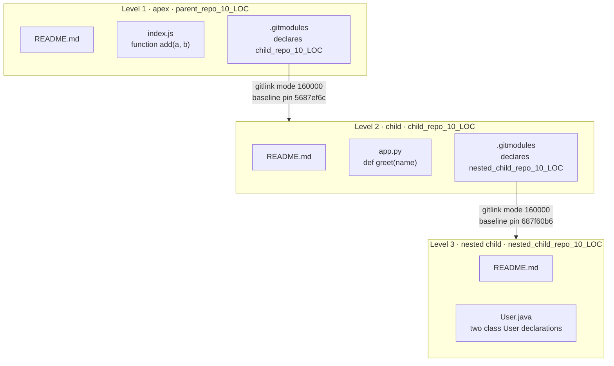
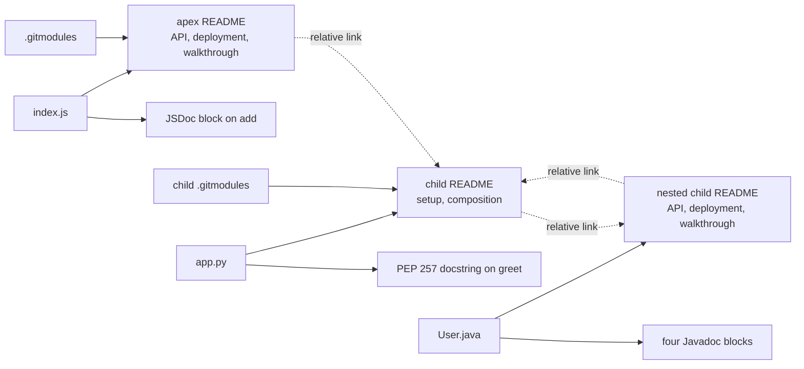
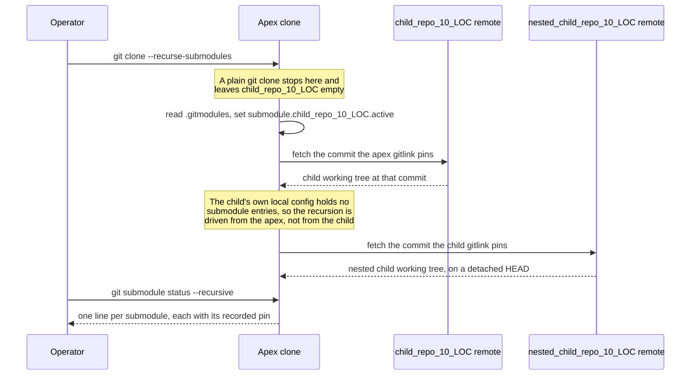
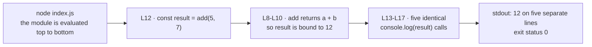

# parent_repo_10_LOC

**Contents**

- [Overview and Repository Composition](#overview-and-repository-composition)
- [Setup Instructions](#setup-instructions)
- [API Documentation](#api-documentation)
- [Deployment Guide](#deployment-guide)
- [Inline Code Explanations](#inline-code-explanations)
- [Known Issues](#known-issues)
- [Related Repositories](#related-repositories)

## Overview and Repository Composition

`parent_repo_10_LOC` is the **apex**: the outermost of the three repositories joined by Git submodule links in this project. Its tracked project content is one JavaScript module, this README, and one submodule declaration, beside the gitlink that points at the **child**.

```text
parent_repo_10_LOC/
├── README.md
├── index.js
├── .gitmodules
└── child_repo_10_LOC/
    ├── README.md
    ├── app.py
    ├── .gitmodules
    └── nested_child_repo_10_LOC/
        ├── README.md
        └── User.java
```

The composition is **three levels deep with one language per level**. Each level documents its own program in its own README, at the location the tree above shows, using its own language's doc-comment convention:

| Level | Repository | Language | Program | Doc comment convention |
|---|---|---|---|---|
| Apex | `parent_repo_10_LOC` | JavaScript | `index.js` | JSDoc |
| Child | `child_repo_10_LOC` | Python | `app.py` | PEP 257 docstring |
| Nested child | `nested_child_repo_10_LOC` | Java | `User.java` | Javadoc |

Ten entries are tracked across the three repositories: eight file blobs — the three READMEs, `index.js`, `app.py`, `User.java`, and the two `.gitmodules` files — and the two gitlinks that join the levels.

Each link between levels is a **gitlink**: a tree entry with Git mode `160000` whose value is a single commit SHA of the linked repository rather than a file blob, so a composed checkout receives exactly the commit that pin names. Read the pin this repository records with:

```bash
git ls-tree HEAD child_repo_10_LOC
```

which prints the mode `160000`, the object type `commit`, the pinned SHA, and the path. That pin advances whenever this repository re-stages the `child_repo_10_LOC` path after a new commit is made in the child, so the command above — and not any SHA quoted in prose — is the authoritative source for the current value. The pin recorded before this documentation was added is `5687ef6c3fdbdf361df830fcd78a2dbdcdb2b80a`, and the pin the child recorded for the nested child before its documentation was added is `687f60b6c74818ac7cd14413840d73fdfb5fe450`.

The three programs are **independent, with no runtime coupling between the levels**. `index.js` performs no `require`, declares no `module.exports` and no `export`, and neither imports nor is imported by anything `[index.js:L1-L17]`; nothing in it invokes or is invoked by the child's Python program or the nested child's Java program, and the only interface any of the three exposes is standard output. The submodule links compose source trees, not a call graph.

### Composition topology



### Documentation artifact map

Solid edges show where each document's content is derived from; dotted edges are the relative links that join the three READMEs.



## Setup Instructions

Setup is acquisition only. No file in the composition declares a dependency — there is no dependency manifest at any of the three levels — so nothing is installed beyond the runtimes named below.

### Prerequisites

| Prerequisite | Version floor | Evidence | Needed for |
|---|---|---|---|
| Node.js | ES2015 | The block-scoped `const` at `[index.js:L12]`, the only post-ES5 construct in the module | This repository |
| CPython | 3.6 or later | The f-string at `[child_repo_10_LOC/app.py:L10]`, the release in which f-strings became available | The child only |
| A JDK providing `javac` and `java` | No meaningful floor | `[child_repo_10_LOC/nested_child_repo_10_LOC/User.java]` uses only `String` locals and `System.out.println`, both Java 1.0-era constructs | The nested child only |

Nothing in the composition declares a runtime or toolchain version: there is no `.nvmrc`, `.python-version`, `.tool-versions`, `.java-version`, `package.json`, `pyproject.toml`, `pom.xml`, or `build.gradle` at any level. **No concrete release is therefore asserted here.** Each floor above is the language level the source itself implies, and nothing more. Only Node.js is a prerequisite of this repository; the other two rows are listed so that a reader of the apex knows what acquiring the whole composition requires, and each level's own README states its own prerequisite.

A version floor is a statement about the language level alone, and **not** a statement that a level runs. The apex program does; the other two do not, as recorded under Deployment Guide and Known Issues below.

### The submodule declarations

`.gitmodules` in this repository is the authoritative declaration of the child's submodule name, checkout path, and clone URL, and the child's own `.gitmodules` does the same for the nested child. The documentation reads both and edits neither.

```text
[submodule "child_repo_10_LOC"]
	path = child_repo_10_LOC
	url = https://github.com/lakshya-blitzy/child_repo_10_LOC.git
```

| Declaration file | Key | Value |
|---|---|---|
| `.gitmodules` | `submodule "child_repo_10_LOC".path` | `child_repo_10_LOC` |
| `.gitmodules` | `submodule "child_repo_10_LOC".url` | `https://github.com/lakshya-blitzy/child_repo_10_LOC.git` |
| `child_repo_10_LOC/.gitmodules` | `submodule "nested_child_repo_10_LOC".path` | `nested_child_repo_10_LOC` |
| `child_repo_10_LOC/.gitmodules` | `submodule "nested_child_repo_10_LOC".url` | `https://github.com/lakshya-blitzy/nested_child_repo_10_LOC.git` |

Each declaration carries a `path` key and a `url` key and **no `branch` key**, which is what makes `git submodule update` check out the pinned commit itself rather than a branch containing it.

### Recursive acquisition

Acquire all three levels in one step:

```bash
git clone --recurse-submodules https://github.com/lakshya-blitzy/parent_repo_10_LOC.git
```

A **plain** `git clone` of this repository is not sufficient: it creates `child_repo_10_LOC/` as an empty directory, because cloning does not populate submodules. In an already-cloned checkout, initialize both levels from the apex working tree:

```bash
git submodule update --init --recursive
```

Each submodule hop is a separate fetch against a separate remote, so the network must reach `github.com` once for this repository, once for the child, and once again for the nested child.

Beside the tracked content listed above, a checkout also carries Git's own metadata, which is not project content: a `.git` directory here, and a `.git` file holding a `gitdir:` pointer inside each submodule working tree.

### Acquisition sequence



### Verification

```bash
git submodule status --recursive
```

The command prints one line per submodule in the recursion — `child_repo_10_LOC` and `child_repo_10_LOC/nested_child_repo_10_LOC` — each carrying that submodule's recorded pin and a leading prefix character:

| Prefix | Meaning |
|---|---|
| space | The entry is initialized and its checked-out commit matches the pin its consumer records |
| `-` | The recursive view treats the entry as uninitialized |
| `+` | The checked-out commit differs from the pin its consumer records |

Two behaviours are worth stating before they surprise anyone.

- **Recursion is reliably driven from the apex rather than from the child.** The child's own local Git configuration holds no `submodule.*` entries: `git config --local --get-regexp '^submodule\.'`, run inside `child_repo_10_LOC`, returns nothing. This repository's configuration does hold `submodule.child_repo_10_LOC.active`. The child therefore does not know that its own submodule should be active, and `git submodule status --recursive` run from here reports the nested entry with a **leading `-`** — the recursive view treats it as uninitialized even when the nested working tree is present on disk.
- **A recursive checkout lands on a detached HEAD in the nested child.** Neither declaration above carries a `branch` key, so the pinned commit is checked out directly. `git status -b` in that directory then reports `## HEAD (no branch)`, and a commit made in that state is reachable from no branch.

## API Documentation

This repository owns the JavaScript API of the composition. The Python API belongs to the child and the Java API to the nested child, and neither is restated here; both are reached through the link under Related Repositories below.

`index.js` declares **one unit**: the function `add`. The module performs no `require`, declares no `module.exports` and no `export`, and carries no `"use strict"` directive, so nothing can be imported from it — the public surface is the module's own scope plus what it writes to standard output.

| Unit | Kind | Location | Signature | Doc comment |
|---|---|---|---|---|
| `add` | function | `[index.js:L8]` | `add(a, b)` | `[index.js:L1-L7]` |

### `add(a, b)` — `[index.js:L8-L10]`

| Parameter | JSDoc type | Description |
|---|---|---|
| `a` | `{number}` | The first addend. A positional parameter with no default. |
| `b` | `{number}` | The second addend. A positional parameter with no default. |

The function returns the result of evaluating `a + b`, produced by the single `return` at `[index.js:L9]` that forms its whole body. Its JSDoc block at `[index.js:L1-L7]` annotates both parameters and the return value as `{number}`. The function is synchronous and side-effect-free — it performs no I/O and mutates nothing — and it contains no `throw` and no exception handler, so it declares no error condition of its own.

**No type validation is performed.** The body is a single `+` expression, so the operator's own coercion rules decide the result, and the `{number}` annotations in the doc comment are **documentation of intent rather than an enforced contract**. Three measured evaluations:

| Call | Result | `typeof` result |
|---|---|---|
| `add(5, 7)` | `12` | `number` |
| `add("5", "7")` | `"57"` | `string` |
| `add(5, undefined)` | `NaN` | `number` |

The first row is numeric addition and is the call the module itself makes at `[index.js:L12]`. The second is string concatenation rather than addition, because `+` concatenates when either operand is a string. The third is `NaN`, the value `+` produces when an operand is `undefined`. None of the three raises.

## Deployment Guide

This repository is **distributed as source by Git clone**. Nothing is built, packaged, or published: there is no build file, no dependency manifest, no artifact registry, no release, and no tag at any of the three levels. Consumers obtain it by cloning it as shown under Setup Instructions above, and the documentation ships in the same commit as the source it describes.

### Run

```bash
node index.js
```

**Measured outcome: the command succeeds.** It exits with status `0` and writes five lines to standard output:

```text
12
12
12
12
12
```

Each line is the value bound at `[index.js:L12]`, printed once by each of the five calls at `[index.js:L13-L17]`.

### Syntax check

```bash
node --check index.js
```

**Measured outcome: the command succeeds.** It exits with status `0` and writes nothing.

With no `package.json` anywhere in the composition, Node.js resolves `index.js` under its default CommonJS module goal. No flag, no configuration file, and no installation step is involved in either command above.

### Untracked artifacts

**No `.gitignore` exists at any level of the composition.** The apex program writes no file, so running it leaves nothing behind here. The other two levels would each leave one artifact: a successful `javac` in the nested child writes `User.class`, and a successful import of a Python module in the child creates `__pycache__/`. Either would appear as untracked content with nothing configured to exclude it. Neither is produced at present, because neither of those two levels gets that far.

### The other two levels

The child and the nested child **do not currently run**. The child's Python module fails at parse time, and the nested child's Java compilation unit fails at compile time, so neither reaches execution. Each failure, with its exact message, exit status, and line number, is recorded in the README of the repository that owns it, reached through the link under Related Repositories below.

## Inline Code Explanations

`index.js` is 17 lines. Every line is accounted for below, in reading order, using the line numbers of the file as published.

- `[index.js:L1-L7]` — the JSDoc block documenting the `add` function. It opens with exactly `/**`, and carries a one-line summary followed by the block tags `@param {number} a`, `@param {number} b`, and `@returns {number}`.
- `[index.js:L8-L10]` — `function add(a, b)`, whose body is the single `return a + b;` at `[index.js:L9]`, indented two spaces: the function returns the result of applying the `+` operator to both arguments.
- `[index.js:L11]` — blank line separating the function declaration from the module-level initialization that follows it.
- `[index.js:L12]` — `const result = add(5, 7);`. A module-level call binding the returned value to a block-scoped `const`. It is the only call site of `add` in the module, and it evaluates to `12`.
- `[index.js:L13-L17]` — five identical `console.log(result);` calls, each printing `12`, which is why the run recorded under the Deployment Guide above emits five lines. They are redundant duplicates and are retained deliberately: this change documents the code as it stands and alters no executable line.

The JSDoc block at `[index.js:L1-L7]` is the only documentation block in the file. Every other line is JavaScript that this change left untouched.

### Execution flow



## Known Issues

- **Five identical `console.log(result);` calls stand at `[index.js:L13-L17]`.** One call would print the value once; five print it five times, which is the five-line output recorded under the Deployment Guide above. They are redundant duplicates of one another.
- **The child and the nested child do not currently run.** The child's `app.py` raises an `IndentationError` at parse time, so no statement in it executes and it cannot be imported either. The nested child's `User.java` declares two top-level classes named `User` in one compilation unit, so `javac` fails and emits no class file. The exact error text, exit status, and line number for each are recorded in the README of the repository that owns the defect rather than duplicated here.

Every defect above is **documented, not repaired**. It stands exactly as committed: this change adds the JSDoc block at `[index.js:L1-L7]` and this README, and alters no executable line.

## Related Repositories

| Level | Repository | Relationship |
|---|---|---|
| Child | [`child_repo_10_LOC`](child_repo_10_LOC/README.md) | Consumed by this repository as a submodule at the path `child_repo_10_LOC`. Owns the Python API, and its own setup, deployment, and walkthrough sections |
| Nested child | `nested_child_repo_10_LOC` | Consumed by the child as a submodule at the path `nested_child_repo_10_LOC`. Owns the Java API, and is linked from the child README rather than from here |

The link above resolves inside a composed checkout, where the child's working tree sits beneath this one at `child_repo_10_LOC/`. In a checkout whose submodules have not been initialized that directory is empty and the link does not resolve, which the Setup Instructions above show how to correct. A reader who clones the child or the nested child **standalone** meets the reverse situation: the upward `../README.md` link in that repository's README points at whatever directory the clone was made in rather than at its consumer, so the upward link is unresolved. That is an inherent property of cloning a submodule on its own instead of acquiring it through the repository that composes it.
