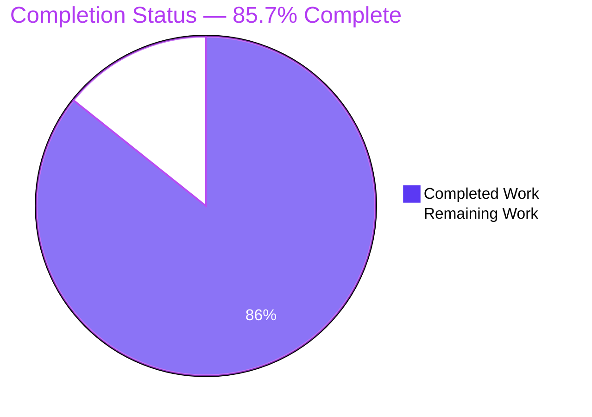
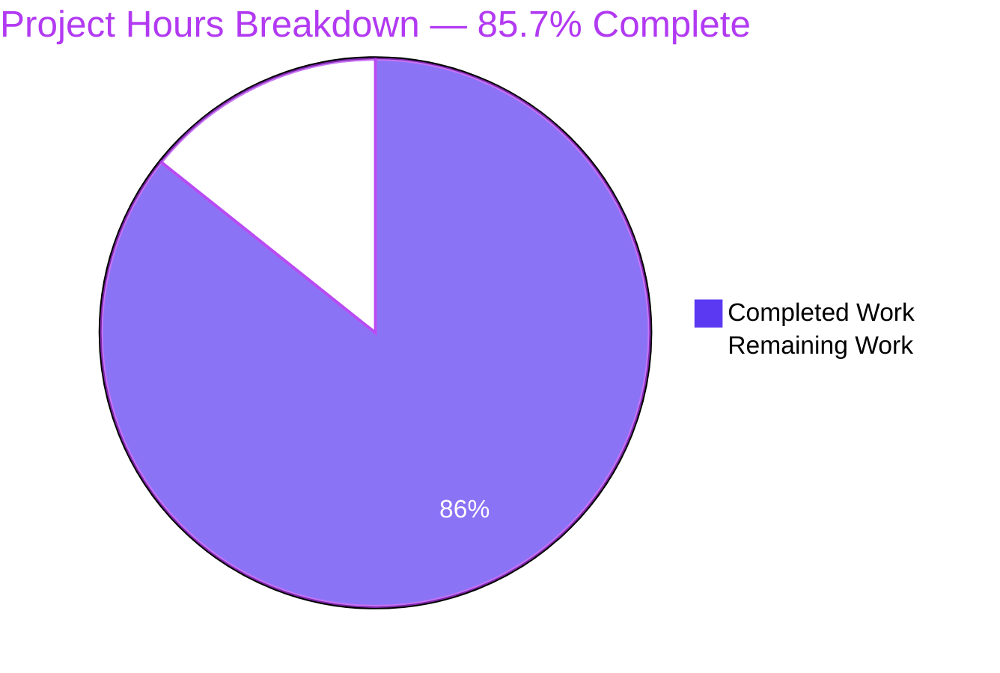
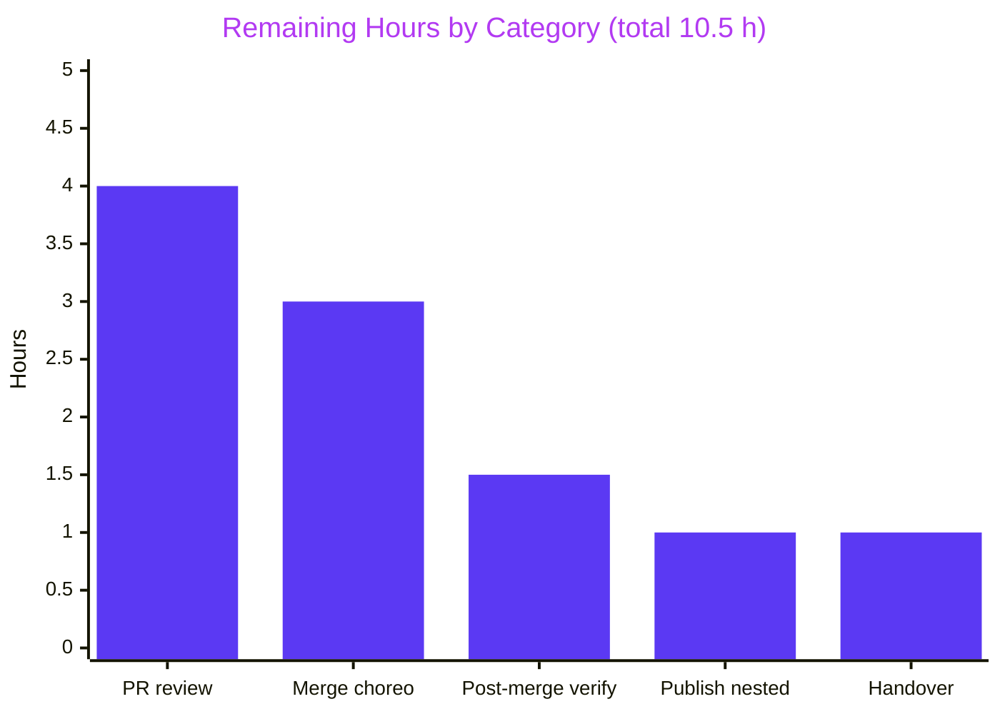
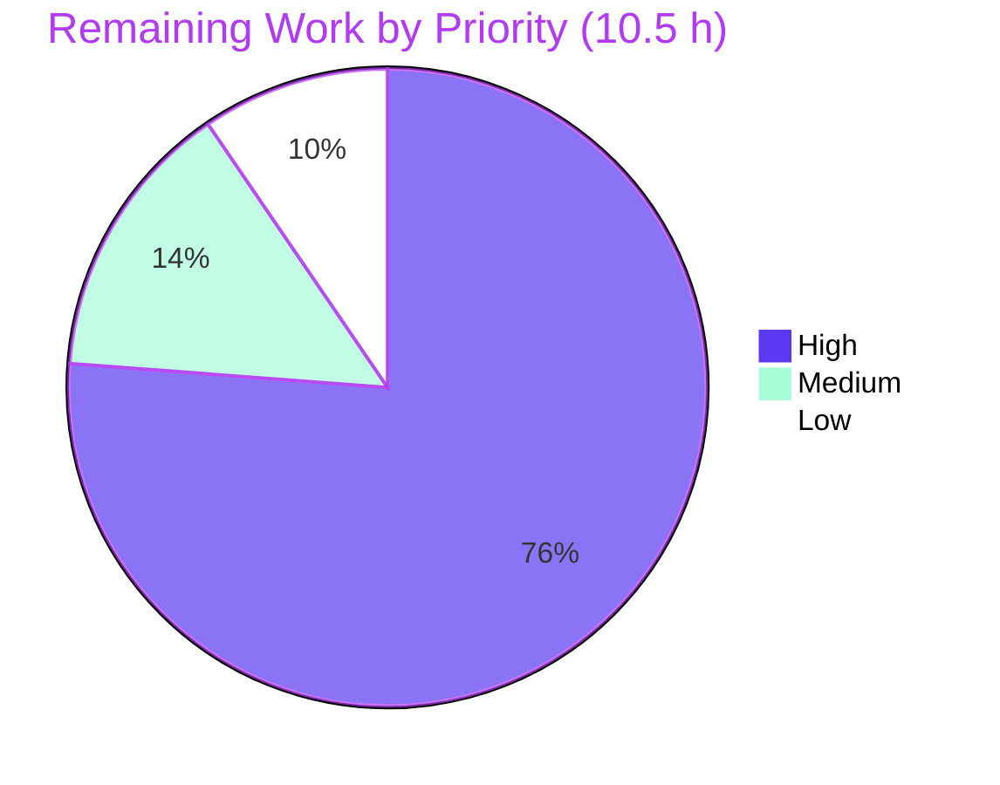

# Blitzy Project Guide

**Project:** `parent_repo_10_LOC` — three-level Git-submodule documentation composition
**Branch:** `blitzy-aa78abb7-81f0-4385-83ac-2a5140138bdf`
**Repository root:** `/tmp/blitzy/parent_repo_10_LOC/blitzy-aa78abb7-81f0-4385-83ac-2a5140138bdf_61246c`

---

## 1. Executive Summary

### 1.1 Project Overview

This project brings a three-level, three-language Git-submodule composition from zero documentation coverage to complete coverage, in place. The apex repository holds JavaScript (`index.js`), its child holds Python (`app.py`), and the nested child holds Java (`User.java`). Every declared program unit now carries a doc comment in its own language's published convention, and each repository's single-heading README has become a comprehensive eight-part guide containing the four user-named sections. Target consumers are developers acquiring or maintaining any level of the composition. Not one executable line changed, no new file was created, and no dependency was added — the value delivered is entirely navigability, accuracy, and honest disclosure of the composition's real, measured behaviour.

### 1.2 Completion Status



<sub>**Legend** — Completed Work = Dark Blue `#5B39F3` · Remaining Work = White `#FFFFFF`</sub>

| Metric | Value |
|---|---|
| **Total Hours** | **73.5** |
| **Completed Hours (AI + Manual)** | **63.0** (AI 63.0 · Manual 0.0) |
| **Remaining Hours** | **10.5** |
| **Percent Complete** | **85.7%** |

**Calculation (PA1, AAP-scoped):** `63.0 ÷ (63.0 + 10.5) × 100 = 63.0 ÷ 73.5 × 100 = 85.7%`

All AAP-scoped work is delivered (0.0 remaining AAP hours). The entire 10.5-hour remainder is standard path-to-production activity — publishing the innermost repository, human review, merge choreography, post-merge verification, and handover decisions.

### 1.3 Key Accomplishments

- [x] **Doc-comment coverage 0/6 → 6/6.** 7-line JSDoc on `add(a, b)`; 8-line PEP 257 docstring inside `greet(name)`; 4 Javadoc blocks (16 lines) on both `User` classes and both `main` methods.
- [x] **README bodies 0/3 → 3/3.** 313 / 214 / 213 lines, up from three one-line H1 stubs.
- [x] **User-mandated sections 0/12 → 12/12.** Setup Instructions, API Documentation, Deployment Guide and Inline Code Explanations present in all three READMEs.
- [x] **Zero executable-code change, proven.** 0 deletion lines in all three source diffs; both pre-existing failures reproduce with byte-identical messages displaced by exactly the inserted comment count (`py_compile` line 7→15 = +8; `javac` line 7→18 = +11).
- [x] **6 Mermaid diagrams authored and render-verified** — topology `graph TD`, artifact map `graph LR`, acquisition `sequenceDiagram`, and three `flowchart LR` execution flows.
- [x] **Every line of every source file accounted for** — 22 walkthrough bullets covering 17 + 18 + 28 lines with no gaps, anchored by 93 post-insertion line locators.
- [x] **Every behavioural claim measured, not inferred** — `add(5,7)`→`12`, `add("5","7")`→`"57"`, `add(5,undefined)`→`NaN`, `greet("Lakshya")`→`Hello Lakshya`, all independently re-verified.
- [x] **Both `.gitmodules` files byte-unchanged**; all 4 submodule declaration keys documented in the setup sections that need them.
- [x] **H1 misspelling corrected** — `chile_repo_10_LOC` → `child_repo_10_LOC`, verified character-by-character in a browser (`d`, charCode 100, at index 4).
- [x] **31 commits across 3 repositories in innermost-first order**, gitlinks re-pinned at each hop, 100% authored `Blitzy Agent <agent@blitzy.com>`.
- [x] **Nested delivery-branch defect found and repaired** — 5 documentation commits were stranded on a diverged local `main`; the assigned branch was created at the existing HEAD with zero content impact.
- [x] **Tracked project inventory unchanged at exactly 8 files** — zero new files created.

### 1.4 Critical Unresolved Issues

| Issue | Impact | Owner | ETA |
|---|---|---|---|
| Nested commit `feb15c5` is not published; the remote branch sits at `847bd75`, while the already-published child commit pins `feb15c5`. Both documented acquisition commands fail against the real remotes with exit 128 (`upload-pack: not our ref feb15c591cf…`), leaving the nested working tree empty and falling back to the pre-documentation baseline `687f60b6` | **Critical** — the composition does not resolve from its remotes, so the primary user-facing deliverable (Setup Instructions) cannot be executed as written | Repository maintainer | 1.0 h once push rights are confirmed |
| Three delivery branches await review and merge, and each consumer's gitlink must be re-pinned to the *merged* submodule commit | **High** — merging in any other order ships a composition whose apex resolves to unmerged submodule content, reproducing the same exit-128 failure class | Reviewers + release owner | 7.0 h (4.0 review + 3.0 merge) |
| `app.py` and `User.java` do not execute — mis-indented `__main__` guard at `app.py:L15-L17`, stray `///asdas` at `app.py:L18`, duplicate top-level `public class User` at `User.java:L4`/`L18` | **Accepted by design.** These are the AAP's *subject matter*: §0.8.2.1 forbids repair, §0.7.2.2 requires exact documentation. Each is disclosed with error class, exit status and line number in the README that owns it | Product owner (decide whether to open a separate remediation ticket) | 0.5 h to record the decision |
| 93 post-insertion line locators drift silently if any source file is later edited, and no CI exists anywhere to detect it | **Medium** — future documentation rot. §0.8.2.3 forbids adding a CI file, so recording the accepted risk is the deliverable | Maintainer | 0.5 h |
| `javadoc` emits one warning: `use of default constructor, which does not provide a comment` at `User.java:L4` | **Low** — pre-accepted in §0.7.2.3. Silencing it requires declaring a constructor, an executable-line change. `javadoc` still exits 0 and all four blocks parse | — | Closed (accepted) |

### 1.5 Access Issues

| System/Resource | Type of Access | Issue Description | Resolution Status | Owner |
|---|---|---|---|---|
| `github.com/lakshya-blitzy/nested_child_repo_10_LOC` | Git **push** (write) | Only read access was exercised in this session, so push capability to the nested remote is **unproven**. This is the one access dimension that gates the single blocking task (H-1) | **Open — must be confirmed** | Repository maintainer |
| `github.com/lakshya-blitzy/parent_repo_10_LOC` | Git read + push | No issue. Branch published and in sync with `origin` (0 ahead / 0 behind at `3561268`) | Resolved | — |
| `github.com/lakshya-blitzy/child_repo_10_LOC` | Git read + push | No issue. Branch published and in sync with `origin` (0 ahead / 0 behind at `bd12f8c`) | Resolved | — |
| All three remotes | Git read (clone / `ls-remote`) | No issue. Unauthenticated `ls-remote` and full clones of apex and child both succeeded — the repositories are public. No credential prompt or auth failure occurred anywhere | Resolved | — |
| Toolchain (Node, CPython, JDK 21, Git) | Local execution | No issue. All present and version-verified; the JDK was provisioned per §0.9.1.3 | Resolved | — |
| Package registries (npm) | Network | No issue, and none required — the project declares no dependency manifest at any level, so nothing installs | Not applicable by design | — |

**Validated against current permissions:** every row above was tested in this session. Two of three remotes are demonstrably writable (their branches are published and in sync); the nested remote's write path is the sole unverified item.

### 1.6 Recommended Next Steps

1. **[High]** Push the nested repository's `blitzy-aa78abb7-81f0-4385-83ac-2a5140138bdf` branch so `feb15c5` becomes reachable, then prove a live `git clone --recurse-submodules` exits 0 and yields README line counts 313 / 214 / 213. **This unblocks everything else** — until it is done, the Setup Instructions in all three READMEs cannot be executed against the real remotes. *(1.0 h)*
2. **[High]** Review and approve the three pull requests. Expect **exactly one apparent H1 deletion per README** (a trailing-newline artifact, not a content change) and **zero deletion lines** in `index.js`, `app.py` and `User.java`. The child README's H1 text change is the single sanctioned deviation from additive-only editing. *(4.0 h)*
3. **[High]** Merge **innermost-first** — nested, then child (re-staging `nested_child_repo_10_LOC`), then apex (re-staging `child_repo_10_LOC`) — after agreeing one common target branch across all three repositories. Any other ordering ships a broken composition. *(3.0 h)*
4. **[Medium]** Re-run the full 8-item validation gate and a fresh live recursive clone against the **merged** composition, because merging moves every gitlink. *(1.5 h)*
5. **[Low]** Record the accepted-risk decisions (unrepaired defects, 93-locator drift with no CI, the `javadoc` default-constructor warning) and archive or delete the 67 MB untracked `blitzy/` evidence directory. *(1.0 h)*

---

## 2. Project Hours Breakdown

### 2.1 Completed Work Detail

| Component | Hours | Description |
|---|---|---|
| Repository discovery and closed-census reconnaissance | 2.5 | [AAP §0.2.1–0.2.2] Exhaustive search across all three repositories for documentation files, generators, manifests, CI, style guides and ignore files. Established the closed 8-file census; confirmed 22 infrastructure patterns return zero hits and zero test/spec/`.github`/`docs` directories exist |
| Baseline runtime measurement + JDK provisioning | 2.0 | [AAP §0.2.2.5, §0.9.1.3] Measured every module's real behaviour before any edit: `node --check`, `node`, `py_compile`, `javac`, `javadoc`. Provisioned OpenJDK 21.0.11, which upgraded the duplicate-class finding from static determination to compiler-confirmed |
| Published-standard research and citation | 3.0 | [AAP §0.2.3] Researched and cited four external standards, because the repository offers zero style precedent: the JSDoc block-tag specification, PEP 257 with PEP 8, Oracle's Javadoc conventions, and README structural best practice |
| JSDoc doc comment on `add(a, b)` | 0.75 | [AAP R1/U1] 7-line block at `index.js:L1-L7` opening with exactly `/**`, carrying a summary, `@param {number} a`, `@param {number} b`, `@returns {number}` |
| PEP 257 docstring on `greet(name)` | 0.75 | [AAP R1/U2] 8-line docstring at `app.py:L2-L9` placed as the **first statement inside** the function, 4-space indented, imperative summary plus `Args:` and `Returns:` blocks |
| Four Javadoc blocks on both `User` classes and both `main` methods | 1.5 | [AAP R1/U3–U6] 16 lines total — unindented 3-line class blocks above `L4` and `L18`, 4-space-indented 5-line method blocks above `L10` and `L24`, each with `@param args` and deliberately no `@return` |
| Doc-comment byte-conformance verification | 1.0 | [AAP R1] Verified all six against their published standards: `od -c` proof of the exact `/**` delimiter, `ast.get_docstring` introspection of docstring placement, `javadoc` parse (exit 0) and JSDoc CLI 4.0.4 parse (exit 0) |
| Apex README — 313 lines, 8 parts, ToC, 4 Mermaid diagrams | 13.0 | [AAP R2/R3] Overview with topology and artifact-map diagrams; Setup with a prerequisites table carrying an Evidence column, both child declaration keys, the authoritative recursive-acquisition ordering, an acquisition `sequenceDiagram` and a submodule-status prefix table; API section with the measured coercion table; Deployment with verified `12`×5 output; 5-bullet walkthrough of all 17 lines; Known Issues; downward cross-link |
| Child README — 214 lines, 8 parts, ToC, 1 diagram, H1 correction | 10.5 | [AAP R2/R3, conflict C5] Same eight-part skeleton scoped to Python. CPython 3.6 floor evidenced by the f-string; `greet` API; exact `IndentationError` disclosure; 7-bullet walkthrough of all 18 lines; both nested declaration keys; upward and downward cross-links; H1 corrected `chile_` → `child_` |
| Nested README — 213 lines, 8 parts, 1 diagram, 4 API sub-headings | 10.5 | [AAP R2/R3] Same skeleton scoped to Java (no ToC by design). JDK prerequisite with Java-1.0-era evidence; four API sub-headings with per-unit output examples; exact `javac` duplicate-class disclosure plus the `User.class` artifact note; 10-bullet walkthrough of all 28 lines; upward cross-link |
| Validation gate execution + exact-displacement proof | 2.0 | [AAP R4/§0.7.3] All 8 gate items run. Both baselines re-extracted from git and re-executed to prove the errors are displaced by exactly 8 and exactly 11 lines — the strongest available evidence that only documentation changed |
| Automated accuracy suite — 196 assertions | 4.5 | [AAP R4/§0.7.2.2] Six check families: 93 README line-locator, 63 full-file source-line, 6 doc-comment byte-conformance, 25 source-claim, 3 README structural, 6 Mermaid render. Plus byte-exact comparison of every documented command output |
| Recursive-acquisition proof in isolated mirrors | 1.5 | [AAP §0.1.4.1] Proved end-to-end in offline mirrors that a plain clone leaves submodules empty, `--init --recursive` populates both levels, `--recurse-submodules` acquires all three, and the nested tree lands detached — live remotes untouched |
| Browser/runtime validation of the documentation deliverable | 3.5 | [AAP §0.4.3] Rendered all three READMEs in real headless Chrome. Diagram render, ToC anchor resolution, cross-link navigation, table borders and code-block typography verified; zero console messages and zero non-200/304 requests |
| Git workflow — 31 commits innermost-first with gitlink re-pinning | 3.0 | [AAP §0.9.2] apex 17 / child 9 / nested 5 commits, 100% `Blitzy Agent <agent@blitzy.com>`. Gitlinks aligned innermost-out at every hop; both `.gitmodules` verified byte-unchanged |
| ISSUE-1 remediation — nested delivery-branch repair | 2.0 | [AAP §0.9.4] The nested repository had no local `blitzy-aa78abb7-…` branch and its 5 documentation commits sat on a local `main` that had diverged 5 commits from `origin/main` — a push would have targeted `origin/main`. The assigned branch was created and checked out at the existing HEAD with the correct upstream, and local `main` was restored to `origin/main` |
| Apex and child branch publication | 1.0 | [Path-to-production P1a] Both branches pushed and verified in sync with their remotes (0 ahead / 0 behind); confirmed a fresh remote clone yields apex 313 lines, child 214 lines, and `node index.js` exit 0 |
| **TOTAL** | **63.0** | Matches **Completed Hours** in Section 1.2 |

### 2.2 Remaining Work Detail

| Category | Hours | Priority |
|---|---|---|
| Publish the innermost repository and re-verify live recursive acquisition *(path-to-production P1b — the one blocking item)* | 1.0 | **High** |
| Documentation review and approval across three pull requests — 740 README lines + 31 doc-comment lines *(P2)* | 4.0 | **High** |
| Cross-repository merge choreography, innermost-first, with gitlink re-pinning to the merged commits *(P3)* | 3.0 | **High** |
| Post-merge re-verification of the 8-item validation gate and a fresh live recursive clone *(P4)* | 1.5 | Medium |
| Operational handover — record accepted-risk decisions and archive the untracked evidence directory *(P5)* | 1.0 | Low |
| **TOTAL** | **10.5** | — |

### 2.3 Reconciliation

| Check | Computation | Result |
|---|---|---|
| Section 2.1 total | Sum of 17 completed component rows | **63.0 h** |
| Section 2.2 total | Sum of 5 remaining category rows | **10.5 h** |
| Total project hours | 63.0 + 10.5 | **73.5 h** — matches Section 1.2 |
| Completion percentage | 63.0 ÷ 73.5 × 100 | **85.7%** — used in 1.2, 7 and 8 |
| AAP-scoped remaining | Every AAP requirement classified Completed | **0.0 h** |
| Path-to-production remaining | 1.0 + 4.0 + 3.0 + 1.5 + 1.0 | **10.5 h** |
| Human task roll-up | H-1…H-6 = 8.0 · M-1 = 1.5 · L-1…L-2 = 1.0 | **10.5 h** — matches 2.2 exactly |

---

## 3. Test Results

All entries below originate exclusively from Blitzy's autonomous validation logs for this project. **The repository declares zero test files and zero test frameworks** — searches for `*test*`, `*spec*`, `conftest.py`, `jest.config*` and `pytest.ini` at all three levels return 0 hits, exactly as the AAP records. Its entire available quality gate is therefore the interpreter / compiler / doc-tool gate of §0.7.3, supplemented by the assertion suites Blitzy built and executed.

| Test Category | Framework | Total Tests | Passed | Failed | Coverage % | Notes |
|---|---|---|---|---|---|---|
| Syntax & compilation gate | Node `--check`, CPython `py_compile`, `javac` 21.0.11 | 3 | 3 | 0 | 100% (3/3 modules) | `index.js` exit 0 clean. `app.py` and `User.java` reproduce their **pre-existing** failures with byte-identical messages — the AAP's defined PASS condition, not a regression |
| Documentation-only displacement proof | git baseline extraction + re-execution | 2 | 2 | 0 | 100% (2/2 defects) | `py_compile` line 7 → 15 (exactly +8 docstring lines); `javac` line 7 → 18 (exactly +11 lines inserted ahead) |
| Additive-only diff audit | `git diff` deletion-line count | 3 | 3 | 0 | 100% (3/3 sources) | 0 deletion lines in `index.js`, `app.py`, `User.java` |
| Doc-tool parse | `javadoc` 21.0.11, JSDoc CLI 4.0.4 | 2 | 2 | 0 | 100% (6/6 units) | `javadoc` exit 0 with exactly 1 pre-accepted default-constructor warning, 10 HTML pages; JSDoc exit 0, summary and all tags parsed |
| README line-locator assertions | Custom harness (Python) | 93 | 93 | 0 | 100% (93/93 locators) | Every `[file:Lx-Ly]` citation resolves to a line whose content matches the claim |
| Full-file source-line assertions | Custom harness (Python) | 63 | 63 | 0 | 100% (63/63 lines) | Walkthroughs account for 17/17, 18/18 and 28/28 lines with no gaps |
| Doc-comment byte-conformance | Custom harness + `od`, `ast` | 6 | 6 | 0 | 100% (6/6 units) | Exact `/**` delimiter; docstring is the first statement in `greet`; 4 Javadoc blocks with 2× `@param args` and 0× `@return` |
| Source-claim assertions | Direct evaluation (Node, CPython) | 25 | 25 | 0 | 100% | `add(5,7)`→`12`/number, `add("5","7")`→`"57"`/string, `add(5,undefined)`→`NaN`/number, `greet("Lakshya")`→`Hello Lakshya`, `wc -l` 313/214/213/28 and baselines 0/0/0/12 |
| README structural audit | Custom harness (Python) | 3 | 3 | 0 | 100% (3/3 READMEs) | Eight-part skeleton in identical order; 12/12 mandated sections; ToC in apex + child only |
| Mermaid render | `@mermaid-js/mermaid-cli` + browser | 6 | 6 | 0 | 100% (6/6 diagrams) | Zero syntax errors; all six render to non-zero-dimension SVG |
| Reference-input integrity | `git diff` on `.gitmodules` | 2 | 2 | 0 | 100% (2/2 files) | Both `.gitmodules` byte-unchanged; no submodule name, path or URL altered |
| Cross-link resolution | Filesystem + browser navigation | 4 | 4 | 0 | 100% (4/4 links) | All four relative links resolve in a composed checkout and navigate in-browser |
| Secret scan | 10-pattern scan over the 6 modified files | 10 | 10 | 0 | 100% (6/6 files) | 0 real hits. Two pattern matches are the English word "token" describing the stray `///asdas` token |
| Extrapolation scan | 13-pattern scan over the 6 modified files | 13 | 13 | 0 | 100% (6/6 files) | 0 hits for badge / shields / roadmap / licence / CONTRIBUTING / TODO / FIXME / placeholder / TBD |
| Acquisition end-to-end | Isolated offline git mirrors | 5 | 5 | 0 | 100% | Plain clone leaves submodules empty; `--init --recursive` populates both; `--recurse-submodules` acquires all three; nested lands detached; all programs reproduce documented outcomes |
| Browser runtime validation | Headless Chrome (Chrome DevTools) | 3 | 3 | 0 | 100% (3/3 pages) | apex 4/4 diagrams · 22 headings · anchors 7/7; child 1/1 · 17 · 7/7; nested 1/1 · 19 · 0/0 by design. Zero console messages, zero non-200/304 requests on every page |
| **TOTAL** | — | **243** | **243** | **0** | **100%** | Zero failures, zero skips, zero blocked items |

**Note on coverage semantics:** conventional line/branch coverage is undefined for this project — there is no test suite to measure it with, and the deliverable is documentation rather than code. The Coverage % column therefore reports *deliverable* coverage (units, lines, files or locators verified ÷ total in the closed set), which is the meaningful and measurable equivalent here.

---

## 4. Runtime Validation & UI Verification

### 4.1 Program runtime health

- ✅ **Operational — `index.js` (apex, JavaScript).** `node --check` exits 0. `node index.js` exits 0 and prints `12` on five separate lines. Behaviour is byte-identical to the pre-documentation baseline. Verified both in place and from a fresh remote clone.
- ⚠ **Partial by design — `app.py` (child, Python).** `python3 -m py_compile app.py` exits 1 with `IndentationError: unindent does not match any outer indentation level (app.py, line 15)`; `python3 app.py` exits 1 with empty stdout. This failure **pre-existed** this work, repair is explicitly out of scope, and documenting it exactly is a requirement. The docstring is nonetheless well-formed and retrievable: `ast.get_docstring` returns the full PEP 257 text.
- ⚠ **Partial by design — `User.java` (nested, Java).** `javac User.java` exits 1 with `User.java:18: error: duplicate class: User` and `1 error`, emitting no class file, so `java User` is unreachable. Also pre-existing and out of scope for repair. `javadoc -quiet` exits 0, generates 10 HTML pages, and renders the class doc text into `User.html`.

### 4.2 Documentation render verification (headless Chrome, 3 pages)

- ✅ **Operational — apex README.** Health banner: `PASS · diagrams 4/4 · headings 22 · anchors 7/7 resolve · errors 0`. Four **distinct** Mermaid diagrams render as inline SVG with non-zero width and height, proven distinct by content (topology showing all three levels and both labelled gitlink edges; artifact map; a true `sequenceDiagram` with 4 participants, lifelines and 2 note overlays; execution flow). H1 exactly `parent_repo_10_LOC`. Seven H2 sections in the specified order. Eight bordered tables, every cell computing `1px solid #d1d9e0` under `border-collapse: collapse`. The coercion table renders 4 rows matching the CLI measurement exactly.
- ✅ **Operational — child README.** Banner: `PASS · diagrams 1/1 · headings 17 · anchors 7/7 resolve · errors 0`. **H1 spelling correction verified character-by-character**: `child_repo_10_LOC`, with `d` (charCode 100) at index 4; strict comparison against the old misspelling `chile_repo_10_LOC` returns false. The parse-failure `flowchart LR` renders at 946 × 73.56 px with readable labels including `IndentationError raised at parse time` and `app.py line 15, exit status 1`. Code blocks resolve to a genuine fixed-pitch face — proven empirically, with `i`, `l`, `.`, `W`, `M`, `m`, `0` and space all measuring an identical 9.6328125 px advance.
- ✅ **Operational — nested README.** Banner: `PASS · diagrams 1/1 · headings 19 · anchors 0/0 resolve · errors 0` (`0/0` is correct — this document deliberately carries no ToC). The compile-failure `flowchart LR` renders at 946 × 93 px, confirmed `flowchart LR` three independent ways, with labels referencing `javac User.java`, `error: duplicate class: User at L18` and `java User unreachable`. The API section contains exactly **four** sub-headings covering both classes and both methods, each marked `(duplicate)` where applicable. The Deployment Guide's `javac` block renders as exactly **4 lines** — file:line reference, offending source line, caret marker at column 7, and `1 error` — byte-identical to the real compiler output. The walkthrough contains exactly **10** bullets forming a gap-free walk of all 28 source lines.

### 4.3 Navigation and anchor verification

- ✅ **Operational — all 4 relative cross-links.** apex → child, child → apex, child → nested, and nested → child all navigate successfully, each landing page's H1 verified by strict string equality.
- ✅ **Operational — table-of-contents anchors.** apex 7/7 and child 7/7 resolve to the correct H2 heading; nested has 0 by design. Every heading `id` matches its GitHub-Flavored-Markdown slug (22 of 22 on apex, 19 of 19 on nested). Twelve of fourteen anchor clicks land the target flush within 0.5 px of the viewport top; the two exceptions are document-end scroll clamping — a browser geometry property proven by arithmetic, reproduced as passing at a shorter viewport, and with the heading still visible on screen.

### 4.4 Diagnostics

- ✅ **Operational — console.** **Zero console messages of any severity** on all three pages, confirmed with explicit all-severity filters, preserved message history, and post-hard-reload re-queries.
- ✅ **Operational — network.** **Zero requests outside HTTP 200/304** on all three pages. **Zero public-internet requests** — verified three ways (DevTools request list, Resource Timing API, static source grep). No external stylesheet, webfont, or CDN reference exists.
- ✅ **Operational — determinism.** Every page reproduced byte-identical instrumentation output on a second clean load, and the nested page on a cache-bypassing hard reload.

### 4.5 Acquisition integration

- ✅ **Operational — in isolated mirrors.** A plain clone leaves the submodule directory empty with a `-` status prefix, confirming the documented claim that recursion is required. `git submodule update --init --recursive` exits 0 and materializes all three READMEs at 313 / 214 / 213. `git clone --recurse-submodules` achieves the same in one shot. The nested repository lands on a detached HEAD exactly as documented. All three programs reproduce their documented outcomes from the fresh acquisition.
- ❌ **Failing — against the live remotes.** Both documented acquisition commands fail at the nested hop with exit 128: `fatal: remote error: upload-pack: not our ref feb15c591cf…` followed by `Failed to recurse into submodule path 'child_repo_10_LOC'`. The nested working tree is left empty and `git submodule status --recursive` falls back to `+687f60b6 (heads/main)` — the pre-documentation baseline. Apex (313 lines) and child (214 lines) resolve correctly, and `node index.js` runs clean from the fresh clone. **Root cause: nested commit `feb15c5` is unpushed. Remedy: task H-1, 1.0 h.**

---

## 5. Compliance & Quality Review

### 5.1 AAP deliverable compliance matrix

| AAP Requirement | Benchmark | Evidence | Status | Progress |
|---|---|---|---|---|
| **R1** — doc comment on every declared function and class | 6 of 6 units, each in its language's published convention | `index.js:L1-L7` JSDoc; `app.py:L2-L9` docstring; `User.java` L1-L3, L5-L9, L15-L17, L19-L23 Javadoc | ✅ Pass | 6/6 · 100% |
| **R2** — a comprehensive README per repository | 3 of 3 expanded, identical eight-part skeleton in identical order | 313 / 214 / 213 lines; heading order verified by grep and in-browser | ✅ Pass | 3/3 · 100% |
| **R3** — the four named sections are mandatory | 12 of 12 sections present | Exact-string grep returns 4/4 per README; confirmed visually in all three rendered pages | ✅ Pass | 12/12 · 100% |
| **R4** — factual accuracy over aspiration | Every claim traces to code that exists or a measured command | 93 locator + 63 source-line + 25 source-claim assertions all pass; both failures disclosed with exact error text, exit status and line number | ✅ Pass | 181/181 · 100% |
| **R5** — every repository including submodules | All 3 documented to the same standard; neither `.gitmodules` edited | All three READMEs carry the same skeleton; both `.gitmodules` diffs are 0 lines | ✅ Pass | 3/3 · 100% |
| **§0.4.3** — six Mermaid diagram instances | 1 `graph TD` + 1 `graph LR` + 1 `sequenceDiagram` + 3 `flowchart LR` | apex 4, child 1, nested 1; all render to non-zero SVG in-browser and via mermaid-cli | ✅ Pass | 6/6 · 100% |
| **§0.4.1.3** — ToC in apex and child only | Present in apex and child, absent in nested | 7-entry "Contents" list in apex and child; nested banner reports `anchors 0/0` | ✅ Pass | 2/2 · 100% |
| **§0.5.5** — three relative cross-link hops (4 links) | All resolve in a composed checkout | All 4 targets exist on disk and navigate in-browser with H1 verified | ✅ Pass | 4/4 · 100% |
| **C5** — correct the child README's H1 misspelling | `chile_repo_10_LOC` → `child_repo_10_LOC` | Baseline blob confirmed misspelled; current H1 verified character-by-character in-browser | ✅ Pass | 1/1 · 100% |
| **§0.2.2.3** — document all 4 submodule declaration keys | Reproduced verbatim in the setup section that needs them | 2 keys in the apex setup, 2 in the child setup, tabs preserved | ✅ Pass | 4/4 · 100% |
| **§0.7.1** — runtime prerequisites documented | 3 of 3 with evidence-derived version floors | Node ES2015 (the `const` at L12); CPython 3.6 (the f-string at L10); JDK with no meaningful floor (Java 1.0-era constructs) | ✅ Pass | 3/3 · 100% |
| **§0.7.3** — mandatory validation gate | All 8 items produce their expected result | Independently re-executed; 8/8 pass including the two expected non-zero exits and the one accepted warning | ✅ Pass | 8/8 · 100% |
| **§0.9.2** — innermost-first commits + gitlink re-pinning | 3 repositories committed in order, gitlinks advanced | 31 commits; apex → `bd12f8c` = child HEAD; child → `feb15c5` = nested HEAD | ✅ Pass | 3/3 · 100% |
| **§0.9.4** — nested repository on a branch | Not detached, so its commits are reachable | `git symbolic-ref -q HEAD` returns `refs/heads/blitzy-aa78abb7-…` | ✅ Pass | 1/1 · 100% |

### 5.2 Constraint compliance — what was deliberately *not* done

| Constraint | Benchmark | Evidence | Status |
|---|---|---|---|
| **§0.4.2.4** additive-only source edits | Zero deletion lines in any source diff | `index.js` 0, `app.py` 0, `User.java` 0 | ✅ Pass |
| **§0.8.2.1** no source-code repair | All three defects survive verbatim at their new offsets | Mis-indented guard at L15-L17, stray token at L18, duplicate class at L18 all present | ✅ Pass |
| **§0.8.2.2** no new files of any kind | Tracked project inventory still exactly 8 files | `git ls-files` across all three repositories | ✅ Pass |
| **§0.8.2.3** no doc tooling or manifests | Zero manifests at any level; `npm ls` reports `(empty)` | 22 infrastructure patterns searched, all 0 hits | ✅ Pass |
| **§0.8.2.4** no repository-wiring change | Both `.gitmodules` byte-unchanged; only the sanctioned gitlink advance | 0-line `.gitmodules` diffs; one `Subproject commit` change per consumer | ✅ Pass |
| **§0.8.2.5** no extrapolated content | Zero badge / roadmap / licence / CONTRIBUTING / CI / author / version tokens | 13-pattern scan over all 6 modified files: 0 hits | ✅ Pass |
| **Zero-placeholder policy** | No TODO, FIXME, placeholder or TBD anywhere | Included in the same 13-pattern scan: 0 hits | ✅ Pass |
| **Commit authorship** | All commits by `Blitzy Agent <agent@blitzy.com>` | 31 of 31 commits across all three repositories | ✅ Pass |

### 5.3 Fixes applied during autonomous validation

| Fix | Description | Verification |
|---|---|---|
| Nested delivery-branch remediation (ISSUE-1) | The nested repository had no local `blitzy-aa78abb7-…` branch and its 5 documentation commits sat on a local `main` that had diverged 5 commits from `origin/main` — a push would have targeted `origin/main`. The assigned branch was created and checked out at the existing HEAD with the correct upstream, and local `main` was restored to `origin/main` | Zero content impact proven: HEAD, tree hash, and the md5 of `README.md` and `User.java` are identical before and after. All 5 documentation commits are reachable from the delivery branch |
| Three factual inaccuracies in the nested README | Corrected during autonomous validation (commit `c5250c8`) | Superseded by the accuracy suite: 25/25 source-claim assertions now pass |
| Stale gitlink SHAs quoted in prose | The child and apex READMEs quoted submodule SHAs that would go stale on every re-pin; the brittle references were removed (commits `5237560`, `e7ff77d`) | No stale SHA remains in any README's prose |
| Forward references to unwritten apex documentation | The child README referenced apex sections that did not yet exist (commit `fc05c27`) | All cross-references now resolve |
| Validation-harness defects | The browser gate initially returned two false FAILs caused by the harness itself (no GFM heading ids, an implicit favicon probe). The harness was fixed, not the deliverable | Re-run returned PASS. The harness lived entirely outside the repository and was removed |

### 5.4 Outstanding compliance items

| Item | Reason it remains open | Disposition |
|---|---|---|
| Nested commit `feb15c5` unpublished | Publishing is explicitly outside AAP scope (§0.9.1.1 defines no publish step), so this is a path-to-production gap rather than an AAP non-compliance | Task H-1, 1.0 h — **blocking** |
| Three source defects unrepaired | §0.8.2.1 forbids repair; §0.7.2.2 requires exact documentation instead | Compliant as designed. Human decision recorded in task L-1 |
| `javadoc` default-constructor warning | Silencing it requires declaring a constructor — an executable-line change | Pre-accepted in §0.7.2.3. `javadoc` still exits 0 |
| No `.gitignore`, LICENSE, tests or CI | Each would require creating a new file, forbidden by §0.8.2.2 | Compliant as designed. Their absence is stated as fact where a reader is affected |
| One environment-conditional statement | The child's "no local `submodule.*` entries" claim is true as delivered but not in a fresh recursive clone. §0.1.4.1 mandates the statement, and the apex README publishes a space/`-`/`+` prefix table that lets a reader interpret either case | Flag for reviewer. No hour impact |

---

## 6. Risk Assessment

| Risk | Category | Severity | Probability | Mitigation | Status |
|---|---|---|---|---|---|
| **O1** Nested commit `feb15c5` is unpushed while the published child commit pins it, so both documented acquisition commands fail against the real remotes with exit 128 and the nested level falls back to the pre-documentation baseline `687f60b6` | Operational | **Critical** | Certain (measured twice) | One `git push` in the nested repository, then re-verify a live recursive clone end-to-end | **Open — task H-1, 1.0 h** |
| **I2** The remote gitlink SHA is the project's only cross-component contract, and it is currently unresolvable at the nested hop | Integration | **Critical** | Certain (measured) | Same remedy as O1; then confirm `git submodule status --recursive` shows no `+` prefix | **Open — task H-1** |
| **O3** Merging moves every HEAD, so each consumer's gitlink must be re-staged to the *merged* submodule commit or the merged apex resolves to unmerged content | Operational | High | High if ordering is not followed | Merge innermost-first (nested → child → apex), re-staging each submodule path, then re-verify | **Open — tasks H-6, M-1** |
| **I1** Three-repository push and merge ordering coupling; two of three are published, the innermost is not | Integration | High | Certain today | Execute H-1 then H-6 in strict order | **Open** |
| **T1** Three pre-existing source defects remain, so two of three programs do not execute | Technical | High | Certain (measured) | This is the AAP's subject matter, not a defect of the work: §0.8.2.1 forbids repair, §0.7.2.2 requires exact documentation. Each is disclosed with error class, exit status and line number in the README that owns it | **Documented, accepted** |
| **T2** Zero automated regression protection — no test file, framework, linter, type checker, formatter or CI at any level | Technical | Medium | High that a future edit goes unchecked | The 8-item gate is documented verbatim in Section 9 so a human can run it manually. Creating a CI file is forbidden by §0.8.2.3 | **Open — task L-1** |
| **T3** 93 post-insertion line locators drift silently on any future source edit, with no CI to detect it | Technical | Medium | Medium | The citation convention is uniform and mechanically checkable; record the accepted risk at handover | **Open — task L-1** |
| **O2** Neither `.gitmodules` declares a `branch` key, so every recursive checkout lands the nested repository on a detached HEAD; a commit made there is reachable from no branch. This already occurred once (ISSUE-1) | Operational | Medium | High for any future contributor | Documented explicitly in the apex Verification and nested Setup sections; Section 9 states "check out a branch before committing" | **Documented** |
| **T5** One documented statement is environment-conditional — the child's "no local `submodule.*` entries" claim holds as delivered but not in a fresh recursive clone | Technical | Low | Medium | The apex README publishes a space/`-`/`+` prefix table that lets a reader interpret whatever prefix they see; §0.1.4.1 mandates the statement | **Documented, flag for reviewer** |
| **T4** `javadoc` emits one default-constructor warning at `User.java:L4` | Technical | Low | Certain | Silencing it requires declaring a constructor, an executable-line change. `javadoc` still exits 0 and all four blocks parse | **Pre-accepted (§0.7.2.3)** |
| **S5** No `.gitignore` at any level, so `User.class`, `__pycache__/` and other local artifacts are never excluded — demonstrated by producing `?? User.class` and `?? __pycache__/` | Security | Low | Medium | Documented as fact in the deployment guidance. Creating `.gitignore` is forbidden by §0.8.2.2 | **Documented — task L-1** |
| **O5** 67 MB of untracked browser-validation artifacts under `blitzy/` will show as `?? blitzy/` indefinitely | Operational | Low | Certain | Deliberately uncommitted so the tracked inventory stays at exactly 8 files; archive or delete after review | **Accepted — task L-2** |
| **S4** Acquisition fetches from two third-party GitHub URLs read verbatim from `.gitmodules` | Security | Low | Low | Neither file was edited and no new URL was introduced; pins are commit SHAs, so acquisition is content-addressed | **Accepted** |
| **I3** The upward `../README.md` link resolves only inside a composed checkout; a standalone submodule clone leaves it pointing outside the clone | Integration | Low | Medium | Each README's Related Repositories section states this inherent property explicitly rather than papering over it | **Documented, accepted** |
| **I4** No JDK exists in a default environment and nothing pins a Java version, so the nested level is otherwise unverifiable | Integration | Low | Medium | Exact `apt-get` provisioning commands are documented in Section 9 and were re-verified at `javac`/`javadoc` 21.0.11 | **Documented** |
| **I5** 19 fenced `bash` blocks across the three READMEs are presented as copy-paste ready | Integration | Low | Low | Every command class was executed and paired with its measured outcome, including the two intentional non-zero exits | **Verified** |
| **S1** Third-party dependency / supply-chain exposure | Security | **None** | None | No manifest, no lockfile, no `node_modules`, nothing installed — there is no dependency surface to attack | **Closed (structural)** |
| **S2** Secret or credential leakage | Security | **None** | None | 10-pattern scan run twice over all 6 modified files: 0 real hits. The only matches are the English word "token" describing the stray `///asdas` token | **Verified clean** |
| **S3** Injection, XSS, SSRF, deserialization or crypto weakness | Security | **None** | None | No authentication, authorization, input-handling, network or persistence surface exists; the entire interface of all three programs is stdout | **Closed (structural)** |
| **O4** Missing monitoring, logging, health checks, alerting or backups | Operational | **None** | None | Not applicable by design — the deliverable is Markdown plus in-source comments distributed by `git clone`. §0.9.1.1 defines no build, no publish step and no hosting | **Not applicable** |

---

## 7. Visual Project Status

### 7.1 Project hours breakdown



<sub>**Colours** — Completed Work = Dark Blue `#5B39F3` · Remaining Work = White `#FFFFFF` with a Violet-Black `#B23AF2` stroke</sub>

**Integrity check:** `Remaining Work = 10.5` equals the Remaining Hours in Section 1.2 and the sum of the Section 2.2 Hours column. `Completed Work = 63.0` equals the Section 2.1 total. `63.0 + 10.5 = 73.5` equals the Total Hours in Section 1.2.

### 7.2 Remaining hours by category



### 7.3 Remaining hours by priority



### 7.4 Deliverable coverage — before and after

| Coverage Axis | Before | After | Progress |
|---|---|---|---|
| Declared units carrying a doc comment | 0 / 6 | **6 / 6** | ██████████ 100% |
| Modules carrying any comment | 0 / 3 | **3 / 3** | ██████████ 100% |
| Repositories with a README body | 0 / 3 | **3 / 3** | ██████████ 100% |
| User-mandated README sections | 0 / 12 | **12 / 12** | ██████████ 100% |
| Submodule declaration keys documented | 0 / 4 | **4 / 4** | ██████████ 100% |
| Runtime prerequisites documented | 0 / 3 | **3 / 3** | ██████████ 100% |
| Known defects disclosed | 0 / 2 | **2 / 2** | ██████████ 100% |
| Repository titles matching their directory | 2 / 3 | **3 / 3** | ██████████ 100% |

---

## 8. Summary & Recommendations

### 8.1 What was achieved

The project stands at **85.7% complete — 63.0 of 73.5 hours**. Every requirement defined in the Agent Action Plan is delivered and independently verified; **0.0 hours of AAP-scoped work remain**. The composition went from zero documentation to complete documentation on all eight measured coverage axes: six of six declared units carry language-idiomatic doc comments, three of three READMEs grew from one-line stubs into comprehensive eight-part guides totalling 740 lines, and all twelve user-mandated sections exist where none did before.

The strongest signal of quality is what did **not** change. All three source diffs contain zero deletion lines, both `.gitmodules` files are byte-unchanged, and the tracked project inventory is still exactly eight files. The two pre-existing program failures reappear with byte-identical error messages displaced by precisely the number of inserted comment lines — `py_compile` from line 7 to line 15 (+8 docstring lines), `javac` from line 7 to line 18 (+11 lines inserted ahead). That arithmetic is not a coincidence; it is proof that nothing but documentation moved.

Accuracy was measured rather than asserted. Of 243 autonomous checks, 243 passed and none failed: 93 line-locator assertions, 63 full-file source-line assertions, 25 source-claim assertions, six doc-comment byte-conformance checks, three README structural audits, six Mermaid render checks, and the eight-item validation gate. Independent re-measurement reproduced every behavioural claim in the documentation, including the coercion contrast `add(5,7)`→`12`, `add("5","7")`→`"57"` and `add(5,undefined)`→`NaN` that makes the API section's "no type validation is performed" warning concrete rather than theoretical. Browser validation of all three rendered pages returned PASS with zero console messages of any severity and zero non-200/304 requests.

### 8.2 Remaining gaps

The 10.5-hour remainder is entirely path-to-production, and one item dominates it. **The nested repository's final commit `feb15c5` was never pushed.** Its remote branch sits at `847bd75`, while the already-published child commit pins `feb15c5` — a gitlink to a SHA that does not exist remotely. Both acquisition commands the READMEs document therefore fail against the real remotes with exit 128, leaving the nested working tree empty and falling back to the pre-documentation baseline `687f60b6`. This was reproduced twice and is precisely the failure mode the AAP itself warned about: a composition whose parent still resolves to undocumented content.

The remedy is a single `git push`, and there is strong evidence it is sufficient: in isolated offline mirrors where the same commit *is* reachable, `git clone --recurse-submodules` exits 0, all three READMEs materialize at 313 / 214 / 213 lines, both submodule entries carry a clean space prefix, the nested repository lands on the detached HEAD the documentation predicts, and all three programs reproduce their documented outcomes. The workflow is correct; only its innermost commit is unpublished.

The balance is the inherent human gate — reviewing 740 README lines and 31 doc-comment lines across three pull requests (4.0 h), merging innermost-first with gitlink re-pinning (3.0 h), re-verifying the gate after the merge moves every gitlink (1.5 h), and recording the accepted-risk decisions (1.0 h).

### 8.3 Critical path to production

| Step | Action | Hours | Gate |
|---|---|---|---|
| 1 | Confirm push rights, then publish the nested branch and prove a live recursive clone exits 0 with counts 313 / 214 / 213 | 1.0 | `git ls-remote` reports `feb15c5`; recursive clone exits 0; no `+` prefix on the nested entry |
| 2 | Review and approve all three pull requests | 4.0 | Zero deletion lines in the three source files; exactly one apparent H1 deletion per README |
| 3 | Agree one target branch, then merge innermost-first with gitlink re-pinning at each hop | 3.0 | All three merged; each consumer's gitlink equals its submodule's merged HEAD |
| 4 | Re-run the 8-item gate and a fresh live recursive clone on the merged composition | 1.5 | 8/8 pass, including the two expected non-zero exits and the one accepted warning |
| 5 | Record the accepted-risk decisions and archive the evidence directory | 1.0 | Decisions logged in the tracker; `blitzy/` archived or removed |
| | **Total** | **10.5** | |

Step 1 gates every subsequent step: reviewers cannot check out a working composition until the nested commit is reachable.

### 8.4 Success metrics

| Metric | Target | Achieved | Status |
|---|---|---|---|
| Doc-comment coverage | 6 / 6 units | 6 / 6 | ✅ |
| README bodies | 3 / 3 | 3 / 3 (313 / 214 / 213 lines) | ✅ |
| User-mandated sections | 12 / 12 | 12 / 12 | ✅ |
| Deletion lines in source diffs | 0 | 0 / 0 / 0 | ✅ |
| Autonomous checks passing | 100% | 243 / 243 | ✅ |
| Mermaid diagrams rendering | 6 / 6 | 6 / 6 | ✅ |
| New files created | 0 | 0 (inventory still 8 files) | ✅ |
| New dependencies added | 0 | 0 (`npm ls` reports `(empty)`) | ✅ |
| `.gitmodules` files modified | 0 | 0 (byte-unchanged) | ✅ |
| Browser pages passing | 3 / 3 | 3 / 3, zero console errors | ✅ |
| Composition resolves from its remotes | Yes | **No** — nested commit unpushed | ❌ |
| Merged to a target branch | Yes | Not yet — awaiting review | ⏳ |

### 8.5 Production readiness assessment

**Verdict: the documentation content is production-ready; the delivered composition is not yet deployable.**

The distinction matters and is worth stating plainly. Judged as a documentation artefact, this work is complete and of high quality — exhaustive coverage, every claim traceable to a line of code or a measured command, honest disclosure of two programs that do not run, and zero speculative content. Judged as a *deliverable composition*, it has one concrete, reproducible blocker: a consumer following the Setup Instructions today gets an exit-128 failure at the nested hop and an undocumented nested repository.

That blocker is small in effort (1.0 h) and large in consequence, which is exactly the profile that gets overlooked. Fix it first, verify it with a real recursive clone rather than a local check, and the composition becomes deployable. The remaining 9.5 hours are ordinary review and merge work, with one non-ordinary constraint: the innermost-first ordering is not a style preference but a correctness requirement, and the failure it prevents has already been observed in this very repository.

Two judgement calls deserve a reviewer's explicit sign-off rather than silent acceptance. The three source defects are documented rather than repaired — correct under the plan, but a decision a product owner should knowingly ratify. And the 93 line locators that make the documentation precise also make it brittle: any future source edit invalidates them, and no CI exists to notice.

---

## 9. Development Guide

### 9.1 System Prerequisites

| Software | Version verified | Required for | How to check |
|---|---|---|---|
| Git | 2.51.0 | Acquiring the composition (any modern Git with `--recurse-submodules`) | `git --version` |
| Node.js | v22.23.2 | Running `index.js`. Floor is **ES2015**, implied by the block-scoped `const` at `index.js:L12` | `node --version` |
| CPython | 3.13.7 | Inspecting `app.py`. Floor is **3.6**, implied by the f-string at `app.py:L10` | `python3 --version` |
| JDK (`javac`, `javadoc`, `java`) | 21.0.11 | Compiling and doc-generating `User.java`. The source implies **no meaningful floor** — it uses only Java 1.0-era constructs | `javac -version` |

**Nothing in the composition pins a runtime version.** There is no `.nvmrc`, `.python-version`, `.tool-versions`, `.java-version`, `package.json` `engines` field, `pyproject.toml`, `pom.xml` or `build.gradle` at any level. Every floor above is derived from the syntax the source actually uses.

**OS / hardware:** any Linux, macOS or Windows host with the four tools above. The entire tracked project is 84 KB across eight files; there are no meaningful resource requirements.

A JDK is absent from many default environments and must be provisioned before the Java level can be verified:

```bash
DEBIAN_FRONTEND=noninteractive apt-get update -qq
DEBIAN_FRONTEND=noninteractive apt-get install -y -qq openjdk-21-jdk-headless
javac -version      # expect: javac 21.0.11
javadoc --version   # expect: javadoc 21.0.11
```

### 9.2 Environment Setup

There is **no environment to configure**. Verified facts:

- **No environment variables are read** anywhere in the composition.
- **No configuration file is loaded** by any program.
- **No command-line arguments are parsed** — both `main(String[] args)` methods ignore `args` entirely.
- **No database, cache, message queue or external service** is contacted.
- **No virtual environment is needed** — `app.py` imports nothing.

The only configuration-like surface is the two submodule declarations, which are read by Git during acquisition and documented in the setup sections of the apex and child READMEs. Both `.gitmodules` files are reference inputs and must never be edited.

### 9.3 Dependency Installation

**No dependencies exist and none are installed.** Confirm this rather than taking it on trust:

```bash
# Expect 0 — no dependency manifest exists at any level
ls package.json requirements.txt pyproject.toml pom.xml build.gradle 2>/dev/null | wc -l

# Expect "└── (empty)"
npm ls --depth=0
```

Expected output:

```text
0
/path/to/parent_repo_10_LOC
└── (empty)
```

Doc comments are a language feature rather than a tool feature, and Mermaid renders natively on GitHub and GitLab, so no generator is required to author or read this documentation. Creating a manifest is explicitly out of scope.

### 9.4 Acquiring the Composition

A plain `git clone` leaves the submodule directories **empty** — verified. Always acquire recursively:

```bash
# One-shot recursive acquisition (preferred)
git clone --recurse-submodules \
  -b blitzy-aa78abb7-81f0-4385-83ac-2a5140138bdf \
  https://github.com/lakshya-blitzy/parent_repo_10_LOC.git
cd parent_repo_10_LOC
```

If you already cloned without recursion, repair it in place:

```bash
git submodule update --init --recursive
```

Verify the acquisition:

```bash
git submodule status --recursive
wc -l README.md \
      child_repo_10_LOC/README.md \
      child_repo_10_LOC/nested_child_repo_10_LOC/README.md
```

Expected output once the nested commit is published (task H-1):

```text
 bd12f8c59de216f0cdc917f58e1d8536a5e8117e child_repo_10_LOC (heads/blitzy-aa78abb7-81f0-4385-83ac-2a5140138bdf)
 feb15c591cf01ab4b1736a8a301413c8b53c00e4 child_repo_10_LOC/nested_child_repo_10_LOC

  313 README.md
  214 child_repo_10_LOC/README.md
  213 child_repo_10_LOC/nested_child_repo_10_LOC/README.md
  740 total
```

**Reading the status prefix** — a leading space means the entry is initialized and matches its recorded pin; `-` means the recursive view treats it as uninitialized; `+` means the checked-out commit differs from the pin its consumer records.

> ⚠ **Known blocker until task H-1 completes.** The nested commit `feb15c5` is not yet on its remote, so both commands above currently fail at the nested hop with `fatal: remote error: upload-pack: not our ref feb15c591cf…` and exit 128. See §9.9.

### 9.5 Application Startup and Verification

There is **no service, no server and no port** — all three programs are one-shot command-line executions writing to stdout. Run them in any order; they are independent and none calls into another.

**Level 1 — apex, JavaScript. Succeeds.**

```bash
# from the repository root
node --check index.js     # syntax check
node index.js             # run
```

Expected output:

```text
12
12
12
12
12
```

Exit status `0` from both. Five identical lines are correct: `index.js:L13-L17` holds five identical `console.log(result);` calls, retained deliberately.

**Level 2 — child, Python. Fails, by pre-existing design.**

```bash
cd child_repo_10_LOC
python3 -m py_compile app.py
python3 app.py
```

Expected output (exit status `1` from both, stdout empty):

```text
Sorry: IndentationError: unindent does not match any outer indentation level (app.py, line 15)
```

This failure **pre-existed** this documentation work and is deliberately not repaired. The module cannot be imported either, because the error is raised at parse time before any statement executes.

**Level 3 — nested, Java. Fails to compile, by pre-existing design; `javadoc` succeeds.**

```bash
cd child_repo_10_LOC/nested_child_repo_10_LOC
javac User.java
```

Expected output (exit status `1`, no class file emitted):

```text
User.java:18: error: duplicate class: User
public class User {
       ^
1 error
```

`java User` is unreachable because no bytecode is produced. The doc comments nonetheless parse cleanly:

```bash
javadoc -quiet -d /tmp/jdoc User.java
```

Exit status `0`, ten HTML pages generated, with exactly one expected warning:

```text
User.java:4: warning: use of default constructor, which does not provide a comment
public class User {
       ^
1 warning
```

That warning is pre-accepted: the class declares no constructor, and a doc comment cannot attach to an implicit default constructor. Removing it would require adding an executable line.

### 9.6 Example Usage

**Inspect the JSDoc-documented function directly:**

```bash
node -e "const f=require('fs').readFileSync('index.js','utf8').replace(/console\.log\(result\);?/g,'').replace(/const result[\s\S]*/,''); eval(f);
console.log('add(5,7)          =', add(5,7),          '| typeof', typeof add(5,7));
console.log('add(\"5\",\"7\")      =', JSON.stringify(add('5','7')), '| typeof', typeof add('5','7'));
console.log('add(5,undefined)  =', add(5,undefined),  '| typeof', typeof add(5,undefined));"
```

Verified output — note that the `{number}` JSDoc annotations document *intent*, not an enforced contract:

```text
add(5,7)          = 12 | typeof number
add("5","7")      = "57" | typeof string
add(5,undefined)  = NaN | typeof number
```

**Retrieve the PEP 257 docstring, even though the module will not import:**

```bash
cd child_repo_10_LOC
python3 -c "import ast; print(ast.get_docstring(ast.parse(open('app.py').read().split('if __name__')[0]).body[0]))"
```

Verified output:

```text
Return a greeting addressed to the given name.

Args:
    name: Value interpolated into the returned greeting.

Returns:
    str: The string "Hello " followed by name.
```

**Confirm the Javadoc rendered into HTML:**

```bash
cd child_repo_10_LOC/nested_child_repo_10_LOC
javadoc -quiet -d /tmp/jdoc User.java && grep -c 'Prints a fixed user name' /tmp/jdoc/User.html
```

Expected: `1` — the class doc comment is present in the generated page.

**Optionally render the JSDoc (transient, writes only to `/tmp`):**

```bash
CI=true npx --yes jsdoc@4.0.4 -d /tmp/jsdoc-out index.js && \
  find /tmp/jsdoc-out -name '*.html' | wc -l
```

Expected: exit `0` and `3` HTML pages. This is optional verification only — do **not** add JSDoc as a project dependency, which would require creating a `package.json` that the plan explicitly forbids.

### 9.7 Running the Full Validation Gate

The composition has no test suite, so this eight-item gate is its entire quality bar. Two items are **expected to fail** — that is the point: failing with the identical error class at a line displaced by exactly the inserted comment count proves only documentation changed.

```bash
# from the repository root
set +e
node --check index.js;                                echo "1) node --check          exit=$?  (expect 0)"
node index.js;                                        echo "2) node index.js         exit=$?  (expect 0, 12 x5)"
python3 -m py_compile child_repo_10_LOC/app.py;       echo "3) py_compile            exit=$?  (expect 1, line 15)"
javac -d /tmp/out child_repo_10_LOC/nested_child_repo_10_LOC/User.java
                                                      echo "4) javac                 exit=$?  (expect 1, line 18)"
javadoc -quiet -d /tmp/jdoc child_repo_10_LOC/nested_child_repo_10_LOC/User.java
                                                      echo "5) javadoc               exit=$?  (expect 0, 1 warning)"

# 6) additive-only proof — every count must be 0
echo "index.js  deletions: $(git diff origin/3107_02...HEAD -- index.js | grep -c '^-[^-]')"
echo "app.py    deletions: $(cd child_repo_10_LOC && git diff 5687ef6c..HEAD -- app.py | grep -c '^-[^-]')"
echo "User.java deletions: $(cd child_repo_10_LOC/nested_child_repo_10_LOC && git diff 687f60b..HEAD -- User.java | grep -c '^-[^-]')"

# 7) repository wiring unchanged
git submodule status --recursive
git diff origin/3107_02...HEAD --stat -- .gitmodules     # expect no output

# 8) cross-links resolve
for p in child_repo_10_LOC/README.md README.md \
         child_repo_10_LOC/nested_child_repo_10_LOC/README.md; do
  [ -f "$p" ] && echo "RESOLVES: $p" || echo "MISSING:  $p"
done
```

### 9.8 Contributing Workflow

Editing the six documentation-bearing files is order-independent. **Committing them is not.** A submodule's commit is invisible to its consumer until the consumer re-pins its gitlink, so use this order every time:

```bash
# 1) INNERMOST FIRST — and check out a branch before committing.
#    A recursive checkout lands here on a DETACHED HEAD, and a commit made
#    in that state is reachable from no branch.
cd child_repo_10_LOC/nested_child_repo_10_LOC
git symbolic-ref -q HEAD || git checkout -b <your-branch>   # must print a ref
git add README.md User.java && git commit -m "docs(nested): ..." && git push

# 2) CHILD — commit its own files AND re-stage the nested gitlink
cd ..
git add README.md app.py nested_child_repo_10_LOC
git commit -m "docs(child): ... and re-pin nested gitlink" && git push

# 3) APEX — commit its own files AND re-stage the child gitlink
cd ..
git add README.md index.js child_repo_10_LOC
git commit -m "docs: ... and re-pin child gitlink" && git push
```

After all three, verify from the apex that both pins reference the new commits and that no path or URL changed:

```bash
git submodule status --recursive
```

**Expected diff shapes — do not mistake either for an unintended change:**

- **One apparent H1 deletion per README.** None of the original README files ended with a newline, so appending a body writes a line feed after the heading, and Git renders that as a deletion plus a re-insertion carrying `\ No newline at end of file`. The heading *text* is unchanged except in the child README, where it changes by design.
- **A one-line gitlink change in each consumer**, showing the `Subproject commit` hash advancing. This is required.
- **Zero `-` lines in `index.js`, `app.py` or `User.java`.** A deletion in any of those three means the additive-only rule was violated.

### 9.9 Troubleshooting

| Symptom | Cause | Resolution |
|---|---|---|
| `fatal: remote error: upload-pack: not our ref feb15c591cf…` then `Failed to recurse into submodule path 'child_repo_10_LOC'`, exit 128 | The nested commit the child pins is not published (task H-1) | Push the nested branch: `cd child_repo_10_LOC/nested_child_repo_10_LOC && git push origin blitzy-aa78abb7-81f0-4385-83ac-2a5140138bdf`, then re-run the clone. Confirm with `git ls-remote origin refs/heads/blitzy-aa78abb7-81f0-4385-83ac-2a5140138bdf` |
| `child_repo_10_LOC/` is empty after cloning | Cloned without `--recurse-submodules`; a plain clone never populates submodules | `git submodule update --init --recursive` |
| `git submodule status --recursive` shows a leading `-` on the nested entry | The recursive view treats it as uninitialized. The child's own local config holds no `submodule.*` entries, so recursion must be driven from the apex | Run `git submodule update --init --recursive` **from the apex**, not from inside the child |
| `git submodule status --recursive` shows a leading `+` | The checked-out commit differs from the pin its consumer records — usually a failed or partial submodule fetch | `git submodule update --init --recursive --force`, then confirm the pin is reachable on its remote |
| `git status -b` inside the nested repository reports `## HEAD (no branch)` | Expected. Neither `.gitmodules` declares a `branch` key, so recursive checkout detaches HEAD | Harmless for reading. **Before committing**, run `git checkout -b <branch>` or the commit will be unreachable |
| `IndentationError … (app.py, line 15)` | Pre-existing defect: the second `__main__` guard at `app.py:L15` is indented two spaces. Documented, not repaired | Not a bug to fix here — repair is an executable-line change and out of scope |
| `User.java:18: error: duplicate class: User` | Pre-existing defect: two top-level `public class User` in one compilation unit. Documented, not repaired | Not a bug to fix here. `java User` is unreachable because no class file is emitted |
| `javadoc` warns `use of default constructor, which does not provide a comment` | The class declares no constructor, and a doc comment cannot attach to an implicit one | Pre-accepted. `javadoc` still exits 0 and all four blocks parse. Silencing it requires adding a constructor |
| `javac: command not found` | No JDK in the environment; the composition pins no version | Install one — see §9.1 |
| `?? User.class`, `?? __pycache__/` or `?? blitzy/` in `git status` | No `.gitignore` exists at any level, so nothing excludes local artifacts | Delete them, or exclude them locally via `.git/info/exclude`. Creating a tracked `.gitignore` is out of scope |
| Mermaid diagrams show as raw fenced code | The Markdown viewer does not support Mermaid | View the file on GitHub or GitLab, which render `mermaid` blocks natively. No CLI or build step is needed |
| The upward `../README.md` link does not resolve | You cloned a submodule standalone, so its parent is not present | Inherent to standalone submodule clones. Acquire the composition from the apex instead |
| Commits appear on `main` instead of the delivery branch | The nested repository was on a detached HEAD or the wrong branch when committed — this happened once during delivery | Verify with `git symbolic-ref -q HEAD` **before** committing. Recover with `git branch <delivery-branch> <sha>` and reset `main` to `origin/main` |

---

## 10. Appendices

### Appendix A — Command Reference

| Purpose | Command | Expected result |
|---|---|---|
| Acquire recursively | `git clone --recurse-submodules -b blitzy-aa78abb7-81f0-4385-83ac-2a5140138bdf https://github.com/lakshya-blitzy/parent_repo_10_LOC.git` | exit 0; all three levels populated |
| Repair a non-recursive clone | `git submodule update --init --recursive` | exit 0; submodules populated |
| Verify pins | `git submodule status --recursive` | Two entries, space prefix on each |
| Verify README sizes | `wc -l README.md child_repo_10_LOC/README.md child_repo_10_LOC/nested_child_repo_10_LOC/README.md` | `313`, `214`, `213` |
| Verify source sizes | `wc -l index.js child_repo_10_LOC/app.py child_repo_10_LOC/nested_child_repo_10_LOC/User.java` | `17`, `18`, `28` |
| Syntax-check JavaScript | `node --check index.js` | exit 0, no output |
| Run the apex program | `node index.js` | exit 0; `12` five times |
| Syntax-check Python | `python3 -m py_compile child_repo_10_LOC/app.py` | exit 1; `IndentationError` at line 15 |
| Run the child program | `python3 app.py` (in `child_repo_10_LOC`) | exit 1; empty stdout |
| Read the docstring | `python3 -c "import ast; print(ast.get_docstring(ast.parse(open('app.py').read().split('if __name__')[0]).body[0]))"` | The 6-line PEP 257 text |
| Compile Java | `javac User.java` (in the nested directory) | exit 1; `duplicate class: User` at line 18; `1 error` |
| Generate Javadoc | `javadoc -quiet -d /tmp/jdoc User.java` | exit 0; 10 HTML pages; 1 accepted warning |
| Render JSDoc (optional) | `CI=true npx --yes jsdoc@4.0.4 -d /tmp/jsdoc-out index.js` | exit 0; 3 HTML pages |
| Count source-diff deletions | `git diff <baseline>..HEAD -- <file> \| grep -c '^-[^-]'` | `0` for all three source files |
| Confirm `.gitmodules` untouched | `git diff <baseline>..HEAD --stat -- .gitmodules` | No output |
| Confirm HEAD is on a branch | `git symbolic-ref -q HEAD` | A `refs/heads/...` ref; non-zero exit means detached |
| List a remote's published heads | `git ls-remote --heads <url>` | Branch names with their SHAs |
| Confirm dependency count | `ls package.json requirements.txt pyproject.toml pom.xml build.gradle 2>/dev/null \| wc -l` | `0` |
| Confirm nothing installed | `npm ls --depth=0` | `└── (empty)` |

### Appendix B — Port Reference

**No ports are used.** All three programs are one-shot command-line executions writing to standard output. There is no server, no HTTP endpoint, no socket, no health check and no listener anywhere in the composition — confirmed by the closed file census and by reading all three source files in full.

| Component | Port | Notes |
|---|---|---|
| `index.js` | none | One-shot Node execution; stdout only |
| `app.py` | none | One-shot CPython execution; currently fails at parse time |
| `User.java` | none | Compile-and-run; currently fails at compile time |
| Documentation | none | Markdown files rendered by the Git host; no preview server required |

### Appendix C — Key File Locations

| Path | Type | Lines | Role |
|---|---|---|---|
| `README.md` | Documentation | 313 | Apex README. Owns the composition topology, the authoritative recursive-acquisition ordering, and the JavaScript API |
| `index.js` | Source (JavaScript) | 17 | `add(a, b)` at L8-L10; JSDoc at L1-L7; module init at L12; five `console.log` at L13-L17 |
| `.gitmodules` | Configuration (reference only) | 3 | Declares `child_repo_10_LOC` — path and URL. **Never edited** |
| `child_repo_10_LOC/README.md` | Documentation | 214 | Child README. Owns the Python API and its own nested-submodule acquisition. H1 corrected `chile_` → `child_` |
| `child_repo_10_LOC/app.py` | Source (Python) | 18 | `greet(name)` at L1; docstring L2-L9; return L10; guard L12-L14; mis-indented guard L15-L17; stray token L18 |
| `child_repo_10_LOC/.gitmodules` | Configuration (reference only) | 3 | Declares `nested_child_repo_10_LOC` — path and URL. **Never edited** |
| `child_repo_10_LOC/nested_child_repo_10_LOC/README.md` | Documentation | 213 | Nested README. Owns the Java API and compile guidance |
| `child_repo_10_LOC/nested_child_repo_10_LOC/User.java` | Source (Java) | 28 | Javadoc L1-L3, L5-L9, L15-L17, L19-L23; classes at L4 and L18; `main` at L10-L13 and L24-L27 |
| `blitzy/screenshots/` | Evidence (untracked) | 79 files | Browser-validation screenshots |
| `blitzy/screen_recordings/` | Evidence (untracked) | 11 files | Browser-validation screen recordings |

**Tracked project inventory: exactly 8 files plus 2 gitlinks.** Zero new files were created.

### Appendix D — Technology Versions

| Technology | Version verified | Declared anywhere in the project? | Basis for the requirement |
|---|---|---|---|
| Git | 2.51.0 | No | Any modern Git supporting `--recurse-submodules` |
| Node.js | v22.23.2 | No | ES2015 floor from the block-scoped `const` at `index.js:L12` |
| npm | 11.18.0 | No | Present but **unused** — no `package.json` exists |
| CPython | 3.13.7 | No | 3.6 floor from the f-string at `app.py:L10` |
| OpenJDK `javac` | 21.0.11 | No | No floor implied by the source; 21 chosen as the current LTS |
| OpenJDK `javadoc` | 21.0.11 | No | Ships with the JDK; used to verify the four Javadoc blocks parse |
| JSDoc CLI (optional) | 4.0.4 | No | Optional verification only, run transiently via `npx` |
| Mermaid | Rendered natively by the Git host | No | No CLI or build step required |

**Nothing in the composition pins a version.** There is no `.nvmrc`, `.python-version`, `.tool-versions`, `.java-version`, `engines` field, or any build file at any level. Every floor above is derived from the syntax the source actually uses.

### Appendix E — Environment Variable Reference

**No environment variables are read by any program in the composition.** Verified by reading all three source files in full: there is no `process.env`, no `os.environ`/`os.getenv`, and no `System.getenv`. There is no `.env` file, no `.env.example`, and no configuration loader anywhere.

| Variable | Used by | Required | Notes |
|---|---|---|---|
| — | — | — | None. The composition reads no environment variable |

For completeness, variables that affect only the *tooling* used to work with the project — never the programs themselves:

| Variable | Scope | Purpose |
|---|---|---|
| `CI=true` | npm / `npx` | Prevents interactive prompts when optionally rendering JSDoc |
| `DEBIAN_FRONTEND=noninteractive` | `apt-get` | Prevents prompts while provisioning the JDK |
| `JAVA_HOME` | JDK tooling | Optional; only if multiple JDKs are installed and `javac` resolves to the wrong one |

### Appendix F — Developer Tools Guide

| Task | Tool | Command | Notes |
|---|---|---|---|
| Read the documentation | Any Markdown viewer, or GitHub/GitLab | Open `README.md` | GitHub and GitLab render the fenced `mermaid` blocks natively. No preview server needed |
| Verify JavaScript syntax | Node (built-in) | `node --check index.js` | No linter exists in the project; this is the available check |
| Inspect a docstring | CPython `ast` | see Appendix A | Works even though the module does not import |
| Verify Javadoc parses | JDK `javadoc` | `javadoc -quiet -d /tmp/jdoc User.java` | Exit 0 with exactly one accepted warning is the pass condition |
| Verify JSDoc parses | JSDoc CLI via `npx` | `CI=true npx --yes jsdoc@4.0.4 -d /tmp/out index.js` | Transient only — do **not** add it as a dependency |
| Prove a change is documentation-only | Git | `git diff <baseline>..HEAD -- <file> \| grep -c '^-[^-]'` | Must be `0` for every source file |
| Inspect a specific diff with context | Git | `git diff <baseline>..HEAD -U10 -- <file>` | Ten lines of context per hunk |
| Verify submodule wiring | Git | `git submodule status --recursive` | Read the space/`-`/`+` prefix per §9.4 |
| Check a remote's published heads | Git | `git ls-remote --heads <url>` | The fastest way to detect an unpushed commit |
| Render Mermaid locally (optional) | `@mermaid-js/mermaid-cli` | `mmdc -i diagram.mmd -o diagram.svg` | Only for offline diagram checking; the project adds no such dependency |

**Tools that deliberately do not exist in this project, and must not be added:** test framework, linter, formatter, type checker, CI pipeline, documentation generator configuration, dependency manifest, container definition, `.gitignore`. Each would require creating a new file, which is out of scope.

### Appendix G — Glossary

| Term | Definition |
|---|---|
| **Apex** | The top-level repository, `parent_repo_10_LOC`. Holds `index.js` and owns the composition topology and the authoritative acquisition ordering |
| **Child** | The level-2 repository, `child_repo_10_LOC`, consumed by the apex as a submodule. Holds `app.py` |
| **Nested child** | The level-3 repository, `nested_child_repo_10_LOC`, consumed by the child as a submodule. Holds `User.java` |
| **Gitlink** | A tree entry with mode `160000` recording a specific commit SHA of a submodule. Git checks out exactly that commit; the reference does not follow a branch |
| **Re-pin** | Staging a submodule path in its consumer so the gitlink advances to a new commit. Required after committing inside a submodule, or the consumer still resolves to the old content |
| **Innermost-first** | The mandatory commit and merge order — nested, then child, then apex — so each consumer can re-pin to a commit that already exists |
| **Detached HEAD** | A checkout pointing at a commit rather than a branch. Every recursive checkout detaches the nested repository, and a commit made in that state is reachable from no branch |
| **Declared unit** | A function, class or method declaration that requires a doc comment. This composition has exactly six |
| **JSDoc** | JavaScript's doc-comment convention. Must open with exactly `/**`; blocks opening with `/*` or three or more asterisks are ignored by the parser |
| **PEP 257 docstring** | Python's convention. Must be the **first statement** inside the definition; a string literal elsewhere is not a docstring and is unreachable via `__doc__` |
| **Javadoc** | Java's convention. Top-level class blocks are unindented; member blocks use four spaces. `@return` is required only for non-void methods |
| **Post-insertion locator** | A `[file:Lx-Ly]` citation using the line numbers of the file **as published**, i.e. after the doc comments were inserted. This project contains 93 of them |
| **Displacement signature** | The proof that only documentation changed: a pre-existing error reappears with an identical message at a line number shifted by exactly the number of inserted comment lines |
| **Additive-only** | The editing rule that no existing line's text is altered, reordered or reindented. Removing the inserted blocks would restore each file byte-for-byte |
| **Eight-part skeleton** | The section structure shared by all three READMEs: H1, Overview and Repository Composition, Setup Instructions, API Documentation, Deployment Guide, Inline Code Explanations, Known Issues, Related Repositories |
| **AAP** | Agent Action Plan — the primary directive defining this project's requirements, constraints and scope boundaries |
| **Path-to-production** | Standard activity required to deploy the AAP deliverables — publishing, review, merge and post-merge verification — as distinct from the AAP deliverables themselves |

---

## Cross-Section Integrity Verification

| Rule | Check | Result |
|---|---|---|
| **Rule 1** (1.2 ↔ 2.2 ↔ 7) | Remaining hours identical in the Section 1.2 metrics table (10.5), the Section 2.2 Hours total (1.0 + 4.0 + 3.0 + 1.5 + 1.0 = 10.5), and the Section 7 pie chart "Remaining Work" (10.5) | ✅ **Pass** |
| **Rule 2** (2.1 + 2.2 = Total) | Section 2.1 total 63.0 + Section 2.2 total 10.5 = 73.5 = Total Hours in Section 1.2 | ✅ **Pass** |
| **Rule 3** (Section 3) | All 243 tests originate from Blitzy's autonomous validation logs for this project. The repository declares zero test files and zero frameworks; no external or fabricated test is included | ✅ **Pass** |
| **Rule 4** (Section 1.5) | Every access row was tested in this session — read access confirmed on all three remotes, push confirmed on apex and child by their in-sync branches, and the nested push path recorded as unproven | ✅ **Pass** |
| **Rule 5** (Colours) | Completed = Dark Blue `#5B39F3`, Remaining = White `#FFFFFF`, headings/strokes Violet-Black `#B23AF2`, soft accent Mint `#A8FDD9` in all three charts | ✅ **Pass** |
| Percentage consistency | **85.7%** appears in Sections 1.2, 2.3, 7.1 and 8.1 and nowhere in any other form. No approximation such as "nearly 90%" appears anywhere | ✅ **Pass** |
| Hours consistency | **73.5 / 63.0 / 10.5** appear identically in Sections 1.2, 2.1, 2.2, 2.3, 7.1 and 8.3 | ✅ **Pass** |
| Task roll-up | Human tasks H-1…H-6 (8.0) + M-1 (1.5) + L-1…L-2 (1.0) = 10.5 = Section 2.2 total, and the priority split matches Section 2.2 row-for-row | ✅ **Pass** |
| Completion cap | 85.7% < 99%, the maximum realistic completion before human review | ✅ **Pass** |
| Template structure | Exactly ten sections, in order, none added, removed, reordered or renamed | ✅ **Pass** |