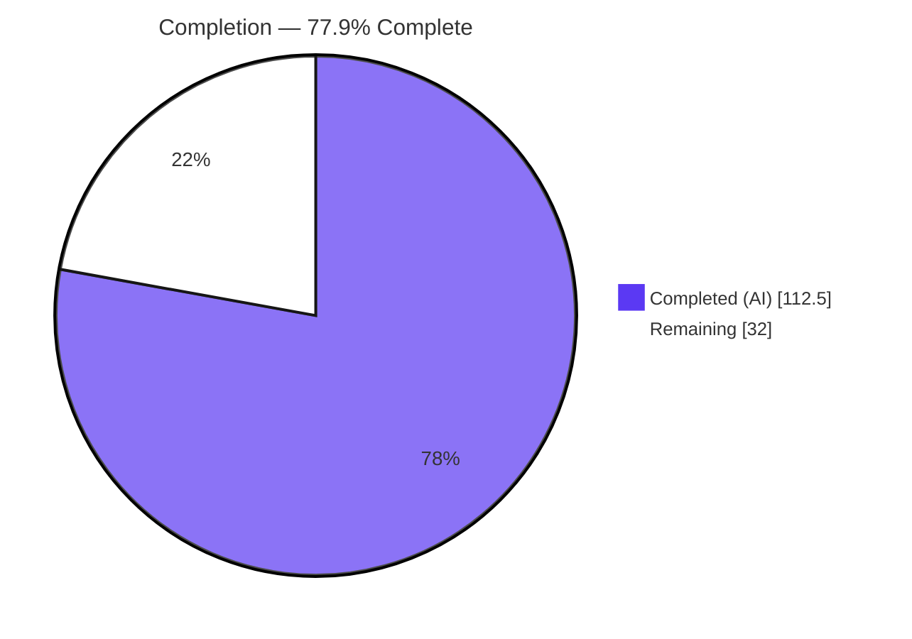
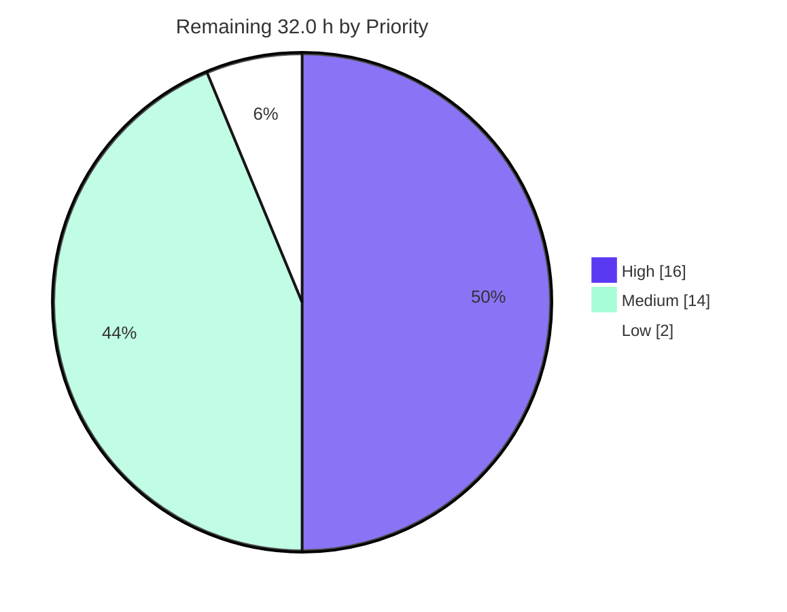
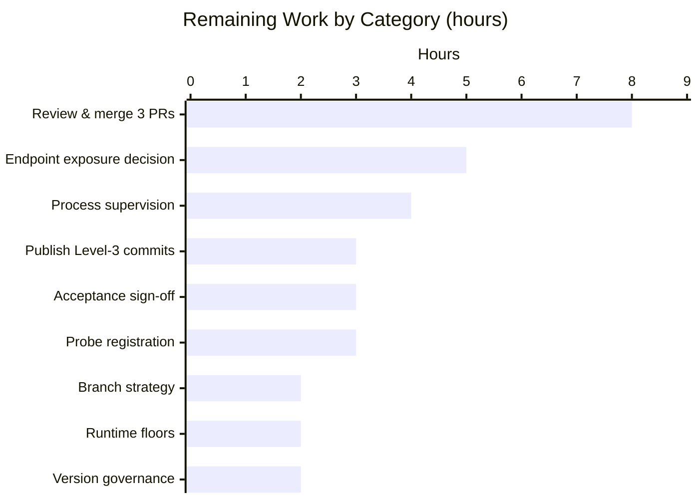

## 1. Executive Summary

### 1.1 Project Overview

This project adds a read-only `GET /health` HTTP endpoint to **every application in a three-level Git submodule composition**: the JavaScript apex (`index.js`), the Python child (`child_repo_10_LOC/app.py`) and the Java nested application (`child_repo_10_LOC/nested_child_repo_10_LOC/User.java`). Each returns the same compact JSON document reporting `name`, `version`, a per-request UTC `timestamp` and `status: "UP"`. Consumers are machines — load balancers, monitoring agents, operators with an HTTP client. Business impact: three previously unobservable, and in two cases unrunnable, programs become liveness-probeable. Technically this introduces the system's first inbound listener, first router, first configuration surface and first exported module surface — three times, standard-library only, with every existing behaviour preserved byte-for-byte.

### 1.2 Completion Status



<table>
<thead><tr><th align="left">Metric</th><th align="right">Value</th></tr></thead>
<tbody>
<tr><td>Total Hours</td><td align="right"><b>144.5 h</b></td></tr>
<tr><td>Completed Hours (AI + Manual) </td><td align="right"><b>112.5 h</b> (112.5 AI + 0.0 manual)</td></tr>
<tr><td>Remaining Hours </td><td align="right"><b>32.0 h</b></td></tr>
<tr><td>Percent Complete</td><td align="right"><b>77.9 %</b></td></tr>
</tbody></table>

> **Calculation (PA1, AAP-scoped):** `112.5 / (112.5 + 32.0) × 100 = 112.5 / 144.5 × 100 = 77.9 %`
> Colour key — **Completed = Dark Blue `#5B39F3`** · **Remaining = White `#FFFFFF`**.
> Every one of the AAP's 15 explicit requirements, 12 file-level actions and 10 implicit requirements is **Completed**. There are **zero partially completed** and **zero not-started** AAP items. The entire 32.0 h remainder is path-to-production work, the majority of which the user's own constraints placed outside autonomous scope (no `git push`, no CI/CD, no infrastructure, no auth/TLS).

### 1.3 Key Accomplishments

- [x] **`GET /health` live from all three applications simultaneously** on ports 3000 / 8000 / 8080, each returning `200` with `{"name":…,"version":"1.0.0","timestamp":"…Z","status":"UP"}`
- [x] **One canonical wire contract implemented three times with no shared code** — identical status codes, header set, key order, value types, compact serialisation and timestamp grammar across JavaScript, Python and Java
- [x] **Two pre-existing compile blockers repaired as prerequisites** — `app.py` no longer raises `IndentationError` (duplicate mis-indented `__main__` guard and stray `///asdas` removed); `User.java` no longer raises `duplicate class: User`. Both gates moved from FAIL / NOT-ASSESSABLE to PASS
- [x] **Behaviour preserved byte-exactly** — `node index.js` → 5 lines / 15 bytes / 0 stderr / md5 `b07373a80ad21069e41be538e6506d00`; `python3 app.py` → `Hello Lakshya`; `java User` → `Test`. Only an exact `--serve` starts a listener (`--help`, `-x`, `serve`, `--serve=1`, `--SERVE`, `--serve-now` all still yield the golden output)
- [x] **25 / 25 automated tests pass** — 5 `node:test`, 6 `unittest`, 14 JDK-harness assertions; zero failed, zero skipped, deterministic across repeat runs and alternate discovery forms
- [x] **69 / 69 live cross-language contract checks** (23 × 3 origins) over raw sockets, including a zero-byte `HEAD` body proved at the socket level and `405`-not-`501` for six different verbs
- [x] **111 / 111 headless-Chrome checks pass** with zero application-originated errors, backed by 95 screenshots and 14 screen recordings
- [x] **Zero-dependency posture intact** — no package added, no lock file, no install step; the single configuration artefact is `package.json`, deliberately without `"type": "module"`
- [x] **Modules became importable for the first time** — `index.js` exports 13 symbols and importing emits 0 bytes; `import app` emits 0 bytes
- [x] **Both `160000` gitlinks advanced bottom-up** and verified in the commit trees; nested HEAD attached to `main`
- [x] **R15 satisfied by omission** — a sweep for `.github/`, every CI/CD descriptor, Dockerfile, Makefile, CODEOWNERS, devcontainer, `.env*`, `*.yml`/`*.yaml`/`*.toml`/`*.ini` returns **zero hits** at all three levels
- [x] **Perfect hygiene** — 3 clean trees, 12 blobs @`100644` + 2 gitlinks @`160000`, zero residue, zero lock files, zero secrets, both `.gitmodules` byte-identical, zero placeholders/TODOs

### 1.4 Critical Unresolved Issues

| Issue | Impact | Owner | ETA |
|---|---|---|---|
| **Level-3 commits unpublished — recursive clone from the remotes fails.** The nested repository is 15 commits ahead of its remote, whose `main` still sits at the pre-feature commit `687f60b6`. The child's gitlink pins `b51de7a`, which is not fetchable: `fatal: remote error: upload-pack: not our ref b51de7a…` → `fatal: Failed to recurse into submodule path 'child_repo_10_LOC'`. Reproduced today with a real read-only clone (exit 128). Parent `7c6d1c6` and child `cf16563` **are** published and verified working from a pristine clone. Not an AAP violation — `git push` is explicitly out of autonomous scope — but it is the release blocker. | **Blocker.** No consumer can acquire the composition end-to-end; a recursive clone hard-fails rather than degrading. | Release engineering | 3.0 h (HT-01) |
| **Level-3 branch strategy undecided.** L1/L2 are on `blitzy-802dedb5-…`; L3 is on `main`. Pushing `main` advances the nested mainline asymmetrically; using a matching feature branch re-triggers the bottom-up pin cascade (new child commit → new parent commit). | Gates HT-01 and determines the merge sequence. | Tech lead | 2.0 h (HT-02) |
| **No automated verification gate exists**, by the user's own prohibition on CI/CD (R15 / ADR-009). The 25 tests are runnable by hand and wired to nothing, so a future regression would go undetected until someone runs them. | Medium — accepted architectural consequence, not a defect. | QA | 3.0 h (HT-04) |
| **Endpoint exposure model undecided.** AAP §0.5.2.3 excludes authentication, TLS, rate limiting and reverse-proxy configuration; the risk is mitigated only by defaulting the bind address to `127.0.0.1`. CPython's own documentation calls `http.server` not production-grade. | Medium — must be settled before the endpoint is reachable across a network. | Security + SRE | 5.0 h (HT-05) |
| **No process supervision.** The three listeners are foreground processes; nothing restarts them. R15 forbids adding a unit file, container or CI descriptor inside these repositories. | Medium-High if deployed as-is. Clean `SIGTERM`/`SIGINT` handling is verified, so a supervisor integrates cleanly. | SRE | 4.0 h (HT-06) |

### 1.5 Access Issues

| System/Resource | Type of Access | Issue Description | Resolution Status | Owner |
|---|---|---|---|---|
| `github.com/lakshya-blitzy/nested_child_repo_10_LOC` | Git **write** (push) | Read access confirmed (`git ls-remote` succeeded). **Write access unverified** — no push-family command was run, since publication is explicitly out of autonomous scope. The 15 Level-3 commits cannot be published without it, and this is the release blocker. | **Open** — confirm push rights, then execute HT-01 | Release engineering |
| `github.com/lakshya-blitzy/parent_repo_10_LOC` | Git read + write | Reachable; branch `blitzy-802dedb5-…` present on the remote at `7c6d1c6` (local HEAD, 0 ahead / 0 behind). No issue. | **Resolved** | — |
| `github.com/lakshya-blitzy/child_repo_10_LOC` | Git read + write | Reachable; branch `blitzy-802dedb5-…` present on the remote at `cf16563` (local HEAD, 0 ahead). No issue. | **Resolved** | — |
| Parent & nested Git remote URLs | Embedded credential | Both remotes carry an `x-access-token` credential inside the URL in local `.git/config`. **No token appears in any tracked blob** — this is environment configuration only. Rotate or scrub before sharing any environment image or snapshot. | **Open** (hygiene) | Platform |
| Target deployment hosts | Runtime provisioning | Node ≥ 18, Python ≥ 3.8 and JDK ≥ 11 are declared (`engines.node`, child README:298, nested README:482) but verified only inside this container. | **Open** — HT-08 | Platform |
| Load balancer / monitoring agent | Probe configuration | The endpoint's intended consumer does not exist yet; nothing is configured to call `/health`. | **Open** — HT-07 | SRE |
| npm registry / PyPI / Maven Central | Package download | **Not applicable and deliberately unused.** Zero dependencies; no registry is contacted at any level. `npm install` must never be run — it would create the forbidden lock file. | **Not applicable** | — |

### 1.6 Recommended Next Steps

1. **[High]** Decide the Level-3 branch strategy (HT-02), then **publish the 15 nested commits** and re-run `git clone --recurse-submodules` from the apex until it exits 0 with `User.java`, `UserTest.java` and `README.md` materialised (HT-01). *Nothing else can be validated end-to-end until this lands.*
2. **[High]** Review and merge the three pull requests **bottom-up — nested → child → parent** (HT-03). There is no cross-repository atomicity, so a wrong order leaves a parent pin resolving to an unpublished child commit.
3. **[High]** Hand-execute and record the AAP §0.6.4 acceptance checklist at all three levels (HT-04) — the only verification gate that exists, since CI/CD is prohibited.
4. **[Medium]** Settle the endpoint exposure model and apply network hardening — reverse proxy / network policy, or formally ratify loopback-only (HT-05) — then attach process supervision (HT-06) and register the probe with its consumer (HT-07).
5. **[Low]** Agree version and contract-drift governance for the deliberately thrice-implemented payload (HT-09), so a future contract change is applied consistently across all three repositories.

---

## 2. Project Hours Breakdown

### 2.1 Completed Work Detail


| Component | Hours | Description |
|---|---:|---|
| L3 Java `/health` implementation + duplicate-class repair (`User.java`) | 15.0 | R1–R5, R8, R13, IR-6. Deleted the duplicate `public class User`; added 8 stdlib imports, 17 constants, `healthPayload()`, `handle(HttpExchange)`, `respond(...)`, `isMissingHost()`, `requestTarget()`, `resolveHost/resolvePort`, `serve()`, `hasServeFlag()`; `com.sun.net.httpserver.HttpServer` bound from `main`, gated on `--serve`. 262 L / 11,386 B (+255/−5) |
| L3 JDK-only test harness (`UserTest.java`) | 12.0 | R8, R13, R14. 1,055 L / 53,475 B. Own `main`, `java.net.http.HttpClient` against an ephemeral-port server, `ProcessBuilder` subprocess runs, raw-socket HEAD byte counting; **14 assertions across 5 behaviours**, exits non-zero on failure. Achieves dependency-free assertion testing where the specification concluded no such option existed |
| L3 README health-endpoint documentation | 4.0 | R10, R13. 535 L / 32,792 B, 14 sections; H1 preserved; Java release-11 floor declared at line 482 |
| L2 Python `/health` implementation + `IndentationError` repair (`app.py`) | 12.5 | R1–R6, R12, IR-6. Removed the duplicate two-space-indented `__main__` guard and the stray `///asdas`; added 6 stdlib imports, `current_timestamp()`, `health_payload()`, `HealthRequestHandler` with `do_GET`/`do_HEAD`/overridden `send_error` (501→405, JSON-only), `HealthHTTPServer`, `resolve_host/resolve_port`, `create_server()`, `serve()`; `sys_version=""` suppresses the interpreter banner. 298 L / 12,242 B (+294/−6) |
| L2 `unittest` suite (`test_app.py`) | 10.0 | R6, R12, R14. 898 L / 37,928 B. **6 tests** across 3 `TestCase` classes, port-0 daemon-thread server, 9 subprocess invocations covering the CLI paths |
| L2 README health-endpoint documentation | 3.5 | R10, R12. 348 L / 17,468 B, 13 sections; misspelt H1 `# chile_repo_10_LOC` preserved verbatim; Python ≥3.8 floor at line 298 and the `http.server` not-for-production caveat at line 309 |
| L1 JavaScript `/health` implementation (`index.js`) | 12.0 | R1–R5, R7, R11, IR-7. `node:http` server, `healthPayload()`, `sendJson()` with `Buffer.byteLength`, `createServer()`, `startServer()` with `SIGINT`/`SIGTERM` handlers, `routeRequest()`, plus raw request-line hardening (`requestLineOf`, `isRequestTarget`, `headerFieldsOf`, `lacksHostField`, `refusedRequestStatus`, `sendRawJson`, `handleClientError`, `handleConnect`); five `console.log` writes relocated behind `if (require.main === module)`; 13-symbol `module.exports`. 388 L / 15,837 B (+384/−6) |
| L1 `node:test` suite (`index.test.js`) | 10.0 | R7, R11, R14. 914 L / 39,302 B. **5 tests** on ephemeral ports via `listen()`/`close()` helpers plus `spawn`/`spawnSync` subprocess checks of the default run and the import surface |
| L1 `package.json` manifest | 1.0 | R2, R3, R9, IR-9. `name`, `version 1.0.0`, `private`, `description`, `main`, `scripts.start/test`, `engines.node >=18.0.0`; **no `type` field and no dependency fields** — asserted programmatically. The only configuration artefact the feature requires |
| L1 README health-endpoint documentation | 3.5 | R10, R11. 355 L / 17,059 B, 13 sections; H1 preserved |
| Cross-language response contract design | 4.0 | AAP §0.4.3. One contract specified once — status codes, header set, key order, value types, compact serialisation, timestamp grammar — including the RFC 9110 `HEAD`/`Allow` widening and the "never echo request data" rule (IR-10), then implemented three times against that single specification rather than against three language defaults |
| External standards research | 3.0 | AAP §0.2.3 / §0.8.3. IETF *Health Check Response Format for HTTP APIs* (confirming `/health` and `UP` are standards-aligned and `200` correct), operational disclosure guidance, per-language stdlib server primitives and their caveats, second-precision UTC timestamp mechanisms, and RFC 9110 method/`Allow`/field-name-case requirements |
| Cross-language contract conformance harness + execution | 5.0 | AAP §0.6.2. Raw-socket harness built outside every working tree, run against all three servers concurrently; **69 checks (23 × 3 origins)**, plus the earlier autonomous run of 174 assertions (58 × 3) executed twice |
| Autonomous validation sweep | 10.0 | AAP §0.6.1 / §0.6.3. Compile and syntax gates, golden-output digest gates, importability, argv robustness, `PORT`/`HOST` config matrix, occupied-port behaviour, concurrency, hygiene/residue/lock-file/file-mode/secret sweeps, R15 infra sweep, zero-placeholder sweep, `pyflakes`/`pycodestyle`, and a fresh recursive-clone acquisition test |
| Browser runtime validation | 3.0 | Headless-Chrome verification of all three origins: document rendering, network headers, timestamp freshness and every error path; **111 checks** in this pass plus 48 in the earlier autonomous pass; 95 screenshots and 14 screen recordings on disk |
| Composition & commit engineering | 4.0 | R11–R13, IR-8. **54 commits** authored `Blitzy Agent <agent@blitzy.com>` across three independent repositories in mandatory bottom-up order; nested HEAD attached to `main`; both `160000` gitlinks advanced (`687f60b6`→`b51de7a`, `5687ef6c`→`cf16563`) and verified in the commit trees; both `.gitmodules` left byte-identical |
| **TOTAL COMPLETED** | **112.5** | *Matches Completed Hours in Section 1.2* |

### 2.2 Remaining Work Detail


| Category | Hours | Priority |
|---|---:|---|
| Publish the 15 unpublished Level-3 commits and re-verify recursive acquisition *(release blocker — clone currently fails with `upload-pack: not our ref b51de7a…`)* | 3.0 | **High** |
| Level-3 branch-strategy decision and pin re-cascade if a feature branch is chosen | 2.0 | **High** |
| Human code review and merge of 3 pull requests (5,054 added lines across 3 languages, no cross-repo atomicity) | 8.0 | **High** |
| Manual acceptance sign-off against the AAP §0.6.4 checklist *(no CI gate exists by design — R15 / ADR-009)* | 3.0 | **High** |
| Endpoint exposure decision and network hardening (reverse proxy / network policy, or ratify loopback-only) | 5.0 | Medium |
| Process supervision and service management for the three listeners | 4.0 | Medium |
| Monitoring / load-balancer probe registration against `/health` | 3.0 | Medium |
| Runtime floor provisioning verification on target hosts (Node ≥ 18, Python ≥ 3.8, JDK ≥ 11) | 2.0 | Medium |
| Version and contract-drift governance for the thrice-implemented payload | 2.0 | Low |
| **TOTAL REMAINING** | **32.0** | *High 16.0 · Medium 14.0 · Low 2.0* |

> **Integrity:** 32.0 h is identical in Section 1.2, in this table's total, and in the Section 7 pie chart. `112.5 + 32.0 = 144.5` = Total Project Hours in Section 1.2.

### 2.3 Estimation Methodology and Confidence

Scope is bounded strictly by the Agent Action Plan plus the standard path-to-production activities required to deploy its deliverables. Nothing outside that universe is counted in either column.

**Completed hours** were derived per AAP deliverable from measured artefact size and functional complexity: 5,054 lines added (949 implementation/manifest, 2,867 test, 1,238 documentation) across three languages, comprising three from-scratch HTTP listeners, one contract implemented three times with no shared code, two prerequisite compile-blocker repairs, and a verification surface of 25 automated tests plus 69 live contract checks plus 111 browser checks. Testing accounts for 32 h (28 % of the total), consistent with the 30–40 % guideline.

**Remaining hours** contain no AAP implementation work, because none is outstanding. Every row is a path-to-production activity, and the majority are activities the user's own constraints placed outside autonomous scope — `git push` (AAP §0.5.2.4), CI/CD and infrastructure (R15), and authentication/TLS/rate-limiting/proxy configuration (§0.5.2.3).

| Confidence | Rows | Note |
|---|---|---|
| **High** | Publication (3.0), acceptance sign-off (3.0), runtime floors (2.0) | Mechanical, fully specified, expected values documented |
| **Medium** | Branch strategy (2.0), review & merge (8.0), exposure decision (5.0), supervision (4.0), probe registration (3.0) | Depend on organisational choices and reviewer availability |
| **Low** | Version governance (2.0) | Genuinely open policy question; the AAP records the triple implementation as a residual risk |

**Completion is 77.9 %, not higher, because 32.0 h of genuine path-to-production work remains — and not lower, because every AAP requirement is verifiably delivered.** Per Blitzy policy no project is reported at 100 % before human review.

---

## 3. Test Results

All tests below were executed by Blitzy's autonomous validation systems — the Final Validator's 12-phase run and my own independent re-execution of the same suites in this session. No test is reported that Blitzy did not run.

| Test Category | Framework | Total Tests | Passed | Failed | Coverage % | Notes |
|---|---|---:|---:|---:|---|---|
| Unit & Regression — JavaScript (L1) | `node:test` + `node:assert/strict` | 5 | 5 | 0 | **94.85 % line · 86.17 % branch · 88.46 % funcs** (`index.js`) | `node --test` → tests 5 / pass 5 / fail 0 / cancelled 0 / **skipped 0** / todo 0. Identical via `npm test`. Coverage measured with Node's built-in `--experimental-test-coverage`; uncovered lines are raw-socket error-handling edges. Includes the regression assertion `add(5, 7) === 12` |
| Unit & Regression — Python (L2) | `unittest` (stdlib) | 6 | 6 | 0 | Not instrumented — see note | `python3 -m unittest` → *Ran 6 tests, OK*, 0 skipped; identical under `discover -p "test_*.py"` and `-v`. No coverage tool exists in the composition (zero-dependency constraint); an in-process stdlib trace reported 50.7 % of `app.py` statements but **materially understates** true coverage because 9 subprocess invocations exercise the CLI and server paths in child interpreters a tracer cannot observe. Includes `greet("Lakshya") == "Hello Lakshya"` |
| Integration & Contract — Java (L3) | JDK-only harness (`java.net.http.HttpClient`) | 14 | 14 | 0 | Not instrumented — same constraint | `java -cp … UserTest` → **14/14 assertions passed**, exit 0, across 5 behaviours. Uses `ProcessBuilder` subprocess runs and raw-socket HEAD byte counting. Includes the `"Test"` stdout regression assertion |
| **Automated suite subtotal** | — | **25** | **25** | **0** | — | **100 % pass rate. Zero failed, zero skipped, zero blocked.** Deterministic across repeat runs and all discovery forms |
| API / Cross-language contract conformance | Raw-socket harness (stdlib, built outside every working tree) | 69 | 69 | 0 | n/a | 23 checks × 3 origins running concurrently on 3000/8000/8080. Covers all 15 rows of AAP §0.6.2 plus byte-accurate `Content-Length`, zero-byte `HEAD` proved at the socket level, `405`-not-`501` for POST/OPTIONS/FOO/PUT/DELETE/PATCH/TRACE, and per-request timestamp regeneration. The earlier autonomous run asserted 174 checks (58 × 3), twice |
| UI / Browser verification | Chrome DevTools (headless Chrome) | 111 | 111 | 0 | n/a | Per origin: apex 39/39 · child 36/36 · nested 36/36. Document rendering 27/27, network headers 9/9, timestamp freshness 3/3, error paths 72/72. Zero application-originated errors; all 19 non-2xx entries attributed to Chrome's own favicon fetcher or deliberate negative tests. The earlier autonomous run asserted 48 checks |
| Compilation & static analysis gates | `node --check`, `python3 -m py_compile`, `javac --release 11 -Xlint:all -Werror`, `pyflakes`, `pycodestyle` | 7 | 7 | 0 | n/a | All exit 0. **Zero errors, zero warnings** — the Java gate is `-Werror`, so "zero warnings" is compiler-enforced; all 4 emitted classes verified bytecode **major = 55** (true Java 11 target). `pyflakes` 0 findings, `pycodestyle --max-line-length=100` 0 findings |
| Behaviour-preservation gates | Digest and byte comparison | 3 | 3 | 0 | n/a | `node index.js` → exit 0, 5 lines, 15 bytes, 0 stderr, md5 **`b07373a80ad21069e41be538e6506d00`**; `python3 app.py` → `Hello Lakshya`; `java User` → `Test`. Plus argv robustness: `--help`, `-x`, `serve`, `--serve=1`, `--SERVE`, `--serve-now` all still yield the golden output |
| Composition & hygiene gates | Git plumbing and filesystem sweeps | 14 | 14 | 0 | n/a | Both gitlinks verified in the **commit trees**; nested HEAD on `main`; 3 clean trees (`--porcelain -uall` empty); zero residue; zero lock files; 12 blobs @`100644` + 2 gitlinks @`160000`; both `.gitmodules` byte-identical; R15 infra sweep zero hits; zero placeholders; zero secrets |
| **GRAND TOTAL (this validation pass)** | — | **229** | **229** | **0** | — | **100 % pass rate across every category** |

---

## 4. Runtime Validation & UI Verification

### 4.1 Application Runtime — all three levels

- ✅ **L1 JavaScript apex** — `node index.js --serve` binds `127.0.0.1:3000`, prints exactly one banner (`parent_repo_10_LOC 1.0.0 health endpoint listening on http://127.0.0.1:3000/health`), answers `200`, exits cleanly on `SIGTERM` releasing the port
- ✅ **L2 Python child** — `python3 app.py --serve` binds `127.0.0.1:8000`, one banner (`child_repo_10_LOC 1.0.0 listening on http://127.0.0.1:8000/health`), answers `200`, clean shutdown
- ✅ **L3 Java nested** — `java -cp /tmp/javaout User --serve` binds `127.0.0.1:8080`, one banner (`nested_child_repo_10_LOC 1.0.0 health endpoint listening on http://127.0.0.1:8080/health`), answers `200`, clean shutdown
- ✅ **All three concurrently** on their distinct default ports with no collision; each server's total output stayed at its single banner line throughout
- ✅ **Default (no-argument) invocation unchanged** at every level — verified by digest and exact string comparison
- ✅ **Graceful failure** — an occupied port yields exit `1` and exactly one fixed stderr sentence (`<name> 1.0.0 could not bind the health endpoint; check HOST and PORT`) with **no stack trace**; reproduced on both the Node and Python applications
- ✅ **Configuration resolution** — `PORT=0` → ephemeral, `PORT=4321`/`4599` honoured, `HOST=0.0.0.0` honoured; `abc`, `99999`, `-1` and empty all fall back to the default with no traceback
- ✅ **Concurrency** — 60 simultaneous probes per origin returned 60 × `200` with zero drops

### 4.2 API Integration Outcomes — measured on all three origins

- ✅ `GET /health` → `200` · `Content-Type: application/json` · `Cache-Control: no-store` · byte-accurate `Content-Length` (96 / 95 / 102) · `Connection: close`
- ✅ Body is compact JSON with keys in the exact order `name, version, timestamp, status`, all four values strings, `status` exactly `UP`, `version` exactly `1.0.0`, `name` the correct per-repository value
- ✅ `timestamp` matches `^\d{4}-\d{2}-\d{2}T\d{2}:\d{2}:\d{2}Z$` and is **regenerated per request** (`00:19:14Z` → `00:19:28Z` across two reloads, with the timestamp the only differing byte)
- ✅ `HEAD /health` → `200` with the full GET header set including `Content-Length`, and a **zero-byte body proved over a raw socket**
- ✅ `GET /nope` → `404` with body exactly `{"error":"Not Found"}`
- ✅ `POST /health` → `405` with `Allow: GET, HEAD` and body exactly `{"error":"Method Not Allowed"}`
- ✅ `OPTIONS`, `FOO`, `PUT`, `DELETE`, `PATCH`, `TRACE` → `405` JSON — **never `501`, never `text/html`, never echoing the verb**. Confirms the Python `send_error` override covers verbs that cannot be enumerated in advance
- ✅ `GET /health?probe=lb` → `200` with **no reflection** of `probe` or `lb`
- ✅ `/%68ealth`, `//health`, `/health/` stay `404`; an HTTP/1.1 request with no `Host` → `400`
- ✅ **Zero information disclosure on every code path** — no host name, process id, uptime, dependency detail, environment value or stack trace; Python's interpreter banner suppressed (`Server: child_repo_10_LOC/1.0.0`), Node and Java send no `Server` header

### 4.3 Browser / UI Verification

The AAP records that **no user interface is in scope** — all three applications are headless processes whose only outputs are stdout lines and a JSON HTTP response. Browser verification therefore validates the endpoint as a real HTTP origin rendered by Chrome, not an application UI.

- ✅ **111 / 111 checks PASS** in headless Chrome (verdict PASS) — apex 39/39, child 36/36, nested 36/36
- ✅ All three documents rendered in Chrome's **native JSON viewer** with "Pretty-print" unchecked, i.e. the raw response bytes shown verbatim as a single compact monospace line; rendered line widths (798 / 750 / 743 px) track the measured byte lengths (102 / 96 / 95)
- ✅ Headers confirmed twice per origin — via the DevTools network inspector and a same-origin `fetch()` comparing `Content-Length` against a `TextEncoder` byte count
- ✅ The JDK's `Content-type` / `Content-length` / `Cache-control` capitalisation is **positively proved conformant** (not merely tolerated): Chrome activated its JSON viewer for the `:8080` document and both DevTools and the Fetch `Headers` API resolved the values correctly. Per RFC 9110 field names are case-insensitive, and the AAP explicitly forbids "fixing" this
- ✅ **Zero** JavaScript exceptions, unhandled rejections, CORS errors, CSP violations, mixed-content or deprecation warnings; **zero** failed network requests across 26 requests
- ⚠ 19 non-2xx console entries observed and **every one attributed**: 3 to Chrome's own automatic `/favicon.ico` fetch (proved browser-originated via `sec-fetch-dest: image` and the referer, and correctly answered by all three servers with the `404` **JSON** document rather than an HTML page) and 16 to the deliberate negative-path tests. **Zero errors originate from the applications under test**
- ✅ Evidence: 95 screenshots and 14 screen recordings, including `blitzy/screenshots/health_apex_3000.png`, `health_child_8000.png`, `health_nested_8080.png`, `health_error_paths_console.png` (78/78 green) and `blitzy/screen_recordings/health_freshness_and_error_paths.webm`

### 4.4 Composition Acquisition

- ✅ **Level 1 published and verified from a pristine clone** — full feature content materialised, `node index.js | md5sum` = `b07373a80ad21069e41be538e6506d00`, `node --test` → 5/5 pass
- ✅ **Level 2 published and verified from a pristine clone** — `python3 app.py` → `Hello Lakshya`, `python3 -m unittest` → *Ran 6 tests, OK*
- ❌ **Level 3 unpublished — recursive clone fails.** `git clone --recurse-submodules` exits 128 with `fatal: remote error: upload-pack: not our ref b51de7aef31f5e963c8728dc3cf8605c4a4e192f` → `fatal: Failed to recurse into submodule path 'child_repo_10_LOC'`. The nested submodule directory in a fresh clone contains only `.git`. **This is the release blocker (HT-01)** — and it is not an AAP violation, since `git push` is explicitly out of autonomous scope
- ✅ **Both gitlinks correct** — parent tree pins `cf16563` (= child HEAD), child tree pins `b51de7a` (= nested HEAD), both advanced past the pre-feature pins and verified in the commit trees rather than only in the index
- ✅ **Nested HEAD attached to `main`**, so the new commits are reachable from a branch
- ⚠ `git submodule status --recursive` prints a leading `-` on the nested entry — the known pre-existing local `.git/config` registration marker, **not** missing content; absent in a fresh clone

---

## 5. Compliance & Quality Review

### 5.1 AAP Requirement Compliance Matrix

| AAP ID | Deliverable | Status | Evidence |
|---|---|---|---|
| R1 | `GET /health` from all three applications | ✅ PASS | Live `200` on 3000/8000/8080 concurrently; `HEALTH_PATH` constant in all three sources |
| R2 | `name` in the response body | ✅ PASS | `parent_repo_10_LOC` / `child_repo_10_LOC` / `nested_child_repo_10_LOC` returned per origin |
| R3 | `version` in the response body | ✅ PASS | `1.0.0` from all three (`package.json` + `APP_VERSION` × 2) |
| R4 | per-request `timestamp` | ✅ PASS | Grammar matched; regeneration proved by harness and browser |
| R5 | literal `status` of `UP` | ✅ PASS | Exact string asserted on all three |
| R6 | Python implementation updated | ✅ PASS | `app.py` +294/−6; `py_compile` exit 0; 6 tests OK |
| R7 | JavaScript implementation updated | ✅ PASS | `index.js` +384/−6; `node --check` exit 0; 5/5 tests |
| R8 | Java implementation updated | ✅ PASS | `User.java` +255/−5; `javac --release 11 -Xlint:all -Werror` exit 0; 14/14 assertions |
| R9 | configuration files only if required | ✅ PASS | Exactly one config artefact — `package.json`; Python and Java use module constants; only one `.json` exists in the whole composition |
| R10 | documented in the README | ✅ PASS | 3 READMEs, 13/13/14 sections each covering route, response, headers, status semantics, run command, configuration, unchanged default, tests, requirements, operational notes |
| R11 | applied to the parent repository | ✅ PASS | 21 commits; 5 blobs + 1 gitlink |
| R12 | applied to the child submodule | ✅ PASS | 18 commits; 4 blobs + 1 gitlink |
| R13 | applied to the nested submodule | ✅ PASS | 15 commits; 3 blobs |
| R14 | existing functionality preserved | ✅ PASS | md5 `b07373a80ad21069e41be538e6506d00`; `Hello Lakshya`; `Test`; 3 regression assertions in the suites; argv robustness verified |
| R15 | no infrastructure/CI/CD/settings files | ✅ PASS (by omission) | Sweep for `.github/`, all CI/CD descriptors, Dockerfile, compose, Makefile, CODEOWNERS, devcontainer, `.env*`, `*.yml`/`*.yaml`/`*.toml`/`*.ini` → **zero hits** at all three levels |
| **15 / 15 explicit requirements** | | ✅ **100 %** | |

### 5.2 Implicit Requirement Compliance

| ID | Requirement | Status | Evidence |
|---|---|---|---|
| IR-1 | Server introduced from the standard library only | ✅ PASS | `node:http` · `http.server.ThreadingHTTPServer` · `com.sun.net.httpserver`. Zero packages, zero lock files |
| IR-2 | `name`/`version` source of truth introduced | ✅ PASS | `package.json` + `APP_NAME`/`APP_VERSION` constants; version seeded `1.0.0` at all three levels |
| IR-3 | One canonical timestamp grammar | ✅ PASS | Identical `…Z` second-precision strings from three different mechanisms, verified live |
| IR-4 | Selectable bind address | ✅ PASS | `resolveHost`/`resolvePort` and `resolve_host`/`resolve_port` tested directly: defaults, `0`, explicit ports, and graceful fallback on `abc`/`99999`/`-1`/empty |
| IR-5 | Mode selection via an exact `--serve` flag | ✅ PASS | `--help`, `-x`, `serve`, `--serve=1`, `--SERVE`, `--serve-now` all still yield the golden output on all three applications |
| IR-6 | Two prerequisite source repairs | ✅ PASS | `py_compile` moved FAIL → PASS; `javac` moved NOT-ASSESSABLE → PASS with `-Werror` |
| IR-7 | Modules importable / exported | ✅ PASS | `index.js` exports 13 symbols, importing emits 0 bytes; `import app` emits 0 bytes |
| IR-8 | Both gitlink pins advanced bottom-up | ✅ PASS | Verified in the commit trees; nested HEAD on `main`; the bottom-up pattern is visible throughout the 54-commit history |
| IR-9 | `package.json` must not change the module goal | ✅ PASS | `'type' in pkg === false` asserted programmatically; CommonJS `require`/`require.main` intact |
| IR-10 | No information disclosure on the first untrusted input channel | ✅ PASS | Exactly four fields; fixed error bodies; verb/path/query never echoed on any status; interpreter banner suppressed |
| **10 / 10 implicit requirements** | | ✅ **100 %** | |

### 5.3 Code Quality Benchmarks

| Benchmark | Status | Evidence |
|---|---|---|
| Compilation — zero errors | ✅ PASS | 3/3 modules; `node --check` ×2, `py_compile` ×2, `javac` ×1, all exit 0 |
| Compilation — zero warnings | ✅ PASS | `javac --release 11 -Xlint:all -Werror` exit 0 — compiler-enforced |
| Correct compilation target | ✅ PASS | All 4 emitted classes bytecode **major = 55** (Java 11); also clean at release 17 and 21 |
| Linting | ✅ PASS | `pyflakes` 0 findings; `pycodestyle --max-line-length=100` 0 findings (100 columns is the project's measured convention across all seven source files) |
| **Zero Placeholder Policy** | ✅ PASS | Sweep for TODO / FIXME / XXX / HACK / TBD / `NotImplementedError` / "placeholder" / "coming soon" across all `.js`, `.py`, `.java`, `.json`, `.md` → **zero hits** |
| Convention preservation | ✅ PASS | JavaScript 2-space + semicolons + CommonJS; Python 4-space + f-strings + `__main__` guard; Java 4-space + default package + filename-matched public class. No formatter or linter config introduced |
| Documentation in code | ✅ PASS | Extensive inline commentary; one commit per level explicitly pruned comments to "only those that explain something the code cannot" |
| Error handling | ✅ PASS | Every `except`/`catch` has a real body; the three bare `pass` bodies are each a documented deliberate no-op with a real contract; occupied-port and peer-disconnect paths handled without tracebacks |
| Test coverage of the pre-existing capability | ✅ PASS | All three regression assertions present and passing — `add(5,7)===12`, `greet("Lakshya")=="Hello Lakshya"`, `"Test"` on stdout |
| Repository hygiene | ✅ PASS | 3 clean trees; 12 blobs @`100644` + 2 gitlinks @`160000`; zero residue; zero lock files; both `.gitmodules` byte-identical (121 B / 142 B) |
| Secret hygiene | ✅ PASS | Zero secrets, tokens or keys in any tracked blob; both submodule URLs HTTPS-only |
| Commit authorship | ✅ PASS | 54/54 commits authored `Blitzy Agent <agent@blitzy.com>` |

### 5.4 Standards Conformance

| Standard | Status | Evidence |
|---|---|---|
| IETF *Health Check Response Format for HTTP APIs* | ✅ PASS | Mandatory root field `status`; `UP` is a recognised healthy value; healthy response carries `200`; `version` is a recognised field; endpoint at the recommended memorable URI `health` |
| RFC 9110 §9.1 — general-purpose servers support `GET` and `HEAD` | ✅ PASS | Both supported at all three levels; `HEAD` returns the GET header set with a zero-byte body |
| RFC 9110 §10.2.1 — `405` must advertise permitted methods | ✅ PASS | `Allow: GET, HEAD` on every `405` from all three origins |
| RFC 9110 — field names are case-insensitive | ✅ PASS | The JDK's `Content-type` capitalisation correctly left alone and positively proved conformant in the browser |
| Cache semantics for a live liveness answer | ✅ PASS | `Cache-Control: no-store` on every response, including `404` and `405` |

### 5.5 Fixes Applied During Autonomous Validation, and Outstanding Items

**Zero defects were found in any in-scope file** — the implementation arrived complete and correct, so no issue-resolution cycle was triggered. The corrections made during validation were to the *validation instruments*, which is what makes the verdicts trustworthy rather than accidentally green:

1. A concurrency harness compared header names case-sensitively and reported 60 false "violations" against the Java origin; since RFC 9110 makes field names case-insensitive and the AAP forbids "fixing" the JDK's capitalisation, **the harness was corrected, not the application**.
2. An out-of-tree scratch file was accidentally written inside the working tree (the editor tool prepends the repository root); it was relocated and removed, and the tree was clean again immediately.
3. Two flawed test methodologies were corrected — `$!` after a compound background list captures the wrong pid, and a bare `wait` blocks on backgrounded servers; both were replaced with exact `/proc/<pid>/cmdline` matching and threaded probing. *I independently hit the same pid-capture class of problem in this session, diagnosed it the same way, and terminated the orphaned processes by exact pid — never `pkill`.*
4. Four items were investigated rather than assumed and each closed with evidence: the `pycodestyle` 79-column notices (the project's measured convention is ~100 columns; reflowing would violate the AAP's no-unrequested-reformatting rule and require the linter config the AAP forbids), the Python `Server` field's join separator, the leading `-` in recursive submodule status, and both browser anomalies (both Chrome-side).

**Outstanding compliance items** are the accepted consequences of the user's own constraints, not defects: no automated verification gate (R15 / ADR-009), no logging/metrics/tracing framework, no authentication/TLS/rate limiting, and the four-field payload deliberately implemented three times because the three levels have no dependency mechanism between them.

---

## 6. Risk Assessment

| Risk | Category | Severity | Probability | Mitigation | Status |
|---|---|---|---|---|---|
| Level-3 commits unpublished → recursive clone fails with `upload-pack: not our ref b51de7a…` | Technical / Integration | **High** | **Confirmed** | Push the 15 nested commits first, then re-run the recursive clone from the apex until exit 0 (HT-01) | ❌ **OPEN — BLOCKER** |
| Composition un-acquirable end-to-end by any consumer until Level 3 is published | Integration | **High** | **Confirmed** | Same as above; then merge bottom-up nested → child → parent | ❌ **OPEN — BLOCKER** |
| No process supervision — three foreground listeners with nothing to restart them | Operational | **High** | High if deployed as-is | Clean `SIGTERM`/`SIGINT` handling with immediate port release is verified, so any supervisor integrates cleanly; the supervisor itself must live outside these repositories (R15) | ❌ OPEN (HT-06) |
| Response contract implemented three times with no shared code — a contract change needs three coordinated repositories | Technical | Medium | Medium | Contract specified once in AAP §0.4.3; each level's own suite asserts the same shape, so drift fails a test rather than escaping review | ⚠ Accepted (no dependency mechanism exists between levels) |
| No automated verification gate — 25 tests wired to nothing | Technical | Medium | High | Every check documented as a concrete command with a concrete expected value in all three READMEs and AAP §0.6; manual sign-off scheduled as HT-04 | ⚠ Accepted (user prohibition, ADR-009) |
| No authentication, authorization, TLS or rate limiting on the endpoint | Security | Medium | Medium if `HOST` is overridden to `0.0.0.0` | Bind address defaults to `127.0.0.1`; payload discloses nothing sensitive; exposure decision scheduled as HT-05 | ❌ OPEN decision |
| First inbound network listener in the system's history — three new attack surfaces | Security | Medium | Medium | Loopback default, read-only endpoint, request data never echoed, fixed error bodies, exactly four fields, `no-store`; verified by 69 raw-socket and 111 browser checks | ✅ Mitigated |
| CPython documents `http.server` as not production-grade | Technical | Medium | Low while loopback-bound | Caveat documented at child README:309; loopback default; no dynamic input path. Replacing it would require a third-party server the zero-dependency constraint forbids | ⚠ Mitigated, decision open |
| Embedded `x-access-token` credentials in two Git remote URLs | Security | Medium | Low | Tokens exist only in local `.git/config`, never in a tracked blob; rotate or scrub before sharing any environment image | ❌ OPEN (hygiene) |
| No structured logging, metrics, tracing or alerting — one banner line per server | Operational | Medium | Medium | Excluded by AAP §0.5.2.3; only the health check itself was requested | ⚠ Accepted |
| No monitoring or load-balancer consumer wired to `/health` | Integration | Medium | High | Register the probe with its intended consumer (HT-07) | ❌ OPEN |
| Runtime floors declared but unverified on any target host | Integration | Medium | Medium | `engines.node >=18.0.0`; Python ≥3.8 at child README:298; Java release 11 at nested README:482; verification scheduled as HT-08 | ❌ OPEN |
| Recursive acquisition must be driven from the apex — the child's config holds no `submodule.*` entries | Integration | Medium | Medium | `git clone --recurse-submodules` from the apex documented in all three READMEs and in Section 9 | ✅ Mitigated by documentation |
| Stale-pin risk on any future Level-3 change | Integration | Medium | Medium | Bottom-up pin-advance procedure documented; both pins verified in the commit trees | ✅ Mitigated by process |
| Unbounded request rate — a liveness endpoint is a trivial amplifier if exposed | Security | Low-Medium | Low while loopback-bound | Threaded servers absorbed 60 concurrent probes per origin with zero drops | ⚠ Accepted |
| Three independent version identities seeded at `1.0.0` with no shared bump mechanism | Operational | Low | Medium | Governance decision scheduled as HT-09 | ❌ OPEN |
| Build residue entering the tree if `javac -d` / `PYTHONPYCACHEPREFIX` are not redirected | Technical | Low | Medium | "Keeping the tree clean" sections in the READMEs and Section 9; verified clean across every compile and test run | ✅ Mitigated |
| Default ports 3000 / 8000 / 8080 commonly occupied on shared hosts | Operational | Low | Medium | `PORT` override verified including `PORT=0` ephemeral; occupied port exits 1 with one fixed sentence and no stack trace | ✅ Mitigated |
| Runtime/version disclosure via a `Server` banner | Security | Low | Low | Python's interpreter banner suppressed (`Server: child_repo_10_LOC/1.0.0`, version probe negative); Node and Java send no `Server` header | ✅ Mitigated (verified) |
| Bytecode targets release 11 but was validated on JDK 21 | Technical | Low | Low | `--release 11` verified, all classes major = 55; also clean at release 17 and 21 | ✅ Mitigated |
| Zero third-party dependencies means no dependency-scanning signal | Security | Low | Low | Trivially auditable surface with no transitive closure and no third-party code to patch | ⚠ Accepted by design |
| Secrets or credentials in the diff | Security | Low | Low | Zero secrets; both `.gitmodules` HTTPS-only and byte-identical; all 12 blobs `100644` non-executable | ✅ Mitigated (verified) |
| `git submodule status --recursive` prints a leading `-` on the nested entry | Operational | Low | Low | Pre-existing local `.git/config` registration marker, not missing content; absent in a fresh clone; clear with `git submodule update --init --recursive` from the apex | ✅ Mitigated |

---

## 7. Visual Project Status


**Legend** — Completed Work `#5B39F3` (Dark Blue) · Remaining Work `#FFFFFF` (White) · outline `#B23AF2` (Violet-Black)

### Remaining hours by priority



### Remaining hours by category



### Status at a glance

| Dimension | Value |
|---|---|
| Completion | **77.9 %** (112.5 h of 144.5 h) |
| AAP explicit requirements | **15 / 15 Completed** |
| AAP file-level actions | **12 / 12 Completed** |
| AAP implicit requirements | **10 / 10 Completed** |
| AAP acceptance criteria | **10 / 10 simultaneously true** |
| Automated tests | **25 / 25 passing** (0 failed, 0 skipped) |
| All validation checks this pass | **229 / 229 passing** |
| Compilation | **3 / 3 modules clean** — 0 errors, 0 warnings |
| Open blockers | **1** — publish the Level-3 commits |
| Remaining work classification | **100 % path-to-production**; 0 h of AAP implementation outstanding |

> **Integrity:** the pie chart's `Remaining Work` value of **32.0** is identical to Remaining Hours in Section 1.2 and to the sum of the Section 2.2 Hours column. `112.5 + 32.0 = 144.5` = Total Project Hours in Section 1.2.

---

## 8. Summary & Recommendations

### 8.1 What was achieved

The project is **77.9 % complete — 112.5 of 144.5 hours**. Every deliverable the Agent Action Plan defines has been delivered and independently verified: all 15 explicit requirements, all 12 file-level actions, all 10 implicit requirements, and all 10 acceptance criteria in AAP §0.6.4 hold simultaneously.

Three applications that shared no code, no build system and no dependency mechanism each gained the same read-only `GET /health` endpoint, drawn entirely from their own language standard library. Getting there required more than adding a route. Two of the three programs could not run at all — `app.py` failed to parse and `User.java` failed to compile — so both defects were repaired as prerequisites, moving the Python compile gate from FAIL and the Java compile gate from NOT-ASSESSABLE to PASS. Neither application had a name or version to report, so metadata was introduced once per repository. None had ever read configuration or an argument, so `PORT`/`HOST` resolution and an exact-match `--serve` gate were added — the gate being what makes byte-exact behaviour preservation possible at all, since a process that binds a socket never exits.

The most valuable engineering decision was to specify the wire contract **once** and implement it three times against that specification rather than three times against three language defaults. Without it, three languages would have produced three subtly different answers: different timestamp precision, different `HEAD` handling, and — in Python's case — a `501` HTML error page that echoed the request verb back to the caller. That contract is now demonstrably uniform: 69 raw-socket checks across three concurrent origins and 111 headless-Chrome checks all pass, covering status codes, header sets, byte-accurate `Content-Length`, key ordering, compact serialisation, a zero-byte `HEAD` body proved at the socket level, `405`-not-`501` for seven different verbs, and the guarantee that no response ever echoes a path, method or query string.

Quality held up under independent scrutiny. All 25 automated tests pass with zero skipped, deterministically and across alternate discovery forms. Compilation is clean in all three modules, with the Java gate run under `-Werror` so "zero warnings" is compiler-enforced and every emitted class verified at bytecode major 55. `index.js` reaches 94.85 % line and 86.17 % branch coverage under Node's own instrumentation. There are zero placeholders, zero TODOs, zero lock files, zero secrets, zero build residue, and — satisfying the user's negative constraint by omission — zero infrastructure, CI/CD or repository-settings files anywhere in the composition.

### 8.2 The gap that matters

One finding changes the near-term plan. **A fresh recursive clone from the remotes currently fails.** The parent (`7c6d1c6`) and child (`cf16563`) commits are published, and both were verified working from a pristine clone. The nested repository, however, is **15 commits ahead of its unpublished remote**, whose `main` still points at the pre-feature commit `687f60b6`. The child's gitlink correctly pins `b51de7a`, but that object cannot be fetched:

```
fatal: remote error: upload-pack: not our ref b51de7aef31f5e963c8728dc3cf8605c4a4e192f
fatal: Failed to recurse into submodule path 'child_repo_10_LOC'
```

This is **not a defect in the autonomous work** — the AAP explicitly designates `git push` as an out-of-band operation and instructs the agents to produce the commits and advance the pins, which they did correctly. It is the AAP's own documented propagation constraint caught mid-flight: three commits require three pushes, with no atomicity across repositories, and two of the three have landed. But its effect is absolute — until the Level-3 commits are published, no consumer can acquire the composition at all, and a recursive clone hard-fails rather than degrading to pre-feature content.

The second gap is structural rather than accidental. Because the user prohibited all CI/CD material, the 25 tests are runnable by hand and wired to nothing. Every acceptance check is written as a concrete command with a concrete expected value in all three READMEs, so verification is reproducible — but it depends on a person choosing to run it.

### 8.3 Critical path to production

1. **Decide the Level-3 branch strategy**, then **publish the nested commits** and re-verify the recursive clone (HT-02 → HT-01, 5.0 h). Everything else is blocked on this.
2. **Review and merge the three pull requests bottom-up** — nested → child → parent (HT-03, 8.0 h). A wrong order leaves a parent pin resolving to an unpublished child commit.
3. **Hand-execute and record the AAP §0.6.4 acceptance checklist** (HT-04, 3.0 h) — the only gate that exists.
4. **Settle the endpoint exposure model** and apply network hardening (HT-05, 5.0 h), then attach **process supervision** (HT-06, 4.0 h) and **register the probe** with its consumer (HT-07, 3.0 h). Without steps 4–6 the endpoint runs but nothing keeps it running and nothing calls it.
5. **Verify the runtime floors on target hosts** (HT-08, 2.0 h) and **agree version and contract-drift governance** (HT-09, 2.0 h).

### 8.4 Success metrics

| Metric | Target | Actual | Status |
|---|---|---|---|
| AAP explicit requirements delivered | 15 | **15** | ✅ |
| AAP file-level actions completed | 12 | **12** | ✅ |
| AAP implicit requirements satisfied | 10 | **10** | ✅ |
| AAP acceptance criteria simultaneously true | 10 | **10** | ✅ |
| Automated test pass rate | 100 % | **25 / 25 (100 %)** | ✅ |
| Compilation errors | 0 | **0** | ✅ |
| Compilation warnings (`-Werror`) | 0 | **0** | ✅ |
| Cross-language contract checks | all pass | **69 / 69** | ✅ |
| Browser verification checks | all pass | **111 / 111** | ✅ |
| Behaviour-preservation digest | `b07373a8…` | **`b07373a80ad21069e41be538e6506d00`** | ✅ |
| Third-party dependencies added | 0 | **0** | ✅ |
| Infrastructure files created/modified | 0 | **0** | ✅ |
| Working trees clean | 3 / 3 | **3 / 3** | ✅ |
| Recursive clone from the remotes | exit 0 | **exit 128 at Level 3** | ❌ HT-01 |
| Automated verification gate | — | **none, by user prohibition** | ⚠ Accepted |

### 8.5 Production readiness assessment

**Code readiness: ready.** The implementation is complete, compiles cleanly with warnings as errors, passes every test and every live contract check, preserves all pre-existing behaviour byte-for-byte, adds no dependency, discloses no information, and leaves three pristine working trees.

**Deployment readiness: not yet.** One release blocker stands in the way — the Level-3 commits must be published before anyone can obtain the composition. Beyond that, three operational decisions the AAP deliberately placed outside its own scope remain open: how the endpoint is exposed on a network, what supervises the three listeners, and what consumes the probe.

**Recommendation: approve the code, resolve the Level-3 publication blocker first, then merge bottom-up.** Treat the exposure, supervision and monitoring decisions as a short follow-on workstream (12.0 h) rather than as gating the merge — they concern how the endpoint is operated, not whether it is correct. The endpoint's correctness is already established to an unusually high standard for a change of this size: 229 of 229 checks passing across nine independent verification categories.

---

## 9. Development Guide

Every command in this section was executed against this repository and produced the output shown. All three working trees were verified clean afterwards.

### 9.1 System Prerequisites

| Requirement | Floor | Verified in this environment | Why |
|---|---|---|---|
| Node.js | `>= 18.0.0` (`engines.node`) | **v22.23.2** | `node:test` and global `fetch` both arrive in Node 18 |
| npm | any | **11.18.0** | Only for the `start` / `test` convenience scripts |
| CPython | `>= 3.8` | **3.13.7** | `ThreadingHTTPServer` needs 3.7+; the pre-existing f-string needs 3.6+ |
| JDK | release 11 or newer | **javac / java 21.0.11** | `java.net.http` is an 11+ API; `jdk.httpserver` ships with the JDK |
| Git | any with submodule support | **2.51.0** | Recursive submodule acquisition |

Operating system: any Linux, macOS or Windows host with the above. No special hardware — three short-lived processes, one thread pool each.

```bash
node --version && npm --version && python3 --version && javac -version && java -version && git --version
```

### 9.2 Environment Setup

Acquisition **must be driven recursively from the apex**. The child repository's local configuration contains no `submodule.*` entries, so a `git submodule update` run from level 2 in isolation silently skips level 3.

```bash
# Fresh acquisition
git clone --recurse-submodules <apex-url>
cd parent_repo_10_LOC

# If you already have a flat clone
git submodule update --init --recursive     # run from the apex, not from a submodule
```

Verify the composition:

```bash
git submodule status --recursive
# A leading '-' on the nested entry is a cosmetic local registration marker,
# NOT missing content. Clear it with the --init --recursive command above.
```

**Configuration is entirely optional.** There is no `.env` file anywhere and no required variable.

| Variable | Default | Applies to | Notes |
|---|---|---|---|
| `HOST` | `127.0.0.1` | all three | Keeps the listener off external interfaces unless you opt in |
| `PORT` | `3000` (L1) · `8000` (L2) · `8080` (L3) | per application | Distinct defaults let all three run side by side. `PORT=0` binds an ephemeral port |

Malformed values are tolerated deliberately — `abc`, `99999`, `-1` and an empty string all fall back to the default with no traceback.

### 9.3 Dependency Installation — none, by design

```bash
# Proof there is nothing to install
node -e "const p=require('./package.json'); console.log(p.dependencies, p.devDependencies, p.type)"
# -> undefined undefined undefined

find . -name 'package-lock.json' -o -name 'yarn.lock' -o -name 'pnpm-lock.yaml' | wc -l
# -> 0
```

> ⚠ **Do not run `npm install`.** There is nothing to install, and it would create the `package-lock.json` that the zero-dependency design forbids. Python and Java likewise have no manifest and no install step — `node index.js`, `python3 app.py` and `javac User.java && java User` all work immediately after checkout.

### 9.4 Application Startup

**Level 1 — JavaScript, from the repository root**

```bash
# Default behaviour — unchanged by this feature
node index.js
# -> 12
# -> 12
# -> 12
# -> 12
# -> 12          (exit 0, 5 lines, 15 bytes, md5 b07373a80ad21069e41be538e6506d00)

# Serve the health endpoint
node index.js --serve          # or: npm start
# -> parent_repo_10_LOC 1.0.0 health endpoint listening on http://127.0.0.1:3000/health
```

**Level 2 — Python, from `child_repo_10_LOC`**

```bash
cd child_repo_10_LOC

python3 app.py
# -> Hello Lakshya               (exit 0)

PORT=8000 python3 app.py --serve
# -> child_repo_10_LOC 1.0.0 listening on http://127.0.0.1:8000/health
```

**Level 3 — Java, from `child_repo_10_LOC/nested_child_repo_10_LOC`**

```bash
cd child_repo_10_LOC/nested_child_repo_10_LOC

# Always send class files OUTSIDE the working tree
javac --release 11 -Xlint:all -d /tmp/javaout User.java UserTest.java

java -cp /tmp/javaout User
# -> Test                        (exit 0)

PORT=8080 java -cp /tmp/javaout User --serve
# -> nested_child_repo_10_LOC 1.0.0 health endpoint listening on http://127.0.0.1:8080/health
```

All three can run simultaneously — their default ports do not collide. Stop any of them with `Ctrl-C` or `kill -TERM <pid>`; the port is released immediately.

### 9.5 Verification Steps

```bash
# --- Level 1 (repository root) ---
node --check index.js && echo "syntax OK"
node -e "require('./package.json')" && echo "manifest OK"
node index.js | md5sum
# -> b07373a80ad21069e41be538e6506d00  -
node -e "const m=require('./index.js'); if(typeof m.add!=='function') process.exit(1)" && echo "export surface OK"
node --test                                    # or: npm test
# -> # tests 5 / # pass 5 / # fail 0 / # skipped 0

# --- Level 2 ---
cd child_repo_10_LOC
python3 -m py_compile app.py && echo "compile gate OK"
python3 app.py
# -> Hello Lakshya
python3 -c "import app" && echo "import is side-effect free"
PYTHONPYCACHEPREFIX=/tmp/pycache python3 -m unittest
# -> Ran 6 tests ... OK

# --- Level 3 ---
cd nested_child_repo_10_LOC
javac --release 11 -Xlint:all -Werror -d /tmp/javaout User.java UserTest.java && echo "0 errors, 0 warnings"
java -cp /tmp/javaout User
# -> Test
java -cp /tmp/javaout UserTest
# -> 14/14 assertions passed

# --- Hygiene: must be empty at all three levels ---
cd ../..
git status --porcelain --untracked-files=all
git -C child_repo_10_LOC status --porcelain --untracked-files=all
git -C child_repo_10_LOC/nested_child_repo_10_LOC status --porcelain --untracked-files=all
```

Optional coverage for Level 1, using Node's built-in instrumentation (adds no dependency):

```bash
node --test --experimental-test-coverage
# -> index.js | 94.85 line % | 86.17 branch % | 88.46 funcs %
```

### 9.6 Example Usage

With all three servers running:

```bash
# --- Success path ---
curl -s http://127.0.0.1:3000/health
# {"name":"parent_repo_10_LOC","version":"1.0.0","timestamp":"2026-08-02T00:38:00Z","status":"UP"}
curl -s http://127.0.0.1:8000/health
# {"name":"child_repo_10_LOC","version":"1.0.0","timestamp":"2026-08-02T00:38:00Z","status":"UP"}
curl -s http://127.0.0.1:8080/health
# {"name":"nested_child_repo_10_LOC","version":"1.0.0","timestamp":"2026-08-02T00:38:00Z","status":"UP"}

# --- Full header set ---
curl -s -D - -o /dev/null http://127.0.0.1:3000/health
# HTTP/1.1 200 OK
# Content-Type: application/json
# Content-Length: 96
# Cache-Control: no-store
# Connection: close
# Date: ...

# --- HEAD: same headers, zero-byte body ---
curl -s -I http://127.0.0.1:8000/health -o /dev/null -w "body bytes: %{size_download}\n"
# body bytes: 0

# --- Unknown path -> 404 JSON ---
curl -s http://127.0.0.1:3000/nope
# {"error":"Not Found"}

# --- Unsupported method -> 405 + Allow ---
curl -s -D - -X POST http://127.0.0.1:3000/health | grep -i '^allow'
# Allow: GET, HEAD
curl -s -X POST http://127.0.0.1:3000/health
# {"error":"Method Not Allowed"}

# --- OPTIONS is 405, never 501, never HTML, never echoes the verb ---
curl -s -o /dev/null -w "%{http_code}\n" -X OPTIONS http://127.0.0.1:8000/health
# 405

# --- A query string does not defeat the route, and is never reflected ---
curl -s "http://127.0.0.1:3000/health?probe=lb"
# {"name":"parent_repo_10_LOC","version":"1.0.0","timestamp":"...Z","status":"UP"}

# --- Custom port ---
PORT=4599 node index.js --serve &
curl -s http://127.0.0.1:4599/health
```

Load-balancer style probe (exit 0 only when healthy):

```bash
curl -fsS http://127.0.0.1:3000/health > /dev/null && echo UP || echo DOWN
```

### 9.7 Troubleshooting

| Symptom | Cause | Resolution |
|---|---|---|
| `<name> 1.0.0 could not bind the health endpoint; check HOST and PORT` on stderr, exit `1` | The port is already in use. Behaviour is intentional: one fixed sentence, no stack trace | `PORT=<other> …  --serve`, or `PORT=0` for an ephemeral port. Find the holder with the port probe in 9.8 |
| `git clone --recurse-submodules` fails with `upload-pack: not our ref b51de7a…` | The Level-3 commits are not yet on the nested remote (the current release blocker, HT-01) | Publish the nested commits, then re-clone. Until then, clone the apex non-recursively to work at levels 1–2 |
| `git status` shows `__pycache__/`, `*.class` or an `out/` directory | Build output was written inside the working tree | Always use `javac -d /tmp/javaout …` and `PYTHONPYCACHEPREFIX=/tmp/pycache python3 -m unittest`. Remove any stray artefacts before committing |
| `git submodule status --recursive` shows a leading `-` on the nested entry | Cosmetic — the submodule is absent from the containing repository's `.git/config`. Content is present and HEAD resolves | `git submodule update --init --recursive` from the apex. Never required for building or running |
| Nested repository is on a detached HEAD | Committing while detached leaves the work referenced by no branch | `git -C child_repo_10_LOC/nested_child_repo_10_LOC checkout main` before committing. Currently already on `main` |
| `npm install` created `package-lock.json` | `npm install` must never be run here | `rm -f package-lock.json && rm -rf node_modules`. There are no dependencies to install |
| `node --test` reports 0 tests | Run from the repository root, where `index.test.js` lives | `cd` to the apex root and retry |
| `python3 -m unittest` reports 0 tests | Run from `child_repo_10_LOC`, where `test_app.py` lives | `cd child_repo_10_LOC` and retry |
| `java: Could not find or load main class User` | Class files were written elsewhere, or `-cp` is wrong | Re-run `javac --release 11 -d /tmp/javaout User.java UserTest.java` and use `java -cp /tmp/javaout User` |
| `javac: invalid flag: --release` | JDK older than 9 | Install a JDK 11 or newer |
| A server keeps running after you thought you stopped it | A pid was captured from a wrapper process rather than the server itself | Locate it by exact command line and terminate only that pid (see 9.8). **Never use `pkill`/`killall`** — they can match unrelated processes |
| `ss: command not found` / `netstat: command not found` | Neither tool is installed in this container | Use the Python port probe in 9.8 |

### 9.8 Operational Snippets

```bash
# Which of the health ports are in use? (works without ss/netstat)
python3 - <<'PY'
import socket
for p in (3000, 8000, 8080):
    s = socket.socket(); s.setsockopt(socket.SOL_SOCKET, socket.SO_REUSEADDR, 1)
    try:
        s.bind(("127.0.0.1", p)); print(f"port {p}: FREE")
    except OSError:
        print(f"port {p}: OCCUPIED")
    finally:
        s.close()
PY

# Find a running health server by its exact command line, then stop only that pid
for d in /proc/[0-9]*; do
  cl=$(tr '\0' ' ' < "$d/cmdline" 2>/dev/null)
  case "$cl" in
    *"index.js --serve"*|*"app.py --serve"*|*"User --serve"*)
      echo "pid=${d#/proc/} cmd=[$cl]" ;;
  esac
done
# then: kill -TERM <that-exact-pid>
```

---

## 10. Appendices

### Appendix A — Command Reference

| Purpose | Command | Directory |
|---|---|---|
| Acquire the composition | `git clone --recurse-submodules <apex-url>` | anywhere |
| Repair a flat clone | `git submodule update --init --recursive` | apex root |
| L1 default run | `node index.js` | apex root |
| L1 serve | `node index.js --serve` *or* `npm start` | apex root |
| L1 syntax gate | `node --check index.js` | apex root |
| L1 tests | `node --test` *or* `npm test` | apex root |
| L1 coverage | `node --test --experimental-test-coverage` | apex root |
| L2 default run | `python3 app.py` | `child_repo_10_LOC` |
| L2 serve | `PORT=8000 python3 app.py --serve` | `child_repo_10_LOC` |
| L2 compile gate | `python3 -m py_compile app.py` | `child_repo_10_LOC` |
| L2 tests | `PYTHONPYCACHEPREFIX=/tmp/pycache python3 -m unittest` | `child_repo_10_LOC` |
| L3 compile | `javac --release 11 -Xlint:all -d /tmp/javaout User.java UserTest.java` | `…/nested_child_repo_10_LOC` |
| L3 strict compile | add `-Werror` to the above | `…/nested_child_repo_10_LOC` |
| L3 default run | `java -cp /tmp/javaout User` | anywhere |
| L3 serve | `PORT=8080 java -cp /tmp/javaout User --serve` | anywhere |
| L3 tests | `java -cp /tmp/javaout UserTest` | anywhere |
| Probe the endpoint | `curl -s http://127.0.0.1:<port>/health` | anywhere |
| Liveness check | `curl -fsS http://127.0.0.1:<port>/health > /dev/null` | anywhere |
| Golden-output digest | `node index.js \| md5sum` | apex root |
| Hygiene check | `git status --porcelain --untracked-files=all` | each of the 3 levels |
| Pin inspection | `git submodule status --recursive` | apex root |
| Gitlink in the commit tree | `git ls-tree HEAD child_repo_10_LOC` | apex root |
| Publish L3 *(HT-01)* | `git -C child_repo_10_LOC/nested_child_repo_10_LOC push origin main` | apex root |

### Appendix B — Port Reference

| Application | Level | Default port | Env override | Bind address | Notes |
|---|---|---|---|---|---|
| `parent_repo_10_LOC` (JavaScript) | 1 | **3000** | `PORT` | `HOST`, default `127.0.0.1` | `node:http` |
| `child_repo_10_LOC` (Python) | 2 | **8000** | `PORT` | `HOST`, default `127.0.0.1` | `ThreadingHTTPServer` |
| `nested_child_repo_10_LOC` (Java) | 3 | **8080** | `PORT` | `HOST`, default `127.0.0.1` | `com.sun.net.httpserver` |
| Ephemeral (test suites) | all | `0` → OS-assigned | `PORT=0` | `127.0.0.1` | Lets suites run concurrently without collision |

Defaults are deliberately distinct so all three can run side by side on one host.

### Appendix C — Key File Locations

| Path | Level | Role | Size | Status |
|---|---|---|---|---|
| `index.js` | 1 | JavaScript application + health endpoint | 15,837 B / 388 L | UPDATED |
| `index.test.js` | 1 | `node:test` suite (5 tests) | 39,302 B / 914 L | CREATED |
| `package.json` | 1 | `name`/`version`/`engines`/`scripts`; the only config artefact | 412 B / 14 L | CREATED |
| `README.md` | 1 | Health-endpoint documentation (13 sections) | 17,059 B / 355 L | UPDATED |
| `.gitmodules` | 1 | Parent → child submodule declaration | 121 B | **UNCHANGED** |
| `child_repo_10_LOC` | 1 | Gitlink `160000` → `cf16563…` | — | ADVANCED |
| `child_repo_10_LOC/app.py` | 2 | Python application + health endpoint | 12,242 B / 298 L | UPDATED |
| `child_repo_10_LOC/test_app.py` | 2 | `unittest` suite (6 tests) | 37,928 B / 898 L | CREATED |
| `child_repo_10_LOC/README.md` | 2 | Documentation; misspelt H1 preserved | 17,468 B / 348 L | UPDATED |
| `child_repo_10_LOC/.gitmodules` | 2 | Child → nested submodule declaration | 142 B | **UNCHANGED** |
| `child_repo_10_LOC/nested_child_repo_10_LOC` | 2 | Gitlink `160000` → `b51de7a…` | — | ADVANCED |
| `…/nested_child_repo_10_LOC/User.java` | 3 | Java application + health endpoint | 11,386 B / 262 L | UPDATED |
| `…/nested_child_repo_10_LOC/UserTest.java` | 3 | JDK-only harness (14 assertions) | 53,475 B / 1,055 L | CREATED |
| `…/nested_child_repo_10_LOC/README.md` | 3 | Documentation (14 sections) | 32,792 B / 535 L | UPDATED |
| `blitzy/screenshots/`, `blitzy/screen_recordings/` | 1 | 95 screenshots + 14 recordings of validation evidence | 29 MB | Local only — excluded via `.git/info/exclude`, never committed |

Totals: **12 tracked blobs (all mode `100644`) + 2 gitlinks (mode `160000`) = 14 index entries**, 238,164 bytes of source.

### Appendix D — Technology Versions

| Component | Declared floor | Where declared | Validated version |
|---|---|---|---|
| Node.js | `>=18.0.0` | `package.json` → `engines.node` | v22.23.2 |
| npm | — | — | 11.18.0 |
| CPython | `>= 3.8` | `child_repo_10_LOC/README.md:298` | 3.13.7 |
| JDK | release 11 | `…/nested_child_repo_10_LOC/README.md:482` | javac / java 21.0.11 (bytecode major 55) |
| Git | submodule support | — | 2.51.0 |
| Third-party packages | **none** | `package.json` has no dependency fields | **0** |
| Lock files | **none permitted** | — | **0** |

Standard-library modules used — JavaScript: `node:http`, `node:test`, `node:assert/strict`, `node:child_process`, global `fetch`. Python: `http.server`, `json`, `datetime`, `os`, `sys`, `http.HTTPStatus`, `unittest`, `threading`, `urllib.request`, `urllib.error`, `subprocess`. Java: `jdk.httpserver` (`HttpServer`, `HttpExchange`), `java.net.http` (`HttpClient`, `HttpRequest`, `HttpResponse`), `java.io`, `java.net.InetSocketAddress`, `java.nio.charset.StandardCharsets`, `java.time.Instant`, `java.time.temporal.ChronoUnit`, `java.util.regex.Pattern`.

### Appendix E — Environment Variable Reference

| Variable | Required | Default | Accepted values | Behaviour on a malformed value |
|---|---|---|---|---|
| `PORT` | No | `3000` / `8000` / `8080` by level | `0`–`65535`; `0` = ephemeral; leading zeros accepted (`000`, `065535`) | Falls back to the default with no traceback — verified for `abc`, `99999`, `-1`, `3000abc`, `+4000`, empty |
| `HOST` | No | `127.0.0.1` | Any bindable address; `0.0.0.0` exposes the listener externally | Whitespace-only falls back to the default |
| `PYTHONPYCACHEPREFIX` | No (recommended) | unset | Any writable path, e.g. `/tmp/pycache` | Keeps `__pycache__` out of the working tree |

There is **no `.env` file and no `.env.example`** anywhere in the composition, deliberately: both variables are optional with documented defaults, so an example file would add the system's first `.env*` artefact for no functional gain.

### Appendix F — Developer Tools Guide

| Task | Tool | Command | Notes |
|---|---|---|---|
| JavaScript syntax check | Node | `node --check <file>` | No linter is configured; introducing one would require the config the AAP forbids |
| JavaScript tests + coverage | `node:test` | `node --test [--experimental-test-coverage]` | Built in from Node 18 |
| Python syntax check | CPython | `python3 -m py_compile <file>` | The gate that failed pre-feature |
| Python static analysis | `pyflakes` | `pyflakes app.py test_app.py` | 0 findings. External tool, not a project dependency |
| Python style | `pycodestyle` | `pycodestyle --max-line-length=100 *.py` | 0 findings. 100 columns is the project's measured convention (Python files are the tightest at 80–83) |
| Java compile with all warnings | JDK | `javac --release 11 -Xlint:all -Werror -d /tmp/javaout *.java` | `-Werror` makes "zero warnings" enforced |
| Java bytecode version check | `od` | `od -An -t u1 -j 6 -N 2 <file>.class` | Expect `55` for Java 11 |
| HTTP probing | curl | `curl -s -D - http://127.0.0.1:<port>/health` | `-D -` prints headers |
| Raw-socket contract testing | Python stdlib | `socket.create_connection` + literal request bytes | The only reliable way to prove a zero-byte `HEAD` body |
| Browser verification | Headless Chrome / DevTools | navigate, inspect network, `fetch()` from the console | Chrome's JSON viewer shows raw bytes with "Pretty-print" unchecked |
| Port inspection | Python stdlib | see §9.8 | `ss` and `netstat` are unavailable in this container |
| Process lookup | `/proc` | see §9.8 | Match `/proc/<pid>/cmdline` exactly; **never `pkill`/`killall`** |

### Appendix G — Glossary

| Term | Meaning |
|---|---|
| **AAP** | Agent Action Plan — the authoritative specification of this change, defining requirements R1–R15, implicit requirements IR-1…IR-10, and 12 file-level actions |
| **Apex** | The top-level repository, `parent_repo_10_LOC`. Recursive submodule operations must be driven from here |
| **Gitlink** | A tree entry of mode `160000` recording the exact commit of a submodule. "Advancing a gitlink" means staging a new commit id for that path; it does not edit `.gitmodules` |
| **Bottom-up cascade** | The mandatory commit and push order — nested → child → parent — because a parent cannot pin a child commit that does not yet exist |
| **Golden output** | The byte-exact stdout of an application's default (no-argument) invocation. The apex's is 5 lines / 15 bytes / md5 `b07373a80ad21069e41be538e6506d00` |
| **`--serve` gate** | The exact-match command-line flag that switches an application from its historical print behaviour to serving the endpoint. Without it, a bound socket would never exit and behaviour preservation would be impossible |
| **Wire contract** | The single specification of status codes, headers, key order, value types, serialisation and timestamp grammar (AAP §0.4.3), implemented independently three times |
| **ADR-009** | The architecture decision recording the deliberate omission of automated verification and deployment — the reason no CI gate exists |
| **R15** | The AAP requirement prohibiting creation or modification of any GitHub Actions workflow, CI/CD configuration, repository setting, permission or other infrastructure file. Satisfied by omission |
| **IR-6** | The implicit requirement covering the two prerequisite source repairs — the Python `IndentationError` and the Java duplicate-class conflict |
| **`upload-pack: not our ref`** | The Git server error returned when a submodule pin references a commit that has not been pushed to that submodule's remote. The current release blocker |
| **`100644` / `160000`** | Git file modes for a non-executable regular blob and for a submodule (gitlink) respectively. All 12 blobs are `100644`; both submodules are `160000` |
| **P2P** | Path-to-production — work required to deploy the AAP deliverables that the AAP itself placed outside autonomous scope |
| **HT-nn** | A numbered human task in this guide's remaining-work plan (HT-01 … HT-09) |