# Technical Specification

# 1. Introduction

## 1.1 Executive Summary

### 1.1.1 Project Overview

`parent_repo_10_LOC` is a deliberately minimal repository. Its entire tracked content consists of three files — `index.js`, `README.md`, and `.gitmodules` — plus a single Git submodule reference to `child_repo_10_LOC`. The repository is the root of a three-level linear Git submodule chain in which each level contributes exactly one program file in a different language:

- **Level 1 — `parent_repo_10_LOC` (JavaScript):** `index.js` defines `add(a, b)`, computes `const result = add(5, 7)`, and emits the value through five consecutive `console.log(result)` statements.
- **Level 2 — `child_repo_10_LOC` (Python):** `child_repo_10_LOC/app.py` defines `greet(name)` returning `f"Hello {name}"` and attempts two `if __name__ == "__main__":` entry blocks.
- **Level 3 — `nested_child_repo_10_LOC` (Java):** `child_repo_10_LOC/nested_child_repo_10_LOC/User.java` declares two top-level `public class User` bodies, each with a `main` that prints a local string literal.

This must be stated plainly: **the repository contains no business domain logic, no application framework, no service, no persistence layer, and no user interface.** Across all three levels the combined implementation is 30 non-blank lines of code totalling 985 bytes over eight files. There is no dependency manifest (`package.json`, `requirements.txt`, `pom.xml`, or equivalent), no build system, no test suite, no CI/CD configuration, no containerization, and no license file at any depth — a recursive probe for `*.json`, `*.toml`, `*.yml`, `*.yaml`, `*.xml`, `*.lock`, and any `*test*`/`*spec*` file returned zero matches.

| Repository Fact | Observed Value | Evidence |
| --- | --- | --- |
| Root repository name | `parent_repo_10_LOC` | `README.md` (single H1 heading) |
| Tracked files (all 3 levels) | 8 source/documentation files, 985 bytes | `git ls-files` across parent, child, nested |
| Program languages | JavaScript, Python, Java (one file each) | `index.js`, `app.py`, `User.java` |
| Total non-blank program lines | 30 (9 + 9 + 12) | Line counts of the three program files |
| External integration points | 2 Git submodule remotes only | `.gitmodules`, `child_repo_10_LOC/.gitmodules` |
| Dependency / build / CI / test artifacts | None present at any depth | Recursive filesystem probe |

### 1.1.2 Core Business Problem Being Addressed

No business problem, product requirement, or user need is documented anywhere in the repository. All three `README.md` files are single-line H1 headings and contain no prose: `# parent_repo_10_LOC`, `# chile_repo_10_LOC` (the word "child" is misspelled in the child repository's heading), and `# nested_child_repo_10_LOC`. There is no issue template, design document, changelog, or specification to draw a problem statement from.

What the repository *demonstrably* exercises, inferred strictly from its structure, naming, and commit history, is **multi-level Git submodule composition across a polyglot set of repositories at the smallest practical code size**. Three lines of evidence support this reading and no other:

1. **Naming.** All three repositories carry the `_10_LOC` suffix, and the parent's `index.js` is exactly 10 lines — the size is the stated characteristic of the artifact, not an incidental property.
2. **Commit history.** The parent's three commits are `Initial commit`, `Create index.js`, and `Add child submodule`; the child's three commits are `Initial commit`, `Create app.py`, and `Add nested child submodule`. Establishing the submodule linkage is an explicit, first-class step in each repository's history rather than a side effect of feature work.
3. **Content character.** The program bodies are placeholders — a five-times-repeated `console.log`, string literals such as `"asdasdafsad"` and `"asdsadasda"`, and a stray `///asdas` token — and two of the three are non-executable as written. The code exists to occupy the repositories, not to deliver behavior.

Accordingly, this specification documents the repository as a **minimal polyglot submodule-composition fixture**. Any characterization of it as a business application would be unsupported by the codebase.

### 1.1.3 Key Stakeholders and Users

Stakeholders can only be identified from Git metadata and the declared remotes; the repository contains no `CODEOWNERS`, `CONTRIBUTING.md`, maintainer list, or contact information.

| Stakeholder | Basis in Repository Evidence | Interest in the System |
| --- | --- | --- |
| GitHub owner `lakshya-blitzy` | Owner path of all three submodule remote URLs in the two `.gitmodules` files | Hosts and controls the three linked repositories |
| Commit authors `lakshya-blitzy`, `lakshya` | Author fields of all 8 commits across the three repositories (all dated 2026-07-28) | Sole observed authors and maintainers |
| Tooling that traverses the submodule chain | Gitlink entries (mode `160000`) in the parent and child trees; absorbed git directories under `.git/modules/` | Requires recursive clone/checkout to resolve all three levels |
| Executor of the JavaScript entry point | `index.js` runs under Node.js with no arguments, configuration, or dependencies | Receives the console output `12` (five times) |

There is no evidence of end users, customer segments, operator roles, or access tiers. No authentication, authorization, role definition, or user-facing surface exists in any file.

### 1.1.4 Value Proposition and Expected Impact

No business impact can be substantiated from this repository: it contains no revenue-bearing capability, no service-level commitment, no performance target, and no monitoring or measurement instrumentation. The following value statements are limited to properties directly verified against the code and Git state.

| Value Dimension | Substantiated Position |
| --- | --- |
| Reference topology | Provides a working, minimal example of a two-deep nested Git submodule chain with both gitlink pins current: the parent pins `child_repo_10_LOC` at commit `5687ef6`, which is the child's HEAD, and the child pins `nested_child_repo_10_LOC` at `687f60b`, which is the nested repository's HEAD. |
| Zero-dependency execution | `index.js` executes successfully under Node.js (verified: exit code 0, printing `12` five times) with no install step, because it declares no imports, no exports, and no third-party dependencies. |
| Low cost of comprehension | The entire system is readable in full in under a minute: 30 non-blank program lines and 985 bytes of tracked content. |
| Polyglot coverage | Exercises three distinct language ecosystems (JavaScript, Python, Java) within one composed checkout without introducing a build toolchain for any of them. |
| Known limitations carried forward | Two of the three program files cannot run as written: `app.py` fails to compile with `IndentationError: unindent does not match any outer indentation level` at line 7, and `User.java` declares the same top-level `public class User` twice in one compilation unit. Any use of this repository as a build or execution fixture inherits these defects. |

The practical consequence for stakeholders is that `parent_repo_10_LOC` is suitable as a lightweight fixture for validating submodule traversal, checkout mechanics, and repository-analysis tooling, and is **not** suitable as a template for application development, since none of the artifacts a production project requires — manifests, tests, pipelines, and documentation — are present.


## 1.2 System Overview

### 1.2.1 Project Context

#### 1.2.1.1 Business Context and Positioning

The repository declares no business context. There is no product description, no target market, no competitive positioning, and no stated objective in any tracked file. The only documentation present is three single-line Markdown headings, and the only configuration present is two Git submodule declarations. Consequently the system's context must be described in structural terms rather than commercial ones.

Structurally, `parent_repo_10_LOC` is the apex of a **three-repository, two-level submodule hierarchy** whose members are all hosted under the same GitHub owner, `lakshya-blitzy`, as declared in the two `.gitmodules` files:

| Level | Repository | Declared Remote (from `.gitmodules`) |
| --- | --- | --- |
| 1 (apex) | `parent_repo_10_LOC` | Not self-declared; is the containing repository |
| 2 | `child_repo_10_LOC` | `https://github.com/lakshya-blitzy/child_repo_10_LOC.git` |
| 3 | `nested_child_repo_10_LOC` | `https://github.com/lakshya-blitzy/nested_child_repo_10_LOC.git` |

The naming convention is itself the clearest available statement of intent: every repository in the chain is suffixed `_10_LOC`, and the parent's `index.js` is exactly ten lines long. The repositories are positioned as *minimum-size* artifacts, and the commit history reinforces this — each repository reaches its final state in two or three commits, with submodule attachment recorded as its own discrete commit (`Add child submodule` in the parent, `Add nested child submodule` in the child).

#### 1.2.1.2 Current System Limitations

This repository does not replace or upgrade a predecessor system; there is no migration script, deprecation notice, legacy directory, or version history suggesting an earlier implementation. The three repositories each begin with an `Initial commit` and contain no prior state.

The limitations that *do* exist are properties of the current content and were verified directly:

| Limitation | Verified Evidence | Impact |
| --- | --- | --- |
| Python artifact is not executable | `python3 -m py_compile child_repo_10_LOC/app.py` exits 1 with `IndentationError: unindent does not match any outer indentation level (line 7)` | Level 2 contributes no runnable behavior; the second `if __name__ == "__main__":` guard at line 7 and the stray `///asdas` token at line 10 are the defects |
| Java artifact cannot compile | `User.java` declares `public class User` twice as a top-level type in one compilation unit (lines 1 and 7) | Level 3 contributes no runnable behavior; a duplicate-class conflict is unavoidable regardless of build tool |
| No build, test, or dependency tooling | Zero manifests, lock files, or test/spec files at any depth | Nothing can be installed, built, packaged, or automatically verified |
| Documentation is heading-only | Three `README.md` files of 1 line each; the child's heading reads `# chile_repo_10_LOC`, misspelling "child" | No setup, usage, or architecture guidance exists for any level |
| Nested submodule not registered in child config | The child's `.git/config` contains no `submodule.*` entries, so `git submodule status` reports the nested module with a leading `-` even though its working tree is populated | Recursive submodule operations driven from the child may skip level 3 unless initialized explicitly |

#### 1.2.1.3 Integration with the Existing Landscape

The system integrates with exactly one external technology: **Git**, and specifically its submodule mechanism. No other integration surface exists — there are no HTTP clients or servers, no database drivers, no message brokers, no cloud SDKs, no environment-variable reads, no filesystem access, and no network calls in any of the three program files. `index.js` contains no `require`/`import`; `app.py` contains no imports; `User.java` is package-less and import-free, using only implicitly available `java.lang` types (`String`, `System`).

The integration contract is therefore purely a source-composition contract, expressed through gitlink tree entries of mode `160000`:

| Integration | Mechanism | Pinned Commit | State |
| --- | --- | --- | --- |
| Parent → child | Gitlink `child_repo_10_LOC` + `.gitmodules` URL | `5687ef6` | Matches child HEAD (current) |
| Child → nested | Gitlink `nested_child_repo_10_LOC` + `.gitmodules` URL | `687f60b` | Matches nested HEAD (current) |

Both submodule git directories are absorbed into the parent's storage (`child_repo_10_LOC/.git` points to `../.git/modules/child_repo_10_LOC`, and the nested `.git` points to `../../.git/modules/child_repo_10_LOC/modules/nested_child_repo_10_LOC`), meaning a single parent clone with recursive initialization materializes the full three-level tree.

### 1.2.2 High-Level Description

#### 1.2.2.1 Primary System Capabilities

The system's capabilities are limited to what the three program files do, and only one of the three currently executes:

| Capability | Implementing File | Status |
| --- | --- | --- |
| Add two numbers and print the result five times | `index.js` | **Operational** — verified `node index.js` exits 0 and prints `12` five times |
| Return a greeting string for a supplied name | `child_repo_10_LOC/app.py` (`greet(name)`) | **Not executable** — file fails to compile |
| Print a hard-coded string from a Java entry point | `child_repo_10_LOC/nested_child_repo_10_LOC/User.java` (`main`) | **Not compilable** — duplicate top-level class |
| Compose three repositories into one checkout | `.gitmodules` (both levels) + gitlink entries | **Operational** — both pins resolve to their repositories' HEAD commits |

No capability accepts input at runtime. `index.js` takes no command-line arguments and reads no configuration; the operands `5` and `7` are literals in the source. `app.py`'s two `__main__` blocks assign the literals `"Lakshya"` and `"asdasdafsad"`; `User.java`'s two `main` methods assign `"Test"` and `"asdsadasda"` and ignore their `args` parameter.

#### 1.2.2.2 Major System Components

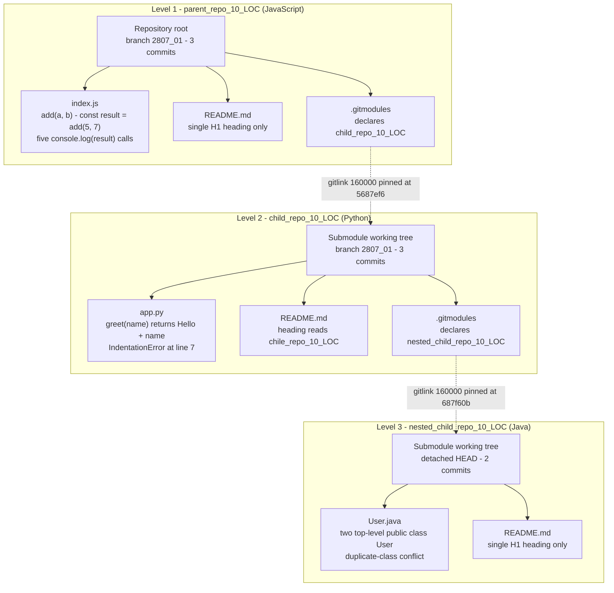
```mermaid
flowchart TD
    subgraph PARENT["Level 1 - parent_repo_10_LOC (JavaScript)"]
        PROOT["Repository root<br/>branch 2807_01 - 3 commits"]
        PIDX["index.js<br/>add(a, b) - const result = add(5, 7)<br/>five console.log(result) calls"]
        PRM["README.md<br/>single H1 heading only"]
        PGM[".gitmodules<br/>declares child_repo_10_LOC"]
        PROOT --> PIDX
        PROOT --> PRM
        PROOT --> PGM
    end
    subgraph CHILD["Level 2 - child_repo_10_LOC (Python)"]
        CROOT["Submodule working tree<br/>branch 2807_01 - 3 commits"]
        CAPP["app.py<br/>greet(name) returns Hello + name<br/>IndentationError at line 7"]
        CRM["README.md<br/>heading reads chile_repo_10_LOC"]
        CGM[".gitmodules<br/>declares nested_child_repo_10_LOC"]
        CROOT --> CAPP
        CROOT --> CRM
        CROOT --> CGM
    end
    subgraph NESTED["Level 3 - nested_child_repo_10_LOC (Java)"]
        NROOT["Submodule working tree<br/>detached HEAD - 2 commits"]
        NUSR["User.java<br/>two top-level public class User<br/>duplicate-class conflict"]
        NRM["README.md<br/>single H1 heading only"]
        NROOT --> NUSR
        NROOT --> NRM
    end
    PGM -. "gitlink 160000 pinned at 5687ef6" .-> CROOT
    CGM -. "gitlink 160000 pinned at 687f60b" .-> NROOT
```

Each level is a component in the composition sense only; there is **no runtime coupling between levels**. No file in any level imports, invokes, spawns, or otherwise references a file in another level. The JavaScript, Python, and Java artifacts are entirely independent programs that happen to share a checkout.

| Component | Type | Responsibility as Implemented |
| --- | --- | --- |
| `index.js` | JavaScript script | Sole executable entry point; computes `add(5, 7)` and writes `12` to stdout five times |
| `child_repo_10_LOC/app.py` | Python script | Intended greeting function plus two script-entry blocks; currently non-parsable |
| `.../nested_child_repo_10_LOC/User.java` | Java source | Intended console-printing entry point; currently non-compilable |
| `.gitmodules` (×2) | Git configuration | Declares the submodule path/URL pair that defines each parent–child link |
| `README.md` (×3) | Documentation | Repository identification by name only |

#### 1.2.2.3 Core Technical Approach

The technical approach is best characterized as **scripts with zero abstraction, composed by Git**. Four design properties are directly observable across all three program files:

- **No dependency management.** Nothing is declared, resolved, or vendored. Every file relies exclusively on its language's built-in facilities: `console.log` (JavaScript ambient global), `print` and f-strings (Python builtins), and `System.out.println` (implicit `java.lang`).
- **No module boundaries.** `index.js` exports nothing and exposes no public API; `app.py` defines `greet` at module scope with no `__all__`; `User.java` declares no package. There are no interfaces, base classes, or contracts.
- **No error handling, validation, or asynchrony.** `add(a, b)` applies the `+` operator directly with JavaScript's coercion semantics and no type or range checks; `greet(name)` interpolates its argument without validation; neither file declares exceptions or performs asynchronous work.
- **Initialization-time behavior only.** All observable output occurs during module/script initialization. In `index.js` the computation happens once at line 5 and the five output statements follow immediately, so behavior is fully deterministic and side-effect-free apart from stdout.

```javascript
const result = add(5, 7);   // evaluated once at module scope -> 12
console.log(result);        // repeated five times (lines 6-10)
```

The composition approach — a linear chain of one submodule per level rather than several siblings at one level — is the single deliberate architectural decision evidenced in the repository, and it is what makes the checkout require *recursive* initialization to be complete.

### 1.2.3 Success Criteria

#### 1.2.3.1 Repository-Declared Objectives

**The repository declares no success criteria of any kind.** This is an evidence-based finding, not an omission in this document: there are no acceptance criteria, no test assertions, no coverage thresholds, no performance budgets, no service-level objectives or agreements, no benchmark harnesses, no monitoring or alerting configuration, no error-budget definitions, and no CI quality gates anywhere in the three repositories. Any numeric KPI attributed to this system would be fabricated.

#### 1.2.3.2 Measurable Objectives Derived from Observation

The criteria below are the only ones that can be measured against the repository as it exists. Each is expressed with the exact command or inspection that verifies it and the result observed during this specification's preparation.

| Measurable Objective | Verification | Observed Result |
| --- | --- | --- |
| JavaScript entry point executes cleanly | `node index.js` | Exit code 0; stdout `12` ×5 |
| JavaScript entry point is syntactically valid | `node --check index.js` | Passes |
| Arithmetic correctness of `add` | `add(5, 7)` evaluates to `12` | Confirmed by program output |
| Output multiplicity | Count of `console.log(result)` statements | Exactly 5 (lines 6–10) |
| Submodule pins resolve to current heads | `git submodule status` / `git ls-tree HEAD` | `5687ef6` and `687f60b` both equal their repository HEADs |
| Working trees free of uncommitted drift | `git status --porcelain` in parent and child | Empty output (clean) |
| Python artifact parses | `python3 -m py_compile child_repo_10_LOC/app.py` | **Fails** — `IndentationError` at line 7 |
| Java artifact declares a unique top-level class | Inspection of `User.java` lines 1 and 7 | **Fails** — `public class User` declared twice |

Two of the eight objectives are currently unmet, and both failures are in the submodule levels rather than in the apex repository.

#### 1.2.3.3 Critical Success Factors

Derived from the repository's actual failure modes and structure, the factors that determine whether a consumer of this system succeeds are:

1. **Recursive checkout.** Because the content is distributed across three repositories linked by gitlinks, a non-recursive clone yields empty submodule directories and therefore an incomplete system. The nested level is additionally unregistered in the child's `.git/config`, so explicit initialization at that level is required.
2. **Pin currency.** The value of the composition depends on the gitlink commits continuing to reference reachable commits in the declared remotes; both currently match their repositories' HEADs.
3. **Runtime availability without installation.** Since no manifest exists, the only prerequisite is a language runtime on the host. Node.js is sufficient for the one working capability (verified against Node.js v22.23.1).
4. **Awareness of the non-executable artifacts.** Any pipeline that attempts to compile or run all three levels will fail; success requires either accepting that limitation or repairing `app.py` and `User.java` first.

#### 1.2.3.4 Key Performance Indicators

No KPIs are defined in the repository, and the system exposes no instrumentation, metrics endpoint, log aggregation, or timing code from which operational KPIs could be collected. The only quantitative indicators available are static and structural, and they are reported here as measured facts rather than targets:

| Static Indicator | Measured Value |
| --- | --- |
| Tracked source/documentation files (all 3 levels) | 8 |
| Total tracked bytes (all 3 levels) | 985 |
| Non-blank program lines (`index.js` / `app.py` / `User.java`) | 9 / 9 / 12 (30 total) |
| Total commits across the three repositories | 8 (3 parent, 3 child, 2 nested) |
| Executable program files out of total program files | 1 of 3 |
| Declared external dependencies | 0 |
| Automated tests | 0 |


## 1.3 Scope

Scope below is defined descriptively — it records what the repository *does* contain and what it demonstrably does *not*. Because the repository contains no requirements document, backlog, or roadmap (a recursive case-insensitive search for `todo`, `fixme`, `roadmap`, `milestone`, `phase`, `deprecat`, and `wip` across all tracked files at all three levels returned zero matches), the in-scope list is bounded exactly by the eight tracked files and the out-of-scope list is bounded by verified absence.

### 1.3.1 In-Scope

#### 1.3.1.1 Core Features and Functionalities

The complete, exhaustive feature set of the composed system is four items. Nothing else is implemented at any level.

| # | In-Scope Capability | Implementation | Runtime State |
| --- | --- | --- | --- |
| 1 | Integer addition of two supplied operands | `add(a, b)` in `index.js` lines 1–3 | Working |
| 2 | Emission of the computed value to standard output five times | `const result = add(5, 7)` (line 5) + five `console.log(result)` (lines 6–10) | Working |
| 3 | Construction of a greeting string from a name | `greet(name)` in `child_repo_10_LOC/app.py` lines 1–2 | Present but non-executable |
| 4 | Console output of a hard-coded string from a Java entry point | `main` in `.../nested_child_repo_10_LOC/User.java` | Present but non-compilable |

In addition, the following **composition capability** is in scope and is the repository's defining structural feature:

| # | In-Scope Composition Capability | Implementation |
| --- | --- | --- |
| 5 | Declarative linkage of a child repository into the parent checkout | `.gitmodules` + gitlink `child_repo_10_LOC` (mode `160000`, pinned `5687ef6`) |
| 6 | Declarative linkage of a grandchild repository one level deeper | `child_repo_10_LOC/.gitmodules` + gitlink `nested_child_repo_10_LOC` (mode `160000`, pinned `687f60b`) |

Items 1 and 2 are the only *must-have* capabilities that a consumer can rely on today, since they are the only ones verified to execute (`node index.js` → exit 0, stdout `12` five times).

#### 1.3.1.2 Primary User Workflows

Two workflows are supported by the repository as committed. Both are operator-driven command-line workflows; there is no interactive interface, no API, and no scheduled or event-driven trigger anywhere in the codebase.

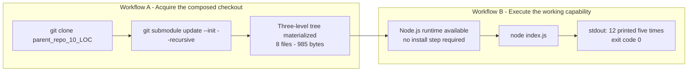
```mermaid
flowchart LR
    subgraph ACQUIRE["Workflow A - Acquire the composed checkout"]
        CLONE["git clone parent_repo_10_LOC"]
        INIT["git submodule update --init --recursive"]
        TREE["Three-level tree materialized<br/>8 files - 985 bytes"]
        CLONE --> INIT --> TREE
    end
    subgraph EXECUTE["Workflow B - Execute the working capability"]
        RUNTIME["Node.js runtime available<br/>no install step required"]
        RUN["node index.js"]
        OUT["stdout: 12 printed five times<br/>exit code 0"]
        RUNTIME --> RUN --> OUT
    end
    TREE --> RUNTIME
```

| Workflow | Steps Supported by the Repository | Boundary |
| --- | --- | --- |
| A — Acquire | Clone the parent, then initialize submodules recursively; the nested level additionally requires explicit initialization because the child's `.git/config` holds no `submodule.*` entries | Ends when all three working trees are populated |
| B — Execute | Invoke `index.js` with a Node.js runtime; no arguments, environment variables, or configuration are read | Ends at stdout; nothing is persisted or transmitted |

Reading the source is a third, implicit workflow: at 30 non-blank program lines the full system can be reviewed directly, which is consistent with the `_10_LOC` naming across the three repositories.

#### 1.3.1.3 Essential Integrations

Exactly one integration technology is in scope: **Git submodules**.

| Integration | Direction | Contract | In-Scope Elements |
| --- | --- | --- | --- |
| `parent_repo_10_LOC` → `child_repo_10_LOC` | Outbound source composition | `path` + `url` pair in `.gitmodules`; gitlink commit in the parent tree | Submodule declaration, pinned commit `5687ef6`, remote `github.com/lakshya-blitzy/child_repo_10_LOC.git` |
| `child_repo_10_LOC` → `nested_child_repo_10_LOC` | Outbound source composition | `path` + `url` pair in `child_repo_10_LOC/.gitmodules`; gitlink commit in the child tree | Submodule declaration, pinned commit `687f60b`, remote `github.com/lakshya-blitzy/nested_child_repo_10_LOC.git` |
| GitHub (repository hosting) | Outbound over HTTPS at clone/fetch time only | Public HTTPS Git remote URLs | Availability of the three repositories under owner `lakshya-blitzy` |

No integration occurs at program runtime. All three program files are import-free and dependency-free; the GitHub interaction happens solely during Git operations, never during execution of `index.js`, `app.py`, or `User.java`.

#### 1.3.1.4 Key Technical Requirements

Requirements below are inferred strictly from what the committed code needs in order to behave as observed. The repository states no requirements of its own.

| Requirement | Basis in the Code | Notes |
| --- | --- | --- |
| A Git client supporting submodules and recursive initialization | Two `.gitmodules` files and two `160000` gitlink tree entries | Required to obtain a complete checkout |
| A Node.js runtime for the working capability | `index.js` uses the ambient `console` global and CommonJS-style top-level code with no imports | Verified against Node.js v22.23.1; no minimum version is declared anywhere |
| No package installation step | Zero dependency manifests and zero lock files at any depth | `index.js` runs immediately after checkout |
| Network access at acquisition time only | HTTPS remote URLs in both `.gitmodules` files | Execution itself requires no network |
| Standard output stream | Five `console.log` calls; `print` in `app.py`; `System.out.println` in `User.java` | The only output channel in the system |

Two further requirements would apply to the currently non-functional levels: a Python 3 interpreter for `app.py` (its f-string syntax requires Python 3.6 or later) and a Java compiler and JVM for `User.java`. Neither level can satisfy those requirements today because of the defects documented in 1.2.1.2.

#### 1.3.1.5 Implementation Boundaries

##### 1.3.1.5.1 System Boundaries

The system boundary is the composed checkout of three repositories on a single local filesystem. Inside the boundary are the eight tracked files, the two `.gitmodules` declarations, and the two gitlink pins. The boundary is crossed in exactly two places: the HTTPS Git remotes at clone/fetch time, and the standard output stream at execution time. There is no server, no port binding, no listener, no scheduled job, no inter-process communication, and no shared state between the three levels.

##### 1.3.1.5.2 User Groups Covered

| User Group | Covered Scope | Evidence |
| --- | --- | --- |
| Repository maintainers | Full read/write of all three repositories | Commit authorship (`lakshya-blitzy`, `lakshya`) and the shared GitHub owner |
| Developers or tools cloning the composition | Read-only acquisition and local execution of `index.js` | Public HTTPS remotes in both `.gitmodules` files |

No further user groups are covered, because none can be: the system implements no authentication, no authorization, no roles, no permissions, no accounts, and no user-facing surface of any kind. Access control is entirely delegated to GitHub repository permissions, which are outside the codebase.

##### 1.3.1.5.3 Geographic and Market Coverage

**No geographic or market coverage is defined anywhere in the repository.** There is no locale handling, no timezone logic, no currency or unit handling, no internationalization or localization resource, no region configuration, and no deployment-target declaration. The only string literals present are the English-language fragment `"Hello "` in `app.py`, the name `"Lakshya"`, the placeholder values `"asdasdafsad"`, `"Test"`, and `"asdsadasda"`, and the repository names in the three `README.md` headings. Geographic scope is therefore undefined rather than global or restricted — the code is region-agnostic because it contains nothing region-sensitive.

##### 1.3.1.5.4 Data Domains Included

The data handled by the system is limited to hard-coded literals passed between statements in a single process. No data domain in the enterprise sense exists.

| Data Element | Type | Location | Persistence |
| --- | --- | --- | --- |
| `5`, `7` operands and the derived value `12` | Numeric literals / computed number | `index.js` lines 5–10 | None — in-memory, then stdout |
| `"Lakshya"`, `"asdasdafsad"` | String literals assigned to `user` | `app.py` lines 5 and 8 | None (code never executes) |
| `"Test"`, `"asdsadasda"` | Method-local `String` values | `User.java` lines 3 and 9 | None (code never compiles) |

There is no database, no schema, no migration, no file read or write, no cache, no queue, no serialization format, and no configuration store. Notably, despite the filename `User.java`, no user entity, field, or record is modelled — the class contains no fields, no constructor, and no state, only a `main` method that prints a local string.

### 1.3.2 Out-of-Scope

#### 1.3.2.1 Explicitly Excluded Features and Capabilities

Every item below was confirmed absent by direct inspection of all eight tracked files and by recursive filesystem probes across all three levels.

| Excluded Area | Confirmed Absence |
| --- | --- |
| Dependency management and packaging | No `package.json`, `package-lock.json`, `yarn.lock`, `pnpm-lock.yaml`, `requirements.txt`, `setup.py`, `pyproject.toml`, `Pipfile`, `pom.xml`, or `build.gradle` at any depth |
| Build and task automation | No `Makefile`, build script, or compiled-output directory |
| Automated testing and quality gates | No test or spec files, no test framework, no coverage configuration, no assertions of any kind |
| CI/CD and release engineering | No `.github/` directory, no workflow or pipeline definition, and no Git tags in the parent repository |
| Containerization and deployment | No `Dockerfile`, no `docker-compose.yml`, no orchestration manifest, no infrastructure-as-code |
| Code quality tooling | No `.eslintrc`, `tsconfig.json`, `.editorconfig`, formatter config, or type checking; no static analysis configuration |
| Version control hygiene files | No `.gitignore`, no `LICENSE`, no `CONTRIBUTING.md`, no `CODEOWNERS` |
| Application architecture | No server, API, router, controller, service layer, repository layer, or dependency injection |
| Data and persistence | No database, ORM, schema, migration, cache, or file I/O |
| Security and identity | No authentication, authorization, secret management, input validation, encryption, or audit logging |
| Observability | No logging framework, metrics, tracing, health check, or alerting |
| User interface | No HTML, CSS, template, component, or CLI argument parsing |
| Inline documentation | Zero comments in `index.js` and `User.java`; the only comment-like line in the codebase is the stray `///asdas` token at `app.py` line 10, which is not valid Python comment syntax |

#### 1.3.2.2 Future Phase Considerations

**The repository defines no future phases.** There is no roadmap file, no backlog, no `TODO`/`FIXME` marker, no milestone reference, no issue template, no changelog, and no versioning scheme — the parent repository carries no Git tags. The recursive marker search described at the start of this sub-section confirmed zero matches across every tracked file.

Two work items are nevertheless *implied* by verified defects rather than by any planning artifact, and are recorded here as known-broken conditions rather than as a committed plan:

| Implied Work Item | Verified Trigger |
| --- | --- |
| Repair `child_repo_10_LOC/app.py` so it parses | `python3 -m py_compile` fails with `IndentationError: unindent does not match any outer indentation level (line 7)`; the duplicated `__main__` guard at line 7 and the stray `///asdas` at line 10 are the causes |
| Resolve the duplicate class in `User.java` so it can compile | Two top-level `public class User` declarations exist in one compilation unit (lines 1 and 7) |

Any statement about intended subsequent phases beyond these two would be unsupported by the repository.

#### 1.3.2.3 Integration Points Not Covered

| Integration Category | Status in This Repository |
| --- | --- |
| HTTP/REST, GraphQL, gRPC, WebSocket | Not present — no client or server code in any level |
| Databases and data stores (SQL, NoSQL, cache) | Not present — no driver, connection string, or query |
| Message brokers, queues, event streams | Not present |
| Cloud provider SDKs and managed services | Not present |
| Authentication and identity providers | Not present |
| Third-party APIs, webhooks, notification channels | Not present |
| Package registries (npm, PyPI, Maven Central) | Not used — no manifest declares any registry dependency |
| Cross-language interoperability between the three levels | Not implemented — no file in any level references a file in another level; JavaScript, Python, and Java coexist without any bridge, subprocess call, or shared data format |
| CI systems, artifact repositories, deployment targets | Not configured |

The only integration in scope remains Git submodule resolution against the two declared GitHub remotes, as stated in 1.3.1.3.

#### 1.3.2.4 Unsupported Use Cases

| Unsupported Use Case | Reason Grounded in the Code |
| --- | --- |
| Using the repository as a library or importable module | `index.js` declares no `module.exports`; `app.py` cannot be imported because it fails to parse; `User.java` cannot be compiled into a usable artifact |
| Passing custom operands to the addition capability | `add(5, 7)` uses source literals; `index.js` reads no `process.argv`, environment variables, or input stream |
| Executing the Python greeting flow | The file raises `IndentationError` at line 7 before any statement runs |
| Compiling or running the Java entry point | Duplicate top-level `public class User` declarations make the compilation unit invalid |
| Running an end-to-end build or test across all three levels | No build system and no tests exist in any repository |
| Deploying the system to any environment | No deployment descriptor, container definition, process manager, or entry-point registration exists |
| Relying on the greeting or user artifacts for data modelling | `greet(name)` performs string interpolation only, and `User.java` declares no fields, constructor, or persistent state despite its name |
| Treating the composition as a monorepo with shared tooling | Each level is an independent repository with its own history and no shared configuration, manifest, or tooling |
| Non-recursive cloning | The parent tracks `child_repo_10_LOC` as a gitlink; without recursive initialization the directory is empty and levels 2 and 3 are absent entirely |


## 1.4 References

### 1.4.1 Repository Files Examined

Every file tracked in the composed checkout was read in full; the list below is therefore both the evidence base for this section and the complete file inventory of the system.

- `index.js` - Established the sole executable capability: `add(a, b)` (lines 1–3), `const result = add(5, 7)` (line 5), and five `console.log(result)` statements (lines 6–10); confirmed the absence of imports, exports, error handling, async work, and CLI input. Measured at 171 bytes / 10 lines / 9 non-blank lines.
- `README.md` - Established that parent documentation is a single H1 heading `# parent_repo_10_LOC` (20 bytes) with no purpose, setup, usage, architecture, or license content.
- `.gitmodules` - Established the parent's only external integration: one declaration `[submodule "child_repo_10_LOC"]` with `path = child_repo_10_LOC` and `url = https://github.com/lakshya-blitzy/child_repo_10_LOC.git`; also established the GitHub owner `lakshya-blitzy`.
- `child_repo_10_LOC/app.py` - Established the Python level: `greet(name)` returning `f"Hello {name}"` (lines 1–2), a valid `__main__` block (lines 4–6), the duplicated `__main__` guard at line 7, and the stray `///asdas` token at line 10 that make the file non-parsable. Measured at 206 bytes / 10 lines / 9 non-blank lines.
- `child_repo_10_LOC/README.md` - Established heading-only documentation reading `# chile_repo_10_LOC`, evidencing the misspelling of "child" (19 bytes).
- `child_repo_10_LOC/.gitmodules` - Established the second-level integration: `[submodule "nested_child_repo_10_LOC"]` with `path = nested_child_repo_10_LOC` and `url = https://github.com/lakshya-blitzy/nested_child_repo_10_LOC.git`.
- `child_repo_10_LOC/nested_child_repo_10_LOC/User.java` - Established the Java level and its defect: two top-level `public class User` declarations (lines 1 and 7), each with a `main` printing a method-local string (`"Test"`, `"asdsadasda"`); confirmed package-less, import-free, field-less, and stateless. Measured at 280 bytes / 12 lines / 12 non-blank lines.
- `child_repo_10_LOC/nested_child_repo_10_LOC/README.md` - Established heading-only documentation reading `# nested_child_repo_10_LOC` (26 bytes).

### 1.4.2 Repository Folders Examined

- `` (repository root) - Contained exactly four first-order children: `index.js`, `.gitmodules`, `README.md`, and the `child_repo_10_LOC` submodule folder; established the absence of any root-level manifest, test directory, or CI configuration.
- `child_repo_10_LOC/` - Contained `app.py`, `.gitmodules`, `README.md`, and `nested_child_repo_10_LOC/`; established that the Python level has no build or dependency manifest and no tests.
- `child_repo_10_LOC/nested_child_repo_10_LOC/` - Contained only `User.java` and `README.md`; established that the Java level has no `pom.xml`, `build.gradle`, package metadata, or tests.

### 1.4.3 Repository State and Verification Evidence

Verification was performed against the checkout on branch `2807_01`. The following inspections produced the factual claims in this section.

| Inspection | What It Established |
| --- | --- |
| `node index.js` and `node --check index.js` (Node.js v22.23.1) | Exit code 0 with `12` printed five times; syntax valid — the one working capability |
| `python3 -m py_compile child_repo_10_LOC/app.py` and `ast.parse` (Python 3.12.3) | Exit 1 with `IndentationError: unindent does not match any outer indentation level (line 7)` — the Python level is non-executable |
| `git ls-files -s` / `git ls-tree HEAD` in all three repositories | Gitlink entries of mode `160000` pinning the child at `5687ef6` and the nested repository at `687f60b`; blob inventory per level |
| `git log`, `git rev-list --count`, `git branch -a`, `git tag` | 8 commits total (3 parent, 3 child, 2 nested), all dated 2026-07-28 by `lakshya-blitzy`/`lakshya`; branches `2807_01` and `main`; nested at detached HEAD; no tags |
| `git submodule status --recursive` and `git config --get-regexp '^submodule\.'` | Parent registers `submodule.child_repo_10_LOC.active=true`; the child registers no submodule entries, so the nested module is reported uninitialized despite a populated working tree |
| `git status --porcelain` (parent and child) | Empty output — both working trees clean, no uncommitted drift |
| Recursive probe for `*.json`, `*.toml`, `*.yml`, `*.yaml`, `*.xml`, `*.lock`, `*test*`, `*spec*`, `Dockerfile*`, `Makefile` | Zero matches at any depth — confirmed absence of dependency, build, CI, container, and test tooling |
| Recursive grep for `todo`, `fixme`, `hack`, `xxx`, `roadmap`, `phase`, `milestone`, `deprecat`, `wip` | Zero matches — no roadmap, backlog, or future-phase artifact exists |
| Case-insensitive recursive search for `.blitzyignore` | No such file at any depth; no path exclusions applied to this analysis |
| `cat` of the submodule `.git` pointer files | Absorbed git directories at `.git/modules/child_repo_10_LOC` and `.git/modules/child_repo_10_LOC/modules/nested_child_repo_10_LOC` |

### 1.4.4 External and Cross-Section Sources

- **Web sources:** None. No external research was required or performed, because every claim in this section is derived from the repository itself. No dependency versions needed external lookup, as the repository declares no dependencies.
- **Cross-referenced specification sections:** None available. The set of previously authored Technical Specification sections supplied for cross-reference was empty at the time of writing, so this section stands alone and duplicates no other section's content.
- **Excluded from analysis:** The `/app/` directory reachable from the execution environment is agent tooling and is not part of this repository; it was neither inspected nor documented. Git remote URLs obtained from `git remote -v` contain a temporary access-token credential and are deliberately not reproduced — all remote references in this section come from the clean canonical URLs recorded in the two `.gitmodules` files.


# 2. Product Requirements

## 2.1 Feature Catalog

The repository documented here is **nearly empty**, and this must be stated before any requirement is presented. The composed checkout contains eight tracked files totalling 985 bytes across three nesting levels, and it declares **no product requirements of its own**: there is no requirements document, backlog, issue template, changelog, roadmap, acceptance-test suite, or specification of any kind. A recursive grep across all tracked content for `todo`, `fixme`, `roadmap`, `milestone`, `deprecat`, and `wip` returned zero matches, and no Git tag exists in any of the three repositories.

Consequently, every feature and requirement in Section 2 is **reverse-engineered from observed artifacts** — source lines, Git tree entries, configuration files, and verified command output. Feature identifiers, priorities, statuses, and complexity ratings are analytical attributes assigned in this specification to make the observed behavior testable; they are not labels found in the codebase. Where an attribute could not be grounded in evidence, this section says so rather than supplying a value.

### 2.1.1 Catalog Scope and Derivation Basis

The catalog contains exactly seven features. Each corresponds one-to-one with a capability enumerated in <span>2.1.1</span>'s evidence base and with the in-scope items already established in **1.3.1.1 Core Features and Functionalities**; no additional feature was inferred, and no capability present in the repository was omitted.

| Feature ID | Feature Name | Category | Status |
| --- | --- | --- | --- |
| F-001 | Two-Operand Addition Function | Core Computation (JavaScript) | Completed |
| F-002 | Repeated Standard-Output Emission | Output / Reporting (JavaScript) | Completed |
| F-003 | Greeting String Construction | Core Computation (Python) | In Development |
| F-004 | Java Console Entry Point | Core Computation (Java) | In Development |
| F-005 | Parent-to-Child Submodule Composition | Repository Composition / Integration | Completed |
| F-006 | Child-to-Nested Submodule Composition | Repository Composition / Integration | Completed |
| F-007 | Repository Identification Documentation | Documentation | Completed |

| Feature ID | Priority | Implementing Artifact | Verified Runtime State |
| --- | --- | --- | --- |
| F-001 | Critical | `index.js` lines 1–3 | Executes — `add(5, 7)` yields `12` |
| F-002 | High | `index.js` lines 5–10 | Executes — five stdout lines, exit code 0 |
| F-003 | Medium | `child_repo_10_LOC/app.py` lines 1–2 | Not executable — file fails to parse |
| F-004 | Low | `child_repo_10_LOC/nested_child_repo_10_LOC/User.java` | Not compilable — duplicate top-level class |
| F-005 | Critical | `.gitmodules` + gitlink `child_repo_10_LOC` | Operational — pin `5687ef6` resolves |
| F-006 | High | `child_repo_10_LOC/.gitmodules` + gitlink | Operational — pin `687f60b` resolves |
| F-007 | Low | Three `README.md` files (20 / 19 / 26 bytes) | Present — heading-only, one defect |

#### 2.1.1.1 Attribute Assignment Rules

Because the repository supplies no metadata, the following deterministic rules were applied so that every attribute in the catalog is auditable:

| Attribute | Assignment Rule Applied |
| --- | --- |
| Priority | `Critical` where the feature is required for the system to produce any output or any complete checkout; `High` where it is required for the intended observable result; `Medium`/`Low` for artifacts that contribute no working behavior today |
| Status | `Completed` only where behavior was verified by executed command or by Git tree inspection; `In Development` where the artifact exists in source but cannot execute or compile as written |
| Complexity | Derived from statement count, control-flow branching, and external surface — all seven features are single-statement-to-single-function scope, so `Low` predominates |
| Category | Derived from the artifact's language level and its role (computation, output, composition, documentation) |

### 2.1.2 F-001 — Two-Operand Addition Function

#### 2.1.2.1 Feature Metadata

| Attribute | Value |
| --- | --- |
| Unique ID | F-001 |
| Feature Name | Two-Operand Addition Function |
| Feature Category | Core Computation (JavaScript, Level 1) |
| Priority Level | Critical |
| Status | Completed |

#### 2.1.2.2 Description

**Overview.** `index.js` declares `function add(a, b)` at lines 1–3 whose entire body is `return a + b;`. It is the only reusable computational unit in the composed system and the only function that is actually invoked at runtime.

**Business Value.** No business value is declared in the repository. The demonstrable value is that this function makes Level 1 the sole level of the three-repository chain that produces verifiable behavior, which is what allows the composition to be used as an executable fixture rather than an inert source archive.

**User Benefits.** The consumer of the repository obtains a zero-configuration, zero-install computation: no arguments, environment variables, or configuration files are read, so the function's effect is observable immediately after checkout with only a Node.js runtime present.

**Technical Context.** The function is untyped, synchronous, and side-effect-free. It performs no validation, no coercion guards, no range checking, and declares no exceptions; it applies the JavaScript `+` operator directly, inheriting that operator's coercion semantics. It is neither exported nor namespaced — `index.js` contains no `module.exports` and no `require`/`import` statements.

```javascript
function add(a, b) {
  return a + b;          // JavaScript + semantics; no validation of a or b
}
```

#### 2.1.2.3 Dependencies

| Dependency Type | Detail |
| --- | --- |
| Prerequisite Features | None. `add` is self-contained and references no other feature. |
| System Dependencies | A Node.js runtime (verified against v22.23.1). No minimum version is declared anywhere in the repository. |
| External Dependencies | None. Zero dependency manifests and zero third-party imports exist at any level. |
| Integration Requirements | None at runtime. F-005 is required only to obtain the full checkout, not to execute this feature. |

### 2.1.3 F-002 — Repeated Standard-Output Emission

#### 2.1.3.1 Feature Metadata

| Attribute | Value |
| --- | --- |
| Unique ID | F-002 |
| Feature Name | Repeated Standard-Output Emission |
| Feature Category | Output / Reporting (JavaScript, Level 1) |
| Priority Level | High |
| Status | Completed |

#### 2.1.3.2 Description

**Overview.** Line 5 of `index.js` binds `const result = add(5, 7)` at module scope, and lines 6–10 contain five identical `console.log(result)` statements. This is the system's only output channel and its only observable side effect.

**Business Value.** Not declared. The observable value is a deterministic, byte-stable output signature — exactly five lines, each `12` — which makes the repository usable as a fixture whose success can be asserted mechanically.

**User Benefits.** The operator receives immediate confirmation that the checkout is complete and the runtime is functional, with no logging framework, verbosity flag, or output destination to configure.

**Technical Context.** All emission occurs during script initialization; there is no event loop work, no asynchrony, and no deferred callback. `console.log` is used as an ambient global, so nothing is imported. The computed value is evaluated once and reused by all five statements, so the repetition is in the output statements rather than in repeated computation.

#### 2.1.3.3 Dependencies

| Dependency Type | Detail |
| --- | --- |
| Prerequisite Features | F-001 — the emitted value is the return value of `add(5, 7)`. |
| System Dependencies | Node.js runtime; an attached standard-output stream. |
| External Dependencies | None. |
| Integration Requirements | None. Nothing is persisted, transmitted, or written to a file; stdout is the sole boundary crossing at execution time. |

### 2.1.4 F-003 — Greeting String Construction

#### 2.1.4.1 Feature Metadata

| Attribute | Value |
| --- | --- |
| Unique ID | F-003 |
| Feature Name | Greeting String Construction |
| Feature Category | Core Computation (Python, Level 2) |
| Priority Level | Medium |
| Status | In Development |

#### 2.1.4.2 Description

**Overview.** `child_repo_10_LOC/app.py` lines 1–2 define `greet(name)` returning `f"Hello {name}"`. Lines 4–6 form a valid `if __name__ == "__main__":` block that assigns `user = "Lakshya"` and prints the greeting; lines 7–9 repeat that guard at an inconsistent two-space indentation with `user = "asdasdafsad"`, and line 10 holds a stray `///asdas` token that is not valid Python comment syntax.

**Business Value.** Not declared. The feature's present contribution is negative rather than positive: it is the defect that prevents Level 2 of the chain from contributing any executable behavior.

**User Benefits.** None realizable today. The intended benefit — obtaining a formatted greeting for a supplied name — cannot be exercised because the module aborts at parse time before any statement runs.

**Technical Context.** `greet` is import-free, untyped, side-effect-free, and raises nothing. Its logic is correct in isolation: copying lines 1–2 into a scratch file and calling `greet("Lakshya")` produces `Hello Lakshya` with exit code 0. The blocking defect is file-level, not function-level — `python3 -m py_compile child_repo_10_LOC/app.py` exits 1 with `IndentationError: unindent does not match any outer indentation level (app.py, line 7)`, independently reproduced through `ast.parse`.

#### 2.1.4.3 Dependencies

| Dependency Type | Detail |
| --- | --- |
| Prerequisite Features | F-005 — the file exists only inside the child submodule working tree, so a recursive checkout is required to obtain it. |
| System Dependencies | A Python 3 interpreter; f-string syntax requires Python 3.6 or later. Verified against Python 3.12.3. |
| External Dependencies | None. The module declares no imports and no dependency manifest exists at Level 2. |
| Integration Requirements | None. The module is not referenced, imported, or invoked by any file at any level. |

### 2.1.5 F-004 — Java Console Entry Point

#### 2.1.5.1 Feature Metadata

| Attribute | Value |
| --- | --- |
| Unique ID | F-004 |
| Feature Name | Java Console Entry Point |
| Feature Category | Core Computation (Java, Level 3) |
| Priority Level | Low |
| Status | In Development |

#### 2.1.5.2 Description

**Overview.** `child_repo_10_LOC/nested_child_repo_10_LOC/User.java` declares `public class User` twice as a top-level type in one compilation unit — once at lines 1–6 and again at lines 7–12. Each declaration contains `public static void main(String[] args)` that assigns a method-local `String name` (`"Test"` and `"asdsadasda"` respectively) and prints it with `System.out.println(name)`.

**Business Value.** Not declared. The artifact's role is to populate the deepest level of the submodule chain; it contributes no working behavior.

**User Benefits.** None realizable today. A duplicate top-level class of the same name in a single compilation unit cannot be compiled, so neither `main` can be reached regardless of build tooling.

**Technical Context.** The file declares no package and no imports, relying only on implicitly available `java.lang` types (`String`, `System`). Despite the filename, no user entity is modelled: the class has no fields, no constructor, and no state. The `args` parameter is declared but never read. A compiler was not available in the inspection environment, so the non-compilability finding is derived from the source structure — two identically named top-level public classes — rather than from executed compiler output.

#### 2.1.5.3 Dependencies

| Dependency Type | Detail |
| --- | --- |
| Prerequisite Features | F-006 — the file exists only inside the nested submodule working tree, which requires explicit or recursive initialization. |
| System Dependencies | A Java compiler and JVM would be required; neither is declared by the repository and no build file exists at Level 3. |
| External Dependencies | None. No `pom.xml`, `build.gradle`, package metadata, or third-party import exists. |
| Integration Requirements | None. No file at any level references this class, and no cross-language bridge or subprocess invocation exists. |

### 2.1.6 F-005 — Parent-to-Child Submodule Composition

#### 2.1.6.1 Feature Metadata

| Attribute | Value |
| --- | --- |
| Unique ID | F-005 |
| Feature Name | Parent-to-Child Submodule Composition |
| Feature Category | Repository Composition / Integration |
| Priority Level | Critical |
| Status | Completed |

#### 2.1.6.2 Description

**Overview.** The parent repository's `.gitmodules` declares exactly one submodule section, `[submodule "child_repo_10_LOC"]`, mapping `path = child_repo_10_LOC` to `url = https://github.com/lakshya-blitzy/child_repo_10_LOC.git`. The parent's tree records the corresponding gitlink entry `160000 commit 5687ef6c3fdbdf361df830fcd78a2dbdcdb2b80a child_repo_10_LOC`, pinning the child to an exact commit.

**Business Value.** Not declared. The demonstrable value is a working, minimal reference topology for nested Git submodule composition — the defining structural characteristic of this repository.

**User Benefits.** A single `git clone` of the parent followed by recursive submodule initialization materializes the entire multi-language tree. The child's Git directory is absorbed into the parent's storage (`child_repo_10_LOC/.git` contains `gitdir: ../.git/modules/child_repo_10_LOC`), so the consumer manages one clone rather than several.

**Technical Context.** This is a source-composition contract only; it has no runtime component. The parent's local configuration registers the module (`submodule.child_repo_10_LOC.active=true` plus the URL), and `git submodule status` reports the child at `5687ef6 (heads/2807_01)` with a clean status prefix, meaning the pinned commit equals the child's checked-out HEAD. `git status --porcelain` is empty in the parent, confirming no uncommitted gitlink drift.

#### 2.1.6.3 Dependencies

| Dependency Type | Detail |
| --- | --- |
| Prerequisite Features | None. This is the root of the composition chain. |
| System Dependencies | A Git client supporting submodules and recursive initialization. |
| External Dependencies | Availability of the GitHub-hosted repository `lakshya-blitzy/child_repo_10_LOC` over HTTPS at clone/fetch time. |
| Integration Requirements | Network access is required at acquisition time only; execution of any artifact requires no network. |

### 2.1.7 F-006 — Child-to-Nested Submodule Composition

#### 2.1.7.1 Feature Metadata

| Attribute | Value |
| --- | --- |
| Unique ID | F-006 |
| Feature Name | Child-to-Nested Submodule Composition |
| Feature Category | Repository Composition / Integration |
| Priority Level | High |
| Status | Completed |

#### 2.1.7.2 Description

**Overview.** `child_repo_10_LOC/.gitmodules` declares one submodule section, `[submodule "nested_child_repo_10_LOC"]`, mapping `path = nested_child_repo_10_LOC` to `url = https://github.com/lakshya-blitzy/nested_child_repo_10_LOC.git`. The child's tree records `160000 commit 687f60b6c74818ac7cd14413840d73fdfb5fe450 nested_child_repo_10_LOC`, and that pin equals the nested repository's HEAD.

**Business Value.** Not declared. This feature is what makes the topology *two levels deep* rather than a single parent-child pair, and therefore what makes recursive initialization mandatory rather than optional.

**User Benefits.** The consumer obtains a third, independently versioned repository inside the same checkout. Its Git directory is likewise absorbed, at `.git/modules/child_repo_10_LOC/modules/nested_child_repo_10_LOC`.

**Technical Context.** An asymmetry exists relative to F-005 and is a genuine operational constraint: the child's local `.git/config` contains **no** `submodule.*` entries, so `git submodule status --recursive` reports the nested module with a leading `-` (uninitialized) even though its working tree is populated. The nested repository is checked out at a detached HEAD rather than on a branch. Both conditions are properties of the local checkout state, not of the committed declaration, which is complete and correct.

#### 2.1.7.3 Dependencies

| Dependency Type | Detail |
| --- | --- |
| Prerequisite Features | F-005 — Level 3 is reachable only through the child working tree materialized by F-005. |
| System Dependencies | A Git client supporting recursive submodule initialization at depth two. |
| External Dependencies | Availability of `lakshya-blitzy/nested_child_repo_10_LOC` over HTTPS at clone/fetch time. |
| Integration Requirements | Explicit initialization at the child level may be required because the child registers no submodule entries locally. |

### 2.1.8 F-007 — Repository Identification Documentation

#### 2.1.8.1 Feature Metadata

| Attribute | Value |
| --- | --- |
| Unique ID | F-007 |
| Feature Name | Repository Identification Documentation |
| Feature Category | Documentation |
| Priority Level | Low |
| Status | Completed |

#### 2.1.8.2 Description

**Overview.** Each of the three repositories carries exactly one `README.md` consisting of a single H1 heading and nothing else: `# parent_repo_10_LOC` (20 bytes), `# chile_repo_10_LOC` (19 bytes), and `# nested_child_repo_10_LOC` (26 bytes). None of the three files ends with a trailing newline.

**Business Value.** Not declared. The files provide the only human-readable identification of each level within a composed checkout.

**User Benefits.** A reader can determine which repository a directory belongs to. No further benefit is available: there is no setup, usage, architecture, API, contribution, or license guidance in any of the three files.

**Technical Context.** The Level 2 heading reads `# chile_repo_10_LOC`, misspelling "child" and therefore not matching its repository name `child_repo_10_LOC`. This is the only documentation defect present, and it is cosmetic — no tooling in the repository consumes these files.

#### 2.1.8.3 Dependencies

| Dependency Type | Detail |
| --- | --- |
| Prerequisite Features | F-005 and F-006 for the Level 2 and Level 3 files respectively; the Level 1 file has no prerequisite. |
| System Dependencies | None. Any Markdown reader or plain-text viewer suffices. |
| External Dependencies | None. |
| Integration Requirements | None. No documentation generator, site build, or badge service references these files. |

### 2.1.9 Assumptions and Constraints

The following assumptions and constraints govern the entire catalog and apply to every requirement in **2.2 Functional Requirements Table**.

| # | Assumption or Constraint | Basis |
| --- | --- | --- |
| A-01 | The repository declares no requirements, priorities, or statuses; all such attributes in Section 2 are analytical | No requirements file, backlog, issue template, or changelog exists; marker grep returned zero matches |
| A-02 | Requirement identity is commit-based, not tag-based | No Git tag exists in any of the three repositories |
| A-03 | The catalog is exhaustive at the observed commit; no hidden capability exists | The complete tree is 3 directories and 8 tracked files, all read in full |
| A-04 | Non-compilability of `User.java` is asserted from source structure, not executed compiler output | `javac` was unavailable in the inspection environment |
| A-05 | Canonical remote URLs are taken only from the two `.gitmodules` files | Remote URLs obtained from Git remote configuration embed a temporary access credential and are deliberately not reproduced |
| C-01 | No feature accepts runtime input | Recursive grep across all three program files for `require`, `import`, `process.`, `argv`, `env`, `fetch`, `http`, `open(`, `read`, `write`, `socket`, `Scanner`, and `System.in` returned zero matches |
| C-02 | No feature persists state | No database, file write, cache, queue, or serialization exists at any level |
| C-03 | No feature is invocable as a library | `index.js` exports nothing; `app.py` cannot be imported because it fails to parse; `User.java` cannot be compiled |
| C-04 | No automated verification exists in-repo | Zero test files, zero assertions, zero CI configuration; every acceptance criterion in 2.2 must be executed manually |
| C-05 | Levels are runtime-independent | No file at any level references a file at another level; there is no bridge, subprocess call, or shared data format |

## 2.2 Functional Requirements Table

Twenty-three requirements are specified across the seven features. Every requirement is written so that it can be verified by a single command or a single direct source inspection, because the repository contains no test suite, no assertions, and no CI configuration against which requirements could otherwise be checked (constraint C-04 in 2.1.9).

### 2.2.1 Requirement Conventions

| Convention | Definition Applied in This Section |
| --- | --- |
| Requirement ID | `F-XXX-RQ-YYY`, where `F-XXX` is the parent feature and `YYY` increments from `001` within that feature |
| Must-Have | The observed system cannot deliver its verified behavior without this requirement |
| Should-Have | Required for the feature's intended result but not for the system to produce output |
| Could-Have | Cosmetic or convenience property; absence does not change behavior |
| Complexity | `Low` = single statement or single declaration; `Medium` = multi-statement flow or Git tree/config interaction; `High` = not applicable to any requirement in this repository |

| Feature | Requirement Count | Requirements Currently Met | Requirements Not Met |
| --- | --- | --- | --- |
| F-001 | 3 | 3 | 0 |
| F-002 | 3 | 3 | 0 |
| F-003 | 3 | 1 (in isolation) | 2 |
| F-004 | 3 | 2 | 1 |
| F-005 | 4 | 4 | 0 |
| F-006 | 4 | 3 | 1 (initialization state) |
| F-007 | 3 | 2 | 1 |

### 2.2.2 F-001 — Two-Operand Addition Function

#### 2.2.2.1 Requirement Details

| Requirement ID | Description | Priority | Complexity |
| --- | --- | --- | --- |
| F-001-RQ-001 | `add(a, b)` shall return the result of applying the JavaScript `+` operator to its two parameters | Must-Have | Low |
| F-001-RQ-002 | The operands shall be supplied as source literals (`5` and `7`) and shall not be configurable at runtime | Must-Have | Low |
| F-001-RQ-003 | `index.js` shall remain syntactically valid JavaScript under the Node.js runtime | Must-Have | Low |

| Requirement ID | Acceptance Criteria (Executable) | Verified Result |
| --- | --- | --- |
| F-001-RQ-001 | Invoking the module and observing the emitted value yields `12` for the committed operands | Met — output is `12` |
| F-001-RQ-002 | `index.js` contains no read of `process.argv`, environment variables, or stdin | Met — recursive grep returned zero matches |
| F-001-RQ-003 | `node --check index.js` exits 0 | Met — exit code 0 |

#### 2.2.2.2 Technical Specifications

| Aspect | Specification as Implemented |
| --- | --- |
| Input Parameters | Two positional parameters `a`, `b`; untyped; no defaults; no arity enforcement |
| Output / Response | Single return value of the `+` expression; `number` for the committed literals |
| Performance Criteria | None declared in the repository. Observed characteristics: one constant-time arithmetic operation, evaluated once at module scope, no I/O, no allocation beyond the result |
| Data Requirements | No persistent data. Two numeric literals held in memory for the process lifetime |

#### 2.2.2.3 Validation Rules

| Rule Class | Observed Rule |
| --- | --- |
| Business Rules | None declared. The only implicit rule is that the returned value is the sum of the two operands |
| Data Validation | **None implemented.** The function applies `+` unguarded, so it inherits JavaScript coercion: numeric operands produce `12`, string operands produce concatenation (`"5" + "7"` → `"57"`), and a missing operand produces `NaN`. Callers receive no error and no type signal |
| Security Requirements | None applicable. No untrusted input reaches the function — both operands are source literals and no external input channel exists |
| Compliance Requirements | None declared anywhere in the repository (no license file, no policy, no audit requirement) |

### 2.2.3 F-002 — Repeated Standard-Output Emission

#### 2.2.3.1 Requirement Details

| Requirement ID | Description | Priority | Complexity |
| --- | --- | --- | --- |
| F-002-RQ-001 | The computed value shall be written to standard output exactly five times, one line per emission | Must-Have | Low |
| F-002-RQ-002 | Execution shall terminate with exit code 0 and shall write nothing to standard error | Must-Have | Low |
| F-002-RQ-003 | The value shall be computed once and reused for all five emissions | Should-Have | Low |

| Requirement ID | Acceptance Criteria (Executable) | Verified Result |
| --- | --- | --- |
| F-002-RQ-001 | `node index.js` produces 5 stdout lines and the set of distinct lines is exactly `{12}` | Met — 5 lines, all `12` |
| F-002-RQ-002 | Exit status is 0 and stderr length is 0 bytes | Met — exit 0, 0 bytes on stderr |
| F-002-RQ-003 | `index.js` contains one `add(...)` call site (line 5) and five statements referencing the bound identifier (lines 6–10) | Met — one call, five references |

#### 2.2.3.2 Technical Specifications

| Aspect | Specification as Implemented |
| --- | --- |
| Input Parameters | None. The script accepts no command-line arguments, reads no configuration, and consumes no stdin |
| Output / Response | Five newline-terminated stdout records, each the string form of the number `12`; process exit code 0 |
| Performance Criteria | None declared. Observed: five synchronous `console.log` calls executed during initialization; no event-loop work is scheduled, so process lifetime is bounded by runtime startup |
| Data Requirements | None persisted. The single bound value is immutable (`const`) and discarded at process exit |

#### 2.2.3.3 Validation Rules

| Rule Class | Observed Rule |
| --- | --- |
| Business Rules | Output multiplicity is fixed at five by the presence of five statements; there is no counter, loop, or configuration that could vary it |
| Data Validation | None implemented. No formatting, truncation, encoding, or escaping is applied to the emitted value |
| Security Requirements | None applicable. Nothing sensitive is emitted; no credential, token, or personal data exists in the source |
| Compliance Requirements | None declared. No log retention, redaction, or audit-trail requirement exists |

### 2.2.4 F-003 — Greeting String Construction

#### 2.2.4.1 Requirement Details

| Requirement ID | Description | Priority | Complexity |
| --- | --- | --- | --- |
| F-003-RQ-001 | `greet(name)` shall return the literal `Hello ` followed by the supplied `name`, produced by f-string interpolation | Must-Have | Low |
| F-003-RQ-002 | `child_repo_10_LOC/app.py` shall parse successfully under a Python 3 interpreter | Must-Have | Low |
| F-003-RQ-003 | When executed as `__main__`, the module shall print the greeting for the assigned `user` literal | Should-Have | Low |

| Requirement ID | Acceptance Criteria (Executable) | Verified Result |
| --- | --- | --- |
| F-003-RQ-001 | Evaluating `greet("Lakshya")` returns `Hello Lakshya` | Met **in isolation only** — lines 1–2 copied to a scratch file produce `Hello Lakshya`, exit 0 |
| F-003-RQ-002 | `python3 -m py_compile child_repo_10_LOC/app.py` exits 0 | **Not met** — exits 1 with `IndentationError: unindent does not match any outer indentation level (app.py, line 7)` |
| F-003-RQ-003 | Executing the module prints one greeting line | **Not met** — parse fails before any statement executes; the duplicated guard at line 7 and the stray `///asdas` at line 10 are the causes |

#### 2.2.4.2 Technical Specifications

| Aspect | Specification as Implemented |
| --- | --- |
| Input Parameters | One positional parameter `name`; no type annotation, no default, no keyword-only enforcement |
| Output / Response | A single `str` value; no exceptions are declared or raised. When the module runs as a script, output would be one stdout line per `print` call |
| Performance Criteria | None declared. Observed: one f-string interpolation; the intended script flow performs at most two print operations |
| Data Requirements | No persistence. String literals `"Lakshya"` (line 5) and `"asdasdafsad"` (line 8) are assigned to a module-level `user` name inside the guard blocks |

#### 2.2.4.3 Validation Rules

| Rule Class | Observed Rule |
| --- | --- |
| Business Rules | Greeting format is fixed as `Hello <name>`; no locale, salutation variant, or template configuration exists |
| Data Validation | **None implemented.** `name` is interpolated without type checking, emptiness checking, length limits, or escaping. Any object's `__str__`/`__format__` output would be embedded verbatim |
| Security Requirements | None implemented. Uncontrolled interpolation of caller-supplied values into an output string is the only latent concern, and it is unexercised because no external input channel exists |
| Compliance Requirements | None declared. The Python level has no license, dependency policy, or minimum-version declaration; the f-string syntax nonetheless imposes Python 3.6 or later |

### 2.2.5 F-004 — Java Console Entry Point

#### 2.2.5.1 Requirement Details

| Requirement ID | Description | Priority | Complexity |
| --- | --- | --- | --- |
| F-004-RQ-001 | The compilation unit shall declare exactly one top-level `public class User`, matching the file name | Must-Have | Low |
| F-004-RQ-002 | `main(String[] args)` shall print a method-local `String` to standard output via `System.out.println` | Must-Have | Low |
| F-004-RQ-003 | The class shall require no package declaration, no imports, and no external libraries | Should-Have | Low |

| Requirement ID | Acceptance Criteria (Inspectable) | Verified Result |
| --- | --- | --- |
| F-004-RQ-001 | The file contains exactly one `public class User` declaration at top level | **Not met** — two declarations exist, at lines 1 and 7, which is an unavoidable duplicate-class conflict for any Java compiler |
| F-004-RQ-002 | Each `main` body assigns a local `String` and passes it to `System.out.println` | Met structurally — lines 2–4 and lines 8–10; not executable while RQ-001 fails |
| F-004-RQ-003 | The file contains no `package` statement and no `import` statement | Met — only implicit `java.lang` types are used |

#### 2.2.5.2 Technical Specifications

| Aspect | Specification as Implemented |
| --- | --- |
| Input Parameters | `String[] args` is declared by both `main` methods but never read; the printed values are method-local literals |
| Output / Response | One stdout line per `main` invocation (`Test` or `asdsadasda`); `void` return |
| Performance Criteria | None declared. Observed: one assignment plus one console write per entry point |
| Data Requirements | No persistence and no data model. The class declares no fields and no constructor despite the `User` name |

#### 2.2.5.3 Validation Rules

| Rule Class | Observed Rule |
| --- | --- |
| Business Rules | None declared. No user entity, field, or invariant is modelled |
| Data Validation | None implemented. `args` is never inspected, so no argument count or content validation exists |
| Security Requirements | None applicable. No input is consumed and no resource is accessed |
| Compliance Requirements | None declared. No target Java version, license, or build descriptor exists at Level 3 |

### 2.2.6 F-005 — Parent-to-Child Submodule Composition

#### 2.2.6.1 Requirement Details

| Requirement ID | Description | Priority | Complexity |
| --- | --- | --- | --- |
| F-005-RQ-001 | The parent shall declare exactly one submodule mapping the path `child_repo_10_LOC` to its canonical HTTPS remote | Must-Have | Low |
| F-005-RQ-002 | The parent tree shall record the child as a gitlink entry of mode `160000` pinned to an explicit commit | Must-Have | Medium |
| F-005-RQ-003 | The pinned commit shall be reachable and shall equal the child repository's checked-out HEAD | Must-Have | Medium |
| F-005-RQ-004 | Recursive initialization shall materialize the child working tree with its own tracked contents | Must-Have | Medium |

| Requirement ID | Acceptance Criteria (Executable) | Verified Result |
| --- | --- | --- |
| F-005-RQ-001 | Reading `.gitmodules` yields exactly `submodule.child_repo_10_LOC.path` and `…​.url`, and no other submodule section | Met — two keys, one section |
| F-005-RQ-002 | The parent tree listing shows `160000 commit 5687ef6…​ child_repo_10_LOC` | Met |
| F-005-RQ-003 | Submodule status reports `5687ef6…​ (heads/2807_01)` with a clean prefix, and the parent working tree is clean | Met — clean prefix; `git status --porcelain` empty |
| F-005-RQ-004 | The child directory contains its four tracked entries and its `.git` pointer resolves to `../.git/modules/child_repo_10_LOC` | Met |

#### 2.2.6.2 Technical Specifications

| Aspect | Specification as Implemented |
| --- | --- |
| Input Parameters | The `path` / `url` pair in `.gitmodules` and the gitlink commit object ID in the parent tree |
| Output / Response | A populated `child_repo_10_LOC/` working tree at the pinned commit, plus an absorbed Git directory under the parent's `.git/modules/` |
| Performance Criteria | None declared. Observed transfer volume is trivial — the child level adds 367 bytes of tracked content over three files |
| Data Requirements | Git object storage for the child repository (three commits) and the parent's `.gitmodules` plus tree entry |

#### 2.2.6.3 Validation Rules

| Rule Class | Observed Rule |
| --- | --- |
| Business Rules | Exactly one submodule per level; the chain is linear, never fan-out. The parent's history treats submodule attachment as its own commit (`Add child submodule`, `5ad746c`) |
| Data Validation | Git itself enforces the contract: the gitlink must reference a commit object, and status flags divergence between the pin and the checked-out HEAD. No repository-side validation code exists |
| Security Requirements | None implemented in-repo. Access control is delegated entirely to the hosting platform's repository permissions; the declared remotes are public HTTPS URLs and contain no credentials |
| Compliance Requirements | None declared. No license, provenance attestation, or dependency-review policy accompanies the submodule declaration |

### 2.2.7 F-006 — Child-to-Nested Submodule Composition

#### 2.2.7.1 Requirement Details

| Requirement ID | Description | Priority | Complexity |
| --- | --- | --- | --- |
| F-006-RQ-001 | The child shall declare exactly one submodule mapping the path `nested_child_repo_10_LOC` to its canonical HTTPS remote | Must-Have | Low |
| F-006-RQ-002 | The child tree shall record the nested repository as a gitlink of mode `160000` pinned to an explicit commit equal to that repository's HEAD | Must-Have | Medium |
| F-006-RQ-003 | The nested working tree shall be reachable through recursive initialization from the parent | Must-Have | Medium |
| F-006-RQ-004 | Submodule state at Level 3 shall be discoverable through standard Git status reporting | Should-Have | Medium |

| Requirement ID | Acceptance Criteria (Executable) | Verified Result |
| --- | --- | --- |
| F-006-RQ-001 | Reading `child_repo_10_LOC/.gitmodules` yields exactly `submodule.nested_child_repo_10_LOC.path` and `…​.url` | Met — two keys, one section |
| F-006-RQ-002 | The child tree listing shows `160000 commit 687f60b…​ nested_child_repo_10_LOC`, matching the nested HEAD | Met |
| F-006-RQ-003 | The nested directory contains `README.md` and `User.java`, and its `.git` pointer resolves to `../../.git/modules/child_repo_10_LOC/modules/nested_child_repo_10_LOC` | Met |
| F-006-RQ-004 | Recursive submodule status reports the nested module without an uninitialized marker | **Not met** — reported with a leading `-` because the child's `.git/config` holds no `submodule.*` entries; the nested repository is additionally at a detached HEAD |

#### 2.2.7.2 Technical Specifications

| Aspect | Specification as Implemented |
| --- | --- |
| Input Parameters | The `path` / `url` pair in `child_repo_10_LOC/.gitmodules` and the gitlink commit object ID in the child tree |
| Output / Response | A populated `child_repo_10_LOC/nested_child_repo_10_LOC/` working tree at commit `687f60b` |
| Performance Criteria | None declared. The nested level adds 306 bytes of tracked content over two files |
| Data Requirements | Git object storage for the nested repository (two commits) and the child's `.gitmodules` plus tree entry |

#### 2.2.7.3 Validation Rules

| Rule Class | Observed Rule |
| --- | --- |
| Business Rules | The chain terminates at Level 3 — the nested repository declares no `.gitmodules` of its own, so depth is bounded at two |
| Data Validation | Git enforces gitlink integrity as in F-005. The missing local registration is a checkout-state condition rather than a defect in the committed declaration |
| Security Requirements | None implemented in-repo; delegated to hosting-platform permissions on `lakshya-blitzy/nested_child_repo_10_LOC` |
| Compliance Requirements | None declared |

### 2.2.8 F-007 — Repository Identification Documentation

#### 2.2.8.1 Requirement Details

| Requirement ID | Description | Priority | Complexity |
| --- | --- | --- | --- |
| F-007-RQ-001 | Every repository in the chain shall provide a `README.md` containing a single H1 identifying heading | Should-Have | Low |
| F-007-RQ-002 | Each heading shall match the name of the repository that contains it | Could-Have | Low |
| F-007-RQ-003 | No documentation content beyond identification is provided at any level | Could-Have | Low |

| Requirement ID | Acceptance Criteria (Inspectable) | Verified Result |
| --- | --- | --- |
| F-007-RQ-001 | Three `README.md` files exist, each one line long, sized 20 / 19 / 26 bytes | Met |
| F-007-RQ-002 | Each heading string equals its repository name | **Not met at Level 2** — the heading reads `# chile_repo_10_LOC` while the repository is `child_repo_10_LOC` |
| F-007-RQ-003 | No setup, usage, architecture, API, contribution, or license text appears in any README | Met — confirmed by full read of all three files |

#### 2.2.8.2 Technical Specifications

| Aspect | Specification as Implemented |
| --- | --- |
| Input Parameters | Not applicable — static Markdown files |
| Output / Response | Rendered H1 heading identifying the repository; no links, badges, or images |
| Performance Criteria | Not applicable. Combined size of all three files is 65 bytes |
| Data Requirements | Three tracked text files; none ends with a trailing newline |

#### 2.2.8.3 Validation Rules

| Rule Class | Observed Rule |
| --- | --- |
| Business Rules | One README per repository, heading-only |
| Data Validation | None. No linter, spell-checker, or Markdown validation exists, which is why the Level 2 misspelling persists |
| Security Requirements | None applicable. The files contain no credentials, endpoints, or contact data |
| Compliance Requirements | None satisfied and none declared — notably, no `LICENSE`, `CONTRIBUTING.md`, `CODEOWNERS`, or attribution notice exists at any level |

## 2.3 Feature Relationships

Only two kinds of relationship are evidenced in this repository, and both were verified directly: a **value dependency** inside `index.js` (the emitted value is the return value of `add`), and **containment dependencies** created by Git gitlink entries (a level's files exist only once its parent submodule is materialized). No other relationship exists. In particular, there is **no runtime coupling between the three levels**: a recursive grep across all three program files found no `require`, `import`, subprocess invocation, or reference of any kind from one level to another.

### 2.3.1 Feature Dependency Map

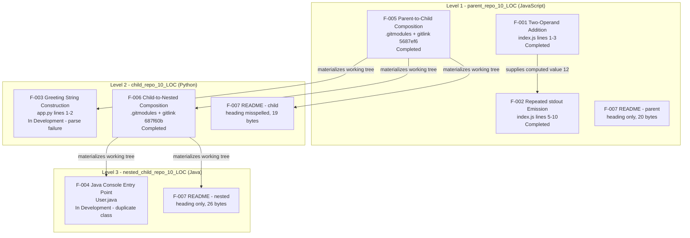
```mermaid
flowchart TD
    subgraph L1["Level 1 - parent_repo_10_LOC (JavaScript)"]
        F001["F-001 Two-Operand Addition<br/>index.js lines 1-3<br/>Completed"]
        F002["F-002 Repeated stdout Emission<br/>index.js lines 5-10<br/>Completed"]
        F005["F-005 Parent-to-Child Composition<br/>.gitmodules + gitlink 5687ef6<br/>Completed"]
        F007A["F-007 README - parent<br/>heading only, 20 bytes"]
        F001 -->|"supplies computed value 12"| F002
    end
    subgraph L2["Level 2 - child_repo_10_LOC (Python)"]
        F003["F-003 Greeting String Construction<br/>app.py lines 1-2<br/>In Development - parse failure"]
        F006["F-006 Child-to-Nested Composition<br/>.gitmodules + gitlink 687f60b<br/>Completed"]
        F007B["F-007 README - child<br/>heading misspelled, 19 bytes"]
    end
    subgraph L3["Level 3 - nested_child_repo_10_LOC (Java)"]
        F004["F-004 Java Console Entry Point<br/>User.java<br/>In Development - duplicate class"]
        F007C["F-007 README - nested<br/>heading only, 26 bytes"]
    end
    F005 -->|"materializes working tree"| F003
    F005 -->|"materializes working tree"| F006
    F005 -->|"materializes working tree"| F007B
    F006 -->|"materializes working tree"| F004
    F006 -->|"materializes working tree"| F007C
```

| Dependency Edge | Nature | Evidence |
| --- | --- | --- |
| F-001 → F-002 | Value dependency (in-process) | `const result = add(5, 7)` at `index.js` line 5 feeds the five `console.log(result)` statements at lines 6–10 |
| F-005 → F-003, F-006, F-007 (Level 2) | Containment / acquisition dependency | Parent gitlink `160000 commit 5687ef6…` is the only way `child_repo_10_LOC/` becomes populated |
| F-006 → F-004, F-007 (Level 3) | Containment / acquisition dependency | Child gitlink `160000 commit 687f60b…` is the only way the nested directory becomes populated |
| F-005 → F-006 | Ordering dependency | The child's `.gitmodules` — which declares F-006 — exists only inside the child working tree produced by F-005 |

No edge exists between F-001/F-002 and any Level 2 or Level 3 feature: the JavaScript, Python, and Java artifacts are independent programs that share only a checkout directory.

### 2.3.2 Integration Points

Exactly one integration technology is present — Git submodules — and it is exercised at two points. Both are source-composition integrations that occur during Git operations, never during program execution.

| Integration Point | Participating Features | Contract |
| --- | --- | --- |
| Parent → child linkage | F-005 | `path` / `url` pair in `.gitmodules` plus a mode-`160000` tree entry pinning commit `5687ef6` |
| Child → nested linkage | F-006 | `path` / `url` pair in `child_repo_10_LOC/.gitmodules` plus a mode-`160000` tree entry pinning commit `687f60b` |
| Standard output stream | F-002 (active), F-003 / F-004 (intended) | The only runtime boundary crossing in the system; no format, schema, or destination is configurable |

There are no other integration points. No HTTP client or server, database driver, message broker, cloud SDK, package registry, authentication provider, or scheduled trigger appears at any level; the corresponding absences are catalogued in **1.3.2.3 Integration Points Not Covered**.

### 2.3.3 Shared Components

The repository contains **no shared code**: there is no utility module, no library directory, no base class, no interface, and no cross-file import anywhere in the eight tracked files. What the features share are mechanisms and conventions rather than components.

| Shared Element | Features Sharing It | Nature of Sharing |
| --- | --- | --- |
| Git submodule mechanism (`.gitmodules` + gitlink) | F-005, F-006 | Identical declaration pattern applied once per level; both git directories are absorbed under the parent's `.git/modules/` |
| Standard output stream | F-002, F-003, F-004 | Each feature writes to stdout using its language's built-in facility (`console.log`, `print`, `System.out.println`); no shared writer, formatter, or logger exists |
| Heading-only README convention | F-007 (three instances) | One single-line H1 file per repository, following the same shape at all three levels |
| Zero-dependency posture | All seven | No feature declares, resolves, or vendors any dependency; every artifact relies solely on language built-ins |

### 2.3.4 Common Services

**No common services exist.** This is a verified absence, not an omission: there is no service layer, dependency-injection container, configuration provider, logging framework, error-handling middleware, validation library, authentication service, caching layer, or scheduler anywhere in the composed checkout. Each feature is implemented entirely within its own file using only language built-ins, and the recursive grep for imports and external interfaces returned zero matches across all three program files.

The nearest thing to a cross-cutting service is Git itself, which provides acquisition and pinning for F-005 and F-006. Git is an external tool rather than a component of this system, and it is invoked by the operator, never by the code.

### 2.3.5 Related Process Flows

The operator-facing flows are documented in **1.3.1.2 Primary User Workflows** (Workflow A — acquire the composed checkout; Workflow B — execute the working capability). The diagram below maps those two workflow steps onto the requirements they satisfy, so that each manual step in Section 1 has a corresponding verifiable requirement in Section 2.

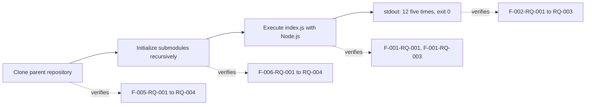
```mermaid
flowchart LR
    CLONE["Clone parent repository"]
    INIT["Initialize submodules recursively"]
    RUN["Execute index.js with Node.js"]
    OUT["stdout: 12 five times, exit 0"]
    CLONE --> INIT --> RUN --> OUT
    CLONE -. "verifies" .-> RQA["F-005-RQ-001 to RQ-004"]
    INIT -. "verifies" .-> RQB["F-006-RQ-001 to RQ-004"]
    RUN -. "verifies" .-> RQC["F-001-RQ-001, F-001-RQ-003"]
    OUT -. "verifies" .-> RQD["F-002-RQ-001 to RQ-003"]
```

Two flows that a reader might expect are absent and cannot be diagrammed: there is no build/test pipeline (no manifests, no tests, no CI configuration at any level) and no execution flow for Levels 2 and 3, because `app.py` fails to parse and `User.java` cannot be compiled as written.

## 2.4 Implementation Considerations

The considerations below are derived from what the committed artifacts actually require and from the defects verified during inspection. The repository declares no non-functional requirements — no performance budget, service-level objective, capacity target, threat model, or maintenance policy exists in any tracked file — so each entry states either an observed property or an explicit absence.

### 2.4.1 Cross-Cutting Considerations

These apply to every feature in the catalog and are not repeated in the per-feature sub-sections.

| Consideration | Repository-Wide Position |
| --- | --- |
| Technical constraints | No dependency, build, packaging, or task-automation tooling exists at any level; nothing can be installed, compiled through a build system, or packaged. Runtime versions are undeclared, so every consumer must supply its own toolchain |
| Performance requirements | None declared and none measurable at runtime — the system exposes no instrumentation, metrics endpoint, timing code, or log aggregation. The only quantitative facts available are static: 8 tracked files, 985 bytes, 30 non-blank program lines |
| Scalability considerations | Not applicable in the conventional sense. There is no server, listener, port binding, concurrency primitive, queue, or shared state; scale is bounded by a single short-lived process per execution. The one dimension that does scale is *composition depth*, which is currently two and grows only by adding further `.gitmodules` declarations |
| Security implications | No authentication, authorization, secret management, input validation, encryption, or audit logging exists anywhere. The residual surface is minimal because no feature accepts external input: no CLI arguments, environment variables, stdin, file reads, or network calls appear in any program file. Access control is delegated entirely to hosting-platform repository permissions |
| Maintenance requirements | Zero automated verification exists — no tests, assertions, linters, formatters, type checking, or CI. Every requirement in 2.2 must be re-verified manually after any change. Absence of `LICENSE`, `.gitignore`, `CONTRIBUTING.md`, and `CODEOWNERS` means contribution and reuse terms are undefined |

### 2.4.2 F-001 — Two-Operand Addition Function

| Consideration | Detail |
| --- | --- |
| Technical constraints | Untyped, unexported, and unreachable from outside the file — `index.js` declares no `module.exports`, so the function cannot be reused without editing the source. Node.js is required, but no minimum version is declared |
| Performance requirements | None declared. A single constant-time arithmetic evaluation performed once at module scope; no allocation beyond the result and no I/O |
| Scalability considerations | None applicable. The function is stateless and re-entrant, but arity is fixed at two and operands are literals, so no workload dimension can vary |
| Security implications | The unguarded `+` operator is the only notable property: string operands concatenate (`"5" + "7"` → `"57"`) and a missing operand yields `NaN`, and neither condition raises an error. This is latent only — no untrusted value can reach the function today |
| Maintenance requirements | Changing the operands requires a source edit and a manual re-run; there is no test that would detect a regression in the returned value |

### 2.4.3 F-002 — Repeated Standard-Output Emission

| Consideration | Detail |
| --- | --- |
| Technical constraints | Output multiplicity is hard-coded as five separate statements rather than a loop or a configurable count, so changing it requires adding or deleting statements. `console.log` is used as an ambient global, tying the feature to a Node.js-style host |
| Performance requirements | None declared. Five synchronous writes during initialization; the process schedules no event-loop work, so lifetime is dominated by runtime startup |
| Scalability considerations | None applicable. Output volume is fixed at five records and cannot grow with any input |
| Security implications | Nothing sensitive is written — the emitted value is a computed constant. No redaction, sampling, or log-destination control exists, so any future change to the emitted value would be published to stdout unconditionally |
| Maintenance requirements | The verifiable contract is the exact output signature (five lines, each `12`, exit 0, empty stderr); any edit to lines 5–10 invalidates it and must be re-checked by running the script |

### 2.4.4 F-003 — Greeting String Construction

| Consideration | Detail |
| --- | --- |
| Technical constraints | The file is currently non-parsable, which is a hard blocker: `python3 -m py_compile` exits 1 with `IndentationError` at line 7. Two source defects must be resolved — the duplicated `__main__` guard indented by two spaces at line 7, and the stray `///asdas` token at line 10. The f-string at line 2 additionally constrains the interpreter to Python 3.6 or later |
| Performance requirements | None declared. One string interpolation and at most two print operations in the intended flow |
| Scalability considerations | None applicable. `greet` is stateless with a single scalar parameter; no batching, streaming, or concurrency exists |
| Security implications | `name` is interpolated with no type check, length limit, or escaping, so any object's string representation would be embedded verbatim in the output. Unexercised today because the module never runs and receives no external input |
| Maintenance requirements | Repairing the file is a prerequisite for any verification of F-003; the correctness of `greet` itself was confirmed only by evaluating lines 1–2 in isolation. No test exists to protect the repair, and no dependency manifest exists to pin the interpreter version |

### 2.4.5 F-004 — Java Console Entry Point

| Consideration | Detail |
| --- | --- |
| Technical constraints | Two top-level `public class User` declarations in one compilation unit (lines 1 and 7) make the file invalid for any Java compiler, independent of build tooling. No build descriptor, package declaration, or target-version statement exists at Level 3, and the inspection environment had no compiler available to produce diagnostic output |
| Performance requirements | None declared. One assignment and one console write per entry point |
| Scalability considerations | None applicable. The class is stateless and field-less; `args` is never read, so no input dimension exists |
| Security implications | None material. No input is consumed, no resource is opened, and no library is loaded. The `User` name implies an identity model that the class does not implement — a naming hazard rather than a vulnerability |
| Maintenance requirements | Resolving the duplicate class is the prerequisite for any compilation. Since two `main` methods exist with different literals, the repair also requires an explicit decision about which behavior is intended — a decision the repository provides no basis for |

### 2.4.6 F-005 — Parent-to-Child Submodule Composition

| Consideration | Detail |
| --- | --- |
| Technical constraints | Requires a Git client with submodule support; a non-recursive clone leaves `child_repo_10_LOC/` empty and silently removes Levels 2 and 3 from the checkout. The child's Git directory is absorbed under the parent's `.git/modules/`, so the parent clone is the single source of truth for the child's object storage |
| Performance requirements | None declared. Acquisition cost is trivial — the child level adds three tracked files totalling 367 bytes |
| Scalability considerations | The pattern is linear: one submodule per level. Adding siblings or depth increases the number of remotes that must be reachable at clone time and the number of pins that must be advanced on every update |
| Security implications | The declared remote is a public HTTPS URL containing no credentials, and it is fetched only during Git operations. Pinning to an exact commit (`5687ef6`) is the security-relevant property: content cannot change beneath the parent without a visible gitlink update. No signature verification or provenance attestation is configured |
| Maintenance requirements | Every child change requires a corresponding pin bump and commit in the parent; the parent's history shows submodule attachment treated as its own commit (`Add child submodule`, `5ad746c`). Pin currency must be re-verified manually because no automation checks it |

### 2.4.7 F-006 — Child-to-Nested Submodule Composition

| Consideration | Detail |
| --- | --- |
| Technical constraints | Level 3 is reachable only at depth two, so recursive initialization is mandatory rather than optional. A verified asymmetry applies: the child's `.git/config` registers no `submodule.*` entries, so recursive status reports the nested module as uninitialized (leading `-`) despite a populated working tree, and the nested repository sits at a detached HEAD rather than on a branch |
| Performance requirements | None declared. The nested level adds two tracked files totalling 306 bytes |
| Scalability considerations | Each additional level multiplies the initialization steps and the pin-bump chain: a change at Level 3 must be committed there, then pinned in the child, then pinned again in the parent |
| Security implications | Same posture as F-005 — public HTTPS remote, exact-commit pin (`687f60b`), no credentials in tracked configuration, no signature verification. The detached HEAD state means the checked-out content is identified only by commit ID |
| Maintenance requirements | Operators must not assume that a single recursive command from the child level will populate Level 3; explicit initialization may be required. Cascading pin updates across two levels are manual, and no tooling in the repository validates that the pins remain consistent |

### 2.4.8 F-007 — Repository Identification Documentation

| Consideration | Detail |
| --- | --- |
| Technical constraints | Documentation is limited to one H1 heading per repository; none of the three files ends with a trailing newline. No documentation generator or site build consumes them |
| Performance requirements | Not applicable — 65 bytes across all three files |
| Scalability considerations | The one-README-per-repository convention scales linearly with composition depth, but provides no aggregated view of the composed system at any depth |
| Security implications | None. The files disclose only repository names — no endpoints, credentials, contacts, or internal topology beyond the names already visible in `.gitmodules` |
| Maintenance requirements | The Level 2 heading (`# chile_repo_10_LOC`) does not match its repository name and will persist until manually corrected, because no linter or spell-checker exists. Any substantive documentation — setup, usage, architecture, license — would have to be authored from scratch |

## 2.5 Traceability Matrix

Every requirement traces to a specific tracked artifact and to a verification action that was actually performed during preparation of this specification. No requirement is left without an artifact, and no artifact in the repository is left without a requirement — the mapping is total in both directions across all eight tracked files.

### 2.5.1 Requirement-to-Artifact Traceability

| Requirement ID | Implementing Artifact | Precise Location |
| --- | --- | --- |
| F-001-RQ-001 | `index.js` | Lines 1–3 (`function add(a, b)`) |
| F-001-RQ-002 | `index.js` | Line 5 (`add(5, 7)` literal operands) |
| F-001-RQ-003 | `index.js` | Whole file (10 lines, 171 bytes) |
| F-002-RQ-001 | `index.js` | Lines 6–10 (five `console.log` statements) |
| F-002-RQ-002 | `index.js` | Whole file — no thrown error, no `process.exit` |
| F-002-RQ-003 | `index.js` | Line 5 (`const result`) referenced by lines 6–10 |
| F-003-RQ-001 | `child_repo_10_LOC/app.py` | Lines 1–2 (`greet(name)` f-string return) |
| F-003-RQ-002 | `child_repo_10_LOC/app.py` | Line 7 (duplicated guard) and line 10 (`///asdas`) |
| F-003-RQ-003 | `child_repo_10_LOC/app.py` | Lines 4–6 (`__main__` block, `user = "Lakshya"`) |
| F-004-RQ-001 | `child_repo_10_LOC/nested_child_repo_10_LOC/User.java` | Lines 1 and 7 (two `public class User`) |
| F-004-RQ-002 | `child_repo_10_LOC/nested_child_repo_10_LOC/User.java` | Lines 2–4 and 8–10 (`main` bodies) |
| F-004-RQ-003 | `child_repo_10_LOC/nested_child_repo_10_LOC/User.java` | Whole file — no `package`, no `import` |
| F-005-RQ-001 | `.gitmodules` | `[submodule "child_repo_10_LOC"]` section (121 bytes) |
| F-005-RQ-002 | Parent Git tree | `160000 commit 5687ef6…​ child_repo_10_LOC` |
| F-005-RQ-003 | Parent Git tree + child HEAD | Pin equals child HEAD on branch `2807_01` |
| F-005-RQ-004 | `child_repo_10_LOC/` working tree | `.git` pointer → `../.git/modules/child_repo_10_LOC` |
| F-006-RQ-001 | `child_repo_10_LOC/.gitmodules` | `[submodule "nested_child_repo_10_LOC"]` section (142 bytes) |
| F-006-RQ-002 | Child Git tree | `160000 commit 687f60b…​ nested_child_repo_10_LOC` |
| F-006-RQ-003 | `child_repo_10_LOC/nested_child_repo_10_LOC/` working tree | `.git` pointer → `../../.git/modules/child_repo_10_LOC/modules/nested_child_repo_10_LOC` |
| F-006-RQ-004 | `child_repo_10_LOC/.git/config` | No `submodule.*` entries present |
| F-007-RQ-001 | `README.md` (×3) | Parent 20 B, child 19 B, nested 26 B |
| F-007-RQ-002 | `child_repo_10_LOC/README.md` | Heading `# chile_repo_10_LOC` |
| F-007-RQ-003 | `README.md` (×3) | Single H1 line each, no further content |

### 2.5.2 Requirement Verification Status

| Requirement ID | Verification Method | Status |
| --- | --- | --- |
| F-001-RQ-001 | Execute the script and observe the emitted value | Verified — `12` |
| F-001-RQ-002 | Recursive grep for `process.`, `argv`, `env`, `System.in`, `read`, `open(` | Verified — zero matches |
| F-001-RQ-003 | `node --check index.js` | Verified — exit 0 |
| F-002-RQ-001 | Count stdout lines and distinct values from `node index.js` | Verified — 5 lines, all `12` |
| F-002-RQ-002 | Capture exit status and stderr byte count | Verified — exit 0, 0 bytes |
| F-002-RQ-003 | Source inspection of call site vs. reference count | Verified — 1 call, 5 references |
| F-003-RQ-001 | Evaluate lines 1–2 in an isolated scratch file | Verified in isolation — `Hello Lakshya` |
| F-003-RQ-002 | `python3 -m py_compile` and `ast.parse` | **Failed** — `IndentationError`, line 7 |
| F-003-RQ-003 | Attempt module execution | **Blocked** by F-003-RQ-002 |
| F-004-RQ-001 | Source inspection for top-level class declarations | **Failed** — two declarations |
| F-004-RQ-002 | Source inspection of both `main` bodies | Verified structurally |
| F-004-RQ-003 | Source inspection for `package` / `import` statements | Verified — none present |
| F-005-RQ-001 | Parse `.gitmodules` configuration keys | Verified — exactly two keys |
| F-005-RQ-002 | List the parent tree and inspect entry modes | Verified — mode `160000` |
| F-005-RQ-003 | Recursive submodule status + `git status --porcelain` | Verified — clean prefix, clean tree |
| F-005-RQ-004 | Directory listing and `.git` pointer read | Verified |
| F-006-RQ-001 | Parse child `.gitmodules` configuration keys | Verified — exactly two keys |
| F-006-RQ-002 | List the child tree and compare with nested HEAD | Verified — `687f60b` both sides |
| F-006-RQ-003 | Directory listing and `.git` pointer read | Verified |
| F-006-RQ-004 | Recursive submodule status + child local config query | **Failed** — leading `-`, no local registration |
| F-007-RQ-001 | Read all three README files and measure sizes | Verified |
| F-007-RQ-002 | Compare heading text with repository name | **Failed** at Level 2 |
| F-007-RQ-003 | Full read of all three README files | Verified — identification only |

### 2.5.3 Cross-Reference to Section 1

Each feature maps to the scope item already established in **1.3.1.1** and to the capability already listed in **1.2.2.1**, confirming that Sections 1 and 2 describe the same evidence base without divergence.

| Feature ID | Section 1.3.1.1 In-Scope Item | Section 1.2.2.1 Capability |
| --- | --- | --- |
| F-001 | Item 1 — integer addition of two supplied operands | Add two numbers (computation half) |
| F-002 | Item 2 — emission of the computed value five times | Add two numbers (output half) |
| F-003 | Item 3 — construction of a greeting string from a name | Return a greeting string for a supplied name |
| F-004 | Item 4 — console output of a hard-coded string from Java | Print a hard-coded string from a Java entry point |
| F-005 | Item 5 — declarative linkage of a child repository | Compose three repositories into one checkout (Level 1→2) |
| F-006 | Item 6 — declarative linkage of a grandchild repository | Compose three repositories into one checkout (Level 2→3) |
| F-007 | Tracked documentation artifacts (1.1.2, 1.4.1) | Not listed as a capability — documentation only |

### 2.5.4 Requirement Version Tracking

The repository provides no versioning scheme: `git tag` returns nothing in any of the three repositories, and no changelog, version file, or manifest version field exists. Requirement identity is therefore anchored to commit IDs.

| Baseline Attribute | Value |
| --- | --- |
| Requirement set version | 1.0 — initial baseline established by this specification |
| Parent baseline commit | `5ad746c` (`Add child submodule`) on branch `2807_01` |
| Child baseline commit | `5687ef6` (`Add nested child submodule`) on branch `2807_01` |
| Nested baseline commit | `687f60b` (`Create User.java`), checked out at detached HEAD |

All eight commits across the three repositories are dated 2026-07-28 and authored by `lakshya-blitzy` / `lakshya`. Because there are no tags and no automated verification, any change to the artifacts listed in 2.5.1 supersedes this baseline and requires the affected acceptance criteria in 2.2 to be re-executed manually.

### 2.5.5 Open Defect Roll-Up

Five requirements are not met at the baseline. Each corresponds to a defect verified during inspection; none corresponds to unimplemented scope.

| Requirement Not Met | Blocking Defect | Feature Impact |
| --- | --- | --- |
| F-003-RQ-002, F-003-RQ-003 | `IndentationError` at `app.py` line 7 (duplicated `__main__` guard) plus the stray `///asdas` at line 10 | F-003 cannot execute; Level 2 contributes no runnable behavior |
| F-004-RQ-001 | Two top-level `public class User` declarations in one compilation unit (lines 1 and 7) | F-004 cannot compile; Level 3 contributes no runnable behavior |
| F-006-RQ-004 | Child's `.git/config` registers no `submodule.*` entries; nested repository at detached HEAD | Level 3 may be skipped by recursive operations driven from the child |
| F-007-RQ-002 | Level 2 README heading reads `# chile_repo_10_LOC` | Cosmetic documentation mismatch only |

The remaining eighteen requirements are met and were verified as recorded in 2.5.2.

## 2.6 References

### 2.6.1 Repository Files Examined

All eight tracked files in the composed checkout were read in full; this list is therefore both the evidence base for Section 2 and the complete file inventory of the system.

- `index.js` - Established F-001 (`add(a, b)`, lines 1–3) and F-002 (`const result = add(5, 7)` at line 5 plus five `console.log(result)` statements at lines 6–10); confirmed the absence of exports, imports, CLI input, environment reads, validation, error handling, and asynchrony. Measured at 171 bytes / 10 lines.
- `.gitmodules` - Established F-005: one `[submodule "child_repo_10_LOC"]` section with `path = child_repo_10_LOC` and `url = https://github.com/lakshya-blitzy/child_repo_10_LOC.git`; confirmed no second submodule section exists. Measured at 121 bytes.
- `README.md` - Established the Level 1 instance of F-007: the single heading `# parent_repo_10_LOC` with no trailing newline and no setup, usage, architecture, or license content. Measured at 20 bytes.
- `child_repo_10_LOC/app.py` - Established F-003: `greet(name)` returning `f"Hello {name}"` (lines 1–2), the valid `__main__` block (lines 4–6), the duplicated guard at line 7, and the stray `///asdas` token at line 10 that together cause the parse failure. Measured at 206 bytes / 10 lines.
- `child_repo_10_LOC/.gitmodules` - Established F-006: one `[submodule "nested_child_repo_10_LOC"]` section with `path = nested_child_repo_10_LOC` and `url = https://github.com/lakshya-blitzy/nested_child_repo_10_LOC.git`. Measured at 142 bytes.
- `child_repo_10_LOC/README.md` - Established the F-007-RQ-002 defect: the heading `# chile_repo_10_LOC` does not match the repository name. Measured at 19 bytes.
- `child_repo_10_LOC/nested_child_repo_10_LOC/User.java` - Established F-004 and the F-004-RQ-001 defect: two top-level `public class User` declarations (lines 1 and 7), each with a `main` printing a method-local `String` (`"Test"`, `"asdsadasda"`); confirmed package-less, import-free, field-less, and stateless with `args` never read. Measured at 280 bytes / 12 lines.
- `child_repo_10_LOC/nested_child_repo_10_LOC/README.md` - Established the Level 3 instance of F-007: the single heading `# nested_child_repo_10_LOC`. Measured at 26 bytes.

### 2.6.2 Repository Folders Examined

- `` (repository root) - Contained exactly four first-order children (`index.js`, `.gitmodules`, `README.md`, `child_repo_10_LOC/`); established the absence of any root-level dependency manifest, build file, test directory, or CI configuration, which underpins constraints C-04 and the cross-cutting considerations in 2.4.1.
- `child_repo_10_LOC/` - Contained `app.py`, `.gitmodules`, `README.md`, and `nested_child_repo_10_LOC/`; established that Level 2 has no build or dependency manifest and no tests.
- `child_repo_10_LOC/nested_child_repo_10_LOC/` - Contained only `User.java` and `README.md`; established that Level 3 has no `pom.xml`, `build.gradle`, package metadata, or tests.

### 2.6.3 Verification Evidence Used for Acceptance Criteria

| Inspection Performed | Requirements It Substantiated |
| --- | --- |
| `node --check index.js` and `node index.js` (Node.js v22.23.1), including exit status and stderr byte count | F-001-RQ-001, F-001-RQ-003, F-002-RQ-001, F-002-RQ-002 |
| Evaluation of `add(a, b)` with numeric, string, and missing operands (`12`, `"57"`, `NaN`) | F-001 data-validation findings in 2.2.2.3 and security implications in 2.4.2 |
| `python3 -m py_compile child_repo_10_LOC/app.py` and independent `ast.parse` (Python 3.12.3) | F-003-RQ-002, F-003-RQ-003 |
| Isolated evaluation of `app.py` lines 1–2 in a scratch file outside the repository | F-003-RQ-001 |
| Source inspection of `User.java` top-level declarations (no compiler available in the environment) | F-004-RQ-001, F-004-RQ-002, F-004-RQ-003 |
| `git config -f .gitmodules --list` for both `.gitmodules` files | F-005-RQ-001, F-006-RQ-001 |
| `git ls-tree HEAD` in the parent and the child (mode `160000` gitlink entries) | F-005-RQ-002, F-006-RQ-002 |
| `git submodule status --recursive` and `git config --local --list` at both levels | F-005-RQ-003, F-006-RQ-004 |
| Reads of the submodule `.git` pointer files and directory listings | F-005-RQ-004, F-006-RQ-003 |
| `git status --porcelain` in the parent and child (empty both before and after all probes) | F-005-RQ-003; confirmed the investigation mutated nothing |
| `git log`, `git tag`, and branch inspection across all three repositories | 2.5.4 Requirement Version Tracking |
| `git ls-files` plus byte/line measurement of every tracked file | 2.1.1 inventory tables, F-007-RQ-001, F-007-RQ-003 |
| Recursive grep for `require`, `import`, `process.`, `argv`, `env`, `fetch`, `http`, `open(`, `read`, `write`, `socket`, `Scanner`, `System.in` — zero matches | Constraint C-01, F-001-RQ-002, and the "no runtime coupling" finding in 2.3 |
| Recursive grep for `todo`, `fixme`, `roadmap`, `milestone`, `deprecat`, `wip`, `password`, `secret`, `token`, `api_key`, `auth` — zero matches | Assumption A-01 and the security positions in 2.2 and 2.4.1 |
| Recursive probe for manifests, lock files, CI/container definitions, lint configs, license files, and any `*test*`/`*spec*` file — zero matches | Constraint C-04 and 2.4.1 |
| Case-insensitive recursive search for `.blitzyignore` — no such file at any depth | Confirmed that no path exclusions applied to this analysis |

### 2.6.4 Cross-Referenced Specification Sections

- **1.1 Executive Summary** - Confirmed the system's characterization as a minimal polyglot submodule-composition fixture with no business domain logic, and supplied the corroborating file/line measurements reused in 2.1.
- **1.2 System Overview** - Supplied the capability inventory mapped to feature IDs in 2.5.3, and the verified limitation set reused in 2.4 and 2.5.5.
- **1.3 Scope** - Supplied the authoritative in-scope item numbering (items 1–6) mapped to F-001 … F-006 in 2.5.3, the out-of-scope exclusions reflected in the validation-rule absences in 2.2, and the Workflow A / Workflow B process flows referenced in 2.3.5.
- **1.4 References** - Supplied the citation conventions followed here and the constraint recorded as assumption A-05: remote URLs obtained from Git remote configuration embed a temporary access credential and are deliberately not reproduced, so all remote references in Section 2 come from the canonical URLs in the two `.gitmodules` files.

### 2.6.5 External Sources

**None.** No web search or external lookup was required or performed. The repository declares zero dependencies, so no external version, registry, or vendor documentation needed consultation, and every claim in Section 2 is derived from the repository itself. The `/app/` directory reachable from the execution environment is agent tooling, is not part of this repository, and was neither inspected nor documented.

# 3. Technology Stack

## 3.1 Programming Languages

This system is a deliberately minimal, three-level Git-submodule composition. Its entire technology surface was enumerated exhaustively: **8 tracked file blobs plus 2 Git gitlinks, totalling 985 bytes across exactly three directories**. Three programming languages are present, each represented by a single source file, one per hierarchy level, for a combined program payload of **30 non-blank lines / 657 bytes**. No language is accompanied by a version pin, a build descriptor, or a dependency manifest anywhere in the checkout.

Because the repository contains no architecture-decision records, design notes, or contributor documentation (the three `README.md` files each hold a single H1 heading and nothing else), the "selection criteria" documented in 3.1.3 are derived strictly from *observable properties of the code itself* and are labelled as such. No rationale is asserted that the repository does not demonstrate.

### 3.1.1 Language Inventory by Component

Each repository level contributes exactly one program file. The composition is polyglot *across* levels and monolingual *within* each level.

| Level / Component | Language | Source Artifact | Size (bytes / non-blank lines) |
|---|---|---|---|
| Level 1 — `parent_repo_10_LOC` (apex) | JavaScript | `index.js` | 171 / 9 |
| Level 2 — `child_repo_10_LOC` | Python | `child_repo_10_LOC/app.py` | 206 / 9 |
| Level 3 — `nested_child_repo_10_LOC` | Java | `child_repo_10_LOC/nested_child_repo_10_LOC/User.java` | 280 / 12 |

Two additional non-executable notations are tracked and are required for the system to function as a composed checkout:

| Notation | Role | Files | Total bytes |
|---|---|---|---|
| Markdown | Repository identification headings only | 3 × `README.md` (one per level) | 65 |
| Git INI-style configuration | Submodule declarations (`path`, `url`) | 2 × `.gitmodules` (levels 1 and 2) | 263 |

A complete file-extension census of the checkout confirms the inventory is closed — `2 × .gitmodules`, `1 × .java`, `1 × .js`, `3 × .md`, `1 × .py`, and **zero extension-less files**. There are no `src/`, `test/`, `docs/`, `config/`, or `infra/` directories at any level, and no file carries the executable bit (no `100755` index entries), so there are no shell scripts or self-executing entry points.

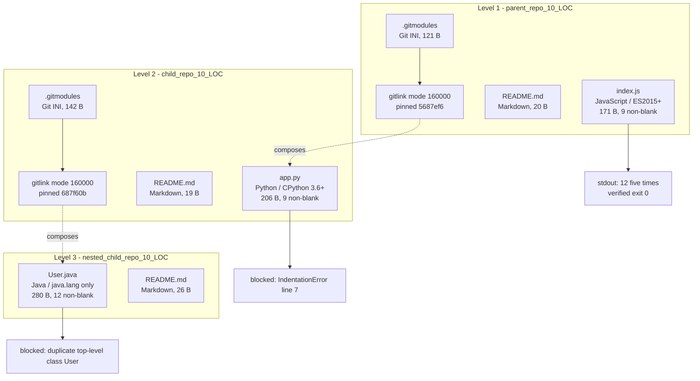
```mermaid
flowchart TD
    subgraph L1["Level 1 - parent_repo_10_LOC"]
        JS["index.js<br/>JavaScript / ES2015+<br/>171 B, 9 non-blank"]
        MD1["README.md<br/>Markdown, 20 B"]
        GM1[".gitmodules<br/>Git INI, 121 B"]
        GL1["gitlink mode 160000<br/>pinned 5687ef6"]
    end
    subgraph L2["Level 2 - child_repo_10_LOC"]
        PY["app.py<br/>Python / CPython 3.6+<br/>206 B, 9 non-blank"]
        MD2["README.md<br/>Markdown, 19 B"]
        GM2[".gitmodules<br/>Git INI, 142 B"]
        GL2["gitlink mode 160000<br/>pinned 687f60b"]
    end
    subgraph L3["Level 3 - nested_child_repo_10_LOC"]
        JAVA["User.java<br/>Java / java.lang only<br/>280 B, 12 non-blank"]
        MD3["README.md<br/>Markdown, 26 B"]
    end
    GM1 --> GL1
    GL1 -. "composes" .-> PY
    GM2 --> GL2
    GL2 -. "composes" .-> JAVA
    JS --> OUT1["stdout: 12 five times<br/>verified exit 0"]
    PY --> OUT2["blocked: IndentationError line 7"]
    JAVA --> OUT3["blocked: duplicate top-level class User"]
```

### 3.1.2 Language Version Requirements

No language version is declared anywhere in the repository. The floors below were derived by grepping each source file for version-gating syntax and are therefore *minimum capability* requirements imposed by the code, not repository declarations.

| Language | Minimum level required by the code | Syntactic evidence |
|---|---|---|
| JavaScript | ECMAScript 2015 (ES6) | Block-scoped `const` at `index.js` line 5 — the only post-ES5 construct in the file |
| Python | CPython 3.6 | f-string `f"Hello {name}"` at `app.py` line 2 — the only version-gating construct; excludes Python 2 |
| Java | No floor imposed by language features | Only `String` locals and `System.out.println` (lines 4 and 10); Java 1.0-era constructs exclusively |

Targeted probes established what is *not* used, which is what keeps these floors low:

- `index.js` contains no arrow functions, `class`, `let`, `async`/`await`, template literals, spread, `??`, or `?.`; every remaining construct (function declaration, `+` operator, statement form) is ES3-era. `console.log` is a **host-provided global**, not an ECMAScript language feature — it is supplied here by a Node.js-style runtime.
- `app.py` contains no walrus operator, `match` statement, `async`/`await`, return annotations, variable annotations, or decorators.
- `User.java` contains no generics, `var`, `record`, lambdas, method references, `@Override`, `interface`, `enum`, or `sealed` types, and declares no `package` and no `import`.

Because `index.js` has no accompanying `package.json`, Node.js resolves it under the **default CommonJS goal**; this was verified by direct execution.

For external context on the runtime lines a consumer would realistically supply: the Node.js project documents that major versions spend six months as "Current" before even-numbered majors move to Active LTS, that LTS lines receive critical bug fixes for a total of 30 months, and that production applications should run only Active LTS or Maintenance LTS releases; the current LTS roster spans majors 20/22/24 with 26.x as the Current line. On the Java side, the LTS roster is 8, 11, 17, 21, and 25 following the move to a two-year LTS cadence in September 2021. Every one of those lines satisfies this repository's floors — which is precisely why the absence of pins has no functional consequence today, only a governance one (3.1.4).

### 3.1.3 Selection Criteria Evidenced by the Code

No document in the repository justifies the language choices. The following criteria are *inferred from consistent, observable properties* of the three source files, and each is stated with its evidence:

1. **One language per composition level.** Level 1 is JavaScript, level 2 is Python, level 3 is Java. The three files share an identical shape — a single named unit of computation plus an immediate emission to standard output — implemented once per language. The distinguishing variable across levels is the language itself, which is consistent with the repository existing to exercise heterogeneous-language composition through Git submodules rather than to deliver a feature.
2. **Zero-dependency, self-contained compilation units.** A grep across all three program files for `require(`, `import`, `from `, `#include`, `import static`, `package`, `module`, and `export` returned **no matches**. Every file compiles or parses in isolation with nothing but its own language runtime.
3. **Lowest-common-denominator syntax.** As shown in 3.1.2, each file uses only long-established language constructs. This maximises the range of runtimes that can accept the code without any configuration, which is the natural choice when no version pin exists.
4. **Standard output as the sole interface.** The complete I/O surface of the system is nine call sites: `console.log(result)` five times in `index.js`, `print(greet(user))` twice in `app.py`, and `System.out.println(name)` twice in `User.java`. Each language contributes only its most universally available output primitive — the Node.js Console API, the Python `print` builtin, and `java.lang.System.out` respectively.
5. **No host or platform coupling beyond the interpreter.** No file reads command-line arguments, environment variables, stdin, files, or sockets. Grep found no match for `process.env`, `os.environ`, `getenv`, `System.getenv`, `sys.argv`, `argv`, `open(`, `readFile`, `fs.`, `Files.`, or any network client. The languages are used at their most portable, and each level is executable (or compilable) on any platform that provides the corresponding runtime.

### 3.1.4 Constraints and Language-Level Dependencies

#### 3.1.4.1 Unpinned Runtimes

The repository pins **no runtime version for any of the three languages**. A recursive probe confirmed the absence of `.nvmrc`, `.python-version`, `.tool-versions`, `.sdkmanrc`, `.java-version`, `package.json` (and therefore any `engines` field), `pyproject.toml`/`setup.cfg` (and therefore any `python_requires`), `pom.xml`, and `build.gradle`/`build.gradle.kts` (and therefore any `--release`/`maven.compiler.target` setting). Consequently **every consumer must supply its own toolchain**, and the effective language level is whatever the host happens to provide. The functional risk is currently low because the floors in 3.1.2 are satisfied by all supported release lines of all three languages; the governance risk is that nothing in the repository would detect or reject an incompatible host.

The reference environment used to verify this section provides `node v22.23.1`, `Python 3.12.3`, and `git 2.43.0`; **no JDK is installed** (`javac` and `java` are absent, as are `mvn` and `gradle`). The Java component therefore cannot be compiled or executed in that environment at all, which is a genuine toolchain gap for level 3 rather than a property of the source.

#### 3.1.4.2 Per-Language Validity Constraints

Language validity is *not* uniform across the three levels — only the JavaScript artifact is currently executable.

| Language | Validation performed | Result |
|---|---|---|
| JavaScript | `node --check index.js`; then direct execution | Parses cleanly; exit 0; exactly five stdout lines, all `12`; 0 bytes on stderr |
| Python | `python3 -m py_compile app.py`, corroborated by `ast.parse` | Fails: `IndentationError: unindent does not match any outer indentation level (app.py, line 7)` |
| Java | Static inspection only (no `javac` available) | Two top-level `public class User` declarations in one compilation unit (lines 1 and 7) — a duplicate-type conflict |

The Python defect is confined to file-level structure, not to the language feature in use: the `greet` function copied in isolation returns `Hello Lakshya` and exits 0. The blocking constructs are a second `if __name__ == "__main__":` guard indented by two spaces at line 7 and a stray non-Python token `///asdas` at line 10. The Java finding is a **static determination** based on the language's one-public-top-level-type-per-file rule; it has not been confirmed by compiler output because no compiler is present.

#### 3.1.4.3 Source-Format Constraints

All 8 tracked files share a uniform, minimal encoding profile that constrains how the sources may be invoked:

- **LF-only line endings** with zero CRLF sequences in any file, and **no UTF-8 BOM** — the first three bytes of every file are plain ASCII.
- **No shebang line** in any file and no executable permission bit anywhere in any index, so no artifact is directly invocable; the interpreter or compiler must always be named explicitly on the command line.
- **No source-encoding declarations** (`# -*- coding: ... -*-`), **no `"use strict"` directive**, and **no `package` declaration** in the Java file, which therefore resides in the default package.
- All three `README.md` files end without a trailing newline.

#### 3.1.4.4 Security Implications of the Language Surface

The language surface is unusually small, and that smallness is the dominant security property. Because no file accepts input of any kind — no argv, stdin, environment, file, or network reads were found — there is **no injection, deserialization, or untrusted-input surface** in any of the three languages. Equally, because no file imports anything, there is no transitive language-level attack surface to audit.

Two language-specific observations remain worth recording:

- `index.js` performs no type validation before applying `+`, so its behaviour is governed purely by JavaScript operator semantics. Verified directly: `add(5, 7)` yields the number `12`, `add("5", "7")` yields the string `"57"`, and `add(5, undefined)` yields `NaN`. As written, the operands are hard-coded literals, so this is a latent property rather than an exploitable one.
- A grep for `password`, `secret`, `token`, `api_key`, `credential`, `auth`, `oauth`, and `jwt` across all 8 tracked files returned **no matches** — no credential material is embedded in any source file.


## 3.2 Frameworks &amp; Libraries

**This system uses no application framework and no library of any kind.** That is a verified finding rather than an omission, and it is stated plainly because the repository has nothing else to report in this category. The subsections below record the scope of the verification, the language-intrinsic surface that stands in place of a framework layer, and the compatibility and security consequences of a zero-library posture.

### 3.2.1 Framework Inventory — Verified Absence

Three independent lines of evidence establish that no framework or library participates in this system.

**1. No manifest exists to declare one.** A consolidated recursive probe across all three repository levels found none of: `package.json`, `package-lock.json`, `requirements*.txt`, `pyproject.toml`, `setup.py`, `setup.cfg`, `Pipfile`, `poetry.lock`, `pom.xml`, `build.gradle`/`build.gradle.kts`, `ivy.xml`, `Cargo.toml`, `go.mod`, `Gemfile`, or `composer.json`. There is therefore no artifact in which a framework version *could* be declared.

**2. No source file references one.** A case-insensitive grep across all 8 tracked files for `flask`, `django`, `express`, `spring`, `react`, `vue`, `angular`, `fastapi`, `servlet`, `langchain`, `tailwind`, `electron`, `jquery`, `lodash`, `axios`, `requests`, `numpy`, `pandas`, `junit`, `mocha`, `jest`, and `pytest` produced **no genuine matches**. The only textual hits were false positives caused by the substring `nest` occurring inside the identifier `nested_child_repo_10_LOC` in `child_repo_10_LOC/.gitmodules` and `child_repo_10_LOC/nested_child_repo_10_LOC/README.md`.

**3. No module is loaded at runtime.** Beyond static inspection, the entry point was instrumented: loading `index.js` through Node's module system adds **exactly one** entry to `require.cache` — the entry file itself. No further module is resolved, so there is not even a lazily-required dependency. Complementing this, a grep for `require(`, `import`, `from `, `#include`, and `import static` across the three program files returned no matches at all, and neither `app.py` nor `User.java` contains an import statement or a `package` declaration.

Accordingly, the section prompt's default framework candidates — Flask for the backend, React/TailwindCSS for the web tier, LangChain for AI, React Native/Swift/Kotlin/Objective-C/Electron for clients — are **not present in this repository** and are not part of this system's stack.

### 3.2.2 Standard Library and Host API Surface

What substitutes for a framework layer is a set of three ambient output primitives, each available without an import in its own language. The following table is the **complete** library-facing surface of the system — nine call sites in total.

| Language | Primitive used | Call sites | Provider |
|---|---|---|---|
| JavaScript | `console.log(result)` | `index.js` lines 6–10 (5 calls) | Node.js host Console API (ambient global) |
| Python | `print(greet(user))` | `child_repo_10_LOC/app.py` lines 6 and 9 | Python builtins (no import required) |
| Java | `System.out.println(name)` | `.../User.java` lines 4 and 10 | `java.lang.System.out` → `java.io.PrintStream` (`java.lang` auto-imported) |

Two properties of this surface matter architecturally:

- **`console.log` is a host global, not a language feature.** Its availability ties `index.js` to a Node.js-style host rather than to bare ECMAScript. This is the single point at which the JavaScript component depends on something outside the language specification.
- **stdout is the only channel in either direction.** There is no input channel anywhere in the system — no `argv`, stdin, environment, file, or socket read was found in any file — so no parsing, serialization, or transport library is needed.

### 3.2.3 Language-Intrinsic Constructs Used in Place of Libraries

Where a conventional application would reach for a library, each file uses a built-in language construct instead:

| Concern | Conventional solution | What this repository uses |
|---|---|---|
| String formatting | Templating or formatting library | Python f-string at `app.py` line 2 |
| Script entry point | CLI framework / argument parser | `if __name__ == "__main__":` at `app.py` line 4; `public static void main(String[] args)` at `User.java` lines 2 and 8 |
| Arithmetic | Numeric/decimal library | JavaScript `+` operator inside `add(a, b)` at `index.js` lines 1–3 |
| Diagnostics | Logging framework (e.g. Winston, `logging`, Log4j) | The three raw output primitives in 3.2.2 |

Notably, two of these intrinsic conventions are also where the repository's defects live: the `__main__` guard is duplicated and mis-indented at `app.py` line 7, and the `main` entry point is duplicated across two identical top-level `public class User` declarations in `User.java` (lines 1 and 7). Both defects are structural repetitions of a language convention, not library misuse.

### 3.2.4 Compatibility Requirements

With no framework contract and no manifest, the compatibility matrix collapses to two conditions per component:

1. The host runtime must accept the language level derived in 3.1.2 — ECMAScript 2015 for `index.js`, CPython 3.6 or later for `app.py`, and any JDK for `User.java`.
2. The host runtime must provide the corresponding ambient output primitive from 3.2.2.

Three consequences follow, each grounded in an observed fact rather than in a framework specification:

- **No version-compatibility negotiation is possible or necessary.** Because nothing is declared, there is no dependency-resolution step, no peer-dependency constraint, and no transitive-version conflict to reconcile. Equally, there is no mechanism by which the repository could reject an incompatible host.
- **No inter-component API contract exists.** The three program files never invoke one another. There is no cross-language bridge, no IPC, no subprocess spawn, and no shared data format; the levels are joined purely by Git composition (documented in 3.3.2), not by a runtime interface. Compatibility between levels is therefore a *checkout-time* concern, not a runtime one.
- **Absence of `package.json` fixes the JavaScript module goal.** Node.js resolves `index.js` under the default CommonJS goal, verified by direct execution. Introducing a `package.json` with `"type": "module"` later would change that resolution, so the compatibility guarantee currently in force is a consequence of the manifest's absence.

### 3.2.5 Justification and Security Posture

**Why no framework is the fitting choice here.** The total workload of the system is one addition, one string interpolation, one string assignment, and nine writes to standard output — 30 non-blank lines of program code across three languages. No routing, persistence, concurrency, serialization, configuration, or presentation concern exists that a framework would address. Introducing one would add orders of magnitude more surface than the payload it wraps. Section 1 characterises this design as scripts with zero abstraction composed by Git, and the framework-free profile documented here is exactly what implements that characterisation.

**Security implications of a zero-library surface.** The security benefit is substantial and directly attributable to the absence of dependencies:

- **No transitive dependency risk.** With zero declared or loaded libraries, the system has no third-party code to patch, no CVE exposure inherited from a dependency tree, and nothing for a vulnerability scanner to flag. There is correspondingly no need for lock files, integrity hashes, or dependency-update automation — none of which exist (see 3.3).
- **No framework-mediated attack surface.** There is no HTTP server, no template engine, no deserializer, and no ORM, so the classes of vulnerability those components introduce are structurally absent rather than merely unexercised.
- **No credential or configuration handling.** A grep across all 8 tracked files for `password`, `secret`, `token`, `api_key`, `credential`, `auth`, `oauth`, and `jwt` returned no matches, and no `.env` file exists at any level.

The residual risk is not in what is included but in what is unconstrained: because no framework or manifest pins anything, the *behaviour* of each component is a function of the host runtime the operator supplies (see 3.1.4.1). The mitigation available to a consumer is external — standardise the runtime in the execution environment, since the repository itself expresses no requirement.


## 3.3 Open Source Dependencies

**This system declares zero third-party or open-source package dependencies.** No package registry is configured or contacted, and no library is vendored, bundled, or downloaded. The only dependency-resolution mechanism present anywhere in the system is **Git submodule composition**, in which the "packages" are two sibling Git repositories and the "versions" are 40-character commit SHAs recorded as gitlinks. This subsection documents that mechanism as the system's dependency model and analyses its supply-chain properties.

### 3.3.1 Registry Dependencies — Verified Absence

Four categories of probe, each executed recursively across all three repository levels with `.git` internals pruned, all returned empty:

| Probe category | Artifacts searched for | Result |
|---|---|---|
| Dependency manifests | `package.json`, `requirements*.txt`, `pyproject.toml`, `setup.py`, `setup.cfg`, `Pipfile`, `pom.xml`, `build.gradle(.kts)`, `ivy.xml`, `Cargo.toml`, `go.mod`, `Gemfile`, `composer.json` | None found |
| Lock / integrity files | `package-lock.json`, `npm-shrinkwrap.json`, `yarn.lock`, `pnpm-lock.yaml`, `bun.lockb`, `poetry.lock`, `Gemfile.lock`, any `*.lock` | None found |
| Registry configuration | `.npmrc`, `.yarnrc*`, `pip.conf`, `pip.ini`, `settings.xml` | None found |
| Vendored / packaged artifacts | `node_modules/`, `vendor/`, `site-packages/`, `.venv/`, `target/`, `build/`, `dist/`, `third_party/`, `.m2/`, `.gradle/`, and any `*.jar`, `*.war`, `*.whl`, `*.egg`, `*.class`, `*.pyc`, `*.so`, `*.dll`, `*.tar.gz`, `*.tgz`, `*.zip` | None found |

Consequently **no public or private package registry participates in this system** — npmjs.com, PyPI, and Maven Central are neither referenced nor configured, and there is no `install` or `restore` step in any workflow. This is corroborated at runtime: instrumenting Node's module loader showed that executing `index.js` adds exactly one entry to `require.cache` (the entry file itself), so no module is resolved beyond the source file (see 3.2.1).

### 3.3.2 The Actual Dependency Mechanism — Git Submodule Gitlinks

Dependency resolution in this system is performed entirely by Git. Each level declares exactly one downstream repository in a `.gitmodules` file, and the superproject's tree records the exact commit of that repository as a **mode-`160000` gitlink** rather than a blob.

#### 3.3.2.1 Declarations and Pins

Parsed canonically from the two `.gitmodules` files (these are the only URLs quoted anywhere in this section):

| Consumer level | Declared path | Declared source URL |
|---|---|---|
| Level 1 — `parent_repo_10_LOC` | `child_repo_10_LOC` | `https://github.com/lakshya-blitzy/child_repo_10_LOC.git` |
| Level 2 — `child_repo_10_LOC` | `nested_child_repo_10_LOC` | `https://github.com/lakshya-blitzy/nested_child_repo_10_LOC.git` |

Both declarations use the **HTTPS transport** — not SSH, not the unauthenticated `git://` protocol, and not a relative path. The corresponding version pins, read from each superproject's HEAD tree, are:

| Gitlink | Pinned commit | Currency check |
|---|---|---|
| `parent → child_repo_10_LOC` | `5687ef6c3fdbdf361df830fcd78a2dbdcdb2b80a` | Equal to the child's HEAD — pin is current |
| `child → nested_child_repo_10_LOC` | `687f60b6c74818ac7cd14413840d73fdfb5fe450` | Equal to the nested repository's HEAD — pin is current |

The level-3 tree contains blobs only (`README.md`, `User.java`) and no further gitlink, making it the terminal node of the dependency graph.

#### 3.3.2.2 Resolution Topology

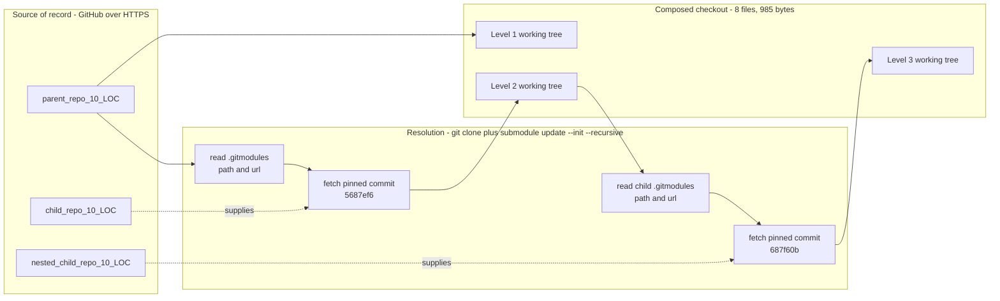
```mermaid
flowchart LR
    subgraph SRC["Source of record - GitHub over HTTPS"]
        R1["parent_repo_10_LOC"]
        R2["child_repo_10_LOC"]
        R3["nested_child_repo_10_LOC"]
    end
    subgraph RES["Resolution - git clone plus submodule update --init --recursive"]
        S1["read .gitmodules<br/>path and url"]
        S2["fetch pinned commit<br/>5687ef6"]
        S3["read child .gitmodules<br/>path and url"]
        S4["fetch pinned commit<br/>687f60b"]
    end
    subgraph OUT["Composed checkout - 8 files, 985 bytes"]
        C1["Level 1 working tree"]
        C2["Level 2 working tree"]
        C3["Level 3 working tree"]
    end
    R1 --> S1
    S1 --> S2
    R2 -. "supplies" .-> S2
    S2 --> C2
    C2 --> S3
    S3 --> S4
    R3 -. "supplies" .-> S4
    S4 --> C3
    R1 --> C1
```

Resolution is strictly sequential and depth-first: level 2 cannot be fetched until level 1's `.gitmodules` and gitlink are read, and level 3 cannot be fetched until level 2's working tree exists. Unlike a registry-based resolver, there is no manifest that enumerates the full transitive set up front — the graph is discovered one hop at a time.

#### 3.3.2.3 Operational Constraint on Resolution

Registration state differs between the two hops, and this is a real constraint on the acquisition workflow rather than a cosmetic detail:

- The level-2 submodule **is** registered in the superproject: the parent's local configuration carries `submodule.child_repo_10_LOC.active = true` together with the canonical HTTPS URL, and `git submodule status` reports it as initialized and in sync.
- The level-3 submodule is **not** registered from its own parent's perspective: `child_repo_10_LOC`'s local configuration contains no `submodule.*` entries at all, and recursive status reports the nested entry with a leading `-`. It exists on disk only because the superproject performed a recursive clone.

The practical consequence: a `git submodule update` driven from level 2 in isolation would **skip** level 3 unless an explicit `git submodule init` is run first. Reliable acquisition therefore depends on driving the operation recursively from the apex repository.

Both submodule working trees use `.git`-file gitdir indirection into a single physical object store: `child_repo_10_LOC/.git` points to `../.git/modules/child_repo_10_LOC`, and the nested tree's `.git` points to `../../.git/modules/child_repo_10_LOC/modules/nested_child_repo_10_LOC`. The level-3 working tree is checked out at a **detached HEAD**, which is the expected state for a pinned submodule.

### 3.3.3 Version Model

The version model is unusual enough to state explicitly, because it differs from every registry-based convention:

- **There are no version numbers.** `git tag` returns empty at all three levels — no semantic-version tags, no releases, and no package versions exist anywhere in the system.
- **Commit SHAs are the only version identifiers.** The complete set of version identities in this system is the 8 commit SHAs across the three repositories (three in level 1, three in level 2, two in level 3).
- **The gitlink is the only version constraint.** There are no ranges, no carets or tildes, no `>=` bounds, and no resolution algorithm — each dependency is pinned to exactly one immutable commit.
- **Version identity has no human-readable form.** Because no tags exist, a consumer cannot express "which version am I running" other than by quoting a SHA. Section 2's requirement baseline uses the same convention: all requirements are baselined at parent commit `5ad746c` on branch `2807_01`.

### 3.3.4 Supply-Chain Security Analysis

#### 3.3.4.1 Strengths of the Observed Model

Exact-commit pinning gives this system two properties that registry-based dependency management typically has to engineer deliberately:

- **Content-addressed immutability.** A gitlink names a specific commit object whose identity is a hash of its content, so the pinned tree cannot be altered without changing the SHA. This delivers, intrinsically, the guarantee that a lock file exists to provide — which is why the total absence of lock files (3.3.1) does not by itself create a reproducibility gap for the composition.
- **A trivially auditable dependency surface.** The entire transitive dependency set is two repositories, containing five files between them, and every byte is human-readable text. There is no transitive closure to scan and no third-party code to patch.
- **Authenticated, encrypted transport by declaration.** Both `.gitmodules` entries specify HTTPS, so fetches are not performed over the unauthenticated `git://` protocol.

#### 3.3.4.2 Gaps and Residual Risks

| Risk | Evidence observed | Consequence |
|---|---|---|
| Pinning commits are unsigned | The commit objects for parent `5ad746c` and child `5687ef6` — the two commits that record the gitlinks — contain no `gpgsig` header | The pinning decisions themselves carry no cryptographic attestation |
| No verification is enforced | `git config` at every scope contains no `gpg.*`, `*.gpgSign`, `merge.verifySignatures`, or `transfer/fetch/receive.fsckObjects` setting, and no active hooks exist (only the shipped `*.sample` files) | Nothing in the system would reject an unsigned, unverifiable, or substituted commit |
| Signatures that exist cannot be validated | Commits produced through the GitHub web interface (committer identity `GitHub <noreply@github.com>`) do carry a `gpgsig` header, but `git verify-commit` exits non-zero at all three levels because the signing key is absent from the local keyring — GnuPG 2.4.4 is installed, so this is a key-distribution gap rather than a tooling gap | No commit in the composed checkout can be positively verified as delivered |
| Single-owner, single-host trust root | All three repositories resolve to `github.com` under one owner namespace | Availability and integrity of the entire dependency graph rest on one account at one provider |
| No integrity metadata beyond the SHA | No lock file, no SBOM, no checksum manifest, and no provenance attestation exists at any level | Composition reproducibility relies solely on Git's own object hashing; there is no second, independent integrity record |
| Manual, cascading pin maintenance | Updating level 3 requires a new commit in level 2 to move its gitlink, which in turn requires a new commit in level 1 to move its gitlink | Dependency updates are a multi-repository manual sequence with no automation (no Dependabot/Renovate configuration exists — there is no `.github` directory at any level) |

A closing note on scope: because the system has no runtime dependencies at all, these risks apply exclusively to **acquisition time**. Once a composed checkout exists, the three program files execute with no further network access and no dynamically resolved code (see 3.4).


## 3.4 Third-Party Services

**Exactly one external service participates in this system: GitHub, used purely as source-code hosting for Git submodule resolution.** It is contacted over HTTPS, outbound only, at acquisition time only. No other third-party service of any kind is referenced, configured, or contacted — and the program code performs no network I/O at all.

### 3.4.1 Sole External Integration — GitHub Source Hosting

A grep across the entire tracked content of all three repository levels for any URL, scheme, or hostname pattern returned exactly **two lines**, both of which are submodule source URLs:

| Declaring file | Purpose | Host |
|---|---|---|
| `.gitmodules` (level 1) | Locate `child_repo_10_LOC` for checkout | `https://github.com` |
| `child_repo_10_LOC/.gitmodules` (level 2) | Locate `nested_child_repo_10_LOC` for checkout | `https://github.com` |

The distinct host set for the entire system is therefore a single entry — `https://github.com` — with all three repositories residing under one owner namespace (`lakshya-blitzy`). The full canonical URLs are reproduced in 3.3.2.1.

The nature of the integration is narrow and worth stating precisely:

| Property | Observed characteristic |
|---|---|
| Service consumed | Git repository hosting (source retrieval) only |
| Protocol / transport | HTTPS, as declared in both `.gitmodules` files — not SSH and not the unauthenticated `git://` protocol |
| Direction | Outbound only; nothing in the system listens, and no inbound callback or webhook exists |
| Timing | Acquisition time only (`git clone`, `git submodule update --init --recursive`); never during execution |

Equally important is what is *not* used. There is no GitHub REST or GraphQL API call, no GitHub App or OAuth application, no webhook receiver, no GitHub Packages consumption, and no GitHub Actions integration — the last confirmed by the complete absence of a `.github` directory at any level. This matches the integration row already recorded in Section 1.3.1.3: GitHub is reached outbound over HTTPS at clone/fetch time only.

### 3.4.2 Runtime Network Isolation

Once a composed checkout exists, the system is fully network-isolated. Two independent checks establish this:

- **Static:** a grep of the three program files for `fetch(`, `XMLHttpRequest`, `http.`, `https.`, `net.`, `socket`, `urllib`, `urlopen`, `http.client`, `HttpURLConnection`, `HttpClient`, `URLConnection`, `axios`, `requests.`, `WebSocket`, `grpc`, `graphql`, `rest`, `endpoint`, and `api` returned **no matches**.
- **Dynamic:** after executing the entry point through Node's module loader, the complete module cache contains exactly one entry — `index.js`. No `http`, `https`, `net`, `tls`, or `dns` core module is loaded, so no socket can have been opened.

The practical consequence for deployment is that network egress is required only while acquiring the repository. After that, all three components can run in a fully air-gapped environment.

### 3.4.3 Verified Absence of Other Service Categories

A single case-insensitive grep across all 8 tracked files covering the service vendors and platform primitives below returned **no match in any category**:

| Category | Tokens searched (representative) | Result |
|---|---|---|
| Authentication / identity | `auth0`, `okta`, `cognito`, `firebase`, `keycloak`, `saml`, `oidc`, `oauth`, `jwt`, `clerk`, `supabase` | Absent |
| Monitoring / observability | `sentry`, `datadog`, `newrelic`, `prometheus`, `grafana`, `opentelemetry`, `otel`, `splunk`, `elastic`, `logstash`, `cloudwatch`, `stackdriver`, `appinsights` | Absent |
| Cloud platform services | `aws`, `amazon`, `s3`, `lambda`, `ec2`, `azure`, `gcp`, `google`, `heroku`, `vercel`, `netlify`, `cloudflare`, `digitalocean` | Absent |
| Messaging / streaming | `kafka`, `rabbitmq`, `sqs`, `sns`, `pubsub`, `nats` | Absent |
| Email / notifications | `twilio`, `sendgrid`, `mailgun`, `ses`, `smtp` | Absent |
| Payments / analytics | `stripe`, `paypal`, `braintree`, `segment`, `mixpanel`, `amplitude`, `ga4` | Absent |
| AI / ML services | `openai`, `anthropic`, `langchain`, `huggingface`, `bedrock` | Absent |

The section prompt's default stack nominates AWS as the cloud platform and Auth0 as the authentication service. Neither is present in this repository, and neither is part of this system's stack. There is also **no logging or telemetry framework of any kind** — the only diagnostic output is the raw stdout emission documented in 3.2.2, which means the system's sole observability signal is what an operator sees on the console.

### 3.4.4 Credentials, Access Control, and Trust Implications

#### 3.4.4.1 Credential Handling

No credential material of any kind is tracked in the repository. A recursive probe for `*credential*`, `*service-account*`, `*.pem`, `*.key`, `*.crt`, `*.p12`, `known_hosts`, `*.netrc`, and `.git-credentials` returned nothing at any level, and no `.env` file exists (see 3.3.1 and 3.2.5). The `.gitmodules` URLs are plain, credential-free HTTPS URLs.

Access to the GitHub-hosted sources is authenticated out-of-band by whatever Git credential mechanism the operator's environment supplies; the repository neither contains nor configures one. Any token present in a working environment's remote configuration is an environment artifact and is deliberately excluded from this specification.

#### 3.4.4.2 Access Control

The repository implements no authentication, authorization, or access-control logic — there is no such code or configuration in any of the 8 tracked files. **Access control is delegated entirely to hosting-platform repository permissions**, consistent with the cross-cutting position already recorded in Section 2.4.1. There are no application-level roles, no user model, and no session concept, because the system has no request-handling surface at all.

#### 3.4.4.3 Single-Provider Trust and Availability Implications

Concentrating all three repositories on one host under one owner namespace produces a small number of concrete, evidence-based implications:

- **Availability of acquisition depends on one provider.** If `github.com` is unreachable, or if the owner namespace is renamed or made private, the composed checkout cannot be reconstructed from the declarations in the repository. No mirror, fallback URL, or relative-path submodule declaration exists — both `.gitmodules` entries carry a single absolute HTTPS URL.
- **The trust root is the hosting account.** Because no signature verification is enforced anywhere (see 3.3.4.2), the integrity of retrieved sources rests on HTTPS transport authentication plus the access controls of the hosting account, rather than on cryptographic verification of the content itself.
- **Execution availability is unaffected.** Since there is no runtime dependency on the service (3.4.2), a provider outage affects only acquisition and update workflows, never the behaviour of an already-checked-out system.


## 3.5 Databases &amp; Storage

**This system has no database, no cache, and no storage service.** It persists nothing at runtime and reads nothing from disk. The only persistence mechanism present anywhere is the **Git object store**, which holds the source code itself, and the **working trees** materialised from it. This subsection records the verification behind that finding and documents the Git object store as the system's sole storage tier.

### 3.5.1 Database and Storage Technologies — Verified Absence

Three probe families, each executed across all three repository levels, all returned empty:

| Probe family | Tokens / artifacts searched (representative) | Result |
|---|---|---|
| DBMS, drivers, ORMs, migrations | `sql`, `mongo`, `postgres`, `mysql`, `mariadb`, `sqlite`, `oracle`, `dynamo`, `cosmos`, `cassandra`, `neo4j`, `influx`, `clickhouse`, `jdbc`, `odbc`, `orm`, `prisma`, `sequelize`, `typeorm`, `knex`, `mongoose`, `psycopg`, `pymongo`, `sqlalchemy`, `alembic`, `flyway`, `liquibase`, `migration`, `schema` | No match in any tracked file |
| Caches and client-side stores | `redis`, `memcached`, `hazelcast`, `ehcache`, `lru_cache`, `localstorage`, `indexeddb` | No match in any tracked file |
| Object / blob storage | `bucket`, `blobstore`, `minio`, `s3`, `volume`, `persist` | No match in any tracked file |

Complementary structural probes confirm there is nothing for such a technology to operate on:

- **No file I/O in any program.** A grep of the three source files for `open(`, `with open`, `readFile`, `writeFile`, `appendFile`, `fs.`, `FileReader`, `FileWriter`, `FileInputStream`, `FileOutputStream`, `Files.`, `Paths.`, `pickle`, `shelve`, `json.load`, `json.dump`, `csv.`, and `sqlite3` returned **no matches**.
- **No data files exist.** A recursive probe for `*.db`, `*.sqlite*`, `*.sql`, `*.csv`, `*.tsv`, `*.parquet`, `*.json`, `*.ndjson`, `*.xml`, `*.avro`, `*.pkl`, `*.dump`, and `*.bak` found nothing, and there are no `migrations/`, `seeds/`, `fixtures/`, `data/`, `db/`, or `storage/` directories at any level.
- **No symlinks.** All 8 tracked entries are real regular files, so no storage path is aliased.

The section prompt's default stack nominates MongoDB as the database. It is **not present** in this repository, and neither MongoDB nor any other data store is part of this system's stack.

### 3.5.2 The Actual Persistence Tier — Git Object Store

The only durable state in this system is the source code, and Git is what persists it. The storage model is content-addressed: every file becomes a `blob`, every directory a `tree`, and every revision a `commit`, each keyed by the SHA-1 of its content.

#### 3.5.2.1 Stored Data Model

The complete persisted dataset, per level:

| Store | Object census | Pack statistics |
|---|---|---|
| Level 1 — `parent_repo_10_LOC` | 3 blobs, 3 trees, 3 commits | 9 objects, 1 pack, 3.51 KiB |
| Level 2 — `child_repo_10_LOC` | 3 blobs, 3 trees, 3 commits | 9 objects, 1 pack, 3.56 KiB |
| Level 3 — `nested_child_repo_10_LOC` | 2 blobs, 2 trees, 2 commits | 6 objects, 1 pack, 3.08 KiB |

Across all three stores the total is **24 objects in 3 packs, approximately 10.15 KiB packed**. Every store reports zero loose objects, zero prune-packable objects, and zero garbage, so each is fully packed and free of unreferenced data. Beyond these objects, the tree entries also include the two mode-`160000` gitlinks documented in 3.3.2.1, which are references rather than stored content.

#### 3.5.2.2 Physical Layout — Absorbed Gitdirs

Although the system comprises three logically independent repositories, they share a **single physical `.git` directory tree**. Each submodule working tree contains a `.git` *file* that redirects into the superproject's store:

| Working tree | `.git` file contents | Resolved store size on disk |
|---|---|---|
| `child_repo_10_LOC/` | `gitdir: ../.git/modules/child_repo_10_LOC` | 388 KB (includes the nested store) |
| `child_repo_10_LOC/nested_child_repo_10_LOC/` | `gitdir: ../../.git/modules/child_repo_10_LOC/modules/nested_child_repo_10_LOC` | 188 KB |

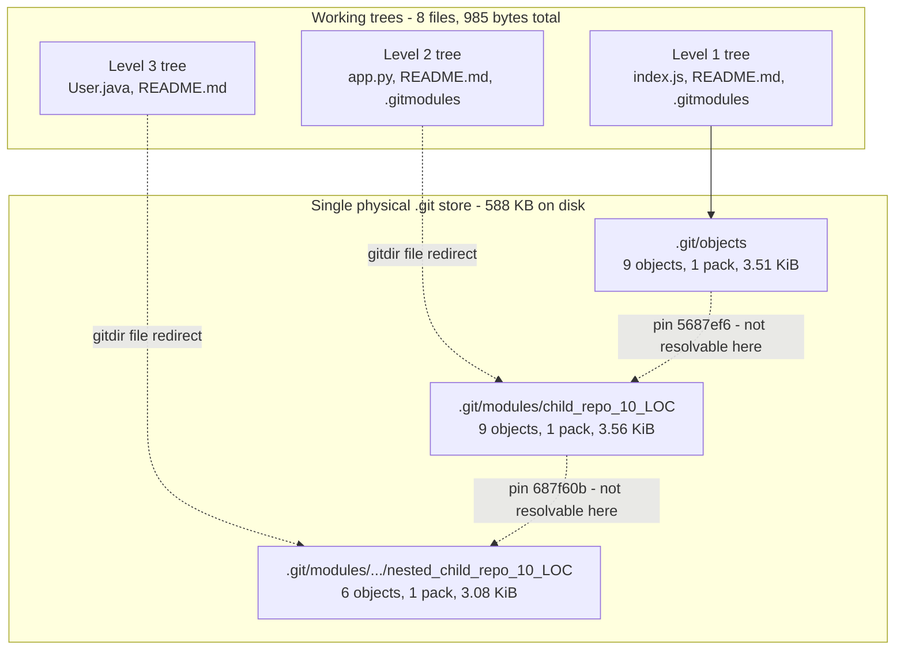
```mermaid
flowchart TD
    subgraph WT["Working trees - 8 files, 985 bytes total"]
        W1["Level 1 tree<br/>index.js, README.md, .gitmodules"]
        W2["Level 2 tree<br/>app.py, README.md, .gitmodules"]
        W3["Level 3 tree<br/>User.java, README.md"]
    end
    subgraph STORE["Single physical .git store - 588 KB on disk"]
        O1[".git/objects<br/>9 objects, 1 pack, 3.51 KiB"]
        O2[".git/modules/child_repo_10_LOC<br/>9 objects, 1 pack, 3.56 KiB"]
        O3[".git/modules/.../nested_child_repo_10_LOC<br/>6 objects, 1 pack, 3.08 KiB"]
    end
    W1 --> O1
    W2 -. "gitdir file redirect" .-> O2
    W3 -. "gitdir file redirect" .-> O3
    O1 -. "pin 5687ef6 - not resolvable here" .-> O2
    O2 -. "pin 687f60b - not resolvable here" .-> O3
```

#### 3.5.2.3 Stores Are Isolated, Not Shared

A gitlink is a *reference into a different object database*, not a stored object. This was verified directly: looking up the pinned commit `5687ef6c3fdbdf361df830fcd78a2dbdcdb2b80a` in the **parent's** object store fails with `could not get object info`, while the same lookup in the **child's** store resolves to a `commit`. The parent therefore records a pointer to content it does not itself hold.

This is the storage-level explanation for the resolution behaviour documented in 3.3.2.2: the composition must be fetched hop by hop because no single object database contains the full graph, and a superproject clone without submodule initialisation yields empty directories rather than partial content.

#### 3.5.2.4 Storage Efficiency Characteristics

The working-tree payload is **985 bytes across 8 files**, while the parent `.git` directory occupies **588 KB** on disk (of which `.git/objects` accounts for 24 KB and `.git/modules` for 392 KB). Repository metadata and Git scaffolding therefore exceed the payload by roughly **600×**. This is not a defect — it is the fixed overhead of three independent Git repositories — but it is the dominant storage characteristic of the system and worth recording plainly: the composition machinery, not the code, is what consumes storage.

### 3.5.3 Runtime State and Data Persistence Strategy

The persistence strategy is, precisely, **no persistence**. All state is in-process and discarded at exit:

| Component | Runtime state | Lifetime |
|---|---|---|
| `index.js` | `const result` holding the computed value, plus the two call arguments | Single process invocation |
| `child_repo_10_LOC/app.py` | Local `user` variable and the returned greeting string | Single process invocation (currently unreachable — see 3.1.4.2) |
| `.../User.java` | Method-local `String name` | Single process invocation (currently non-compilable — see 3.1.4.2) |

No component writes output anywhere other than standard output, and standard output is not redirected or captured by anything in the repository. Consequently there is no data lifecycle to manage: no schema, no retention policy, no archival tier, no data classification, and no personally identifiable or business data of any kind is stored or processed. There is likewise no transactional boundary, no consistency model, and no concurrency control, because there is no shared mutable state.

### 3.5.4 Caching

**No application-level cache exists.** The only two cache-like mechanisms observable in the system are properties of its tooling rather than design choices:

- **Git's pack files** serve as the compressed, content-addressed cache of repository history. As measured in 3.5.2.1, each level holds exactly one pack with no loose objects.
- **Node's in-process module cache** holds resolved modules for the lifetime of the process. After executing the entry point it contains exactly one entry — `index.js` itself — which is the same measurement that establishes the zero-dependency finding in 3.2.1.

Neither is configurable from the repository, and neither caches application data. The prompt's default stack does not nominate a caching layer, and none would have anything to cache here.

### 3.5.5 Durability, Backup, and Availability Posture

The durability surface is entirely delegated to Git and its remote, and it is small enough to enumerate exhaustively:

| Level | Local refs | Remote-tracking refs |
|---|---|---|
| Level 1 | `refs/heads/2807_01`, `refs/heads/main` | `origin/2807_01`, `origin/main`, `origin/HEAD` |
| Level 2 | `refs/heads/2807_01`, `refs/heads/main` | `origin/main`, `origin/HEAD` |
| Level 3 | `refs/heads/main` | `origin/main`, `origin/HEAD` |

Observations that follow directly from this:

- **The only replica is the `origin` remote.** No backup job, snapshot schedule, archival copy, or secondary remote is configured in the repository. Durability is whatever the hosting provider offers for the three repositories identified in 3.4.1.
- **The level-3 working tree is at a detached HEAD**, pinned to `687f60b`, which is the expected and correct state for a submodule checkout but means local work there would not be attached to a branch by default.
- **All three working trees are clean.** `git status --porcelain` returns empty at every level, so the on-disk state matches the stored objects exactly and no uncommitted data is at risk.
- **Recovery is a re-clone.** Because nothing is generated, cached, or written at runtime, restoring the system consists solely of re-running the acquisition workflow; there is no data restore step and no state to reconcile.


## 3.6 Development &amp; Deployment

**This system has no build system, no containerization, no infrastructure-as-code, and no CI/CD pipeline.** Development consists of editing three plain source files; "deployment" consists of cloning the composed checkout and invoking an interpreter directly. A consolidated probe of **47 filename patterns** and 7 directory names across all three repository levels matched **nothing** — every category of development and deployment tooling is absent. The subsections below record the toolchain a consumer must supply, the direct-interpretation execution model that stands in place of a build, and precisely what is missing.

### 3.6.1 Required Toolchain

Because no version is pinned anywhere (3.1.4.1), every consumer must supply their own toolchain. The table below states what each component *requires*, not what the repository declares — the repository declares nothing.

| Purpose | Tool required | Version requirement in evidence |
|---|---|---|
| Acquire the composed checkout | Git client with submodule support | None declared; functional requirements listed in 3.6.1.1 |
| Run `index.js` | Node.js (or another host providing the Console API) | ECMAScript 2015 syntax floor only |
| Run `child_repo_10_LOC/app.py` | CPython | 3.6 or later (f-string) |
| Build and run `.../User.java` | JDK (`javac` + `java`) | No level declared; Java 1.0-era syntax only |

The reference environment used to verify this specification provides `git 2.43.0`, `node v22.23.1`, `npm 11.18.0`, `python3 3.12.3`, `pip3 25.3`, and `gpg 2.4.4`. It does **not** provide `javac`, `java`, `mvn`, `gradle`, `docker`, `docker-compose`, `terraform`, `make`, or `gcc`. Two conclusions follow: the Java component cannot be built or executed in that environment at all, and the absence of `make`/`gcc` corroborates that no compiled or native build path exists anywhere in the system.

Note that `npm` and `pip` are present in the environment but are **never invoked** by this system — there is no manifest for either to act upon (3.3.1).

#### 3.6.1.1 Git Feature Requirements

Rather than assert a minimum Git version the repository does not declare, the functional capabilities that the observed layout actually depends on are enumerated below. A Git client must support all six:

1. `.gitmodules` submodule declarations carrying `path` and `url` keys.
2. Mode-`160000` gitlink tree entries (commit references stored inside a tree).
3. Recursive submodule initialisation via `git submodule update --init --recursive`.
4. `.git`-**file** gitdir indirection for submodule working trees, rather than an in-place `.git` directory.
5. Nested absorbed-gitdir storage at `.git/modules/<parent>/modules/<child>`.
6. The `submodule.<name>.active` configuration key, which is present in the apex repository's local configuration.

### 3.6.2 Build System — Verified Absence and the Direct-Interpretation Model

There is no build system. The probe in 3.6.4 confirms the absence of `Makefile`/`makefile`/`*.mk`, `gradlew`, `mvnw`, and any `*.sh`, `*.bat`, or `*.ps1` script, in addition to the build manifests already ruled out in 3.3.1. There is also no bundler, transpiler, minifier, or code-generation step — no `tsconfig.json` exists and no TypeScript, JSX, or other pre-processed source is present (the file-extension census in 3.1.1 is closed at `.js`, `.py`, `.java`, `.md`, and `.gitmodules`).

What replaces a build is **direct interpretation of source**, one command per component:

| Component | Invocation | Verified outcome |
|---|---|---|
| `index.js` | `node index.js` | Exit 0; five stdout lines, each `12`; empty stderr |
| `child_repo_10_LOC/app.py` | `python3 child_repo_10_LOC/app.py` | Exit 1; `IndentationError: unindent does not match any outer indentation level` at line 7 |
| `.../User.java` | `javac User.java` then `java User` | Exit 127 (`javac: command not found`) in the reference environment; the duplicate top-level `class User` remains a static determination (3.1.4.2) |

Because no artifact is produced, there is nothing to version, sign, publish, or promote. Consistent with 3.3.3, no tags exist at any level, so there is no release process either.

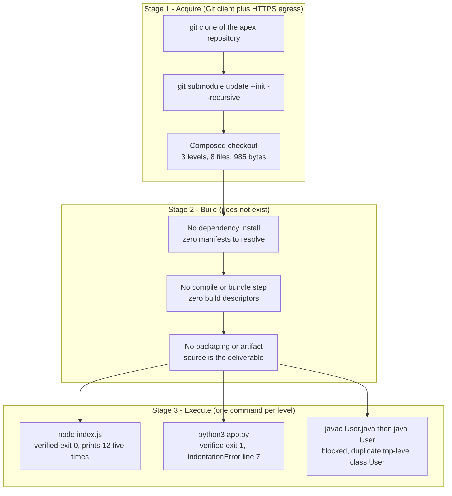
```mermaid
flowchart TD
    subgraph ACQ["Stage 1 - Acquire (Git client plus HTTPS egress)"]
        A1["git clone of the apex repository"]
        A2["git submodule update --init --recursive"]
        A3["Composed checkout<br/>3 levels, 8 files, 985 bytes"]
        A1 --> A2
        A2 --> A3
    end
    subgraph GAP["Stage 2 - Build (does not exist)"]
        G1["No dependency install<br/>zero manifests to resolve"]
        G2["No compile or bundle step<br/>zero build descriptors"]
        G3["No packaging or artifact<br/>source is the deliverable"]
    end
    subgraph RUN["Stage 3 - Execute (one command per level)"]
        R1["node index.js<br/>verified exit 0, prints 12 five times"]
        R2["python3 app.py<br/>verified exit 1, IndentationError line 7"]
        R3["javac User.java then java User<br/>blocked, duplicate top-level class User"]
    end
    A3 --> G1
    G1 --> G2
    G2 --> G3
    G3 --> R1
    G3 --> R2
    G3 --> R3
```

### 3.6.3 Acquisition Workflow Requirements

Acquisition is the only workflow with a genuine ordering constraint, and it must be driven **recursively from the apex repository**. The reasons were established in 3.3.2.3 and re-verified here:

- The apex repository's local configuration registers the level-2 submodule (`submodule.child_repo_10_LOC.active = true` plus its canonical HTTPS URL).
- The level-2 repository's local configuration contains **no** `submodule.*` entries at all, so it does not know its own submodule is meant to be active.
- The pinned commit is not present in the consuming repository's object store (3.5.2.3), so each hop requires its own network fetch.

Post-acquisition state, verified across all three levels: level 1 at `5ad746c` on branch `2807_01`, level 2 at `5687ef6` on branch `2807_01`, and level 3 at `687f60b` with a **detached HEAD**. All three working trees report a clean `git status --porcelain`.

The only environmental requirement for this workflow is outbound HTTPS reachability to the host identified in 3.4.1. No authentication is configured by the repository; credential provisioning is an out-of-band concern (3.4.4.1).

### 3.6.4 Verified Absence of Development and Deployment Infrastructure

A single consolidated probe tested **47 filename patterns** and 7 directory names recursively across all three repository levels with `.git` internals pruned. **Zero patterns matched.**

| Category | Patterns tested | Result |
|---|---|---|
| Containerization | `Dockerfile*`, `docker-compose*`, `compose.y*ml`, `.dockerignore` | Absent |
| Infrastructure as Code | `*.tf`, `*.tfvars`, `Pulumi.y*ml`, `cdk.json`, `Chart.y*ml`, `kustomization.y*ml`, `values.y*ml` | Absent |
| PaaS deployment descriptors | `Procfile`, `app.yaml`, `vercel.json`, `netlify.toml`, `serverless.y*ml` | Absent |
| CI/CD | `.github/`, `.circleci/`, `Jenkinsfile`, `.gitlab-ci.yml`, `azure-pipelines.yml`, `.travis.yml`, `appveyor.yml`, `.drone.yml`, and **any `*.yml` or `*.yaml` file anywhere** | Absent |
| Build / task runners | `Makefile`, `makefile`, `*.mk`, `gradlew*`, `mvnw*`, `*.sh`, `*.bat`, `*.ps1` | Absent |
| Test infrastructure | `jest.config.*`, `pytest.ini`, `conftest.py`, and `test/`, `tests/`, `spec/` directories | Absent |
| Linting / formatting / editor | `.eslintrc*`, `.prettierrc*`, `.pylintrc`, `.flake8`, `ruff.toml`, `checkstyle.xml`, `tox.ini`, `.editorconfig`, `.gitattributes`, `.gitignore`, `.vscode/`, `.idea/` | Absent |
| Governance | `LICENSE*`, `CONTRIBUTING*`, `CODEOWNERS` | Absent |

Specific consequences worth stating plainly:

- **No automated quality gate exists.** There is no test suite, no coverage measurement, no linter, no formatter, and no type checker. The only quality signals available are the interpreter-level checks demonstrated in 3.6.2 — which is precisely how the two defects in levels 2 and 3 were able to be committed and remain.
- **No `.gitignore` at any level.** Build or runtime artifacts (for example a `User.class` from a successful `javac`, or `__pycache__/` from a successful Python import) would appear as untracked files with nothing to exclude them.
- **No CI/CD platform integration.** The absence of a `.github` directory at every level means there is no GitHub Actions workflow and also no dependency-update automation such as Dependabot or Renovate (3.3.4.2).
- **No containerization or IaC.** The section prompt's default stack nominates Docker for containerization, Terraform for infrastructure as code, and GitHub Actions for CI/CD. None of the three is present in this repository, and none is part of this system's stack.
- **No license or contribution guidance.** Neither a `LICENSE` file nor a `CONTRIBUTING` guide nor a `CODEOWNERS` file exists at any level, so redistribution terms and review ownership are undefined by the repository.

### 3.6.5 Deployment Model and CI/CD Requirements

#### 3.6.5.1 Deployment Model in Evidence

Deployment is **source distribution by Git clone**. Nothing is compiled ahead of time, nothing is packaged, and nothing is published. There is no runtime configuration surface at all — no environment variables are read, no configuration file is loaded, and no command-line arguments are parsed (3.2.3, 3.4.2) — so there are no environments to differentiate and no promotion path between them. A "deployed" instance is indistinguishable from a developer's working copy.

This also means the deployment unit is unusually forgiving in one respect and unusually fragile in another. Forgiving: after acquisition the system requires no network access, no privileged operation, and no persistent storage (3.4.2, 3.5.3), so it can run in a minimal or air-gapped environment. Fragile: correctness depends entirely on the host toolchain the operator happens to provide, and nothing in the repository validates that assumption.

#### 3.6.5.2 What a Pipeline Would Have to Introduce

Since no CI/CD requirements are declared anywhere in the repository, none are asserted here. It is nevertheless useful to record what the observed gaps imply a pipeline would need to add, each tied to a specific finding above:

| Gap observed | What a pipeline would need to supply |
|---|---|
| No runtime pins (3.1.4.1) | Explicit runtime versions for Node.js, CPython, and a JDK, since the repository provides none |
| Recursive submodule requirement (3.6.3) | Checkout configured with recursive submodule initialisation; a non-recursive checkout yields empty submodule directories |
| No quality gate (3.6.4) | Syntax/compile verification per language — `node --check`, a Python compile step, and `javac` — which would have caught both existing defects |
| No JDK available (3.6.1) | A JDK provisioned in the execution image, otherwise level 3 remains unverifiable |
| Unsigned pinning commits (3.3.4.2) | Signature or provenance verification, plus the corresponding key distribution, if integrity of the pins is to be enforced |
| Manual cascading pin bumps (3.3.4.2) | Automation to propagate a level-3 change through level 2 into level 1, since each hop requires its own commit |


## 3.7 References

Every factual claim in Section 3 is grounded in one of the sources listed below. The repository's tracked inventory is closed at 8 files across 3 directories, so this list is exhaustive with respect to repository content.

### 3.7.1 Repository Files Examined

**Level 1 — `parent_repo_10_LOC` (apex repository)**

- `index.js` - Established the JavaScript component: `function add(a, b)` with `+` addition (lines 1–3), `const result` at line 5 as the sole post-ES5 construct fixing the ES2015 floor, and five `console.log(result)` calls (lines 6–10) as the Node.js host Console API surface. Validated with `node --check` (pass) and direct execution (exit 0, five `12` lines, empty stderr).
- `.gitmodules` - Established the level-1 → level-2 submodule declaration (`path = child_repo_10_LOC`, canonical HTTPS `url`), the Git INI configuration notation, and one of only two URL occurrences in the entire system.
- `README.md` - Established the Markdown documentation notation and its content limit: a single H1 heading (20 bytes, no trailing newline) with no setup, usage, or architecture content, and therefore no declared runtime, dependency, or build requirement.

**Level 2 — `child_repo_10_LOC`**

- `child_repo_10_LOC/app.py` - Established the Python component: the f-string at line 2 fixing the CPython 3.6 floor, `print(...)` at lines 6 and 9 as the Python builtin output surface, and the blocking defects — a duplicated, two-space-indented `__main__` guard at line 7 and a stray `///asdas` token at line 10. Validated with `python3 -m py_compile` and `ast.parse` (both report `IndentationError` at line 7); the `greet` logic itself verified correct in isolation.
- `child_repo_10_LOC/.gitmodules` - Established the level-2 → level-3 submodule declaration (`path = nested_child_repo_10_LOC`, canonical HTTPS `url`) and the second of the two URL occurrences in the system.
- `child_repo_10_LOC/README.md` - Established the second Markdown artifact (19 bytes, single heading, no trailing newline) and confirmed no documentation of dependencies or tooling exists at level 2.

**Level 3 — `nested_child_repo_10_LOC`**

- `child_repo_10_LOC/nested_child_repo_10_LOC/User.java` - Established the Java component: two top-level `public class User` declarations (lines 1 and 7) producing the duplicate-type conflict, `System.out.println(name)` at lines 4 and 10 as the `java.lang.System` output surface, absence of any `package` declaration or `import`, and the use of Java 1.0-era constructs only (no generics, `var`, records, lambdas, method references, annotations, interfaces, or enums).
- `child_repo_10_LOC/nested_child_repo_10_LOC/README.md` - Established the third Markdown artifact (26 bytes, single heading, no trailing newline) and the terminal level's lack of any build descriptor documentation.

### 3.7.2 Repository Folders Examined

- Repository root (level 1 working tree) - Contained exactly four first-order children: `index.js`, `.gitmodules`, `README.md`, and the `child_repo_10_LOC/` submodule working tree. Confirmed the absence of any root-level package, build, or dependency manifest, test directory, or CI configuration.
- `child_repo_10_LOC/` - Contained exactly four first-order children: `app.py`, `.gitmodules`, `README.md`, and the `nested_child_repo_10_LOC/` submodule working tree. Confirmed no build manifest, dependency manifest, test suite, or package metadata beyond the submodule declaration, and no internal or third-party dependencies.
- `child_repo_10_LOC/nested_child_repo_10_LOC/` - Contained exactly two children: `User.java` and `README.md`. Confirmed the terminal level of the composition — no further gitlink, no `pom.xml`, no `build.gradle`, and no package metadata.

The complete directory census is these three folders. No `src/`, `test/`, `tests/`, `spec/`, `docs/`, `config/`, `infra/`, `migrations/`, `data/`, `db/`, `storage/`, `node_modules/`, `vendor/`, `.github/`, `.circleci/`, `.vscode/`, or `.idea/` directory exists at any level.

### 3.7.3 Git Metadata Locations Cited

These are Git internal locations examined to establish the composition, version-identity, and storage findings. They are described as infrastructure, not documented as source files.

- `.gitmodules` files at levels 1 and 2, parsed canonically with `git config -f` - Supplied the token-free submodule `path`/`url` declarations used throughout 3.3 and 3.4.
- Level-1 and level-2 HEAD trees - Supplied the two mode-`160000` gitlink pins (`5687ef6c3fdbdf361df830fcd78a2dbdcdb2b80a` and `687f60b6c74818ac7cd14413840d73fdfb5fe450`) and confirmed both are current against the corresponding HEADs.
- `.git/modules/child_repo_10_LOC` and `.git/modules/child_repo_10_LOC/modules/nested_child_repo_10_LOC` - Established the absorbed-gitdir layout, the single physical `.git` store shared by three logical repositories, and the per-level on-disk sizes (388 KB and 188 KB).
- `child_repo_10_LOC/.git` and `child_repo_10_LOC/nested_child_repo_10_LOC/.git` (gitdir pointer files) - Established `.git`-file indirection as a required Git capability.
- Per-level object stores and pack statistics - Established the object census (3+3+3, 3+3+3, 2+2+2 blob/tree/commit), the pack figures (9/3.51 KiB, 9/3.56 KiB, 6/3.08 KiB), the zero loose/garbage/prune-packable state, and the proof that a pinned commit is unresolvable in the consuming store.
- Commit objects at all three HEADs and the full 8-commit graph - Established the signature findings: no `gpgsig` header on either gitlink-recording commit, `gpgsig` present on GitHub-web-interface commits, and `git verify-commit` exiting non-zero at all three levels.
- Local Git configuration and ref inventories per level - Established `submodule.child_repo_10_LOC.active = true` at level 1, the total absence of `submodule.*` entries at level 2, the absence of any signature/fsck/hook enforcement setting, the per-level branch and remote-tracking refs, and the level-3 detached HEAD.
- Repository tag lists at all three levels - All empty, establishing the commit-SHA-only version-identity model.

### 3.7.4 Cross-Referenced Specification Sections

- **1.2 System Overview** - Confirmed that the system integrates with exactly one external technology (Git), supplied the current-limitations table used to align the defect reporting in 3.1.4.2, and supplied the "scripts with zero abstraction, composed by Git" characterisation referenced in 3.2.5.
- **1.3 Scope** - Supplied the Workflow A (acquire) and Workflow B (execute) framing reused in 3.6, the integration row stating GitHub is reached outbound over HTTPS at clone/fetch time only, and the key technical requirements confirming no minimum runtime version is declared anywhere.
- **2.4 Implementation Considerations** - Supplied the cross-cutting positions honoured in Section 3: that runtime versions are undeclared so every consumer must supply its own toolchain (3.1.4.1, 3.6.1), that access control is delegated entirely to hosting-platform repository permissions (3.4.4.2), and that no signature verification or provenance attestation is configured (refined with direct evidence in 3.3.4.2).
- **1.1 Executive Summary, 1.4 References, 2.1 Feature Catalog, 2.2 Functional Requirements Table, 2.3 Feature Relationships, 2.5 Traceability Matrix, 2.6 References** - Supplied the feature identifiers (F-001 … F-007), the commit-based requirement baseline at `5ad746c` on branch `2807_01` reused in 3.3.3, and the terminology convention ("Level 1/2/3", "apex repository", "composed checkout", "gitlink", "pin") applied consistently throughout Section 3.

### 3.7.5 Web Sources

Used exclusively for external version context in 3.1.2; never to infer repository behaviour.

- [web] Node.js release documentation (`nodejs.org` releases / previous-releases pages) and the `endoflife.date` Node.js summary - Confirmed the six-month Current phase, promotion of even-numbered majors to Active LTS, the 30-month critical-bug support window, the project guidance to run only Active LTS or Maintenance LTS in production, and the annual-cadence change beginning with Node.js 27.
- [web] Node.js release announcements (24.x LTS and 26.0.0 Current) - Confirmed the current release-line landscape used to contextualise the reference environment's Node.js v22.23.1.
- [web] Java version and LTS timeline compilation citing OpenJDK and Oracle primary sources - Confirmed the LTS roster (8, 11, 17, 21, 25), the move to a two-year LTS cadence in September 2021, and Java 29 as the next planned LTS.

### 3.7.6 Exclusions Honoured

- **No `.blitzyignore` file exists.** A case-insensitive search over the entire checkout at all depths, and over nearby filesystem locations, returned zero matches, so no path exclusions applied to this section.
- **Agent tooling excluded.** The `/app/` directory reachable from the terminal contains the documentation agent's own source code and is deliberately excluded from this specification. Only the repository checkout and its two submodule working trees are documented.
- **Credentials excluded.** `git remote -v` output in a working environment embeds a temporary access-token credential. It has not been reproduced anywhere in Section 3; every URL cited comes exclusively from the two `.gitmodules` files. Personal email addresses observed in commit metadata are likewise not reproduced — only the generic `GitHub <noreply@github.com>` service identity is cited, in 3.3.4.2.
- **Template defaults excluded.** The "Default Technology Stack" enumerated in this section's authoring prompt (AWS, Docker, Terraform, GitHub Actions, Flask, Auth0, MongoDB, LangChain, React with TypeScript, TailwindCSS, React Native, Swift, Kotlin, Objective-C, Electron) is a template default, not evidence. None of those technologies is present in this repository, and Section 3 documents only what was directly observed.


# 4. Process Flowchart

## 4.1 System Workflows

This section documents the process flows that actually exist in `parent_repo_10_LOC` and its two nested submodules. The repository contains eight tracked files totalling 985 bytes across three directory levels (`index.js`, `README.md` and `.gitmodules` at level 1; `app.py`, `README.md` and `.gitmodules` in `child_repo_10_LOC`; `User.java` and `README.md` in `child_repo_10_LOC/nested_child_repo_10_LOC`), plus two mode-`160000` gitlink entries. A single recursive, case-insensitive scan of every tracked file for the vocabulary of conventional process infrastructure — `listen`, `server`, `route`, `endpoint`, `cron`, `schedule`, `queue`, `worker`, `job`, `batch`, `retry`, `timeout`, `transaction`, `rollback`, `cache`, `session`, `middleware`, `validate`, `try`, `catch`, `except`, `throw`, `raise`, `exit`, `signal`, `async`, `await`, `Promise`, `thread`, `lock` — returns **zero matches**. There is consequently no request/response cycle, no event loop consumer, no scheduled task and no application-level error handling to diagram.

Every workflow in this system therefore belongs to exactly one of two categories:

1. **Tool-level workflows** executed by the Git client on the operator's behalf, which acquire and compose the three-level checkout.
2. **Process-level workflows** executed by a language runtime against one source file, which begin at a shell invocation and end at a process exit status.

#### Workflow Catalog

| ID | Workflow | Trigger | Terminal outcome (verified) |
|----|----------|---------|------------------------------|
| W1 | Acquire and compose the checkout | Operator runs `git clone` then `git submodule update --init --recursive` | Three-level tree, 8 files, 985 bytes, exit 0 |
| W2 | Execute the JavaScript capability | Operator runs `node index.js` | `12` written to stdout five times, exit 0 |
| W3 | Execute the Python capability | Operator runs `python3 child_repo_10_LOC/app.py` | `IndentationError` at line 7, empty stdout, exit 1 |
| W4 | Build and run the Java capability | Operator runs `javac User.java` | `javac: command not found`, exit 127 in the reference environment |
| W5 | Advance a submodule pin | Maintainer commits a change at a lower level | Three commits and three pushes to propagate one change |
| W6 | Author and commit at any level | Maintainer edits a file and commits | Commit accepted unconditionally — no hook, test or CI gate exists |

W1 through W4 are detailed below. W5 is a composition-maintenance flow documented as a sequence diagram in section 4.4, and its underlying state machine appears in section 4.3.1; W6 is documented as part of the validation-checkpoint analysis in section 4.2.2.

### 4.1.1 Core Business Processes

#### 4.1.1.1 End-to-End System Workflow

The diagram below is the master flow. Lane A is the operator — the only actor in the system, always at a command line. Lane B is the Git client talking to `github.com`, which is the **first of only two places where the system boundary is crossed**, and it is crossed only at acquisition time. Lane C is the composed checkout on the local filesystem. Lane D contains the language runtimes, whose writes to stdout constitute the **second and only other boundary crossing**.

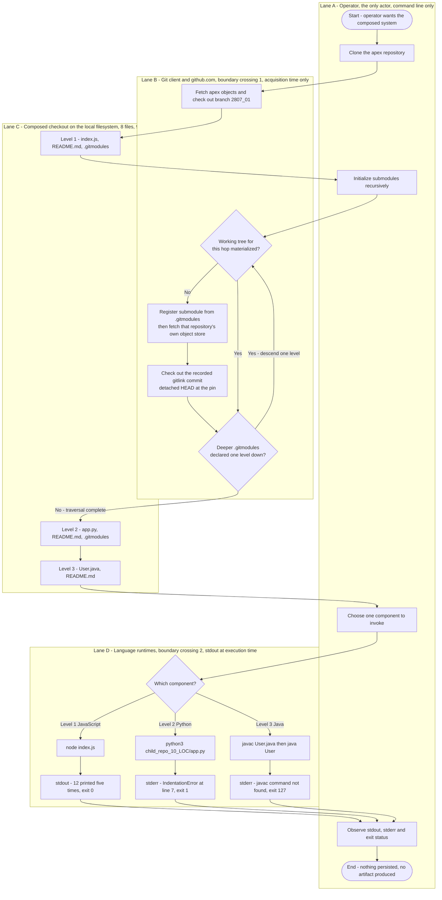
```mermaid
flowchart TD
    subgraph LANE_OP["Lane A - Operator, the only actor, command line only"]
        A1(["Start - operator wants the composed system"])
        A2["Clone the apex repository"]
        A3["Initialize submodules recursively"]
        A4["Choose one component to invoke"]
        A5["Observe stdout, stderr and exit status"]
        A6(["End - nothing persisted, no artifact produced"])
    end
    subgraph LANE_GIT["Lane B - Git client and github.com, boundary crossing 1, acquisition time only"]
        B1["Fetch apex objects and check out branch 2807_01"]
        B2{"Working tree for<br/>this hop materialized?"}
        B3["Register submodule from .gitmodules<br/>then fetch that repository's own object store"]
        B4["Check out the recorded gitlink commit<br/>detached HEAD at the pin"]
        B5{"Deeper .gitmodules<br/>declared one level down?"}
    end
    subgraph LANE_FS["Lane C - Composed checkout on the local filesystem, 8 files, 985 bytes"]
        C1["Level 1 - index.js, README.md, .gitmodules"]
        C2["Level 2 - app.py, README.md, .gitmodules"]
        C3["Level 3 - User.java, README.md"]
    end
    subgraph LANE_RT["Lane D - Language runtimes, boundary crossing 2, stdout at execution time"]
        D1A{"Which component?"}
        D2A["node index.js"]
        D3A["python3 child_repo_10_LOC/app.py"]
        D4A["javac User.java then java User"]
        D5A["stdout - 12 printed five times, exit 0"]
        D6A["stderr - IndentationError at line 7, exit 1"]
        D7A["stderr - javac command not found, exit 127"]
    end
    A1 --> A2 --> B1 --> C1
    C1 --> A3 --> B2
    B2 -->|"No"| B3 --> B4 --> B5
    B2 -->|"Yes"| B5
    B5 -->|"Yes - descend one level"| B2
    B5 -->|"No - traversal complete"| C2
    C2 --> C3 --> A4 --> D1A
    D1A -->|"Level 1 JavaScript"| D2A --> D5A
    D1A -->|"Level 2 Python"| D3A --> D6A
    D1A -->|"Level 3 Java"| D4A --> D7A
    D5A --> A5
    D6A --> A5
    D7A --> A5
    A5 --> A6
```

Three structural properties of this flow are worth stating explicitly, because each is verified and each constrains everything that follows:

- **The two lanes never interact.** Git is invoked by the operator, never by the code; no source file reads, writes or shells out to anything. The acquisition lane runs to completion before the execution lane starts, and nothing in the execution lane can trigger the acquisition lane.
- **Only one of the three components produces output.** `node index.js` is the sole invocation observed to exit 0.
- **The flow terminates with no residue.** After the runs, `git status --porcelain` reports zero lines at all three levels and no `.class`, `__pycache__` or `.pyc` artefact exists anywhere in the tree.

#### 4.1.1.2 Workflow W1 — Acquire and Compose the Checkout

W1 is the only multi-step workflow in the system and the only one with more than one success outcome. Its critical decision is the recursion flag: without it the operator receives a *usable but incomplete* system, which is a legitimate end state rather than an error.

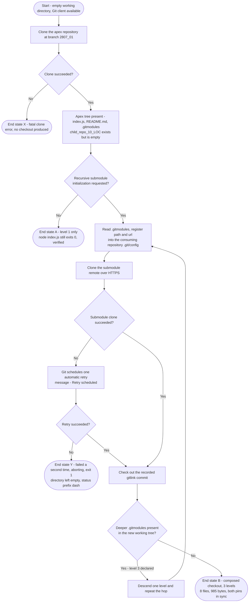
```mermaid
flowchart TD
    S(["Start - empty working directory, Git client available"])
    P1["Clone the apex repository at branch 2807_01"]
    Q1{"Clone succeeded?"}
    E1(["End state X - fatal clone error, no checkout produced"])
    P2["Apex tree present - index.js, README.md, .gitmodules<br/>child_repo_10_LOC exists but is empty"]
    Q2{"Recursive submodule<br/>initialization requested?"}
    T1(["End state A - level 1 only<br/>node index.js still exits 0, verified"])
    P3["Read .gitmodules, register path and url<br/>into the consuming repository .git/config"]
    P4["Clone the submodule remote over HTTPS"]
    Q3{"Submodule clone succeeded?"}
    R1["Git schedules one automatic retry<br/>message - Retry scheduled"]
    Q4{"Retry succeeded?"}
    E2(["End state Y - failed a second time, aborting, exit 1<br/>directory left empty, status prefix dash"])
    P5["Check out the recorded gitlink commit"]
    Q5{"Deeper .gitmodules present<br/>in the new working tree?"}
    P6["Descend one level and repeat the hop"]
    T2(["End state B - composed checkout, 3 levels<br/>8 files, 985 bytes, both pins in sync"])
    S --> P1 --> Q1
    Q1 -->|"No"| E1
    Q1 -->|"Yes"| P2 --> Q2
    Q2 -->|"No"| T1
    Q2 -->|"Yes"| P3 --> P4 --> Q3
    Q3 -->|"No"| R1 --> Q4
    Q4 -->|"No"| E2
    Q4 -->|"Yes"| P5
    Q3 -->|"Yes"| P5
    P5 --> Q5
    Q5 -->|"Yes - level 3 declared"| P6 --> P3
    Q5 -->|"No"| T2
```

The step-by-step behaviour of each hop, as observed in a disposable reproduction of the acquisition:

| Step | Observed effect | Evidence |
|------|-----------------|----------|
| Non-recursive clone | `child_repo_10_LOC` created but contains **0 entries**; status line is `-5687ef6c… child_repo_10_LOC` | Reproduced clone of the apex without `--recurse-submodules` |
| Register hop | `submodule.<name>.active=true` and `submodule.<name>.url` written to the consuming `.git/config`, echoed as `registered for path` | `git config --local --get-regexp '^submodule\.'` before and after |
| Fetch and check out | Pinned commit fetched into the submodule's *own* object store, then checked out at a detached HEAD | `git submodule status` prefix changes from `-` to a space |
| Recurse | Level 3 is materialized only when recursion is requested; a non-recursive `--init` leaves the nested directory with 0 entries and its status prefix at `-` | Second hop measured at 301 ms when run separately |

Two behaviours of this workflow are counter-intuitive and must be understood by anyone operating it:

- **The order is fixed and must start at the apex.** Each pinned commit exists only in the *pinned* repository's object store, never in the consumer's. The apex store cannot resolve `5687ef6c…` and the level-2 store cannot resolve `687f60b6…`, confirmed with `git cat-file -e` against each store. There is no manifest that can be resolved in one step; the traversal is inherently hop-by-hop.
- **A missing registration produces silence, not an error.** With the nested entry absent from the level-2 `.git/config`, running `git submodule update` from inside `child_repo_10_LOC` exits **0 with no output and no effect** — the submodule stays uninitialized. This is the single most likely way for an operator to conclude, incorrectly, that the composition succeeded.

#### 4.1.1.3 Workflow W2 — Execute the JavaScript Capability

This is the only workflow that reaches a functioning end state. `index.js` is a self-contained CommonJS script with no `require` and no `module.exports`; loading it produces a module graph of exactly one entry, so the file *is* the entire program.

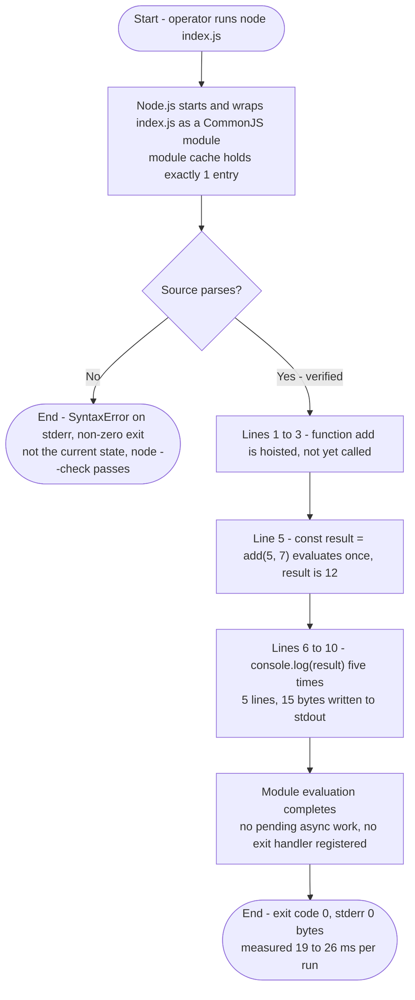
```mermaid
flowchart TD
    JS0(["Start - operator runs node index.js"])
    JS1["Node.js starts and wraps index.js as a CommonJS module<br/>module cache holds exactly 1 entry"]
    JS2{"Source parses?"}
    JSE(["End - SyntaxError on stderr, non-zero exit<br/>not the current state, node --check passes"])
    JS3["Lines 1 to 3 - function add is hoisted, not yet called"]
    JS4["Line 5 - const result = add(5, 7) evaluates once, result is 12"]
    JS5["Lines 6 to 10 - console.log(result) five times<br/>5 lines, 15 bytes written to stdout"]
    JS6["Module evaluation completes<br/>no pending async work, no exit handler registered"]
    JS7(["End - exit code 0, stderr 0 bytes<br/>measured 19 to 26 ms per run"])
    JS0 --> JS1 --> JS2
    JS2 -->|"No"| JSE
    JS2 -->|"Yes - verified"| JS3 --> JS4 --> JS5 --> JS6 --> JS7
```

The arithmetic is performed exactly once — `const result = add(5, 7)` at line 5 — and the resulting value is emitted five times from lines 6 through 10. The output is therefore five identical lines totalling 15 bytes, with `sort -u` collapsing them to the single value `12`, and stderr is 0 bytes. This is the concrete execution mechanics behind the compute-then-emit dependency recorded between features F-001 and F-002 in section 2.3.1.

#### 4.1.1.4 Workflow W3 — Execute the Python Capability

W3 fails deterministically before any statement runs. `app.py` declares `greet(name)` on lines 1–2, opens a `__main__` guard at column 0 on line 4, and then opens a **second** `__main__` guard on line 7 indented by two spaces, which matches no enclosing block.

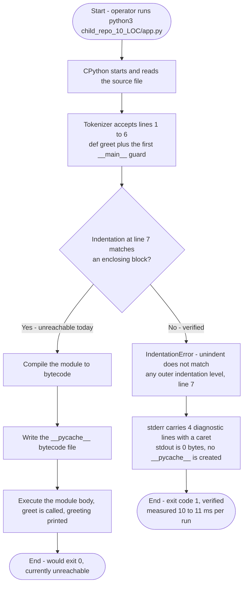
```mermaid
flowchart TD
    PY0(["Start - operator runs python3 child_repo_10_LOC/app.py"])
    PY1["CPython starts and reads the source file"]
    PY2["Tokenizer accepts lines 1 to 6<br/>def greet plus the first __main__ guard"]
    PY3{"Indentation at line 7 matches<br/>an enclosing block?"}
    PY4["Compile the module to bytecode"]
    PY5["Write the __pycache__ bytecode file"]
    PY6["Execute the module body, greet is called, greeting printed"]
    PY7(["End - would exit 0, currently unreachable"])
    PYE1["IndentationError - unindent does not match<br/>any outer indentation level, line 7"]
    PYE2["stderr carries 4 diagnostic lines with a caret<br/>stdout is 0 bytes, no __pycache__ is created"]
    PYE3(["End - exit code 1, verified<br/>measured 10 to 11 ms per run"])
    PY0 --> PY1 --> PY2 --> PY3
    PY3 -->|"Yes - unreachable today"| PY4 --> PY5 --> PY6 --> PY7
    PY3 -->|"No - verified"| PYE1 --> PYE2 --> PYE3
```

The failure is at parse time, which has three consequences that a reader of the source alone would not predict: stdout receives **0 bytes** (the first `print` never executes even though it precedes the defect in file order), no `__pycache__` directory is created (so the only bytecode-persistence point in the entire system is never reached), and the exit status is `1`. Running `python3 -m py_compile` on the same file reproduces the identical diagnostic, confirming the defect is purely static.

#### 4.1.1.5 Workflow W4 — Build and Run the Java Capability

W4 has two independent blocking gates, and in the reference environment the first gate is reached first.

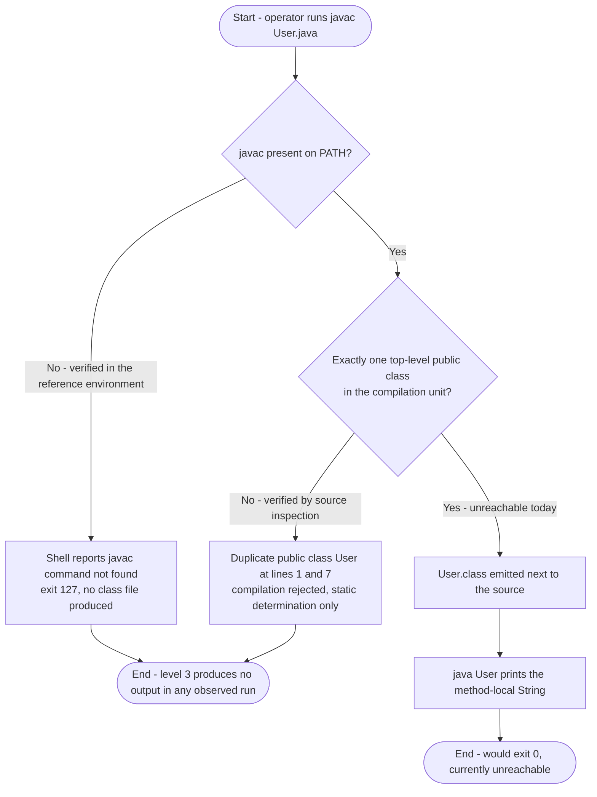
```mermaid
flowchart TD
    JV0(["Start - operator runs javac User.java"])
    JV1{"javac present on PATH?"}
    JVE1["Shell reports javac command not found<br/>exit 127, no class file produced"]
    JV2{"Exactly one top-level public class<br/>in the compilation unit?"}
    JVE2["Duplicate public class User at lines 1 and 7<br/>compilation rejected, static determination only"]
    JV3["User.class emitted next to the source"]
    JV4["java User prints the method-local String"]
    JV5(["End - would exit 0, currently unreachable"])
    JVE3(["End - level 3 produces no output in any observed run"])
    JV0 --> JV1
    JV1 -->|"No - verified in the reference environment"| JVE1 --> JVE3
    JV1 -->|"Yes"| JV2
    JV2 -->|"No - verified by source inspection"| JVE2 --> JVE3
    JV2 -->|"Yes - unreachable today"| JV3 --> JV4 --> JV5
```

`javac`, `java` and `jshell` are all absent from the reference environment, so the invocation terminates at the shell with exit status `127` and no class file. The second gate is a property of the source itself: `User.java` declares `public class User` twice at top level, at lines 1 and 7, each with its own `main` method printing a method-local `String`. Even with a JDK installed, a single compilation unit cannot contain two same-named top-level classes, so this gate would also block. The second gate is a static determination from the source, not an observed compiler message, because no compiler was available to produce one.

#### 4.1.1.6 Consolidated Decision Points

| Decision | Where it occurs | Branch outcomes |
|----------|-----------------|-----------------|
| Recursion requested? | W1, immediately after the apex clone | Yes → full three-level tree; No → level 1 only, still runnable |
| Submodule clone succeeded? | W1, once per hop | Yes → check out pin; No → one automatic retry, then abort with exit 1 |
| Entry registered in config? | W1, once per hop | Yes → fetch; No with init → register then fetch; No without init → silent skip, exit 0 |
| Deeper `.gitmodules` present? | W1, after each successful hop | Yes → descend; No → traversal complete |
| Source parses? | W2 and W3, before any statement executes | Pass → statements run (level 1); Fail → exit 1 with empty stdout (level 2) |
| Toolchain present on PATH? | W4, before compilation | Present → compile attempt; Absent → exit 127 (observed) |
| Single top-level public class? | W4, at compile time | One → class file; Two → rejected (level 3, static determination) |

#### 4.1.1.7 Error Handling Paths and User Touchpoints

Error handling in this system is entirely external to the codebase. No source file contains a `try`, `catch`, `except`, `raise`, `throw` or `finally` construct, and none registers a signal handler, `atexit` hook or shutdown hook. Every error path therefore terminates in a runtime- or shell-generated diagnostic on stderr plus a process exit status, and every recovery action is performed manually by the operator. The complete failure taxonomy and its recovery procedures are documented in section 4.3.2.

There are exactly four user touchpoints in the entire system, all of them at a command line:

| Touchpoint | Operator action | System response |
|------------|-----------------|-----------------|
| Acquisition | `git clone` plus recursive submodule initialization | Progress lines from Git; exit 0 or a fatal diagnostic |
| Execution | Invoke one runtime against one source file | stdout text and/or stderr diagnostic, plus exit status |
| Inspection | Read the source files and the three `README.md` files | 30 non-blank lines of source; each README is a single title line |
| Composition maintenance | Stage and commit a moved gitlink pin | New commit accepted with no gate (see section 4.2.2) |

No interactive interface, no API and no scheduled or event-driven trigger exists anywhere in the codebase. None of the three programs reads `process.argv`, `process.env`, `sys.argv`, `os.environ`, `System.in`, `Scanner`, stdin or any file, so no touchpoint can supply an input value: the constants `5`, `7`, `"Lakshya"`, `"asdasdafsad"`, `"Test"` and `"asdsadasda"` are the complete input space of the system and can only be changed by editing source.

### 4.1.2 Integration Workflows

The only integration in this system is the Git submodule composition that binds three separately hosted repositories into one checkout. It is a **build-time (more precisely, acquisition-time) integration**: it is exercised entirely by the Git client before any code runs, and it has no runtime counterpart. Section 2.3.1 records that there is no runtime coupling between the three levels, and the execution evidence confirms it — `index.js` loads a module graph of one file and never references the lower levels.

#### 4.1.2.1 Data Flow Between the Three Repositories

Each level contributes two pieces of integration data: a `.gitmodules` declaration naming a path and an HTTPS URL, and a mode-`160000` tree entry recording the exact commit to check out at that path. The data flows in one direction only — declaration and pin travel down from the consumer, objects travel back up from the pinned repository.

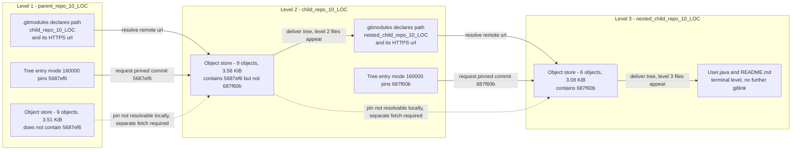
```mermaid
flowchart LR
    subgraph APEX["Level 1 - parent_repo_10_LOC"]
        A_DECL[".gitmodules declares path child_repo_10_LOC<br/>and its HTTPS url"]
        A_LINK["Tree entry mode 160000 pins 5687ef6"]
        A_STORE["Object store - 9 objects, 3.51 KiB<br/>does not contain 5687ef6"]
    end
    subgraph MID["Level 2 - child_repo_10_LOC"]
        B_DECL[".gitmodules declares path nested_child_repo_10_LOC<br/>and its HTTPS url"]
        B_LINK["Tree entry mode 160000 pins 687f60b"]
        B_STORE["Object store - 9 objects, 3.56 KiB<br/>contains 5687ef6 but not 687f60b"]
    end
    subgraph LEAF["Level 3 - nested_child_repo_10_LOC"]
        C_STORE["Object store - 6 objects, 3.08 KiB<br/>contains 687f60b"]
        C_FILES["User.java and README.md<br/>terminal level, no further gitlink"]
    end
    A_DECL -->|"resolve remote url"| B_STORE
    A_LINK -->|"request pinned commit 5687ef6"| B_STORE
    B_STORE -->|"deliver tree, level 2 files appear"| B_DECL
    B_DECL -->|"resolve remote url"| C_STORE
    B_LINK -->|"request pinned commit 687f60b"| C_STORE
    C_STORE -->|"deliver tree, level 3 files appear"| C_FILES
    A_STORE -.->|"pin not resolvable locally, separate fetch required"| B_STORE
    B_STORE -.->|"pin not resolvable locally, separate fetch required"| C_STORE
```

The dotted edges carry the key operational constraint: each object store holds only its own history. The apex pack (9 objects, 3.51 KiB) cannot resolve the commit it pins, and the level-2 pack (9 objects, 3.56 KiB) cannot resolve the commit *it* pins; only the level-3 pack (6 objects, 3.08 KiB) contains `687f60b6…`. Every hop therefore requires its own network exchange, which is why acquisition cannot be flattened into a single fetch.

#### 4.1.2.2 Acquisition Sequence, Hop by Hop

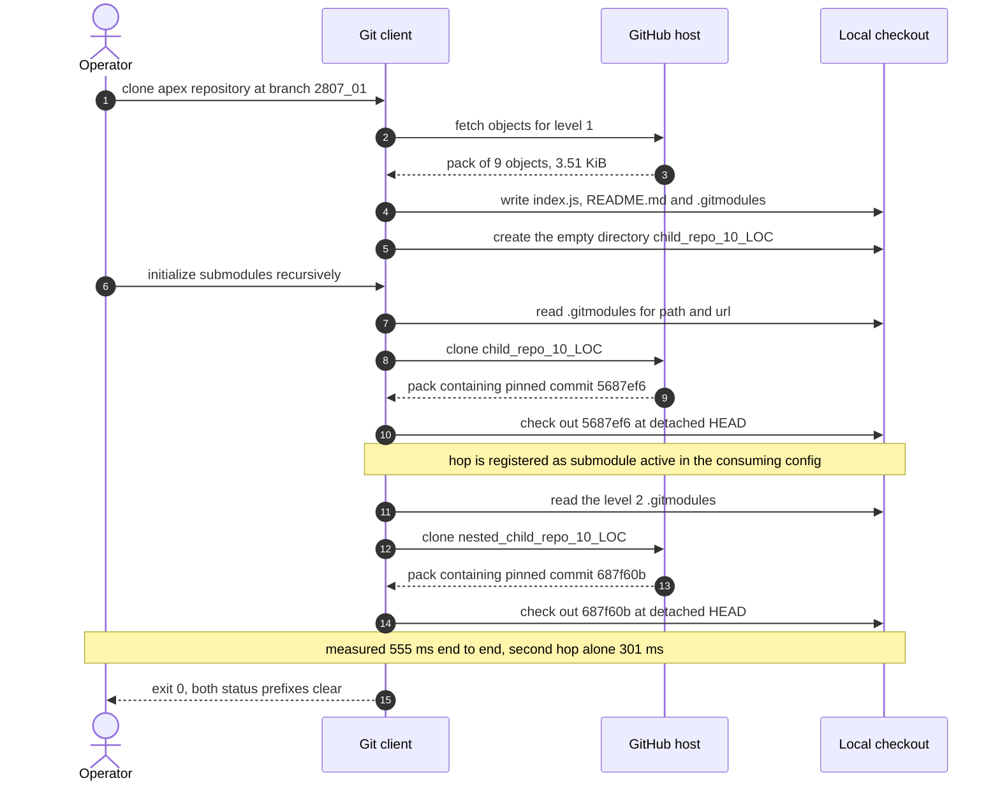
```mermaid
sequenceDiagram
    autonumber
    actor OP as Operator
    participant GIT as Git client
    participant GH as GitHub host
    participant FS as Local checkout
    OP->>GIT: clone apex repository at branch 2807_01
    GIT->>GH: fetch objects for level 1
    GH-->>GIT: pack of 9 objects, 3.51 KiB
    GIT->>FS: write index.js, README.md and .gitmodules
    GIT->>FS: create the empty directory child_repo_10_LOC
    OP->>GIT: initialize submodules recursively
    GIT->>FS: read .gitmodules for path and url
    GIT->>GH: clone child_repo_10_LOC
    GH-->>GIT: pack containing pinned commit 5687ef6
    GIT->>FS: check out 5687ef6 at detached HEAD
    Note over GIT,FS: hop is registered as submodule active in the consuming config
    GIT->>FS: read the level 2 .gitmodules
    GIT->>GH: clone nested_child_repo_10_LOC
    GH-->>GIT: pack containing pinned commit 687f60b
    GIT->>FS: check out 687f60b at detached HEAD
    Note over OP,FS: measured 555 ms end to end, second hop alone 301 ms
    GIT-->>OP: exit 0, both status prefixes clear
```

After the sequence completes, level 1 sits on branch `2807_01` at commit `5ad746c`, level 2 sits on `2807_01` at the pinned commit `5687ef6`, and level 3 sits at a **detached HEAD** on `687f60b` — the state expected of a submodule checked out to a recorded pin rather than to a branch tip. Both remotes are readable without authentication, verified by completing a full recursive acquisition with terminal credential prompting disabled.

#### 4.1.2.3 Recursive Traversal — the Only Batch Sequence

The system has no batch scheduler and no batch job. The nearest analogue to a batch sequence is Git's own recursive traversal of the submodule set, which processes a list of declared entries level by level until no deeper declaration remains.

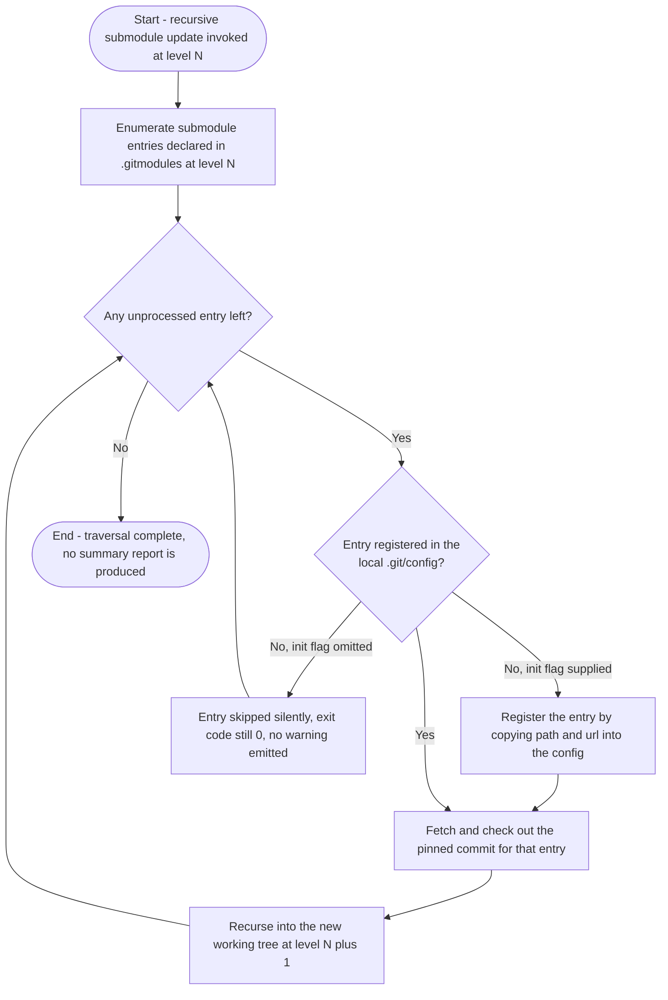
```mermaid
flowchart TD
    BS(["Start - recursive submodule update invoked at level N"])
    B1["Enumerate submodule entries declared in .gitmodules at level N"]
    B2{"Any unprocessed entry left?"}
    B3{"Entry registered in the<br/>local .git/config?"}
    B4["Register the entry by copying path and url into the config"]
    B5["Fetch and check out the pinned commit for that entry"]
    B6["Recurse into the new working tree at level N plus 1"]
    B7["Entry skipped silently, exit code still 0, no warning emitted"]
    BEND(["End - traversal complete, no summary report is produced"])
    BS --> B1 --> B2
    B2 -->|"No"| BEND
    B2 -->|"Yes"| B3
    B3 -->|"No, init flag supplied"| B4 --> B5
    B3 -->|"No, init flag omitted"| B7 --> B2
    B3 -->|"Yes"| B5
    B5 --> B6 --> B2
```

In this repository the "batch" is one entry per level, so the traversal is a two-hop chain rather than a fan-out. The `B7` branch is the silent no-op confirmed by experiment: an unregistered entry combined with an omitted init flag yields exit 0, no output and no change of state.

#### 4.1.2.4 API Interactions, Event Processing and Verified Absences

| Integration category | Status in this repository | Basis |
|----------------------|---------------------------|-------|
| Git transport over HTTPS to `github.com` | **Present** — the only network integration; two remotes declared in the two `.gitmodules` files | `.gitmodules` at levels 1 and 2 |
| Application API calls (REST, RPC, GraphQL, SDK) | **Absent** — no HTTP client, no socket, no import of any networking library | Zero matches for the network/server vocabulary scan; module graph of one file |
| Event processing (broker, subscriber, callback, webhook) | **Absent** — no listener, no handler registration, no asynchronous construct anywhere | Zero matches for `async`, `await`, `Promise`, `queue`, `signal` |
| Scheduled or batch jobs | **Absent** — no cron entry, no scheduler config, no job definition, no CI workflow | Zero matches for `cron`, `schedule`, `batch`, `worker`; no CI configuration in the tree |
| Inter-process communication between levels | **Absent** — the three programs never invoke or reference one another | Level-1 module graph is one entry; no imports at any level |
| Package-registry integration (npm, PyPI, Maven) | **Absent** — no manifest or lock file at any level | No `package.json`, `requirements.txt`, `pom.xml` or `build.gradle` in the tree |

The practical consequence is that the "integration surface" of this system is exactly two `.gitmodules` files and two gitlink entries, exercised exactly twice per acquisition, by a tool the operator invokes by hand.

## 4.2 Flowchart Requirements

This section states, workflow by workflow, the flowchart elements required by the specification — start and end points, process steps, decision diamonds, system boundaries, user touchpoints, error states and recovery paths — followed by the validation rules that apply at each step and the timing facts that were actually measured. Where a required element does not exist in this system, that absence is recorded explicitly rather than filled with a plausible substitute.

### 4.2.1 Workflow Element Inventory

#### 4.2.1.1 Start and End Points

| Workflow | Start point | End points and exit status |
|----------|-------------|----------------------------|
| W1 Acquire and compose | Operator issues `git clone` in an empty directory | **B** composed 3-level checkout, exit 0; **A** level-1-only checkout, exit 0; **Y** submodule clone failed twice, exit 1; **X** apex clone failed, no checkout |
| W2 Execute JavaScript | Operator issues `node index.js` | Five lines of `12` on stdout, exit 0 |
| W3 Execute Python | Operator issues `python3 child_repo_10_LOC/app.py` | `IndentationError` on stderr, empty stdout, exit 1 |
| W4 Build Java | Operator issues `javac User.java` | `javac: command not found`, exit 127 (reference environment); duplicate-class rejection if a JDK were present |
| W5 Advance a pin | Maintainer commits inside a submodule | Three commits and three pushes; consumer pins updated; exit 0 at each step |
| W6 Author and commit | Maintainer edits a tracked file | Commit object written unconditionally, exit 0 |

Every start point is a shell command typed by a human, and every end point is a process exit status. No workflow starts from a timer, a message, an HTTP request or another program.

#### 4.2.1.2 Process Steps and Decision Diamonds

| Workflow | Process steps | Decision diamonds |
|----------|---------------|-------------------|
| W1 | Clone apex → materialize level 1 → per hop: register, fetch, check out pin → recurse | 5 — clone succeeded, recursion requested, entry registered, clone succeeded per hop, deeper declaration present |
| W2 | Wrap module → parse → hoist `add` → evaluate line 5 once → five stdout writes → end evaluation | 1 — source parses |
| W3 | Start CPython → read source → tokenize lines 1–6 → reject line 7 | 1 — line-7 indentation matches an enclosing block |
| W4 | Resolve `javac` → (compile) → (run `java User`) | 2 — toolchain on PATH, exactly one top-level public class |
| W5 | Commit at level 3 → stage and commit gitlink at level 2 → stage and commit gitlink at apex | 0 — the sequence is unconditional once started |
| W6 | Edit → `git add` → `git commit` | 0 — no hook, test or policy check intervenes |

#### 4.2.1.3 System Boundaries and User Touchpoints

| Boundary | Crossed by | When | Data that crosses |
|----------|-----------|------|-------------------|
| Local filesystem ↔ `github.com` over HTTPS | Git client | Acquisition and push only (W1, W5) | Packfiles of 9, 9 and 6 objects; refs; the two pinned commit ids |
| Process ↔ terminal (stdout / stderr) | Node.js, CPython, the shell | Execution only (W2, W3, W4) | 15 bytes of stdout for W2; diagnostic text for W3 and W4 |
| Operator ↔ shell | Human | Every workflow | Command line only — no argument, environment variable or stdin value is read by any program |
| Repository ↔ repository (levels 1, 2, 3) | Git client via gitlink pins | Acquisition and pin advancement | Commit ids `5687ef6…` and `687f60b…`; no runtime data path exists |

Everything else that a conventional deployment would place at a boundary — a listening port, an IPC channel, a message broker, a shared database, a log sink — is absent. Section 1.3.1.5.1 records the same two-crossing boundary model, and the execution evidence in section 4.1 confirms it: the level-1 module graph contains exactly one file and no program performs any I/O other than writing to a standard stream.

#### 4.2.1.4 Error States and Recovery Paths

| Error state | Observable signal | Recovery path | Automated? |
|-------------|-------------------|---------------|------------|
| Apex clone fails | `fatal:` diagnostic, no directory created | Operator corrects the URL or network access and retries | No |
| Submodule clone fails | `Failed to clone … Retry scheduled`, then `Failed to clone … a second time, aborting`, exit 1 | Git retries once automatically; then the operator corrects the URL or credentials and re-runs | One retry only, performed by Git |
| Submodule left uninitialized | `git submodule status` prefix `-`, empty directory | Operator runs the recursive update with the init flag | No |
| Unregistered entry skipped | **No signal at all** — exit 0, no output, no change | Operator runs the update from the apex with the init flag so the entry is registered | No |
| Pin mismatch | Status prefix `+`; consumer reports `modified: <path> (new commits…)` | Operator re-runs the recursive update to restore the pin, or commits the new pin | No |
| Dirty content inside a submodule | Status prefix unchanged; consumer reports `modified: <path> (modified content)` | Operator discards the edit inside the submodule, or commits it there | No |
| Python parse failure | Four-line `IndentationError` on stderr, exit 1 | Operator edits `app.py` — the second `__main__` guard at line 7 must be removed or re-indented | No |
| Java toolchain absent | `javac: command not found`, exit 127 | Operator installs a JDK; the repository declares no required version | No |
| Java duplicate class | Compiler rejection (static determination) | Operator removes one of the two `public class User` declarations at lines 1 and 7 | No |

No error state in this table is detected, reported or repaired by code belonging to the repository. Every signal is produced by Git, a language runtime or the shell, and every recovery action except Git's single clone retry is manual.

### 4.2.2 Validation Rules

#### 4.2.2.1 Checkpoint Gates

The diagram below traces a change or an invocation through every checkpoint that exists, in the order encountered, and marks the checkpoints that a conventional system would have but this one does not.

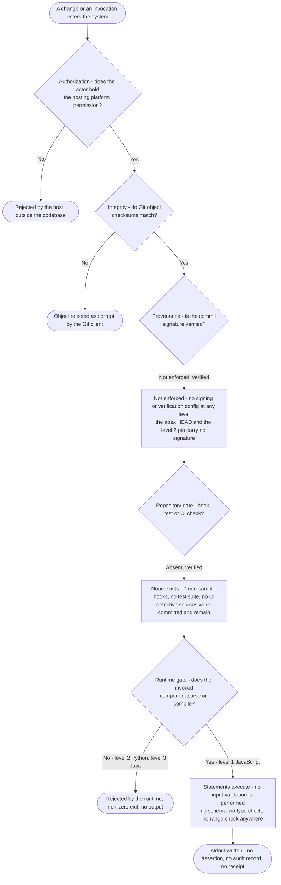
```mermaid
flowchart TD
    V0(["A change or an invocation enters the system"])
    V1{"Authorization - does the actor hold<br/>the hosting platform permission?"}
    V1E(["Rejected by the host, outside the codebase"])
    V2{"Integrity - do Git object<br/>checksums match?"}
    V2E(["Object rejected as corrupt by the Git client"])
    V3{"Provenance - is the commit<br/>signature verified?"}
    V3N["Not enforced - no signing or verification config at any level<br/>the apex HEAD and the level 2 pin carry no signature"]
    V4{"Repository gate - hook, test or CI check?"}
    V4N["None exists - 0 non-sample hooks, no test suite, no CI<br/>defective sources were committed and remain"]
    V5{"Runtime gate - does the invoked<br/>component parse or compile?"}
    V5E(["Rejected by the runtime, non-zero exit, no output"])
    V6["Statements execute - no input validation is performed<br/>no schema, no type check, no range check anywhere"]
    V7(["stdout written - no assertion, no audit record, no receipt"])
    V0 --> V1
    V1 -->|"No"| V1E
    V1 -->|"Yes"| V2
    V2 -->|"No"| V2E
    V2 -->|"Yes"| V3
    V3 -->|"Not enforced, verified"| V3N --> V4
    V4 -->|"Absent, verified"| V4N --> V5
    V5 -->|"No - level 2 Python, level 3 Java"| V5E
    V5 -->|"Yes - level 1 JavaScript"| V6 --> V7
```

#### 4.2.2.2 Business Rules in Effect at Each Step

The repository encodes no domain rules. The rules that genuinely govern its workflows are structural rules imposed by Git and by the language runtimes:

| Step | Rule in effect | Consequence of violation |
|------|----------------|--------------------------|
| Register a hop (W1) | The entry must exist in the consuming `.gitmodules` with both `path` and `url` | The hop cannot be registered; nothing is fetched |
| Fetch a hop (W1) | The pinned commit must be reachable in the **pinned** repository's own store, never the consumer's | Checkout fails; verified that neither consumer store contains the commit it pins |
| Update a hop (W1) | The entry must be present in the local `.git/config`, or the init flag must be supplied | Silent no-op with exit 0 — the most dangerous rule in the system |
| Check out a hop (W1) | The submodule is checked out at the recorded commit, at a detached HEAD | Level 3 is expected to be detached; a branch checkout there would drift from the pin |
| Advance a pin (W5) | The gitlink must be staged and committed in the consumer; changing the submodule alone is not enough | Consumer keeps the old pin; other clones never see the change |
| Execute level 1 (W2) | The whole file must parse before any statement runs | No output at all, not partial output |
| Execute level 2 (W3) | Every indentation level must match an enclosing block | Parse-time rejection; the `print` on line 6 never runs |
| Compile level 3 (W4) | A compilation unit may declare only one top-level class of a given name | Compilation rejected; `User.java` declares `User` twice |

#### 4.2.2.3 Data Validation Requirements

There is no data validation anywhere in the repository, and there is nothing to validate: all inputs are source literals. The complete input space is six values —

| Level | Literal inputs | Validation applied |
|-------|----------------|--------------------|
| 1 (`index.js`) | `5` and `7`, passed to `add(a, b)` | None — no type guard, no range check; the body is a bare `a + b` |
| 2 (`app.py`) | `"Lakshya"` and `"asdasdafsad"`, passed to `greet(name)` | None — no type hint, no assertion, no length check |
| 3 (`User.java`) | `"Test"` and `"asdsadasda"`, method-local strings | None — the values are never passed as parameters |

No workflow can supply a different value at run time: none of the three programs reads `process.argv`, `process.env`, `sys.argv`, `os.environ`, `System.in`, a `Scanner`, stdin or any file. Consequently there is no untrusted input path, no schema, no serialization format, no encoding step and no sanitization step to document. The only "validation" any input receives is the parse-time gate applied by each runtime to the source file itself.

#### 4.2.2.4 Authorization Checkpoints

Authorization is entirely delegated to the hosting platform; the codebase contains no authentication or authorization construct of any kind — no token handling, no credential file, no permission check, no role model.

| Checkpoint | Where enforced | Observed behaviour |
|------------|----------------|--------------------|
| Read access for acquisition | GitHub repository permissions | Both submodule remotes are anonymously readable — a full recursive acquisition completed with terminal credential prompting disabled |
| Write access for commits and pin advancement | GitHub repository permissions | Not exercised; maintainer rights are a platform grant, not a repository artefact |
| Local commit authorization | Nothing — there is no hook | A commit at any level is accepted unconditionally |
| Commit provenance | Nothing is configured | Some commits carry PGP signatures, but no signing requirement and no verification setting exists at any level, and neither the apex HEAD nor the level-2 pinned commit is signed |

The two user groups recorded in section 1.3.1.5.2 — maintainers with read/write and consumers with read-only acquisition rights — are therefore realised purely as platform permissions on the three GitHub repositories.

#### 4.2.2.5 Regulatory and Compliance Checks

No regulatory or compliance control exists in this repository, and none is applicable to what the code does. A search across all three levels for `LICENSE*`, `.gitignore`, `SECURITY*`, `CODEOWNERS`, `CONTRIBUTING*` and any `.yml`, `.yaml`, `.toml`, `.cfg` or `.editorconfig` file returns **zero matches**. The programs process only hard-coded literals, persist nothing, transmit nothing and touch no personal, financial or health data, so there is no data-retention, consent, audit-trail, encryption or residency requirement to trace through the flows. The absence of a licence file is a governance gap rather than a process step: it is recorded here so that reviewers do not assume a compliance gate exists somewhere in the pipeline.

### 4.2.3 Timing and SLA Considerations

**The repository declares no service level agreement, no performance target, no timeout value and no retry budget.** No configuration file, script, comment or README in the tree contains a duration, deadline or throughput figure. The numbers below are wall-clock measurements taken in the reference environment to make the flowcharts concrete; they are observations, not commitments, and they will differ on other hardware and networks.

| Operation | Measurement | Method |
|-----------|-------------|--------|
| `node index.js` | 19–26 ms per run (25, 26, 21, 19, 20) | Five consecutive runs, wall clock |
| `python3 child_repo_10_LOC/app.py` (failing) | 10–11 ms per run (10, 11, 10, 10, 10) | Five consecutive runs, wall clock |
| `javac User.java` | Not measurable | Terminates at shell command resolution with exit 127 |
| Full recursive acquisition | 555 ms | Single run: apex cloned from a local mirror, **both submodule hops fetched from `github.com`** |
| Level-3 hop alone (register + clone + checkout) | 301 ms | Single run, fetched from `github.com` |

Three timing-relevant behaviours follow from these measurements and from the flows in section 4.1:

- **Execution time is dominated by interpreter startup, not by work.** The level-1 program performs one addition and five writes totalling 15 bytes; its 19–26 ms is essentially the cost of starting Node.js. The level-2 failure is *faster* than the level-1 success because CPython aborts during tokenization.
- **Acquisition time is dominated by network round trips, and it scales with depth, not size.** The payload is three packs of 9, 9 and 6 objects, yet acquisition costs two orders of magnitude more than execution because each level requires its own fetch. Adding a fourth level would add another sequential round trip regardless of how few bytes it contained.
- **The only time-based behaviour in the system is Git's single automatic clone retry.** Its interval and count are properties of the Git client, not of this repository, and nothing else anywhere in the flows waits, sleeps, polls, backs off or times out.

## 4.3 Technical Implementation

This section documents how the workflows in section 4.1 are implemented with respect to state and failure. Two state domains exist, and they never interact:

1. **Composition state** — persistent, managed entirely by Git across three independent repositories, and the only state that survives between workflows.
2. **Invocation state** — ephemeral, living for the 10–26 ms that a runtime process exists, and destroyed completely at exit.

There is no third domain. No application state, session, user profile, queue depth, feature flag or database row exists anywhere in the system.

### 4.3.1 State Management

#### 4.3.1.1 Composition State Machine

Each submodule occupies exactly one of the states below at any moment. The state is observable through two commands: the prefix character of `git submodule status` in the consuming repository, and the porcelain status of the consuming repository itself.

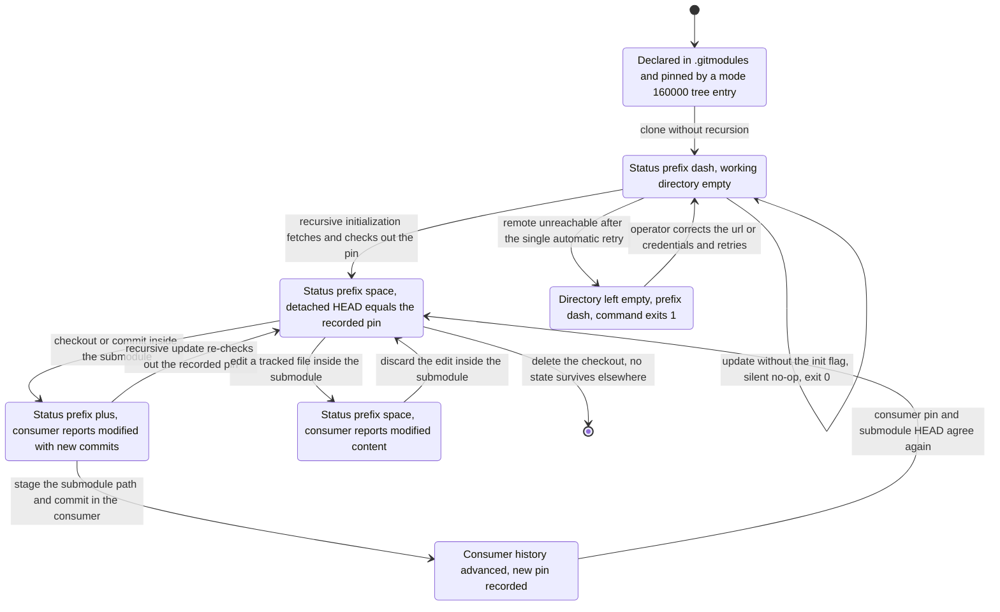
```mermaid
stateDiagram-v2
    [*] --> Declared
    Declared : Declared in .gitmodules and pinned by a mode 160000 tree entry
    Declared --> Uninitialized : clone without recursion
    Uninitialized : Status prefix dash, working directory empty
    Uninitialized --> Uninitialized : update without the init flag, silent no-op, exit 0
    Uninitialized --> InSync : recursive initialization fetches and checks out the pin
    InSync : Status prefix space, detached HEAD equals the recorded pin
    InSync --> PinMismatch : checkout or commit inside the submodule
    PinMismatch : Status prefix plus, consumer reports modified with new commits
    PinMismatch --> InSync : recursive update re-checks out the recorded pin
    PinMismatch --> PinAdvanced : stage the submodule path and commit in the consumer
    PinAdvanced : Consumer history advanced, new pin recorded
    PinAdvanced --> InSync : consumer pin and submodule HEAD agree again
    InSync --> DirtyContent : edit a tracked file inside the submodule
    DirtyContent : Status prefix space, consumer reports modified content
    DirtyContent --> InSync : discard the edit inside the submodule
    Uninitialized --> CloneFailed : remote unreachable after the single automatic retry
    CloneFailed : Directory left empty, prefix dash, command exits 1
    CloneFailed --> Uninitialized : operator corrects the url or credentials and retries
    InSync --> [*] : delete the checkout, no state survives elsewhere
```

Every transition above was reproduced in a disposable copy; the exact trigger and the exact observable signal are:

| Transition | Trigger command | Observable signal afterwards |
|------------|-----------------|------------------------------|
| Declared → Uninitialized | `git clone` without `--recurse-submodules` | Submodule directory exists with 0 entries; status line `-5687ef6…` with no branch annotation |
| Uninitialized → Uninitialized | `git submodule update` while the entry is absent from `.git/config` | Exit 0, **no output, no change** |
| Uninitialized → InSync | `git submodule update --init --recursive` | `registered for path`, then `checked out '5687ef6…'`; prefix becomes a space |
| Uninitialized → CloneFailed | Update with an unreachable remote | `Retry scheduled`, then `a second time, aborting`, exit 1; prefix stays `-` |
| InSync → PinMismatch | `git checkout <other-commit>` inside the submodule | Prefix `+`; consumer shows `modified:   child_repo_10_LOC (new commits, untracked content)` |
| PinMismatch → InSync | `git submodule update --recursive` | `checked out '5687ef6…'`; consumer porcelain empty again |
| PinMismatch → PinAdvanced | `git add <path>` then `git commit` in the consumer | Consumer HEAD advances; the new gitlink is recorded in its tree |
| InSync → DirtyContent | Edit a tracked file inside the submodule | Prefix unchanged; consumer shows `modified:   child_repo_10_LOC (modified content)`; submodule shows ` M app.py` |
| DirtyContent → InSync | `git checkout -- <file>` inside the submodule | Porcelain empty at both levels |

The parenthetical in the consumer's long-form status is significant: it names the exact reason Git flagged the path, distinguishing a moved pin (`new commits`) from an uncommitted edit (`modified content`). This is the only diagnostic that separates the two failure modes, because the porcelain output is the identical ` M <path>` in both cases.

**State of the reviewed checkout.** Level 1 is at `5ad746c` on branch `2807_01`; level 2 is at `5687ef6` on branch `2807_01`, matching the apex pin; level 3 is at `687f60b` on a **detached HEAD**, matching the level-2 pin. All three levels report an empty porcelain status, so every submodule is `InSync`. One anomaly is worth recording for operators: the level-2 `.git/config` contains **no** `submodule.*` entries even though the level-3 working tree is fully populated. From the level-2 configuration's point of view the nested submodule is unregistered, which means a `git submodule update` issued from inside `child_repo_10_LOC` would take the silent no-op edge of the state machine rather than doing work. Recursive acquisition must therefore be driven from the apex, as section 3.6.3 requires.

#### 4.3.1.2 Invocation State Machine

Process state is trivial by comparison and, unusually, complete: because no program registers a signal handler, `atexit` hook or shutdown hook, and because no asynchronous construct exists anywhere in the sources, the states below are exhaustive.

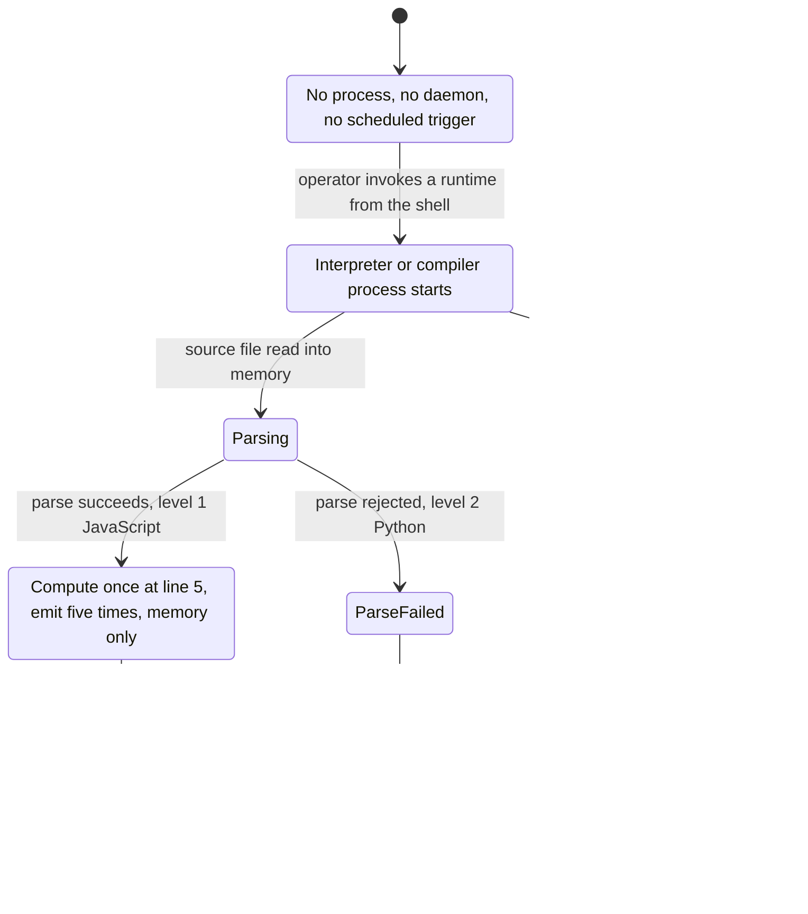
```mermaid
stateDiagram-v2
    [*] --> Idle
    Idle : No process, no daemon, no scheduled trigger
    Idle --> Starting : operator invokes a runtime from the shell
    Starting : Interpreter or compiler process starts
    Starting --> Parsing : source file read into memory
    Starting --> ToolMissing : required binary not found on PATH
    Parsing --> Executing : parse succeeds, level 1 JavaScript
    Parsing --> ParseFailed : parse rejected, level 2 Python
    Executing : Compute once at line 5, emit five times, memory only
    Executing --> ExitZero : module evaluation completes
    ParseFailed --> ExitOne : diagnostic written to stderr
    ToolMissing --> ExitOneTwentySeven : shell level failure
    ExitZero : Exit 0, stdout 15 bytes, stderr empty
    ExitOne : Exit 1, stdout empty, stderr diagnostic
    ExitOneTwentySeven : Exit 127, nothing compiled or run
    ExitZero --> [*]
    ExitOne --> [*]
    ExitOneTwentySeven --> [*]
```

The single item of in-process state that matters is the constant `result`, bound to `12` at line 5 of `index.js` and read five times. It lives in the module scope of a one-entry module graph and is unreachable from anywhere else.

#### 4.3.1.3 Data Persistence Points

| Persistence point | Location | Written by | Lifetime |
|-------------------|----------|-----------|----------|
| Three object stores | `.git`, `.git/modules/child_repo_10_LOC`, and the nested `modules/` path beneath it | Git at clone, fetch and commit | Permanent; one pack each of 9, 9 and 6 objects |
| Three index files | One per level (369, 377 and 209 bytes) | Git at `add` and `checkout` | Until the next staging operation |
| Refs and HEAD | Apex and level 2 hold `ref: refs/heads/2807_01`; level 3 holds the raw commit id | Git at checkout and commit | Permanent per repository |
| Reflogs | `logs/HEAD` at each level, holding 3, 3 and 2 entries | Git on every HEAD movement | Local-only recovery surface |
| Working tree | 8 files, 985 bytes across three directories | Git at checkout | Until the directory is deleted |
| Gitdir pointer files | `child_repo_10_LOC/.git` and the nested `.git`, each a one-line `gitdir:` file | Git when the submodule was absorbed | Permanent; makes the submodule metadata live under the apex |
| Python bytecode cache | Would be `child_repo_10_LOC/__pycache__` | CPython after a successful compile | **Never created** — the parse failure precedes it |

The final row is the important one: the `__pycache__` write is the **only persistence point in the entire system that program execution could ever produce**, and it is unreachable in the current state. No program writes a file, a database row, a log line or a lock file; after every observed run, `git status --porcelain` reports zero lines at all three levels and no `.class`, `.pyc` or `__pycache__` artefact exists anywhere in the tree. All durable state in this system is created by Git, never by the code.

#### 4.3.1.4 Caching Requirements

No caching layer is configured or required, and no cache appears in any source file — the vocabulary scan for `cache` returns zero matches in tracked content. Three incidental caches nonetheless participate in the flows:

| Cache | Scope and contents | Effect on the flows |
|-------|--------------------|---------------------|
| Git object/pack store | Content-addressed history per repository, populated at acquisition | After the first fetch, re-running the recursive update is a purely local checkout — the `PinMismatch → InSync` recovery needs no network |
| Node.js CommonJS module cache | Exactly one entry (`index.js`) | Warms nothing; discarded when the 19–26 ms process exits |
| CPython bytecode cache | Would hold one `.pyc` for `app.py` | Never populated, so every level-2 attempt re-parses from source and fails identically |

Because the Java toolchain never produces a class file, there is no compiled-artefact cache at level 3 either.

#### 4.3.1.5 Transaction Boundaries

The unit of atomicity in this system is **one commit in one repository**. Each of the three levels has its own index and its own object store, so there is no mechanism — and no configuration — by which a change could be committed atomically across levels.

| Boundary | Scope | Consequence |
|----------|-------|-------------|
| Index → commit at one level | Files staged in that level's index only | Atomic per repository; the three index files are physically separate |
| Recursive acquisition | Per hop, not per traversal | All-or-nothing **per hop**: a failed hop leaves 0 entries and the prefix `-`, never a partial checkout; earlier successful hops remain materialized |
| Pin advancement across levels | Three sequential commits | **Not atomic.** Observed cascade: level 3 `687f60b → 94e77ca`, then level 2 `5687ef6 → c630986`, then apex `5ad746c → f13b3ed` — one content change costs three commits and three pushes |
| Execution | None | Nothing is persisted, so there is nothing to roll back; the five stdout writes are independent and irreversible |

The middle rows describe the practical risk. Between the second and third commit of a cascade, the apex still pins the old level-2 commit, so any consumer cloning at that moment gets a consistent-but-stale composition; and if the maintainer pushes level 3 but not the consumers, other clones cannot even see the change. Recovery from a partially propagated cascade is manual: re-stage and commit the remaining gitlink. There is no orchestration, no two-phase protocol and no verification step anywhere in the repository that would detect the intermediate condition.

### 4.3.2 Error Handling

#### 4.3.2.1 Error Taxonomy and Handling Flow

Four failure classes cover every error observed in this system. None of them is handled by repository code — the sources contain no `try`, `catch`, `except`, `raise`, `throw` or `finally` construct at any level.

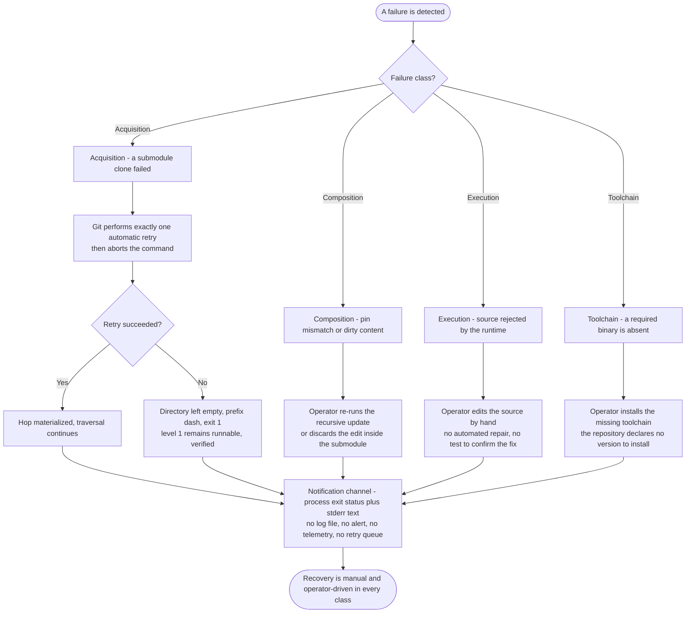
```mermaid
flowchart TD
    EH0(["A failure is detected"])
    EH1{"Failure class?"}
    EH2["Acquisition - a submodule clone failed"]
    EH3["Composition - pin mismatch or dirty content"]
    EH4["Execution - source rejected by the runtime"]
    EH5["Toolchain - a required binary is absent"]
    EH2R["Git performs exactly one automatic retry<br/>then aborts the command"]
    EH2Q{"Retry succeeded?"}
    EH2S["Hop materialized, traversal continues"]
    EH2F["Directory left empty, prefix dash, exit 1<br/>level 1 remains runnable, verified"]
    EH3R["Operator re-runs the recursive update<br/>or discards the edit inside the submodule"]
    EH4R["Operator edits the source by hand<br/>no automated repair, no test to confirm the fix"]
    EH5R["Operator installs the missing toolchain<br/>the repository declares no version to install"]
    EHN["Notification channel - process exit status plus stderr text<br/>no log file, no alert, no telemetry, no retry queue"]
    EHEND(["Recovery is manual and operator-driven in every class"])
    EH0 --> EH1
    EH1 -->|"Acquisition"| EH2 --> EH2R --> EH2Q
    EH2Q -->|"Yes"| EH2S --> EHN
    EH2Q -->|"No"| EH2F --> EHN
    EH1 -->|"Composition"| EH3 --> EH3R --> EHN
    EH1 -->|"Execution"| EH4 --> EH4R --> EHN
    EH1 -->|"Toolchain"| EH5 --> EH5R --> EHN
    EHN --> EHEND
```

#### 4.3.2.2 Retry Mechanisms

The system contains exactly one retry mechanism, and it belongs to the Git client rather than to the repository. Inducing a submodule clone failure against an unreachable remote produced this sequence, in order: `Failed to clone 'child_repo_10_LOC'. Retry scheduled`, a second clone attempt, the underlying transport diagnostic, and finally `Failed to clone 'child_repo_10_LOC' a second time, aborting` with exit status 1.

| Property | Observed value |
|----------|----------------|
| Retry count | Exactly one, then abort |
| Backoff | None configured; the second attempt follows immediately |
| Scope | The failing hop only; already-materialized hops are untouched |
| Provenance | Git client behaviour — no retry setting exists in any `.gitmodules`, config or source file |
| Post-failure state | Submodule directory left with 0 entries, status prefix `-`, command exit 1 |

Nothing else in the system retries anything. No program loops, waits, polls or re-attempts an operation, and no configuration file defines a retry budget, backoff schedule or circuit breaker.

#### 4.3.2.3 Fallback Processes

No fallback logic exists in code — there is no default value, no alternate code path and no degraded mode implemented anywhere in the three sources. One genuine degradation behaviour was nevertheless verified and is worth documenting because it makes the level-1 capability unusually robust:

| Scenario | Level-1 behaviour | Levels 2 and 3 |
|----------|-------------------|----------------|
| Non-recursive clone (submodule empty) | `node index.js` prints `12` five times and exits 0 | Source files absent; nothing can run |
| Submodule clone failed after the retry | `node index.js` prints `12` five times and exits 0 | Source files absent; nothing can run |
| Fully composed checkout | Identical output, exit 0 | Level 2 exits 1; level 3 exits 127 |

In other words, level-1 execution is completely independent of submodule materialization — the apex capability never degrades, and the two lower levels have no fallback at all: when they fail they simply produce no output.

#### 4.3.2.4 Error Notification Flows

There is exactly one notification channel: **the process exit status plus text on a standard stream, read by the human at the terminal**. No log file, log framework, alerting hook, metric, trace, email, webhook or dead-letter queue exists in the repository or is created at run time.

| Failure | Signal emitted | Recipient |
|---------|----------------|-----------|
| Submodule clone failure | Two `Failed to clone` lines plus the transport diagnostic on stderr, exit 1 | Operator's terminal |
| Unregistered entry skipped | **Nothing** — exit 0 with no output | Nobody; detectable only by running `git submodule status` |
| Pin mismatch | Status prefix `+` and `(new commits…)` in the consumer's long status | Operator, only if they look |
| Dirty submodule content | Consumer status `(modified content)`; ` M <file>` inside the submodule | Operator, only if they look |
| Python parse failure | Four stderr lines naming the file, line 7, a caret and the `IndentationError`, exit 1 | Operator's terminal |
| Java toolchain absence | `javac: command not found` from the shell, exit 127 | Operator's terminal |
| Runtime success | Five lines of `12` on stdout, exit 0 | Operator's terminal |

Two of these seven signals are silent-by-default composition states that the operator must actively query, and one — the unregistered-entry skip — emits no signal whatsoever. That asymmetry, rather than any exception path, is the real error-detection weakness in the system's flows.

#### 4.3.2.5 Recovery Procedures

All recovery is manual. Each procedure below was executed and its outcome verified:

| Failure | Recovery procedure | Verified outcome |
|---------|--------------------|------------------|
| Uninitialized or failed hop | Run `git submodule update --init --recursive` **from the apex** | Registers the entry, fetches the pin, checks it out; second hop measured at 301 ms |
| Pin mismatch | Run `git submodule update --recursive` | Re-checks out the recorded pin; consumer porcelain returns to empty; safe to re-run because the operation is idempotent |
| Unwanted pin advance already committed | Restore the previous gitlink using the consumer's reflog, then re-commit | Reflogs hold 3, 3 and 2 HEAD entries respectively, providing a local history of every pin movement |
| Dirty submodule content | Run `git checkout -- <file>` inside the submodule | Both levels return to a clean porcelain status |
| Python parse failure | Edit `app.py` to remove or re-indent the second `__main__` guard at line 7 | Not applied — the defect remains in the repository; no test suite exists to confirm a fix |
| Java build failure | Install a JDK, then remove one of the two `public class User` declarations at lines 1 and 7 | Not applied — no JDK is present in the reference environment |

Two properties make this recovery model workable despite being entirely manual: the recursive update is **idempotent**, so an operator can re-run it freely to force every submodule back to its recorded pin; and no state exists outside the checkout, so the ultimate recovery procedure — deleting the directory and re-acquiring from scratch — costs one full acquisition (measured at 555 ms) and can never lose data that is not already in a remote repository.

## 4.4 Required Diagram Set and Coverage

This section closes out the diagram requirements: it maps every required diagram type to its location, then adds the two diagrams that belong to no single earlier sub-section — the consolidated end-to-end journey across all actors, and the cascading pin advancement that maintains the composition.

### 4.4.1 Coverage Matrix

| Required diagram type | Diagram provided | Location |
|-----------------------|------------------|----------|
| High-level system workflow | Four-lane flowchart (operator, Git and host, filesystem, runtimes) | 4.1.1.1 |
| Detailed process flow — acquisition | W1 flowchart with four terminal states and the per-hop retry | 4.1.1.2 |
| Detailed process flow — JavaScript feature | W2 statement-level flowchart | 4.1.1.3 |
| Detailed process flow — Python feature | W3 parse-gate flowchart | 4.1.1.4 |
| Detailed process flow — Java feature | W4 dual-gate flowchart | 4.1.1.5 |
| Integration data flow | Three-store flowchart with unresolvable-pin edges | 4.1.2.1 |
| Integration sequence diagram | Hop-by-hop acquisition sequence with measured timings | 4.1.2.2 |
| Batch/traversal sequence | Recursive traversal loop including the silent-skip branch | 4.1.2.3 |
| Validation and authorization checkpoints | Gate flowchart with the absent gates marked | 4.2.2.1 |
| State transition diagram — composition | Submodule state machine, seven states | 4.3.1.1 |
| State transition diagram — process | Invocation lifecycle with three exit states | 4.3.1.2 |
| Error handling flowchart | Four-class taxonomy with retry, recovery and notification | 4.3.2.1 |
| Consolidated swim-lane journey | Seven-participant end-to-end sequence | 4.4.2 |
| Composition maintenance sequence | Cascading pin advancement across three repositories | 4.4.3 |

Four process diagrams already published elsewhere in this specification are deliberately **not** reproduced here: the two-stage acquire/execute flow in section 1.3.1.2, the feature dependency map in section 2.3.1, the requirement-to-step mapping in section 2.3.5, and the three-stage build-model flow in section 3.6.2. Section 4 extends those with the elements they do not contain — decision diamonds, swim lanes, state machines, error and recovery paths, and measured timings.

### 4.4.2 Consolidated End-to-End Journey

The following sequence diagram places every actor and system in the composition on its own lane and walks the complete operator journey from an empty directory to the last observed exit status. It is the single diagram to read first when the question is "what actually happens, in order, and who does it".

```mermaid
sequenceDiagram
    autonumber
    actor OP as Operator
    participant GIT as Git client
    participant GH as GitHub host
    participant FS as Composed checkout
    participant NODE as Node.js runtime
    participant PY as CPython runtime
    participant JDK as JDK toolchain
    OP->>GIT: clone the apex repository
    GIT->>GH: fetch level 1 objects over HTTPS
    GH-->>GIT: level 1 pack
    GIT->>FS: materialize level 1 files
    OP->>GIT: initialize submodules recursively
    GIT->>GH: fetch level 2 then level 3
    GH-->>GIT: packs containing both pinned commits
    GIT->>FS: check out both pins at detached HEAD
    OP->>NODE: run index.js
    NODE->>FS: read index.js
    NODE-->>OP: prints 12 five times then exits 0
    OP->>PY: run app.py
    PY->>FS: read app.py
    PY-->>OP: IndentationError at line 7 then exits 1
    OP->>JDK: compile User.java
    JDK-->>OP: binary absent so the shell returns 127
    Note over OP,JDK: no state is retained anywhere once the processes end
```

Three observations follow directly from the lane structure. The `GH` lane is active only in the first half of the journey, which is the whole of the network exposure of this system. The three runtime lanes never talk to each other or to `GIT`, confirming the absence of runtime coupling recorded in section 2.3.1. And the `OP` lane is present in every single exchange — there is no step in this system that happens without a human typing a command.

### 4.4.3 Workflow W5 — Cascading Pin Advancement

W5 is the maintenance workflow that keeps the composition current. It is triggered whenever content changes at a level that another level pins, and it was executed end to end in a disposable copy to establish its true cost.

```mermaid
sequenceDiagram
    autonumber
    actor DEV as Maintainer
    participant L3 as Level 3 repository
    participant L2 as Level 2 repository
    participant L1 as Apex repository
    DEV->>L3: commit the content change
    L3-->>DEV: level 3 HEAD advances
    Note over L2: level 2 now reports modified with new commits and a plus prefix
    DEV->>L2: stage the submodule path and commit
    L2-->>DEV: level 2 records the new pin and its HEAD advances
    Note over L1: the apex now reports modified with new commits and a plus prefix
    DEV->>L1: stage the submodule path and commit
    L1-->>DEV: the apex records the new pin
    Note over DEV,L1: three commits and three pushes propagate one content change
```

| Step | Repository acted on | Observed effect |
|------|--------------------|-----------------|
| 1 | Level 3 | HEAD advances (`687f60b → 94e77ca` in the reproduction); level 2 immediately reports ` M nested_child_repo_10_LOC` and the `+` prefix |
| 2 | Level 2 | Staging the submodule path and committing advances level 2 (`5687ef6 → c630986`); the apex now reports ` M child_repo_10_LOC` and the `+` prefix |
| 3 | Apex | Staging and committing advances the apex (`5ad746c → f13b3ed`); all three levels return to a clean status |

The cost profile of this workflow is its most important property: **one content change at the deepest level requires three commits and three pushes**, one per repository, with no automation of any kind assisting. Nothing detects the intermediate states, nothing enforces that the cascade is completed, and no hook or CI check runs at any step — the repository contains zero non-sample Git hooks and no continuous-integration configuration. An abandoned cascade leaves a consistent-but-stale composition that produces no warning to anyone who clones it.

### 4.4.4 Feature-to-Workflow Traceability

| Feature | Workflow that exercises it | Diagram | Observed status |
|---------|---------------------------|---------|-----------------|
| F-001 Addition function | W2, evaluated once at line 5 | 4.1.1.3 | Working — yields `12` |
| F-002 Repeated stdout emission | W2, lines 6–10 | 4.1.1.3 | Working — 5 lines, 15 bytes, exit 0 |
| F-003 Greeting function | W3 | 4.1.1.4 | Blocked at parse time — never invoked, exit 1 |
| F-004 Java entry point | W4 | 4.1.1.5 | Blocked — toolchain absent (exit 127) and duplicate class declaration |
| F-005 Parent-to-child composition | W1 first hop; W5 step 3 | 4.1.1.2, 4.1.2.2, 4.4.3 | Working — pin `5687ef6` in sync |
| F-006 Child-to-nested composition | W1 second hop; W5 step 2 | 4.1.1.2, 4.1.2.2, 4.4.3 | Working — pin `687f60b` in sync, level-2 registration anomaly noted in 4.3.1.1 |
| F-007 Repository documentation | Inspection touchpoint (4.1.1.7) | — | Present at all three levels; one title line each, no process content |

Every feature defined in section 2.1 is therefore reachable from at least one diagrammed workflow in this section, and the three features that cannot complete (F-003, F-004, and the level-3 half of F-006's operational story) are each traced to the specific decision diamond that blocks them.

## 4.5 References

Every statement, diagram and measurement in section 4 is grounded in the artefacts listed below. All execution and Git experiments were run against a disposable copy where they would have changed state; the repository under review was verified unchanged afterwards — HEADs `5ad746c`, `5687ef6` and `687f60b`, with an empty `git status --porcelain` at all three levels and zero build artefacts anywhere in the tree.

### 4.5.1 Files Examined

- `index.js` - established workflow W2 in full: `add(a, b)` at lines 1–3, the single evaluation `const result = add(5, 7)` at line 5, and the five `console.log(result)` calls at lines 6–10; confirmed no imports, exports, input reads or lifecycle handlers, giving a one-entry module graph
- `.gitmodules` - established the level-1 → level-2 integration declaration (`path` and `url`) used by the acquisition and integration flows
- `README.md` - established the apex documentation touchpoint (single title line, no process content)
- `child_repo_10_LOC/app.py` - established workflow W3: `greet(name)` at lines 1–2, the first `__main__` guard at line 4, and the second guard at line 7 whose indentation causes the parse-time failure and the empty stdout
- `child_repo_10_LOC/.gitmodules` - established the level-2 → level-3 integration declaration and the second acquisition hop
- `child_repo_10_LOC/README.md` - established the level-2 documentation touchpoint
- `child_repo_10_LOC/nested_child_repo_10_LOC/User.java` - established workflow W4's second gate: two top-level `public class User` declarations at lines 1 and 7, each with its own `main` printing a method-local string
- `child_repo_10_LOC/nested_child_repo_10_LOC/README.md` - established the level-3 documentation touchpoint
- `child_repo_10_LOC/.git` - one-line `gitdir:` pointer establishing the absorbed-metadata persistence model for level 2
- `child_repo_10_LOC/nested_child_repo_10_LOC/.git` - one-line `gitdir:` pointer establishing the nested absorbed-metadata path for level 3

### 4.5.2 Folders Examined

- Repository root - contained exactly four first-order children (`index.js`, `.gitmodules`, `README.md`, `child_repo_10_LOC/`) and no manifest, test directory or CI configuration, which fixed the workflow inventory
- `child_repo_10_LOC/` - contained `app.py`, `.gitmodules`, `README.md` and the level-3 submodule directory; no build or dependency manifest
- `child_repo_10_LOC/nested_child_repo_10_LOC/` - contained `User.java` and `README.md` only; terminal level with no further gitlink

### 4.5.3 Repository Metadata Inspected

- `.git/config` and the level-2 configuration - established submodule registration state (`submodule.child_repo_10_LOC.active`) and the level-2 registration anomaly behind the silent no-op transition
- `.git/index` and the two per-module index files (369, 377 and 209 bytes) - established that each level has an independent staging area, fixing the transaction boundary at one commit in one repository
- `.git/HEAD` and the two per-module `HEAD` files - established branch state at levels 1 and 2 and the detached HEAD at level 3
- `.git/logs/HEAD` at all three levels (3, 3 and 2 entries) - established the local reflog recovery surface for pin movements
- `.git/modules/child_repo_10_LOC/` and its nested `modules/` path - established the absorbed submodule object stores of 9, 9 and 6 objects (3.51, 3.56 and 3.08 KiB) and the hop-by-hop pin-resolution constraint
- `.git/hooks/` at all levels - established that only `*.sample` files exist, so no commit, push or checkout gate runs anywhere

### 4.5.4 Technical Specification Sections Cross-Referenced

- `1.3 Scope` - supplied the acquire/execute workflow framing, the two-crossing system boundary model and the two user groups reused in sections 4.1 and 4.2
- `2.1 Feature Catalog` and `2.3 Feature Relationships` - supplied the F-001 through F-007 identifiers, the compute-then-emit dependency and the "no runtime coupling" property used in the traceability table
- `3.6 Development & Deployment` - supplied the required-toolchain facts, the direct-interpretation build model and the apex-driven acquisition ordering constraint reflected in workflows W1 and W5

### 4.5.5 External Sources

None. Every process, timing, state and error claim in this section was derived from direct observation of the repository and its Git metadata; no external documentation was required.

# 5. System Architecture

## 5.1 High-Level Architecture

This section describes the architecture of the composed repository as it actually exists in the checkout. The system is not a service, an application platform, or a distributed deployment; it is a **three-level Git submodule chain** whose entire tracked payload is 985 bytes across 8 files and 2 gitlinks. Every statement below is grounded in the files enumerated in 5.5 References. Where a conventional architectural concern has no counterpart in this repository, that absence is stated plainly rather than filled with assumed patterns.

Throughout Section 5 the following terminology from earlier sections is reused without redefinition: **Level 1** (the apex repository, `parent_repo_10_LOC`), **Level 2** (`child_repo_10_LOC`), **Level 3** (`nested_child_repo_10_LOC`), **composed checkout**, **gitlink**, **pin**, **Workflow A — Acquire**, and **Workflow B — Execute**.

### 5.1.1 System Overview

#### 5.1.1.1 Architecture Style and Rationale

The system implements a **hierarchical source-composition architecture**: three independently versioned Git repositories are assembled into a single working tree by nesting each one inside its parent as a Git submodule. Composition is expressed entirely in version-control metadata — one `.gitmodules` descriptor and one mode-`160000` gitlink tree entry per level — and never in application code.

Three properties of the codebase determine this classification:

- **Nesting is one-to-one and strictly linear.** Level 1 declares exactly one submodule (`child_repo_10_LOC` in `.gitmodules`), Level 2 declares exactly one submodule (`nested_child_repo_10_LOC` in `child_repo_10_LOC/.gitmodules`), and Level 3 declares none. The composed structure is a chain of depth three, not a graph or a fan-out tree.
- **Each level carries exactly one program artifact in a different language.** `index.js` (JavaScript, 171 bytes), `child_repo_10_LOC/app.py` (Python, 206 bytes), and `child_repo_10_LOC/nested_child_repo_10_LOC/User.java` (Java, 280 bytes). Language boundaries and repository boundaries coincide exactly.
- **There is no runtime relationship between the levels.** A search of all eight tracked files for cross-language invocation and inter-process mechanisms — `subprocess`, `exec`, `spawn`, `child_process`, `ProcessBuilder`, `Runtime.getRuntime`, `os.system`, `popen`, `socket`, `pipe`, `fifo`, `shared` — returns zero matches for every pattern. The only cross-file name references anywhere in the checkout are the two `.gitmodules` path/URL declarations and the two `.git` gitdir pointer files.

The rationale that follows from this evidence is that the architecture exists to solve a **packaging and reproducibility problem, not a computation problem**. Submodules give each level its own commit history (Level 1 has three commits, Level 2 three, Level 3 two — eight in total) while still allowing the apex clone to reproduce an exact, byte-identical composition of all three, because each parent records a 40-hex commit SHA rather than a branch name. No lighter mechanism would achieve that: there is no package manifest, lock file, or registry configuration anywhere in the repository, and no artifact is published to any registry. Conversely, no heavier mechanism is warranted: because no code path crosses a level boundary, a service boundary, message bus, or shared datastore would add a protocol carrying zero traffic.

The style is best summarised as **structural coupling without behavioural coupling**. The levels are tightly bound at acquisition time (a parent cannot be fully materialised without its child) and completely independent at execution time (each artifact is invoked directly by an operator and cannot observe the others).

#### 5.1.1.2 Architectural Principles and Patterns

The following principles are inferred from consistently observed properties of the code, not from any design document — the repository contains no architecture, design, or contribution documentation of any kind. The three `README.md` files total 65 bytes and contain nothing beyond a level identifier.

| Principle | Evidence in the Repository |
|---|---|
| Pinned, reproducible composition | Gitlinks record immutable commit SHAs `5687ef6c…b80a` (Level 2) and `687f60b6…e450` (Level 3); zero tags exist at any level, so a SHA is the only version identity |
| One artifact, one repository, one language | Each level tracks exactly one program file, and no level tracks a file in another level's language |
| Zero-dependency implementation | No `package.json`, `requirements.txt`, `pom.xml`, `build.gradle`, `tsconfig.json`, or lock file exists at any level; no `import`, `require`, or third-party reference appears in any program file |
| Direct invocation over abstraction | Each program is a top-level script or `main` entry point with no framework, no CLI parser, no configuration layer, and no dependency-injection construct |
| Stateless, side-effect-free execution | The only side effect of any artifact is writing to standard output; five parallel invocations of `node index.js` produced exactly one distinct output hash, and no filesystem artifacts (`*.class`, `__pycache__`, `*.pyc`) were created by any run |
| Absence of an exported programmatic surface | `require('./index.js')` yields an exports object whose key set is empty; `add` and `result` remain module-private |

Two recognised patterns are present, and it is important to be precise about which:

- **Composite/aggregate repository (submodule chaining)** — the structural pattern. Applied recursively so that each level is simultaneously a consumer of the level beneath it and a component of the level above it.
- **Script-as-entry-point** — the behavioural pattern at every level. `index.js` performs all of its work during module evaluation; `app.py` guards its work with `if __name__ == "__main__"`; `User.java` declares `public static void main(String[] args)`. In all three cases the program is the process.

Patterns that are **not** present, verified by absence: layered or hexagonal separation (there are no layers to separate — each file is a single flat unit), microservices (no service, port binding, or listener), event-driven messaging (no broker, queue, or event abstraction), CQRS or repository/DAO patterns (no data model or persistence code), and plugin or extension architectures (no dynamic loading; the Node module cache contains exactly one entry after loading the apex entry point).

#### 5.1.1.3 System Boundaries and Major Interfaces

The system boundary is **the composed checkout of three repositories on a single local filesystem**. Everything inside that boundary is one of the six components catalogued in 5.1.2. Everything else — GitHub, the Git client, and the three language toolchains — is outside it.

The boundary is crossed in exactly two places:

1. **The HTTPS Git remote interface**, exercised only at acquisition time. Three clone operations pull 9, 9, and 6 objects (3.51 KiB, 3.56 KiB, 3.08 KiB respectively) from the two canonical remotes declared in the `.gitmodules` files.
2. **The standard output stream**, exercised only at execution time. There are exactly nine output call sites in the entire system: `index.js` lines 6–10 (`console.log(result)`), `app.py` lines 6 and 9 (`print(greet(user))`), and `User.java` lines 4 and 10 (`System.out.println(name)`).

There is no server, no port binding, no listener, no scheduled job, no inter-process communication, and no shared state between the levels.

Expressed as ports, the system provides and requires the following interfaces — this port view is the organising device for 5.2:

| Interface (Port) | Direction | Description |
|---|---|---|
| Command-line invocation | Provided | `node index.js`, `python3 app.py`, `javac`/`java User` — the only way to actuate any component |
| Standard output | Provided | Text lines written by the nine call sites; the sole outbound data path |
| Gitlink pin | Required (Level 1, Level 2) | A parent requires a specific commit of its child, identified by SHA |
| HTTPS object fetch | Required (acquisition only) | Retrieval of packs and refs from the two declared remotes |

The **inbound data interface is empty**. All seventeen input-channel patterns probed across the three program files — `process.argv`, `process.env`, `process.stdin`, `readline`, `sys.argv`, `os.environ`, `input(`, `System.in`, `Scanner`, `System.getenv`, `fs.`, `open(`, `Files.`, `fetch(`, `http`, `require(`, `import ` — return zero occurrences. Every value the system emits is a literal embedded in source: `5` and `7` in `index.js`, `"Lakshya"` and `"asdasdafsad"` in `app.py`, `"Test"` and `"asdsadasda"` in `User.java`. `User.java` declares `String[] args` but never reads it.

Equally important, the **programmatic interface surface is empty**. Loading the apex entry point through Node's module system produces an exports object with zero keys, so the repository cannot be consumed as a library or importable module; the command line is the only entry point that exists.

#### 5.1.1.4 Architectural Assumptions

These assumptions are implicit in the code — none is documented in the repository, and each represents a constraint a consumer must satisfy for the system to behave as observed.

- **A single local filesystem hosts all three levels.** Nothing supports distribution: the gitdir pointer files use relative paths (`gitdir: ../.git/modules/child_repo_10_LOC` and `gitdir: ../../.git/modules/child_repo_10_LOC/modules/nested_child_repo_10_LOC`), which are only meaningful within one checkout.
- **A human or CI operator drives every action.** Git is invoked by the operator, never by the code, and no artifact schedules, supervises, or triggers another.
- **Recursive acquisition is intentional.** A non-recursive clone yields a syntactically valid but functionally incomplete composition: Level 1 remains fully runnable while the `child_repo_10_LOC` directory stays empty.
- **The required toolchain is provided by the environment.** No version is pinned anywhere — there is no `.nvmrc`, `engines` field, `python_requires`, or toolchain descriptor. The reference environment supplied Git 2.43.0, Node.js v22.23.1, and CPython 3.12.3; `javac` and `java` were absent, so Level 3 could not be compiled at all.
- **Access control is delegated entirely to GitHub repository permissions**, which live outside the codebase. The system itself performs no authentication or authorisation.
- **Output is consumed by a human at a terminal.** No output is structured, machine-parsable, timestamped, or correlated; the only status channel is the process exit code plus any stderr text.
- **Correctness is asserted by inspection, not by tests.** There is no test directory, test file, assertion, or test-runner configuration at any level.

### 5.1.2 Core Components

Six components exist. Three are program artifacts (one per level), one is the composition metadata that binds the levels, one is the persistence tier, and one is the documentation set. Because the specified column set exceeds the four-column limit, each component is described across two aligned tables.

**Identity, responsibility and dependencies**

| Component | Primary Responsibility | Key Dependencies |
|---|---|---|
| **C1 — Compute-and-Emit Unit** (`index.js`, Level 1) | Add two literal operands via a local `add` function and write the result to stdout five times | Node.js runtime only; zero imports, zero third-party packages |
| **C2 — Greeting Unit** (`child_repo_10_LOC/app.py`, Level 2) | Format a greeting string for a literal name and print it under a `__main__` guard | CPython runtime only; zero imports |
| **C3 — Console Entry-Point Unit** (`…/nested_child_repo_10_LOC/User.java`, Level 3) | Declare a `User` class with a `main` method that prints a literal name | JDK toolchain only; zero imports |
| **C4 — Composition Descriptors** (two `.gitmodules` files plus two mode-`160000` gitlinks) | Declare which repository is mounted at which path and pin the exact commit of each child | Git submodule mechanism; the two canonical HTTPS remotes |
| **C5 — Object Stores** (apex `.git` plus the absorbed gitdirs under `.git/modules/**`) | Hold every version of every tracked object; the system's only durable state | Git 2.43.0 on-disk repository format |
| **C6 — Identification Documents** (three `README.md` files, 65 bytes total) | Name the level a reader is looking at | None |

**Integration points and critical considerations**

| Component | Integration Points | Critical Considerations |
|---|---|---|
| **C1** | Command line (`node index.js`); stdout (5 writes); checked out from the apex store | Emits `12` five times, 15 bytes, exit 0, stderr empty, 18–22 ms; exports nothing, so it cannot be imported; runs correctly even when the submodule path is empty |
| **C2** | Command line (`python3 app.py`); stdout (2 intended writes, unreachable) | Rejected before execution: `IndentationError: unindent does not match any outer indentation level` at line 7, exit 1, zero bytes on stdout. Lines 7–10 duplicate the `__main__` block and include the non-Python token `///asdas` |
| **C3** | Command line (`javac`/`java`); stdout (2 intended writes, unreachable) | Declares `public class User` twice at top level (lines 1 and 7), which prevents normal compilation; `javac` was absent from the reference environment, producing exit 127 before any diagnostic about the source itself |
| **C4** | Read by the Git client during `submodule update`; declares the two remotes | A pin is **never resolvable in the store that records it** (see 5.1.3.1); Level 3 is materialised on disk but has no `submodule.*` entry in Level 2's local config, so a `git submodule update` run from Level 2 silently no-ops |
| **C5** | Written by fetch/clone; read by checkout; three physically separate stores | 9 + 9 + 6 packed objects, zero loose objects, zero garbage at all three levels; `.git` occupies 588 KB total (392 KB of it under `.git/modules`) to carry 985 bytes of payload |
| **C6** | Read by humans only | No component reads them; the Level 2 file misspells its own repository name as `chile_repo_10_LOC` |

Two absences are material to the component model and were verified rather than assumed. First, **no shared or common service exists** — there is no shared library, utility module, configuration service, logging facility, or common runtime component that more than one level uses. Second, **no component invokes another**; the only relationships between components are containment (C4/C5 make C1–C3 and C6 available) and co-location in one working tree.

### 5.1.3 Data Flow Description

Two data flows exist, they use different transports, and they never touch each other. One moves Git objects from GitHub into three local stores and then into a working tree; the other moves a handful of literal-derived bytes from a source file to a terminal. No flow connects a program artifact at one level to a program artifact at another level.

#### 5.1.3.1 Acquisition Flow — Objects into Stores

The acquisition flow is a recursive, three-hop pull driven by the operator. Cloning Level 1 transfers 9 objects (3.51 KiB) into the apex store and checks out `index.js`, `README.md`, and `.gitmodules`; the `child_repo_10_LOC` path exists as a gitlink in the tree but is an empty directory on disk. A recursive submodule update then reads the gitlink SHA from the apex tree, discovers the object is not present locally, clones Level 2 from the URL declared in `.gitmodules`, writes 9 objects (3.56 KiB) into `.git/modules/child_repo_10_LOC`, and checks out that level at the pinned commit. The same sequence repeats one level down for Level 3 (6 objects, 3.08 KiB), which is left on a detached HEAD because a pinned commit, not a branch, is what was requested.

The decisive architectural property of this flow was verified with per-store object-existence probes and explains why composition must be resolved hop by hop rather than from a single manifest:

| Pinned Commit | Apex Store | Level 2 Store | Level 3 Store |
|---|---|---|---|
| `5687ef6…` (recorded by Level 1) | absent | **present** | absent |
| `687f60b…` (recorded by Level 2) | absent | absent | **present** |

A pin is never resolvable in the store that records it. Each hop therefore requires its own network round trip and its own object store; there is no possibility of a flattened, single-fetch resolution, and a failure at hop *n* leaves hops *n+1* and deeper unmaterialised. Registration asymmetry compounds this: the apex local config carries `submodule.child_repo_10_LOC.active true` plus the URL, while Level 2's local config carries no `submodule.*` keys at all, so only a recursive operation started from the apex reliably materialises Level 3.

#### 5.1.3.2 Execution Flow — Literals to a Terminal

The execution flow is a single hop with no fan-out. The operator names one file to one runtime; the runtime evaluates it; text appears on stdout; the process exits. In the observed environment only Level 1 completes this flow: Node.js loads `index.js`, evaluates `add(5, 7)` once, binds the result, and performs five `console.log` writes, producing `12` five times — 5 lines and 15 bytes — with exit 0 and an empty stderr. Three sequential runs produced a byte-identical stream (md5 `b07373a80ad21069e41be538e6506d00`), and five concurrent runs produced exactly one distinct output hash, confirming that the flow carries no state between invocations.

The other two levels terminate before their output stage. Python rejects `app.py` at parse time and writes only a diagnostic to stderr; the Java unit cannot be compiled because `javac` is absent, and would in any case be rejected for declaring `public class User` twice. In both cases the flow produces zero bytes of application output — there is no partial-output mode.

**Integration patterns and protocols.** The acquisition flow uses HTTPS with the Git smart protocol, request/response, initiated by the client, active only while the operator's command runs. The execution flow uses process invocation with an ordinary POSIX file-descriptor write to `fd 1`. Both are strictly synchronous and pull-based. There is no asynchronous, streaming, publish/subscribe, callback, webhook, or polling integration anywhere in the system, and no format negotiation of any kind: the wire formats are Git pack files inbound and unstructured UTF-8 text lines outbound.

#### 5.1.3.3 Data Transformation Points

Transformations are trivial and few, which is itself an architectural fact worth recording: there is no parsing, validation, mapping, serialisation, or schema layer anywhere in the system.

- **Arithmetic** — `index.js` line 2 applies `+` to two numbers, yielding `12` from `5` and `7`.
- **Number to text** — `console.log` coerces the numeric result to its decimal string form when writing to stdout.
- **String interpolation** — `app.py` line 2 embeds a name into a template with an f-string; unreachable in practice.
- **Identity pass-through** — `User.java` binds a literal to a local variable and prints it unchanged.
- **Compression and delta encoding** — performed by Git on the acquisition path when packing and unpacking objects; entirely external to application code.

There is no point in the system at which data is transformed between components, because no data ever moves between components.

#### 5.1.3.4 Data Stores and Caches

The system has **no application data store**: no database, no schema, no migration, no ORM, no file-backed dataset, no serialised state, and no configuration store. Persistence exists solely as version-control state, held in three physically separate Git object stores — the apex `.git`, `.git/modules/child_repo_10_LOC`, and `.git/modules/child_repo_10_LOC/modules/nested_child_repo_10_LOC` — each with its own index (369, 377, and 209 bytes), its own refs, and its own HEAD. `.git` totals 588 KB, of which 392 KB is the absorbed submodule gitdirs.

The system also has **no application cache**: no in-memory cache, no cache library, no TTL, no eviction policy, no memoisation, and no cache-control behaviour. Three incidental caches belong to the surrounding tooling rather than to the architecture — Git's pack index, the operating system page cache, and the Node.js module cache (which held exactly one entry after loading the apex entry point). None is configured, tuned, invalidated, or observed by the system.

### 5.1.4 External Integration Points

The system integrates with exactly one external technology — Git, and specifically its submodule mechanism — plus the language toolchains required to actuate each artifact and the GitHub remotes that host the three repositories. Because the specified column set exceeds four columns, the integrations are described across two aligned tables.

**Integration type and exchange pattern**

| System Name | Integration Type | Data Exchange Pattern |
|---|---|---|
| GitHub (`github.com`, owner `lakshya-blitzy`) | Source hosting for all three repositories | Client-initiated pull; three separate clone/fetch exchanges, one per level |
| Git client (submodule resolver) | Local command-line tool that materialises the composition | Synchronous request/response against the local stores and the remotes; recursive, hop-by-hop |
| Node.js runtime | Execution host for the Level 1 artifact | One-shot process invocation; no handshake, no runtime API contract |
| CPython runtime | Execution host for the Level 2 artifact | One-shot process invocation; terminates at parse time |
| JDK toolchain (`javac`, `java`) | Compile-and-run host for the Level 3 artifact | One-shot process invocation; unavailable in the reference environment |
| Terminal / stdout consumer | Destination for all program output | Unidirectional write of plain text lines; no acknowledgement |

**Protocol, format and service expectations**

| System Name | Protocol / Format | SLA Requirements |
|---|---|---|
| GitHub | HTTPS with the Git smart protocol; pack files and refs | None declared. Availability is inherited from GitHub and is required only during acquisition; no availability target, retry budget, or timeout is specified anywhere in the repository |
| Git client | Local process; `.gitmodules` INI format and mode-`160000` tree entries | None declared. Observed reference figures only: full recursive re-acquisition of all three levels in 555 ms, second hop 301 ms |
| Node.js runtime | CommonJS module evaluation of a `.js` file | None declared. Observed: exit 0, 18–22 ms wall time across five runs |
| CPython runtime | Source parse of a `.py` file | None declared. Observed: exit 1 in 9–10 ms across five runs, zero application output |
| JDK toolchain | Java source compilation | None declared. Observed: exit 127, `javac: command not found` |
| Terminal / stdout | Unstructured UTF-8 text on file descriptor 1 | None declared. No log format, correlation identifier, or timestamp is emitted |

The uniform "none declared" entry in the SLA column is a verified finding, not an omission. The repository declares no success criteria, service-level objectives, error budgets, latency targets, or availability targets of any kind — there is no monitoring, alerting, or health-check artifact at any level, and no configuration file in which such a target could be expressed. Every figure quoted above is a measurement taken in one reference environment and must be read as an observation, not a commitment. Any numeric KPI attributed to this system beyond such measurements would be fabricated.


## 5.2 Component Details

Each of the six components catalogued in 5.1.2 is detailed below across five facets: purpose and responsibilities, technologies and frameworks, key interfaces and APIs, data persistence requirements, and scaling considerations. The facets are reported uniformly even where the honest answer is that the facet does not apply — for a 985-byte system, the absence of a persistence requirement or a scaling mechanism is a design fact worth recording explicitly.

### 5.2.1 Component and Port Overview

The system is best understood as six components connected by four interface types, referred to below as **ports**. The term is used in its architectural sense — a named provided or required interface — and never in its networking sense: no component binds a TCP port, opens a socket, or listens for a connection anywhere in the repository.

| Port | Kind | Components Exposing or Consuming It |
|---|---|---|
| Command-line invocation | Provided | C1, C2, C3 — the only way any behaviour is triggered |
| Standard output | Provided | C1 (5 call sites), C2 (2 call sites), C3 (2 call sites) |
| Gitlink pin | Required | C4 at Level 1 and Level 2; consumed by the Git client |
| HTTPS object fetch | Required | C4/C5 during acquisition only |

The diagram below shows every component, every port, and every external actor in one view. Solid edges are actions taken during acquisition or execution; dotted edges from the composition descriptors show pin resolution, drawn deliberately toward the store that actually contains the pinned object rather than the store that records the pin. Dotted edges into stdout mark intended but unreachable output paths.

```mermaid
flowchart TD
    OP["Operator or CI job<br/>human-driven shell commands"]
    subgraph EXT["External systems outside the boundary"]
        GHUB["GitHub over HTTPS<br/>github.com owner lakshya-blitzy"]
        GITCLI["Git client 2.43.0<br/>submodule resolver"]
        NODE["Node.js runtime<br/>v22.23.1 observed"]
        CPY["CPython runtime<br/>3.12.3 observed"]
        JDK["JDK toolchain<br/>absent in reference environment"]
    end
    subgraph L1["Level 1 apex - parent_repo_10_LOC"]
        C4A[".gitmodules plus gitlink 5687ef6<br/>C4 composition descriptor"]
        C1["index.js<br/>C1 compute and emit unit<br/>no exported symbols"]
        C6A["README.md<br/>C6 identification doc"]
    end
    subgraph L2["Level 2 - child_repo_10_LOC"]
        C4B[".gitmodules plus gitlink 687f60b<br/>C4 composition descriptor"]
        C2["app.py<br/>C2 greeting unit<br/>rejected at parse time"]
        C6B["README.md<br/>C6 identification doc"]
    end
    subgraph L3["Level 3 - nested_child_repo_10_LOC"]
        C3["User.java<br/>C3 console entry point<br/>duplicate top-level class"]
        C6C["README.md<br/>C6 identification doc"]
    end
    subgraph STORE["C5 persistence tier - Git object stores"]
        S1["apex .git<br/>9 objects 3.51 KiB"]
        S2[".git/modules/child_repo_10_LOC<br/>9 objects 3.56 KiB"]
        S3["nested modules path<br/>6 objects 3.08 KiB"]
    end
    STDOUT["stdout stream<br/>the only outbound data port"]
    OP -->|"git clone and submodule update"| GITCLI
    OP -->|"node index.js"| NODE
    OP -->|"python3 app.py"| CPY
    OP -->|"javac User.java"| JDK
    GITCLI -->|"HTTPS fetch at acquisition time only"| GHUB
    GITCLI -->|"writes packs and refs"| S1
    GITCLI -->|"writes packs and refs"| S2
    GITCLI -->|"writes packs and refs"| S3
    S1 -->|"checkout"| C1
    S1 -->|"checkout"| C4A
    S2 -->|"checkout"| C2
    S2 -->|"checkout"| C4B
    S3 -->|"checkout"| C3
    C4A -.->|"pin resolved in level 2 store"| S2
    C4B -.->|"pin resolved in level 3 store"| S3
    NODE -->|"evaluates module scope"| C1
    CPY -->|"parse rejected exit 1"| C2
    JDK -->|"never reached exit 127"| C3
    C1 -->|"five console.log writes"| STDOUT
    C2 -.->|"intended print unreachable"| STDOUT
    C3 -.->|"intended println unreachable"| STDOUT
```

Note what the diagram does **not** contain: there is no edge between C1, C2, and C3. That absence is the single most important structural property of the architecture and was verified by probing all eight tracked files for every common cross-invocation and IPC mechanism, each of which returned zero matches.

### 5.2.2 C1 — JavaScript Compute-and-Emit Unit (Level 1)

**Purpose and responsibilities.** `index.js` is the apex repository's only executable artifact and the only component in the system that runs to completion in the reference environment. Its responsibility is to compute the sum of two literal operands through a locally declared function and write the result to standard output five times. It owns no other concern: it neither materialises the submodules, validates the composition, nor observes the other levels.

**Technologies and frameworks.** Plain ES5-compatible JavaScript executed by Node.js as a CommonJS module; the reference environment supplied v22.23.1. There is no framework, transpiler, bundler, linter configuration, or type layer. The file declares zero dependencies, and no `package.json` exists at any level — the component's entire technology footprint is the language runtime itself.

**Key interfaces and APIs.** The component's provided interface is the command line plus stdout, and nothing else. Its programmatic surface is empty, which was established directly rather than inferred: loading the file through Node's module system yields an exports object with an empty key set, and the module cache contains exactly one entry afterwards. Consequently `add` and the `result` binding are module-private and unreachable from any other code.

```javascript
function add(a, b) { return a + b; }
const result = add(5, 7);
```

There is no inbound parameterisation of any kind — the component reads no argument vector, no environment variable, and no stream. Its outbound interface is five successive `console.log(result)` calls at lines 6 through 10.

**Data persistence requirements.** None. The component reads no file, writes no file, and creates no artifact. After repeated execution the working tree remained clean at all three levels and no build or cache artifact was produced. Its only durable representation is the 171-byte blob `216959ca` in the apex object store.

**Scaling considerations.** The component scales trivially and horizontally because it is stateless by construction: three sequential runs produced a byte-identical stream (md5 `b07373a80ad21069e41be538e6506d00`), and five concurrent runs produced exactly one distinct output hash, so invocations cannot interfere with one another. Wall-clock time was 18–22 ms across five runs, which is dominated by Node.js process start-up rather than by the single addition; the work performed is O(1) with a fixed five-line output, so throughput is bounded purely by how many processes the host can start. There is no concurrency, parallelism, batching, or work-queue construct inside the component, and none is needed.

The sequence below traces one complete invocation from the operator's command through module evaluation to process exit.

```mermaid
sequenceDiagram
    actor OP as Operator
    participant SH as Shell
    participant RT as Node.js runtime
    participant MOD as index.js module scope
    participant ADD as add function object
    participant OUT as stdout
    OP->>SH: node index.js
    SH->>RT: spawn process, argv ignored by the program
    RT->>MOD: resolve and wrap the entry file, module cache size becomes 1
    RT->>MOD: evaluate lines 1 to 3, hoist the add declaration
    MOD->>ADD: invoke add with literal operands 5 and 7
    ADD-->>MOD: return 12 via the plus operator
    Note over MOD: const result is bound once at line 5
    MOD->>OUT: console.log at line 6
    MOD->>OUT: console.log at line 7
    MOD->>OUT: console.log at line 8
    MOD->>OUT: console.log at line 9
    MOD->>OUT: console.log at line 10
    MOD-->>RT: module evaluation complete, no exports assigned
    RT-->>SH: exit 0, stdout 5 lines and 15 bytes, stderr 0 bytes
    SH-->>OP: 12 printed five times in 18 to 22 ms
```

### 5.2.3 C2 — Python Greeting Unit (Level 2)

**Purpose and responsibilities.** `child_repo_10_LOC/app.py` is intended to format a greeting for a literal name and print it. Its declared responsibility is a single pure function, `greet(name)`, which is synchronous and side-effect-free, plus a `__main__` guard that exercises it. In practice the component discharges no responsibility at all, because it is rejected before any statement executes.

**Technologies and frameworks.** Plain Python 3 executed by CPython; the reference environment supplied 3.12.3. The only language feature beyond function definition is the f-string on line 2. There is no framework, no `requirements.txt`, `pyproject.toml`, `setup.py`, or virtual-environment descriptor at any level, and the file has no internal or third-party imports.

**Key interfaces and APIs.** Intended interface: command-line invocation with output on stdout. Actual interface: command-line invocation with a diagnostic on stderr. Lines 7 through 10 duplicate the `__main__` block at an inconsistent indentation level and terminate with the token `///asdas`, which is not valid Python. Running the file produces `IndentationError: unindent does not match any outer indentation level` at line 7, exit status 1, and zero bytes on stdout. Because the parse fails at module level, `greet` is never defined and the component exposes no callable surface even to itself — it cannot be imported any more than it can be run.

**Data persistence requirements.** None. The component would read and write nothing if it ran, and because it fails at parse time it does not even produce a bytecode cache: no `__pycache__` directory or `.pyc` file was created by any invocation, leaving the working tree clean.

**Scaling considerations.** Not applicable in the component's present state; the only meaningful scaling statement is that the failure is deterministic and immediate — 9–10 ms across five runs — so repeated or concurrent invocation multiplies the failure without consuming any shared resource. If the indentation defect on lines 7 through 10 were repaired, the component would inherit exactly the same stateless, O(1), process-per-invocation profile as C1.

### 5.2.4 C3 — Java Console Entry-Point Unit (Level 3)

**Purpose and responsibilities.** `child_repo_10_LOC/nested_child_repo_10_LOC/User.java` is intended to declare a `User` class whose `main` method prints a literal name. It is the terminal component of the chain: Level 3 declares no submodule of its own, so nothing depends on it structurally from below.

**Technologies and frameworks.** Plain Java with no imports, no annotations, no type parameters, no inheritance, and no implemented interfaces. Neither declared class has fields, an explicit constructor, or persistent state. No build tooling exists at any level — there is no `pom.xml`, `build.gradle`, wrapper script, or `Makefile` — so compilation would have to be driven by invoking `javac` directly.

**Key interfaces and APIs.** Intended interface: `javac User.java` followed by `java User`, with output on stdout. The component is blocked on two independent grounds. First, the file declares `public class User` twice at top level — the first declaration spans lines 1 through 6 and the second lines 7 through 12 — which prevents normal Java compilation, since a compilation unit cannot contain two public top-level types of the same name. Second, the reference environment provided no JDK: `javac User.java` terminated with exit status 127 and the message `javac: command not found`, so the toolchain failure is encountered before the source defect can even be diagnosed. The `main` method declares `String[] args` but never reads it, so there is no inbound interface either.

**Data persistence requirements.** None. No `.class` file, jar, or other artifact was produced by any attempted compilation, and the working tree remained clean.

**Scaling considerations.** Not applicable. The component has never executed in the reference environment, so no performance or concurrency characteristic can be attributed to it. Were the duplicate declaration removed and a JDK installed, the component would follow the same stateless process-per-invocation model as C1, with the additional cost of an ahead-of-time compilation step that neither of the other two levels requires — the only asymmetry in the system's otherwise uniform interpret-and-run execution model.

### 5.2.5 C4 — Composition Descriptors and Gitlink Pins

**Purpose and responsibilities.** C4 is the only component that spans levels and the only one that carries architectural intent rather than behaviour. It consists of two `.gitmodules` files and the two mode-`160000` tree entries they correspond to. Its responsibility is to declare, for each parent, *which* repository is mounted at *which* path from *which* URL, and to pin the exact commit that constitutes the correct content of that path.

**Technologies and frameworks.** Git's submodule mechanism only. The descriptors use Git's INI-style configuration format, three non-blank lines each, and are read by the Git client — never by application code. The canonical, credential-free declarations are:

```ini
[submodule "child_repo_10_LOC"]
    path = child_repo_10_LOC
    url = https://github.com/lakshya-blitzy/child_repo_10_LOC.git
```

The Level 2 descriptor has the identical shape, declaring `nested_child_repo_10_LOC` with the correspondingly named remote.

**Key interfaces and APIs.** C4 exposes no callable interface; it is declarative data consumed by `git submodule` operations. Its effective contract is the pair of gitlinks `160000 commit 5687ef6c3fdbdf361df830fcd78a2dbdcdb2b80a child_repo_10_LOC` and `160000 commit 687f60b6c74818ac7cd14413840d73fdfb5fe450 nested_child_repo_10_LOC`. Two implementation details of this contract are architecturally significant.

First, **a pin is never resolvable in the store that records it**, as the per-store object-existence probe in 5.1.3.1 shows. This forces resolution to proceed hop by hop, each hop requiring its own remote and its own object store, and it is the reason the composition cannot be flattened into a single fetch.

Second, **registration is asymmetric between the levels**. The apex local configuration carries `submodule.child_repo_10_LOC.active true` together with the URL, whereas Level 2's local configuration carries no `submodule.*` keys at all. `git submodule status --recursive` reflects this: the Level 2 entry is prefixed with a space and annotated `(heads/2807_01)`, while the Level 3 entry is prefixed with a hyphen, marking it as not registered from its parent's point of view even though its files are present on disk. A `git submodule update` issued from Level 2 therefore silently succeeds without doing anything.

**Data persistence requirements.** C4's own persistence is two 121-byte and 142-byte blobs plus two tree entries. Its operational persistence requirement is stricter than that of any other component: the gitlink and the `.gitmodules` entry must remain mutually consistent, and each parent's recorded SHA must remain reachable in the corresponding child's remote. Nothing in the repository enforces or verifies either invariant — there is no hook, no CI check, and no validation script at any level.

**Scaling considerations.** The mechanism scales in depth by nesting, and the observed chain is depth three with a fan-out of exactly one at each level. Cost grows linearly with the number of levels: each added level adds one clone, one remote round trip, one object store, and one more hop that must succeed before the next can begin. It also multiplies the write cost of a content change — advancing a leaf commit requires a commit-and-push in the leaf, then a pin update in its parent, then in the grandparent, for three commits and three pushes in total, with no atomicity across them. This is the dominant scalability limitation of the architecture and is intrinsic to the chosen style rather than to this repository's size.

The sequence below traces a complete recursive acquisition, with the three object stores as distinct participants so that the resolution gap is visible.

```mermaid
sequenceDiagram
    actor OP as Operator
    participant GIT as Git client
    participant GH as GitHub HTTPS
    participant S1 as Apex object store
    participant S2 as Level 2 object store
    participant S3 as Level 3 object store
    participant WT as Composed working tree
    OP->>GIT: git clone parent_repo_10_LOC
    GIT->>GH: fetch apex refs and pack
    GH-->>GIT: 9 objects, 3.51 KiB
    GIT->>S1: write pack and refs
    GIT->>WT: checkout index.js, README.md, .gitmodules
    Note over WT: gitlink path child_repo_10_LOC is empty at this point
    OP->>GIT: git submodule update --init --recursive
    GIT->>S1: read gitlink 5687ef6 from apex tree
    GIT->>S1: cat-file 5687ef6
    S1-->>GIT: object absent in this store
    Note over GIT,S1: the recording store never holds the pinned object
    GIT->>GH: clone child_repo_10_LOC
    GH-->>GIT: 9 objects, 3.56 KiB
    GIT->>S2: write pack and refs
    GIT->>WT: checkout app.py, README.md, .gitmodules at 5687ef6
    GIT->>S2: read gitlink 687f60b from level 2 tree
    GIT->>GH: clone nested_child_repo_10_LOC
    GH-->>GIT: 6 objects, 3.08 KiB
    GIT->>S3: write pack and refs
    GIT->>WT: checkout User.java and README.md at 687f60b, detached HEAD
    GIT-->>OP: exit 0, three level tree of 8 files and 985 bytes
```

### 5.2.6 C5 — Git Object Stores

**Purpose and responsibilities.** C5 is the system's entire persistence tier. It comprises three physically separate stores: the apex `.git`, and the two absorbed submodule gitdirs at `.git/modules/child_repo_10_LOC` and `.git/modules/child_repo_10_LOC/modules/nested_child_repo_10_LOC`. Its responsibility is to hold every version of every tracked object and to make a specific commit checkoutable on demand.

**Technologies and frameworks.** Git 2.43.0 on-disk repository format. Submodule gitdirs are absorbed rather than in-place: `child_repo_10_LOC/.git` is a pointer file reading `gitdir: ../.git/modules/child_repo_10_LOC`, and the Level 3 pointer reads `gitdir: ../../.git/modules/child_repo_10_LOC/modules/nested_child_repo_10_LOC`. Both paths are relative, which is what confines the composed checkout to a single filesystem.

**Key interfaces and APIs.** The stores are addressed exclusively through Git plumbing and porcelain commands; no application code touches them. Each store keeps its own index (369, 377, and 209 bytes), its own refs, and its own HEAD. HEAD state differs meaningfully by level: Level 1 is on branch `2807_01` at `5ad746c`, Level 2 is on branch `2807_01` at the pinned `5687ef6`, and Level 3 is on a **detached HEAD** at the pinned `687f60b` — the expected consequence of checking out a commit rather than a branch, and the reason casual edits at Level 3 are easy to lose.

**Data persistence requirements.** All persistence in the system is version-control state; there is no database, schema, migration, ORM, serialised dataset, or configuration store. The three stores hold 9, 9, and 6 packed objects (3.51 KiB, 3.56 KiB, 3.08 KiB), with zero loose objects and zero garbage at every level. Overhead is dramatic in relative terms and irrelevant in absolute terms: `.git` totals 588 KB — 392 KB of it the absorbed gitdirs — to carry 985 bytes of tracked payload.

**Scaling considerations.** Store count grows linearly with the number of levels, and each store is independently packed, fetched, and garbage-collected. Nothing is shared between them: no alternates file, no shared object directory, and no reference borrowing, so identical content in two levels would be stored twice. At the observed size this is immaterial, but it is the mechanism by which per-level overhead accumulates as a chain deepens. Read scaling is a non-issue because checkout is local and there is no concurrent writer — the only writer is the operator's own Git process.

### 5.2.7 C6 — Identification Documents

**Purpose and responsibilities.** Three `README.md` files, 20, 19, and 26 bytes, totalling 65 bytes and one non-blank line each. Their sole responsibility is to name the level a reader is looking at.

**Technologies and frameworks.** Markdown, using a single first-level heading. No renderer, generator, or documentation pipeline exists in the repository.

**Key interfaces and APIs.** Human-readable only; no component reads them and no build step consumes them. The convention is the only thing shared consistently across all three levels — every level has exactly one README and nothing else in the way of documentation. The Level 2 file misspells its own repository name as `chile_repo_10_LOC`, which is worth recording because it is the sole documentation artifact at that level and there is no other source of truth to correct it.

**Data persistence requirements.** Three blobs in three separate object stores. Nothing more.

**Scaling considerations.** Not applicable. The set grows by exactly one file per added level and carries no operational cost. Its scalability limitation is editorial rather than technical: with 65 bytes of documentation and no architecture, design, or contribution guidance anywhere in the repository, a newcomer must read the source to learn anything at all.

### 5.2.8 Component Readiness State Model

Component readiness is a distinct concern from the Git composition status of a path and from the lifecycle of an operating-system process. It answers a single architectural question: *is this component in a condition where its behaviour can be obtained?* The model below is per-component and applies uniformly to C1, C2, and C3; in the reference environment the three components occupy three different states, which is precisely why the model is worth stating.

```mermaid
stateDiagram-v2
    [*] --> NotAcquired
    NotAcquired : Component source is not on the local filesystem
    NotAcquired --> Materialised : owning level checked out by the Git client
    NotAcquired --> NotAcquired : non recursive clone leaves the level absent
    Materialised : Source present in the working tree, no build step exists
    Materialised --> ToolchainMissing : required runtime binary absent from PATH
    Materialised --> Accepted : runtime accepts the compilation unit
    Materialised --> Rejected : runtime rejects the compilation unit
    ToolchainMissing : Level 3 today, javac not installed, exit 127
    Rejected : Level 2 today, IndentationError at line 7, exit 1, no output
    Accepted : Level 1 today, node --check passes
    Accepted --> Executed : module scope evaluated to completion
    Executed : Five stdout lines, exit 0, no filesystem side effect
    Executed --> Accepted : process exits, component returns to at rest state
    ToolchainMissing --> Materialised : operator installs a toolchain
    Rejected --> Materialised : operator edits the source by hand
    Executed --> [*] : checkout deleted, no state survives
```

Three properties of this model follow from the evidence. Readiness is **per component, not per system**: C1 reached `Executed` while C2 sat in `Rejected` and C3 in `ToolchainMissing`, all within the same checkout, and no component's state influenced another's. Recovery from every non-ready state is **manual** — there is no retry, self-healing, or repair path in the codebase, and the transitions out of `Rejected` and `ToolchainMissing` are operator actions rather than system behaviour. And the `Executed` state leaves **no residue**: the component returns to exactly its prior at-rest condition, verified by a clean working tree and zero build artifacts after repeated runs.

### 5.2.9 Consolidated Scaling and Capacity Considerations

Scaling behaviour differs sharply between the two halves of the system, and conflating them would misrepresent both.

| Dimension | Execution Half (C1–C3) | Composition Half (C4–C5) |
|---|---|---|
| Unit of scale | One OS process per invocation | One repository, remote, and object store per level |
| Growth characteristic | Flat: O(1) work, fixed-size output, no state | Linear in depth: one clone and one hop per level |
| Concurrency safety | Unlimited; 5 parallel runs yielded 1 distinct output hash | Single-writer; the operator's Git process is the only mutator |
| Dominant cost | Runtime process start-up, 18–22 ms observed | Network round trips, 555 ms for full recursive re-acquisition |
| Principal limitation | None at this size; no batching or queueing exists | Non-atomic multi-repository writes: 3 commits and 3 pushes to advance one leaf change |

Two consolidated statements can be made safely. First, the execution half is **embarrassingly parallel and stateless**, so its capacity is bounded only by host process limits; nothing in the code would have to change to run it a thousand times concurrently. Second, the composition half is **the architecture's real scalability constraint**, because write amplification and the absence of cross-repository atomicity grow with chain depth. No horizontal scaling, load balancing, sharding, replication, autoscaling, or capacity-planning artifact exists anywhere in the repository, and no throughput or latency target is declared for either half.


## 5.3 Technical Decisions

An important qualification governs this entire subsection. **The repository contains no design documentation, architecture notes, ADR directory, or commit-message rationale of any kind** — the three `README.md` files total 65 bytes and carry only a level identifier, and there is no `docs/` directory at any level. Every decision recorded below is therefore *reconstructed from observable evidence*: the artifact that was built, the mechanism that binds it, and the mechanisms that are demonstrably absent. Where a rationale is offered it is presented as the reasoning that the evidence supports, not as a claim about what the original author wrote down. Alternatives are evaluated against what the repository would have had to contain for them to be true — a manifest, a lock file, a service descriptor, a schema — and in every case that content is verifiably absent.

### 5.3.1 Architecture Style Decision and Tradeoffs

**Decision.** Compose three independently versioned, single-language repositories into one navigable working tree using a linear chain of Git submodules, one submodule per level, with each parent recording an immutable commit SHA for its child.

**Why the evidence supports it.** The requirement the artifact satisfies is packaging, not computation: three programs of 171, 206, and 280 bytes are made retrievable and reproducible as one unit. Submodules are the only mechanism present that achieves this, and the repository contains none of the machinery that any alternative would require. The decision tree below traces the choice through the four questions the evidence actually answers, with each rejected branch annotated by the evidence that rules it out.

```mermaid
flowchart TD
    D0(["Requirement: publish three tiny single language artefacts as one navigable unit"])
    D1{"Does any artefact call another at run time?"}
    D2{"Do the artefacts share a release cadence and one history?"}
    D3{"Must the composition pin exact content versions?"}
    D4{"Is a package registry or artefact repository available in the design?"}
    A1["Chosen: nested Git submodule chain<br/>one submodule per level, gitlink pins 5687ef6 and 687f60b"]
    A2["Rejected: monorepo with one history<br/>would collapse three independent repositories"]
    A3["Rejected: service or process boundary with an API<br/>no caller exists, would add a protocol for zero traffic"]
    A4["Rejected: package dependency via npm, PyPI or Maven<br/>no manifest, lock file or registry config exists anywhere"]
    A5["Rejected: floating branch reference<br/>would remove reproducibility of the composed checkout"]
    D0 --> D1
    D1 -->|"No, verified zero call edges"| D2
    D1 -->|"Yes"| A3
    D2 -->|"No, three separate histories of 3, 3 and 2 commits"| D3
    D2 -->|"Yes"| A2
    D3 -->|"Yes, reproducibility required"| D4
    D3 -->|"No"| A5
    D4 -->|"No registry configured, zero declared dependencies"| A1
    D4 -->|"Yes"| A4
```

**Tradeoffs accepted.**

| Benefit Obtained | Cost Accepted |
|---|---|
| Exact reproducibility: a parent clone reconstructs a byte-identical composition from recorded SHAs | Acquisition is multi-hop; a failure at hop *n* leaves all deeper levels unmaterialised |
| Independent histories: 3, 3, and 2 commits evolve separately, and each level can be consumed on its own | Write amplification: advancing one leaf change costs 3 commits and 3 pushes with no cross-repository atomicity |
| Zero build and zero dependency footprint; nothing to install before reading or running a level | No shared code, no shared utility, and therefore no way to factor out anything common |
| Structural clarity: repository boundary, language boundary, and artifact boundary coincide exactly | Fragility of pins: nothing in the repository validates that a recorded SHA is still reachable in its remote |
| Level 1 remains runnable even when the submodule path is empty | Silent partial composition: a non-recursive clone looks complete but is not, and no check reports it |

**Alternatives and why the repository rules them out.** A monorepo would have collapsed three histories into one and is contradicted by the existence of three separate remotes and three separate object stores. A service or API boundary is contradicted by zero cross-invocation edges — no `subprocess`, `exec`, `spawn`, `child_process`, `ProcessBuilder`, `Runtime.getRuntime`, `os.system`, `popen`, `socket`, `pipe`, or `fifo` reference exists in any tracked file. Package-registry distribution is contradicted by the complete absence of `package.json`, `requirements.txt`, `pyproject.toml`, `pom.xml`, `build.gradle`, and any lock file at all three levels. Subtree merging or vendored copies are contradicted by the presence of genuine mode-`160000` gitlinks rather than ordinary tree entries. A floating branch reference is contradicted by the recorded 40-hex SHAs; notably, **zero tags exist at any level**, so a SHA is the only version identity the system has.

### 5.3.2 Communication Pattern Decisions

**Decision.** Use no inter-component communication whatsoever. Every behaviour is triggered by an operator invoking one runtime on one file, and every result is delivered as unstructured text on standard output.

**Why the evidence supports it.** With three components that share no data and no trigger, any communication mechanism would carry zero traffic. The system consequently exposes exactly two communication paths, both synchronous and both crossing the system boundary rather than an internal one: HTTPS Git transport during acquisition, and a write to file descriptor 1 during execution.

| Pattern | Present? | Evidence |
|---|---|---|
| Direct command-line invocation | Yes — the only actuation path | `node index.js`, `python3 app.py`, `javac`/`java`; no wrapper, launcher, or entry-point script exists |
| Synchronous request/response over HTTPS | Yes — acquisition only | Git smart protocol against the two remotes declared in `.gitmodules`; active only while the operator's command runs |
| Unidirectional text write to stdout | Yes — the only result channel | Nine call sites total: 5 in `index.js`, 2 in `app.py`, 2 in `User.java` |
| Process spawning, pipes, sockets, IPC | No | Zero matches for all eleven probed mechanisms across all eight tracked files |
| REST, RPC, GraphQL, or any network API | No | No server, port binding, listener, route table, or client library at any level |
| Message broker, queue, or event bus | No | No broker client, topic, subscription, or event abstraction anywhere |
| Shared file, shared memory, or shared database | No | No component reads or writes any file; the only shared thing between levels is co-location in one working tree |
| Callback, webhook, or polling | No | No inbound endpoint and no scheduler; nothing in the repository runs unattended |

**Tradeoff.** The pattern is maximally simple, has zero coupling risk, and requires no protocol, serialisation format, versioning scheme, or compatibility contract. What is given up is composability: because `index.js` exports nothing — its exports object has an empty key set — no other program can reuse its logic, and the same holds at the other two levels. Reuse would require adding an export surface or a process boundary, neither of which exists today.

### 5.3.3 Data Storage Decisions

**Decision.** Store no application data. Persist only version-control state, in Git's own object stores, one per level.

**Why the evidence supports it.** There is nothing to store. All values the system operates on are literals embedded in source — `5` and `7`, `"Lakshya"`, `"Test"` — and no component reads or writes a file. Introducing any datastore would create operational surface with no data behind it.

| Storage Option | Chosen? | Rationale from Evidence |
|---|---|---|
| Git object stores (three, one per level) | Yes | 9 + 9 + 6 packed objects; zero loose objects and zero garbage at all levels; the only durable state the system has |
| Relational or document database | No | No schema, migration, ORM, connection string, or driver dependency at any level |
| Local file or embedded store | No | Zero file-access calls; all seventeen input-channel probes returned zero, including `fs.`, `open(`, and `Files.` |
| Key-value or object storage service | No | No SDK, credential handling, bucket reference, or endpoint configuration anywhere |
| In-memory state shared across invocations | No | Each invocation is a fresh process; five concurrent runs produced one identical output hash, proving no shared state |

**Tradeoff.** Storage cost, backup, schema evolution, and consistency concerns are eliminated entirely, and disaster recovery reduces to re-cloning. The cost is structural rather than operational: because persistence is version-control state, the only "record" the system can produce is a commit, and the only identity a version has is a SHA — there are no tags, no release artifacts, and no queryable history beyond `git log`. A secondary cost is store duplication: the three stores share nothing (no alternates file, no shared object directory), so `.git` occupies 588 KB to carry 985 bytes of payload.

### 5.3.4 Caching Strategy Decisions

**Decision.** Implement no caching of any kind.

**Why the evidence supports it.** Caching trades memory for repeated-computation or repeated-fetch cost, and neither cost exists here. The single computation in the system is one integer addition, and its result is already bound once to `const result` at `index.js` line 5 and then printed five times — the closest thing to reuse anywhere in the codebase, and it is an ordinary variable binding rather than a cache. No component performs a repeated expensive operation, an I/O round trip, or a lookup that could be memoised.

| Cache Candidate | Present? | Notes |
|---|---|---|
| Application-level cache or memoisation | No | No cache library, dictionary-based memo, TTL, eviction policy, or invalidation logic in any tracked file |
| Distributed cache service | No | No client dependency, endpoint, or credential; the system has no network client at all outside Git |
| HTTP or CDN caching | No | No HTTP surface exists to cache; no cache-control behaviour is emitted anywhere |
| Build or compilation cache | No | No build step exists; no `.class`, `.pyc`, or `__pycache__` artifact was created by any observed invocation |

Three caches do participate incidentally, and it is important to attribute them correctly: Git's pack index, the operating-system page cache, and the Node.js module cache — which held exactly one entry after the apex entry point was loaded. All three belong to the surrounding tooling. None is configured, sized, tuned, invalidated, warmed, or observed by anything in the repository, so none constitutes an architectural caching strategy.

**Tradeoff.** There is no cache-coherence risk, no stale-data risk, and no invalidation complexity. The accepted cost is that every invocation pays full process start-up — 18–22 ms for Node.js, 9–10 ms for CPython — and every acquisition pays full network cost, measured at 555 ms for a complete recursive re-acquisition and 301 ms for the second hop alone. At this scale those costs are far below any threshold that would justify a cache.

### 5.3.5 Security Mechanism Selection

**Decision.** Implement no security mechanism in the codebase. Delegate access control entirely to GitHub repository permissions and rely on HTTPS for transport protection during acquisition.

**Why the evidence supports it.** The system has no attack surface of the usual kinds: it accepts no input, binds no port, serves no request, stores no data, and holds no secret. All seventeen input-channel probes returned zero across the three program files, so there is no untrusted data path to validate, sanitise, or authorise. Under those conditions the only meaningful control point is *who may clone or push the repositories*, and that control lives in GitHub, outside the codebase.

| Mechanism | Where It Lives | Assessment from Evidence |
|---|---|---|
| Repository read/write authorisation | GitHub, outside the codebase | The only access control in the system; nothing in the repository can grant, deny, or audit access |
| Transport encryption | HTTPS Git remotes declared in both `.gitmodules` files | Protects acquisition; the URLs themselves are public GitHub HTTPS endpoints and contain no credential |
| Authentication of an end user | Not implemented | No credential handling, session, token verification, or identity concept in any tracked file |
| Authorisation of an operation | Not implemented | No role, permission, policy, or guard clause; any operator who can run a shell can run every artifact |
| Input validation | Not applicable | No inbound data exists to validate |
| Secret management | Not implemented and not needed | No secret, key, certificate, or `.env` file is tracked at any level |
| Supply-chain controls | Structurally strong, unenforced | Zero third-party dependencies eliminates dependency risk entirely; pins are exact SHAs, but nothing validates them, and there are no signed commits, hooks, or CI checks — zero non-sample hooks exist at any level |
| Code-integrity verification | Not implemented | No signature verification, checksum, or attestation; trust rests wholly on GitHub account control |

**Tradeoff.** Delegation is proportionate: for a repository with no data and no inbound interface, building authentication into three scripts of under 300 bytes each would add far more risk than it removes. The cost is that the security posture is entirely inherited and entirely invisible from inside the repository — nothing in the codebase records who may change a pin, and a compromised GitHub account could advance a gitlink to arbitrary content with no in-repository control detecting it. The zero-dependency posture is the one genuinely strong security property the architecture provides, and it is a consequence of the implementation style rather than of an explicit control.

### 5.3.6 Architecture Decision Records

The records below are reconstructed in ADR form to make the reasoning inspectable. Each is marked **Inferred** because, as stated at the head of this subsection, no ADR or design note exists in the repository. Status values describe the state of the *implementation*, not of a review process.

#### ADR-001 — Compose the system as a nested Git submodule chain

| Field | Content |
|---|---|
| Status | Implemented; Inferred rationale |
| Context | Three independently hosted repositories, each with one small single-language artifact, must be retrievable and reproducible as one navigable unit |
| Decision | Mount each child inside its parent as a Git submodule, forming a linear chain of depth three with fan-out one at each level |
| Alternatives | Monorepo (contradicted by three separate remotes and histories); vendored copies or subtree merge (contradicted by genuine mode-`160000` gitlinks); package-registry dependency (contradicted by the total absence of manifests) |
| Consequences | Positive: exact reproducibility, independent histories, zero build footprint. Negative: multi-hop acquisition, 3-commit write amplification, no cross-repository atomicity, and silent partial composition on a non-recursive clone |
| Evidence | `.gitmodules` at Levels 1 and 2; gitlinks `5687ef6…` and `687f60b…`; three separate object stores with 9, 9, and 6 objects |

#### ADR-002 — Pin children by immutable commit SHA rather than by branch

| Field | Content |
|---|---|
| Status | Implemented; Inferred rationale |
| Context | A parent must be able to reconstruct one specific composition, not whatever its child's branch tip happens to be |
| Decision | Record a 40-hex commit SHA in each gitlink; accept a detached HEAD in the deepest level as the natural consequence |
| Alternatives | Track a branch (would sacrifice reproducibility); tag-based pinning (impossible here — zero tags exist at any level) |
| Consequences | Positive: byte-identical re-materialisation of all three levels. Negative: pins must be advanced by hand; a pin is unresolvable in the store that records it, forcing hop-by-hop resolution; Level 3 sits on a detached HEAD where casual edits are easy to lose |
| Evidence | Per-store object probe showing `5687ef6` absent in the apex store and present only in the Level 2 store; Level 3 HEAD detached at `687f60b` |

#### ADR-003 — One language, one artifact, one repository per level

| Field | Content |
|---|---|
| Status | Implemented; Inferred rationale |
| Context | Three different language ecosystems must coexist without their toolchains interfering |
| Decision | Give each level exactly one program file in exactly one language, so repository, language, and artifact boundaries coincide |
| Alternatives | Polyglot single repository (would force multiple toolchains into one checkout and one history) |
| Consequences | Positive: each level is independently readable and runnable with a single toolchain; a missing toolchain blocks only its own level. Negative: no code can be shared, and the composed checkout requires three separate toolchains to exercise fully — only two of which were present in the reference environment |
| Evidence | `index.js` (Level 1), `app.py` (Level 2), `User.java` (Level 3); no level tracks a file in another level's language |

#### ADR-004 — Declare zero third-party dependencies

| Field | Content |
|---|---|
| Status | Implemented; Inferred rationale |
| Context | The artifacts perform one addition, one string interpolation, and one variable print respectively |
| Decision | Use only language built-ins; publish no manifest and no lock file at any level |
| Alternatives | Adopt a framework or utility library (would introduce install steps and supply-chain exposure for no functional gain) |
| Consequences | Positive: nothing to install, no version conflicts, no dependency vulnerabilities, and no lock-file drift. Negative: no dependency manifest means no machine-readable declaration of the required runtimes, and no runtime version is pinned anywhere |
| Evidence | Zero matches across 23 probed manifest and configuration filename patterns at all three levels; no `import` or `require` in any program file |

#### ADR-005 — Eliminate inter-component communication

| Field | Content |
|---|---|
| Status | Implemented; Inferred rationale |
| Context | No component needs a value produced by another |
| Decision | Have the operator invoke each artifact directly; add no process spawning, IPC, network protocol, or shared state |
| Alternatives | Orchestrator script or API boundary between levels (would create coupling and a protocol carrying no traffic) |
| Consequences | Positive: failures cannot propagate between levels, and each level can be run in isolation. Negative: no composed end-to-end behaviour exists — running all three levels produces three unrelated outputs, not one result |
| Evidence | Zero matches for all eleven cross-invocation and IPC patterns across all eight tracked files; the only cross-file references anywhere are the two `.gitmodules` declarations and the two gitdir pointer files |

#### ADR-006 — Persist nothing beyond version-control state and cache nothing

| Field | Content |
|---|---|
| Status | Implemented; Inferred rationale |
| Context | The system holds no data between invocations and performs no expensive repeated work |
| Decision | Use Git object stores as the sole persistence tier; introduce no database, file store, or cache |
| Alternatives | Any datastore or cache tier (would add operational surface with no data or workload behind it) |
| Consequences | Positive: no backup, schema, consistency, or invalidation concerns; recovery reduces to re-cloning. Negative: no application state can survive a process, and every invocation pays full start-up cost |
| Evidence | Zero file-access calls in any program file; clean working tree and zero build artifacts after repeated and concurrent runs; three packed stores totalling 588 KB of `.git` for 985 bytes of payload |

#### ADR-007 — Delegate all access control to GitHub

| Field | Content |
|---|---|
| Status | Implemented; Inferred rationale |
| Context | The system accepts no input, serves no request, and stores no data, so the only asset to protect is the repository content itself |
| Decision | Rely on GitHub repository permissions for authorisation and on HTTPS for transport protection; implement no in-code security control |
| Alternatives | In-code authentication or authorisation (disproportionate for three sub-300-byte scripts with no inbound interface) |
| Consequences | Positive: no credential handling, no secret storage, and no auth code to get wrong. Negative: the entire posture is inherited and invisible from inside the repository; nothing detects or prevents a pin being advanced to arbitrary content by an authorised-but-compromised account |
| Evidence | No credential, token, secret, `.env`, or certificate tracked at any level; zero non-sample Git hooks; both `.gitmodules` URLs are plain public HTTPS endpoints |

#### ADR-008 — Use unstructured stdout text as the only output and status contract

| Field | Content |
|---|---|
| Status | Implemented; Inferred rationale |
| Context | Output is consumed by a human at a terminal immediately after invocation |
| Decision | Write plain text lines to file descriptor 1; convey success or failure through the process exit code and any runtime diagnostic on stderr |
| Alternatives | Structured logging, machine-readable output, or an exit-code taxonomy of the system's own (none is present, and no log configuration exists at any level) |
| Consequences | Positive: zero output-format dependency and nothing to version. Negative: output carries no timestamp, level, or correlation identifier, so it cannot be aggregated, monitored, or alerted on; the exit codes observed — 0, 1, and 127 — all originate from the runtime or the shell, not from the code |
| Evidence | Nine `console.log`/`print`/`System.out.println` call sites; `node index.js` produced 5 lines and 15 bytes with an empty stderr; `python3 app.py` produced zero stdout bytes and a stderr diagnostic |

#### ADR-009 — Omit automated verification, integration, and deployment

| Field | Content |
|---|---|
| Status | Implemented; Inferred rationale |
| Context | Correctness of a 985-byte system is judged by reading it and running it |
| Decision | Include no test, no CI pipeline, no container image, no infrastructure definition, and no release process |
| Alternatives | Any automated pipeline (would exceed the artifact it verifies in size and complexity) |
| Consequences | Positive: nothing to maintain and no pipeline to keep green. Negative: the two defects that make Levels 2 and 3 non-functional — the indentation error at `app.py` line 7 and the duplicate `public class User` — persist in committed history precisely because nothing automated would have caught them |
| Evidence | Zero matches across 23 ops-related filename patterns and 10 probed directory names (`.github`, `.circleci`, `test`, `tests`, `spec`, `docs`, `infra`, `deploy`, `k8s`, `helm`) at all three levels; zero non-sample hooks; zero tags |


## 5.4 Cross-Cutting Concerns

Cross-cutting concerns are normally implemented as shared infrastructure that every component participates in. In this system **no such shared infrastructure exists** — there is no shared library, middleware layer, base class, decorator, interceptor, or configuration mechanism at any level, and no component imports anything at all. Each concern below is therefore reported as it actually manifests: usually as a property of the surrounding tooling, occasionally as a deliberate absence, and never as a framework the code participates in. Every absence stated here was verified by direct probe, not assumed.

### 5.4.1 Monitoring and Observability

**There is no monitoring or observability instrumentation in the repository.** Probing every tracked file for the vocabulary of observability returned zero occurrences of `logger`, `metric`, `trace`, `span`, `health`, `monitor`, `alert`, `prometheus`, `otel`, `telemetry`, `sentry`, `timestamp`, and `correlation`. The only matches for `log` in the entire checkout are the five `console.log(result)` calls at `index.js` lines 6–10. No health endpoint, readiness probe, heartbeat, metrics exporter, dashboard definition, or alert rule exists at any level, and there is no configuration file in which one could be declared.

What observability the system does have is entirely operator-mediated and synchronous with the operator's own commands:

| Observable Signal | Source | What It Reveals |
|---|---|---|
| Process exit status | The runtime or the shell | Whether an invocation succeeded: `0` for Level 1, `1` for the Level 2 parse failure, `127` when `javac` is absent |
| stderr text | The runtime | The single diagnostic explaining a failure, e.g. the `IndentationError` naming `app.py` line 7 |
| stdout content | The component itself | The result, when there is one: `12` five times, 15 bytes, from Level 1 |
| Composition status prefixes | `git submodule status --recursive` | A leading space means in-sync, `-` means not registered or not initialised, `+` means the checked-out commit differs from the recorded pin |
| Working-tree cleanliness | `git status --porcelain` | Whether any level has been modified; all three levels report zero entries in the reference checkout |
| Reflogs | Each of the three object stores | The local history of HEAD movements: 3, 3, and 2 entries respectively |

Three consequences follow directly. First, **observation requires an operator to run a command** — nothing reports its own state, and nothing is emitted between invocations because nothing runs between invocations. Second, **no signal is retained** except Git's own reflogs and commit history; the output of an execution exists only in the terminal that produced it. Third, **degradation cannot be detected**, only failure: because the exit code is the only status channel and the code emits no code of its own, an artifact is either accepted by its runtime or rejected by it, with no intermediate reportable condition.

### 5.4.2 Logging and Tracing

**There is no logging framework and no distributed tracing.** The nine output call sites in the system — five `console.log`, two `print`, two `System.out.println` — are the entirety of its emission surface, and every one of them writes application output rather than a log record. None carries a severity level, a timestamp, a logger name, a request identifier, or any structured field; none writes to a file, a syslog socket, or a collector; and no log configuration, rotation policy, retention rule, or format specification exists at any level.

Tracing is not merely absent but structurally inapplicable. Distributed tracing correlates a unit of work as it crosses component boundaries, and in this system **no unit of work ever crosses a component boundary**: there is no call edge between the three levels, no context to propagate, and no span to parent. The single execution path that runs to completion — operator, shell, Node.js runtime, module scope, `add`, stdout — is fully contained in one process of 18–22 ms duration.

The nearest thing to a durable trace is version-control history, and it is worth naming precisely what it can and cannot answer:

| Historical Record | Scope | Limitation |
|---|---|---|
| Commit history (8 commits: 3 + 3 + 2) | Content changes per level | Three separate histories; no single ordering exists across levels |
| Gitlink SHAs in the parent trees | Which child commit a parent expected | Records the *what*, never the *why*; commit messages carry no rationale |
| Reflogs (3, 3, 2 entries) | Local HEAD movements in this checkout | Local only, prunable, and lost if the checkout is deleted |

Because no execution is recorded anywhere, there is no way after the fact to determine whether an artifact was ever run, by whom, or with what result. For a system whose output is consumed immediately by a human at a terminal that is a coherent position, but it means **no post-hoc audit of execution is possible**.

### 5.4.3 Error Handling Patterns and Failure Domains

**No component handles errors.** Probing the three program files for every error-handling construct available in their languages returned zero occurrences of `try`, `catch`, `finally`, `except`, `raise`, `throw`, `Error`, `Exception`, `assert`, `console.error`, `stderr`, `traceback`, `process.exit`, `sys.exit`, and `System.exit`. The pattern in force is therefore **fail-fast by omission**: any error condition is handled by whatever runtime is executing the artifact, which terminates the process, writes its own diagnostic to stderr, and returns a non-zero exit code. All three exit codes observed in the system — `0`, `1`, and `127` — originate from a runtime or the shell; none is chosen by the code.

The system has three failure domains, corresponding exactly to its three architectural boundaries. The value of naming them is that each one's blast radius is different and measurable.

```mermaid
flowchart TD
    F0(["Failure occurs somewhere in the composed system"])
    F1{"Which architectural boundary contains it?"}
    subgraph ACQ["Acquisition boundary - Git client and GitHub"]
        AQ1["Remote unreachable or path wrong"]
        AQ2["Git retries once then aborts with exit 1"]
        AQ3["Affected hop left with zero entries, prefix dash"]
        AQ1 --> AQ2 --> AQ3
    end
    subgraph COMP["Composition boundary - gitlink pins"]
        CP1["Pin mismatch prefix plus, or dirty content"]
        CP2["Consumer reports modified path, no automatic action"]
        CP1 --> CP2
    end
    subgraph EXEC["Execution boundary - one runtime process"]
        EX1["Source rejected or toolchain absent"]
        EX2["Process terminates, stderr diagnostic, no partial output"]
        EX1 --> EX2
    end
    F2["Blast radius: level 1 remains fully runnable<br/>verified node index.js exits 0 with the submodule empty"]
    F3["Blast radius: contained in the affected level only<br/>no shared state, no shared process, no shared store"]
    F4["Single notification channel<br/>process exit status plus stderr text at the terminal"]
    F5(["Recovery is manual, operator driven and idempotent"])
    F0 --> F1
    F1 -->|"Acquisition"| AQ1
    F1 -->|"Composition"| CP1
    F1 -->|"Execution"| EX1
    AQ3 --> F2
    CP2 --> F3
    EX2 --> F3
    F2 --> F4
    F3 --> F4
    F4 --> F5
```

**Blast-radius analysis.** An acquisition failure at hop *n* leaves hop *n* and every deeper hop unmaterialised, while every shallower level remains complete and usable — Level 1 was verified to run to exit 0 with the submodule path empty, so the apex artifact is fully independent of whether the composition succeeded. A composition failure (a checked-out commit that differs from the recorded pin, or modified content) is reported by the consumer as a modified path and triggers no automatic action whatsoever. An execution failure is confined to a single process, because there is no shared state, no shared store, and no second process to affect; Level 2's parse failure and Level 3's missing toolchain coexisted in the same checkout with Level 1's successful run, none affecting the others.

**Retry and recovery.** The system contains no retry logic, no backoff, no circuit breaker, no timeout, no idempotency key, and no compensating action. Exactly one retry exists anywhere in the flow, and it belongs to the Git client rather than to the repository: a failed submodule clone is attempted a second time, without backoff, before the operation aborts. Every other recovery step is a manual operator action — re-running `git submodule update --init --recursive`, installing a toolchain, or editing the defective source by hand. Those recovery actions are safe to repeat: a recursive update against an already-complete checkout is idempotent and leaves all three levels reporting zero dirty entries.

**Notification.** There is exactly one notification channel: the exit status plus any stderr text, presented at the operator's terminal at the moment the command runs. There is no email, webhook, ticket, pager, or dashboard integration. One failure mode is notified by nothing at all — a `git submodule update` issued from Level 2, where no `submodule.*` key is registered, exits 0 and prints nothing while doing no work, so the operator receives a success signal for a no-op.

### 5.4.4 Authentication and Authorization

**The codebase implements neither authentication nor authorization.** No tracked file at any level contains a credential, token, key, certificate, session concept, identity model, role, permission, policy, or guard clause, and no `.env` or secrets file exists. There is no user of the system in the software sense — only an operator with a shell.

Control is therefore located entirely outside the system boundary:

| Control Point | Owner | Effect |
|---|---|---|
| Who may clone or push the three repositories | GitHub repository permissions | The only access control that exists; not expressible or auditable from inside the repository |
| Transport confidentiality during acquisition | HTTPS, per the URLs in both `.gitmodules` files | Protects objects in transit; the tracked URLs are plain public endpoints containing no credential |
| Who may execute an artifact | Local filesystem and shell permissions | Any operator who can read the checkout can run every artifact; no tracked file carries the executable bit |
| Who may advance a pin | GitHub write access plus the operator's Git client | Unverified by the repository: there are no signed commits, no protected-branch configuration in the codebase, and zero non-sample hooks at any level |

One credential-handling observation is worth recording because it reflects correct practice rather than a defect: the tracked `.gitmodules` descriptors reference the child repositories through credential-free public HTTPS URLs, while the credential used to reach the origin in this particular environment lives only in untracked local Git configuration. Credentials are consequently outside version control, which is the appropriate posture — and it is the reason all URLs quoted anywhere in this specification are taken from the tracked descriptors.

The residual risk is concentrated in a single place. Because a gitlink pin is an unverified assertion, an actor with legitimate write access to a parent repository can point a level at arbitrary content, and nothing in the composed checkout would detect it: no signature verification, no checksum policy, no attestation, and no CI check exists. The compensating strength is the zero-dependency posture — with no third-party package anywhere in the system, the entire supply chain consists of the three repositories themselves and the language runtimes the operator already trusts.

### 5.4.5 Performance Characteristics and Service-Level Expectations

**The repository declares no performance requirement, service-level objective, latency target, throughput target, availability target, or error budget.** This is a verified finding rather than a gap in investigation: there is no monitoring artifact, no configuration file, and no documentation in which such a target could be expressed, and the 65 bytes of README content contain nothing beyond level identifiers. Any numeric commitment attributed to this system would be fabricated.

What can be stated are measurements taken in one reference environment (Git 2.43.0, Node.js v22.23.1, CPython 3.12.3, no JDK). They are observations, not commitments:

| Operation | Measured Result | Interpretation |
|---|---|---|
| `node index.js` | 18–22 ms across five runs; exit 0; 5 lines and 15 bytes on stdout; stderr empty | Dominated by runtime start-up; the single addition is not measurable at this resolution |
| `python3 app.py` | 9–10 ms across five runs; exit 1; zero stdout bytes | Cost of a failed parse, not of execution |
| `javac User.java` | exit 127 immediately | Shell-level command resolution failure; no compilation attempted |
| Full recursive re-acquisition of all three levels | 555 ms | Three sequential HTTPS round trips plus three checkouts |
| Second acquisition hop alone | 301 ms | Illustrates that per-hop network latency dominates total acquisition time |
| Five concurrent `node index.js` invocations | Exactly one distinct output hash | No contention, no shared resource, no interference |

Two performance characteristics are architectural rather than incidental. **Execution cost is constant** — the work is one addition and five writes regardless of environment, so scaling out is bounded only by how fast the host can start processes. **Acquisition cost is linear in chain depth** — each level adds one network round trip that must complete before the next begins, which is the property that makes the composition, not the computation, the performance-relevant part of this architecture.

### 5.4.6 Disaster Recovery and Continuity

**No disaster-recovery procedure is documented and no backup mechanism is configured.** There is no backup script, snapshot configuration, replication setting, restore runbook, or continuity plan at any level. What makes this defensible is that the system holds no state worth recovering: no application data, no database, no user content, no configuration, and no accumulated output. Recovery consequently means *re-acquiring source*, not *restoring data*.

The effective recovery procedure is the acquisition workflow itself, and its properties were measured:

| Loss Scenario | Recovery Action | Observed Basis |
|---|---|---|
| Working tree deleted or corrupted | Re-clone the apex repository and run a recursive submodule update | Full recursive re-acquisition completed in 555 ms |
| One level unmaterialised after a non-recursive clone | Re-run `git submodule update --init --recursive` | Idempotent; leaves all three levels clean with zero dirty entries |
| Local edits at a level need discarding | Check out the recorded pin again | Pins are exact SHAs, so the prior composition is reproducible byte-for-byte |
| Local object store lost | Re-fetch from the corresponding GitHub remote | Each level has its own remote declared in the tracked descriptors |
| A pinned commit becomes unreachable in its remote | No recovery path exists in the system | Nothing validates pin reachability; no hook, CI check, or mirror exists |

Two continuity risks deserve explicit statement. First, **the remotes are the only durable copy**: the three object stores in a checkout are convenience copies, and nothing in the repository replicates, mirrors, or archives them. Second, **the pin-reachability risk is unmitigated** — if a child repository were rewritten or a pinned commit removed, the parent would reference a commit that no longer resolves, and because the system contains no validation, mirror, or fallback the failure would surface only the next time someone attempted acquisition.

Recovery-time and recovery-point objectives are **not declared anywhere in the repository**. The 555 ms measured for complete re-acquisition indicates that recovery is inexpensive in practice, and the recovery point is by construction the last commit pushed to each remote, but neither figure is a commitment made by the system.


## 5.5 References

Every claim in Section 5 is grounded in the artifacts listed below. The inventory is closed: the repository tracks exactly 8 files and 2 gitlinks across three levels, and all of them appear here.

### 5.5.1 Files Examined

**Level 1 — apex repository (`parent_repo_10_LOC`)**

- `index.js` — Established the C1 compute-and-emit component: the `add` function at lines 1–3, the single invocation and binding at line 5, and the five `console.log(result)` call sites at lines 6–10. Also the basis for the empty-exports proof, the determinism and concurrency evidence, and the 18–22 ms / exit 0 / 15-byte output measurements.
- `.gitmodules` — Established the Level 1 composition descriptor: the `child_repo_10_LOC` path declaration and its credential-free public HTTPS URL. Source of every child URL quoted in this section.
- `README.md` — Established the C6 identification document for Level 1 and the 65-byte total documentation footprint.

**Level 2 — `child_repo_10_LOC`**

- `child_repo_10_LOC/app.py` — Established the C2 greeting component: the `greet(name)` function and f-string at lines 1–2, the `__main__` guard at lines 4–6, and the duplicated, mis-indented block plus the invalid `///asdas` token at lines 7–10 that cause the `IndentationError` at line 7, exit 1, and zero stdout bytes.
- `child_repo_10_LOC/.gitmodules` — Established the Level 2 composition descriptor for `nested_child_repo_10_LOC` and its credential-free HTTPS URL.
- `child_repo_10_LOC/README.md` — Established the Level 2 identification document, including the `chile_repo_10_LOC` misspelling.
- `child_repo_10_LOC/.git` — Gitdir pointer file establishing gitdir absorption via the relative path `../.git/modules/child_repo_10_LOC`, and one of only two cross-file references in the checkout.

**Level 3 — `nested_child_repo_10_LOC`**

- `child_repo_10_LOC/nested_child_repo_10_LOC/User.java` — Established the C3 console entry-point component: the first `public class User` at lines 1–6 and the duplicate declaration at lines 7–12, the unused `String[] args` parameter, and the two `System.out.println` call sites.
- `child_repo_10_LOC/nested_child_repo_10_LOC/README.md` — Established the Level 3 identification document and the terminal position of the chain.
- `child_repo_10_LOC/nested_child_repo_10_LOC/.git` — Gitdir pointer file establishing the second level of gitdir absorption via `../../.git/modules/child_repo_10_LOC/modules/nested_child_repo_10_LOC`.

### 5.5.2 Folders and Version-Control Structures Examined

- `/` (repository root) — Contained the four first-order children: `index.js`, `.gitmodules`, `README.md`, and the `child_repo_10_LOC` submodule path. Confirmed the absence of any manifest, configuration, container, CI, test, or infrastructure artifact at the apex.
- `child_repo_10_LOC/` — Contained `app.py`, `.gitmodules`, `README.md`, and the `nested_child_repo_10_LOC` submodule path.
- `child_repo_10_LOC/nested_child_repo_10_LOC/` — Contained `User.java` and `README.md`; confirmed the chain terminates at depth three with no further submodule declaration.
- `.git/` — Apex object store: 9 packed objects, 3.51 KiB, zero loose objects, zero garbage; 369-byte index; refs and a 3-entry reflog; 588 KB total including absorbed submodule gitdirs.
- `.git/modules/child_repo_10_LOC/` — Level 2 object store: 9 packed objects, 3.56 KiB; 377-byte index; 3-entry reflog; HEAD on branch `2807_01` at the pinned commit.
- `.git/modules/child_repo_10_LOC/modules/nested_child_repo_10_LOC/` — Level 3 object store: 6 packed objects, 3.08 KiB; 209-byte index; 2-entry reflog; detached HEAD at the pinned commit.
- Mode-`160000` gitlink tree entries in the Level 1 and Level 2 trees — Established the two pins `5687ef6c3fdbdf361df830fcd78a2dbdcdb2b80a` and `687f60b6c74818ac7cd14413840d73fdfb5fe450`, and, via per-store object-existence probes, the finding that a pin is never resolvable in the store that records it.
- Untracked local Git configuration at Levels 1 and 2 — Established the registration asymmetry: `submodule.child_repo_10_LOC.active true` plus URL at the apex versus no `submodule.*` keys at Level 2. Examined only to confirm this asymmetry and to verify that credentials live outside version control; no credential value is reproduced anywhere in this specification.

### 5.5.3 Verified Absences

The following were probed across all three levels and found to contain nothing, which grounds the "not present" statements throughout Section 5: 23 manifest, build, container, CI, and configuration filename patterns; 10 directory names (`.github`, `.circleci`, `test`, `tests`, `spec`, `docs`, `infra`, `deploy`, `k8s`, `helm`); 11 cross-invocation and IPC mechanisms; 17 program input channels; 18 error-handling constructs; 14 observability and telemetry keywords; non-sample Git hooks; and tags. All returned zero, with the sole exception of the five `console.log` matches for `log` in `index.js`.

### 5.5.4 Technical Specification Sections Cross-Referenced

- `1.2 System Overview` — Aligned the single-external-technology finding, the no-runtime-coupling statement, and the "no declared success criteria" position that governs 5.4.5.
- `1.3 Scope` — Aligned the system boundary definition, the two boundary crossings, the delegation of access control to GitHub, and the unsupported-as-a-library finding.
- `2.3 Feature Relationships` — Aligned the dependency edges, the shared-components inventory, and the verified absence of any common service, all reflected in 5.1.2.
- `4.3 Technical Implementation` — Aligned state-domain independence, the single Git-client retry, the persistence-point inventory (index sizes, refs, reflogs), the transaction-boundary and write-amplification findings, and the recovery timings reused in 5.4.6. Diagrams already published there were deliberately not reproduced; Section 5 contributes the port view, the pin-resolution sequence, the readiness model, the decision tree, and the failure-domain view instead.

No external web sources were required for this section: every claim is drawn from the repository checkout and from the cross-referenced specification sections above.


# 6. SYSTEM COMPONENTS DESIGN

## 6.1 Core Services Architecture

### 6.1.1 Architectural Assessment and Applicability Determination

#### 6.1.1.1 Applicability Verdict

**Core Services Architecture is not applicable for this system.**

The repository contains no services. It is the three-level Git submodule chain characterised in 5.1.1.1 as a *hierarchical source-composition architecture*: 8 tracked files and 985 bytes of payload distributed across three independently versioned repositories, whose entire executable content is three single-file programs — `index.js` (Level 1), `child_repo_10_LOC/app.py` (Level 2), and `child_repo_10_LOC/nested_child_repo_10_LOC/User.java` (Level 3). None of the three is a service by any definition that the concerns in this section presuppose: none binds a port, none listens for a request, none is deployed as a long-lived process, none is registered anywhere, and none calls another. As recorded in 5.3.2 and formalised as ADR-005, the absence of inter-component communication is the system's most consequential structural property.

The determination rests on exhaustive rather than sampled evidence. The complete filesystem census of the composed checkout is three directories and eight files — two `.gitmodules`, one `.js`, one `.py`, one `.java`, and three `.md` — with no file of any configuration, manifest, infrastructure, or data type at any depth. A single case-insensitive marker scan covering roughly ninety service-architecture terms was run across all eight tracked files; it returned exactly **two matches in the entire repository**, both being the literal `https` inside the two submodule URLs. Every construct that a services architecture is built from is therefore absent by direct measurement, not by inference.

#### 6.1.1.2 Criteria Tested and Evidence

| Distinguishing Criterion of a Service Architecture | Probe Performed Across the Composed Checkout | Result |
|---|---|---|
| Independently deployable service processes | Full file census plus inspection of every executable artifact | Absent — three one-shot programs; each *is* the process, per 5.1.1.2 |
| Network listener or bound port | Marker scan for `listen`, `server`, `port`, `socket`, `tcp`, `udp`; live socket check after execution | Absent — zero source matches; `ss -ltn` shows no listener created by any run |
| Inter-service call edges — REST, RPC, GraphQL, messaging | Marker scan for `http`, `rest`, `api`, `grpc`, `rpc`, `graphql`, `queue`, `kafka`, `rabbit`, `amqp`, `websocket` | Absent — zero matches; corroborated by the eleven IPC probes in 5.1.1.1 |
| Service manifests or orchestration definitions | Glob probe at every depth for `Dockerfile*`, `docker-compose*`, `*.yml`/`*.yaml`, Helm `Chart.yaml`/`values.yaml`, `*.tf`, `serverless*`, `Procfile`, `*.service` | Absent — zero files matched any of the 40-plus patterns |
| Service registry or discovery configuration | Marker scan for `consul`, `etcd`, `zookeeper`, `eureka`, `registry`, `discover`, `dns`, `mesh`, `sidecar` | Absent — zero matches |
| Gateway, proxy, or load-balancer configuration | Glob probe for `nginx*`, `haproxy*`, `envoy*`, `*ingress*`; marker scan for `gateway`, `proxy`, `balanc` | Absent — zero files, zero matches |
| Resilience libraries — circuit breaker, retry, backoff | Dependency-manifest probe at all three levels; marker scan for `circuit`, `breaker`, `retry`, `backoff`, `fallback`, `timeout`, `bulkhead`, `throttl` | Absent — no manifest of any kind exists (ADR-004), so no such library can be present |
| Autoscaling or replica policy | Glob and marker probe for `hpa`, `autoscal`, `replica`, `shard`, `scal` | Absent — zero matches |
| Shared datastore, cache, or session tier | File-access probe across the three program files; see 5.3.3 and 5.3.4 | Absent — no component reads or writes any file |
| Health, readiness, or liveness endpoint | Marker scan for `health`, `healthz`, `readiness`, `liveness`, `probe`, `heartbeat` | Absent — zero matches; consistent with 5.4.1 |
| Distributed telemetry — metrics, tracing, correlation | Marker scan for `metric`, `prometheus`, `trace`, `span`, `otel`, `telemetry`, `correlation` | Absent — zero matches; the only `log` matches are the five `console.log` calls |

One nuance must be stated so that the verdict is not over-read. The system is not distributed **at runtime**, but its acquisition path *is* multi-hop and network-dependent: 5.1.3.1 demonstrates with a per-store object probe that a gitlink pin is never resolvable in the store that records it, so materialising the composed checkout requires three sequential HTTPS exchanges against three separately hosted remotes, each of which must succeed before the next can begin. Every scalability and resilience concern in this section that has any real content at all lands on that composition plane rather than on an execution plane that consists of one process doing one addition.

| Property | Execution Plane — Workflow B | Composition Plane — Workflow A |
|---|---|---|
| Participating processes | Exactly one per invocation; no peer, no supervisor | One Git client process driven by the operator |
| Network dependency | None; verified zero inbound and outbound network calls | Three HTTPS round trips, one per level, strictly sequential |
| Failure coupling between units | None; C1 ran to exit 0 while C2 and C3 failed in the same checkout | Strong and directional; a failure at hop *n* leaves all deeper levels unmaterialised |
| State carried between units | None; 12 parallel runs produced one identical output hash | Immutable commit pins `5687ef6…` and `687f60b…` recorded in parent trees |
| Concurrency model | Unbounded and interference-free by construction | Single-writer; the operator's Git process is the only mutator |

#### 6.1.1.3 What Exists in Place of a Service Tier

Three operator-actuated one-shot programs and one Git-based composition mechanism exist where a service tier would otherwise be. The mapping is exact and worth stating once, because the remaining sub-sections refer to it repeatedly: the *unit of deployment* is a checked-out file rather than a running service; the *unit of invocation* is an operating-system process that exists for tens of milliseconds; the *unit of composition* is a 40-hex commit SHA recorded in a parent's tree; and the *only integration contract* is the pair of provided ports catalogued in 5.2.1 — command-line invocation and standard output.

The diagram below places the canonical service topology that this section would normally document alongside the topology that the repository actually implements. The dotted edges in the upper subgraph depict the reference pattern for orientation only; **no node or edge in that subgraph exists in the repository**, as each row of 6.1.1.2 establishes.

```mermaid
flowchart LR
    subgraph ABSENT["Diagram 6.1.1-A part 1 - canonical service tier, VERIFIED ABSENT"]
        AG["API gateway or ingress<br/>no route table, no config file"]
        SR["Service registry<br/>no consul, etcd, eureka or DNS record"]
        LB["Load balancer<br/>no nginx, haproxy or envoy config"]
        SVA["Service A<br/>no listener, no bound port"]
        SVB["Service B<br/>no listener, no bound port"]
        BRK["Message broker or queue<br/>no client, topic or subscription"]
        DS["Shared datastore or cache<br/>no schema, driver or endpoint"]
        AG -.-> SR
        SR -.-> LB
        LB -.-> SVA
        LB -.-> SVB
        SVA -.-> BRK
        BRK -.-> SVB
        SVB -.-> DS
    end
    OP["Operator or CI job<br/>the only trigger that exists"]
    subgraph OBS["Diagram 6.1.1-A part 2 - observed actuation topology, one shot processes"]
        P1["node index.js - C1 at level 1<br/>exit 0 in 21 to 28 ms measured"]
        P2["python3 app.py - C2 at level 2<br/>exit 1 at parse time, 11 ms measured"]
        P3["javac then java User - C3 at level 3<br/>exit 127, toolchain absent"]
    end
    OUT["stdout at the operator terminal<br/>15 bytes from C1, nothing from C2 or C3"]
    subgraph COMPO["Diagram 6.1.1-A part 3 - composition plane, acquisition time only"]
        GC["Git client 2.43.0<br/>submodule resolver"]
        R1["Level 2 remote<br/>declared in the root .gitmodules"]
        R2["Level 3 remote<br/>declared in the level 2 .gitmodules"]
        GC -->|"hop 1 over HTTPS, must precede hop 2"| R1
        GC -->|"hop 2 over HTTPS"| R2
    end
    OP -->|"node index.js"| P1
    OP -->|"python3 app.py"| P2
    OP -->|"javac User.java"| P3
    OP -->|"git submodule update --init --recursive"| GC
    P1 -->|"five console.log writes"| OUT
    P2 -.->|"intended print, unreachable"| OUT
    P3 -.->|"intended println, unreachable"| OUT
```

*Diagram 6.1.1-A — Service interaction view: the canonical service tier (verified absent) contrasted with the observed operator-actuated topology and the acquisition-time composition plane. There is no edge between C1, C2, and C3 in the observed topology, and none is omitted for clarity — none exists.*

#### 6.1.1.4 Scope and Organisation of the Remainder of Section 6.1

Because the verdict is non-applicability, the sub-sections that follow are not descriptions of service infrastructure. Each takes one concern from the standard core-services agenda and reports three things: the probe that established the concern's status, the reason the concern does not arise in this architecture, and the nearest mechanism that actually exists — which in several cases belongs to the surrounding tooling (the Git client, a language runtime, GitHub) rather than to the repository. Where nothing at all corresponds to a concern, that is stated in one line rather than elaborated. Cross-references to Section 5 are used in place of restating evidence: 5.1.2 for the component catalogue C1–C6, 5.2.1 for the port model, 5.2.9 for consolidated scaling, 5.4.3 for failure domains, 5.4.5 for measured performance, and 5.4.6 for continuity.


### 6.1.2 Service Components

No service components exist. This sub-section documents, concern by concern, what occupies the place each service-architecture concern would normally fill, and what evidence establishes that the concern itself does not arise. The component identifiers C1–C6 and the port model are those defined in 5.1.2 and 5.2.1.

#### 6.1.2.1 Execution-Unit Boundaries and Responsibilities

The system's boundaries are **repository boundaries and process boundaries**, not service boundaries. Each of the three executable units is the sole artifact of its repository level, is written in a different language, and owns exactly one responsibility discharged entirely within a single short-lived process. A boundary here delimits *what is versioned together* and *what runs in one process*; it does not delimit a deployable unit with an interface contract, because the only interface any unit exposes is its command line and its standard output.

| Execution Unit | Boundary That Contains It | Sole Responsibility |
|---|---|---|
| C1 — `index.js` (Level 1) | Apex repository; one Node.js process per invocation | Sum two literal operands through a local `add` function and write the result to stdout five times |
| C2 — `child_repo_10_LOC/app.py` (Level 2) | Level 2 repository; one CPython process per invocation | Format a greeting for a literal name and print it — never discharged, as the file is rejected at parse time |
| C3 — `…/nested_child_repo_10_LOC/User.java` (Level 3) | Level 3 repository; one JVM process per invocation, after compilation | Declare a `User` class whose `main` prints a literal name — never discharged, as the unit does not compile |
| C4 — composition descriptors and gitlink pins | Spans Levels 1 and 2; read only by the Git client | Declare which repository mounts at which path and pin its exact commit |

Three properties of these boundaries are decisive for everything that follows, and each is verified rather than assumed. **No unit owns another unit's work**: there is no orchestrator, launcher, wrapper script, or entry point that invokes more than one unit — the repository contains no shell script, `Makefile`, or task definition of any kind. **No unit shares state or code with another**: 5.1.2 records that no shared library, utility module, configuration service, or logging facility exists, and none of the three programs contains a single `import` or `require`. **No unit is aware that the others exist**: the only cross-level references anywhere in the checkout are the two `.gitmodules` declarations and the two `.git` gitdir pointer files, all of which are consumed by the Git client rather than by application code.

The practical consequence is that "service boundary" and "responsibility" collapse into the same thing as "file" and "repository". Adding a unit would mean adding a repository level; changing a unit's responsibility would mean editing its single file. There is no intermediate structure — no module, package, layer, or interface — between the file and the process.

#### 6.1.2.2 Inter-Component Communication Patterns

**There is no inter-component communication.** The marker scan described in 6.1.1.2, combined with the eleven cross-invocation and IPC probes recorded in 5.1.1.1, returns zero matches across all eight tracked files for every mechanism by which one unit could reach another. The two communication paths that do exist both cross the *system* boundary rather than an internal one, and they never overlap in time: HTTPS Git transport is active only while the operator's acquisition command runs, and the write to file descriptor 1 happens only while an execution process runs.

| Communication Path | Status and Direction | Evidence |
|---|---|---|
| Command-line invocation, operator to unit | Present — the only actuation path | `node index.js`, `python3 app.py`, `javac`/`java`; no wrapper or launcher exists at any level |
| Unstructured text write to stdout, unit to terminal | Present — the only result channel | Nine call sites in total: 5 in `index.js`, 2 in `app.py`, 2 in `User.java` |
| Synchronous HTTPS request/response, Git client to remote | Present — acquisition only | Git smart protocol against the two remotes declared in the `.gitmodules` files |
| Process spawning, pipes, sockets, shared memory | Absent | Zero matches for all eleven probed IPC mechanisms across all tracked files |
| REST, RPC, GraphQL, or any network API between units | Absent | No server, listener, route table, or client library at any level |
| Message broker, queue, topic, or event bus | Absent | No broker client, topic, subscription, or event abstraction anywhere |
| Shared file, shared database, or shared cache | Absent | No component opens, reads, or writes any file; see 5.3.3 |
| Callback, webhook, polling, or scheduled trigger | Absent | No inbound endpoint and no scheduler; nothing in the repository runs unattended |

Because there is no communication, there is also nothing that a services architecture would normally have to specify around it: no protocol version, no serialisation format, no message schema, no idempotency semantics, no ordering guarantee, no delivery guarantee, and no backward-compatibility contract. 5.3.2 records the tradeoff that this buys — zero coupling risk in exchange for zero composability, since `index.js` exports nothing and its logic cannot be reused by any other program.

#### 6.1.2.3 Service Discovery Mechanisms

**No service discovery mechanism exists**, and none could be meaningful: discovery answers "where is the instance of the thing I must call", and nothing in this system calls anything. There is no registry, no DNS-based lookup, no service mesh, no sidecar, no environment-variable endpoint configuration, and no configuration file in which an endpoint could be declared — the marker scan returned zero matches for `consul`, `etcd`, `zookeeper`, `eureka`, `registry`, `discover`, `dns`, `mesh`, and `sidecar`, and zero occurrences of `process.env`, `os.environ`, or `System.getenv` in the three program files.

The nearest structural analogue is **gitlink pin resolution**, which is a *location and version resolution* mechanism for source rather than for running instances. It is worth documenting precisely because its properties differ from service discovery in every respect that matters operationally.

| Aspect | Gitlink Pin Resolution — What Actually Exists | Service Discovery — What Would Be Expected |
|---|---|---|
| What is resolved | A path plus an exact 40-hex commit SHA to a set of source files | A network address plus port for a live instance |
| When resolution happens | Once, at acquisition time, driven by an operator command | Continuously at call time, driven by the calling service |
| Source of truth | Two static tracked `.gitmodules` descriptors and two `160000` tree entries | A dynamic registry with heartbeats, TTLs, and health state |
| Failure behaviour | Resolution stops at the failing hop; deeper levels stay unmaterialised | Fallback to another instance, or fail the call |

Two verified implementation details make this analogue concrete. First, resolution is strictly hop-by-hop because a pin is never resolvable in the store that records it (5.1.3.1), so each level requires its own remote and its own object store. Second, **registration is asymmetric**: the apex local configuration holds exactly two `submodule.*` keys — `submodule.child_repo_10_LOC.active=true` plus the child's URL — while the Level 2 local configuration holds none at all. `git submodule status --recursive` reflects this directly, prefixing the Level 2 entry with a space (in sync at `5687ef6…`) and the Level 3 entry with a hyphen (`687f60b…`, not registered from its parent's point of view) even though the Level 3 files are present on disk. The composition wiring itself is two relative gitdir pointer files — `gitdir: ../.git/modules/child_repo_10_LOC` and `gitdir: ../../.git/modules/child_repo_10_LOC/modules/nested_child_repo_10_LOC` — whose relativity is what confines the entire composition to a single local filesystem.

#### 6.1.2.4 Load Balancing Strategy

**No load balancing strategy exists, and load balancing is structurally inapplicable.** Balancing distributes requests across interchangeable instances of a service; this system has no requests, no instances, and no service. The probe for gateway, proxy, and balancer configuration — `nginx*`, `haproxy*`, `envoy*`, `*ingress*`, plus the markers `gateway`, `proxy`, and `balanc` — returned zero files and zero source matches at every level.

What takes the place of a balancing tier is the operating system's process scheduler, invoked once per operator command. Each invocation is a complete, independent unit of work: it is created on demand, performs a fixed O(1) amount of work, and exits. Concurrency was measured directly — twelve simultaneous `node index.js` invocations produced exactly **one** distinct stdout hash (`b07373a8…`), all twelve exited 0, and the combined stderr across all twelve runs was zero bytes — so invocations neither queue behind one another nor contend for any shared resource. There is nothing to distribute load *across*, and nothing that could be overloaded except the host's capacity to create processes.

#### 6.1.2.5 Circuit Breaker Patterns

**No circuit breaker exists anywhere in the repository**, and the pattern has no target: a breaker protects a caller from a failing downstream dependency, and no unit in this system has a downstream dependency. The relevant probes are conclusive — zero matches for `circuit`, `breaker`, `bulkhead`, `throttl`, `ratelimit`, and `timeout` across all tracked files, and no dependency manifest exists at any level (ADR-004) through which a resilience library such as a breaker implementation could have been introduced.

The pattern actually in force is **fail-fast by omission**, documented in 5.4.3: none of the three program files contains any error-handling construct at all — zero occurrences of `try`, `catch`, `finally`, `except`, `raise`, `throw`, `Error`, `Exception`, `assert`, `process.exit`, `sys.exit`, or `System.exit`. When something fails, the runtime terminates the process, writes its own diagnostic to stderr, and returns a non-zero exit code; the code neither intercepts nor classifies the condition. The three exit codes observed in the system — `0` from C1, `1` from C2's parse failure, and `127` when `javac` is absent for C3 — all originate from a runtime or the shell rather than from any decision the code makes. There is consequently no half-open state, no failure threshold, no trip window, and no state to reset.

#### 6.1.2.6 Retry and Fallback Mechanisms

**The repository implements no retry and no fallback.** No backoff, jitter, attempt budget, deadline, hedged request, compensating action, or idempotency key appears in any tracked file, and — as with circuit breaking — the absence of any dependency manifest precludes a library-provided implementation. Nor is there automation that could add one out-of-band: the non-sample Git hook count is zero at all three levels, so no hook validates a pin, retries an acquisition, or repairs a level.

Exactly one retry exists anywhere in the end-to-end flow, and it belongs to the tooling rather than to the system: 5.4.3 records that the Git client attempts a failed submodule clone a second time, without backoff, before aborting the operation. Everything else is a manual operator action.

| Concern | What Exists | Consequence |
|---|---|---|
| Retry on acquisition failure | One automatic re-attempt by the Git client, no backoff, then abort | Recovery is an operator re-running `git submodule update --init --recursive`; the operation is idempotent |
| Retry on execution failure | None — the process exits and nothing re-invokes it | C2's `IndentationError` and C3's missing toolchain persist until a human edits the source or installs a JDK |
| Fallback for a missing dependency level | Level 1 remains fully runnable when the submodule path is empty (verified in 5.4.3) | Partial composition degrades scope, not correctness, for the apex unit |
| Fallback output or default value | None — there is no partial-output mode | A failing unit produces zero application bytes, never a degraded result |
| Fallback for an unreachable pin | None; nothing validates that a recorded SHA is still reachable in its remote | The failure surfaces only at the next acquisition attempt (see 6.1.4.2) |

The single genuine resilience property in this row set is the third: because no unit depends on another at runtime, the apex unit's behaviour is completely unaffected by whether the deeper levels were ever materialised. That is fallback by *absence of coupling* rather than by design — a property the architecture inherits from ADR-005 rather than a mechanism it implements.


### 6.1.3 Scalability Design

There is no scalability design in the repository: no scaling configuration, no replica or instance concept, no autoscaling policy, no resource declaration, and no capacity target. What follows separates the two planes identified in 6.1.1.2 — because their scaling characteristics are opposites — and reports only measured or structurally verifiable properties. All figures are observations taken in one reference environment (Git 2.43.0, Node.js v22.23.1, CPython 3.12.3, no JDK; host reporting 16 CPUs) and are never commitments; 5.4.5 records that the repository declares no throughput, latency, or availability target of any kind.

#### 6.1.3.1 Horizontal and Vertical Scaling Approach

**Horizontal scaling of the execution plane is unbounded and requires no mechanism.** Each invocation is a complete, isolated, stateless unit of work, so running more work means starting more processes. This was measured directly rather than assumed: twelve simultaneous `node index.js` invocations produced exactly one distinct stdout hash (`b07373a8…`), all twelve returned exit 0, the combined stderr was zero bytes, and afterwards `git status --porcelain --untracked-files=all` reported zero entries at all three levels with no build artifact of any kind created. Invocations therefore cannot interfere, cannot corrupt shared state (there is none), and require no coordination, leader election, locking, or partitioning.

**Vertical scaling has no lever to pull.** The total work in the system is one integer addition and five 3-byte writes; 5.4.5 records that wall time is dominated by runtime start-up rather than by computation, and the timings measured here (21, 22, 23, 28, 23 ms across five sequential `node index.js` runs) are consistent with that. No thread count, worker count, pool size, batch size, heap flag, or concurrency parameter exists anywhere in the repository to tune, and no program file reads an environment variable through which one could be supplied.

**The composition plane scales only in depth, and does so linearly.** Each added level costs one clone, one HTTPS round trip, one additional object store, and one more hop that must complete before the next can begin (5.1.3.1, 5.2.5). It is also single-writer: the operator's Git process is the only mutator, and 5.2.9 identifies non-atomic multi-repository writes — three commits and three pushes to advance one leaf change through a depth-three chain — as the architecture's real scalability constraint.

```mermaid
flowchart TD
    TRIG["Operator or CI job<br/>issues one command per unit of work"]
    subgraph SCALEOUT["Diagram 6.1.3-A plane 1 - execution scale out, horizontal only"]
        SCHED["Host OS process scheduler<br/>the only distribution mechanism present"]
        I1["Process instance 1<br/>node index.js, 15 bytes out, exit 0"]
        I2["Process instance 2<br/>identical work, no shared state"]
        IN["Process instance N<br/>12 measured in parallel, 1 distinct output hash"]
        SCHED --> I1
        SCHED --> I2
        SCHED --> IN
        LIMIT["Ceiling is host process creation and memory<br/>about 45 MB peak resident set measured per node invocation"]
        I1 --> LIMIT
        I2 --> LIMIT
        IN --> LIMIT
    end
    subgraph DEPTH["Diagram 6.1.3-A plane 2 - composition scale in depth, linear cost per level"]
        H0["Level 1 apex clone<br/>9 packed objects, own object store"]
        H1["Hop 1 clones level 2 at pin 5687ef6<br/>9 packed objects, own object store"]
        H2["Hop 2 clones level 3 at pin 687f60b<br/>6 packed objects, own object store"]
        AMP["Write amplification<br/>one leaf change costs 3 commits and 3 pushes, not atomic"]
        H0 -->|"must complete before the next hop"| H1
        H1 -->|"must complete before the next hop"| H2
        H2 --> AMP
    end
    subgraph NOCTRL["Diagram 6.1.3-A plane 3 - scaling control plane, VERIFIED ABSENT"]
        NA1["No autoscaler and no replica controller"]
        NA2["No metric source that a trigger could read"]
        NA3["No load balancer, work queue or admission control"]
        NA4["No resource request, limit or quota declared anywhere"]
    end
    TRIG -->|"node, python3 or javac invocation"| SCHED
    TRIG -->|"git submodule update --init --recursive"| H0
```

*Diagram 6.1.3-A — Scalability architecture: the horizontally unbounded, stateless execution plane; the depth-linear, single-writer composition plane; and the scaling control plane that the repository does not contain.*

#### 6.1.3.2 Auto-Scaling Triggers and Rules

**No auto-scaling exists**, and every element that an auto-scaling loop requires is independently absent. Nothing in the system is long-lived enough to scale: a process exists for tens of milliseconds and then terminates, so there is no steady-state population whose size could be adjusted.

| Element Required for Auto-Scaling | Status in This Repository | Evidence |
|---|---|---|
| A metric source (CPU, queue depth, latency, custom gauge) | Absent | 5.4.1 records zero observability instrumentation; no metric is emitted or collected |
| A policy definition (threshold, target value, min/max replicas) | Absent | Zero `*.yml`/`*.yaml`/`*.json`/`*.toml` files exist at any depth in which a policy could be declared |
| An actuator (orchestrator, replica controller, scheduler) | Absent | No container, orchestration, or scheduling artifact; nothing runs unattended (ADR-009) |
| A scalable unit with a managed lifecycle | Absent | The unit of work is a one-shot process created and destroyed by the operator's shell |
| Warm-up, cool-down, or stabilisation windows | Not applicable | No sustained load or population exists for such a window to govern |

The only demand-following behaviour in the system is implicit and immediate: one command produces one process, and no command produces none.

#### 6.1.3.3 Resource Allocation Strategy

**No resource allocation strategy is declared in the repository.** There is no container image, cgroup, `ulimit`, quota, request/limit specification, thread-pool sizing, or runtime memory flag anywhere at any level, and no program file reads a configuration source through which one could be injected. Allocation is therefore entirely host-determined: each runtime asks the operating system for what it needs, and the operating system grants it.

The measured footprint is dominated by runtime overhead rather than by the programs themselves, which is the single most useful allocation fact available.

| Resource Dimension | Measured Value in the Reference Environment | Interpretation |
|---|---|---|
| Peak resident memory, one `node index.js` invocation | ≈45 MB peak resident set | Four to five orders of magnitude larger than the 171-byte program; the runtime is the allocation, not the code |
| Wall time per invocation | 21–28 ms for Node.js; 11 ms for the CPython parse failure | Start-up bound, consistent with 5.4.5 |
| Concurrent invocations exercised without interference | 12, all exit 0, one distinct output hash, zero stderr bytes | No shared resource exists to contend for |
| Durable storage for the whole composition | `.git` totals 588 KB, of which 392 KB is the absorbed submodule gitdirs, for 985 bytes of tracked payload | Metadata dominates; each level adds its own independently packed store |

Two structural allocation properties follow. First, **per-level storage is duplicated by design**: 5.2.6 records that the three object stores share nothing — no alternates file, no shared object directory, no reference borrowing — so identical content in two levels would be stored twice. Second, **no allocation is reserved or reclaimed**: an invocation's memory is returned when the process exits, and execution creates no artifact to clean up, verified by clean working trees and zero `*.class`, `__pycache__`, `*.pyc`, or `node_modules` entries after repeated and concurrent runs.

#### 6.1.3.4 Performance Optimization Techniques

Exactly one optimisation of any kind is observable in the codebase, and 5.3.4 identifies it precisely: `index.js` binds `add(5, 7)` once to `const result` at line 5 and then prints that binding five times, rather than recomputing the sum per output line. It is an ordinary variable binding, not a cache, and at this scale it is stylistic rather than consequential.

| Technique | Present? | Basis |
|---|---|---|
| Compute-once, emit-many result reuse | Yes — the only instance | `const result = add(5, 7);` at `index.js` line 5, printed at lines 6–10 |
| Zero-dependency start-up path | Yes — a consequence of ADR-004 | No manifest and no `import`/`require`; 5.3.4 records the Node module cache holding exactly one entry |
| Caching, memoisation, or precomputed data | No | 5.3.4; no cache library, TTL, eviction policy, or invalidation logic exists |
| Compilation or bytecode caching | No | No `__pycache__` or `.pyc` is ever produced — the Python unit fails before bytecode generation |
| Batching, streaming, pooling, or asynchrony | No | Five discrete synchronous writes; no async construct in any program file |
| Runtime tuning flags or profiles | No | No launcher, wrapper, or flag exists; every invocation uses runtime defaults |

The honest performance statement is that **the only meaningful optimisation available to this system would be to avoid paying process start-up repeatedly**, since start-up is the dominant cost in every measurement taken. Nothing in the repository does so — there is no daemon, batch mode, or reuse mechanism — and at 21–28 ms per invocation nothing justifies one.

#### 6.1.3.5 Capacity Planning Guidelines

The repository declares no capacity target, and 5.4.5 establishes that any numeric commitment attributed to this system would be fabricated. The guidelines below are therefore derived from measured behaviour and from the architecture's structural cost model; each states its basis so that a planner can re-measure rather than trust.

| Planning Question | Guideline Derived from Evidence | Basis |
|---|---|---|
| How many concurrent executions can a host sustain? | Bounded only by process-creation and memory limits: budget ≈45 MB peak resident memory and one process slot per concurrent invocation; no application-side limit exists | 12 concurrent runs completed with one distinct output hash and zero stderr; measured peak RSS per invocation |
| How long does acquisition take, and how does it grow? | Linear in chain depth — budget one HTTPS round trip and one object store per level; 5.4.5 measured 555 ms for a full recursive re-acquisition of all three levels and 301 ms for the second hop alone | 5.1.3.1 hop-by-hop resolution; per-store object counts of 9, 9, and 6 |
| How much storage should be provisioned? | Provision for metadata, not payload: 588 KB of `.git` carries 985 bytes of tracked content, and each added level adds an independently packed store | Store measurements in 5.2.6 and the per-store `count-objects` probe |
| What does a content change cost to publish? | *N* commits and *N* pushes for a chain of depth *N* — three of each in the current topology — with no atomicity across repositories | 5.2.9 write-amplification analysis; ADR-002 |
| When would this design need to change? | When any unit must call another, must run unattended, or must retain state — none of which is true today | 5.3.2 and ADR-005; zero IPC, scheduler, or persistence constructs exist |

Two limits deserve emphasis because they are the ones a planner would otherwise miss. The **execution plane has effectively no capacity problem**: it is stateless, O(1), and interference-free, so its capacity question reduces to how many processes the host can start. The **composition plane is where cost accumulates**: every added level multiplies acquisition latency, storage overhead, and publish cost, and none of that growth is mitigated by anything in the repository — there is no shallow-clone configuration, no mirror, no object-store sharing, and no CI job that could pre-materialise a composed checkout.


### 6.1.4 Resilience Patterns

The repository implements no resilience pattern. What resilience the system exhibits is **structural rather than engineered**: because no unit calls another, holds state, or runs unattended, most failure modes that resilience patterns exist to contain cannot occur. The remaining failure modes are contained by architecture rather than by mechanism, and two of them are entirely unmitigated. 5.4.3 provides the failure-domain analysis this sub-section builds on, and 5.4.6 provides the continuity findings.

#### 6.1.4.1 Fault Tolerance Mechanisms

**No fault-tolerance mechanism is implemented in code.** 5.4.3 records that the three program files contain zero error-handling constructs of any kind — no `try`, `catch`, `finally`, `except`, `raise`, `throw`, `Error`, `Exception`, `assert`, or explicit exit call — so the pattern in force is fail-fast by omission: the runtime terminates the process, emits its own diagnostic on stderr, and returns a non-zero exit code that the code neither chooses nor interprets.

What the architecture provides instead is **complete fault isolation between units**, which was observed directly rather than inferred: in one and the same composed checkout, C1 ran to exit 0 while C2 was rejected at parse time (exit 1, zero stdout bytes) and C3 could not be built at all (exit 127, `javac` absent). No unit's failure influenced any other unit's outcome, because there is no shared process, no shared state, and no shared store. That isolation is a consequence of ADR-005 rather than a mechanism the repository implements.

Two faults are permanently present in committed content and are tolerated only in the sense that they are contained: the indentation defect at `app.py` line 7, and the duplicate top-level `public class User` declarations at `User.java` lines 1 and 7. ADR-009 records why they persist — no test, no CI pipeline, and no Git hook exists at any level that would have detected either (the non-sample hook count is zero at all three levels).

The diagram below maps each canonical resilience pattern to where it is actually implemented, if anywhere. Only two nodes in the entire map represent something real, and neither belongs to the repository.

```mermaid
flowchart TD
    FAULT["A fault occurs somewhere in the composed system"]
    CLASS{"Which plane is affected?"}
    subgraph EXECP["Diagram 6.1.4-A - execution plane response"]
        E1["Runtime rejects or terminates the unit<br/>fail fast by omission, zero handlers in source"]
        E2["Single notification channel<br/>exit status plus stderr text at the terminal"]
        E3["Isolation is total<br/>C1 exit 0 observed alongside C2 exit 1 and C3 exit 127"]
        E4["Recovery is manual<br/>edit the source or install a toolchain"]
        E1 --> E2 --> E3 --> E4
    end
    subgraph ACQP["Diagram 6.1.4-A - acquisition plane response"]
        A1["Git client retries the failed clone once<br/>no backoff, then aborts with a non zero status"]
        A2["Affected hop and all deeper hops stay unmaterialised<br/>status prefix becomes a hyphen"]
        A3["Shallower levels remain complete and runnable<br/>level 1 runs to exit 0 with the submodule path empty"]
        A4["Recovery is re-running the recursive update<br/>idempotent, 555 ms measured for all three levels"]
        A1 --> A2 --> A3 --> A4
    end
    subgraph NOPAT["Diagram 6.1.4-A - resilience patterns VERIFIED ABSENT"]
        N1["No circuit breaker, bulkhead or rate limiter"]
        N2["No application retry, backoff or hedging"]
        N3["No timeout, deadline or health probe"]
        N4["No replica, failover target or standby"]
        N5["No graceful degradation or fallback response"]
    end
    FAULT --> CLASS
    CLASS -->|"Execution, Workflow B"| E1
    CLASS -->|"Acquisition or composition, Workflow A"| A1
    E4 --> DONE["Operator observes the result and decides<br/>nothing in the system decides for itself"]
    A4 --> DONE
```

*Diagram 6.1.4-A — Resilience pattern implementation map: the two response paths that exist (both operator-mediated, one carrying a single tooling-provided retry) and the five canonical pattern families verified absent from the repository.*

#### 6.1.4.2 Disaster Recovery Procedures

**No disaster-recovery procedure is documented and no backup mechanism is configured** — there is no backup script, snapshot definition, restore runbook, or continuity plan at any level, and 5.4.6 establishes why that is defensible: the system holds no application state worth recovering, so recovery means *re-acquiring source* rather than *restoring data*. No recovery-time or recovery-point objective is declared anywhere in the repository.

| Loss Scenario | Effective Procedure | Status of the Procedure |
|---|---|---|
| Composed checkout deleted or corrupted | Re-clone the apex repository, then `git submodule update --init --recursive` | Works and is fast — 5.4.6 measured 555 ms for full recursive re-acquisition |
| One level left unmaterialised by a non-recursive clone | Re-run the recursive update | Idempotent; leaves all three levels reporting zero dirty entries |
| Unwanted local edits at any level | Check out the recorded pin again | Reproducible byte-for-byte because pins are exact SHAs (ADR-002) |
| A local object store lost | Re-fetch from that level's `origin` | Each level has exactly one remote — verified: one `origin` per level, no mirror or secondary |
| A pinned commit becomes unreachable in its remote | **No recovery path exists** | Nothing validates pin reachability: zero hooks, zero CI checks, no mirror, no vendored copy |
| Detached-HEAD work at Level 3 lost before commit | No procedure; the work is unrecoverable once discarded | Level 3 sits detached at `687f60b`, where casual edits are easy to lose (5.2.6) |

The two unmitigated risks are worth naming plainly. **The remotes are the only durable copy** — the three object stores in a checkout are convenience copies that nothing replicates, mirrors, or archives, and no `objects/info/alternates` file exists in any store to share objects between them. **Pin reachability is unverified**: because a gitlink is an unchecked assertion, a rewritten or pruned child history would leave a parent pointing at a commit that no longer resolves, and the failure would surface only at the next acquisition attempt.

#### 6.1.4.3 Data Redundancy Approach

**There is no data-redundancy configuration, because there is no application data.** 5.3.3 records that the system stores nothing beyond version-control state: no database, schema, migration, ORM, serialised dataset, or configuration store, and no component reads or writes any file. Every value the system emits is a literal embedded in source.

Such redundancy as exists is an incidental by-product of Git's design rather than a redundancy strategy:

| Redundancy Property | What Actually Exists | Limitation |
|---|---|---|
| Copies of tracked content | One copy per remote plus one per local store, at three independent stores holding 9, 9, and 6 packed objects | Local stores are ephemeral; nothing replicates or mirrors them |
| Content integrity | Git's own content addressing; `git fsck` on the apex store completed cleanly with no dangling or corrupt objects | Verification is operator-initiated; no scheduled or automated check exists |
| History depth as a recovery source | 3, 3, and 2 commits per level, plus reflogs of 3, 3, and 2 entries | Reflogs are local, prunable, and lost with the checkout |
| Cross-store object sharing | None — no alternates file, no shared object directory, no reference borrowing | Identical content in two levels would be stored twice (5.2.6) |
| Geographic or multi-region copies | None declared or configurable in the repository | Availability is inherited entirely from GitHub |

#### 6.1.4.4 Failover Configuration

**No failover configuration exists at either plane, and the concept has no target.** On the execution plane there is no standby to fail over to: an invocation is one process that either completes or does not, and nothing monitors, restarts, or replaces it — no supervisor, service manager, `Procfile`, or systemd unit exists anywhere in the repository. On the acquisition plane each level declares exactly one remote (`origin`, verified at all three levels) and exactly one URL in its `.gitmodules` descriptor, so there is no alternate source, mirror, or read replica to redirect to if a remote is unavailable.

The nearest thing to a failover-like behaviour is **directional degradation rather than substitution**: 5.4.3 verified that Level 1 runs to exit 0 with the submodule path empty, so an acquisition failure at a deeper hop leaves the shallower levels fully usable. That is a property of the dependency direction — parents do not need their children at execution time — not a failover mechanism.

#### 6.1.4.5 Service Degradation Policies

**No degradation policy exists, and the system has no degraded mode to enter.** Outcomes are binary at the unit level: either the runtime accepts the unit and it produces its full output, or it rejects the unit and produces zero application bytes. 5.4.3 states this precisely — there is no partial-output mode — and the measurements bear it out: C1 emits exactly 5 lines and 15 bytes or nothing at all, while C2 emits zero stdout bytes and only a stderr diagnostic. There is no feature flag, no reduced-functionality path, no cached-response fallback, no load-shedding, and no read-only mode, because there is no configuration surface and no state to shed or protect.

Degradation is meaningful only at the level of the *composition*, where it manifests as reduced scope rather than reduced quality:

| Degraded Condition | Observable Effect | Signal Available to the Operator |
|---|---|---|
| Deeper level not materialised | The checkout contains fewer runnable units; shallower levels are unaffected | `git submodule status --recursive` prefixes the entry with `-`, as Level 3 does today at `687f60b` |
| Checked-out commit differs from the recorded pin | Composition is no longer reproducible from the parent | A `+` prefix in `git submodule status`; nothing acts on it automatically |
| A unit is defective in committed content | That unit produces no output in any environment | Only the runtime's exit code and stderr, at the moment an operator runs it |
| Required toolchain absent from the host | That unit cannot be exercised at all | Exit 127 from the shell, as observed for `javac` |
| Update issued from a level with no registered submodule | **No effect and no signal** — the command exits 0 while doing no work | None; 5.4.3 identifies this as the one failure mode notified by nothing at all |

The last row is the system's only silent failure, and it is worth restating as a policy gap rather than a defect in any file: because the Level 2 local configuration contains no `submodule.*` key while the apex configuration contains two, a recursive update must be initiated from the apex to reliably materialise Level 3. An operator who runs it from Level 2 receives a success signal for a no-op, and 5.4.1 explains why nothing else would reveal the condition — the system has no health check, no self-report, and no mechanism by which degradation, as opposed to outright failure, could be detected.


### 6.1.5 References

#### 6.1.5.1 Repository Files Examined

- `index.js` — the Level 1 executable unit (C1); established that the only executable artifact at the apex performs one addition and five `console.log` writes, with no server, listener, export surface, or error handling
- `.gitmodules` — the Level 1 composition descriptor; established the single `child_repo_10_LOC` declaration and the credential-free canonical HTTPS remote that is the only externally declared integration point at the apex
- `README.md` — the Level 1 identification document; confirmed that no architecture, deployment, scaling, or operational guidance exists at the apex
- `child_repo_10_LOC/app.py` — the Level 2 unit (C2); established the `greet(name)` function, the duplicated `__main__` guard at line 7, and the stray `///asdas` token at line 10 that make the unit non-executable
- `child_repo_10_LOC/.gitmodules` — the Level 2 composition descriptor; established the single `nested_child_repo_10_LOC` declaration and its canonical remote
- `child_repo_10_LOC/README.md` — the Level 2 identification document; confirmed the absence of any service or operations documentation at Level 2
- `child_repo_10_LOC/nested_child_repo_10_LOC/User.java` — the Level 3 unit (C3); established the duplicate top-level `public class User` declarations at lines 1 and 7 that prevent normal compilation
- `child_repo_10_LOC/nested_child_repo_10_LOC/README.md` — the Level 3 identification document; confirmed the same documentation posture at the leaf level

#### 6.1.5.2 Repository Folders Examined

- `` (repository root) — contained exactly four entries (`index.js`, `.gitmodules`, `README.md`, `child_repo_10_LOC/`); established the absence of any `src/`, `services/`, `api/`, `deploy/`, `infra/`, `k8s/`, `charts/`, `.github/`, `docs/`, or `config/` directory at the apex
- `child_repo_10_LOC/` — contained `app.py`, `.gitmodules`, `README.md`, and the nested submodule folder; established the absence of any build manifest, dependency manifest, test suite, or configuration at Level 2
- `child_repo_10_LOC/nested_child_repo_10_LOC/` — contained only `User.java` and `README.md`; established the absence of `pom.xml`, `build.gradle`, package metadata, tests, and external integrations at Level 3

#### 6.1.5.3 Verification Evidence Gathered from the Composed Checkout

- Filesystem census across all depths — established the complete inventory of 3 directories and 8 files (two `.gitmodules`, one `.js`, one `.py`, one `.java`, three `.md`) and the absence of every infrastructure, orchestration, configuration, and data file type
- Combined marker scan of all eight tracked files across roughly ninety service-architecture terms — returned exactly two matches, both the literal `https` in the two submodule URLs; the evidentiary basis for 6.1.1.2, 6.1.2.2, 6.1.2.3, 6.1.2.5, and 6.1.3.2
- Glob probe across more than forty infrastructure filename patterns at every depth — returned zero files; the basis for the absence of containers, orchestration manifests, IaC, proxies, schedulers, CI definitions, and shell scripts
- Execution and concurrency probes — `node index.js` exit 0 with 5 lines and 15 bytes in 21–28 ms; twelve parallel invocations yielding one distinct stdout hash with zero stderr bytes; ≈45 MB peak resident set per invocation; `python3 child_repo_10_LOC/app.py` exit 1 in 11 ms with 221 stderr bytes; `javac` absent from the environment; the basis for 6.1.2.4, 6.1.3.1, 6.1.3.3, and 6.1.3.4
- Post-execution state probes — `git status --porcelain --untracked-files=all` returning zero entries at all three levels and zero `*.class`, `__pycache__`, `*.pyc`, or `node_modules` artifacts; the basis for the zero-residue and stateless claims
- Git composition probes — `git ls-tree HEAD` gitlinks `160000 5687ef6…` and `160000 687f60b…`; `git submodule status --recursive` prefixes `" "` and `"-"`; two `submodule.*` keys in the apex local configuration versus zero at Level 2; the relative gitdir pointer files; the basis for 6.1.2.3 and 6.1.4.5
- Redundancy and integrity probes — exactly one `origin` remote per level, no `objects/info/alternates` and no `shallow` file in any of the three stores, per-store `count-objects` totals of 9, 9, and 6 in-pack objects with zero loose objects and zero garbage, `.git` occupying 588 KB (392 KB in `.git/modules`), reflog counts of 3, 3, and 2, and a clean `git fsck` on the apex store; the basis for 6.1.3.3, 6.1.4.2, and 6.1.4.3
- Hook probe — zero non-sample Git hooks at all three levels; the basis for the statements that no automation validates pins, retries acquisition, or performs health checking

#### 6.1.5.4 Technical Specification Sections Cross-Referenced

- `5.1 High-Level Architecture` — supplied the hierarchical source-composition classification (5.1.1.1), the verified absence of microservice and event-driven patterns (5.1.1.2), the system boundary and port inventory (5.1.1.3), the component catalogue C1–C6 (5.1.2), the hop-by-hop pin-resolution evidence and acquisition flow (5.1.3.1), and the no-datastore/no-cache findings (5.1.3.4)
- `5.2 Component Details` — supplied the four-port model (5.2.1), per-component scaling considerations, the object-store measurements and detached-HEAD state (5.2.6), and the consolidated execution-versus-composition scaling analysis including write amplification (5.2.9)
- `5.3 Technical Decisions` — supplied the communication-pattern decision table (5.3.2), the storage and caching decisions (5.3.3, 5.3.4), and ADR-002, ADR-004, ADR-005, and ADR-009, which record SHA pinning, the zero-dependency posture, the elimination of inter-component communication, and the omission of automated verification and deployment
- `5.4 Cross-Cutting Concerns` — supplied the observability findings and signal inventory (5.4.1), the fail-fast-by-omission error model, three failure domains, and the single Git-client retry (5.4.3), the measured performance figures with no declared SLA (5.4.5), and the disaster-recovery and continuity findings including the 555 ms re-acquisition measurement (5.4.6)

#### 6.1.5.5 Environment Facts Used for Measurement Context

- Reference toolchain observed while probing: Git 2.43.0, Node.js v22.23.1, CPython 3.12.3; `javac` and `java` not installed
- Host characteristics reported by the probe environment: 16 CPUs and approximately 124 GB total memory — recorded solely to contextualise the concurrency and resource measurements in 6.1.3, and not a requirement, commitment, or configuration declared anywhere in the repository

No external or web sources were consulted for this section; every statement is grounded in the composed checkout or in the cross-referenced specification sections listed above. The repository was not modified by any probe: after all verification, all three levels reported clean working trees with `HEAD` unchanged at `5ad746c`, `5687ef6`, and `687f60b`, and the non-`.git` file count remained 8.


## 6.2 Database Design

### 6.2.1 Applicability Assessment

#### 6.2.1.1 Applicability Verdict

**Database Design is not applicable to this system.**

The repository contains no database, no schema, no data model, and no persistent storage interaction of any kind. It is the three-level Git submodule chain documented in 1.2.2.2 and classified in 6.1.1.1 as a hierarchical source-composition architecture: **8 tracked files totalling 985 bytes** distributed across three independently versioned repositories, whose entire executable content is three single-file programs — `index.js` at Level 1, `child_repo_10_LOC/app.py` at Level 2, and `child_repo_10_LOC/nested_child_repo_10_LOC/User.java` at Level 3.

None of those three programs performs a single storage operation. Every value any of them handles is a literal embedded in its own source text, held on the process heap for the tens of milliseconds the process exists, written to standard output, and then discarded when the process exits. `index.js` computes `add(5, 7)` into `const result` at line 5 and prints it at lines 6–10; `app.py` assigns the literals `"Lakshya"` and `"asdasdafsad"` to a local `user` and formats a greeting; `User.java` assigns the method-local literals `"Test"` and `"asdsadasda"` and prints them. There is no record, no row, no document, no key, no file write, and therefore nothing whose structure, lifecycle, integrity, or retention a database design could govern.

This finding is not an inference from a sample. It is the result of exhaustive probing of the complete composed checkout — every one of the ten files present on disk, every tracked file at all three levels, and the complete commit history of all three repositories. It also agrees exactly with the independently reached conclusion recorded in 3.5, which states that the system has no database, no cache, and no storage service, and with 6.1.4.3, which records that no data-redundancy configuration exists because there is no application data.

The single genuine qualification is that the system is not entirely stateless *as an artifact*: the source code itself is durably stored, and the thing that stores it is **Git's content-addressed object store**. That store is version-control infrastructure rather than an application datastore — no program in the repository reads from it, writes to it, or is aware of it — but it is the only durable, structured, replicated, integrity-checked data tier that exists anywhere in this system. Because it is the only referent the concerns in this section have, the remainder of 6.2 documents it explicitly and labels it as what it is, so that this section reports something verifiable rather than merely repeating an absence five times.

#### 6.2.1.2 Criteria Tested and Evidence

Each row below is a criterion that would have to hold for a database design to be applicable, together with the probe that tested it across the entire composed checkout and the result observed.

| Criterion of a Database-Backed System | Probe Performed Across All Three Levels | Result |
|---|---|---|
| A DBMS, driver, or ORM is present | Case-insensitive scan of every file for roughly 40 tokens including `sql`, `sqlite`, `postgres`, `mysql`, `mariadb`, `mongo`, `mongoose`, `redis`, `memcached`, `cassandra`, `dynamodb`, `firestore`, `neo4j`, `elastic`, `prisma`, `sequelize`, `typeorm`, `knex`, `drizzle`, `sqlalchemy`, `psycopg`, `pymongo`, `jdbc`, `hibernate`, `jpa` | **Absent** — zero matches in any file |
| A schema, DDL, or entity mapping exists | Scan for `schema`, `migration`, `seed`, `fixture`, `primary key`, `foreign key`, `constraint`, `createIndex`, and for the annotations `@Entity`, `@Table`, `@Id`, `@Column`, plus a probe for `persistence.xml`, `EntityManager`, `SessionFactory` | **Absent** — zero matches; `User.java` declares no field at all despite its entity-like name |
| A connection string or datastore endpoint is configured | Scan for `DATABASE_URL`, `DB_HOST`, `DB_PORT`, `DB_USER`, `DB_PASS`, `CONNECTION_STRING`, `jdbc:`, `mongodb+srv`, `pool`, and every `://` occurrence | **Absent** — the only two `://` matches in the whole repository are the Git submodule HTTPS URLs in the two `.gitmodules` files |
| Any program reads or writes durable storage | Scan of `index.js`, `app.py`, and `User.java` for `open(`, `with open`, `readFile`, `writeFile`, `appendFile`, `createWriteStream`, `fs.`, `pickle`, `shelve`, `json.load`, `json.dump`, `csv`, `FileReader`, `FileWriter`, `Files.`, `Paths.`, `ObjectOutputStream`, `Serializable` | **Absent** — zero matches; no program contains even a single `import` or `require` |
| Data files or a data directory exist | Recursive glob for `*.sql`, `*.db`, `*.sqlite*`, `*.csv`, `*.tsv`, `*.parquet`, `*.json`, `*.ndjson`, `*.xml`, `*.dump`, `*.bak`, `*.toml`, `*.ini`, `*.env*`, and for `migrations/`, `seeds/`, `fixtures/`, `data/`, `db/`, `models/`, `entities/`, `storage/` | **Absent** — zero files and zero directories matched at any depth |
| A client-side or in-memory cache tier exists | Scan for `localStorage`, `sessionStorage`, `indexedDB`, `lru_cache`, `ehcache`, `hazelcast`, and for any cache, TTL, eviction, or invalidation construct | **Absent** — zero matches; see 6.2.3.5 |
| A datastore artifact was ever committed and later removed | `git log --all --name-only` across all three repositories, enumerating every path that has ever existed in history | **Absent** — the complete set of paths ever tracked is the 8 current files plus the 2 gitlink entries; no storage artifact has ever existed, not even in deleted form |
| A dependency manifest could introduce a datastore client | Directory listing at all three levels for `package.json`, `requirements.txt`, `pyproject.toml`, `pom.xml`, `build.gradle`, `Dockerfile`, `docker-compose.yml` | **Absent** — no manifest of any kind exists, consistent with ADR-004, so no datastore client can be resolved |

Two structural facts reinforce the verdict beyond the token scans. First, **no program in the system has any configuration surface**: there is not one occurrence of `process.env`, `os.environ`, or `System.getenv` in the three program files, so a datastore endpoint could not be injected at runtime even if a client library were somehow present. Second, **execution leaves no residue**: 6.1.3.3 records that repeated and concurrent invocations produce zero `*.class`, `__pycache__`, `*.pyc`, or `node_modules` entries and leave all three working trees reporting zero dirty paths, which was reconfirmed here — `git status --porcelain --untracked-files=all` returns empty output at Level 1, Level 2, and Level 3.

#### 6.2.1.3 What Exists in Place of a Database Tier

Two things occupy the space a database tier would fill, and the distinction between them matters for every sub-section that follows.

| Layer | What It Actually Is | Durability |
|---|---|---|
| Durable tier | Git content-addressed object store — 24 objects in 3 packs across three isolated stores, holding the source code and its history | Durable, integrity-checked, replicated to one remote per level |
| Materialised tier | Working trees checked out from those stores — the 8 tracked files, 985 bytes | Reproducible from the store; discarded and recreated freely |
| Runtime tier | Process heap of a single short-lived invocation — one `const result`, one local `user`, one local `name` | None; destroyed at process exit |
| Output tier | Standard output at the operator's terminal | None; not captured, redirected, or aggregated by anything in the repository |

The diagram below places the canonical database tier that this section would normally document alongside the persistence boundary the repository actually implements. Every node in the upper subgraph is shown for orientation only; **no node and no edge in that subgraph exists in the repository**, as each row of 6.2.1.2 establishes.

```mermaid
flowchart TD
    subgraph CANON["Diagram 6.2.1-A part 1 - canonical database tier, VERIFIED ABSENT"]
        DRV["Database driver or ORM layer<br/>no manifest exists that could declare one"]
        CONN["Connection string or DSN<br/>zero matches for DATABASE_URL, DB_HOST, jdbc"]
        DDL["Schema and DDL definitions<br/>no .sql file, no CREATE TABLE, no entity mapping"]
        MIG["Migration and seed tooling<br/>no alembic, flyway, liquibase, prisma or knex"]
        PRIM[("Primary datastore<br/>no endpoint, no volume, no container")]
        CSTORE[("Cache or session store<br/>no redis, memcached or client-side store")]
        DRV -.-> CONN
        CONN -.-> PRIM
        MIG -.-> DDL
        DDL -.-> PRIM
        PRIM -.-> CSTORE
    end
    OP["Operator shell<br/>the only actor that exists in this system"]
    subgraph OBSV["Diagram 6.2.1-A part 2 - observed persistence boundary"]
        STORE[("Git object store<br/>24 objects, 3 packs, the only durable tier")]
        WT["Working trees<br/>8 tracked files, 985 bytes total"]
        HEAP["Process heap, one invocation<br/>const result equals 12, then discarded"]
        OUT["stdout at the operator terminal<br/>not captured, redirected or aggregated"]
        NOWB["No write-back path<br/>zero file-write calls in any program"]
        STORE -->|"checkout materialises tracked files"| WT
        WT -->|"runtime parses source literals"| HEAP
        HEAP -->|"five console.log writes"| OUT
        OUT --> NOWB
        NOWB -.->|"nothing returns to the store"| STORE
    end
    OP -->|"git clone plus recursive submodule update"| STORE
    OP -->|"node index.js"| HEAP
```

*Diagram 6.2.1-A — Persistence boundary: the canonical database tier that this section would ordinarily document, verified absent in full, contrasted with the four-layer boundary the repository actually implements. The dashed return edge is annotated rather than drawn as a real path because no program in the system writes anything back to any store.*

#### 6.2.1.4 Scope and Organisation of the Remainder of Section 6.2

Because the verdict is non-applicability, the sub-sections that follow are not descriptions of database infrastructure. Each takes one concern from the standard database-design agenda and reports three things in order: the status of the concern in this system, the probe or measurement that established that status, and the nearest mechanism that genuinely exists — which in most cases belongs to Git or to a language runtime rather than to the repository. Where nothing whatsoever corresponds to a concern, that is stated in a line or two rather than elaborated.

| Prompt Area | Where It Is Addressed | Status in This System |
|---|---|---|
| Entity relationships, data models and structures | 6.2.2.2, 6.2.2.3 | No application entities; the Git object model is documented as the only entity graph |
| Indexing strategy, constraints | 6.2.2.4, 6.2.2.5 | No application index; three packfile indexes and one staging index exist |
| Partitioning approach | 6.2.2.6 | No partitioning or sharding; three isolated object stores by repository boundary |
| Replication configuration | 6.2.2.7 | No database replication; exactly one `origin` remote per level |
| Backup architecture | 6.2.2.8 | No backup mechanism configured at any level |
| Migration, versioning, archival | 6.2.3.1, 6.2.3.2, 6.2.3.3 | No data migration or archival; commit-SHA pinning is the only versioning mechanism |
| Storage and retrieval, caching | 6.2.3.4, 6.2.3.5 | No application storage or retrieval; no cache of any kind |
| Retention, fault tolerance, privacy, audit, access control | 6.2.4 | No policy declared in the repository; Git history and GitHub are the only real controls |
| Query optimisation, pooling, read/write splitting, batching | 6.2.5 | Structurally inapplicable; no query, connection, replica, or batch exists |


### 6.2.2 Schema Design

#### 6.2.2.1 Absence of an Application Schema

**No application schema exists at any level of this system.** There is no table, collection, index, view, key space, or type definition to document, because there is no datastore to define them in and no data to put in them. The evidence is stated in full in 6.2.1.2; the three findings most directly relevant to schema design are restated here because they are what makes the concern vacuous rather than merely undocumented.

First, **no type in the system declares any state**. `index.js` defines a single function, `add(a, b)`, whose parameters are untyped and whose body is `return a + b`; it declares no object literal, no class, and no structured value. `app.py` defines `greet(name)` returning an f-string. `User.java` is the only file in the system containing a class declaration, and its name — `User` — is the sole thing anywhere in the repository that resembles a domain entity. It declares **zero fields, zero constructors, and zero annotations**: each of its two duplicate `public class User` bodies contains only `public static void main(String[] args)` with a method-local `String name` printed to standard output. A dedicated probe for `@Entity`, `@Table`, `@Id`, `@Column`, `persistence.xml`, `EntityManager`, and `SessionFactory` returned no matches. `User` is therefore a printer, not a model, and it must not be read as evidence of a user entity.

Second, **there are no relationships to model** because there is nothing for a relationship to hold between. 6.1.2.2 records that no unit of this system communicates with any other, and 1.2.2.2 records that no file in any level imports, invokes, or references a file in another level. The only cross-level references in the entire checkout are the two `.gitmodules` declarations and the two mode-`160000` tree entries, both of which are consumed by the Git client rather than by application code.

Third, **the only structured, versioned, integrity-checked data model in this system belongs to Git**. That model is real, it is fully enumerable at this scale, and it is the exclusive subject of 6.2.2.2 through 6.2.2.8. It is documented here with an explicit label so that no reader mistakes it for an application schema: it stores source code, it is written only by the Git client under operator control, and no program in the repository can observe it.

#### 6.2.2.2 Entity Relationships in the Content-Addressed Object Model

Git stores content as an immutable, content-addressed object graph in which the primary key of every object is the SHA-1 of its own content. Three object types and two reference constructs make up the complete model in this system, and every instance of every one of them was enumerated directly.

The ER diagram below is the only ERD in this specification that has real referents. `OBJECT_STORE` is instantiated three times — once per repository level — and the crucial structural property, verified in 6.2.2.5, is that a `GITLINK_PIN` recorded in one store references a commit that exists only in a *different* store, which is why that relationship is drawn as non-identifying.

```mermaid
erDiagram
    OBJECT_STORE ||--|| PACKFILE : "packs every object into"
    OBJECT_STORE ||--|{ COMMIT : "holds"
    OBJECT_STORE ||--|{ TREE : "holds"
    OBJECT_STORE ||--|{ BLOB : "holds"
    OBJECT_STORE ||--|{ REF : "names local and remote heads"
    REF ||--|| COMMIT : "resolves to"
    COMMIT ||--|| TREE : "roots exactly one"
    TREE ||--|{ TREE_ENTRY : "lists ordered by name"
    TREE_ENTRY |o--o| BLOB : "mode 100644 names"
    TREE_ENTRY |o--o| GITLINK_PIN : "mode 160000 names"
    GITLINK_PIN |o..o| OBJECT_STORE : "asserts a commit held only by a foreign store"
    OBJECT_STORE {
        string gitdir_path PK
        int in_pack_objects
        int packs
        int loose_objects
    }
    PACKFILE {
        string pack_basename PK
        int object_count
        int idx_size_bytes
    }
    COMMIT {
        string oid PK
        string root_tree_oid FK
        string parent_oid FK
        string subject
    }
    TREE {
        string oid PK
        int entry_count
    }
    TREE_ENTRY {
        string mode
        string name
        string target_oid FK
    }
    BLOB {
        string oid PK
        int size_bytes
    }
    GITLINK_PIN {
        string submodule_path PK
        string pinned_commit_oid FK
        string declared_url
    }
    REF {
        string refname PK
        string target_oid FK
    }
```

*Diagram 6.2.2-A — Entity-relationship model of the Git content-addressed object store, the only structured data model present in this system. Instantiated three times, once per repository level. The dashed `GITLINK_PIN` to `OBJECT_STORE` relationship is non-identifying because the referenced commit is provably not resolvable in the store that records the reference.*

Two modelling notes keep the diagram honest. **Mode `040000` sub-tree entries do not occur**: all three root trees are flat, because no tracked file at any level sits in a subdirectory, so `TREE_ENTRY` never names another `TREE` in this system. **Commit parentage is modelled as the `parent_oid` attribute rather than as a self-relationship**, and its cardinality is trivial here — each history is strictly linear, with 3, 3, and 2 commits and no merge commit at any level.

#### 6.2.2.3 Data Models and Structures

The complete stored dataset is small enough to census exactly. Object counts below were obtained by enumerating each packfile directly, and they agree with the totals independently recorded in 3.5.2.1.

| Object Store | Commits / Trees / Blobs | Total Objects | Loose Objects |
|---|---|---|---|
| Level 1 — `.git/objects` | 3 / 3 / 3 | 9 in 1 pack | 0 |
| Level 2 — `.git/modules/child_repo_10_LOC/objects` | 3 / 3 / 3 | 9 in 1 pack | 0 |
| Level 3 — nested `modules/.../objects` | 2 / 2 / 2 | 6 in 1 pack | 0 |

Every store reports zero loose objects, zero prune-packable objects, and zero garbage, so all 24 objects across the system are fully packed and none is unreferenced. Content addressing was verified end to end on a representative blob: the tree entry for `index.js` names OID `216959ca…`, and querying that object returns type `blob` with size `171` bytes — byte-for-byte identical to the file on disk.

The tracked payload, which is the entirety of the data this system stores, is enumerated below by level. These 8 blobs and 2 gitlinks are the whole dataset.

| Tracked Entry | Tree Mode | Size | Level |
|---|---|---|---|
| `index.js` | `100644` blob | 171 B | 1 |
| `.gitmodules` | `100644` blob | 121 B | 1 |
| `README.md` | `100644` blob | 20 B | 1 |
| `child_repo_10_LOC` | `160000` gitlink | pointer to `5687ef6c…` | 1 |
| `app.py` | `100644` blob | 206 B | 2 |
| `.gitmodules` | `100644` blob | 142 B | 2 |
| `README.md` | `100644` blob | 19 B | 2 |
| `nested_child_repo_10_LOC` | `160000` gitlink | pointer to `687f60b6…` | 2 |
| `User.java` | `100644` blob | 280 B | 3 |
| `README.md` | `100644` blob | 26 B | 3 |

Against that durable model, the **runtime** data structures are trivial and entirely non-persistent. They are listed for completeness because they are the only application-owned data in the system.

| Runtime Structure | Declared In | Value and Lifetime |
|---|---|---|
| `result` — immutable module-scoped number | `index.js` line 5 | `12`, computed once from the literals `5` and `7`; lives for one process invocation |
| `a`, `b` — untyped function parameters | `index.js` line 1 | Bound to `5` and `7` for the duration of one `add` call |
| `user` — module-level string | `app.py` lines 5 and 8 | `"Lakshya"` then `"asdasdafsad"`; never actually established, since the file fails to parse |
| `name` — method-local string | `User.java` lines 3 and 9 | `"Test"` and `"asdsadasda"`; never established, since the unit does not compile |

No structure in that table is serialised, indexed, keyed, shared between processes, or written anywhere other than standard output. There is no collection, no map, no array, no buffer, and no stream in any of the three programs.

#### 6.2.2.4 Indexing Strategy

**No application index exists, and no index is defined, tuned, or configured by anything in the repository.** The indexes that exist are the ones Git creates automatically for its own object and reference lookups. All were located by direct filesystem inspection.

| Index Artifact | Physical Location Pattern | What It Accelerates |
|---|---|---|
| Packfile index — 3 instances | `objects/pack/pack-*.idx`, sized 1 324 B, 1 324 B, and 1 240 B | Object lookup by OID: binary search from SHA to pack offset, avoiding a linear scan of the pack |
| Pack reverse index — 3 instances | `objects/pack/pack-*.rev`, one per pack | Mapping pack position back to OID order, used during traversal and repacking |
| Packed reference file — 3 instances | `packed-refs`, sized 181 B, 112 B, and 112 B | Resolving a ref name to an OID in one file read rather than by walking `refs/` |
| Staging index — 1 instance per store | `.git/index`, 369 B at the apex | Path-to-OID mapping plus a stat cache, which is what makes `git status` return in constant time here |
| Reference log | `logs/` with 3, 3, and 2 entries respectively | Chronological lookup of previous OIDs per ref; local-only and prunable |

Three optional Git index structures that would matter at larger scale are **verified absent**: no `*.bitmap` reachability bitmap, no `commit-graph` file, and no `multi-pack-index` exists in any of the three stores. Nothing in the repository requests them, and at 9, 9, and 6 objects per store none would produce a measurable effect. Equally, no repository-level configuration influences indexing at all: the complete Git configuration visible to this checkout is 13 keys in `.git/config`, with no global or system configuration file contributing a single key, and none of the 13 is a `gc.*`, `pack.*`, or `repack.*` key.

#### 6.2.2.5 Constraint Inventory

There are no database constraints, because there is no database. The constraints that genuinely govern stored data here are the invariants of the content-addressed store plus the referential assertion made by each gitlink. The most consequential finding in this sub-section is the last row: **the system's only foreign-key-equivalent is entirely unenforced.**

| Constraint | Equivalent Database Concept | Enforcement Status |
|---|---|---|
| An object's OID is the SHA-1 of its content | Primary key, immutable and derived | **Enforced by construction** — an object cannot be stored under a wrong key, and `git fsck` on the apex store completed cleanly with no corrupt or dangling objects |
| Object content is immutable once written | Append-only storage, no in-place update | **Enforced by Git** — a change creates a new object rather than mutating one |
| Each commit roots exactly one tree | Mandatory one-to-one association | **Enforced by the object format** |
| Reference names are unique within a store | Unique key on the ref namespace | **Enforced by Git** — verified refs per level: `refs/heads/2807_01` and `refs/heads/main` plus three `origin` refs at Level 1; two heads plus two `origin` refs at Level 2; `refs/heads/main` plus two `origin` refs at Level 3 |
| Tree entries are unique by name and carry a valid mode | Composite unique key with a type discriminator | **Enforced by the object format** — only `100644` and `160000` modes occur in this system |
| A gitlink asserts that a specific commit exists | Foreign key to a row in another database | **NOT ENFORCED** — see below |
| Working tree matches the recorded tree | Consistency between materialised and stored state | **Checked on demand only** — `git status --porcelain --untracked-files=all` returns empty at all three levels today, but nothing verifies this automatically |

The unenforced constraint was demonstrated rather than assumed. Requesting the type of the pinned commit `5687ef6c…` from the **apex** object store fails outright with `could not get object info`, while the identical request against the **Level 2** store returns `commit`. The parent therefore records a reference to content it does not hold and cannot validate, which is exactly a dangling foreign key that no integrity check will ever catch locally. Nothing compensates for this: there are **zero non-sample Git hooks** at all three levels, no CI configuration exists anywhere, and no `.gitattributes` file is present that could attach validation to any path. 6.1.4.2 records the operational consequence — if a pinned commit were ever pruned or rewritten in its remote, the failure would surface only at the next acquisition attempt.

#### 6.2.2.6 Partitioning Approach

**No partitioning, sharding, or key-range distribution strategy exists**, and none of the concepts applies: partitioning distributes rows of one logical dataset across physical units, and this system has no rows and no logical dataset.

The one property that resembles partitioning is that the stored data is divided into **three physically separate object stores along repository boundaries** rather than data boundaries. The division is a consequence of the submodule topology recorded in 1.2.1.3, not a capacity or performance decision, and it has properties that are the opposite of a partitioning scheme in every respect that matters.

| Property | Observed Behaviour of the Three Stores | Contrast With Partitioning |
|---|---|---|
| Partition key | Repository identity — one store per level, fixed at three | A partition key is a data attribute, and partition counts change with volume |
| Cross-partition query | Impossible: a pin recorded in one store is not resolvable there | A partitioned system routes a query across partitions transparently |
| Rebalancing | None, and none is possible without changing the submodule chain | Partitions are split, merged, and moved as data grows |
| Storage sharing | None — no `objects/info/alternates` file exists in any store, so identical content in two levels would be stored twice | Partitions typically share a storage substrate and metadata catalogue |

The stores are nonetheless **co-located on one filesystem**: all three live inside a single physical `.git` tree, because both submodule gitdirs are absorbed. `child_repo_10_LOC/.git` is a 42-byte file containing `gitdir: ../.git/modules/child_repo_10_LOC`, and the nested `.git` is a 78-byte file pointing at `../../.git/modules/child_repo_10_LOC/modules/nested_child_repo_10_LOC`. Because both pointers are *relative*, the entire composition is confined to one local filesystem — a constraint also noted in 6.1.2.3. The resulting footprint is dominated by metadata: `.git` occupies **588 KB** in total, of which `.git/objects` accounts for 24 KB and `.git/modules` for 392 KB, against 985 bytes of tracked payload.

#### 6.2.2.7 Replication Configuration

**No database replication is configured, and no replication topology of any kind is defined in the repository** — there is no primary, no replica, no standby, no log shipping, no quorum, and no conflict-resolution policy, because there is no database to replicate.

The only replication that occurs is Git's: each of the three stores has **exactly one remote, named `origin`**, verified independently at every level. The canonical, credential-free URLs are the ones declared in the two `.gitmodules` files — `https://github.com/lakshya-blitzy/child_repo_10_LOC.git` for Level 2 and `https://github.com/lakshya-blitzy/nested_child_repo_10_LOC.git` for Level 3 — and 3.4.1 identifies GitHub as the host. The replication relationship is manual, bidirectional, and per-level: the operator's `git fetch` and `git push` are the only replication events, and the default refspec `+refs/heads/*:refs/remotes/origin/*` is the only replication rule present in the entire 13-key configuration.

```mermaid
flowchart LR
    OPR["Operator or CI job<br/>the only replication trigger that exists"]
    subgraph LOCALS["Local checkout - three isolated stores inside one .git tree, 588 KB"]
        L1[("Level 1 store, .git/objects<br/>9 objects, 1 pack, HEAD on branch 2807_01")]
        L2[("Level 2 store, .git/modules path<br/>9 objects, 1 pack, HEAD on branch 2807_01")]
        L3[("Level 3 store, nested modules path<br/>6 objects, 1 pack, detached HEAD")]
        L1 -. "records pin 5687ef6, NOT resolvable in this store" .-> L2
        L2 -. "records pin 687f60b, NOT resolvable in this store" .-> L3
    end
    subgraph ORIGINS["Replication targets on GitHub - exactly one origin per level"]
        R1[("origin for parent_repo_10_LOC<br/>refs main and 2807_01 tracked")]
        R2[("origin for child_repo_10_LOC<br/>ref main tracked")]
        R3[("origin for nested_child_repo_10_LOC<br/>ref main tracked")]
    end
    subgraph ABSENTREPL["Replication features VERIFIED ABSENT at every level"]
        N1["No primary-replica topology and no read replica"]
        N2["No mirror remote, no secondary remote, no alternates file"]
        N3["No synchronous or asynchronous log shipping and no WAL"]
        N4["No failover target, quorum rule or conflict resolution"]
        N5["No scheduled sync - every fetch and push is operator initiated"]
    end
    OPR -->|"git fetch or git push, per level"| L1
    L1 <-->|"default refspec heads to remotes origin"| R1
    L2 <-->|"single origin, manual only"| R2
    L3 <-->|"single origin, manual only"| R3
```

*Diagram 6.2.2-B — Replication architecture: three isolated local object stores, each paired one-to-one with a single `origin` remote, with no mirror, replica, or automated synchronisation anywhere. The dashed intra-checkout edges are gitlink pins, which are references into a foreign store rather than replication channels.*

Three properties of this arrangement are worth stating precisely, because each is the kind of thing a replication design would normally guarantee and here does not.

| Replication Property | Actual Behaviour | Consequence |
|---|---|---|
| Atomicity across levels | None — advancing one leaf change through the depth-three chain takes 3 commits and 3 pushes, as analysed in 5.2.9 | A partially replicated composition is a reachable state |
| Consistency verification | None — no hook or CI job checks that a pin is reachable in its remote | Divergence is detected only when acquisition next runs |
| Replica count | One remote per level, and no mirror; no `objects/info/alternates` and no `shallow` file exists in any store | Local stores are convenience copies, not replicas |

One environment-level access note belongs here rather than in 6.2.4: in this particular checkout the Level 1 and Level 3 `origin` URLs carry an ephemeral, environment-injected `x-access-token` credential, whereas the Level 2 `origin` is the plain canonical URL. That credential is injected by the surrounding environment and is **not present in any tracked file** at any level, so it forms no part of the repository's own configuration.

#### 6.2.2.8 Backup Architecture

**No backup architecture exists.** There is no backup script, snapshot definition, dump job, scheduled export, retention tier, or restore runbook at any level, and no automation that could invoke one — the non-sample hook count is zero at all three levels and no CI configuration file exists anywhere in the composed checkout. No recovery-point or recovery-time objective is declared in the repository.

What exists instead is the durability that Git and its host provide incidentally.

| Backup Concern | What Actually Exists | Limitation |
|---|---|---|
| Off-host copy | One `origin` remote per level, hosted on GitHub | Durability is entirely whatever the host provides; nothing in the repository configures, verifies, or schedules it |
| Point-in-time recovery | Full commit history — 3, 3, and 2 commits — each restoring an exact tree | Granularity is per commit, and the total history is 8 commits system-wide |
| Local salvage of overwritten refs | Reflogs holding 3, 3, and 2 entries | Local-only, prunable by Git's defaults, and lost with the checkout |
| Integrity verification | `git fsck` on the apex store completes cleanly with no dangling or corrupt objects | Operator-initiated only; no scheduled or automated verification exists |
| Restore procedure | Re-clone the apex repository, then run a recursive submodule update; 5.4.6 measured 555 ms for full three-level re-acquisition | There is no data-restore step because there is no data — recovery restores *source*, not state |
| Large-object or external storage backup | None needed — no `.gitattributes` and no LFS configuration exist at any level | Not applicable |

The honest summary is that **backup for this system is indistinguishable from source-code hosting**. Because nothing is generated, cached, or written at runtime, and because all three working trees are verifiably clean, a total loss of the local checkout costs nothing beyond the sub-second re-acquisition. The one genuinely unmitigated risk, already recorded in 6.1.4.2 and reconfirmed by the constraint analysis in 6.2.2.5, is that the remotes are the only durable copy and nothing validates that the two recorded pins remain reachable within them.


### 6.2.3 Data Management

#### 6.2.3.1 Migration Procedures

**No data migration procedure exists, and none is possible.** There is no schema to evolve, no data to move, and no migration tooling of any kind — probes for `alembic`, `flyway`, `liquibase`, `prisma`, `knex`, `sequelize`, `typeorm`, and for `migrations/` or `seeds/` directories all returned nothing at every level. 1.2.1.2 records the complementary finding that this repository does not replace a predecessor system: each of the three repositories begins with an `Initial commit` and carries no prior state, deprecation notice, or legacy directory.

The only procedure in this system that has migration-like semantics is **advancing a submodule pin**, which changes the composition rather than any data. Its steps are dictated entirely by the topology and were derived from the verified gitlink structure rather than from documentation, because none exists.

| Change Being Propagated | Procedure Implied by the Topology | Atomicity |
|---|---|---|
| Edit a Level 3 file | Commit and push at Level 3, then re-point the Level 2 gitlink and commit and push at Level 2, then re-point the Level 1 gitlink and commit and push at Level 1 | **None across repositories** — 3 commits and 3 pushes, each independently observable |
| Edit a Level 2 file | Commit and push at Level 2, then re-point the Level 1 gitlink and commit and push at Level 1 | None — 2 commits and 2 pushes |
| Edit a Level 1 file | Commit and push at Level 1 only | Single-repository, therefore atomic |
| Add a new level | Add a `.gitmodules` section and a `160000` entry at the parent, exactly as commits `5ad746c` and `5687ef6` did | Single commit per parent, but requires the new remote to exist first |

This write-amplification property is the same constraint identified in 5.2.9 as the architecture's real scalability limit, and it is the closest thing to a migration risk the system has: a partially propagated pin update leaves the composition in a state that is internally consistent at each level but no longer reproducible from the apex. Nothing detects that condition automatically, because zero non-sample hooks and zero CI definitions exist at any level.

#### 6.2.3.2 Versioning Strategy

There is no data or schema versioning, because there is neither data nor schema. **Source versioning, however, is the one mechanism this system genuinely implements**, and it is implemented in the strictest available form: exact commit-SHA pinning, recorded as ADR-002.

| Versioning Dimension | Mechanism Observed | Verified State |
|---|---|---|
| Composition version | Mode-`160000` gitlink entries recording a full 40-hex commit OID | Level 1 pins Level 2 at `5687ef6c…`; Level 2 pins Level 3 at `687f60b6…`; both equal their repositories' current HEADs |
| Content version | Commit history per repository, strictly linear with no merge commits | 3 commits at Level 1 (`9e8c7a8`, `d6b5dc8`, `5ad746c`), 3 at Level 2 (`a688ccf`, `b7f345f`, `5687ef6`), 2 at Level 3 (`e2d2ad9`, `687f60b`) |
| Branch model | Two branches at Levels 1 and 2 (`main` and `2807_01`), one at Level 3 (`main`) | Level 1 HEAD on `2807_01` at `5ad746c`; Level 2 HEAD on `2807_01` at `5687ef6`; **Level 3 HEAD is detached** at `687f60b` |
| Release or semantic versioning | None | Zero tags exist at any level — the complete ref inventory contains only `refs/heads/*` and `refs/remotes/origin/*`, with no `refs/tags/*` entry; and no manifest exists in which a version field could be declared |

Two properties of this strategy deserve emphasis. It gives **byte-exact reproducibility**: because a pin is a content-addressed commit OID rather than a branch name or a version range, re-materialising a recorded composition reproduces the identical tree, which is why 6.1.4.2 lists "check out the recorded pin again" as a complete remedy for unwanted local edits. It also gives **no automatic currency**: a pin never advances by itself, so a parent continues to compose an old child indefinitely until a human re-points it, and nothing in the repository reports that a newer child commit exists.

The detached HEAD at Level 3 is the expected state for a submodule checkout, but 5.2.6 notes the practical hazard it creates, and the ref inventory confirms it: Level 3 carries a local `refs/heads/main` that HEAD is not attached to, so casual edits committed there attach to no branch.

#### 6.2.3.3 Archival Policies

**No archival policy, archival tier, or archival job exists.** There is no cold storage, no export pipeline, no tiering rule, and no time-based movement of anything — consistent with 3.5.3, which records that there is no data lifecycle to manage because there is no data.

For the stored objects, all lifecycle behaviour is Git's built-in default, and the evidence for that is precise: the complete Git configuration available to this checkout is 13 keys in `.git/config`, and **not one is a `gc.*`, `pack.*`, `repack.*`, `prune*`, or `reflog*` key**; no global or system configuration file contributes any key either. The repository therefore neither shortens nor extends any retention window — it simply inherits whatever Git's own defaults do about repacking, pruning unreachable objects, and expiring reflog entries.

| Archival Concern | Status in This System | Evidence |
|---|---|---|
| Application data archival | Not applicable — no application data is ever written | Zero file-write calls in the three program files |
| Object-store compaction | Already fully compacted, with no policy declared | Each store holds exactly 1 pack and 0 loose objects; `size-pack` is 3 KiB per store |
| Unreachable-object pruning | Nothing to prune; behaviour left to Git defaults | Every store reports `prune-packable: 0` and `garbage: 0`, and `git fsck` on the apex store found no dangling objects |
| Reflog expiry | Left to Git defaults; reflogs are local and prunable | 3, 3, and 2 reflog entries; `core.logallrefupdates=true` is the only related key, and it merely enables reflogs |
| Historical rewrite or squash | Never performed | Linear history at every level with no merge, and the complete set of paths ever touched equals the current tracked set |
| Exclusion or ignore policy | None authored | No `.gitignore` exists at any level, and `.git/info/exclude` is the unmodified default template file at all three stores |

#### 6.2.3.4 Data Storage and Retrieval Mechanisms

**No program in this system stores or retrieves data.** Every value handled at runtime originates as a literal inside the source file that uses it, and the sole destination for every result is standard output. The two mechanisms that do move bytes are both Git-mediated or runtime-mediated and both are read-only from the application's point of view.

| Mechanism | Direction | What Moves |
|---|---|---|
| `git checkout` / submodule update | Object store to working tree | Blobs materialised as the 8 tracked files, 985 bytes total across three levels |
| Runtime source load | Working tree to process heap | One source file parsed per invocation; literals become heap values such as `const result` |
| Write to file descriptor 1 | Process heap to terminal | 15 bytes from `index.js` — five lines of `12` — and nothing from the other two units |
| Any read or write of durable application state | **Absent** | Zero matches for every file-, database-, and network-I/O construct probed in 6.2.1.2 |

```mermaid
flowchart TD
    subgraph ACQ["Diagram 6.2.3-A path 1 - acquisition, the only write path into a working tree"]
        A1["Operator clones the apex repository over HTTPS"]
        A2["Objects unpacked to one pack, refs written, staging index built at 369 bytes"]
        A3["Checkout materialises 3 tracked files, 312 bytes, at level 1"]
        A4{"Recursive submodule update issued from the apex?"}
        A5["Hop 1 clones level 2 at pin 5687ef6 and writes 3 files, 367 bytes"]
        A6["Hop 2 clones level 3 at pin 687f60b and writes 2 files, 306 bytes"]
        A7["Submodule paths stay empty and level 1 remains fully runnable"]
        A1 --> A2
        A2 --> A3
        A3 --> A4
        A4 -->|"yes"| A5
        A5 --> A6
        A4 -->|"no"| A7
    end
    subgraph EXEC["Diagram 6.2.3-A path 2 - execution, read only and terminal"]
        E1["Language runtime opens and parses exactly one source file"]
        E2["Operands 5 and 7 come from source literals, never from storage"]
        E3["add returns 12 into const result on the process heap"]
        E4["Five console.log calls write 15 bytes to file descriptor 1"]
        E5["Process exits, heap released, no artifact created"]
        E1 --> E2
        E2 --> E3
        E3 --> E4
        E4 --> E5
    end
    subgraph SINKS["Data sinks - what receives bytes and what never does"]
        S1["stdout at the operator terminal, the only sink for application output"]
        S2["No database write, no file write, no cache write, no log file"]
        S3["No temp file, no .class, no __pycache__, no node_modules residue"]
    end
    A3 -->|"node index.js"| E1
    A5 -.->|"level 2 unit rejected at parse time, exit 1"| E1
    A6 -.->|"level 3 unit does not compile, no class produced"| E1
    E4 --> S1
    E5 --> S2
    E5 --> S3
```

*Diagram 6.2.3-A — Data flow: acquisition is the only path that writes files, execution is strictly read-only and terminates at standard output, and the sink inventory shows that every durable destination a database design would care about receives nothing.*

The decisive property of this flow is that **it has no cycle**. There is no path by which a value produced at runtime re-enters the store or any file, which is why the retention, archival, and backup concerns in 6.2.4 have no application-data dimension at all.

#### 6.2.3.5 Caching Policies

**No cache exists in this system and no caching policy is declared.** There is no cache library, cache client, TTL, eviction rule, invalidation hook, warm-up step, or cache key anywhere in the repository; the probe results are recorded in 6.2.1.2. The two cache-like mechanisms observable during operation belong to the tooling rather than to the design, and 3.5.4 reaches the same conclusion independently.

| Cache-Like Mechanism | What It Actually Holds | Configurable From the Repository? |
|---|---|---|
| Git packfiles plus their `.idx` indexes | Compressed, content-addressed repository history — 1 pack per store, 9, 9, and 6 objects | No — no `pack.*` or `gc.*` key exists in the 13-key configuration |
| Staging index stat cache — `.git/index`, 369 B | Path, OID, and stat data for tracked files, which is what makes `git status` cheap here | No — created and maintained solely by the Git client |
| Node.js in-process module cache | Exactly one entry after execution, `index.js` itself, consistent with the zero-dependency finding in 3.2.1 | No — no manifest, no loader hook, no runtime flag |
| Python bytecode cache | Never created — no `__pycache__` or `*.pyc` is ever produced, because `app.py` fails at parse time before bytecode generation | Not applicable |
| Application result cache | **Absent** — the compute-once binding `const result = add(5, 7)` at `index.js` line 5 is an ordinary variable, not a cache: no key, no lookup, no expiry, no reuse across invocations | Not applicable |

The last row is worth stating explicitly so it is not over-read. 6.1.3.4 identifies that binding as the only optimisation of any kind in the codebase, and it is a *compute-once, emit-many* variable reuse within a single process — not memoisation, not a cache tier, and not something that survives the invocation that created it. Neither is there any HTTP or transport-level caching to document: no `http.*` key appears anywhere in the configuration, and no program in the system makes a network call.


### 6.2.4 Compliance Considerations

#### 6.2.4.1 Data Retention Rules

**The repository declares no data-retention rule, and there is no application data to retain.** No retention period, purge schedule, deletion routine, right-to-erasure mechanism, or legal-hold concept appears anywhere in the composed checkout, and 3.5.3 reaches the same conclusion: there is no data lifecycle to manage because nothing is ever written.

Retention therefore has exactly two subjects, and both belong to Git rather than to the application.

| Subject of Retention | Effective Retention Behaviour | Governed By |
|---|---|---|
| Committed source content and its history | Retained indefinitely — 8 commits system-wide (3, 3, and 2 per level), with no rewrite, squash, or filtered history at any level | Git's immutable object model; nothing in the repository shortens or extends this |
| Reflog entries recording previous ref positions | Local-only and prunable — 3, 3, and 2 entries; `core.logallrefupdates=true` merely enables them | Git's built-in expiry defaults; no `gc.*` or `reflog*` key exists in the 13-key configuration |
| Runtime values produced by any program | Retained for the lifetime of one process, then destroyed | Language runtime; no persistence path exists |
| Standard-output bytes | Not retained — never captured, redirected, or aggregated by anything in the repository | Operator's terminal |

The practical compliance consequence is worth stating plainly: because committed content is immutable and permanently retained, **anything ever committed to any of these three repositories is retained for the life of the repository unless history is deliberately rewritten**. That is the only retention rule genuinely in force, it is inherited from Git rather than chosen, and it applies to the identity metadata discussed in 6.2.4.3.

#### 6.2.4.2 Backup and Fault Tolerance Policies

**No backup policy and no fault-tolerance policy are declared at any level.** The backup architecture is documented in full in 6.2.2.8; this sub-section records the policy posture rather than repeating the mechanism inventory.

No recovery-point objective, recovery-time objective, durability target, or availability target exists anywhere in the repository — 1.2.3.1 records the broader finding that any numeric objective attributed to this system would be fabricated, and 5.4.5 records that no performance or availability commitment is declared. The only quantified recovery figure available is a measurement rather than a target: 5.4.6 measured **555 ms for a full recursive re-acquisition of all three levels**, and because nothing is generated, cached, or written at runtime, that measurement *is* the entire recovery procedure.

Fault tolerance with respect to stored data rests on four verified properties and two unmitigated gaps.

| Property or Gap | Verified Basis | Effect on Stored Data |
|---|---|---|
| Content integrity is self-verifying | Every object is keyed by the SHA-1 of its content; `git fsck` on the apex store completed cleanly with no dangling or corrupt objects | Silent corruption is detectable, though only when an operator runs the check |
| Stores are fully packed with no garbage | Each store reports 1 pack, 0 loose objects, `prune-packable: 0`, `garbage: 0` | No unreferenced or partially written object exists to recover from |
| Working state matches stored state | `git status --porcelain --untracked-files=all` returns empty at all three levels | No uncommitted data is at risk anywhere in the checkout |
| Store isolation limits blast radius | The three stores share nothing — no `objects/info/alternates` and no `shallow` file exists in any of them | Damage to one level's store cannot propagate to another |
| **Gap — the remotes are the only durable copy** | Exactly one `origin` per level, no mirror and no secondary remote | Loss at the host is unrecoverable from anything in the repository |
| **Gap — pin reachability is never validated** | The apex store cannot resolve `5687ef6c…` at all; zero hooks and zero CI checks exist to validate it against the remote | A pruned or rewritten child history breaks composition silently until the next acquisition |

At the application layer there is no fault tolerance to document at all: 6.1.4.1 records that the three program files contain **zero error-handling constructs** — no `try`, `catch`, `finally`, `except`, `raise`, `throw`, `assert`, or explicit exit call — so every failure terminates its process and is reported only by an exit code and a runtime diagnostic on standard error.

#### 6.2.4.3 Privacy Controls and Data Classification

**No privacy control is implemented, and no data classification scheme exists.** There is no encryption code, no masking, no tokenisation, no redaction, no consent flag, no pseudonymisation, and no access-logging of data reads — and, critically, **no program in the system processes personal data of any kind**, because no program reads any input at all. `index.js` takes no arguments and reads no configuration; `app.py` and `User.java` ignore their parameters entirely. The class named `User` in `User.java` holds no user data whatsoever, as established in 6.2.2.1, and must not be mistaken for a personal-data model.

Nevertheless, three categories of personal or sensitive data *are* present in or around the system, and an honest compliance assessment must name them rather than claim a clean sweep.

| Category | Where It Appears | Assessment |
|---|---|---|
| Personal identifiers in commit metadata | Every one of the 8 commits stores author and committer names, email addresses, and timestamps; two distinct author email identities appear at Levels 1 and 2 and one at Level 3 | Real personal data, permanently retained by the immutable object model per 6.2.4.1; not reproduced in this document, and not removable without rewriting history |
| A personal name embedded in source | `child_repo_10_LOC/app.py` line 5 assigns the literal `"Lakshya"` to `user`, and the GitHub account slug in both `.gitmodules` URLs contains the same given name | Low-sensitivity but tracked in perpetuity; it is a hard-coded literal, never collected from a data subject |
| A credential in the local remote URL | The Level 1 and Level 3 `origin` URLs in this checkout embed an ephemeral, environment-injected access token; the Level 2 `origin` is the plain canonical URL | **Not part of the repository** — the token appears in no tracked file at any level, and the `.gitmodules` declarations are credential-free; its value is deliberately not reproduced anywhere in this specification |

Two supporting facts bound the exposure. **Nothing in the repository transmits data anywhere**: no program makes a network call, so the only data in transit is Git traffic, which uses HTTPS as declared in both `.gitmodules` files. And **no privacy-relevant configuration exists to review**: there is no `.gitattributes` file at any level that could filter or clean content on checkout, no `.gitignore` to prevent sensitive files from being committed, and `.git/info/exclude` is the unmodified default template at all three stores — so the repository has no technical guard against a future accidental commit of sensitive material.

#### 6.2.4.4 Audit Mechanisms

**No application audit mechanism exists.** There is no audit table, audit log, change-data-capture stream, event log, or access log, and 5.4.1 records that the system carries zero observability instrumentation; the only output any program produces is the five `console.log` calls in `index.js`, which record nothing about who ran what.

The only audit trail that exists is Git's own history, and its properties were verified precisely rather than assumed.

| Audit Capability | What Actually Exists | Trustworthiness |
|---|---|---|
| Who changed what, and when | Author and committer identity plus ISO timestamps on all 8 commits, with the changed paths recoverable per commit | Complete for content changes, but self-asserted — see the signing row |
| Change attribution integrity | Commit signing is **not configured** — no `commit.gpgsign`, `user.signingkey`, or `merge.verifySignatures` key appears in the 13-key configuration | Weak: 6 of the 8 commits carry a signature that cannot be verified in this environment because no corresponding public key is available, and the 2 submodule-attachment commits (`5ad746c` at Level 1 and `5687ef6` at Level 2) are entirely unsigned |
| Ref movement history | Reflogs with 3, 3, and 2 entries, enabled by `core.logallrefupdates=true` | Local-only, prunable, and lost with the checkout — unusable as a durable audit record |
| Automated policy enforcement or audit hooks | **None** — zero non-sample hooks at all three levels, and no CI configuration file anywhere | No pre-commit, pre-receive, or post-merge check records or blocks anything |
| Composition-change auditability | Each pin advance is its own commit, exactly as `5ad746c` and `5687ef6` demonstrate | Good in principle, but the three-repository write sequence in 6.2.3.1 is not atomic, so a partial change leaves no single audit record |
| Data-access auditing | Not applicable — no data is read or written, so there is no access event to audit | — |

The material gap is that **content-change attribution is unverifiable within this system**. Signing is neither required nor checked, so the identity recorded against a commit is an assertion by whoever created it, and nothing in the repository — no hook, no CI gate, no protected-branch definition that could be observed locally — validates it.

#### 6.2.4.5 Access Controls

**No access-control mechanism is implemented in the repository, and none could be**: there is no authentication code, no authorisation check, no role, no permission, no session, and no user concept in any of the three programs, which is consistent with the absence of any input path at all. There is no database to grant privileges on, no schema to scope, and no row- or column-level policy to define.

Access control is therefore entirely delegated outward, to the Git host and the host filesystem. What is observable locally is the following.

| Control Layer | Observed Configuration | Scope of Protection |
|---|---|---|
| Repository read and write authorisation | Delegated to GitHub for the three repositories identified in 3.4.1; nothing in the repository declares a permission, team, or branch protection rule | Whoever can authenticate to a remote can read or write it, subject to host-side settings not visible in the checkout |
| Transport authentication | Both `.gitmodules` files declare credential-free canonical HTTPS URLs, so credentials are supplied by the environment rather than stored in tracked content | Prevents credential leakage through tracked files; also means acquisition is non-anonymous only if the environment provides a credential |
| Local credential handling | The configuration sets `credential.helper` to an empty value, `credential.interactive=false`, and `core.askpass=echo` | Non-interactive operation only; no credential is persisted to a helper store by this configuration |
| Filesystem permissions | Every file in the composed checkout is mode `644`, and `.git/config` and `.git/index` are also `644`; `core.filemode=true` is set so Git tracks the executable bit | Protection is whatever the host user and umask provide; nothing is hardened by the repository |
| Executable-bit hygiene | The index contains **no** `100755` entry at any level — all 8 tracked blobs are `100644` | No tracked file is executable, so none can be run directly as a program |
| Submodule activation | Only two `submodule.*` keys exist, both at the apex (`submodule.child_repo_10_LOC.active=true` and its URL); Level 2 declares none | 6.1.4.5 records the consequence: a recursive update must be initiated from the apex, or Level 3 is silently skipped |

Two limits follow directly. **There is no defence in depth**: repository access is a single binary control held entirely by the host, and once a principal can push, nothing local constrains what they change, because no hook, no CI gate, and no signing requirement exists to interpose. **There is no least-privilege structure to describe**: a database design would normally document distinct read, write, and administrative roles against specific schemas, and here there is no schema, no role, and no privilege grant of any kind anywhere in the system.


### 6.2.5 Performance Optimization

#### 6.2.5.1 Query Optimization Patterns

**There is no query in this system, and therefore no query optimisation pattern.** No program issues a query of any kind — no SQL, no ORM call, no document lookup, no key fetch, no filter, no join, no aggregation, and no projection appears anywhere in the three program files, whose combined content is 657 bytes. Every value is a literal read from the program's own source text.

The only lookups that occur anywhere in the system are Git's own object and reference resolutions during acquisition and inspection, and they are already optimal at this scale for reasons that are structural rather than designed.

| Lookup Performed by Git | Access Path Used | Why It Is Already Optimal Here |
|---|---|---|
| Object by OID | Binary search in the packfile index — `pack-*.idx` sized 1 324 B, 1 324 B, and 1 240 B | Each store holds 9, 9, or 6 objects in a single pack, so lookup is effectively constant-time |
| Reference by name | Single read of `packed-refs` — 181 B, 112 B, and 112 B | Every ref at every level is packed, so no `refs/` directory traversal occurs |
| Working-tree status | Path-to-OID comparison against the 369-byte staging index and its stat cache | 8 tracked paths system-wide; `git status --porcelain` returns empty instantly at all three levels |
| Commit-graph traversal | Direct parent-pointer walk; **no `commit-graph` file exists** in any store | Histories are linear and only 3, 3, and 2 commits deep, so no acceleration structure would help |
| Reachability computation | Full walk; **no `*.bitmap` reachability bitmap exists** in any store | 24 objects total across the system |

No optimisation of these paths is configured or configurable from the repository: the entire Git configuration is 13 keys, and none of them is a `pack.*`, `gc.*`, `core.commitGraph`, or `feature.*` key. The single optimisation of any kind present in application code is the compute-once binding at `index.js` line 5, which 6.1.3.4 also identifies as the only one; it is a plain variable reuse, not a query plan.

#### 6.2.5.2 Caching Strategy

**No caching strategy exists.** The full inventory of cache-like mechanisms — Git packfiles and their indexes, the `.git/index` stat cache, the single-entry Node.js module cache, and the never-created Python bytecode cache — is documented in 6.2.3.5, and none of them caches application data or is configurable from the repository. Nothing further applies here: there is no cache tier to size, no TTL to set, no eviction policy to choose, no key namespace to design, and no invalidation path to reason about, because there is no read that could be served from a cache.

#### 6.2.5.3 Connection Pooling

**No connection pool exists and no connection is ever opened by application code.** A pool amortises the cost of establishing connections to a datastore; this system has no datastore, and the probe for `pool`, `maxConnections`, `connect(`, and every `://` occurrence found only the two Git submodule URLs, as recorded in 6.2.1.2.

The only connections in the end-to-end flow belong to the Git client during acquisition, and their characteristics are the opposite of a pooled arrangement.

| Connection Characteristic | Observed Behaviour During Acquisition | Pooling Implication |
|---|---|---|
| Number of endpoints | Three, one per level — each store has exactly one `origin` remote | Nothing to multiplex; each endpoint is contacted once |
| Concurrency | Strictly sequential — a pin is not resolvable in the store that records it, so hop *n* must complete before hop *n+1* begins | A pool's core benefit, connection reuse across concurrent work, has no application |
| Transport tuning | **None configured** — no `http.*` key of any kind appears in the 13-key configuration, so no keepalive, request limit, or post-buffer setting is set | Entirely Git and libcurl defaults |
| Parallelism control | None declared — no `submodule.fetchJobs` key exists, and no wrapper script passes a `--jobs` flag | Acquisition cannot be parallelised by anything in the repository |
| Lifetime | Bounded by one operator command; 5.4.6 measured 555 ms for full three-level re-acquisition, of which 5.4.5 attributes 301 ms to the second hop alone | Connections are created and torn down per command, and nothing persists between commands |

At the execution plane there is nothing at all to pool: 6.1.1.2 records that a live socket check after execution shows no listener and no outbound network call created by any run, and each invocation is a one-shot process lasting tens of milliseconds.

#### 6.2.5.4 Read/Write Splitting

**No read/write splitting is configured, and there is no replica to split traffic to.** 6.2.2.7 establishes that each level has exactly one `origin` and no mirror, secondary remote, or read replica, so every read and every write at a given level targets the same single endpoint.

A read/write separation nevertheless exists in this system, but it is a **separation of planes rather than of endpoints**, and it is absolute — which is a stronger property than any splitting policy would provide.

| Plane | Access Mode Against Durable Storage | Actor |
|---|---|---|
| Acquisition plane — Workflow A | Write to the working tree and to the local object store; read from the remote | The operator's Git client, the only writer in the entire system |
| Execution plane — Workflow B | **Read only, and only of source text** — zero write calls of any kind, verified across all three programs | A short-lived language-runtime process |
| Publication path | Write to the remote, one commit and one push per level | The operator, non-atomically across levels per 6.2.3.1 |
| Any read of durable state by application code | **Does not occur** — no program opens, reads, or writes any file | — |

Because the writer is always a single operator-driven Git process and the readers never touch the store at all, the concerns that read/write splitting exists to manage simply do not arise: there is no replication lag to tolerate, no read-your-writes anomaly to prevent, no routing rule to maintain, and no stale-read window to bound. 6.1.3.1 records the corresponding concurrency evidence — twelve simultaneous invocations produced exactly one distinct output hash with zero bytes on standard error — which is possible precisely because none of them reads or writes shared state.

#### 6.2.5.5 Batch Processing Approach

**No batch processing exists.** There is no batch job, scheduled task, cron entry, queue consumer, bulk loader, ETL step, or windowed processor anywhere in the composed checkout — no scheduler artifact of any kind exists, and 6.1.3.2 records that nothing in this system runs unattended. There is no bulk write to batch, because there is no write.

The three near-analogues are all properties of tooling rather than of the design, and each is worth one line so the concern is closed rather than left ambiguous.

| Near-Analogue | What It Actually Is | Relevance |
|---|---|---|
| Packfile compaction | Each store holds all of its objects in exactly one pack with zero loose objects, which is Git's own batch compaction of the object database | Automatic and unconfigured; no `gc.*` or `repack.*` key exists to tune it |
| Recursive submodule acquisition | One operator command that performs three clones in sequence, materialising 985 bytes across three levels | A sequential batch of Git operations, not a data batch; it cannot be parallelised from the repository |
| Repeated output in `index.js` | Five discrete synchronous `console.log` calls at lines 6–10, writing 15 bytes in total | The opposite of batching — the writes are not buffered, coalesced, or streamed, and 6.1.3.4 confirms no batching, streaming, pooling, or asynchrony construct exists in any program |

The one performance conclusion that follows from the evidence is the same one reached in 6.1.3.4 from the execution side: at this scale every storage-adjacent cost in the system is **fixed overhead rather than data-proportional work**. Acquisition cost scales with the number of repository levels, not with data volume; `.git` occupies 588 KB to carry 985 bytes of payload; and there is no data-processing path whose throughput could be improved by batching, pooling, indexing, or caching, because there is no data-processing path at all.


### 6.2.6 References

#### 6.2.6.1 Repository Files Examined

- `index.js` — the Level 1 program; established that the sole executable artifact at the apex contains `add(a, b)`, one `const result = add(5, 7)` binding at line 5, and five `console.log(result)` calls at lines 6–10, with **no** `require`/`import`, no file I/O, no environment read, and no persistence of any kind. Its 171-byte size was matched byte-for-byte against blob OID `216959ca…` to verify content addressing.
- `.gitmodules` (Level 1) — established the single `child_repo_10_LOC` submodule section with its credential-free canonical HTTPS URL; one of only two files in the entire repository containing a `://` occurrence, and the basis for the finding that no database connection string exists.
- `README.md` (Level 1) — a single H1 heading; confirmed that no schema, storage, retention, backup, or data-handling documentation exists at the apex.
- `child_repo_10_LOC/app.py` — the Level 2 program; established `greet(name)`, the duplicated `__main__` guard at line 7, the stray `///asdas` token at line 10, the absence of any `import` or DB-API usage, and the personal-name literal `"Lakshya"` at line 5 cited in 6.2.4.3.
- `child_repo_10_LOC/.gitmodules` — established the single `nested_child_repo_10_LOC` section and its canonical URL; the second and last `://` occurrence in the repository.
- `child_repo_10_LOC/README.md` — a single H1 heading reading `# chile_repo_10_LOC`; confirmed the same documentation posture at Level 2.
- `child_repo_10_LOC/nested_child_repo_10_LOC/User.java` — the Level 3 program; established the two duplicate top-level `public class User` declarations at lines 1 and 7 and, decisively for 6.2.2.1, that this entity-named class declares **zero fields, zero constructors, and zero ORM annotations**, holding only a `main` with a method-local `String name`.
- `child_repo_10_LOC/nested_child_repo_10_LOC/README.md` — a single H1 heading; confirmed the documentation posture at the leaf level.
- `child_repo_10_LOC/.git` — a 42-byte gitlink pointer file containing `gitdir: ../.git/modules/child_repo_10_LOC`; established the absorbed-gitdir layout underpinning 6.2.2.6.
- `child_repo_10_LOC/nested_child_repo_10_LOC/.git` — a 78-byte gitlink pointer file containing `gitdir: ../../.git/modules/child_repo_10_LOC/modules/nested_child_repo_10_LOC`; established that the composition is confined to a single local filesystem by relative pointers.

#### 6.2.6.2 Repository Folders Examined

- `` (repository root) — contained exactly four entries (`index.js`, `.gitmodules`, `README.md`, `child_repo_10_LOC/`); established the absence of any `db/`, `data/`, `models/`, `entities/`, `migrations/`, `schema/`, `sql/`, `prisma/`, `seeds/`, `fixtures/`, `storage/`, or `config/` directory at the apex, and the absence of every dependency manifest, container definition, and CI configuration.
- `child_repo_10_LOC/` — contained `app.py`, `.gitmodules`, `README.md`, and the nested submodule folder; established the absence of any build manifest, data directory, or storage configuration at Level 2.
- `child_repo_10_LOC/nested_child_repo_10_LOC/` — contained only `User.java` and `README.md`; established the absence of `pom.xml`, `build.gradle`, `persistence.xml`, and any JPA or JDBC artifact at Level 3.

#### 6.2.6.3 Verification Evidence Gathered from the Composed Checkout

- **Complete filesystem census** across all depths — 10 files on disk (8 tracked plus the 2 gitlink pointer files) in 3 directories, with per-file byte sizes summing to exactly 985 bytes of tracked payload (312 B at Level 1, 367 B at Level 2, 306 B at Level 3); the basis for the data-model inventory in 6.2.2.3.
- **Persistence marker scans** across every file for roughly 40 DBMS/driver/ORM tokens, roughly 20 file- and state-I/O constructs, JPA annotation and descriptor patterns, and connection-string patterns — all returning zero matches except the two Git submodule URLs; the evidentiary basis for 6.2.1.2, 6.2.2.1, 6.2.3.1, and 6.2.5.3.
- **Data-artifact glob probe** for `*.sql`, `*.db`, `*.sqlite*`, `*.csv`, `*.tsv`, `*.parquet`, `*.json`, `*.ndjson`, `*.xml`, `*.dump`, `*.bak`, `*.toml`, `*.ini`, `*.env*` and for every storage-related directory name — zero files and zero directories matched at any depth.
- **Complete history probe** — `git log --all --name-only` at all three levels, establishing 3, 3, and 2 commits (`9e8c7a8`, `d6b5dc8`, `5ad746c`; `a688ccf`, `b7f345f`, `5687ef6`; `e2d2ad9`, `687f60b`) and that the full set of paths ever tracked equals the current set, so no storage artifact has ever existed even in deleted form.
- **Object-store census** — `git count-objects -v` per store returning 9, 9, and 6 in-pack objects, 1 pack each, `size-pack` 3 KiB each, with 0 loose objects, 0 prune-packable, and 0 garbage everywhere; `git verify-pack -v` per pack resolving the type breakdown to 3/3/3, 3/3/3, and 2/2/2 commits/trees/blobs; the basis for 6.2.2.3.
- **Index and reference artifacts** — the three `objects/pack/pack-*.{pack,idx,rev}` triples with `.idx` sizes of 1 324 B, 1 324 B, and 1 240 B; `packed-refs` at 181 B, 112 B, and 112 B; `.git/index` at 369 B; `.git/info/exclude` present as the unmodified default at all three stores; and the verified **absence** of any `*.bitmap`, `commit-graph`, or `multi-pack-index` file — the basis for 6.2.2.4 and 6.2.5.1.
- **Tree and content-addressing probes** — `git ls-tree HEAD` at all three levels yielding 8 `100644` blob entries and 2 `160000` gitlink entries, plus `git cat-file -t`/`-s` on OID `216959ca…` returning `blob` and `171`; the basis for the ERD in 6.2.2.2 and the entry inventory in 6.2.2.3.
- **Cross-store referential-integrity probe** — `git cat-file -t 5687ef6c…` failing with `could not get object info` in the apex store while succeeding as `commit` in the Level 2 store; the single most important finding in 6.2.2.5 and the basis for the unenforced-pin gaps in 6.2.4.2.
- **Replication and durability probes** — exactly one `origin` remote per level; the complete ref inventory per level (two heads plus three `origin` refs at Level 1, two heads plus two `origin` refs at Level 2, one head plus two `origin` refs at Level 3, with **no** `refs/tags/*` anywhere); HEAD on branch `2807_01` at `5ad746c` and `5687ef6` for Levels 1 and 2 and **detached** at `687f60b` for Level 3; reflog counts of 3, 3, and 2; the absence of any `objects/info/alternates` and any `shallow` file; a clean `git fsck` on the apex store; and `.git` disk usage of 588 KB total with 24 KB in `objects` and 392 KB in `modules` — the basis for 6.2.2.6, 6.2.2.7, 6.2.2.8, and 6.2.4.2.
- **Configuration probe** — `git config --list --show-origin` returning exactly 13 keys, all from `file:.git/config`, with no global or system configuration file contributing anything, and containing **no** `gc.*`, `pack.*`, `repack.*`, `prune*`, `reflog*`, `http.*`, `lfs.*`, `commit.gpgsign`, `user.signingkey`, or `submodule.fetchJobs` key; the two `submodule.*` keys present exist only at the apex. The basis for 6.2.2.4, 6.2.3.3, 6.2.4.4, 6.2.4.5, and 6.2.5.3.
- **Audit and integrity-attribution probes** — commit signature status per commit showing 6 of 8 commits carrying a signature that cannot be verified in this environment and the two submodule-attachment commits (`5ad746c`, `5687ef6`) unsigned; author, committer, and ISO-timestamp fields populated on all 8 commits with two distinct author identities at Levels 1 and 2 and one at Level 3 (values deliberately not reproduced); zero non-sample Git hooks at all three stores; the basis for 6.2.4.3 and 6.2.4.4.
- **Access-control probes** — every working-tree file at mode `644`, `.git/config` and `.git/index` at mode `644`, and **no** `100755` entry in any index; the absence of `.gitattributes`, `.gitignore`, and any `*.lfsconfig` at any level; the basis for 6.2.4.3 and 6.2.4.5.
- **State-cleanliness probe** — `git status --porcelain --untracked-files=all` returning empty output at all three levels; the basis for the no-residue and no-uncommitted-data claims in 6.2.1.2, 6.2.2.5, and 6.2.4.2.
- **`.blitzyignore` probe** — a recursive search of the entire checkout found no `.blitzyignore` file, so no path was excluded from this investigation.

#### 6.2.6.4 Technical Specification Sections Cross-Referenced

- `3.5 Databases & Storage` — retrieved in full; independently corroborated that the system has no database, no cache, and no storage service, supplied the object-type census used in 6.2.2.3, the absorbed-gitdir layout used in 6.2.2.6, the store-isolation finding used in 6.2.2.5, the storage-efficiency ratio used in 6.2.2.6, the runtime-state table used in 6.2.2.3, the cache-like mechanism inventory used in 6.2.3.5, and the durability posture used in 6.2.2.8.
- `6.1 Core Services Architecture` — retrieved in full; supplied the hierarchical source-composition classification and the execution-versus-composition plane distinction reused throughout, the no-shared-datastore and no-file-access findings, the zero-error-handling finding used in 6.2.4.2, the data-redundancy analysis used in 6.2.2.7 and 6.2.2.8, the concurrency and residue measurements used in 6.2.1.2 and 6.2.5.4, the single-optimisation finding used in 6.2.5.1, and the silent-failure and pin-reachability gaps used in 6.2.4.2 and 6.2.4.5.
- `1.2 System Overview` — retrieved in full; supplied the three-level topology and declared remotes, the tracked-file and tracked-byte totals, the commit counts per level, the verified pin equality with repository HEADs used in 6.2.3.2, the absence of any predecessor or migration script used in 6.2.3.1, and the confirmation that no program reads configuration, files, or environment variables.
- Sections `3.2.1`, `3.4.1`, `5.2.6`, `5.2.9`, `5.3.2`, `5.3.4`, `5.4.1`, `5.4.3`, `5.4.5`, and `5.4.6`, and decisions `ADR-002`, `ADR-004`, `ADR-005`, and `ADR-009`, are cited as reported within the three sections retrieved above rather than from independent retrieval; every such citation is attributed inline where it is used — specifically the 555 ms re-acquisition and 301 ms second-hop measurements, the write-amplification analysis, the detached-HEAD hazard, the SHA-pinning and zero-dependency decisions, and the GitHub hosting identification.

#### 6.2.6.5 External Sources

No external or web sources were consulted for this section. Every statement is grounded either in the composed checkout or in the technical-specification sections listed in 6.2.6.4. The repository was not modified by any probe performed for this section: after all verification, all three levels reported clean working trees with HEAD unchanged at `5ad746c`, `5687ef6`, and `687f60b`, and the non-`.git` file count remained 10.


## 6.3 Integration Architecture

### 6.3.1 Integration Architecture Applicability Assessment

#### 6.3.1.1 Applicability Verdict

**Integration Architecture is not applicable for this system.**

The repository integrates with nothing at runtime. It is the three-level Git submodule chain classified in 5.1.1.1 as a *hierarchical source-composition architecture*: 8 tracked files and 985 bytes of payload distributed across three independently versioned repositories, whose entire executable content is three single-file programs — `index.js` (Level 1), `child_repo_10_LOC/app.py` (Level 2), and `child_repo_10_LOC/nested_child_repo_10_LOC/User.java` (Level 3). None of the three opens a socket, issues a request, accepts a request, publishes a message, subscribes to a topic, reads a configuration source, or references any external endpoint. Each program's complete observable interaction with the world outside its own process is a write to file descriptor 1.

The verdict rests on exhaustive rather than sampled evidence, because the repository is small enough to examine in full. A single case-insensitive marker scan covering roughly 110 integration primitives — HTTP client and server libraries, web frameworks, RPC and schema-based protocols, brokers and stream platforms, webhooks, authentication and authorisation mechanisms, rate limiters, API-documentation formats, schedulers, cloud SDKs, mail and file-transfer protocols, and database drivers — was run across every tracked `.js`, `.py`, `.java`, `.md`, and `.gitmodules` file. It returned **exactly two matches in the entire repository**, and both are the literal `https` inside a submodule URL:

```text
.gitmodules:3:                    url = https://github.com/lakshya-blitzy/child_repo_10_LOC.git
child_repo_10_LOC/.gitmodules:3:  url = https://github.com/lakshya-blitzy/nested_child_repo_10_LOC.git
```

Those two lines are the whole of the system's external-reference surface, and neither is read by application code. They are consumed by the operator's Git client during acquisition, which is the distinction on which this entire section turns and which 6.3.1.3 states precisely.

One clarification prevents the verdict from being over-read. **The system has no runtime integration, but its acquisition path is network-dependent.** As 5.1.3.1 demonstrates with per-store object probes, a gitlink pin is never resolvable in the store that records it, so materialising the composed checkout requires three sequential HTTPS exchanges against separately hosted remotes. Section 3.4 identifies GitHub as the single external service that participates in the system on that basis. Every integration concern enumerated in this section's agenda that has any real content at all therefore lands on the acquisition plane, and it lands there as *version-control transport*, not as an application protocol.

#### 6.3.1.2 Criteria Tested and Evidence

| Integration Capability Under Test | Probe Performed Across the Composed Checkout | Result |
|---|---|---|
| Inbound network API — REST, RPC, GraphQL, SOAP | Marker scan for `express`, `fastify`, `koa`, `hapi`, `restify`, `flask`, `django`, `fastapi`, `bottle`, `tornado`, `servlet`, `spring`, `grpc`, `thrift`, `graphql`, `soap`, plus `listen`, `port`, `route`, `router`, `endpoint`, `middleware`, `cors` | Absent — zero matches in any source file; corroborated by the live socket check in 6.1.1.2, where no run created a listener |
| Outbound HTTP or service client | Marker scan for `http`, `https`, `fetch`, `axios`, `XMLHttpRequest`, `superagent`, `node-fetch`, `requests`, `urllib`, `httpx`, `aiohttp`, `HttpURLConnection`, `HttpClient`, `URLConnection`, `socket`, `net.`, `tls`, `dgram` | Absent — the only `https` occurrences in the repository are the two `.gitmodules` URL lines; 3.4.2 independently confirms the Node module cache holds exactly one entry after load, so no transport module is ever loaded |
| Message broker, queue, or stream client | Marker scan for `kafka`, `rabbit`, `amqp`, `pika`, `redis`, `bull`, `celery`, `sidekiq`, `sqs`, `sns`, `kinesis`, `pubsub`, `eventbridge`, `mqtt`, `zeromq`, `nats`, `stomp`, `jms`, plus `producer`, `consumer`, `queue`, `topic`, `subscribe`, `publish`, `dlq` | Absent — zero matches |
| API contract or schema artifact | Glob probe at every depth for `openapi*`, `swagger*`, `*.proto`, `*.graphql`, `*.wsdl`, `*.xsd`, `*.raml`, `*.yml`, `*.yaml`, `*.json` | Absent — zero files matched; the only non-source files at any level are three `README.md` documents totalling 65 bytes |
| Authentication or authorisation mechanism | Marker scan for `oauth`, `openid`, `saml`, `jwt`, `bearer`, `api_key`, `api-key`, `secret`, `token`, `passport`, `bcrypt` | Absent — zero matches; 3.4.4.2 records that access control is delegated entirely to hosting-platform repository permissions |
| Rate limiting, throttling, or quota enforcement | Marker scan for `rate_limit`, `ratelimit`, `throttle`, `quota`, `bucket`, `circuit`, `backoff`, `retry` | Absent — zero matches; there is no request to limit, since there is no request |
| API gateway, proxy, or ingress configuration | Glob probe for `nginx*`, `haproxy*`, `envoy*`, `*ingress*`, plus marker scan for `gateway`, `proxy`, `balanc` | Absent — zero files and zero matches, consistent with the identical probe reported in 6.1.1.2 |
| Webhook, callback, or inbound event receiver | Marker scan for `webhook`, `callback_url`, `hook`, `notify`; Git hook census at all three levels | Absent — zero source matches, and the non-sample Git hook count is zero at all three levels, so not even the version-control layer reacts to an event |
| Scheduler or unattended batch trigger | Marker scan for `cron`, `schedule`, `batch`, `etl`, `airflow`, `quartz`, `beat`; glob probe for `crontab`, `*.timer`, `*.service`, `Procfile` | Absent — zero matches and zero files; nothing in the repository runs unattended (ADR-009) |
| Third-party SDK or vendor client library | Dependency-manifest probe at all three levels; vendor token scan across seven service categories | Absent — no manifest of any kind exists at any level (ADR-004), so no SDK can be present; 3.4.3 records zero matches across identity, observability, cloud, messaging, email, payments, and AI vendors |
| Externally configurable endpoint or credential | Marker scan for `process.env`, `os.environ`, `System.getenv`; glob probe for `.env*`, `*.toml`, `*.ini`, `*.cfg`, `*credential*`, `*.pem`, `*.key`, `.netrc` | Absent — zero occurrences and zero files; there is no surface through which an endpoint could be injected |
| Inbound data channel of any kind | The 17 input-channel patterns enumerated in 5.1.1.3, including `process.argv`, `process.stdin`, `sys.argv`, `input(`, `System.in`, `Scanner`, `fs.`, `open(`, `Files.` | Absent — every value the system emits is a literal embedded in source: `5` and `7`, `"Lakshya"`, `"Test"` |

#### 6.3.1.3 The Two Boundary Crossings That Do Exist

5.1.1.3 establishes that the system boundary — the composed checkout of three repositories on one local filesystem — is crossed in exactly two places. Both are documented here because they are the only candidates for anything an integration architecture would describe, and because their properties are the reason none of the standard concerns applies.

| Boundary Crossing | When It Is Active | What Traverses It |
|---|---|---|
| HTTPS Git remote interface | Acquisition only, while the operator's `git clone` or `git submodule update` command runs | Git pack files and refs inbound; 9, 9, and 6 objects per level (3.51 KiB, 3.56 KiB, 3.08 KiB) |
| Standard output stream | Execution only, while a one-shot program process runs | Unstructured UTF-8 text lines outbound from 9 call sites; 15 bytes total from the one unit that runs |

The two crossings never overlap in time, never exchange data with each other, and are mediated by different actors. This produces the architecture's defining integration property, which is worth naming explicitly because it is the reason the verdict is non-applicability rather than "a thin integration layer":

- **Integration is performed by tooling, not by the system.** The HTTPS exchange is executed by the Git client — an external tool the operator invokes — reading two static INI descriptors that the repository happens to track. No line of `index.js`, `app.py`, or `User.java` participates in it, is aware of it, or could observe its outcome. Attributing that exchange to the system would be the same category error as attributing a `git clone` to the program being cloned.
- **The outbound crossing carries no protocol.** Writing to file descriptor 1 involves no addressing, no framing, no serialisation format, no negotiation, no acknowledgement, and no counterparty identity. There is no schema, no version, no content type, and no error channel other than the process exit code.
- **The inbound crossing is empty at execution time.** Because all 17 input-channel patterns return zero occurrences, the system cannot receive anything from anyone once it is checked out. 3.4.2 states the deployment consequence: after acquisition, all three components run in a fully air-gapped environment.

The following diagram is the integration flow view for the whole system. It places the three planes side by side: the acquisition-time exchange that genuinely crosses the boundary, the execution-time path that does not leave the host, and the integration tier that a system of this kind would normally contain. **No node in the third subgraph exists in the repository** — each is a verified absence from the table in 6.3.1.2, drawn for orientation only.

```mermaid
flowchart LR
    OP["Operator or CI job<br/>the only actor that initiates anything"]
    subgraph ACQPLANE["Diagram 6.3.1-A plane 1 - acquisition time, the only boundary crossing outbound"]
        GITC["Git client 2.43.0 submodule resolver<br/>external tool, not application code"]
        HOP1["Hop 1 resolves pin 5687ef6<br/>URL from the level 1 .gitmodules"]
        HOP2["Hop 2 resolves pin 687f60b<br/>URL from the level 2 .gitmodules"]
        GITC -->|"HTTPS, git smart protocol, pull only"| HOP1
        GITC -->|"HTTPS, must follow hop 1"| HOP2
    end
    GH["github.com owner lakshya-blitzy<br/>the single external service, source hosting only"]
    subgraph EXECPLANE["Diagram 6.3.1-B plane 2 - execution time, zero network activity"]
        C1["C1 index.js at level 1<br/>no require, no socket, exports nothing"]
        C2["C2 app.py at level 2<br/>no import, rejected at parse time"]
        C3["C3 User.java at level 3<br/>no import, does not compile"]
    end
    FD1["stdout, file descriptor 1<br/>unstructured UTF-8 text, 9 call sites total"]
    subgraph NOTIER["Diagram 6.3.1-C plane 3 - integration tier, VERIFIED ABSENT"]
        NA1["No inbound API<br/>no listener, route table or handler"]
        NA2["No outbound client<br/>no http, fetch, requests or vendor SDK"]
        NA3["No broker, queue, topic or stream processor"]
        NA4["No gateway, proxy, webhook or callback endpoint"]
        NA5["No auth, authorisation, rate limit or version scheme"]
        NA6["No contract artifact<br/>no OpenAPI, proto, GraphQL or WSDL file"]
    end
    OP -->|"git submodule update --init --recursive"| GITC
    HOP1 --> GH
    HOP2 --> GH
    OP -->|"node index.js"| C1
    OP -->|"python3 app.py"| C2
    OP -->|"javac then java User"| C3
    C1 -->|"five console.log writes, 15 bytes, exit 0"| FD1
    C2 -.->|"two intended print writes, unreachable"| FD1
    C3 -.->|"two intended println writes, unreachable"| FD1
```

*Diagram 6.3.1-A/B/C — Integration flow view: the acquisition-time HTTPS plane executed by the Git client, the execution-time stdout plane that never leaves the host, and the integration tier the repository does not contain. There is no edge between C1, C2, and C3, and none is omitted for clarity — none exists.*

#### 6.3.1.4 Scope and Organisation of the Remainder of Section 6.3

Because the verdict is non-applicability, the sub-sections that follow are not descriptions of integration infrastructure. Each takes one concern from the standard integration agenda — API design in 6.3.2, message processing in 6.3.3, external systems in 6.3.4 — and reports three things: the probe that established the concern's status, the reason the concern does not arise in this architecture, and the nearest mechanism that actually exists, which in almost every case belongs to the surrounding tooling (the Git client, GitHub, a language runtime) rather than to the repository. 6.3.5 then records the structural constraints that any future integration work would have to remove first, all of which are observed defects or observed omissions rather than speculation.

Evidence is cross-referenced rather than restated. 5.1.1.3 supplies the port model and the empty inbound interface; 5.1.3 supplies both data flows; 5.1.4 supplies the external-system inventory with its uniform "none declared" SLA column; 3.4 supplies the third-party service analysis and the credential posture; and 6.1 supplies the service-tier determinations — discovery, load balancing, circuit breaking, retry and fallback — which are deliberately not repeated here.


### 6.3.2 API Design

**No API exists in this system — neither a network API nor a programmatic one.** There is no inbound request surface, no outbound client, no contract artifact, and no exported symbol. Every concern on the API-design agenda is therefore reported below as an absence with the probe that established it, together with the nearest mechanism that does exist. The nearest mechanism is, in every case, either the operator's shell or the surrounding tooling.

#### 6.3.2.1 What Stands in Place of an API

Two provided interfaces exist, and 5.1.1.3 already names them as ports. Restated here in integration terms, they are the complete inventory of ways anything can interact with this system:

| Port | Direction | Why It Is Not an API |
|---|---|---|
| Command-line invocation | Provided | Actuation only; the argv vector is passed by the shell but read by no program, so no request payload can be conveyed |
| Standard output | Provided | Emission only; unstructured text with no envelope, status code, correlation identifier, or counterparty |
| Gitlink pin | Required (Levels 1 and 2) | Consumed by the Git client, not by code; identifies source content, not a callable endpoint |
| HTTPS object fetch | Required (acquisition only) | Version-control transport executed by the Git client; carries pack files, not application messages |

Beneath the command line, the only callable surfaces in the entire codebase are three in-process constructs. None is exposed to any caller outside its own file, which is the decisive fact for this sub-section:

| Call Surface | Declared Signature | Reachable Callers |
|---|---|---|
| `add` — `index.js` line 1 | `add(a, b)`, untyped, synchronous | Exactly one: line 5 of the same file, with the literals `5` and `7` |
| `greet` — `app.py` line 1 | `greet(name)`, untyped, synchronous | Two call sites in the same file (lines 6 and 9), both unreachable because the module is rejected at parse time |
| `main` — `User.java` lines 2 and 8 | `public static void main(String[] args)`, declared twice | The JVM launcher only; `args` is declared but never read, and the duplicate class prevents compilation |

Two verified absences complete the picture. First, **the programmatic surface is empty**: 5.1.1.2 records that loading the apex entry point through Node's module system yields an exports object with zero keys, so `add` and `result` remain module-private and the repository cannot be consumed as a library. Second, **no packaging or namespacing exists** that could make any surface addressable — there is no `module.exports`, no `__all__`, no Python package marker, and no `package` statement in the Java file.

```mermaid
flowchart TB
    subgraph CANON["Diagram 6.3.2-A part 1 - canonical API stack, VERIFIED ABSENT"]
        CN1["Client SDK or consumer application"]
        CN2["API gateway - TLS termination, routing, quotas"]
        CN3["Authentication - OAuth, OIDC, JWT or API key"]
        CN4["Authorisation - roles, scopes, policy decision"]
        CN5["Rate limiter - token bucket per principal"]
        CN6["Versioned route table - path or header negotiation"]
        CN7["Request validation against a published schema"]
        CN8["Handler, serialiser and error envelope"]
        CN1 -.-> CN2
        CN2 -.-> CN3
        CN3 -.-> CN4
        CN4 -.-> CN5
        CN5 -.-> CN6
        CN6 -.-> CN7
        CN7 -.-> CN8
    end
    subgraph OBSERVED["Diagram 6.3.2-A part 2 - observed invocation surface, complete as drawn"]
        OB1["Operator shell, the only client that exists"]
        OB2["Language runtime - node, python3, or javac plus java"]
        OB3["One source file named on the command line"]
        OB4["One module private function<br/>add, greet, or User main"]
        OB5["Write to file descriptor 1<br/>no envelope, no status code, no schema"]
        OB6["Programmatic surface is empty<br/>require of index.js yields zero keys"]
        OB1 -->|"argv passed by the shell, read by no program"| OB2
        OB2 -->|"module evaluation or main dispatch"| OB3
        OB3 -->|"direct in process call on source literals"| OB4
        OB4 -->|"console.log, print, or System.out.println"| OB5
        OB3 -.->|"no library consumer is possible"| OB6
    end
```

*Diagram 6.3.2-A — API architecture view: the eight-layer canonical API stack, every layer of which was probed for and found absent, contrasted with the four-step invocation surface the repository actually provides.*

#### 6.3.2.2 Protocol Specifications

**The repository specifies no protocol.** Three channels carry data anywhere in the end-to-end flow, and only one of them has a specification at all — supplied by Git, not by this system.

| Channel | Protocol and Wire Format | Specification Status |
|---|---|---|
| Command-line invocation | POSIX process creation with an argv vector | Unspecified and unused; no program reads `process.argv`, `sys.argv`, or `args` |
| Standard output | Unstructured UTF-8 text lines on file descriptor 1 | Unspecified; no schema, media type, timestamp, severity, or correlation identifier is emitted |
| HTTPS Git remote (tooling) | HTTPS carrying the Git smart protocol; pack files and refs | Specified externally by Git 2.43.0; the repository contributes only two URL strings |
| REST, gRPC, GraphQL, SOAP, AMQP, MQTT, WebSocket | None present | Absent — zero client and zero server libraries at any level, and no dependency manifest through which one could be added (ADR-004) |

Everything a protocol specification would normally fix is consequently undefined because there is nothing to define it for: no addressing scheme, no framing, no serialisation format, no content negotiation, no idempotency semantics, no ordering guarantee, no delivery guarantee, and no backward-compatibility rule. 5.1.3.2 records the two transports that do exist as "strictly synchronous and pull-based", with Git pack files inbound and plain text outbound.

#### 6.3.2.3 Authentication Methods

**The repository implements no authentication.** There is no login, session, token issuance, token validation, credential store, or identity provider integration, and 3.4.3 records zero matches across the identity-vendor token set (`auth0`, `okta`, `cognito`, `firebase`, `keycloak`, `saml`, `oidc`, `oauth`, `jwt`, `clerk`, `supabase`). This is a structural consequence rather than an omission in a request path: there is no request path, so there is no principal to authenticate.

| Authentication Concern | Status in the Repository | Where the Function Actually Resides |
|---|---|---|
| Application-level authentication of a caller | Absent — no code or configuration in any of the 8 tracked files | Nowhere; the only caller is the operator's own shell on the local host |
| Credential material in tracked content | Absent — the probe for `*credential*`, `*.pem`, `*.key`, `*.crt`, `*.p12`, `known_hosts`, `*.netrc`, `.git-credentials` returned nothing at any level | Not applicable; both `.gitmodules` URLs are plain, credential-free HTTPS |
| Transport authentication for acquisition | Not configured by the repository | Performed by the Git client: HTTPS server-certificate validation plus whatever credential helper the operator's environment supplies, out of band (3.4.4.1) |
| Content authenticity of retrieved sources | Not enforced | No signature verification anywhere; the trust root is HTTPS transport plus the hosting account's access controls (3.4.4.3) |

The specification deliberately excludes any token that happens to appear in a working environment's remote configuration; 3.4.4.1 classifies such a value as an environment artifact rather than a property of the system, and this section follows that rule.

#### 6.3.2.4 Authorization Framework

**No authorization framework exists, and there is no subject, object, or action for one to mediate.** There is no user model, role, group, scope, claim, permission, access-control list, or policy definition anywhere in the repository — and no configuration file in which one could be declared, since zero `*.yml`, `*.yaml`, `*.json`, `*.toml`, `*.ini`, and `.env` files exist at any depth.

Two authorization mechanisms genuinely govern the system, and both sit entirely outside it:

- **Repository read access at the hosting platform.** 3.4.4.2 records that access control is delegated entirely to hosting-platform repository permissions. Because the composition is a chain, this has a specific and non-obvious consequence: an operator must be authorised on **all three** repositories in the `lakshya-blitzy` namespace to materialise a complete checkout, and losing access to any one level truncates the composition at that hop rather than degrading it gracefully.
- **Operating-system file and execute permissions on the local host.** Once a checkout exists, whether a program can run is a decision made by the host OS about the operator's own process, not by anything in the repository.

There is correspondingly no authorization decision point, no policy evaluation, no scope-to-operation mapping, and no audit trail of authorization outcomes — 5.4.1 records zero observability instrumentation, so even if a decision were made, nothing would record it.

#### 6.3.2.5 Rate Limiting Strategy

**No rate limiting exists, and rate limiting is structurally inapplicable.** A limiter needs a countable request, an identifiable principal, a counter, and an enforcement point; all four are absent, and the marker scan returned zero matches for `rate_limit`, `ratelimit`, `throttle`, `quota`, `bucket`, and `backoff` across all tracked files.

| Element Required for Rate Limiting | Status | Basis |
|---|---|---|
| A countable inbound request | Absent | No listener and no inbound channel; the only actuation is an operator typing a command |
| An identifiable principal or API key | Absent | No authentication of any kind (6.3.2.3) |
| Counter or state store for windows and buckets | Absent | The system holds no state whatsoever between invocations; 5.1.3.4 records no application data store and no cache |
| An enforcement point that can reject | Absent | Nothing can be rejected; a process either starts or does not |

Two adjacent facts prevent this from being read as an unprotected surface. First, the execution plane cannot be flooded from outside: 6.1.3.1 records that concurrency is bounded only by the host's own process-creation and memory limits, and that twelve simultaneous invocations produced one distinct output hash with zero stderr bytes — there is no shared resource to exhaust. Second, any limit that applies to the three acquisition clone operations is imposed by the hosting provider on the operator's Git client; it is neither declared, configured, tuned, nor handled anywhere in the repository, and no retry budget or backoff policy exists to respond to one. 6.1.2.6 records the single relevant behaviour: the Git client re-attempts a failed submodule clone once, without backoff, before aborting.

#### 6.3.2.6 Versioning Approach

**No API versioning approach exists, because there is no API to version.** A probe of all tracked files for `version`, `semver`, `v<major>.<minor>` patterns, `/v1`, `/v2`, `X-API`, `Accept:`, and `Content-Type` returned zero matches, so there is neither a path-based nor a header-based negotiation scheme, and no artifact carries a version field.

What the system versions instead is **source composition**, and it does so with exactly one mechanism:

| Versioning Dimension | Observed Mechanism | Evidence |
|---|---|---|
| Endpoint or contract version | None | No endpoint, no contract artifact, no media type |
| Artifact or package version | None | No manifest exists at any level in which a version field could appear (ADR-004) |
| Human-readable release identity | None | The tag census returns zero tags at Level 1, Level 2, and Level 3 |
| Composition version | 40-hex gitlink commit pins — the only version identity that exists | Mode-`160000` entries recording `5687ef6c…b80a` (Level 2) and `687f60b6…e450` (Level 3), per ADR-002 |
| Working branch identity | Levels 1 and 2 on `2807_01`, also carrying `main`; Level 3 in detached HEAD at `687f60b` | `git submodule status` reports `heads/2807_01` for Level 2 and no branch for Level 3 |

Three properties of this scheme matter for any future consumer. It is **exact and reproducible** — a SHA pin cannot drift, so an apex clone reconstructs a byte-identical composition. It is **opaque** — with zero tags, nothing communicates compatibility, and there is no changelog or release note at any level from which a consumer could infer whether a change is breaking. And it is **unverified** — 6.1.4.2 records that nothing validates that a recorded pin is still reachable in its remote, so a rewritten child history would surface as a failure only at the next acquisition attempt.

#### 6.3.2.7 Documentation Standards

**No documentation standard is applied, and no machine-readable documentation exists.** There is no OpenAPI or Swagger description, no `.proto` or `.graphql` schema, no WSDL, no generated reference site, no examples directory, no changelog, no architecture or contribution guide, and no ADR file — the glob probe for every one of those artifact types returned zero files at every depth.

| Documentation Artifact | Status | Basis |
|---|---|---|
| API reference or contract description | Absent | Zero `openapi*`, `swagger*`, `*.proto`, `*.graphql`, `*.wsdl`, `*.xsd` files at any level |
| Repository documentation | Present but nominal — three `README.md` files, 65 bytes in total, each containing only a level identifier heading | Level 2's file misspells its own repository name as `chile_repo_10_LOC` (5.1.2, component C6) |
| In-source documentation — comments, docstrings, JSDoc, Javadoc | Absent | A probe of all three program files for `//`, `/* */`, leading `#`, `"""`, `'''`, `@param`, `@return`, and `@Override` found no valid construct; `index.js` and `User.java` contain none at all |
| Usage or setup instructions | Absent | No README documents how to acquire, build, or run any level; the recursive-acquisition requirement noted in 5.1.1.4 is undocumented |

One finding deserves to be stated exactly, because it is easy to misread as a comment. The single construct anywhere in the codebase that resembles a documentation comment is `///asdas` at `child_repo_10_LOC/app.py` line 10 — and Python comments begin with `#`, so this is not a comment. It is a stray token inside the duplicated `__main__` block, and it is part of what makes the file unparseable. The repository therefore contains zero lines of documentation inside its source code and zero lines of usable documentation outside it; ADR-009 records the absence of the automated verification that would have surfaced defects of this kind.


### 6.3.3 Message Processing

**No message processing infrastructure exists in this system.** There is no broker client, no queue, no topic, no event abstraction, no stream framework, and no scheduler; and there is no asynchrony of any kind through which one could operate. A probe of all three program files for `async`, `await`, `Promise`, `.then(`, `setTimeout`, `setInterval`, `setImmediate`, `process.nextTick`, `EventEmitter`, `.on(`, `.emit(`, `addEventListener`, `asyncio`, `threading`, `multiprocessing`, `concurrent.futures`, `Thread`, `Runnable`, `ExecutorService`, `CompletableFuture`, `yield`, and `callback` returned **no match in any file**. Every unit of work in the system is synchronous, single-threaded, and complete before its process exits.

#### 6.3.3.1 The Only Message Flow That Exists

The system's entire message flow is a single synchronous hop from a source literal to a terminal, contained within one process. 5.1.3.2 characterises it as "a single hop with no fan-out"; expressed as message processing, it has a producer (a line of source code), no transport, no intermediary, and a consumer that never acknowledges anything.

```mermaid
flowchart LR
    TRIG["Operator command<br/>the only trigger that exists in the system"]
    subgraph INPROC["Diagram 6.3.3-A part 1 - observed message flow, entirely in process"]
        LIT["Source literals as the only payload origin<br/>5 and 7, Lakshya, Test"]
        CALL["One synchronous function call<br/>no dispatcher, no envelope, no routing key"]
        VAL["Result held in a local binding<br/>const result at index.js line 5, computed once"]
        WRITE["Five discrete writes to fd 1<br/>15 bytes total, no batching or flush policy in code"]
        TERM["Terminal consumer<br/>no acknowledgement, no offset, no back pressure signal"]
        LIT --> CALL
        CALL --> VAL
        VAL --> WRITE
        WRITE --> TERM
    end
    subgraph NOMSG["Diagram 6.3.3-B part 2 - messaging infrastructure, VERIFIED ABSENT"]
        M1["No producer, consumer, or broker client"]
        M2["No queue, topic, partition, or subscription"]
        M3["No event schema, envelope, or correlation identifier"]
        M4["No dead letter queue, replay log, or offset store"]
        M5["No scheduler, batch window, or unattended trigger"]
        M6["No asynchrony - zero async, await, Promise, thread, or executor"]
    end
    TRIG --> LIT
```

*Diagram 6.3.3-A/B — Message flow view: the four-step in-process flow that constitutes all message movement in the system, alongside the messaging infrastructure verified absent from every tracked file.*

The sequence below is the Level 1 execution flow, which is the only one of the three that completes. Every value in it was reproduced during this investigation and matches the figures recorded in 5.1.3.2 exactly.

```mermaid
sequenceDiagram
    autonumber
    actor OP as Operator shell
    participant RT as Node.js runtime
    participant MOD as index.js module scope
    participant FN as add function
    participant FD as stdout, fd 1
    OP->>RT: node index.js
    RT->>MOD: evaluate module, zero require calls to resolve
    MOD->>FN: add(5, 7)
    FN-->>MOD: 12
    Note over MOD: bound once to const result at line 5, never recomputed
    loop five times, lines 6 to 10
        MOD->>FD: console.log(result) emits "12" and a newline
    end
    MOD-->>RT: evaluation complete, no exports assigned
    RT-->>OP: exit 0, 15 bytes on stdout, 0 bytes on stderr
```

*Diagram 6.3.3-C — Sequence diagram for the Level 1 execution flow (Workflow B). Reproduced measurement: exit 0, 5 lines, 15 bytes, stdout md5 `b07373a80ad21069e41be538e6506d00`, stderr empty, and a clean working tree afterwards with no artifact created.*

#### 6.3.3.2 Event Processing Patterns

**No event processing pattern is implemented.** There is no event object, no event schema, no publisher, no subscriber, no handler registry, and no dispatch loop anywhere in the repository.

| Event-Processing Element | Status | Basis |
|---|---|---|
| Event source or producer | Absent | Nothing emits an event; the only data origin is a literal in a source line |
| Event schema, envelope, or correlation identifier | Absent | Output is unstructured text with no metadata; 5.4.1 records zero observability instrumentation |
| Handler registration or dispatch | Absent | Zero occurrences of `EventEmitter`, `.on(`, `.emit(`, or `addEventListener` in any file |
| Asynchronous or deferred execution | Absent | Zero occurrences of `async`, `await`, `Promise`, `setTimeout`, `asyncio`, `Thread`, or `ExecutorService` |
| Event sourcing, CQRS, or saga coordination | Absent | 5.1.1.2 records CQRS and event-driven messaging as verified-absent patterns; there is no data model to project or replay |

Exactly one event-like occurrence exists in the end-to-end flow, and it is delivered by the operating system rather than by the architecture: **process start**. It happens once per operator command, carries no payload the program reads, has no schema, and is never observed in code. There is no second event of any kind — nothing in the system reacts to a file change, a timer, a signal, an inbound request, or the completion of another unit, and 6.1.2.2 confirms that no callback, webhook, polling, or scheduled trigger exists at any level.

#### 6.3.3.3 Message Queue Architecture

**There is no message queue architecture.** No broker is deployed, referenced, or configured; the marker scan returned zero matches for every broker and queue technology probed, and 3.4.3 records the messaging vendor category (`kafka`, `rabbitmq`, `sqs`, `sns`, `pubsub`, `nats`) as absent across all tracked files. Because no dependency manifest exists at any level (ADR-004), no client library could have been introduced.

| Queueing Concern | Status | Basis |
|---|---|---|
| Broker, exchange, or messaging service | Absent | Zero client libraries and zero endpoint declarations; the only external host in the entire specification is `github.com` for source retrieval (3.4.1) |
| Queue, topic, partition, or subscription | Absent | Nothing to name, bind, or route to; no configuration file exists in which one could be declared |
| Delivery guarantee and acknowledgement | Not applicable | A write to file descriptor 1 is unacknowledged by construction; the consumer is a terminal, not a subscriber |
| Message durability or persistence | Absent | 5.1.3.4 records no application data store of any kind; nothing a program emits is retained after the process exits |
| Dead-letter queue or poison-message handling | Absent | There is no partial-output mode (6.1.4.5) — a failing unit emits zero application bytes rather than a rejected message |
| Back-pressure or flow control | Absent in code | No buffering, batching, or flush policy is expressed anywhere; whatever buffering occurs is the language runtime's default behaviour |

#### 6.3.3.4 Stream Processing Design

**No stream processing design exists.** There is no continuous input, no windowing, no aggregation, no stateful operator, no checkpoint, no offset, and no stream-processing framework at any level. The absence is structural: 5.1.1.3 establishes that the inbound data interface is empty, so there is no stream to consume — all 17 probed input-channel patterns, including `process.stdin`, `readline`, `input(`, `System.in`, and `Scanner`, return zero occurrences.

The nearest analogue is worth naming precisely so it is not mistaken for stream processing. The standard output *stream* is genuinely an operating-system stream, but the system uses it as a sink for a fixed, statically known number of discrete writes — nine call sites in total across the three programs, of which five execute. There is no unbounded sequence, no time dimension, no ordering requirement beyond the natural order of the source lines, and no state carried between writes. 5.1.3.2 confirms the consequence with measurement: three sequential runs produced a byte-identical stream and five concurrent runs produced exactly one distinct output hash, so the flow carries no state between invocations at all.

#### 6.3.3.5 Batch Processing Flows

**No batch processing flow exists in the repository, because nothing in the system runs unattended.** There is no scheduler, timer, job definition, chunking strategy, checkpoint, or bulk data source or sink. The probe for `cron`, `schedule`, `batch`, `etl`, `airflow`, `quartz`, and `beat`, together with the glob probe for `crontab`, `*.timer`, `*.service`, and `Procfile`, returned zero matches and zero files; ADR-009 records the deliberate omission of automated verification and deployment, and 6.1.3.2 records that no orchestrator or actuator exists that could start work on a schedule.

One operator-driven bulk operation does exist, and it is the closest structural analogue to a batch job in the whole system:

| Batch-Like Property | `git submodule update --init --recursive` | Basis |
|---|---|---|
| Trigger | Manual only — an operator or CI job issues the command; nothing schedules it | 5.1.1.4 records that a human or CI operator drives every action |
| Unit of work | Three sequential hops, each a clone of one level at its recorded pin | 5.1.3.1 hop-by-hop resolution; 9, 9, and 6 objects per level |
| Idempotency and re-runnability | Idempotent — re-running leaves all three levels reporting zero dirty entries | 6.1.4.2 recovery procedures; 555 ms measured for full recursive re-acquisition |
| Partial-failure behaviour | Stops at the failing hop; deeper levels remain unmaterialised while shallower levels stay complete and runnable | 6.1.4.1 fault isolation; a `-` prefix appears in `git submodule status` |

The analogue is imperfect in one important respect and the difference should not be blurred: this operation processes *source objects*, not application records. It has no input dataset, no output dataset, no per-record error handling, and no reconciliation step, and it is executed by the Git client rather than by anything the repository contains.

#### 6.3.3.6 Error Handling Strategy

**The strategy in force is fail-fast by omission**, and it is an omission in the literal sense. An independent probe of all three program files for `try`, `catch`, `finally`, `except`, `raise`, `throw`, `Error`, `Exception`, `assert`, `process.exit`, `sys.exit`, `System.exit`, `console.error`, and `traceback` returned **no match in any file**. No code in this system detects, classifies, wraps, logs, or recovers from any condition. When something fails, the runtime terminates the process, writes its own diagnostic to standard error, and returns a non-zero exit code that the code neither selects nor interprets.

| Failure Condition | Detecting Actor and Signal | Observed Outcome |
|---|---|---|
| Level 1 normal completion | Node.js runtime; exit status | Exit 0, 5 lines and 15 bytes on stdout, 0 bytes on stderr, stdout md5 `b07373a80ad21069e41be538e6506d00` |
| Level 2 source rejected before execution | CPython parser; stderr traceback | Exit 1, **0 bytes** on stdout, 221 bytes on stderr — `IndentationError: unindent does not match any outer indentation level` at `app.py` line 7 |
| Level 3 toolchain unavailable | Operator's shell; `command not found` | Exit 127; no diagnostic about the source itself is ever produced |
| Level 3 duplicate `public class User` | Would be reported by `javac` | Not observed in the reference environment because `javac` is absent; determined from the duplicate top-level declarations at `User.java` lines 1 and 7 |
| Acquisition hop failure | Git client; non-zero exit after one no-backoff retry | The failing hop and all deeper hops remain unmaterialised; shallower levels stay complete (6.1.2.6, 6.1.4.1) |
| Recursive update issued from Level 2 | **Nothing** — the command exits 0 having done no work | The system's only silent failure; Level 2's local configuration holds no `submodule.*` key while the apex holds two (6.1.4.5) |

Four properties of this strategy follow directly from the evidence and complete the message-processing picture:

- **There is no error envelope and no error taxonomy.** Diagnostics are whatever text a language runtime happens to emit, in that runtime's own format, on a channel the system does not control. Nothing is coded, correlated, timestamped, or machine-parsable.
- **A failed message is never retried, requeued, or dead-lettered** — there is no queue to requeue into and no retry construct in any file. The single retry anywhere in the end-to-end flow belongs to the Git client and applies only to acquisition (6.1.2.6).
- **Failure is contained rather than compensated.** 6.1.4.1 records the direct observation that C1 ran to exit 0 in the same composed checkout in which C2 exited 1 and C3 exited 127. No unit's failure influenced any other, because no unit shares a process, a store, or a message path with another (ADR-005).
- **Nothing is notified.** There is no alerting, logging framework, health check, or self-report at any level (5.4.1), so an error is visible only to whoever is watching the terminal at the moment it happens. The two defects in committed content — `app.py` line 7 and the duplicate `User` class — persist precisely because no test, CI pipeline, or Git hook exists to detect them (ADR-009; the non-sample Git hook count is zero at all three levels).

```mermaid
sequenceDiagram
    autonumber
    actor OP as Operator shell
    participant PY as CPython runtime
    participant SRC as app.py source text
    participant ERR as stderr, fd 2
    OP->>PY: python3 child_repo_10_LOC/app.py
    PY->>SRC: tokenise and parse the whole file before executing anything
    SRC--xPY: line 7 indentation matches no outer level
    PY->>ERR: IndentationError diagnostic, 221 bytes
    Note over PY,ERR: greet is never defined, no bytecode is emitted, no __pycache__ is created
    PY-->>OP: exit 1, zero bytes on stdout, nothing retried
```

*Diagram 6.3.3-D — Sequence diagram for the observed error flow at Level 2: rejection occurs before any application code runs, the only signal is an exit code plus runtime-formatted stderr text, and no component in the system observes or reacts to it.*


### 6.3.4 External Systems and Dependencies

**Exactly one external service participates in this system — GitHub, used purely as source-code hosting for Git submodule resolution.** That determination is established in 3.4.1 and independently reconfirmed here: the two `.gitmodules` URL lines are the only external references in the entire tracked content, and no `.github` directory exists at any level, so there is no Actions, App, webhook, Packages, or REST/GraphQL API usage. Everything else the system depends on is a locally installed tool or runtime supplied by the operator's environment.

#### 6.3.4.1 Complete External Dependency Inventory

Six external elements are involved in the system's end-to-end lifecycle. Because the required attributes exceed the four-column limit, they are presented across two aligned tables.

**Integration type and timing**

| External Element | Integration Type | When It Is Involved |
|---|---|---|
| GitHub (`github.com`, owner `lakshya-blitzy`) | Source hosting for all three repositories | Acquisition only; three separate clone/fetch exchanges, one per level |
| Git client (submodule resolver) | Local command-line tool that materialises the composition | Acquisition only; invoked by the operator, never by code |
| Node.js runtime | Execution host for C1 (`index.js`) | Execution only; one process per invocation |
| CPython runtime | Execution host for C2 (`child_repo_10_LOC/app.py`) | Execution only; terminates at parse time |
| JDK toolchain (`javac`, `java`) | Compile-and-run host for C3 (`User.java`) | Execution only; absent in the reference environment |
| Terminal / stdout consumer | Destination for all program output | Execution only; unidirectional, unacknowledged |

**Interface and failure impact**

| External Element | Protocol or Interface | Impact If Unavailable |
|---|---|---|
| GitHub | HTTPS carrying the Git smart protocol; pack files and refs | Acquisition and update become impossible; an existing checkout is unaffected (3.4.4.3) |
| Git client | Local process reading `.gitmodules` INI files and mode-`160000` tree entries | The composition cannot be materialised, verified, or advanced; no alternative mechanism exists |
| Node.js runtime | CommonJS module evaluation of a `.js` file | C1 cannot run; C2 and C3 are unaffected — failure domains are fully isolated (6.1.4.1) |
| CPython runtime | Source parse of a `.py` file | C2 cannot run; it does not run in any case, because of the defect at `app.py` line 7 |
| JDK toolchain | Java source compilation, then JVM launch | C3 cannot be exercised at all; observed as exit 127 in the reference environment |
| Terminal / stdout consumer | Unstructured UTF-8 text on file descriptor 1 | Output is discarded; nothing in the system detects or reacts to that |

Two properties of this inventory are verified rather than assumed. **No version is pinned for any of the six**: 5.1.1.4 records the absence of an `.nvmrc`, an `engines` field, a `python_requires` declaration, or any toolchain descriptor at any level, so every runtime dependency is satisfied by whatever the host happens to provide. The inspection environment for this section supplied Git 2.43.0, Node.js v22.23.1, and CPython 3.12.3, with `javac` and `java` absent — identical to the reference environment recorded in 5.1.1.4. And **no dependency is declared in a manifest**, because no manifest of any kind exists at any level (ADR-004); the entire inventory above had to be derived from observed invocation requirements rather than read from a declaration.

```mermaid
flowchart TB
    subgraph HOSTED["Diagram 6.3.4-A - single provider, single namespace, no alternate source"]
        GHN["github.com, the only external host in the system"]
        R1["parent_repo_10_LOC at level 1"]
        R2["child_repo_10_LOC at level 2, pinned at 5687ef6"]
        R3["nested_child_repo_10_LOC at level 3, pinned at 687f60b"]
        GHN --> R1
        GHN --> R2
        GHN --> R3
    end
    subgraph TOOLS["Diagram 6.3.4-B - local toolchain, environment supplied, no version pinned anywhere"]
        GITT["Git client, materialises the composition"]
        NODET["Node.js runtime, runs C1 to exit 0"]
        PYT["CPython runtime, rejects C2 at parse time"]
        JDKT["JDK toolchain, absent in the reference environment, exit 127"]
    end
    CO["Composed checkout on one local filesystem<br/>the system boundary - 8 tracked files, 985 bytes"]
    R1 -->|"HTTPS clone, hop 1, prerequisite for hop 2"| GITT
    R2 -->|"HTTPS clone, hop 2, prerequisite for hop 3"| GITT
    R3 -->|"HTTPS clone, hop 3"| GITT
    GITT --> CO
    CO -->|"node index.js"| NODET
    CO -->|"python3 app.py"| PYT
    CO -->|"javac then java User"| JDKT
```

*Diagram 6.3.4-A/B — External dependency topology: three repositories concentrated on one provider under one owner namespace feeding a strictly sequential three-hop acquisition, and the four unpinned local tools that actuate the result.*

#### 6.3.4.2 Third-Party Integration Patterns

Exactly one integration pattern is implemented anywhere in this system, and it is a *source-composition* pattern rather than a service-integration pattern: **declarative, SHA-pinned, hop-by-hop submodule resolution**. Its four defining properties are all directly observable in tracked content.

| Pattern Property | How It Is Implemented | Consequence |
|---|---|---|
| Declarative, not programmatic | Two 3-line `.gitmodules` INI descriptors, each with one `path` and one absolute HTTPS `url` | No application code participates; the integration cannot fail at runtime because it does not exist at runtime |
| Immutably pinned | Mode-`160000` gitlink entries recording `5687ef6c…b80a` and `687f60b6…e450` (ADR-002) | Byte-identical reproduction of the composition; a pin cannot drift, and there is no floating version to resolve |
| Strictly hop-by-hop | Verified in 5.1.3.1 — a pin is never resolvable in the store that records it | Each level needs its own network round trip and its own object store; hop *n* must succeed before hop *n+1* can begin |
| Credential-free declaration | Both URLs are plain HTTPS with no embedded credential (3.4.4.1) | Authentication is supplied out of band by the operator's Git credential mechanism; nothing sensitive is tracked |

Equally instructive is the set of integration patterns that were available and are **not** used, each verified by direct observation: no vendoring or copied source (each level's content appears exactly once, in its own repository); no package-registry dependency (no manifest and no lock file at any level); no relative-path submodule URL, mirror, or fallback URL (3.4.4.3 — both entries carry a single absolute URL, and this investigation confirmed exactly one `origin` remote per level); no SSH or unauthenticated `git://` transport; no `git subtree` merge and no monorepo consolidation; and no shared object store between levels (no `objects/info/alternates` and no `shallow` file exists in any of the three stores, independently confirmed here, with per-store in-pack counts of 9, 9, and 6 and zero loose or garbage objects).

The sequence below is the acquisition flow (Workflow A) — the only flow in the system that crosses a network boundary. Every quantity shown is taken from 5.1.3.1 and was reconfirmed against the live stores during this investigation.

```mermaid
sequenceDiagram
    autonumber
    actor OP as Operator or CI job
    participant GIT as Git client
    participant A as Apex object store
    participant B as Level 2 object store
    participant GH as github.com
    OP->>GIT: git clone (apex repository URL)
    GIT->>GH: HTTPS fetch refs and pack for level 1
    GH-->>GIT: 9 objects, 3.51 KiB
    GIT->>A: write pack, check out index.js, README.md, .gitmodules
    Note over A: child_repo_10_LOC is a gitlink in the tree but an empty directory on disk
    OP->>GIT: git submodule update --init --recursive
    GIT->>A: read gitlink 5687ef6 and the URL from the level 1 .gitmodules
    A--xGIT: pin 5687ef6 is not present in this store
    GIT->>GH: HTTPS clone level 2 from the declared URL
    GH-->>GIT: 9 objects, 3.56 KiB
    GIT->>B: write pack, check out level 2 at pin 5687ef6
    GIT->>B: read gitlink 687f60b and the URL from the level 2 .gitmodules
    B--xGIT: pin 687f60b is not present in this store either
    GIT->>GH: HTTPS clone level 3 from the declared URL
    GH-->>GIT: 6 objects, 3.08 KiB
    GIT-->>OP: composition complete, level 3 left on a detached HEAD
```

*Diagram 6.3.4-C — Sequence diagram for the acquisition flow: three strictly ordered HTTPS exchanges, each triggered by a pin that the store recording it cannot resolve. Full recursive re-acquisition of all three levels was measured at 555 ms, with the second hop alone at 301 ms (5.4.5).*

One integration hazard in this pattern is worth restating in integration terms because it is silent. Because the apex local configuration carries two `submodule.*` keys while Level 2's carries none, a recursive update **must** be initiated from the apex; issued from Level 2 it exits 0 having done no work, and 6.1.4.5 identifies this as the system's only failure mode that nothing notifies.

#### 6.3.4.3 Legacy System Interfaces

**No legacy system interface exists.** There is no mainframe adapter, no fixed-width or copybook record parser, no EDI or flat-file interchange, no file-drop or spool directory, no FTP/SFTP/SMTP/IMAP transfer, no SOAP or WSDL client, no ODBC or JDBC bridge, and no message-oriented-middleware adapter. The marker scan covering `soap`, `wsdl`, `ftp`, `smtp`, `imap`, `ssh`, `jdbc`, `odbc`, and the ORM and driver families returned zero matches across all tracked files, and the glob probe for `*.wsdl`, `*.xsd`, and `*.xml` returned zero files at every depth.

One distinction prevents a misreading. The repository does contain three defective committed artifacts — the indentation defect at `app.py` line 7 and the duplicate `public class User` declarations at `User.java` lines 1 and 7 — but these are **technical debt inside the system**, not interfaces to a legacy system outside it. Likewise, the three programs are not a modern tier wrapping an older one: they are peers, each the sole artifact of its own repository, in three different languages, with no interface between them at all (ADR-005). The system's entire history is 8 commits across three repositories and zero tags, so there is no superseded interface generation to maintain compatibility with.

#### 6.3.4.4 API Gateway Configuration

**No API gateway, reverse proxy, or ingress exists, and none is configured.** The glob probe for `nginx*`, `haproxy*`, `envoy*`, `kong*`, and `*ingress*`, together with the marker scan for `gateway`, `proxy`, and `balanc`, returned zero files and zero matches — the same result recorded independently in 6.1.1.2. There is no route table, no upstream definition, no TLS certificate or termination configuration, no request or response transformation, no API-key management, no usage plan, no WAF rule, and no edge observability.

The only component that mediates the system's single inbound boundary crossing is the Git client, and the comparison below is offered because it is the honest answer to "what performs gateway functions here?" — not because the Git client is a gateway.

| Gateway Function | Present in the System? | Nearest Actual Mechanism |
|---|---|---|
| TLS termination | No | The Git client acts as an HTTPS *client* and validates the server certificate; nothing in the system terminates TLS |
| Routing and upstream selection | No | A static path-to-URL mapping in two `.gitmodules` files — two entries in total, with no alternate upstream |
| Authentication at the edge | No | The operator's Git credential mechanism, supplied out of band (3.4.4.1) |
| Quota or rate plan enforcement | No | None; any limit is imposed by the hosting provider and is neither configured nor handled here (6.3.2.5) |
| Payload transformation or validation | No | None; pack files are consumed verbatim by the Git client, and no application payload exists |
| Integrity verification | Partial, and external | Git content addressing verifies object SHAs on receipt; commit signature verification is not enforced anywhere (3.3.4.2) |
| Edge logging, metrics, and tracing | No | None; 5.4.1 records zero observability instrumentation of any kind |

#### 6.3.4.5 External Service Contracts

**No external service contract exists in any form.** There is no contract document, no interface agreement, no schema, and no service-level declaration anywhere in the repository. 5.1.4 records the finding precisely: the SLA column for every external element reads "none declared", and that uniformity is a verified result rather than an omission — the repository contains no monitoring, alerting, or health-check artifact and no configuration file in which a target could be expressed. **Any availability figure, latency target, error budget, or throughput commitment attributed to this system would be fabricated.**

What a consumer can actually rely on, and who provides it, is therefore short and worth stating explicitly:

| Contract Dimension | What Is Actually Guaranteed | Guarantor |
|---|---|---|
| Content identity for a given pin | Exact, byte-identical reproduction of all three levels | Git content addressing over the recorded SHAs (ADR-002) |
| Availability of acquisition | Nothing declared; inherited entirely from the hosting provider | GitHub, with no mirror or fallback URL declared |
| Reachability of a recorded pin | Nothing — a gitlink is an unchecked assertion | Nobody; zero hooks and zero CI checks validate it (6.1.4.2) |
| Runtime version compatibility | Nothing — no version is pinned for any runtime | Nobody; the host supplies whatever it has (5.1.1.4) |
| Output format stability | Nothing — output is undocumented, unstructured text | Nobody; no schema, media type, or example is published |
| Deprecation or change notice | Nothing — zero tags, no changelog, no release notes at any level | Nobody; a SHA carries no compatibility signal (6.3.2.6) |

Three consequences of single-provider concentration close this sub-section, each grounded in an observation rather than in general risk practice:

- **The remotes are the only durable copy of the system.** All three repositories sit on one host under one owner namespace, each level has exactly one `origin` (independently confirmed at all three levels), and no object store shares or borrows objects from another. 6.1.4.2 records the consequence: if `github.com` is unreachable, or the namespace is renamed or made private, the composed checkout cannot be reconstructed from anything the repository declares.
- **The trust root is the hosting account, not the content.** Because no signature verification is enforced, integrity rests on HTTPS transport authentication plus repository access controls (3.4.4.3), and authorisation on **all three** repositories is required to materialise a complete checkout (6.3.2.4).
- **Execution availability is entirely unaffected by the provider.** 3.4.2 establishes runtime network isolation both statically and dynamically, so a provider outage degrades acquisition and update workflows only; an existing checkout continues to behave exactly as measured.


### 6.3.5 Integration Readiness and Boundary Constraints

This sub-section records the structural properties of the repository that bear on integration, stated as observations rather than recommendations. Nothing below proposes a design; each row is a measured or directly inspected fact, and its integration significance is a logical consequence of that fact. The purpose is to make explicit what a reader who arrives at this section looking for an integration point would otherwise have to rediscover.

#### 6.3.5.1 Observed Constraints

| Observed Property | Evidence | Integration Significance |
|---|---|---|
| The programmatic surface is empty | 5.1.1.2 — loading `index.js` through Node's module system yields an exports object with zero keys; no `module.exports`, `__all__`, or `package` declaration exists anywhere | No unit can be consumed as a library or imported by a caller; the command line is the only entry point that exists |
| The inbound data interface is empty | 5.1.1.3 — all 17 probed input-channel patterns return zero occurrences; every emitted value is a source literal | Nothing can be passed into the system; an integration would require an input path where none exists today |
| No dependency manifest exists at any level | ADR-004; the manifest glob probe returned zero files at all three levels | No client library, broker driver, or server framework can be introduced without first establishing a build and dependency mechanism |
| No configuration surface exists | Zero `.env*`, `*.yml`, `*.yaml`, `*.json`, `*.toml`, `*.ini`, `*.cfg` files at any depth; zero occurrences of `process.env`, `os.environ`, `System.getenv` | An endpoint, credential, timeout, or feature flag cannot be supplied to the system by any means |
| No error-handling construct exists | Verified independently — zero matches for `try`, `catch`, `except`, `raise`, `throw`, `Error`, `Exception`, `assert`, and every explicit exit call across all three program files | Any remote call added today would surface as an unhandled runtime termination with no classification or recovery |
| No observability of any kind exists | 5.4.1 — zero instrumentation; the only signals are an exit code and unstructured stderr text | An integration failure would be visible only to a person watching the terminal at the moment it occurred |
| Two of the three units do not run | `app.py` fails with `IndentationError` at line 7 (exit 1, 221 stderr bytes); `User.java` declares `public class User` twice at lines 1 and 7 and cannot compile | Two-thirds of the codebase cannot participate in any integration until the committed defects are repaired |
| No automated verification exists | ADR-009 — no test file, test runner, or CI definition at any level, and the non-sample Git hook count is zero at all three levels | A contract regression, a broken pin, or a malformed descriptor would not be detected by anything |
| The composition is confined to one filesystem | 5.1.1.4 — the two gitdir pointer files use relative paths (`../.git/modules/…` and `../../.git/modules/…/modules/…`) | The three levels cannot be distributed across hosts; composition is a local-filesystem property, not a network one |
| Composition writes are not atomic | 5.2.9 — advancing one leaf change costs three commits and three pushes across three repositories | A change that had to be coordinated with an external consumer could not be published as a single transaction |

#### 6.3.5.2 Where the Boundary Would Have to Move

The single most consequential structural fact for integration is stated in 6.3.1.3 and bears repeating here in its strongest form: **the only integration this system participates in is performed by tooling, not by code.** Every element of the HTTPS exchange — the URL, the transport, the credential, the retry, the integrity check — lives in the Git client and in two static INI descriptors. No line of `index.js`, `app.py`, or `User.java` addresses, invokes, authenticates to, or observes anything outside its own process.

Consequently, the boundary described in 5.1.1.3 is not a thin integration layer awaiting extension; it is a boundary with nothing behind it on the inbound side. An integration point does not exist in a latent or disabled form anywhere in the repository — there is no commented-out client, no stubbed handler, no feature-flagged endpoint, no placeholder configuration key, and no `TODO` marking an intended integration. This was checked rather than assumed: the marker scan covering roughly 110 integration primitives across all 8 tracked files returned only the two `.gitmodules` URL lines, and the three program files contain no comment of any kind in which an intention could have been recorded (6.3.2.7).

#### 6.3.5.3 Properties a Future Integrator Can Rely On

The same minimalism that produces the constraints above also produces several unusually strong guarantees, all of them measured. They are recorded because they are genuine integration-relevant assets, not merely the absence of problems.

| Reliable Property | Basis |
|---|---|
| Byte-identical reproducibility of the composition | 40-hex gitlink pins `5687ef6c…b80a` and `687f60b6…e450` (ADR-002); a pin cannot drift, and re-acquisition leaves all three levels with zero dirty entries |
| Zero third-party supply-chain surface | No manifest, no lock file, and no `import`/`require` in any program file (ADR-004) — there is no transitive dependency to audit, pin, or patch |
| Fully air-gapped execution | 3.4.2 establishes runtime network isolation both statically (no transport token in any file) and dynamically (the Node module cache holds exactly one entry after load) |
| Complete fault isolation between levels | 6.1.4.1 — C1 reached exit 0 in the same composed checkout in which C2 exited 1 and C3 exited 127; no unit's failure influenced any other |
| Deterministic, side-effect-free output | Reproduced here: stdout md5 `b07373a80ad21069e41be538e6506d00` with 5 lines and 15 bytes, a clean working tree afterwards, and one distinct output hash across twelve concurrent invocations (6.1.3.1) |
| No credential material in tracked content | 3.4.4.1 — the probe for key, certificate, and credential file types returned nothing at any level, and both submodule URLs are plain, credential-free HTTPS |


### 6.3.6 References

#### 6.3.6.1 Repository Files Examined

- `index.js` — the Level 1 executable unit (C1); established that the only apex artifact contains no `require`, `import`, transport call, listener, or export, that its sole call surface `add(a, b)` is module-private and invoked once with the literals `5` and `7`, and that its complete outbound interaction is five `console.log` writes at lines 6–10
- `.gitmodules` — the Level 1 composition descriptor; established the single `child_repo_10_LOC` declaration and the credential-free absolute HTTPS URL that is one of only two external references in the entire repository
- `README.md` — the Level 1 identification document; established that no API, protocol, endpoint, dependency, or usage documentation exists at the apex
- `child_repo_10_LOC/app.py` — the Level 2 unit (C2); established the module-private `greet(name)` surface, the absence of any import, the duplicated `__main__` guard at line 7 that makes the file unparseable, and the `///asdas` token at line 10 that is the only comment-like construct anywhere in the codebase and is not a valid Python comment
- `child_repo_10_LOC/.gitmodules` — the Level 2 composition descriptor; established the single `nested_child_repo_10_LOC` declaration and its canonical absolute HTTPS URL, the second and last external reference in the repository
- `child_repo_10_LOC/README.md` — the Level 2 identification document; established the heading-only documentation posture and the `chile_repo_10_LOC` misspelling
- `child_repo_10_LOC/nested_child_repo_10_LOC/User.java` — the Level 3 unit (C3); established the absence of any `package` or `import` statement, the duplicate `public class User` declarations at lines 1 and 7 that prevent compilation, and that the declared `String[] args` parameter is never read
- `child_repo_10_LOC/nested_child_repo_10_LOC/README.md` — the Level 3 identification document; established the same documentation posture at the leaf level
- `child_repo_10_LOC/.git` and `child_repo_10_LOC/nested_child_repo_10_LOC/.git` — the two gitdir pointer files; established the relative pointer paths that confine the composition to a single local filesystem

#### 6.3.6.2 Repository Folders Examined

- `` (repository root) — contained exactly four entries (`index.js`, `.gitmodules`, `README.md`, `child_repo_10_LOC/`); established the absence of any `api/`, `services/`, `integrations/`, `adapters/`, `clients/`, `handlers/`, `docs/`, `config/`, or `.github/` directory at the apex
- `child_repo_10_LOC/` — contained `app.py`, `.gitmodules`, `README.md`, and the nested submodule folder; established the absence of any manifest, contract artifact, configuration file, or test suite at Level 2
- `child_repo_10_LOC/nested_child_repo_10_LOC/` — contained only `User.java` and `README.md`; established the absence of `pom.xml`, `build.gradle`, package metadata, and any external integration at Level 3

#### 6.3.6.3 Verification Evidence Gathered from the Composed Checkout

- **Integration marker scan** — a single case-insensitive regular-expression sweep of roughly 110 integration primitives (HTTP clients and servers, web frameworks, gRPC/Thrift/GraphQL/SOAP, Kafka/RabbitMQ/AMQP/Redis/Celery/SQS/SNS/Kinesis/PubSub/MQTT/ZeroMQ/NATS/STOMP/JMS, webhooks and callbacks, OAuth/OIDC/SAML/JWT/bearer/API keys, rate limiting and throttling, OpenAPI/Swagger, CORS/middleware/router/endpoint/listen/port, cron/batch/ETL/stream/EventEmitter/publish/subscribe/queue/topic/DLQ/retry/backoff/circuit, cloud SDKs, SMTP/IMAP/FTP/SSH, JDBC/ODBC and ORM drivers) across every tracked `.js`, `.py`, `.java`, `.md`, and `.gitmodules` file — returned **exactly two matches**, both the `url =` lines of the two `.gitmodules` files; the evidentiary basis for 6.3.1.2, 6.3.2, 6.3.3, and 6.3.4.3
- **Artifact glob probe** at every depth for `package*.json`, `*.lock`, `requirements*.txt`, `pyproject.toml`, `setup.py`, `pom.xml`, `build.gradle*`, `Dockerfile*`, `*.yml`, `*.yaml`, `*.toml`, `*.ini`, `*.cfg`, `*.env*`, `*.proto`, `*.graphql`, `*.wsdl`, `*.xsd`, `openapi*`, `swagger*`, `nginx*`, `haproxy*`, `envoy*`, `*ingress*`, `crontab`, `*.timer`, `*.service`, `Procfile` — returned **zero files**; the basis for the absent-manifest, absent-contract, absent-gateway, and absent-scheduler determinations
- **Asynchrony and event-construct probe** across the three program files for 22 patterns including `async`, `await`, `Promise`, `setTimeout`, `EventEmitter`, `.on(`, `.emit(`, `asyncio`, `threading`, `Thread`, and `ExecutorService` — returned **no match in any file**; the basis for 6.3.3.2 and 6.3.3.3
- **Error-handling construct probe** across the three program files for 14 patterns including `try`, `catch`, `finally`, `except`, `raise`, `throw`, `Error`, `Exception`, `assert`, `process.exit`, `sys.exit`, `System.exit`, and `console.error` — returned **no match in any file**; the basis for the fail-fast-by-omission strategy in 6.3.3.6
- **Documentation-construct probe** across the three program files for `//`, `/* */`, leading `#`, `"""`, `'''`, `@param`, `@return`, and `@Override` — returned exactly one match, `///asdas` at `app.py` line 10, which is not a valid Python comment; the basis for 6.3.2.7
- **Versioning probe** across all tracked files for `version`, `semver`, `v<major>.<minor>`, `/v1`, `/v2`, `X-API`, `Accept:`, and `Content-Type` — returned **zero matches**; combined with a tag census returning **zero tags at all three levels**, the basis for 6.3.2.6
- **Execution measurements reproduced during this investigation** — `node index.js`: exit 0, 5 lines, 15 bytes on stdout, 0 bytes on stderr, stdout md5 `b07373a80ad21069e41be538e6506d00`; `python3 child_repo_10_LOC/app.py`: exit 1, 0 bytes on stdout, 221 bytes on stderr with `IndentationError` at line 7; `git status --porcelain --untracked-files=all` clean afterwards with no artifact created; the basis for the flows in 6.3.3.1 and the failure table in 6.3.3.6
- **Git composition and dependency probes** — gitlink entries of mode `160000` pinning `5687ef6c3fdbdf361df830fcd78a2dbdcdb2b80a` (Level 2, branch `heads/2807_01`) and `687f60b6c74818ac7cd14413840d73fdfb5fe450` (Level 3, matching the nested HEAD); `submodule.child_repo_10_LOC.active true` plus URL in the apex local configuration versus **zero** `submodule.*` keys in Level 2's; per-store `count-objects` in-pack totals of 9, 9, and 6 with zero loose and zero garbage objects; **no** `objects/info/alternates` and **no** `shallow` file in any store; exactly **one** `origin` remote per level; **no** `.github` directory at any depth; branch inventory showing Levels 1–2 on `2807_01` and Level 3 in detached HEAD — the basis for 6.3.4.1, 6.3.4.2, 6.3.4.4, and 6.3.4.5
- **Toolchain inventory of the inspection environment** — Git 2.43.0, Node.js v22.23.1, CPython 3.12.3, with `javac` and `java` absent; recorded solely to contextualise the measurements above, and matching the reference environment used elsewhere in this specification. No repository file declares or pins any of these versions
- **Ignore-file probe** — no `.blitzyignore` file exists anywhere in the checkout, so no path was excluded from this investigation
- **Credential-handling note** — the local checkout's `origin` URLs for two levels embed an ephemeral hosting access token. In accordance with 3.4.4.1, which classifies such a value as an environment artifact rather than a property of the system, only the credential-free canonical URLs declared in the two `.gitmodules` files are cited in this section

#### 6.3.6.4 Technical Specification Sections Cross-Referenced

- `3.4 Third-Party Services` — supplied the determination that GitHub is the sole external service and is used for source hosting only (3.4.1), the static and dynamic runtime network-isolation checks (3.4.2), the verified-absent vendor categories across identity, observability, cloud, messaging, email, payments, and AI (3.4.3), and the credential, access-control, and single-provider trust positions (3.4.4)
- `5.1 High-Level Architecture` — supplied the hierarchical source-composition classification (5.1.1.1), the verified-absent pattern list (5.1.1.2), the system boundary, four-port model, empty inbound interface, and empty export surface (5.1.1.3), the architectural assumptions including relative gitdir pointers and unpinned toolchains (5.1.1.4), the component catalogue C1–C6 (5.1.2), the acquisition and execution flows with per-store object counts and pin-locality evidence (5.1.3), and the external-integration tables with their uniform "none declared" SLA column (5.1.4)
- `6.1 Core Services Architecture` — supplied the sibling non-applicability verdict and probe methodology (6.1.1), the inter-component communication and discovery findings (6.1.2.2, 6.1.2.3), the single no-backoff Git client retry and absence of application retry or fallback (6.1.2.5, 6.1.2.6), the concurrency and resource measurements (6.1.3.1, 6.1.3.3), and the fault-isolation, disaster-recovery, and silent-failure findings (6.1.4.1, 6.1.4.2, 6.1.4.5)
- Architectural decision records referenced by identifier from `5.3 Technical Decisions` — **ADR-002** (SHA pinning), **ADR-004** (zero-dependency posture), **ADR-005** (elimination of inter-component communication), and **ADR-009** (omission of automated verification and deployment); together with the write-amplification analysis in 5.2.9, the observability findings in 5.4.1, and the measured-performance findings with no declared SLA in 5.4.5
- `6.2 Database Design` — no integration-relevant content was required from this section; the no-application-data-store finding used here is taken from 5.1.3.4

#### 6.3.6.5 External Sources

No external or web sources were consulted for this section. Every statement is grounded either in the composed checkout examined directly or in the cross-referenced specification sections listed above. The repository was not modified by any probe: after all verification, `git status --porcelain --untracked-files=all` reported zero entries and the non-`.git` tracked file count remained 8.


## 6.4 Security Architecture

### 6.4.1 Security Architecture Applicability Assessment

#### 6.4.1.1 Applicability Verdict

**Detailed Security Architecture is not applicable for this system.**

The system has no authentication framework, no authorization system, and no data-protection machinery, because it has none of the preconditions that would make such machinery meaningful: no principal, no session, no request, no protected resource, no configuration surface, no persistent data, and no input channel of any kind. It is the three-level Git submodule chain documented in 6.1 and 6.3 — **8 tracked files totalling 985 bytes** across three independently versioned repositories, whose entire executable content is three single-file programs: `index.js` at Level 1, `child_repo_10_LOC/app.py` at Level 2, and `child_repo_10_LOC/nested_child_repo_10_LOC/User.java` at Level 3.

What the system does instead of implementing security controls is **rely entirely on standard, externally supplied practices**, all of which were verified rather than assumed:

- **Transport security by declaration.** Both composition descriptors reference their child repository over HTTPS; a census of every `url =` line in the repository returns exactly two entries, both with the `https://` scheme, and no `git://`, `http://`, `ssh://`, or `file://` URL exists anywhere.
- **Platform-delegated access control.** Read and write authorisation for all three repositories is held by the Git hosting platform; nothing in the repository declares, overrides, or weakens it, and no Git configuration key at any of the three object stores relaxes transport verification (`http.sslVerify`, `http.sslVersion`, `http.proxy`, and every `protocol.*` allow-list are unset, so Git's secure defaults apply).
- **Content integrity through content addressing.** Every object is named by the hash of its own content, and each parent records its child at an exact 40-hex commit pin (ADR-002); `git fsck` on the apex store completes cleanly with no dangling or corrupt objects.
- **No secret material under version control.** A pattern scan of all 8 tracked files, followed by an exhaustive scan of **every blob in the complete history of all three repositories** (9, 9, and 6 objects respectively), found zero credentials, tokens, private keys, or high-entropy secrets. The tracked `.gitmodules` URLs are credential-free.
- **Least-privilege file posture by default.** All 8 tracked blobs are mode `100644` and every file on disk is `-rw-r--r--`; there are no `100755` entries, no `setuid`/`setgid` files, no world-writable files, and no symbolic links at any level.
- **Zero third-party attack surface.** No dependency manifest, lock file, or vendored package exists at any level (ADR-004), so the system has no transitive supply chain to audit or patch — the entire dependency surface is the three repositories themselves.

The remainder of this section documents each concern on the standard security agenda in those terms: the probe that established its status, the reason it does not arise in this architecture, and the external mechanism that genuinely performs the function where one exists.

#### 6.4.1.2 Criteria Tested and Evidence

Each row below is a precondition that would have to hold for a detailed security architecture to be applicable, together with the probe executed across the entire composed checkout and the result observed. Coverage is 100 % of tracked content — the repository is small enough to examine exhaustively rather than by sampling.

| Precondition of a Security-Relevant System | Probe Executed Across All Three Levels | Result |
|---|---|---|
| An authentication mechanism exists | Case-insensitive scan of every tracked file for ~45 tokens including `auth`, `login`, `logout`, `session`, `cookie`, `jwt`, `bearer`, `oauth`, `oidc`, `saml`, `sso`, `mfa`, `totp`, `otp`, `password`, `passphrase`, `credential`, `bcrypt`, `argon2`, `scrypt`, `pbkdf2`, `passport`, `ldap`, `kerberos`, `api_key`, `identity`, `principal`, `claim`, `access_token` | **Absent** — zero matches in any file |
| An authorization mechanism exists | Scan for `role`, `permission`, `grant`, `deny`, `403`, `401`, `acl`, `rbac`, `abac`, `policy`, `scope`, `privilege`, `entitlement`, `admin`, `sudo`, `chmod`, `umask`, `guard`, `middleware`, `decorator`, `hasRole`, `hasPermission`, `canAccess`, `owner`, `tenant` | **Absent** — zero matches in any file |
| An identity or principal model exists | Full read of `User.java`, the only class declaration in the system, plus a field/constructor/annotation probe | **Absent** — both duplicate `public class User` bodies declare zero fields, zero constructors, and zero annotations; each holds only `main` with a method-local `String name` |
| A cryptographic operation is performed | Scan for `crypto`, `createHash`, `createCipher`, `randomBytes`, `hashlib`, `hmac`, `secrets.`, `javax.crypto`, `MessageDigest`, `SecureRandom`, `KeyStore`, `Cipher`, `encrypt`, `decrypt`, `md5`, `sha1`, `sha256`, `aes`, `rsa`, `ecdsa`, `x509`, `certificate` | **Absent** — zero matches; no hashing, encryption, or random generation anywhere |
| Secret or key material is present | Pattern scan of the worktree **and of every blob in the full history of all three repositories** for `ghp_`, `ghs_`, `github_pat_`, `AKIA…`, `-----BEGIN … PRIVATE KEY-----`, `xox…`, `sk_live_`, `AIza…`, JWT `eyJ…`, and base64 runs ≥ 40 characters; glob probe for `*.pem`, `*.key`, `*.crt`, `*.cer`, `*.p12`, `*.jks`, `*.keystore`, `id_rsa*`, `.netrc`, `.npmrc`, `.htpasswd`, `.env*` | **Absent** — zero matches and zero files; no credential has ever been committed, so no rotation or history purge obligation exists |
| An untrusted input reaches the code | Scan of the three program files for `process.argv`, `process.env`, `process.stdin`, `readline`, `sys.argv`, `os.environ`, `input(`, `System.in`, `Scanner`, `System.getenv`, `BufferedReader`, `fs.`, `open(`, `Files.`, `fetch(`, `XMLHttpRequest`, `WebSocket`, `socket` | **Absent** — zero matches; the only tree-wide hits were the two `.gitmodules` URL lines, matched on the substring `http` |
| A dangerous execution or deserialisation sink exists | Scan for `eval(`, `new Function`, `vm.`, `child_process`, `execSync`, `spawn`, `os.system`, `subprocess`, `popen`, `Runtime.getRuntime`, `ProcessBuilder`, `pickle`, `marshal`, `yaml.load`, `ObjectInputStream`, `readObject`, `Class.forName`, `__import__`, `innerHTML`, `document.write` | **Absent** — zero matches; no dynamic code evaluation, no subprocess, no untrusted deserialisation |
| A security or audit log is produced | Scan for `logger`, `logging`, `log4j`, `slf4j`, `winston`, `pino`, `morgan`, `syslog`, `audit`, `trace`, `telemetry`, `sentry`, `splunk`, `opentelemetry`; census of every output call site | **Absent** — zero framework matches; the only emissions are 9 plain writes to stdout (`index.js` lines 6–10, `app.py` lines 6 and 9, `User.java` lines 4 and 10) |
| A security policy or guard artifact exists in the repository | Glob probe at every depth for `SECURITY.md`, `LICENSE*`, `.gitignore`, `.gitattributes`, `.github/`, `Dockerfile*`, `*.yml`, `*.yaml`, `*.policy`, `policy.json`, `*.seccomp`, `*.apparmor` | **Absent** — zero files and zero directories; there is no vulnerability-disclosure policy, no licence terms, no ignore rule to prevent an accidental secret commit, no CI security gate, and no runtime sandbox profile |
| An automated security control is enforced at commit or fetch time | Git hook census at all three stores; probe for `transfer.fsckObjects`, `fetch.fsckObjects`, `receive.fsckObjects`, `commit.gpgSign`, `tag.gpgSign`, `user.signingKey`, `gpg.program` | **Absent** — zero non-sample hooks at all three stores and every listed key unset, so nothing scans, signs, verifies, or blocks anything |

Two structural facts reinforce the verdict beyond the token scans. First, **the system has no configuration surface at all** — with zero occurrences of `process.env`, `os.environ`, or `System.getenv` and zero configuration files of any format, a credential, endpoint, key, or policy could not be injected even if code existed to consume one. Second, **execution has no privileged capability to abuse**: each invocation is a one-shot process that opens no socket, writes no file, spawns no child, and reads nothing outside its own source text.

#### 6.4.1.3 Attack Surface Enumeration

Because the standard control catalogue is inapplicable, the honest security statement is a description of the attack surface that exists. The table below enumerates it exhaustively; every "absent" cell corresponds to a probe row in 6.4.1.2.

| Candidate Attack Surface | Present in This System? | Basis |
|---|---|---|
| Network listener or inbound request path | **No** — nothing binds a port | No server framework, no `listen`, and 6.1.1.2 records a live socket check showing no listener created by any run |
| Outbound network call from application code | **No** | Zero HTTP/socket clients; after loading `index.js` the Node module cache holds exactly one entry (3.2.1) |
| Command-line, environment, or stdin input | **No** | All input-channel patterns return zero occurrences; `User.java` declares `String[] args` but never reads it |
| File read or write by application code | **No** | Zero file-I/O constructs in any program file; execution leaves no residue and all three working trees stay clean |
| Dynamic code evaluation or deserialisation | **No** | Zero matches for every eval/exec/deserialise construct probed |
| Third-party or transitive dependency code | **No** | No manifest, lock file, or vendored package at any level (ADR-004) |
| Credential or key material in tracked content | **No** | Worktree and full-history secret scans both empty; both `.gitmodules` URLs are credential-free |
| Acquisition-time network transport | **Yes — acquisition only** | Three sequential HTTPS exchanges executed by the operator's Git client, reading two static INI descriptors (6.3.1.3) |
| Source content substitution via an unverified pin | **Yes — the principal residual risk** | A gitlink is an unverified assertion: `git cat-file -t 5687ef6c…` fails in the apex store but resolves as `commit` in the Level 2 store, and no hook, CI gate, or signature check validates it |
| Write access to a repository at the hosting platform | **Yes — the trust root** | Whoever can push may change content or re-point a pin; nothing local constrains that (6.2.4.5) |
| Local host access to the checkout | **Yes** | Any principal who can read the checkout can run every artifact; files are mode `644` with no executable bit anywhere |

The shape of this surface is the reason the verdict is non-applicability rather than "a minimal security layer": **every remaining risk lives in the supply chain and in platform access control, not in a runtime request path.** Once a composed checkout exists, the three programs execute with no network access, no privileged capability, and no attacker-controllable input — a property 3.4.2 records as fully air-gapped execution.

#### 6.4.1.4 Security Zones and Trust Boundaries

Four trust zones exist across the system's lifecycle, and exactly two boundary crossings connect them — the same two crossings identified in 6.3.1.3, viewed here as security boundaries rather than integration points. The zones are asymmetric in a way that matters: **all trust decisions are made in Zone 1 and Zone 3; Zone 4 makes none.**

| Zone | What It Contains | Controls That Actually Apply |
|---|---|---|
| Zone 1 — Hosting platform | The three source repositories under one owner namespace on `github.com` | Platform account authentication and repository permissions; the system's entire trust root (3.4.4.3) |
| Zone 2 — Public network | Git smart-protocol traffic during acquisition only | TLS with server-certificate validation by the Git client; HTTPS declared in both descriptors, no scheme downgrade available |
| Zone 3 — Operator host | Git client, untracked local credential configuration, the composed checkout, and the three object stores inside one `.git` tree | POSIX file permissions and the host account; `core.fileMode=true`, `core.sharedRepository` unset, all files mode `644` |
| Zone 4 — Execution context | One short-lived language-runtime process per invocation, and its stdout | None required and none present — no network, no file write, no input, no privilege use |

```mermaid
flowchart TB
    subgraph Z1["Zone 1 - hosting platform, the system's trust root"]
        GH["github.com, owner namespace lakshya-blitzy<br/>platform authentication plus repository permissions"]
        RA["Level 1 repository, apex"]
        RB["Level 2 repository, pinned at 5687ef6"]
        RC["Level 3 repository, pinned at 687f60b"]
        GH --> RA
        GH --> RB
        GH --> RC
    end
    subgraph Z2["Zone 2 - public network, active during acquisition only"]
        TLS["HTTPS with server certificate validation<br/>two credential free URLs declared, no downgrade path"]
    end
    subgraph Z3["Zone 3 - operator host, all local trust decisions"]
        GITC["Git client 2.43.0<br/>credential supplied out of band, never tracked"]
        STORES["Three object stores in one .git tree<br/>content addressed, fsck clean, zero hooks"]
        CO["Composed checkout, the system boundary<br/>8 files, 985 bytes, every file mode 644"]
        GITC --> STORES
        STORES --> CO
    end
    subgraph Z4["Zone 4 - execution context, no trust decision is made here"]
        PROC["One short lived runtime process per invocation<br/>no network, no file write, no input read"]
        FD1["stdout at the operator terminal<br/>9 call sites, unstructured text, nothing retained"]
        PROC --> FD1
    end
    subgraph ZX["Security tier a comparable system would contain - VERIFIED ABSENT"]
        X1["No identity provider, directory or MFA enrolment"]
        X2["No session store, token issuer or credential vault"]
        X3["No policy decision or enforcement point"]
        X4["No secret manager, KMS or certificate store"]
        X5["No audit sink, SIEM or security event pipeline"]
        X6["No WAF, gateway, firewall rule or network segmentation"]
    end
    RA -->|"crossing 1 - HTTPS fetch, pull only, acquisition time"| TLS
    RB -->|"crossing 1 - hop 2, must follow hop 1"| TLS
    RC -->|"crossing 1 - hop 3"| TLS
    TLS --> GITC
    CO -->|"crossing 2 - operator invokes one runtime"| PROC
```

*Diagram 6.4.1-A — Security zone and trust boundary view. Only two boundary crossings exist: an acquisition-time HTTPS pull executed by the Git client, and an operator-initiated process start whose only egress is standard output. Every node in the fifth subgraph was probed for and found absent from all three levels.*

Three properties of this zone model are worth stating explicitly, because each one removes a whole class of control from scope:

- **The two crossings never overlap in time.** Acquisition is complete before execution begins, and nothing at execution time re-contacts Zone 1 or Zone 2. A compromise of the network path can therefore affect only what is written into the checkout, never a running process.
- **Zone 4 has no inbound edge.** No data enters the execution context from outside the source text itself, so there is no injection, tampering, or replay vector against a running program.
- **Zone boundaries are not enforced by the repository.** Every control listed in the zone table belongs to the hosting platform, the Git client, or the host operating system. The repository contributes exactly two security-relevant artifacts of its own: the HTTPS scheme in its descriptors and the exact commit pins in its trees.

#### 6.4.1.5 Scope and Organisation of the Remainder of Section 6.4

Because the verdict is non-applicability, the sub-sections that follow are not descriptions of security infrastructure. Each takes one area from the standard security agenda, reports the probe that established its status, explains why the concern does not arise, and names the external mechanism that performs the function where one exists. Evidence established elsewhere in this specification is cross-referenced rather than restated.

| Security Agenda Area | Where It Is Addressed | Status in This System |
|---|---|---|
| Identity management, MFA, sessions, tokens, password policy | 6.4.2 | No authentication of any kind; platform account authentication governs repository access only |
| RBAC, permission management, resource authorization, policy enforcement points | 6.4.3 | No in-process authorization; two external enforcement points — platform permissions and POSIX file modes |
| Audit logging | 6.4.3.5 | No application audit log; Git history is the only trail, and its attribution is unverifiable locally |
| Encryption standards, key management, secure communication | 6.4.4 | No cryptography in application code; TLS in transit during acquisition; nothing encrypted at rest by the repository |
| Data masking and data classification | 6.4.4.3 | No masking capability; two low-sensitivity personal-data items identified and classified |
| Compliance controls and regulatory applicability | 6.4.4.5 and 6.4.5.4 | No regulated data processed; no compliance artifact, licence, or disclosure policy exists |
| Standard practices, control matrices, residual risk | 6.4.5 | Six standard practices verified as followed; nine residual risks recorded from observed gaps |


### 6.4.2 Authentication Framework

**No authentication framework exists in this system, and none of its constituent concerns has an in-repository referent.** The authentication-primitive scan described in 6.4.1.2 returned zero matches across all 8 tracked files for every token in a ~45-item vocabulary spanning credentials, sessions, tokens, federation protocols, and password hashing; the semantic index likewise contains no file describable as an authentication component. 6.3.2.3 reaches the same conclusion from the integration side, and 5.4.4 records the underlying reason in one sentence: **there is no user of this system in the software sense — only an operator with a shell.**

The single place in the end-to-end lifecycle where authentication genuinely occurs is the acquisition-time HTTPS exchange, and it is performed by the operator's Git client against the hosting platform using a credential the repository neither stores nor references. Everything below documents that division precisely.

#### 6.4.2.1 Identity Management

There is no identity store, no user registry, no directory integration, no account provisioning or de-provisioning path, and no identity model in code. Three identities nevertheless participate in the lifecycle, and none of them is managed by the repository.

| Identity Kind | Where It Lives | Managed By |
|---|---|---|
| Platform account identity | The hosting platform, for the three repositories under one owner namespace | The hosting provider; nothing in the checkout declares, enumerates, or constrains an account |
| Git author and committer identity | Metadata fields on all 8 commits (name, e-mail, ISO timestamp) | Whoever created each commit — self-asserted and unverified locally (6.2.4.4) |
| Operating-system principal | The host account that owns the checkout and starts each runtime process | The host OS; the repository contains no privilege-dropping instruction, `setuid` bit, or sandbox profile |

Two findings prevent a misreading of the codebase. First, **the class named `User` is not an identity model.** `child_repo_10_LOC/nested_child_repo_10_LOC/User.java` declares `public class User` twice, and a field/constructor/annotation probe over both bodies returns zero matches: each contains only `public static void main(String[] args)` with a method-local `String name` printed to standard output. There is no username, no credential attribute, no role attribute, and no persistence mapping — the same determination reached independently in 6.2.2.1. Second, **commit identity metadata is real personal data but is not an authentication mechanism**: two distinct author identities appear across the chain (values deliberately not reproduced in this specification, consistent with 6.2.4.3), they are retained permanently by Git's immutable object model, and nothing validates them.

#### 6.4.2.2 Multi-Factor Authentication

**No multi-factor authentication artifact of any kind exists in the repository.** The probe for `mfa`, `2fa`, `totp`, `hotp`, `otp`, and `sso` returned zero matches; there is no enrolment flow, no factor verifier, no recovery-code storage, no device registry, and no configuration file in which an MFA requirement could be expressed.

MFA is therefore not a property of this system but a property of the platform account used to reach the remotes, and that account's configuration is **outside the system boundary and not observable from the checkout**. This specification makes no claim about whether MFA is enabled on the owner account: no repository artifact evidences it either way. The only authentication-adjacent settings visible locally are the credential-handling keys described in 6.4.2.4, and none of them expresses a factor requirement.

#### 6.4.2.3 Session Management

**There is no session in this system.** No session identifier is created, no session state is stored, no cookie is set or read, no timeout or idle expiry is configured, and no logout path exists — consistent with the total absence of an inbound request path (6.4.1.3) and of any persistence tier (6.2).

| Session Concern | Status | Nearest Real Analogue |
|---|---|---|
| Session establishment and identifier issuance | **Absent** — nothing to establish; no request arrives | Process start, delivered by the operating system and carrying no payload |
| Session state storage | **Absent** — no store, cache, cookie, or file is written | The process heap: one `const result` in `index.js`, destroyed at exit |
| Timeout, idle expiry, and renewal | **Absent** — no timer, TTL, or renewal construct in any file | Process lifetime, measured at 18–22 ms for `node index.js` (5.4.5) |
| Session termination and revocation | **Absent** — no logout, invalidation, or blacklist | Process exit, after which nothing about the invocation survives |
| Fixation, hijacking, and CSRF protections | **Not applicable** — no browser, no state-changing endpoint, no cross-origin surface exists | None required; the execution zone has no inbound edge (6.4.1.4) |

The security consequence is favourable and worth stating: because nothing persists between invocations and no invocation is addressable from outside the host, **there is no session artifact to steal, replay, fixate, or elevate.** The acquisition plane likewise holds no session — each of the three clone or fetch operations is an independent HTTPS exchange, and 6.2.5.3 records that no connection or transport state survives the command that created it.

#### 6.4.2.4 Token Handling

**The repository issues, validates, stores, refreshes, and revokes no token.** There is no JWT, no bearer token, no API key, no signing secret, no key-rotation routine, and no token cache: the credential-artifact probe for `*.pem`, `*.key`, `*.crt`, `*.p12`, `*.jks`, `id_rsa*`, `.netrc`, `.npmrc`, `.htpasswd`, and `.env*` returned zero files, and the full-history secret scan across all three object stores returned zero matches.

Two kinds of credential material do appear in the lifecycle, and the distinction between them is the single most important credential-handling rule in this system.

| Credential Material | Where It Exists | Handling Rule Observed |
|---|---|---|
| Git transport credential for the remotes | Supplied out of band by the operator's environment; in this ephemeral checkout the Level 1 and Level 3 `origin` URLs embed an environment-injected access token, while Level 2's `origin` is the plain canonical URL | **Never tracked.** It appears in no file at any level; the two `.gitmodules` descriptors declare credential-free HTTPS URLs, and its value is deliberately not reproduced anywhere in this specification (3.4.4.1, 6.2.2.7) |
| Commit signature material | 6 of the 8 commits carry a `gpgsig` header; the two commits that record the submodule pins (`5ad746c` at Level 1 and `5687ef6` at Level 2) carry none | **Not verifiable and not enforced.** `git verify-commit` reports that the signature cannot be checked because no corresponding public key is present, and `commit.gpgSign`, `tag.gpgSign`, `user.signingKey`, and `gpg.program` are unset at all three stores |

The local credential-handling posture visible in the checkout is non-interactive and non-persisting: the apex configuration sets `credential.helper` to an empty value, `credential.interactive=false`, and `core.askpass=echo`, so no credential is written to a helper store by this configuration (the same settings recorded in 6.2.4.5). These keys live in untracked local Git configuration, not in repository content, so they are properties of the environment rather than of the system.

One precision is required here because two earlier sections state the signing position at different resolutions. 5.4.4 summarises it as "no signed commits"; the verified position — matching 3.3.4.2 and 6.2.4.4 — is that **most commits do carry a signature, the two pin-recording commits do not, and no signature can be verified or is required by anything in the system.** The security effect is identical to having no signatures at all: signature presence contributes no assurance when nothing checks it.

#### 6.4.2.5 Password Policies

**No password exists anywhere in this system, and therefore no password policy is expressed or expressible.** The scan for `password`, `passwd`, `passphrase`, `bcrypt`, `argon2`, `scrypt`, `pbkdf2`, and `hashpw` returned zero matches; there is no credential store to define complexity, length, history, rotation, expiry, or lockout rules against, and no configuration file in which such rules could be declared.

| Password Policy Dimension | Status in the Repository | Where the Policy Actually Resides |
|---|---|---|
| Complexity, length, and composition rules | **Absent** — no password field exists | The hosting platform's account policy, outside the system boundary |
| Storage and hashing algorithm | **Absent** — no hashing primitive of any kind is present (6.4.1.2) | Not applicable; the system stores no authenticator |
| Rotation, expiry, and reuse history | **Absent** — no expiry, rotation, or history construct | The hosting platform for account credentials; the operator's environment for the Git transport credential |
| Lockout, throttling, and brute-force defence | **Absent** — and structurally inapplicable: no authentication attempt can be made against this system | The hosting platform; 6.3.2.5 records that rate limiting has no enforcement point here |

#### 6.4.2.6 Authentication Flow

The diagram below is the complete authentication view for the system. It has two paths because the system has two planes, and only the first involves an authentication decision at all. Every element of the third subgraph was probed for and found absent.

```mermaid
flowchart TB
    START(["Operator initiates an action"])
    subgraph PATHA["Path A - acquisition time, the only authentication that occurs"]
        A1["Git client reads path and url from the tracked .gitmodules descriptor"]
        A2{"Does the hosting platform require a credential for this repository?"}
        A3["Git client supplies the credential from untracked local configuration<br/>credential.helper empty, credential.interactive false, core.askpass echo"]
        A4["Anonymous HTTPS request, no credential presented"]
        A5["TLS handshake - client validates the server certificate<br/>http.sslVerify unset, so Git secure defaults apply"]
        A6["Platform authorises the request and returns refs and a pack file"]
        A7["Objects written to the local store, working tree checked out at the recorded pin"]
        A8{"Is the retrieved content authenticated beyond transport?"}
        A9["No - signature verification is neither configured nor enforced<br/>trust rests on TLS plus platform access control"]
        A1 --> A2
        A2 -->|"yes"| A3
        A2 -->|"no"| A4
        A3 --> A5
        A4 --> A5
        A5 --> A6
        A6 --> A7
        A7 --> A8
        A8 --> A9
    end
    subgraph PATHB["Path B - execution time, no authentication is attempted or required"]
        B1["Operator invokes a runtime on one source file"]
        B2{"Does any program authenticate a caller?"}
        B3["No - zero authentication constructs in all three program files"]
        B4["Process runs with the operator's own OS privileges<br/>no input read, no network, no file write"]
        B5["Output written to stdout, process exits, nothing retained"]
        B1 --> B2
        B2 -->|"verified absent"| B3
        B3 --> B4
        B4 --> B5
    end
    subgraph NOAUTH["Authentication tier a comparable system would contain - VERIFIED ABSENT"]
        N1["No login endpoint, credential store or identity provider"]
        N2["No MFA enrolment, factor verifier or recovery codes"]
        N3["No session issuance, cookie, timeout or logout"]
        N4["No token issuance, validation, refresh or revocation"]
        N5["No password storage, hashing, rotation or lockout policy"]
    end
    START -->|"git clone or git submodule update"| A1
    START -->|"node, python3 or javac plus java"| B1
```

*Diagram 6.4.2-A — Authentication flow: the acquisition path, where the Git client authenticates to the hosting platform over TLS using an out-of-band credential and where retrieved content is trusted on transport alone, contrasted with the execution path, in which no authentication decision is made anywhere.*

#### 6.4.2.7 Authentication Control Matrix

| Authentication Control | Observed State | Evidence |
|---|---|---|
| Application-level user authentication | **Not implemented** | Zero matches across ~45 authentication tokens in all 8 tracked files; `search_files` for authentication implementations returns an empty result |
| Identity provider or directory integration | **Not implemented** | No federation protocol reference, no configuration surface, no dependency manifest through which a client could be added (ADR-004) |
| Multi-factor authentication | **Not implemented in the system**; platform-side status not observable | Zero matches for `mfa`, `2fa`, `totp`, `otp`; no enrolment or factor artifact at any level |
| Session lifecycle management | **Not implemented; structurally inapplicable** | No inbound request path; no state survives a process, whose lifetime is 18–22 ms at Level 1 |
| Token issuance and validation | **Not implemented** | No token construct; zero credential files; full-history secret scan across all three stores returns zero matches |
| Password policy enforcement | **Not implemented; nothing to enforce it on** | No password or hashing primitive anywhere in the repository |
| Transport authentication for acquisition | **Present, external** | Both descriptors declare `https://`; the Git client validates the server certificate, and no `http.*` key relaxes it at any store |
| Content-origin authentication | **Absent** | 6 of 8 commits signed but unverifiable (no public key available); the 2 pin commits unsigned; no signing or verification key set at any store |
| Credential storage hygiene | **Compliant** | No credential in any tracked file or in any historical blob; `.gitmodules` URLs are credential-free; the checkout's environment-injected token is untracked |
| Brute-force or lockout protection | **Not applicable** | No authentication attempt can be directed at this system; 6.3.2.5 records the absence of any enforcement point |


### 6.4.3 Authorization System

**No authorization system exists in this system.** The authorization-primitive scan described in 6.4.1.2 returned zero matches across all 8 tracked files for a ~30-item vocabulary covering roles, permissions, grants, denials, access-control lists, RBAC and ABAC constructs, scopes, privileges, guards, middleware, and authorization annotations; `search_folders` for access-control or policy-enforcement folders returns an empty result. 6.3.2.4 states the structural reason: an authorization decision requires a subject, an object, and an action, and **this system materialises none of the three** — no principal is ever established (6.4.2.1), no protected object is exposed through an interface, and no action arrives from outside the host.

Authorization nonetheless governs the lifecycle at exactly two points, both of them external to the codebase: the hosting platform's repository permissions during acquisition, and the operating system's file and execute permissions during execution. The sub-sections below document each concern against that reality rather than against an idealised model.

#### 6.4.3.1 Role-Based Access Control

There is no role in the repository — no role constant, no role enumeration, no role-to-permission mapping, no role assignment, and no role check. `User.java` declares no role attribute (6.4.2.1), and neither `index.js` nor `app.py` contains a conditional of any kind that could gate behaviour on a caller's identity.

The only role-like constructs in the lifecycle belong to systems outside the repository boundary:

| Role Construct | Where It Is Defined | Effect on This System |
|---|---|---|
| Hosting-platform repository roles (owner, collaborator, and read-only equivalents) | The hosting provider's account and repository settings, for each of the three repositories separately | Determines who may read a repository during acquisition and who may push a commit that advances a pin (5.4.4) |
| Operating-system account and group membership | The host OS on which the checkout resides | Determines who may read the source files and start a runtime process; all 8 tracked files are world-readable at mode `100644` |
| In-code application roles | **Nowhere** — verified absent | None; behaviour is identical for every caller because no caller is ever identified |

Because the three repositories are independent objects on the platform, role assignment is **per-repository and not inherited down the submodule chain.** 6.3.2.4 records the operational consequence precisely: a principal must be authorised on all three repositories to compose the full tree, and losing read access at any hop truncates the composition at that hop rather than failing the whole operation loudly.

#### 6.4.3.2 Permission Management

There is no permission model to manage: no permission constant, no grant or revoke path, no delegation, no inheritance, no permission cache, and no administrative interface. The repository contains no configuration file of any kind (6.4.1.2), so there is no artifact in which a permission could be declared even in principle.

Two permission surfaces are real and both are managed outside the repository:

| Permission Surface | Observed State | Managed Where |
|---|---|---|
| Platform repository permissions | Not observable from the checkout; the three repositories share one owner namespace, and the two `.gitmodules` descriptors reference them by credential-free HTTPS URL | The hosting provider's settings for each repository; no repository artifact mirrors, caches, or asserts these permissions |
| POSIX file permissions on the checkout | All 8 tracked blobs are mode `100644`; on disk every file is `-rw-r--r--`; **zero** files carry mode `100755`, zero carry a setuid or setgid bit, and zero symlinks exist | The host filesystem and the operator's `umask`; `core.fileMode=true` at all three stores, so Git tracks the executable bit faithfully, and `core.sharedRepository` is unset everywhere |

The mode findings are a genuine positive control rather than an accident of minimalism: because no tracked file is executable, **no file in this repository can be invoked directly as a program** — each must be handed explicitly to `node`, `python3`, or `java`, which keeps the decision to execute with the operator. The setgid bits observed during inspection apply only to *directories* (`drwxr-sr-x`), are inherited from the ephemeral parent directory of this checkout, and are an environment artifact, not a property of the repository.

Git's own local exclusion and attribute mechanisms are also unconfigured: `.git/info/exclude` is the unmodified 240-byte Git default at all three stores with zero non-comment lines, and no `.gitignore` or `.gitattributes` is tracked anywhere (6.2.4.3). Nothing in the repository therefore constrains what a future contributor could add to it.

#### 6.4.3.3 Resource Authorization

There is no resource-authorization check in code — no ownership test, no tenancy scope, no object-level filter, no row-level rule, and no path-traversal guard (none is needed, since no file path is ever read from input: the input-channel probe returned zero matches for `process.argv`, `process.env`, `sys.argv`, `os.environ`, `input(`, `System.in`, `Scanner`, and every filesystem or network API).

The protected resources that genuinely exist in the lifecycle, and the mechanism guarding each:

| Resource | Guarding Mechanism | Authorization Granularity |
|---|---|---|
| The three remote repositories (refs and objects) | Hosting-platform permissions evaluated per repository over TLS | Whole repository — read or write; no path-, ref-, or file-level rule is expressed anywhere |
| The composed working tree on disk (8 files, 985 bytes) | POSIX file modes plus the operator's OS account | File read permission; effectively world-readable at `-rw-r--r--` |
| The three local object stores under `.git` and `.git/modules` | The same filesystem permissions; no `core.sharedRepository` setting narrows or widens them | Directory-level only; anyone who can read the checkout can read all committed history |
| Standard output of each invocation | The invoking shell's redirection, entirely operator-controlled | None expressed by the system; the 9 output call sites write unconditionally |

#### 6.4.3.4 Policy Enforcement Points

There is **no policy decision point, no policy language, and no policy artifact** in this system: nothing resembling a policy file, rule set, or decision engine exists, and the term-level probe for `policy`, `rbac`, `abac`, `acl`, `guard`, `middleware`, and authorization decorators returned zero matches. Two enforcement points nevertheless exist, both wholly outside the codebase, and one conspicuous enforcement point is absent.

| Enforcement Point | Location and Decision Made | Observed Status |
|---|---|---|
| **PEP-1 — Platform ref access** | The hosting platform, on each of the three acquisition hops: may this credential read (or advance) this repository? | Active but external; invisible to and unmodifiable by the repository; failure at hop 2 or 3 truncates the tree rather than failing loudly (5.4.3) |
| **PEP-2 — OS file and execute permission** | The host kernel, at `open()` and at process start: may this account read this file and run this interpreter? | Active but external; all tracked files world-readable, none executable, so the OS grants read and the operator supplies the runtime |
| **PEP-3 — Local repository policy hooks** | Would be `.git/hooks` at any of the three stores: pre-commit secret scanning, pre-push gating, post-checkout verification | **Absent** — a census of non-sample hooks returns 0, 0, and 0 across the three stores; no local gate of any kind runs |
| **PEP-4 — In-process authorization check** | Would be inside `index.js`, `app.py`, or `User.java` | **Absent and structurally unnecessary** — no principal, no protected object, no inbound action exists to evaluate |

A related gap belongs here because it is an enforcement asymmetry rather than a mere configuration difference: only the apex store carries `submodule.*` local configuration (two keys — the child's `active` flag and resolved `url`), while the Level 2 and Level 3 stores carry none. The nested submodule is therefore not registered in the store that records its pin, which is why a `git submodule update` issued from Level 2 completes silently without acquiring anything (5.4.3). Nothing enforces registration, and nothing reports its absence.

#### 6.4.3.5 Audit Logging

**There is no audit logging.** The logging and telemetry probe over all 8 tracked files — covering `logger`, `logging`, `log4j`, `slf4j`, `winston`, `bunyan`, `pino`, `morgan`, `syslog`, `audit`, `trace`, `telemetry`, `metrics`, and four hosted-observability vendors — returned zero matches, matching the zero-observability finding in 5.4.1 and 5.4.2. The 9 output call sites in the repository (`index.js` lines 6–10, `app.py` lines 6 and 9, `User.java` lines 4 and 10) emit only computed values and greeting strings; **none carries a timestamp, actor, action, outcome, or correlation identifier, so none constitutes an audit record**, and standard output is not retained anywhere (6.2.4.1).

The only durable trail in the system is Git history, and its evidentiary strength is limited:

| Audit Concern | What Is Actually Captured | Limitation |
|---|---|---|
| Who changed the composition, and when | 8 commits (3 + 3 + 2) with author and committer name, e-mail, and timestamp, retained immutably | Attribution is **self-asserted**: 6 of 8 commits carry a signature that cannot be verified locally, and the 2 pin-recording commits carry none (6.4.2.4) |
| What changed | Full content diffs and the exact gitlink pin recorded at each hop, content-addressed by SHA-1 | No reviewer approval, ticket reference, or rationale is captured; nothing links a pin advance to a review |
| Local repository operations (checkout, fetch, reset) | Reflogs only — 6, 6, and 4 entries across the HEAD and branch refs of the three stores | Local, prunable by garbage collection, and never pushed; unusable as a durable audit source (6.2.4.4) |
| Execution events (who ran what, when, with what result) | **Nothing** — no execution leaves any trace beyond transient terminal output | No post-hoc audit of execution is possible (5.4.2) |
| Access events (who read a repository or a file) | **Nothing observable from the repository**; any access log belongs to the hosting platform or the host OS | Outside the system boundary; not retrievable from the checkout |
| Tamper evidence for the audit trail itself | Git's content-addressed object model makes silent history rewriting detectable to anyone holding a prior SHA | SHA-1 object naming (`extensions.objectformat` unset, `core.repositoryformatversion=0`) and no `fsckObjects` setting at any store |

#### 6.4.3.6 Authorization Flow

The diagram below shows every authorization decision made anywhere in the lifecycle. Two decisions are real and both are made by external systems; the in-process tier is verified absent. Note that the platform decision is evaluated **three times independently**, once per repository in the chain.

```mermaid
flowchart TB
    OP(["Operator action"])
    subgraph ACQ["Acquisition plane - PEP-1 evaluated once per hop, three hops total"]
        Q1["Git client requests refs for the repository at this hop"]
        Q2{"Does the presented credential hold read permission<br/>on THIS repository?"}
        Q3["Permission granted - refs and pack returned,<br/>working tree checked out at the recorded pin"]
        Q4["Permission denied - this hop yields nothing;<br/>the tree is truncated here, not failed loudly"]
        Q5{"More hops remaining in the chain?"}
        Q6["Composition complete - 8 files, 985 bytes"]
        Q7{"Is a pin being advanced instead of read?"}
        Q8["Write permission on the recording repository required;<br/>no hook, review gate or signature requirement enforces anything"]
        Q1 --> Q2
        Q2 -->|"yes"| Q3
        Q2 -->|"no"| Q4
        Q3 --> Q5
        Q5 -->|"yes - next submodule"| Q1
        Q5 -->|"no"| Q6
        Q4 --> Q5
        Q6 --> Q7
        Q7 -->|"yes"| Q8
    end
    subgraph EXE["Execution plane - PEP-2 only"]
        E1["Operator invokes a runtime on one source file"]
        E2{"Does the OS account hold read permission on the file<br/>and execute permission on the interpreter?"}
        E3["Kernel denies - process never starts"]
        E4["Process starts with the operator's full privileges;<br/>no privilege drop, sandbox profile or capability restriction exists"]
        E5{"Does the program authorise anything internally?"}
        E6["No - zero authorisation constructs;<br/>behaviour is identical for every caller"]
        E7["Values written to stdout, process exits, no audit record produced"]
        E1 --> E2
        E2 -->|"no"| E3
        E2 -->|"yes"| E4
        E4 --> E5
        E5 -->|"verified absent"| E6
        E6 --> E7
    end
    subgraph MISSING["Authorization tier a comparable system would contain - VERIFIED ABSENT"]
        M1["No role model, permission set or role-permission mapping"]
        M2["No resource, ownership or tenancy check"]
        M3["No policy decision point, policy language or policy artifact"]
        M4["No local enforcement hooks - 0 non-sample hooks at all three stores"]
        M5["No audit event, actor, outcome or correlation identifier"]
    end
    OP -->|"git clone or git submodule update --recursive"| Q1
    OP -->|"node, python3 or javac plus java"| E1
```

*Diagram 6.4.3-A — Authorization flow: the platform permission decision repeated independently at each of the three acquisition hops, with truncation rather than loud failure on denial, contrasted with the single kernel permission decision at execution time and the complete absence of any in-process authorization tier.*

#### 6.4.3.7 Authorization Control Matrix

| Authorization Control | Observed State | Evidence |
|---|---|---|
| Role-based access control | **Not implemented** | Zero matches across ~30 authorization tokens in all 8 tracked files; no role attribute in `User.java` |
| Attribute- or policy-based access control | **Not implemented** | No policy artifact, rule set, or decision engine; no configuration file exists at any level |
| Permission management interface | **Not implemented** | No grant, revoke, or delegation construct; permissions live only on the platform and in the filesystem |
| Resource-level authorization | **Not implemented** | No ownership, tenancy, or object-scope check; no file path or identifier is ever read from input |
| Path-traversal and input-scope defence | **Not applicable** | Zero untrusted-input channels; zero code-execution or deserialisation sinks (6.4.1.3) |
| Least-privilege execution posture | **Partially favourable, unenforced** | No file is executable (`100644` throughout, zero `100755`); no setuid file; but the process inherits the operator's full privileges with no sandbox profile |
| Local policy enforcement (hooks, CI gates) | **Absent** | 0 non-sample hooks at all three stores; no `.github/` directory; no automated verification pipeline (ADR-009) |
| Separation of duties for composition changes | **Absent** | A single principal with write access can advance a pin; no review, signature, or approval requirement is enforced anywhere |
| Audit logging of authorization outcomes | **Absent** | No logging framework; the 9 output call sites carry no actor, action, or outcome; execution leaves no trace |
| Change-attribution trail | **Present but weak** | 8 commits with author metadata; attribution self-asserted, signatures unverifiable, pin commits unsigned |


### 6.4.4 Data Protection

Data protection in this system is bounded by a simple fact: **the repository holds 985 bytes of content, and none of it is sensitive by classification.** The complete data inventory is seven string literals, one computed integer, two remote URLs, two gitlink pins, and the metadata of eight commits. There is no database, no file written at runtime, no cache, no message queue, and no external data sink (6.2 records the total absence of a persistence tier). The protection concerns below are therefore documented against the two boundary crossings that actually exist — an outbound HTTPS fetch during acquisition and a write to standard output during execution — plus the at-rest state of the three local object stores.

#### 6.4.4.1 Encryption Standards

**Encryption is present in exactly one place — transport during acquisition — and absent everywhere else.** The application code performs no cryptographic operation at all: a probe covering `crypto`, `createHash`, `createCipher`, `randomBytes`, `hashlib`, `hmac`, `secrets.`, `javax.crypto`, `MessageDigest`, `SecureRandom`, `KeyStore`, `Cipher`, `encrypt`, `decrypt`, `md5`, `sha1`, `sha256`, `aes`, `rsa`, `ecdsa`, and `x509` returned zero matches across all 8 tracked files.

| Encryption Concern | Observed State | Evidence |
|---|---|---|
| Encryption in transit (acquisition) | **Present, provided by the Git client** — TLS over HTTPS for all three hops | Both `.gitmodules` descriptors declare `https://` URLs; a scheme census of every `url =` line yields 2 of 2 `https://` and no `git://`, `ssh://`, or `http://` alternative |
| TLS policy overrides | **None** — Git's secure defaults govern | `http.sslVerify`, `http.sslVersion`, and `http.proxy` are unset at all three object stores; a case-insensitive count of `ssl`, `tls`, `gpg`, `sign`, `crypt`, and `cert` config keys returns 0, 0, and 0 |
| Encryption at rest (repository content) | **None** — all content is stored in cleartext | Working-tree files are plain text; each store holds a single standard packfile beginning with the plaintext `PACK` magic (2,270 / 2,324 / 1,911 bytes for 9, 9, and 6 objects), which is zlib-compressed, not encrypted |
| At-rest content transforms | **None configured** | Zero `filter.*` (clean/smudge) and zero `diff.*` driver keys at all three stores; no `.gitattributes` is tracked anywhere, so no checkout-time transform can be applied (6.2.4.3) |
| Encryption in application code | **None** — no cipher, digest, HMAC, or CSPRNG is used | Cryptography probe returns zero matches; no dependency could supply one, since the project declares no manifest (ADR-004) |
| Hash usage for integrity naming | **SHA-1 only** — Git's default object naming | `core.repositoryformatversion=0` and `extensions.objectformat` unset at all three stores, so no SHA-256 migration has been performed |

Two clarifications prevent over-reading this table. First, the SHA-1 usage is **integrity naming, not confidentiality**: it is how Git addresses objects and how the two gitlink pins reference their targets, and it is the sole integrity guarantee behind the composition (ADR-002). Second, disk-level encryption of the host on which a checkout resides may well exist, but **no repository artifact declares or evidences it**, so this specification makes no claim about it.

#### 6.4.4.2 Key Management

**No key material of any kind is tracked in this repository, and there is no key-management mechanism to describe.** The credential-artifact probe for `*.pem`, `*.key`, `*.crt`, `*.cer`, `*.p12`, `*.jks`, `*.keystore`, `id_rsa*`, `.netrc`, `.npmrc`, `.htpasswd`, and `.env*` returned zero files at every level, and the full-history secret scan across all 24 objects in the three stores returned zero matches for private-key headers, platform token prefixes, cloud access-key identifiers, and high-entropy strings.

| Key or Secret | Where It Lives | Management Observed |
|---|---|---|
| TLS server certificate chain for the remotes | The hosting platform; validated against the host's trust store by the Git client | Entirely external — no pinned certificate, no CA bundle, and no `http.sslCAInfo` setting exists in the repository or in any store's configuration |
| GPG public key for the six signed commits | **Not available locally** — `git verify-commit` reports it cannot check the signature because the public key is absent | No `gpg.program`, `user.signingKey`, `commit.gpgSign`, or `tag.gpgSign` is set at any store; the gap is key distribution, not tooling, since GnuPG is installed in the reference environment (3.3.4.2) |
| Git transport credential | Supplied by the operator's environment; embedded in the untracked `origin` URL of the Level 1 and Level 3 stores in this ephemeral checkout | **Never tracked and never reproduced.** No rotation, expiry, or escrow mechanism is expressed by the repository; `credential.helper` is empty, so this configuration persists nothing to a helper store |
| Application encryption keys | **None exist** — there is nothing to encrypt and no cipher to key | No KMS, vault, secret-manager, or environment-variable secret is referenced; `process.env`, `os.environ`, and `System.getenv` return zero matches across all program files |

The absence of a secret-management integration is therefore correct rather than deficient: **a system that holds no secret needs no secret store.** The one genuine key-management gap is the undistributed signature-verification key, which is what reduces the six commit signatures from an assurance to a decoration (6.4.2.4).

#### 6.4.4.3 Data Masking and Data Classification

**No masking, redaction, tokenisation, anonymisation, or output-escaping construct exists anywhere in the repository** — the probe for `redact`, `mask`, `sanitiz`, `sanitis`, `scrub`, `obfuscat`, `anonym`, `pseudonym`, asterisk runs, `escape(`, `encodeURI`, and `htmlspecialchars` returned zero matches. Every value the system emits is emitted verbatim. Whether that matters depends entirely on the classification of the data, which is enumerated exhaustively below.

| Data Element | Classification | Protection Applied |
|---|---|---|
| Numeric literals and the computed result in `index.js` (`add(5, 7)` → `12`, printed five times) | **Non-sensitive** — synthetic arithmetic with no real-world referent | None needed; the value exists only in process memory and on stdout |
| Placeholder literals `"Test"` and `"asdsadasda"` in `User.java`, `"asdasdafsad"` in `app.py`, and the trailing `///asdas` text in `app.py` | **Non-sensitive** — evident placeholder and scratch content | None; these are development residue, also noted as defects in 6.2.2 |
| The greeting template `"Hello {name}"` and the `"__main__"` guard strings in `app.py` | **Non-sensitive** — structural literals | None needed |
| The personal-name literal `user = "Lakshya"` at `app.py` line 5, printed verbatim by `print(greet(user))` at line 6 | **Personal data (a given name), low sensitivity** — hard-coded, not collected from any subject | **None** — no masking exists; the same given name also appears in the account slug within both `.gitmodules` URLs |
| Author and committer name, e-mail address, and timestamp on all 8 commits — two distinct author identities across the chain | **Personal data (identifiers and contact data)** — the only genuinely regulated-category data in the system | **None, and structurally unremovable**: Git's object model retains it immutably, and rewriting it would invalidate the two gitlink pins (6.2.4.3). Values are deliberately withheld from this specification |
| The two remote URLs in the `.gitmodules` descriptors and the two gitlink pin SHAs | **Non-sensitive and correctly hygienic** — credential-free canonical HTTPS URLs plus content-addressed identifiers | Credential exclusion is the applied control; nothing else is required |

Three classes of data that would normally dominate a data-protection section are **verified absent**: there is no authentication secret (6.4.2.4), no payment or financial data, and no special-category or health data — no field, literal, or file of any kind in the repository corresponds to those classes. There is likewise no user-supplied data at all, because no input channel exists (6.4.1.3), so no data subject ever interacts with this system.

#### 6.4.4.4 Secure Communication

The system has exactly two data-movement paths, and only one of them crosses a machine boundary.

| Communication Path | Security Properties Observed | Direction and Exposure |
|---|---|---|
| Git client to hosting platform, once per acquisition hop | HTTPS with client-side server-certificate validation under Git's defaults; no `http.*` relaxation at any store; no `url.*.insteadOf` rewrite and no `include.path` indirection, and the only configuration origin at every store is `file:.git/config` | **Outbound only**, initiated by the operator; there is no inbound path and no callback |
| Program to standard output, 9 call sites | In-process write to a file descriptor — no transport, no serialisation, no encoding layer | **Local only**; destination is the invoking shell, and nothing is retained (6.2.4.1) |

No listener exists anywhere in the system: there is no port binding, no socket, no HTTP server, no WebSocket, and no RPC endpoint — the input-channel probe returned zero matches for every network API across all three program files, and 6.3.4.4 records that TLS is terminated by nobody within this system because the Git client is purely an HTTPS *client*. The consequences are that **no network-level attack surface is exposed by the running system** (6.4.1.3), and that transport security depends entirely on the correctness of the Git and TLS implementations in the operator's environment plus the two `https://` declarations in the tracked descriptors.

#### 6.4.4.5 Compliance Controls

**No compliance control is implemented in the repository, and no compliance regime is triggered by the data it holds.** There is no policy document, no `SECURITY.md`, no `LICENSE`, no data-processing declaration, no retention schedule, and no consent or erasure mechanism — a directory census confirms only three directories exist and no governance artifact among them.

| Compliance Regime | Applicability to This System | Basis for the Determination |
|---|---|---|
| PCI DSS | **Not applicable** | No cardholder data, payment field, or payment integration exists; no network surface and no persistence tier through which such data could flow |
| HIPAA and equivalent health-data regimes | **Not applicable** | No health or special-category data element exists in any tracked file or historical blob |
| SOX and financial-reporting controls | **Not applicable** | No financial record, ledger, or reporting function; the only computation is `add(5, 7)` |
| GDPR / general data-protection law | **Marginally in scope** — the only personal data is commit-metadata identity fields on 8 commits plus one given-name literal at `app.py` line 5 | No lawful-basis record, no data-subject request path, and **no erasure mechanism is technically available**: Git history is immutable, and rewriting it to remove an identifier would invalidate the recorded gitlink pins (6.2.4.1, 6.2.4.3) |
| Software licensing and IP compliance | **Gap** — no `LICENSE` file is tracked at any of the three levels | Distribution and reuse terms are therefore undefined for all three repositories; this is a governance gap rather than a technical vulnerability |
| Vulnerability disclosure and SBOM obligations | **No process artifact; obligation surface minimal** | No `SECURITY.md` and no `.github/` directory at any level; however the dependency surface is genuinely empty — zero third-party packages, so no CVE inheritance path exists (3.3.4.1, ADR-004) |
| Audit and retention requirements | **Not satisfiable from the system** | Git history is the only trail, execution leaves no record whatsoever, and access logs belong to the hosting platform (6.4.3.5) |

#### 6.4.4.6 Secret Exposure Verification

Because a repository with no secret-scanning automation must be verified by inspection, the following checks were performed and all passed:

| Verification | Scope | Result |
|---|---|---|
| Pattern scan of the working tree | All 8 tracked files across the three levels | **Zero matches** for private-key headers, platform token prefixes, cloud access-key identifiers, JWT-shaped strings, and long base64 runs |
| Pattern scan of complete Git history | Every object ever committed in all three stores — 9, 9, and 6 objects | **Zero matches**, including for `password`, `secret`, `token`, and `api_key` as bare substrings |
| Credential-file census | All levels, all depths | **Zero files** matching any of 12 credential-artifact patterns |
| Descriptor URL hygiene | Both `.gitmodules` files | **Credential-free** canonical HTTPS URLs; the environment-injected token present in two stores' untracked `origin` configuration appears in no tracked file and is never reproduced in this document |
| Preventive control against future exposure | All levels | **Absent** — no `.gitignore`, no pre-commit hook (0 non-sample hooks at all three stores), and no CI secret-scanning gate; the current clean state is unprotected by any mechanism |

#### 6.4.4.7 Data Protection Flow

```mermaid
flowchart LR
    subgraph REMOTE["Hosting platform - outside the trust boundary"]
        R1[("Three repositories<br/>refs plus objects")]
        R2["TLS endpoint presenting a server certificate<br/>managed entirely by the provider"]
        R1 --- R2
    end
    subgraph TRANSIT["Boundary crossing 1 - the only encrypted channel"]
        T1{"Scheme declared in the tracked descriptor?"}
        T2["https - TLS session established,<br/>server certificate validated by the Git client"]
        T3["No alternative scheme exists in this repository:<br/>2 of 2 url lines are https, no downgrade path,<br/>no insteadOf rewrite, no proxy configured"]
        T1 -->|"https, both descriptors"| T2
        T2 --> T3
    end
    subgraph ATREST["Local at-rest state - cleartext, integrity-named only"]
        L1[("Three object stores<br/>9, 9 and 6 objects in one PACK each")]
        L2["Compression only - zlib inside a standard packfile;<br/>no encryption, no clean or smudge filter, no attributes"]
        L3["Working tree - 8 files, 985 bytes,<br/>all mode 100644 and world-readable"]
        L4["Integrity naming by SHA-1 only;<br/>fsckObjects unset at every store"]
        L1 --> L2
        L2 --> L3
        L1 --> L4
    end
    subgraph EXEC["Execution - no data leaves the host"]
        X1["Runtime reads one source file into memory"]
        X2["Values held in process memory only:<br/>one integer and two name strings"]
        X3{"Any masking, redaction or escaping applied?"}
        X4["No - verified absent; values emitted verbatim<br/>including the personal-name literal at app.py line 5"]
        X1 --> X2
        X2 --> X3
        X3 -->|"zero constructs found"| X4
    end
    subgraph SINK["Boundary crossing 2 - local only"]
        S1["stdout of the invoking shell"]
        S2["Not persisted, not forwarded, not logged anywhere"]
        S1 --> S2
    end
    R2 -->|"outbound HTTPS fetch, once per hop"| T1
    T3 -->|"pack written to disk"| L1
    L3 -->|"node, python3 or java reads the file"| X1
    X4 -->|"9 unconditional write calls"| S1
```

*Diagram 6.4.4-A — Data protection flow: encryption exists solely on the outbound acquisition channel; local storage is cleartext with SHA-1 integrity naming and no at-rest transform; execution moves no data off the host and applies no masking to the values it prints.*


### 6.4.5 Standard Security Practices and Control Matrices

Because 6.4.1 concluded that a detailed security architecture is not applicable, this sub-section discharges the remaining obligation: to state precisely which standard security practices **are** followed, to consolidate every control determination into a single matrix, to document the integrity posture of the only dependency mechanism the system has, and to record the residual risks that follow from observed gaps rather than from imagined ones.

#### 6.4.5.1 Standard Practices Verified as Followed

Six practices are evidenced by direct inspection. Each is a genuine control, not a by-product of the repository being small — although in several cases minimalism is what makes the control easy to hold.

| Standard Practice | Verification Performed | Result |
|---|---|---|
| No credential or secret is committed | Pattern scan of all 8 tracked files and of every object ever committed in all three stores (9, 9, and 6 objects), plus a 12-pattern credential-file census at all depths | **Clean** — zero matches and zero credential files; the environment-injected transport token lives only in untracked local configuration |
| Dependency references are declared over an authenticated, encrypted transport | Scheme census of every `url =` line in both `.gitmodules` descriptors | **2 of 2 `https://`** — no `git://`, `http://`, or `ssh://` alternative and no `insteadOf` rewrite exists at any store |
| Dependency versions are immutably pinned | Inspection of both gitlink entries in the index of Levels 1 and 2 | **Both pinned** — mode `160000` with full 40-character SHAs (`5687ef6c…` and `687f60b6…`); content-addressed, so a pin cannot silently change meaning (ADR-002) |
| Third-party attack surface is minimised | Manifest census across all levels and all depths | **Zero dependencies** — no `package.json`, `requirements.txt`, `pom.xml`, or `build.gradle` anywhere, so no transitive package and no inherited CVE path exists (ADR-004, 3.3.4.1) |
| Files carry least privilege on disk | Mode inspection of every tracked blob and every on-disk file | **All 8 blobs `100644`**, on disk `-rw-r--r--`; zero `100755` entries, zero setuid or setgid files, zero symlinks; `core.fileMode=true` at all three stores keeps the executable bit honest |
| No untrusted input is accepted and no dangerous sink is reachable | Input-channel probe and code-execution/deserialisation-sink probe over all three program files | **Zero matches for both** — no argv, environment, stdin, file, or network read; no `eval`, `new Function`, `child_process`, `subprocess`, `Runtime.exec`, `ProcessBuilder`, `pickle`, or `ObjectInputStream` |

Two further practices are worth stating because their absence would be conspicuous: the repository contains **no configuration file in which an insecure default could hide** (the entire configuration surface is two `.gitmodules` descriptors), and **no CI or deployment automation with standing credentials** exists to be compromised, since there is no `.github/` directory and no pipeline of any kind (ADR-009).

#### 6.4.5.2 Consolidated Security Control Matrix

The matrix below is the single authoritative summary of the system's security posture. "Not applicable" means the control has no referent in this system; "absent" means the control would be meaningful but is not implemented.

| Control Domain | Observed State | Evidence |
|---|---|---|
| User authentication | **Not applicable** — no principal is ever established | Zero matches across ~45 authentication tokens in all 8 tracked files (6.4.2) |
| Multi-factor authentication | **Not applicable in-system**; platform-side status not observable | No MFA, OTP, or enrolment artifact; account settings lie outside the boundary |
| Session management | **Not applicable** — no request path, no state between invocations | Process lifetime of 18–22 ms is the only analogue (6.4.2.3) |
| Token issuance and validation | **Not applicable** — no token exists in the system | Zero credential files; clean history scan; transport credential untracked (6.4.2.4) |
| Password policy | **Not applicable** — no authenticator is stored | Zero password and zero hashing primitives anywhere |
| Role-based access control | **Not applicable** — no subject, object, or action triple | Zero matches across ~30 authorization tokens (6.4.3) |
| Policy enforcement points | **Two active, both external** — platform ref access and OS file permission | PEP-1 and PEP-2 in 6.4.3.4; PEP-3 (hooks) and PEP-4 (in-process) absent |
| Local policy gates (hooks, CI) | **Absent** | 0 non-sample hooks at all three stores; no `.github/` directory anywhere |
| Audit logging | **Absent** — Git history is the only trail | Zero logging-framework matches; the 9 output call sites carry no actor, action, or outcome (6.4.3.5) |
| Encryption in transit | **Present, client-provided** | Both descriptors `https://`; `http.sslVerify`/`sslVersion`/`proxy` unset at every store, so Git defaults apply |
| Encryption at rest | **Absent** — cleartext content | Standard `PACK`-magic packfiles (zlib-compressed); no `filter.*` transform; no `.gitattributes` |
| Key management | **No key material to manage; one distribution gap** | Zero key files; GPG verification key unavailable locally, so signatures cannot be checked |
| Data masking and classification | **Absent; low consequence** | Zero masking constructs; the only personal data is commit metadata plus one given-name literal (6.4.4.3) |
| Input validation and injection defence | **Not applicable** — no input and no sink | Both probes return zero matches; no path, query, template, or command is ever constructed |
| Network exposure | **None** — no listener, port, or socket | Zero network-API matches across all three program files (6.4.1.3) |
| Dependency and supply-chain integrity | **Partial** — pinned and dependency-free, but unverified | SHA-pinned gitlinks; no signature requirement, no `fsckObjects`, SHA-1 naming (6.4.5.3) |
| Secret hygiene | **Compliant, unprotected** | Worktree and full history clean; but no `.gitignore`, no pre-commit hook, no scanning gate |
| Filesystem and privilege posture | **Favourable, unenforced** | No executable file, no setuid file, no symlink; but processes inherit the operator's full privileges with no sandbox profile |
| Vulnerability disclosure process | **Absent** | No `SECURITY.md` at any of the three levels |
| Licensing and IP terms | **Absent** | No `LICENSE` file at any of the three levels |

#### 6.4.5.3 Supply-Chain Integrity of the Submodule Chain

The submodule chain is the only dependency mechanism in the system and therefore the only genuine supply-chain surface. Its integrity properties differ per hop, and one asymmetry is central: **a gitlink is recorded in one repository but resolvable only in another.**

| Integrity Property | Hop 1 — Level 1 records Level 2 | Hop 2 — Level 2 records Level 3 |
|---|---|---|
| Pin recorded | `5687ef6c3fdbdf361df830fcd78a2dbdcdb2b80a`, mode `160000` | `687f60b6c74818ac7cd14413840d73fdfb5fe450`, mode `160000` |
| Recording commit and its signature | `5ad746c` "Add child submodule" — **unsigned** | `5687ef6` "Add nested child submodule" — **unsigned** |
| Pin resolvability at the point of record | **Fails** — `git cat-file -t` on the pin in the apex store reports the object cannot be found; it resolves as a `commit` only in the Level 2 store | **Fails** — the same asymmetry between the Level 2 and Level 3 stores |
| Transfer-time integrity checking | `transfer.fsckObjects`, `fetch.fsckObjects`, and `receive.fsckObjects` all **unset** | Identically unset |
| Object naming strength | **SHA-1** (`core.repositoryformatversion=0`, `extensions.objectformat` unset) | **SHA-1**, identically configured |
| Release provenance | **None** — 0 tags, no release artifact, no checksum or SBOM beyond the SHA itself | **None** — 0 tags at this level either |
| Trust root | Single owner namespace on a single hosting platform, declared by credential-free HTTPS URL | Same owner, same platform — no independent second source |
| Update mechanism | Manual: an operator must advance the pin and commit it; no Dependabot, Renovate, or equivalent configuration exists | Manual and **cascading** — a Level 3 change requires a Level 2 pin advance, then a Level 1 pin advance |

Two mitigating facts belong alongside this table. First, the pin is **content-addressed**, so although its target cannot be verified at record time, it cannot later be substituted without detection by anyone holding the SHA (3.3.4.1). Second, the entire dependency surface is auditable by hand — two repositories and five files — which is a materially different risk profile from a package graph of hundreds of transitive artifacts. Every risk in this table applies **only at acquisition time**: once the tree is composed, execution introduces no further supply-chain exposure because nothing is fetched, imported, or loaded at runtime (3.3.4.2, ADR-005).

#### 6.4.5.4 Compliance and Governance Requirements

The regulatory determinations are recorded in 6.4.4.5 and are not repeated. What remains are the governance obligations that are unmet today and that become material the moment the repository acquires real content, users, or contributors.

| Governance Requirement | Current Artifact | Obligation It Would Discharge |
|---|---|---|
| Vulnerability disclosure policy | **None** — no `SECURITY.md` at any level | A documented reporting channel and response expectation; required by most organisational and platform baselines for published repositories |
| Distribution and reuse terms | **None** — no `LICENSE` at any level | Legal basis for use, modification, and redistribution of all three repositories |
| Contribution and review control | **None** — no `CODEOWNERS`, no pull-request gate, no hook, no CI check | Separation of duties for pin advances, which a single write-capable principal can perform unilaterally today (6.4.3.7) |
| Dependency review and update cadence | **None** — no Dependabot, Renovate, or scanning configuration | Timely awareness of upstream change; currently the pin advances only when an operator remembers to advance it |
| Data-retention and erasure procedure | **None; technically constrained** | Committed content and commit-metadata identifiers are permanent, and erasure would invalidate the recorded pins (6.2.4.1) |
| Change-attribution assurance | Git history only, with self-asserted authorship | Verifiable provenance; today no signature can be checked and the two pin commits carry none (6.4.2.4) |

#### 6.4.5.5 Residual Risks and Hardening Opportunities

Nine residual risks are recorded. Every one is derived from an observed gap, and none is speculative. Severity is expressed relative to this system's actual value at risk — 985 bytes of non-sensitive content with no runtime exposure — which is why no risk is rated high.

| # | Residual Risk (observed gap) | Hardening Action |
|---|---|---|
| R1 | **The gitlink pin is unverifiable where it is recorded.** `git cat-file -t` on each pin fails in the recording store and succeeds only in the target store, so the composition depends on a reference that the recording repository cannot itself resolve — the residual risk 5.4.4 identifies as the concentration point | Verify each pin against its target repository before advancing it; add a post-checkout or CI check that resolves every gitlink and fails loudly instead of truncating silently |
| R2 | **Both pin-recording commits are unsigned.** `5ad746c` at Level 1 and `5687ef6` at Level 2 carry no `gpgsig` header, precisely the two commits that define the composition | Sign pin advances and set `commit.gpgSign` where composition changes are authored |
| R3 | **The six existing signatures cannot be verified.** `git verify-commit` reports the public key is unavailable; this is a key-distribution gap, since GnuPG is present in the reference environment | Publish and distribute the signing public key; configure `gpg.program` and `user.signingKey`, and require verification in review |
| R4 | **Composition integrity rests on SHA-1.** `extensions.objectformat` is unset and `core.repositoryformatversion=0` at all three stores, so object naming — and therefore pin identity — uses SHA-1 | Track Git's SHA-256 object-format support and plan migration; in the interim rely on the platform's collision-detection defences |
| R5 | **No transfer-time integrity checking.** `transfer.fsckObjects`, `fetch.fsckObjects`, and `receive.fsckObjects` are unset at all three stores, so malformed or malicious objects are not rejected on fetch | Enable `fetch.fsckObjects` and `transfer.fsckObjects` in the acquisition environment |
| R6 | **No preventive control of any kind runs locally.** A census returns 0 non-sample hooks at all three stores and no `.github/` directory, so nothing scans for secrets, verifies signatures, or checks pins before a change lands | Introduce a minimal pre-commit secret scan and a CI job that performs recursive acquisition plus pin resolution |
| R7 | **Nothing guards the currently clean secret state.** No `.gitignore` and no `.gitattributes` is tracked at any level, and `.git/info/exclude` is the unmodified 240-byte default at all three stores | Add `.gitignore` entries for credential and environment files before the repositories accumulate real content |
| R8 | **The nested submodule is not registered where its pin lives.** Only the apex store holds `submodule.*` keys (2); Levels 2 and 3 hold none, so `git submodule update` issued from Level 2 completes silently without acquiring anything (5.4.3) | Always acquire with `--recursive` from the apex, and treat a zero-output submodule command as a failure signal rather than success |
| R9 | **The trust root is singular and undocumented.** All three repositories sit under one owner namespace on one hosting platform, with no `SECURITY.md`, no `LICENSE`, and no separation-of-duties control over pin advances | Document the trust assumption explicitly, add disclosure and licence artifacts, and require review for composition changes |

A closing calibration matters for readers of this matrix. The system's compensating strengths are unusually strong and structural rather than configured: **no network exposure, no untrusted input, no dependency graph, no persisted data, no secret, and no privileged execution path.** Nine gaps notwithstanding, the realistic impact of every one is confined to the acquisition plane and to a repository whose entire content is 985 bytes of non-sensitive source. The recommendations above are therefore hardening for a repository expected to grow, not remediation of an exposed system.


### 6.4.6 References

Every determination in 6.4 is grounded in the artifacts listed below. All 8 tracked files in the three-level chain were read in full, and all three Git object stores were inspected directly; no security conclusion in this section rests on inference from a file that was not examined.

#### 6.4.6.1 Files Examined

- `index.js` — Level 1 program file (171 bytes). Established zero authentication, authorization, cryptography, logging, input-channel, and injection-sink constructs; five unconditional `console.log` output call sites on lines 6–10; one computed integer as the only runtime data.
- `.gitmodules` — Level 1 composition descriptor (121 bytes). Established the single `path`/`url` pair for the child submodule, the credential-free canonical `https://` URL used as transport-security evidence, and the absence of any scheme downgrade or rewrite.
- `README.md` — Level 1 documentation (20 bytes). Established that no security policy, disclosure process, or licensing statement is documented at the apex.
- `child_repo_10_LOC/app.py` — Level 2 program file (206 bytes). Established the personal-name literal `user = "Lakshya"` at line 5 printed verbatim at line 6 with no masking, the duplicate `__main__` guard, the placeholder literal at line 8, the trailing `///asdas` text, and zero security constructs of any category.
- `child_repo_10_LOC/.gitmodules` — Level 2 composition descriptor (142 bytes). Established the second credential-free `https://` URL, completing the 2-of-2 HTTPS scheme census.
- `child_repo_10_LOC/README.md` — Level 2 documentation (19 bytes). Established the absence of governance artifacts at Level 2.
- `child_repo_10_LOC/nested_child_repo_10_LOC/User.java` — Level 3 program file (280 bytes). Established that the class named `User` is **not** an identity model: a field, constructor, and annotation probe over both duplicate `public class User` bodies returns zero matches, leaving only two `System.out.println` sites on lines 4 and 10.
- `child_repo_10_LOC/nested_child_repo_10_LOC/README.md` — Level 3 documentation (26 bytes). Established the absence of governance artifacts at Level 3.

#### 6.4.6.2 Folders Examined

- Repository root — established the four first-order children and the total absence of `.env*`, key and certificate files, `.npmrc`, `.netrc`, `.github/`, `Dockerfile`, `SECURITY.md`, `LICENSE`, `.gitignore`, `.gitattributes`, and every dependency manifest pattern; also confirmed no `.blitzyignore` exists at any depth.
- `child_repo_10_LOC/` — established the Level 2 file set and the same complete absence of security, governance, and configuration artifacts.
- `child_repo_10_LOC/nested_child_repo_10_LOC/` — established the Level 3 file set, the terminal hop of the chain, and that only three directories exist in the entire composed checkout.

#### 6.4.6.3 Git Artifacts Inspected

- Index entries at Levels 1 and 2 — established both gitlinks at mode `160000` with pins `5687ef6c3fdbdf361df830fcd78a2dbdcdb2b80a` and `687f60b6c74818ac7cd14413840d73fdfb5fe450`, and confirmed all 8 content blobs at mode `100644` with no executable, setuid, or symlink entry.
- Commit set across all three stores (3 + 3 + 2 = 8 commits) — established signature status (6 commits carry a `gpgsig` header; the two pin-recording commits `5ad746c` and `5687ef6` do not), the self-asserted author and committer identity fields treated as personal data, and that `git verify-commit` cannot check any signature because the public key is unavailable locally.
- Local configuration of the three object stores — established that `http.sslVerify`, `http.sslVersion`, `http.proxy`, `transfer.fsckObjects`, `fetch.fsckObjects`, `receive.fsckObjects`, `gpg.program`, `commit.gpgSign`, `tag.gpgSign`, `user.signingKey`, `core.sharedRepository`, and all `protocol.*` allow-list keys are unset everywhere; that `core.fileMode=true` and `core.repositoryformatversion=0` with `extensions.objectformat` unset (SHA-1 naming); that the apex alone holds `credential.helper` (empty), `credential.interactive=false`, `core.askpass`, and two `submodule.*` keys while Levels 2 and 3 hold none; that no `url.*.insteadOf` or `include.path` indirection exists; and that the only configuration origin at every store is the store's own config file.
- Hook directories of the three stores — established 0 non-sample hooks at each, the basis for the absent local policy-enforcement point (PEP-3).
- `info/exclude` of the three stores — established the unmodified 240-byte Git default with zero non-comment lines at every level.
- Packfiles and object counts of the three stores — established 9, 9, and 6 objects in one packfile each (2,270 / 2,324 / 1,911 bytes), all beginning with the plaintext `PACK` magic, confirming cleartext-at-rest storage; also that zero `filter.*` and zero `diff.*` driver keys exist, so no at-rest transform is applied.
- Reflogs of the three stores — established 6, 6, and 4 entries across HEAD and branch refs, the basis for treating reflogs as non-durable audit evidence.
- Gitlink resolvability checks and `git fsck` — established that each pin fails to resolve in the store that records it and resolves as a `commit` only in its target store, and that `git fsck` reports a clean object graph at the apex.
- Full-history object scan across all three stores — established zero secret-pattern matches in every object ever committed, complementing the clean working-tree scan.
- Tag census — established 0 tags at all three levels, the basis for the absence of release provenance.

#### 6.4.6.4 Technical Specification Sections Cross-Referenced

- `3.3 Open Source Dependencies` — supplied the supply-chain gap register that this section's 6.4.5.3 aligns with, including the unsigned pin commits, the signature key-distribution gap, and the single-owner trust root.
- `5.4 Cross-Cutting Concerns` — supplied the four external control points, the zero-observability finding underpinning 6.4.3.5, the fail-fast-by-omission behaviour, and the residual-risk concentration at the gitlink pin. 6.4.2.4 refines its summary statement on commit signing to the verified per-commit position.
- `6.2 Database Design` — supplied the retention, privacy-control, audit-mechanism, and access-control determinations that 6.4.3 and 6.4.4 build on without restating.
- `6.3 Integration Architecture` — supplied the authentication-methods, authorization-framework, rate-limiting, and TLS-termination positions that 6.4.2, 6.4.3, and 6.4.4.4 extend.
- Architecture decision records `ADR-002` (SHA pinning), `ADR-004` (zero dependency), `ADR-005` (no inter-component communication), and `ADR-009` (no automated verification or deployment) — reused as established decisions rather than redefined.

#### 6.4.6.5 External Sources

No external source was required for this section. Every security determination is derived from repository artifacts and from Git behaviour observed directly in the reference environment (Git 2.43.0, Node v22.23.1, CPython 3.12.3, GnuPG present, `javac` absent).


## 6.5 Monitoring and Observability

### 6.5.1 Monitoring Architecture Applicability Assessment

#### 6.5.1.1 Applicability Verdict

**Detailed Monitoring Architecture is not applicable for this system.**

The verdict is stronger than the qualifying condition that normally triggers it. The condition anticipates a system whose monitoring need is satisfied by *basic health checks*; this repository does not contain a health check either. It is the three-level Git submodule chain characterised in 6.1.1.1 as a hierarchical source-composition architecture: 8 tracked files and 985 bytes of payload across three independently versioned repositories, whose entire executable content is three single-file, one-shot programs — `index.js` (Level 1), `child_repo_10_LOC/app.py` (Level 2), and `child_repo_10_LOC/nested_child_repo_10_LOC/User.java` (Level 3). Nothing in the system runs for longer than tens of milliseconds, nothing runs unattended, nothing binds a port, and nothing exists between invocations that could be monitored.

The determination rests on exhaustive rather than sampled evidence. Nine case-insensitive token sweeps covering more than 150 distinct observability terms were run across **all eight tracked files** — 100% file coverage — and eight of the nine returned **zero matches**. The ninth, which probed for logging frameworks, returned five matches that are all the literal substring `.log(` inside `console.log(` at `index.js` lines 6 through 10; the only occurrence of the word "log" anywhere in the repository is therefore the name of a Node.js console method, not a logger. A separate 40-pattern recursive filename probe for monitoring infrastructure — scrape configs, alert-rule files, dashboard definitions, log-shipper configs, container and orchestrator manifests, CI workflows, dependency manifests, `docs/`, and `runbook*` — matched **zero files at any depth**, and the non-`.git` directory census is exactly three directories. There is consequently no file in which a probe, threshold, dashboard, or telemetry dependency could be declared, and no directory in which one could be placed.

#### 6.5.1.2 Criteria Tested and Evidence

Each row below states a pillar of a monitoring architecture, the probe that tested for it across the composed checkout, and the result. Every result is a measured finding, not an inference.

| Monitoring Pillar | Probe Performed Across All Eight Tracked Files | Result |
|---|---|---|
| Metrics collection | Sweep of 18 terms: `prometheus`, `statsd`, `micrometer`, `dropwizard`, `metric`, `gauge`, `counter`, `histogram`, `percentile`, `p50`/`p95`/`p99`, `latency`, `throughput`, `qps`, `rps`, `apdex`, `instrument` | **Absent** — zero matches; no counter, gauge, or exporter exists |
| Log aggregation | Sweep of 18 terms: `logger`, `logging`, `winston`, `pino`, `bunyan`, `morgan`, `log4j`, `slf4j`, `logback`, `syslog`, `structlog`, `loguru`, `serilog`, `nlog`, `logrus`, `.log(` | **Absent as a framework** — the only 5 matches are `.log(` inside `console.log(` at `index.js` lines 6–10 |
| Distributed tracing | Sweep of 20 terms: `opentelemetry`, `otel`, `jaeger`, `zipkin`, `tracer`, `tracing`, `span`, `trace_id`, `correlation`, `request_id`, `x-ray`, `datadog`, `newrelic`, `dynatrace`, `appdynamics`, `sentry`, `rollbar`, `bugsnag`, `honeycomb` | **Absent** — zero matches; structurally inapplicable per 5.4.2, since no unit of work crosses a component boundary |
| Alert management | Sweep of 22 terms: `alert`, `alertmanager`, `pagerduty`, `opsgenie`, `victorops`, `xmatters`, `threshold`, `notify`, `escalat`, `on-call`, `runbook`, `playbook`, `incident`, `post-mortem`, `severity`, `sev1`, `paging` | **Absent** — zero matches; no rule, receiver, threshold, or severity taxonomy exists |
| Dashboard design | Sweep of 26 terms: `grafana`, `kibana`, `dashboard`, `cloudwatch`, `stackdriver`, `splunk`, `loki`, `elasticsearch`, `opensearch`, `fluentd`, `filebeat`, `logstash`, `graphite`, `influx`, `victoriametrics`, `nagios`, `zabbix`, `sensu`, `pingdom`, `statuspage` | **Absent** — zero matches; plus zero `*.json`/`*.yml`/`*.yaml` files at any depth in which a panel could be defined |
| Health, readiness, liveness check | Sweep of 14 terms: `health`, `healthz`, `healthcheck`, `readyz`, `livez`, `liveness`, `readiness`, `startupProbe`, `heartbeat`, `ping`, `probe`, `uptime`, `status`, `diagnostic` | **Absent** — zero matches; consistent with the same finding in 5.4.1 and 6.1.1.2 |
| Timestamping and event correlation | Sweep of 15 terms: `Date.now`, `performance.now`, `console.time`, `process.hrtime`, `time.time`, `perf_counter`, `monotonic`, `datetime`, `timestamp`, `currentTimeMillis`, `nanoTime`, `Instant.`, `elapsed`, `duration` | **Absent** — zero matches; **no component can timestamp an event or measure its own duration**, so no emission is time-correlatable |
| Severity levels and diagnostic channel | Sweep of 20 terms: `console.error`/`warn`/`info`/`debug`/`trace`/`assert`, `sys.stderr`, `System.err`, `printStackTrace`, `DEBUG`, `INFO`, `WARN`, `ERROR`, `FATAL`, `CRITICAL` | **Absent** — zero matches; **no application code writes to stderr and no severity is ever expressed** |
| Self-reported exit status and lifecycle hooks | Sweep of 11 terms: `process.exit`, `process.on`, `SIGTERM`, `SIGINT`, `sys.exit`, `System.exit`, `atexit`, `addShutdownHook`, `exitCode`, `errno` | **Absent** — zero matches; every exit code observed is chosen by a runtime or the shell, never by the code |
| Monitoring infrastructure artifacts | 40-pattern recursive filename probe: `prometheus*`, `alert*`, `grafana*`, `*dashboard*`, `otel*`, `loki*`, `fluent*`, `filebeat*`, `logrotate*`, `*.yml`, `*.yaml`, `*.json`, `*.toml`, `*.conf`, `.env*`, `Dockerfile*`, `docker-compose*`, `*.tf`, `*.sh`, `.github`, `k8s`, `helm`, `monitoring`, `observability`, `docs`, `runbook*` | **Absent** — zero files matched any pattern at any depth |
| Automated trigger for any check | Non-sample Git hook census at all three object stores, plus CI configuration probe | **Absent** — 0 non-sample hooks at `.git/hooks`, `.git/modules/child_repo_10_LOC/hooks`, and the nested module's hooks directory; no `.github/` at any level (ADR-009) |
| Semantic-index corroboration | `search_files` for logging/metrics/telemetry/APM configuration; `search_folders` for dashboards/alert rules/health endpoints; `search_files` for runbook and incident-response documentation | **Absent** — all three queries returned empty result sets |

One nuance must be recorded so the verdict is not over-read. The system is not observable **at runtime**, but its acquisition path *is* multi-hop, network-dependent, and stateful in the sense that a checkout can be partially materialised. Every monitoring concern in this section that has any real content at all therefore lands on the composition plane (Workflow A) rather than on an execution plane (Workflow B) that consists of one process performing one addition.

#### 6.5.1.3 Observability Signal Inventory

Seven signals exist. None is emitted by the repository's own code except the stdout writes; the rest are produced by a language runtime, by the shell, or by the Git client when an operator asks. 5.4.1 introduces this inventory at a cross-cutting level; the table below is the operational form, adding what produces each signal and how long it survives.

| Signal | Producer and Trigger | Retention |
|---|---|---|
| **S1 — stdout content** | The component itself, at 9 unconditional call sites (`index.js` lines 6–10, `app.py` lines 6 and 9, `User.java` lines 4 and 10); only Level 1 ever reaches its writes | None. Written to the invoking terminal; no file sink, redirect, or log directory exists anywhere |
| **S2 — stderr diagnostic** | The language runtime only — never application code. 221 bytes naming the `IndentationError` at `app.py` line 7 | None. Terminal-only, lost when the session ends |
| **S3 — process exit status** | The runtime or the shell. Observed values: `0` (Level 1), `1` (Level 2 parse failure), `127` (toolchain absent for Level 3) | Survives only until the next command in the same shell |
| **S4 — source health verdict** | `node --check index.js` (20 ms, exit 0) and `python3 -m py_compile child_repo_10_LOC/app.py` (28 ms, exit 1); no equivalent exists for Level 3 without a JDK | None; recomputable on demand from committed content |
| **S5 — composition sync state** | `git submodule status --recursive`, one line per level with a status prefix: space = in sync, `-` = not registered or not initialised, `+` = checked-out commit differs from the recorded pin | None; recomputable on demand from the object stores |
| **S6 — working-tree drift** | `git status --porcelain`; reports zero entries at all three levels in the reference checkout and after every execution and concurrency probe | None; recomputable on demand |
| **S7 — store integrity and pin resolvability** | `git fsck` (clean, exit 0 on the apex store) and `git cat-file -t <pin>` per store; also `git count-objects -vH` for size | None; recomputable, but a pin is only resolvable in the *downstream* store, so verification is possible solely after a successful fetch |

Three properties of this inventory govern everything in the remainder of the section. **Nothing is pushed** — every signal is pulled by an operator typing a command, because there is no agent, no scheduler, and no hook to pull it automatically. **Nothing is retained** — 6.2.4.1 records that runtime values die with the process and stdout is not persisted, so the only durable record in the system is Git history, which records content changes and never executions. **Only failure is detectable, never degradation** — S3 has three discrete values and the code contributes none of them, so a unit is either accepted by its runtime or rejected by it, with no intermediate reportable condition.

#### 6.5.1.4 Basic Monitoring Practices Followed Instead

In place of a monitoring architecture, six basic practices are available, and each one is grounded in a command whose behaviour and latency were measured. They constitute the system's real operating procedure: an operator performs them synchronously, reads the result at the terminal, and decides.

| Practice | How It Is Performed | Verified Basis |
|---|---|---|
| **P1 — Pre-execution syntax verification** | Run the runtime's own static check before invoking a component: `node --check index.js`; `python3 -m py_compile child_repo_10_LOC/app.py` | Measured 20 ms (exit 0, PASS) and 28 ms (exit 1, FAIL at line 7). This is the closest analogue to a health check that exists |
| **P2 — Exit-status inspection** | Read `$?` after every invocation; treat any non-zero value as the failure signal, since the code emits none of its own | Observed values 0, 1 and 127; no `process.exit`/`sys.exit`/`System.exit` anywhere, so the status is always runtime-authored |
| **P3 — Deterministic output verification** | Compare stdout against the known-good fingerprint: Level 1 must produce 5 lines, 15 bytes, md5 `b07373a80ad21069e41be538e6506d00` | 16 concurrent invocations produced exactly **one** distinct stdout hash, zero total stderr bytes, and the single exit code 0 |
| **P4 — Composition sync check** | Run `git submodule status --recursive` from the **apex** after every acquisition and read the per-level status prefix | A fresh apex-initiated recursive clone showed both entries prefixed with a space; a non-recursive clone showed the child prefixed with `-` and its directory holding 0 entries |
| **P5 — Drift and residue check** | Run `git status --porcelain --untracked-files=all` at each level after any activity | Empty at all three levels after 8 sequential and 16 concurrent executions; zero `__pycache__`, `*.pyc`, `*.class`, or `node_modules` entries created |
| **P6 — Store integrity and pin check** | Run `git fsck` per store and `git cat-file -t <pin>` in the downstream store for each of the two recorded pins | `git fsck` clean on the apex store; `5687ef6…` resolves to `commit` only in the Level 2 store and `687f60b…` only in the Level 3 store — never in the store that records them |

The honest characterisation of these practices is that they are **verification, not monitoring**: each answers "is the artifact correct right now, while I am looking at it", and none answers "what happened while I was not looking". For a system with no long-running process, no state, and no unattended execution, that is a coherent posture — but it means the system cannot detect anything, only confirm things on request.

#### 6.5.1.5 Monitoring Architecture

The diagram places the canonical telemetry pipeline this section would normally document alongside the pipeline the repository actually implements. The dotted edges in the first part depict the reference pattern for orientation only; **no node and no edge in that part exists in the repository**, as every row of 6.5.1.2 establishes. The operator is not a consumer of the monitoring system in this architecture — the operator *is* the monitoring system, occupying simultaneously the roles of agent, collector, dashboard, and alert evaluator.

```mermaid
flowchart TB
    subgraph CANON["Diagram 6.5.1-A part 1 - canonical telemetry pipeline, VERIFIED ABSENT"]
        SDK["Instrumentation SDK or agent<br/>no dependency manifest exists at any level, ADR-004"]
        COLL["Collector or scrape endpoint<br/>no otel, prometheus or statsd configuration"]
        TSDB["Metric store<br/>no time series backend declared anywhere"]
        LOGS["Log aggregator<br/>no shipper, sink, index or retention rule"]
        TRACE["Trace backend<br/>no span, tracer or context propagation"]
        DASH["Dashboard service<br/>no grafana, kibana or cloudwatch definition"]
        AM["Alert evaluator<br/>no rule file, no threshold, no receiver"]
        PAGE["Paging target<br/>no webhook, e-mail, ticket or pager integration"]
        SDK -.-> COLL
        COLL -.-> TSDB
        COLL -.-> LOGS
        COLL -.-> TRACE
        TSDB -.-> DASH
        LOGS -.-> DASH
        TRACE -.-> DASH
        DASH -.-> AM
        AM -.-> PAGE
    end
    OP["Operator at a shell<br/>the only monitoring agent that exists"]
    subgraph EMIT["Diagram 6.5.1-A part 2 - in band signals, emitted only during Workflow B execution"]
        SO["S1 stdout - 9 unconditional call sites<br/>15 bytes from C1, no timestamp, severity or identifier"]
        SE["S2 stderr - runtime authored only<br/>221 bytes for the C2 parse failure at line 7"]
        RC["S3 process exit status<br/>observed values 0, 1 and 127, never chosen by the code"]
        SO --> RC
        SE --> RC
    end
    subgraph PROBE["Diagram 6.5.1-A part 3 - out of band checks, operator invoked, pull only"]
        SYN["S4 node --check and python3 -m py_compile<br/>measured 20 ms pass and 28 ms fail"]
        SUB["S5 git submodule status --recursive<br/>per level sync prefix space, dash or plus"]
        DIRTY["S6 git status --porcelain<br/>drift detection, empty at all three levels"]
        FSCK["S7 git fsck and git cat-file -t on each pin<br/>store integrity and pin resolvability"]
    end
    TERM["Operator judgement at the terminal<br/>the only evaluation point - nothing is stored, nothing is forwarded"]
    OP -->|"invokes one component"| SO
    OP -->|"invokes one component"| SE
    OP -->|"types a verification command"| SYN
    OP -->|"types a verification command"| SUB
    OP -->|"types a verification command"| DIRTY
    OP -->|"types a verification command"| FSCK
    RC --> TERM
    SYN --> TERM
    SUB --> TERM
    DIRTY --> TERM
    FSCK --> TERM
```

*Diagram 6.5.1-A — Monitoring architecture: the canonical telemetry pipeline (verified absent in its entirety) contrasted with the two signal paths that actually exist. Part 2 signals arrive only while a component runs; part 3 signals exist only when an operator asks for them. There is no persistence layer, no forwarding path, and no automated evaluator anywhere in the real architecture.*

#### 6.5.1.6 Scope and Organisation of the Remainder of Section 6.5

Because the verdict is non-applicability, the sub-sections that follow are not descriptions of monitoring infrastructure. Each takes one concern from the standard monitoring agenda and reports three things: the probe that established the concern's status, the reason the concern does not arise in this architecture, and the nearest mechanism that actually exists — which in every case belongs to the surrounding tooling (a language runtime, the Git client, the shell) rather than to the repository.

| Sub-section | What It Reports |
|---|---|
| 6.5.2 Monitoring Infrastructure | Metrics collection, log aggregation, distributed tracing, and alert management pillar by pillar, plus the dashboard design an operator assembles manually and the mandated dashboard-layout diagram |
| 6.5.3 Observability Patterns | Health checks as the six verification commands, named metric definitions with measured baselines, the business-metric determination, the SLA requirements table, capacity tracking, and the alert threshold matrices |
| 6.5.4 Incident Response | Alert routing with the mandated alert-flow diagram, escalation, runbooks RB-1 through RB-6 keyed to workflows W1–W6, post-mortem processes, and improvement tracking |
| 6.5.5 References | Every file, folder, Git artifact, and specification section cited as evidence |

Where nothing at all corresponds to a concern, that is stated in one line rather than elaborated. Cross-references are used in place of restating evidence: 4.1 for workflow identifiers W1–W6, 5.4.1 and 5.4.2 for the cross-cutting observability and logging findings, 5.4.3 for the failure domains and the single notification channel, 5.4.5 for the absence of declared performance targets, 6.1.4.5 for degradation signals, 6.2.4.1 for retention, 6.2.4.4 for the audit trail, and 6.4.3.5 for security audit logging. All numeric figures quoted in this section are measurements taken in one reference environment — Git 2.43.0, Node.js v22.23.1, CPython 3.12.3, no JDK, on a host reporting 16 CPUs and approximately 121 GiB of memory — and none is a commitment made by the repository.

### 6.5.2 Monitoring Infrastructure

No monitoring infrastructure exists. This sub-section documents, pillar by pillar, what occupies the place each infrastructure component would normally fill and what evidence establishes that the component itself is absent. The signal identifiers S1–S7 and the practice identifiers P1–P6 are those defined in 6.5.1.3 and 6.5.1.4.

#### 6.5.2.1 Metrics Collection

**There is no metrics collection.** No counter, gauge, histogram, timer, or summary is declared, incremented, or exported anywhere in the eight tracked files, and no dependency manifest exists at any level through which a metrics client library could have been introduced — ADR-004 records the zero-dependency posture that makes this structural rather than incidental. There is no scrape endpoint, no push gateway, no aggregation interval, no label or dimension concept, and no cardinality to manage.

What substitutes for a collection pipeline is **external measurement by the invoking shell**. Because no component can read a clock — the timing sweep in 6.5.1.2 found zero occurrences of `Date.now`, `process.hrtime`, `perf_counter`, `nanoTime`, or any equivalent — every quantitative figure in this specification was produced by wrapping an invocation from outside it. The distinction matters operationally: the system does not report its own performance, so a measurement exists only for as long as the terminal that produced it, and two operators measuring the same component share no common series.

| Property of a Metrics Pipeline | Status in This Repository | Nearest Real Mechanism |
|---|---|---|
| Instrumentation point inside the code | Absent — zero metric constructs at the 9 emission sites | The shell wrapping the process; measurement is entirely out-of-band |
| Clock access for duration measurement | Absent — no component can read a clock | `date +%s%N` around the invocation, or a `RUSAGE_CHILDREN` probe for memory |
| Aggregation, sampling, or retention window | Absent — no interval, sink, or series exists | A single sample printed to the terminal, retained by nobody |
| Dimensions, labels, or cardinality control | Absent — there is no metric to label | The distinguishing dimension is which of three components was invoked |
| Exposition format or scrape target | Absent — no endpoint and no exporter | Exit status and stdout bytes, read by a human |

#### 6.5.2.2 Log Aggregation

**There is no log aggregation, and there is no logging.** 5.4.2 establishes the framework-level position; the infrastructure-level finding is that the repository contains no log sink, no shipper, no index, no rotation policy, no retention rule, and no format specification — and no configuration file of any type in which one could be declared. The nine emission call sites write application output rather than log records, and the difference is precise enough to tabulate.

| Attribute a Log Record Requires | Present at the 9 Emission Sites? | Consequence |
|---|---|---|
| Timestamp | **No** — the timing sweep returned zero matches across all files | Two emissions cannot be ordered relative to any external event |
| Severity or level | **No** — the severity sweep returned zero matches; nothing writes to stderr from code | Every emission has identical, implicit importance; nothing can be filtered |
| Logger name, component, or source identifier | **No** — the emitted value is bare (`result`, `greet(user)`, `name`) | An emission cannot be attributed to a component without knowing which command was run |
| Correlation or request identifier | **No** — zero matches for `correlation`, `trace_id`, `request_id` | Emissions cannot be grouped into a unit of work |
| Structured fields or a machine-readable envelope | **No** — plain text values only, 3 bytes per line at Level 1 | Parsing is positional; `12` carries no key |
| Destination other than the terminal | **No** — no file open, redirect, socket, or syslog call anywhere | Nothing is aggregated because nothing is captured |

The practical consequence is that the system's "log" is 15 bytes of stdout on a successful Level 1 run and 221 bytes of runtime-authored stderr on a Level 2 run, both of which vanish with the terminal session. 6.2.4.1 records the corresponding retention position: committed content is retained immutably, runtime values die with the process, and stdout is not retained at all. The only durable record in the system is Git history, which documents **what changed in the source**, never **what a component did when it ran**.

#### 6.5.2.3 Distributed Tracing

**There is no distributed tracing, and tracing is structurally inapplicable rather than merely unimplemented.** 5.4.2 states the reason: tracing correlates a unit of work as it crosses component boundaries, and in this system no unit of work ever crosses a component boundary. ADR-005 records the elimination of inter-component communication as the architecture's most consequential structural property, and 6.1.2.2 verifies it — zero matches across all eight files for every IPC, RPC, HTTP, messaging, and shared-state mechanism probed.

| Tracing Prerequisite | Status | Basis |
|---|---|---|
| At least two components that call one another | Absent | No `import` or `require` in any program file; Level 1's module graph holds exactly one entry |
| Context to propagate across a boundary | Absent | No component accepts input of any kind — no argv, env, stdin, file, or socket read |
| A span-producing instrumentation point | Absent | Zero matches for `span`, `tracer`, `otel`, `opentelemetry`, `jaeger`, `zipkin` |
| A clock to stamp span start and end | Absent | Zero matches for every timing primitive probed |
| A collector or trace backend | Absent | No configuration file of any type exists at any depth |

The nearest analogue in the system is the **hop-by-hop acquisition path**, which is genuinely multi-stage and network-dependent: 6.1.2.3 verifies that a gitlink pin is never resolvable in the store that records it, so materialising the composed checkout requires three sequential exchanges that must each complete before the next begins. That path has a measurable per-stage latency — a fresh recursive clone from the declared apex remote completed in 899 ms this session, an apex-only clone in 273 ms, and the two remaining hops in 552 ms — but nothing captures those stages as a trace. The Git client prints progress to the terminal and forgets it.

#### 6.5.2.4 Alert Management

**There is no alert management.** No alert rule, evaluation expression, threshold, receiver, silence, inhibition rule, or routing tree exists, and the alerting sweep in 6.5.1.2 returned zero matches for all 22 probed terms including `alert`, `alertmanager`, `pagerduty`, `opsgenie`, `threshold`, `notify`, and `escalat`. There is also no mechanism that could evaluate a rule even if one were written: the non-sample Git hook count is zero at all three object stores, and no CI configuration exists at any level (ADR-009).

The system has exactly **one notification channel**, and 5.4.3 names it: the process exit status plus any stderr text, presented at the operator's terminal at the moment the command runs. Its properties are unusual enough to state explicitly, because every alerting concept in this section reduces to them.

| Element of an Alert Pipeline | Status | Nearest Real Equivalent |
|---|---|---|
| Signal source with numeric values | Absent | S3 exit status, a three-valued discrete channel: `0`, `1`, `127` |
| Rule evaluated against the signal | Absent | The operator's own comparison of `$?` against the expected value |
| Evaluation schedule or interval | Absent | Synchronous with the command; nothing is evaluated between invocations |
| Notification transport | Absent — no webhook, e-mail, ticket, or pager integration | Text written to the terminal the operator is already looking at |
| Deduplication, grouping, and silencing | Not applicable | One command produces at most one outcome; there is nothing to deduplicate |
| Alert state persistence | Absent | None; the outcome is gone when the shell scrolls |

One failure mode is notified by **nothing at all**, and it is the most operationally significant finding in this sub-section. When `git submodule update --init --recursive` is issued from inside Level 2, where no `submodule.*` key is registered, the command returns **exit 0 with exactly zero output bytes** — reproduced this session in a fresh clone. Because a zero-byte, exit-0 response is indistinguishable from a successful no-op, the operator receives a success signal that carries no information about what was or was not done. 4.1.2.3 identifies this as the silent-skip branch of the recursive traversal, 5.4.3 identifies it as the system's only failure mode with no notification, and 6.1.4.5 identifies it as a policy gap rather than a defect in any file. The mitigating practice is P4 in 6.5.1.4: always initiate recursive acquisition from the apex, and always confirm the result with `git submodule status --recursive` rather than trusting the update command's exit code.

#### 6.5.2.5 Dashboard Design

**No dashboard exists and none can be defined**, because the repository contains zero `*.json`, `*.yml`, `*.yaml`, or `*.toml` files at any depth in which a panel, query, datasource, or variable could be declared, and zero matches for every dashboard product probed in 6.5.1.2. There is also no datasource to point a panel at, since 6.5.2.1 establishes that no series is ever collected.

What an operator can build instead is a **single-pane verification sheet**: the six practices P1–P6 arranged as an ordered checklist whose panels are shell commands and whose values are exit codes and short text outputs. The layout below is the recommended arrangement, ordered so that the cheapest checks that invalidate the most downstream work come first — composition before source health, source health before execution. Every threshold shown is the measured baseline recorded in 6.5.3, and every panel is refreshed by re-typing its command.

```mermaid
flowchart TB
    subgraph HDR["Dashboard 6.5.2-A header - context line, rendered in a terminal, refresh is manual"]
        H1["Level 1 HEAD short SHA, current branch and clean flag<br/>git rev-parse --short HEAD plus git status --porcelain<br/>reference checkout - 5ad746c on branch 2807_01, clean"]
    end
    subgraph ROW1["Panel row 1 - COMPOSITION - check first, invalidates everything downstream"]
        R1A["Panel 1.1 Pin sync per level<br/>git submodule status --recursive from the apex<br/>PASS when every line begins with a space"]
        R1B["Panel 1.2 Pin resolvability<br/>git cat-file -t 5687ef6 in level 2, 687f60b in level 3<br/>PASS when both print commit"]
        R1C["Panel 1.3 Store integrity and footprint<br/>git fsck plus git count-objects -vH per store<br/>PASS at 9, 9 and 6 in-pack objects, zero garbage"]
        R1A --> R1B
        R1B --> R1C
    end
    subgraph ROW2["Panel row 2 - SOURCE HEALTH - the only checks the runtimes provide"]
        R2A["Panel 2.1 Level 1 syntax - node --check index.js<br/>PASS, exit 0, measured 20 ms"]
        R2B["Panel 2.2 Level 2 syntax - python3 -m py_compile app.py<br/>FAIL, exit 1, IndentationError at line 7, measured 28 ms"]
        R2C["Panel 2.3 Level 3 buildability - javac User.java<br/>NOT ASSESSABLE, exit 127, no JDK on PATH"]
        R2A --> R2B
        R2B --> R2C
    end
    subgraph ROW3["Panel row 3 - EXECUTION - populated only while a component runs"]
        R3A["Panel 3.1 Exit status - read the shell status variable<br/>expected 0 for C1, 1 for C2, 127 for C3"]
        R3B["Panel 3.2 Output fingerprint - node index.js piped to md5sum<br/>PASS at b07373a8, 5 lines, 15 bytes, 0 stderr bytes"]
        R3C["Panel 3.3 Residue - git status --porcelain --untracked-files=all<br/>PASS when empty at all three levels"]
        R3A --> R3B
        R3B --> R3C
    end
    subgraph FTR["Dashboard 6.5.2-A footer - properties of this dashboard"]
        F1["No datasource, no query language, no time axis, no drill down, no history<br/>every panel is one command typed by a human, every value is read once and discarded"]
    end
    H1 --> R1A
    H1 --> R2A
    H1 --> R3A
    R1C --> F1
    R2C --> F1
    R3C --> F1
```

*Diagram 6.5.2-A — Dashboard layout: the three-row verification sheet an operator assembles from practices P1–P6. Row 1 checks the composition plane (Workflow A), rows 2 and 3 check the execution plane (Workflow B). The PASS/FAIL/NOT-ASSESSABLE states shown are the values measured in the reference checkout, not aspirational targets.*

#### 6.5.2.6 Monitoring Infrastructure Component Matrix

The matrix consolidates the pillar-by-pillar findings. "Status" is the verified state of the component in the repository; "substitute" names the mechanism an operator actually uses in its place, or records that none exists.

| Infrastructure Component | Status | Substitute Mechanism That Exists |
|---|---|---|
| Instrumentation library or agent | Absent — no dependency manifest at any level (ADR-004) | None inside the code; the shell measures from outside |
| Metrics collector or scrape target | Absent — zero configuration files of any type | A single ad-hoc measurement printed to the terminal |
| Time-series store | Absent | None; no series is ever produced |
| Log shipper, aggregator, or index | Absent | None; stdout and stderr reach the terminal and stop there |
| Log rotation and retention policy | Absent | Not required — nothing is written to disk (P5 verifies zero residue) |
| Trace collector and backend | Absent — and structurally inapplicable (ADR-005) | None; the multi-hop acquisition path is not captured anywhere |
| Alert rule store and evaluator | Absent — zero non-sample hooks, no CI (ADR-009) | The operator comparing `$?` against an expected value |
| Notification and paging transport | Absent | Text at the terminal, synchronous with the command |
| Dashboard service and panel definitions | Absent — no file type exists in which a panel could be declared | The three-row verification sheet in Diagram 6.5.2-A |
| Health, readiness, or liveness endpoint | Absent — zero matches across 14 probed terms | `node --check` and `python3 -m py_compile`, invoked by hand |
| Synthetic monitoring or uptime probing | Absent — and inapplicable; there is no endpoint and no long-lived process | None |
| Error and crash reporting service | Absent — zero matches for `sentry`, `rollbar`, `bugsnag` | The runtime's own stderr diagnostic, read once |
| Automated scheduler for any check | Absent — no cron, timer, hook, or CI workflow | An operator choosing to type a command |

The single most consequential row is the last. Every mechanism in the "substitute" column requires a human to initiate it, so the system's effective monitoring coverage is exactly equal to the frequency with which someone chooses to look — a property that no configuration change to this repository could alter, because there is nothing in it that runs.

### 6.5.3 Observability Patterns

No observability pattern is implemented in the repository. What follows names the checks and quantities that actually exist, assigns them stable identifiers so that the runbooks in 6.5.4 can reference them, and states for each whether it is collected by the system (never), measurable on demand (usually), or not assessable at all. Every numeric value is a measurement taken in the reference environment described in 6.5.1.6; **none is a target, commitment, or requirement declared by the repository**.

#### 6.5.3.1 Health Checks

**The repository contains no health check.** The 14-term sweep in 6.5.1.2 found no `health`, `healthz`, `readyz`, `liveness`, `readiness`, `heartbeat`, or `probe` construct anywhere, and 6.1.1.2 records the same absence. This is unsurprising rather than anomalous: a health check reports whether a long-lived process is ready to serve, and this system has no long-lived process — 6.1.1.1 establishes that each of the three components *is* the process, existing for tens of milliseconds.

What exists in its place are seven **operator-invoked correctness checks**, six of which are provided by the surrounding tooling and one of which is a stdout comparison. They are health checks in function — each answers "is this artifact sound right now" — but not in form, because nothing calls them, nothing schedules them, and nothing records their result.

| ID | Check and Exact Command | Verdict in the Reference Checkout |
|---|---|---|
| **HC-1** | Level 1 source validity — `node --check index.js` | **PASS** — exit 0 in 20 ms |
| **HC-2** | Level 2 source validity — `python3 -m py_compile child_repo_10_LOC/app.py` | **FAIL** — exit 1 in 28 ms; `IndentationError: unindent does not match any outer indentation level` at line 7 |
| **HC-3** | Level 3 buildability — `javac User.java` | **NOT ASSESSABLE** — `javac` absent from the reference environment, shell exit 127; the duplicate top-level `public class User` declarations at lines 1 and 7 are an observed structural defect, not verified compiler output |
| **HC-4** | Composition sync — `git submodule status --recursive`, run from the apex | **CONDITIONAL** — a fresh apex-initiated recursive clone showed both entries prefixed with a space (in sync at `5687ef6…` and `687f60b…`); the reference checkout shows the nested entry prefixed `-`, a registration artifact of how it was created rather than a content defect |
| **HC-5** | Working-tree drift — `git status --porcelain --untracked-files=all` at each level | **PASS** — zero entries at all three levels, before and after 8 sequential plus 16 concurrent executions |
| **HC-6** | Store integrity and pin resolvability — `git fsck` per store; `git cat-file -t <pin>` in the downstream store | **PASS with a caveat** — `git fsck` clean (exit 0) on the apex store; `5687ef6…` resolves to `commit` only in the Level 2 store and `687f60b…` only in the Level 3 store, never in the store that records them |
| **HC-7** | Level 1 functional smoke test — `node index.js` compared against the known-good fingerprint | **PASS** — 5 lines, 15 bytes, md5 `b07373a80ad21069e41be538e6506d00`, 0 stderr bytes, exit 0 |

Two properties of this check set constrain everything downstream. **The checks are unequal in coverage**: HC-1 through HC-3 validate source form, HC-7 validates behaviour, and HC-4 through HC-6 validate composition — but nothing validates that a *recorded pin is still reachable in its remote*, which 6.1.4.2 identifies as the one loss scenario with no recovery path. **Nothing invokes them**: with zero non-sample hooks at all three stores and no CI configuration at any level, the check set is a documented procedure rather than a mechanism, and its effectiveness is bounded entirely by operator discipline.

#### 6.5.3.2 Performance Metrics

The metrics below are the complete set of performance quantities that can be obtained from this system. The "Collection" column is the critical one: **no metric is collected by the system**, so every value is a point sample produced by an external harness and retained by nobody.

| ID | Metric and Definition | Measured Baseline | Collection |
|---|---|---|---|
| **M-01** | Level 1 execution wall time — elapsed time for `node index.js`, process start to exit | 20–22 ms across 8 sequential runs | Not collected; measured by wrapping the invocation |
| **M-02** | Level 1 stdout volume — bytes and lines written to file descriptor 1 | 15 bytes / 5 lines, every line `12` | Not collected; measured with `wc` |
| **M-03** | Level 1 stderr volume — bytes written to file descriptor 2 | 0 bytes | Not collected; measured with `wc` |
| **M-04** | Level 1 output determinism — count of distinct stdout digests across parallel invocations | **1** distinct md5 across 16 concurrent runs; 0 total stderr bytes; single exit code `0` | Not collected; measured with `md5sum` and `sort -u` |
| **M-05** | Level 1 peak resident memory — maximum resident set of one invocation | 44,764 KB ≈ 43.7 MiB, against a 171-byte program | Not collected; measured via a `RUSAGE_CHILDREN` probe |
| **M-06** | Level 2 failure latency — elapsed time for `python3 app.py` to reject the source | 10–11 ms across 8 runs, all exit 1 | Not collected; measured by wrapping the invocation |
| **M-07** | Level 2 diagnostic volume — stderr bytes on the parse failure | 221 bytes; stdout 0 bytes | Not collected; measured with `wc` |
| **M-08** | Level 3 invocation outcome — result of attempting to build the Java unit | Exit 127 (`javac` not on PATH); no class file produced | Not collected; observed once |
| **M-09** | Source-check latency — elapsed time for the static validity checks HC-1 and HC-2 | 20 ms (Level 1, pass) and 28 ms (Level 2, fail) | Not collected; measured by wrapping the invocation |
| **M-10** | Full acquisition wall time — elapsed time to materialise all three levels from the declared remotes | 899 ms for a fresh `--recurse-submodules` clone; 273 ms apex-only plus 552 ms for the remaining two hops; 54 ms for a local `file://` apex clone | Not collected; measured by wrapping the Git commands |
| **M-11** | Concurrency interference — divergence in outcome as parallel invocation count rises | Zero divergence at 16 parallel invocations (M-04); no shared resource exists to contend for | Not collected |
| **M-12** | Execution residue — files created on disk by running any component | 0 — no `__pycache__`, `*.pyc`, `*.class`, or `node_modules` entry after all probes | Not collected; measured with `find` and HC-5 |

Two performance characteristics are architectural rather than incidental, and both are visible in the table. **Execution cost is constant and start-up dominated** — M-01 and M-09 are nearly identical, which means the wall time of running Level 1 is essentially the wall time of starting Node.js, and M-05 shows the runtime footprint exceeding the program's own size by roughly five orders of magnitude. **Acquisition cost is network dominated and linear in chain depth** — M-10's local clone at 54 ms against 899 ms over the network isolates the round trips as the dominant term, and 6.1.3.5 records that each added level contributes one more sequential hop.

#### 6.5.3.3 Business Metrics

**No business metric exists, and none can be derived.** The system has no user, account, tenant, session, request, order, transaction, or revenue concept; 6.4.2 establishes that there is no identity model at all, and the identity-suggestive `User.java` filename is misleading — the class holds only a `main` method printing a method-local string literal, with no username, credential, role, or persisted attribute. 4.1.1.7 records that the complete input space of the system is six source literals (`5`, `7`, `"Lakshya"`, `"asdasdafsad"`, `"Test"`, `"asdsadasda"`), changeable only by editing source, so there is no volume, conversion, or usage quantity to count.

The nearest measurable equivalents are **composition-integrity counts** — facts about the artifact rather than about any business activity. They are recorded here because 6.5.4's improvement tracking references them as the only trend data the system can produce.

| ID | Composition-Integrity Count | Measured Value |
|---|---|---|
| **BM-01** | Executable components that produce output when invoked | **1 of 3** — Level 1 only; Level 2 fails at parse time and Level 3 cannot be built |
| **BM-02** | Health checks passing out of those assessable | **5 of 6** — HC-1, HC-4 (in a correctly acquired checkout), HC-5, HC-6, HC-7 pass; HC-2 fails; HC-3 is not assessable |
| **BM-03** | Tracked payload and source size | 985 bytes across 8 tracked files; 30 non-blank lines across the three program files |
| **BM-04** | Composition depth and pin count | 3 levels, 2 gitlink pins (`5687ef6…` at Level 1, `687f60b…` at Level 2) |
| **BM-05** | Change history volume | 8 commits total (3 + 3 + 2); 0 tags at any level, so no release identity exists |
| **BM-06** | Documentation coverage | 3 `README.md` files totalling 65 bytes, each containing only a single H1 heading; one is misspelled (`# chile_repo_10_LOC`) |

BM-01 and BM-02 are the two figures worth watching, because they are the only quantities in the system that could improve: two of three components are defective in committed content, and ADR-009 records why they remain so — no test, no CI pipeline, and no Git hook exists at any level that would have detected either defect.

#### 6.5.3.4 SLA Monitoring

**The repository declares no service-level agreement, objective, or indicator of any kind.** This is a verified finding rather than a gap in investigation: the 22-term alerting sweep returned zero matches for `sla`, `slo`, `sli`, `error budget`, and `severity`; there is no configuration file, no CI definition, and no documentation in which a target could be expressed; and the three `README.md` files together contain 65 bytes consisting solely of level identifiers. 5.4.5 states the consequence in the strongest available terms — any numeric commitment attributed to this system would be fabricated — and 3.4 records that every external-service SLA cell is likewise "none declared".

The table below is therefore an **SLA requirements determination**, not an SLA. For each class it records whether the repository declares a target, and — separately and clearly labelled — the capability observed in one reference environment, so that a future operator has a baseline to negotiate from rather than a fiction to inherit.

| SLA Class | Declared in the Repository | Observed Capability and Its Basis |
|---|---|---|
| Availability / uptime | **No** — and structurally inapplicable; nothing runs between invocations, so there is no interval over which availability could be computed | Not measurable. The system is available exactly when an operator runs it |
| Response time / latency | **No** | Level 1 completes in 20–22 ms (M-01); Level 2 rejects its source in 10–11 ms (M-06). Start-up dominated |
| Throughput | **No** | 16 concurrent invocations completed with one distinct output hash and zero stderr (M-04, M-11); bounded only by host process creation |
| Error rate | **No** — no error is counted anywhere | Deterministic per component rather than statistical: Level 1 always exits 0, Level 2 always exits 1, Level 3 always exits 127 in the reference environment |
| Correctness / output integrity | **No** | Level 1 output is byte-identical across all runs — md5 `b07373a8…`, 15 bytes (M-02, M-04) |
| Acquisition / provisioning time | **No** | 899 ms for a full fresh recursive clone; 552 ms for the two submodule hops from an apex-only clone (M-10) |
| Durability of committed content | **No** | Inherited entirely from the three GitHub remotes; 6.1.4.3 records that local stores are convenience copies with no alternates, mirror, or archive |
| Recovery time objective (RTO) | **No** — 5.4.6 confirms none is declared | Re-acquisition of the whole composition measured at 552–899 ms; recovery is re-acquiring source, not restoring data |
| Recovery point objective (RPO) | **No** — 5.4.6 confirms none is declared | By construction the last commit pushed to each of the three remotes; nothing local is replicated |
| Data retention | **No** | Committed content retained indefinitely and immutably (6.2.4.1); stdout, stderr, and every measurement retained for zero seconds |
| Support or incident response time | **No** — no `SECURITY.md`, `CONTRIBUTING.md`, issue template, or `CODEOWNERS` file exists at any level | Not applicable; there is no declared responder or intake channel |

Two determinations follow. First, **availability is not a meaningful SLA class for this system**, because the definition presumes a service that can be up or down between requests; the substitutable class is *acquisition success rate*, which is measurable and which the composition checks HC-4 and HC-6 address. Second, **the only SLA class the system could support today without new infrastructure is correctness**, because HC-7 provides an exact, reproducible pass/fail criterion (a 15-byte output with a fixed digest) that requires no collection pipeline at all.

#### 6.5.3.5 Capacity Tracking

**No capacity metric is tracked, and no quota, limit, resource request, or budget is declared anywhere.** 6.1.3.3 records that allocation is entirely host-determined, since no container image, cgroup, `ulimit`, thread-pool setting, or runtime memory flag exists at any level and no program file reads a configuration source through which one could be injected. The quantities below are measurable on demand and are the ones that actually govern the system's cost.

| ID | Capacity Quantity | Measured Value | Growth Behaviour |
|---|---|---|---|
| **CT-01** | Tracked payload | 985 bytes across 8 tracked files | Grows with content; negligible at this scale |
| **CT-02** | Per-level object stores | Level 1: 9 in-pack objects / 3.51 KiB; Level 2: 9 / 3.56 KiB; Level 3: 6 / 3.08 KiB. Zero loose objects, 1 pack, zero garbage at all three | One independent store per level; 6.1.3.3 records no alternates file, so identical content in two levels is stored twice |
| **CT-03** | Metadata footprint | `.git` totals 588 KB, of which 392 KB is `.git/modules` | Metadata is roughly 600× the tracked payload; each added level adds its own absorbed gitdir |
| **CT-04** | Materialised file count | 10 files on disk — 8 tracked blobs plus 2 `.git` gitfile pointers | One additional pointer file per submodule level |
| **CT-05** | Per-invocation memory | ≈43.7 MiB peak resident set (M-05) | Constant per invocation; multiply by desired concurrency to size a host |
| **CT-06** | Concurrency headroom | 16 parallel invocations exercised without divergence on a host reporting 16 CPUs and ≈121 GiB memory | Bounded by process-creation and memory limits only; no application-side limit exists |
| **CT-07** | Acquisition latency budget | 899 ms full fresh recursive clone; 273 ms apex hop; 552 ms remaining hops; 54 ms local `file://` clone | Linear in chain depth — budget one sequential network round trip and one object store per added level |
| **CT-08** | Publish cost for one content change | 3 commits and 3 pushes for the current depth-3 chain, with no atomicity across repositories | *N* commits and *N* pushes for a chain of depth *N* (6.1.3.5, ADR-002) |
| **CT-09** | Change-history volume | 8 commits (3 + 3 + 2); reflog lines 6, 6 and 4 across HEAD and branch refs; 0 tags | Reflogs are local and prunable (6.2.4.1), so this is not a durable capacity series |

The planning conclusion, consistent with 6.1.3.5, is that **the execution plane has no capacity problem** — it is stateless, O(1), and interference-free, so its only question is how many processes the host can start — while **the composition plane is where cost accumulates**, since every added level multiplies acquisition latency (CT-07), storage overhead (CT-02, CT-03), and publish cost (CT-08), and nothing in the repository mitigates that growth.

#### 6.5.3.6 Alert Threshold Matrices

The repository declares **no threshold** — the 22-term alerting sweep found none, and there is no evaluator that could apply one. The two matrices below are therefore **proposed operator checks derived from the measured baselines in 6.5.3.2 and 6.5.3.5**, offered so that the verification sheet in Diagram 6.5.2-A has explicit pass criteria. They are labelled as proposals throughout and must not be read as repository-declared thresholds or as commitments.

##### 6.5.3.6.1 Execution-Plane Threshold Matrix (Workflow B)

| Signal Checked | Pass Condition (Proposed) | Fail Condition (Proposed) | Operator Action |
|---|---|---|---|
| Level 1 exit status (S3) | `0` | Any non-zero value | Run HC-1; a non-zero status with a passing HC-1 indicates an environment fault, not a source fault |
| Level 1 output fingerprint (M-02, M-04) | 5 lines, 15 bytes, md5 `b07373a80ad21069e41be538e6506d00` | Any deviation in line count, byte count, or digest | Treat as a correctness regression; diff `index.js` against the committed blob `216959ca` |
| Level 1 stderr volume (M-03) | 0 bytes | Any bytes on file descriptor 2 | Read the runtime diagnostic; the code itself never writes to stderr, so any content is runtime-authored |
| Level 1 wall time (M-01) | Within the 20–22 ms band measured over 8 runs | Sustained departure from that band | Environmental only — the work is one addition and five writes; investigate the host, not the code |
| Level 1 peak resident memory (M-05) | ≈43.7 MiB per invocation | Materially above the measured figure | Environmental; no tunable exists in the repository (6.1.3.3) |
| Level 2 source validity (HC-2) | Exit 0 from `python3 -m py_compile` | Exit 1 — **the current committed state** | Follow runbook RB-2 in 6.5.4.3; the defect is at `app.py` line 7 |
| Level 3 buildability (HC-3) | A single top-level `public class User` and `javac` on PATH | Either condition unmet — **both currently unmet** | Follow runbook RB-3; install a JDK to convert the check from NOT ASSESSABLE to a real verdict |
| Execution residue (M-12) | Zero new files at all three levels | Any `__pycache__`, `*.pyc`, `*.class`, or `node_modules` entry | Remove and re-check; note that Level 2 never reaches bytecode generation, so a `__pycache__` entry would itself be anomalous |
| Concurrency divergence (M-11) | 1 distinct output digest regardless of parallel count | More than 1 distinct digest | Would contradict the stateless model in 6.1.3.1; investigate the host before the code |

##### 6.5.3.6.2 Composition-Plane Threshold Matrix (Workflow A)

| Signal Checked | Pass Condition (Proposed) | Fail Condition (Proposed) | Operator Action |
|---|---|---|---|
| Submodule status prefix per level (S5, HC-4) | Every line begins with a space | `-` prefix (not registered or not initialised) or `+` prefix (checked-out commit differs from the recorded pin) | For `-`, re-run the recursive update **from the apex**; for `+`, check out the recorded pin — see RB-4 |
| Submodule directory population | Non-zero entry count at each submodule path | 0 entries, as observed in a non-recursive clone | Re-run `git submodule update --init --recursive` from the apex; 552 ms measured |
| Pin resolvability (S7, HC-6) | `git cat-file -t <pin>` prints `commit` in the downstream store | `fatal: git cat-file: could not get object info` in the downstream store | Escalate — 6.1.4.2 records this as the one loss scenario with **no recovery path**; see RB-5 |
| Working-tree drift (S6, HC-5) | Zero porcelain entries at all three levels | Any entry at any level | Decide whether the change is intended; nothing acts on it automatically (6.1.4.5) |
| Store integrity (S7) | `git fsck` exits 0 with no dangling or corrupt objects | Any fsck finding | Re-fetch the affected level from its `origin`; each level has exactly one remote |
| Store hygiene (CT-02) | Zero loose objects, zero garbage, 1 pack per store | Growing loose-object or garbage count | Housekeeping only; no automation exists to perform it |
| Recursive-update confirmation (6.5.2.4) | A subsequent `git submodule status --recursive` shows all prefixes clear | Exit 0 with **zero output bytes** treated as proof of success | **Never trust the update command's exit code** — it returns 0 with no output both when it succeeds and when it silently does nothing; always confirm with a status query |
| Release identity (BM-05) | A tag or equivalent marker identifying a verified composition | 0 tags at all three levels — **the current state** | Accept that a 40-hex SHA is the only version identity available, or introduce tagging |

The final row of the composition matrix is the single most important proposed check in the section, because it is the only one that defends against a failure the system cannot signal. Every other row detects a condition that some command will eventually reveal; the silent no-op reveals itself to nothing at all, so the confirming status query is the sole compensating control.

### 6.5.4 Incident Response

**No incident-response process is defined in the repository.** A recursive, case-insensitive probe across all three levels for every governance and incident artifact returned **zero files** for `CODEOWNERS`, `CHANGELOG*`, `HISTORY*`, `NEWS*`, `ISSUE_TEMPLATE*`, `PULL_REQUEST_TEMPLATE*`, `AUTHORS*`, `MAINTAINERS*`, `SUPPORT*`, `GOVERNANCE*`, `TODO*`, and `LICENSE*`. The only markdown files anywhere are the three `README.md` files, which total 65 bytes and contain nothing but a single H1 heading each. No responder is named, no intake channel exists, and no severity scale is defined.

This sub-section therefore documents the response mechanics that actually exist — a single synchronous notification channel, operator judgement in place of a severity taxonomy, and manual remediation — and supplies the runbooks that the repository does not.

#### 6.5.4.1 Alert Routing

There is exactly **one route and one destination**: the exit status plus any stderr text, delivered to the terminal of the operator who typed the command, at the moment the command runs. 5.4.3 establishes that there is no e-mail, webhook, ticket, pager, or dashboard integration; 6.5.2.4 establishes that there is no rule, evaluator, or schedule that could produce a routed alert. Routing in the conventional sense — matching a label set to a receiver — has no inputs, because 6.5.2.2 records that no emission in the system carries a timestamp, a severity, a component identifier, or any other routable attribute.

| Routing Concept | Status | What Exists Instead |
|---|---|---|
| Route matcher or label selector | Absent — emissions carry no attributes to match on | The operator knows which command they typed |
| Receiver or integration target | Absent — no webhook, e-mail, ticket, or pager | The terminal session, synchronously |
| Severity-based routing tiers | Absent — no severity is expressed anywhere | Operator judgement, applied case by case |
| Time-based routing (business hours, follow-the-sun) | Absent — nothing runs unattended, so there is no off-hours condition | Not applicable |
| Deduplication, grouping, throttling | Absent | One command yields at most one outcome |
| Delivery guarantee | **None** — if the operator is not watching, or the terminal closes, the signal is gone | Re-running the check, which is the only replay mechanism |

The diagram traces every path a condition can take. Two of the three paths terminate at the operator's terminal; the third terminates nowhere, and it is the one that matters most operationally.

```mermaid
flowchart TD
    COND(["A condition arises in the composed system"])
    PLANE{"Which plane is affected?"}
    subgraph EXECD["Alert path 1 - execution plane, Workflow B, in band and synchronous"]
        X1["Runtime detects the condition<br/>no application handler exists - fail fast by omission"]
        X2["Runtime writes its own stderr diagnostic<br/>221 bytes for the level 2 parse failure, 0 bytes for a clean level 1 run"]
        X3["Runtime or shell sets the exit status<br/>observed 0, 1 or 127 - never chosen by the code"]
        X4{"Is an operator watching<br/>this terminal right now?"}
        X1 --> X2
        X2 --> X3
        X3 --> X4
    end
    subgraph COMPD["Alert path 2 - composition plane, Workflow A, pull only"]
        Y1["Operator types a verification command - HC-4, HC-5 or HC-6"]
        Y2["Git prints a per level status prefix or a fatal message<br/>space means in sync, dash means not initialised, plus means pin mismatch"]
        Y3{"All prefixes clear and<br/>both pins resolvable?"}
        Y1 --> Y2
        Y2 --> Y3
    end
    subgraph SILENT["Alert path 3 - the unsignalled path, reproduced this session"]
        Z1["Recursive update issued from level 2<br/>no submodule key is registered in that local config"]
        Z2["Command returns exit 0 with exactly 0 output bytes"]
        Z3["No signal is produced - success and no-op are indistinguishable"]
        Z1 --> Z2
        Z2 --> Z3
    end
    SEEN["Signal observed at the terminal<br/>the only notification channel in the system"]
    LOST["Signal lost - nothing is retained, buffered or replayed"]
    CLASS{"Operator classifies the condition<br/>no severity taxonomy exists - judgement only"}
    RBSEL["Operator selects a runbook RB-1 to RB-6 from 6.5.4.3"]
    FIX["Manual remediation - edit the source, install a toolchain,<br/>or re-run the recursive update from the apex"]
    NOFIX["No recovery path exists - escalate to the repository owner<br/>applies to an unreachable pin, runbook RB-5"]
    ENDN(["Condition resolved or accepted - no record is written anywhere"])
    COND --> PLANE
    PLANE -->|"Execution"| X1
    PLANE -->|"Composition or acquisition"| Y1
    PLANE -->|"Update issued from the wrong level"| Z1
    X4 -->|"Yes"| SEEN
    X4 -->|"No"| LOST
    Y3 -->|"No - a fault is visible"| SEEN
    Y3 -->|"Yes - all clear"| ENDN
    Z3 --> LOST
    LOST -->|"discovered later only by re-running a check"| Y1
    SEEN --> CLASS
    CLASS --> RBSEL
    RBSEL --> FIX
    RBSEL --> NOFIX
    FIX --> ENDN
    NOFIX --> ENDN
```

*Diagram 6.5.4-A — Alert flow: the three paths a condition can take. Path 1 is push-style but synchronous and unretained; path 2 is pull-only and exists solely when an operator asks; path 3 produces no signal at all and is discoverable only by a later verification query. Every terminus writes nothing anywhere.*

#### 6.5.4.2 Escalation Procedures

**No escalation procedure, rota, or responder is defined.** The absence is complete and verified: no `CODEOWNERS`, `MAINTAINERS`, `SUPPORT`, or `SECURITY.md` file exists at any level, so there is no named owner and no disclosure or intake channel; no severity scale is defined anywhere, so there is no trigger threshold for escalating; and 6.4.3 records that authorisation lives entirely outside the repository in hosting-platform permissions, which is also where the only real escalation authority resides.

The escalation model that operates in practice has exactly two tiers, and the boundary between them is determined by whether a recovery path exists at all.

| Tier | Condition | Authority Required |
|---|---|---|
| **Tier 1 — Operator self-service** | Anything remediable inside the local checkout: a source defect, an absent toolchain, an unmaterialised level, a pin out of sync, a dirty working tree | Read and execute access to the checkout; no repository write access needed for diagnosis |
| **Tier 2 — Repository owner** | Anything requiring a change to committed content or to a pin: fixing `app.py` line 7, fixing the duplicate class in `User.java`, advancing a gitlink pin, or responding to an unreachable pinned commit | Write access to the affected repository, plus write access to every ancestor repository if a pin must be advanced — 6.3.2.4 records that access to all three repositories is required to traverse the whole chain |

Two constraints make Tier 2 escalation heavier than it looks. Advancing a single leaf change through the depth-3 chain costs **3 commits and 3 pushes with no atomicity across repositories** (CT-08), so a fix at Level 3 is not visible to a consumer of Level 1 until two further composition commits are made. And there is **no gate anywhere in that path**: the local configuration contains no protection or `receive.*` policy, the non-sample hook count is zero at all three stores, and no CI exists (ADR-009), so a commit — correct or not — is accepted unconditionally.

#### 6.5.4.3 Runbooks

**No runbook exists in the repository** — the `runbook*`/`playbook*` filename probe and the 22-term alerting sweep both returned zero results, and there is no `docs/` directory at any level. The six runbooks below are supplied by this specification. Each is keyed to a workflow identifier from 4.1 and to the detection signal from 6.5.1.3, and each uses only commands whose behaviour was verified in the reference environment.

| ID | Trigger Signal and Workflow | Procedure | Expected Outcome |
|---|---|---|---|
| **RB-1** | Level 1 exit status non-zero, or stdout digest ≠ `b07373a8…` (S1, S3; workflow W2) | 1. Run HC-1 `node --check index.js`. 2. If HC-1 passes, run HC-5 to confirm the working tree is clean. 3. Compare `index.js` against the committed blob `216959ca`. 4. Re-run HC-7 and compare line count, byte count and digest | HC-1 exit 0 and HC-7 producing 5 lines / 15 bytes / md5 `b07373a80ad21069e41be538e6506d00` with 0 stderr bytes. A clean tree plus a passing HC-1 localises the fault to the environment, not the source |
| **RB-2** | `python3 app.py` exits 1 with 221 stderr bytes naming an `IndentationError` (S2, S3, HC-2; workflow W3) | 1. Read the diagnostic — it names `app.py` line 7. 2. Inspect lines 4–10: a second `if __name__ == "__main__":` guard is indented two spaces at line 7 and a stray `///asdas` token sits at line 10. 3. Remove the duplicate guard and the stray token. 4. Re-run HC-2 | HC-2 exits 0. Until then, stdout is **0 bytes** — the first `print` at line 6 never executes even though it precedes the defect in file order, because the failure is at parse time. Requires Tier 2 authority to commit |
| **RB-3** | `javac User.java` exits 127, or a compiler reports a duplicate class (HC-3; workflow W4) | 1. Confirm whether `javac` is on PATH — exit 127 is a shell command-resolution failure, not a compilation failure. 2. Install a JDK to convert HC-3 from NOT ASSESSABLE to a real verdict. 3. Independently, resolve the duplicate top-level `public class User` declarations at `User.java` lines 1 and 7 — one compilation unit cannot contain two same-named top-level classes | Two independent gates must both clear. In the reference environment only the first is reached; the second is an observed structural defect established by source inspection, not by compiler output. Requires Tier 2 authority to commit |
| **RB-4** | `git submodule status --recursive` shows a `-` or `+` prefix, or a submodule directory holds 0 entries (S5, HC-4; workflow W1) | 1. Re-run `git submodule update --init --recursive` **from the apex**, never from a lower level. 2. Re-run HC-4 and confirm every line begins with a space. 3. For a `+` prefix, check out the recorded pin to restore reproducibility | Measured 552 ms for the two hops from an apex-only clone; 899 ms for a full fresh recursive clone. The operation is idempotent and leaves all three levels reporting zero porcelain entries. Note that a `-` prefix may be a registration artifact rather than a content defect — a correctly acquired checkout clears both prefixes |
| **RB-5** | `git cat-file -t <pin>` fails in the downstream store, i.e. a recorded pin no longer resolves (S7, HC-6; workflow W1) | 1. Confirm the failure is in the *downstream* store — a pin never resolves in the store that records it, so a failure in the recording store is expected and not a fault. 2. Attempt a fresh fetch of the affected level from its `origin`. 3. If the commit is genuinely gone, **escalate to Tier 2 immediately** | **There is no recovery path inside the system.** 6.1.4.2 records that nothing validates pin reachability — no hook, no CI check, no mirror, no vendored copy, and no `objects/info/alternates` in any store. Resolution requires the repository owner to restore the commit or to advance the pin to a reachable one |
| **RB-6** | A recursive update returned exit 0 with zero output and the composition is still incomplete (workflow W1) | 1. Never treat the update command's exit code as proof of work. 2. Always confirm with `git submodule status --recursive` from the apex. 3. If a level is unregistered, check the consuming repository's local `submodule.*` keys — the apex holds two (`.active` and `.url`); Level 2 holds none | Reproduced this session: an update issued from Level 2 returned **exit 0 with exactly 0 output bytes**. The confirming status query is the only compensating control for the system's sole unsignalled failure mode (4.1.2.3, 5.4.3, 6.1.4.5) |

Two runbooks deserve emphasis. **RB-5 is the only one that can terminate without a resolution**, because it is the single loss scenario for which the architecture provides no recovery mechanism; every other condition is remediable with commands that were verified to work. **RB-6 is the only one that must be executed proactively**, because its trigger signal does not exist — the operator must run the confirming query as a matter of routine rather than in response to something observed.

Workflows W5 (advance a submodule pin) and W6 (author and commit at any level) have no runbook of their own because they have no failure signal to respond to: both complete unconditionally. Their risk is covered by RB-4 and RB-6 on the detection side and by 6.5.4.5 on the prevention side.

#### 6.5.4.4 Post-Mortem Processes

**No post-mortem process exists and no post-mortem artifact has ever been produced.** There is no `docs/` directory, no incident log, no `CHANGELOG`, and no issue template at any level, and the semantic index returned nothing for a query about incident-response or runbook documentation.

More fundamentally, the system cannot supply the raw material a post-mortem needs. 5.4.2 states the position precisely — because no execution is recorded anywhere, there is no way after the fact to determine whether an artifact was ever run, by whom, or with what result. The table separates what history can and cannot reconstruct.

| Post-Mortem Input | Available? | Basis |
|---|---|---|
| Timeline of events | **No** | No component can read a clock (6.5.1.2); no emission carries a timestamp; nothing is retained (6.2.4.1) |
| What the system did during an incident | **No** | Execution leaves zero residue (M-12) and writes nothing to disk; stdout and stderr die with the terminal |
| What changed, and when | **Yes, partially** | 8 commits across three independent histories with author and committer metadata; 6.2.4.4 records that attribution is self-asserted |
| Why a change was made | **No** | All 8 commit messages are subject-only; total message-body content across all three levels is 2, 2 and 1 bytes — whitespace only, **zero characters of rationale** |
| A single ordering across the whole system | **No** | Three separate histories; 5.4.2 records that no single ordering exists across levels |
| Precedent from prior remediations | **No** | A probe of all 8 commit subjects for `fix`, `revert`, `bug`, `hotfix`, `patch`, `incident`, and `rollback` returned **0 matches at every level** — no corrective change has ever been made |
| A release or version boundary to bound an incident | **No** | 0 tags at all three levels; a 40-hex SHA is the only version identity (6.3.2) |

The practical consequence is that a post-mortem for this system could only be reconstructed from what the operator personally remembers plus the current state of the files. That is workable for a two-defect repository maintained by one owner; it does not scale, and it is the reason the improvement candidates in 6.5.4.5 are framed as prevention rather than as detection.

#### 6.5.4.5 Improvement Tracking

**No improvement-tracking mechanism exists.** There is no issue template, no `TODO` file, no `CHANGELOG`, and no backlog artifact of any kind; a case-insensitive scan of all tracked files for `todo`, `fixme`, `hack`, `xxx`, `roadmap`, `deprecat`, and `wip` returned zero matches, and there are no tags to mark a baseline against. Improvement is consequently untracked in the sense that nothing in the repository records an intention, a decision, or a completion.

What the system *can* produce is a small set of quantities that would move measurably if the known defects were addressed. They are the only trend data available, and they require no new infrastructure — each is recomputable with a command already documented in this section.

| Tracking Indicator | Current Measured Value | Movement on Remediation |
|---|---|---|
| **BM-01** — components producing output when invoked | **1 of 3** (Level 1 only) | Rises to 2 of 3 when RB-2 closes the `app.py` line 7 defect; to 3 of 3 when RB-3 closes the duplicate-class defect and a JDK is available |
| **BM-02** — health checks passing out of those assessable | **5 of 6** (HC-2 failing, HC-3 not assessable) | HC-2 turns PASS on RB-2; HC-3 becomes assessable at all once a JDK is present |
| Corrective commits in history | **0 at all three levels** | Any remediation would create the first `fix`-class commit in the chain's history |
| Automated gates protecting the checks | **0** — zero non-sample hooks at all three stores, no CI at any level (ADR-009) | Introducing a hook or a CI job would convert HC-1 through HC-7 from a documented procedure into a mechanism |
| Release identity | **0 tags at all three levels** | Tagging a verified composition would give post-mortems and threshold checks a stable baseline to compare against |
| Rationale captured per change | **0 bytes of commit-message body across all 8 commits** | Writing message bodies is the cheapest available improvement and the only one requiring no tooling at all |

The ordering of these indicators is deliberate: the first two are outcomes, the last four are the practices whose absence 6.5.3.1 identifies as the binding constraint on the whole section. Every check in 6.5.3 is sound and cheap — the most expensive is 28 ms — but with zero hooks and zero CI, none of them runs unless a person chooses to run it. The single highest-leverage improvement available to this system is therefore not a new metric or a new dashboard, but an automated trigger for the checks that already exist.

### 6.5.5 References

#### 6.5.5.1 Repository Files Examined

- `index.js` — the Level 1 executable unit; established the five `console.log(result)` emission sites at lines 6–10 that are the only "log" tokens anywhere in the repository, the absence of any timing, severity, stderr, or exit-code construct, and the measured baselines M-01 through M-05 and HC-1/HC-7
- `.gitmodules` — the Level 1 composition descriptor; established the single `child_repo_10_LOC` declaration and its credential-free canonical HTTPS remote, which is the source of the acquisition-plane signals S5 and S7
- `README.md` — the Level 1 identification document; confirmed that no monitoring, alerting, runbook, or SLA guidance exists at the apex (a single H1 heading, 20 bytes)
- `child_repo_10_LOC/app.py` — the Level 2 unit; established the two emission sites at lines 6 and 9, the `IndentationError` at line 7 and the stray `///asdas` token at line 10 that produce the 221-byte runtime diagnostic (S2, M-07), and the HC-2 failing verdict underlying runbook RB-2
- `child_repo_10_LOC/.gitmodules` — the Level 2 composition descriptor; established the single `nested_child_repo_10_LOC` declaration whose registration asymmetry produces the unsignalled failure path in Diagram 6.5.4-A
- `child_repo_10_LOC/README.md` — the Level 2 identification document; confirmed the same absence of operational documentation (a single H1 heading, misspelled `# chile_repo_10_LOC`, 19 bytes)
- `child_repo_10_LOC/nested_child_repo_10_LOC/User.java` — the Level 3 unit; established the two emission sites at lines 4 and 10, the duplicate top-level `public class User` declarations at lines 1 and 7 underlying HC-3 and runbook RB-3, and the finding in 6.5.3.3 that the class is not an identity model
- `child_repo_10_LOC/nested_child_repo_10_LOC/README.md` — the Level 3 identification document; confirmed the same documentation posture at the leaf level (a single H1 heading, 26 bytes)

#### 6.5.5.2 Repository Folders Examined

- `` (repository root) — contained exactly four entries (`index.js`, `.gitmodules`, `README.md`, `child_repo_10_LOC/`); established the absence of any `monitoring/`, `observability/`, `docs/`, `runbooks/`, `.github/`, `k8s/`, `helm/`, or `config/` directory at the apex, and hence of any location in which a scrape config, alert rule, dashboard, or runbook could be placed
- `child_repo_10_LOC/` — contained `app.py`, `.gitmodules`, `README.md`, and the nested submodule folder; established the absence of any dependency manifest through which a telemetry SDK could be introduced at Level 2
- `child_repo_10_LOC/nested_child_repo_10_LOC/` — contained only `User.java` and `README.md`; established the absence of build files, package metadata, tests, and external integrations at Level 3

#### 6.5.5.3 Verification Evidence Gathered from the Composed Checkout

- **Ignore-rule verification** — a case-insensitive `find` for `*blitzyignore*` across all depths including `.git` internals returned zero results; no path exclusions applied to this section
- **Nine observability token sweeps** across all eight tracked files (100% coverage), covering more than 150 distinct terms in the classes logging framework, metrics, tracing/APM, health probe, alerting/on-call, dashboards, timing, severity/diagnostic channel, and exit/lifecycle hooks — eight classes returned zero matches; the logging class returned only the five `.log(` substrings inside `console.log(`. Basis for 6.5.1.1, 6.5.1.2, 6.5.2.1–6.5.2.4
- **40-pattern monitoring-infrastructure filename probe** at every depth (`prometheus*`, `alert*`, `grafana*`, `*dashboard*`, `otel*`, `loki*`, `fluent*`, `filebeat*`, `logrotate*`, `*.yml`, `*.yaml`, `*.json`, `*.toml`, `*.conf`, `.env*`, `Dockerfile*`, `docker-compose*`, `*.tf`, `*.sh`, `.github`, `k8s`, `helm`, `monitoring`, `observability`, `docs`, `runbook*`, and others) — zero files matched any pattern. Basis for 6.5.1.2 and 6.5.2.5
- **12-pattern governance and incident-artifact probe** (`CODEOWNERS`, `CHANGELOG*`, `HISTORY*`, `NEWS*`, `ISSUE_TEMPLATE*`, `PULL_REQUEST_TEMPLATE*`, `AUTHORS*`, `MAINTAINERS*`, `SUPPORT*`, `GOVERNANCE*`, `TODO*`, `LICENSE*`) — zero files at all three levels. Basis for 6.5.4 and 6.5.4.2
- **Emission call-site census** — exactly nine unconditional stdout writes with file and line references, none carrying a timestamp, severity, component identifier, or correlation identifier. Basis for the signal inventory S1 and for 6.5.2.2
- **Tracked-entry census** — `git ls-files --stage` at all three levels: 8 blobs (all mode 100644) plus 2 gitlinks (mode 160000) at `5687ef6c…` and `687f60b6…`; directory census of exactly three non-`.git` directories
- **Execution measurements** — `node index.js` × 8 sequential runs at 20–22 ms, exit 0, 15 bytes / 5 lines, md5 `b07373a80ad21069e41be538e6506d00`, 0 stderr bytes; `python3 child_repo_10_LOC/app.py` × 8 runs at 10–11 ms, exit 1, 0 stdout bytes, 221 stderr bytes; peak resident set 44,764 KB ≈ 43.7 MiB via a `RUSAGE_CHILDREN` probe; `javac`/`java` absent, shell exit 127. Basis for M-01 through M-09
- **Concurrency and residue probes** — 16 parallel `node index.js` invocations yielding exactly one distinct stdout digest, zero total stderr bytes and the single exit code 0; `git status --porcelain --untracked-files=all` empty at all three levels afterwards; zero `__pycache__`, `*.pyc`, `*.class`, or `node_modules` entries. Basis for M-04, M-11, M-12, HC-5
- **Health-check measurements** — `node --check index.js` exit 0 in 20 ms; `python3 -m py_compile child_repo_10_LOC/app.py` exit 1 in 28 ms reporting `IndentationError: unindent does not match any outer indentation level (app.py, line 7)`. Basis for HC-1, HC-2, M-09
- **Acquisition measurements** — `git ls-remote` against the declared child remote exit 0 (remote reachable); a fresh `--recurse-submodules` clone of the declared apex remote completed in 899 ms producing 10 files with **both** submodule status prefixes clear; an apex-only clone in 273 ms leaving the submodule directory with 0 entries and a `-` prefix while `node index.js` still exited 0; `git submodule update --init --recursive` from that apex in 552 ms; a local `file://` apex clone in 54 ms. Basis for M-10, CT-07, HC-4, RB-4
- **Silent-failure reproduction** — `git submodule update --init --recursive` issued from inside Level 2 returned **exit 0 with exactly 0 output bytes**. Basis for 6.5.2.4, the unsignalled path in Diagram 6.5.4-A, and runbook RB-6
- **Composition and integrity probes** — `git submodule status --recursive` prefixes; `git status --porcelain` empty at all three levels; `git fsck --no-progress` clean with exit 0 on the apex store; `git cat-file -t 5687ef6c…` failing in the apex store but printing `commit` in the Level 2 store, and `git cat-file -t 687f60b6…` failing in the Level 2 store but printing `commit` in the Level 3 store. Basis for S5, S7, HC-4, HC-6, RB-5
- **Capacity probes** — `git count-objects -vH` per store returning 9 in-pack / 3.51 KiB (Level 1), 9 / 3.56 KiB (Level 2) and 6 / 3.08 KiB (Level 3) with zero loose objects, one pack and zero garbage at every level; `.git` totalling 588 KB of which 392 KB is `.git/modules`; tracked payload 985 bytes across 8 files. Basis for CT-01 through CT-04
- **History and governance probes** — commit counts 3 / 3 / 2 with all eight subjects recorded and **total commit-message body content of 2, 2 and 1 bytes** (whitespace only, zero characters of rationale); zero subjects matching `fix|revert|bug|hotfix|patch|incident|rollback` at any level; zero tags at all three levels; reflog lines 6, 6 and 4 across HEAD and branch refs; zero non-sample Git hooks at all three stores; only `branch.main.remote` and `branch.main.merge` present as branch-related local configuration, with no protection or `receive.*` policy. Basis for 6.5.4.4, 6.5.4.5, CT-09
- **Semantic-index corroboration** — `search_files` for logging/metrics/telemetry/APM configuration, `search_folders` for dashboards/alert rules/health-check endpoints/observability configuration, and `search_files` for runbook/incident-response/on-call documentation all returned empty result sets; `get_file_summary` for `index.js` independently confirmed that repeated console output is its entire observable behaviour; the folder summaries for the root, `child_repo_10_LOC/`, and `child_repo_10_LOC/nested_child_repo_10_LOC/` independently confirmed the absence of any dependency manifest or configuration
- **Non-destructiveness verification** — all temporary clones created for the acquisition measurements were removed, and the reference checkout was re-verified afterwards at HEAD `5ad746c` with an empty `git status --porcelain` and 10 files on disk. The repository was not modified by any probe

#### 6.5.5.4 Technical Specification Sections Cross-Referenced

- `4.1 System Workflows` — supplied the workflow identifiers W1–W6 used to key the runbooks, the consolidated decision points, the silent-skip branch of the recursive traversal, the four operator touchpoints, and the hop-by-hop acquisition sequence
- `5.4 Cross-Cutting Concerns` — supplied the cross-cutting observability position and initial signal table (5.4.1), the logging and tracing findings including "no post-hoc audit of execution is possible" (5.4.2), the fail-fast-by-omission error model, three failure domains and single notification channel (5.4.3), the verified absence of any declared performance requirement, SLO, or error budget (5.4.5), and the absence of declared RTO and RPO (5.4.6)
- `6.1 Core Services Architecture` — supplied the hierarchical source-composition classification and applicability method (6.1.1.1), the criteria rows recording health-endpoint and distributed-telemetry absence (6.1.1.2), the absent metric source in the auto-scaling analysis (6.1.3.2), the resource-allocation and capacity-planning figures (6.1.3.3, 6.1.3.5), the no-recovery-path finding for an unreachable pin (6.1.4.2), the data-redundancy and integrity findings (6.1.4.3), and the degradation-signal table (6.1.4.5)
- `6.2 Database Design` — supplied the retention position that committed content is retained immutably while runtime values die with the process and stdout is not retained (6.2.4.1), and the audit-trail position that Git history is the only trail and attribution is self-asserted (6.2.4.4)
- `6.3 Integration Architecture` — supplied the version-identity finding that a 40-hex SHA is the only version identifier (6.3.2) and the authorisation finding that access to all three repositories is required to traverse the chain (6.3.2.4)
- `6.4 Security Architecture` — supplied the absence of any identity model, which grounds the business-metric determination (6.4.2), and the security audit-logging position that is cross-referenced rather than restated here (6.4.3)
- `3.4 Third-Party Services` — supplied the finding that every external-service SLA cell is "none declared", consistent with the SLA determination in 6.5.3.4
- Architecture decision records — ADR-002 (SHA pinning), ADR-004 (zero-dependency posture, which precludes any telemetry SDK), ADR-005 (elimination of inter-component communication, which makes tracing structurally inapplicable), and ADR-009 (omission of automated verification and deployment, which explains why no check runs automatically)

#### 6.5.5.5 Environment Facts Used for Measurement Context

- Reference toolchain observed while probing: Git 2.43.0, Node.js v22.23.1, CPython 3.12.3; `javac` and `java` not installed
- Host characteristics reported by the probe environment: 16 CPUs and approximately 121 GiB of total memory — recorded solely to contextualise the concurrency measurement in M-04/M-11 and the headroom figure in CT-06, and not a requirement, threshold, or commitment declared anywhere in the repository

No external or web sources were consulted for this section. Every statement is grounded in the composed checkout or in the cross-referenced specification sections listed above, and every threshold presented in 6.5.3.6 is explicitly labelled as a proposal derived from those measurements rather than as a repository-declared value.

## 6.6 Testing Strategy

### 6.6.1 Testing Strategy Applicability Assessment

#### 6.6.1.1 Applicability Verdict

**Detailed Testing Strategy is not applicable for this system.**

The system is the three-level Git submodule chain characterised in 6.1.1.1 as a *hierarchical source-composition architecture*: 8 tracked files and 985 bytes of payload across three independently versioned repositories, whose entire executable content is three single-file, one-shot demonstration programs — `index.js` at Level 1 (171 bytes), `child_repo_10_LOC/app.py` at Level 2 (206 bytes), and `child_repo_10_LOC/nested_child_repo_10_LOC/User.java` at Level 3 (280 bytes). That is **657 bytes of source in three different languages**, containing one arithmetic function, one string-formatting function, and two `main` methods that print literals.

The verdict is stronger than the qualifying condition that normally triggers it. That condition anticipates a simple library or tool whose testing need is satisfied by a basic unit-test suite; this repository is smaller than a library in a specific and decisive sense — **it publishes no API to test**. `index.js` declares no `export` and no `module.exports`, so nothing in it is reachable by a consumer or by a test harness; `app.py` nominally exposes `greet(name)` but is rejected by CPython at parse time; and `User.java` declares the same top-level `public class User` twice, which does not compile. No component imports another (ADR-005), no component reads input of any kind (6.4.1.3), no component writes a file (6.1.4.3), and nothing binds a port (6.1.1.2). There is therefore no integration seam, no request path, no persistence tier, and no user interface against which integration, contract, API, database, or end-to-end testing could be defined.

Three further facts make the determination exhaustive rather than inferential:

- **No test asset has ever existed.** `git log --all --name-status` across all three repositories lists only additions, and the complete set of paths ever tracked is `.gitmodules`, `README.md`, `index.js`, `child_repo_10_LOC` (gitlink), `app.py`, `nested_child_repo_10_LOC` (gitlink), and `User.java`. No test file was added and later removed; none was ever authored.
- **No test framework could be declared.** ADR-004 records the zero-dependency posture: there is no `package.json`, `requirements.txt`, `pyproject.toml`, `pom.xml`, or `build.gradle` at any level, so no runner, assertion library, mock library, or coverage tool is declared, resolvable, or version-pinned anywhere.
- **Nothing would run a test if one existed.** ADR-009 records the omission of automated verification: the non-sample Git hook count is 0 at all three object stores and no `.github/`, `.circleci/`, `Jenkinsfile`, `.gitlab-ci.yml`, or any `*.yml`/`*.yaml` file exists at any depth.

Consistent with the section's qualifying condition, the remainder of 6.6 documents **only a basic unit-testing approach** — one that is feasible for this repository, dependency-free, and clearly separated from what actually exists today. Every proposed element is labelled as a proposal; every stated fact is a probe result.

#### 6.6.1.2 Criteria Tested and Evidence

Each row states a precondition that would have to hold for a detailed testing strategy to be applicable, the probe executed across the composed checkout, and the result. Coverage is 100 % of tracked content — the repository is small enough to examine exhaustively rather than by sampling.

| Precondition of a Testable System | Probe Executed Across All Three Levels | Result |
|---|---|---|
| A test suite exists | Recursive `find` for `*test*` and `*spec*` at every depth, plus `git log --all --name-status` over all three repositories | **Absent** — zero files in the worktree and zero in any commit of any branch |
| A test directory exists | Directory census for `test/`, `tests/`, `__tests__/`, `spec/`, `e2e/`, `cypress/`, `fixtures/` | **Absent** — the composed checkout contains exactly three non-`.git` directories, all of which are repository roots |
| A test runner is declared | Manifest census for `package.json`, `requirements.txt`, `pyproject.toml`, `setup.py`, `setup.cfg`, `Pipfile`, `pom.xml`, `build.gradle`, and every lock file | **Absent** — no manifest of any kind at any level (ADR-004), so no runner or assertion library is declared |
| A runner is configured | Probe for `jest.config.*`, `vitest.config.*`, `karma.conf.js`, `pytest.ini`, `tox.ini`, `conftest.py`, `playwright.config.*`, `cypress.config.*` | **Absent** — corroborates the 47-pattern probe in 3.6.4, which matched nothing |
| Coverage measurement is configured | Probe for `.coveragerc`, `codecov.yml`, `.nycrc`, `jest` `coverageThreshold`, `sonar-project.properties` | **Absent** — no coverage tool, threshold, or report destination exists |
| A CI pipeline executes tests | Directory and file probe for `.github/`, `.circleci/`, `.gitlab-ci.yml`, `Jenkinsfile`, `azure-pipelines.yml`, and any `*.yml`/`*.yaml` | **Absent** — no pipeline at any level (ADR-009) |
| A local gate executes tests | Non-sample Git hook census at all three object stores | **Absent** — 0 hooks at each store; nothing runs before a commit, push, or checkout |
| A unit under test is reachable | Export-surface inspection of all three program files | **Absent at Levels 1 and 3; blocked at Level 2** — see 6.6.1.3 |
| An integration seam exists | Import/IPC/network/filesystem probe over the three program files (6.1.2.2, 6.4.1.3) | **Absent** — zero `import`/`require`, zero sockets, zero file I/O, zero subprocess calls |
| A database or external service exists | Persistence and third-party probe (6.1.2.1, 6.4.4) | **Absent** — no schema, driver, migration, ORM, queue, or external API client |
| A UI or HTTP endpoint exists | Listener and rendering probe (6.1.1.2) | **Absent** — nothing binds a port; there is no HTML, template, or browser surface |
| A performance target exists to test against | Search for declared SLA/SLO/threshold values (6.5.3.4) | **Absent** — the repository declares no latency, throughput, or availability target |
| Any test-related token appears in source | Case-insensitive scan of all tracked files for `test`, `spec`, `assert`, `mock`, `coverage` | **One match, and it is not a test** — `String name = "Test";` at `User.java` line 3, a string literal |
| Semantic-index corroboration | `search_files` for unit test suites and runner configuration; `search_folders` for test, fixture, and CI folders | **Absent** — both queries returned empty result sets |

Two structural consequences follow and are used throughout the rest of this section. First, **testing is not merely unimplemented here — most of its categories have no referent**: integration, contract, API, database, UI, and end-to-end testing all require a seam or a surface that this architecture verifiably does not contain. Second, **the only test category with a genuine referent today is black-box behavioural verification of a whole invocation**, because each component's complete observable contract is its exit status plus its standard output (6.1.2.2).

#### 6.6.1.3 Per-Artifact Testability Assessment

Non-applicability is not the same as "everything is fine". Each of the three program files carries a distinct, verified obstacle to being unit-tested, and two of the three are defective in committed content. The table records the obstacle per artifact and what it would take to remove it.

| Artifact | Verified Testability Obstacle | Minimum Change to Make It Unit-Testable |
|---|---|---|
| `index.js` (Level 1) | **No export surface.** Loading the module yields an empty object: `Object.keys(require('./index.js'))` is `[]` and `typeof m.add` is `undefined`. Loading it also executes its five `console.log` writes, so a test harness that imports it prints `12` five times before asserting anything | Export the function (for example `module.exports = { add };`) and, ideally, move the five writes behind a main-module guard so importing has no side effect |
| `child_repo_10_LOC/app.py` (Level 2) | **Not importable.** `python3 -c "import app"` and `python3 -m py_compile app.py` both fail with `IndentationError: unindent does not match any outer indentation level (app.py, line 7)`. No Python test runner can collect a module it cannot parse | Repair the duplicated `__main__` guard at line 7 and remove the stray `///asdas` text at line 10 (runbook RB-2). `greet(name)` is otherwise a pure function and directly assertable |
| `child_repo_10_LOC/nested_child_repo_10_LOC/User.java` (Level 3) | **Does not compile, and cannot be exercised in the reference environment.** Two top-level `public class User` declarations (lines 1 and 7) conflict in one compilation unit; separately, `javac` and `java` are absent from the reference environment, so the attempt exits 127 | Remove one of the duplicate declarations (runbook RB-3) and provision a JDK. Note that the surviving unit is a `void main` printing a local literal, so it is testable only as a subprocess against stdout |

The blocker at Level 1 was confirmed inside a real test runner rather than argued from the source. Executed against an unmodified copy of `index.js`, a Node.js built-in test that asserts `add(5, 7) === 12` fails at load time with `TypeError: 'add is not a function'`, reporting `# tests 1 / # pass 0 / # fail 1`. After appending an export to the **scratch copy only**, the identical suite reports `# pass 1 / # fail 0`. The repository itself was not modified: after all probes, `git status --porcelain` is empty at all three levels, `HEAD` is unchanged at `5ad746c`, and the on-disk file count remains 10.

| Testability Finding | Level 1 | Level 2 | Level 3 |
|---|---|---|---|
| Unit reachable by an in-process test | **No** — nothing exported | **No** — module unparseable | **No** — unit is `void main`, no return value |
| Side-effect-free import | **No** — 5 stdout writes at load | Not reached — parse fails first | Not applicable — no import model in play |
| Black-box verification possible today | **Yes** — exit 0, 5 lines, 15 bytes, digest `b07373a8…` | **Partially** — only the failure is verifiable (exit 1, 221 stderr bytes) | **No** — build fails before any behaviour exists |
| Defect present in committed content | No | **Yes** — indentation defect at line 7 | **Yes** — duplicate class at lines 1 and 7 |

#### 6.6.1.4 What Exists in Place of a Test Suite

Seven operator-invoked checks stand in for a test suite. All seven are catalogued in 6.5.3.1 as health checks HC-1 through HC-7; this sub-section restates them in testing terms, mapping each to the test category it substitutes for, so that the proposed baseline in 6.6.2 can be described as an extension of something real rather than as a greenfield design.

| Existing Check (from 6.5.3.1) | Test Category It Substitutes For | Current Verdict |
|---|---|---|
| **HC-1** — `node --check index.js` | Static analysis / compile gate, Level 1 | **PASS** — exit 0, measured 20 ms |
| **HC-2** — `python3 -m py_compile child_repo_10_LOC/app.py` | Static analysis / compile gate, Level 2 | **FAIL** — exit 1 in 28 ms; `IndentationError` at line 7 |
| **HC-3** — `javac User.java` | Compile gate, Level 3 | **NOT ASSESSABLE** — `javac` absent (exit 127); duplicate class established by inspection |
| **HC-4** — `git submodule status --recursive` from the apex | Environment/fixture readiness check | **CONDITIONAL** — all prefixes clear only in a correctly acquired checkout |
| **HC-5** — `git status --porcelain --untracked-files=all` | Test-isolation and residue assertion | **PASS** — empty at all three levels before and after every execution probe |
| **HC-6** — `git fsck` plus `git cat-file -t <pin>` per store | Dependency-integrity check | **PASS with a caveat** — a pin resolves only in its downstream store |
| **HC-7** — `node index.js` compared against its known-good fingerprint | Functional smoke test / golden-output assertion, Level 1 | **PASS** — 5 lines, 15 bytes, md5 `b07373a80ad21069e41be538e6506d00`, 0 stderr bytes, exit 0 |

Three properties of this substitute set bound everything that follows. **It is verification, not testing**: HC-7 is the only check that exercises behaviour, and it does so at whole-process granularity with a single fixed input pair. **It has no assertions of its own**: every verdict is a human comparison of an exit code or a digest against a remembered expectation, because no assertion library exists to encode one. **Nothing invokes it**: with zero hooks and no pipeline (ADR-009), coverage of the check set equals the frequency with which an operator chooses to run it — which is precisely how the defects at Level 2 and Level 3 entered committed content and remain there.

#### 6.6.1.5 Scope and Organisation of the Remainder of Section 6.6

Because the verdict is non-applicability, the sub-sections that follow are not descriptions of a test infrastructure. Each takes one topic from the standard testing agenda, reports the probe that established its status, explains why the topic does or does not arise in this architecture, and — where the topic is meaningful — specifies the minimal dependency-free baseline that would discharge it.

| Sub-section | What It Reports |
|---|---|
| 6.6.2 Testing Approach | Unit testing (frameworks, organisation, mocking, coverage, naming, test data) as a proposed dependency-free baseline; integration and end-to-end testing as verified non-applicable, with the reason per concern; the mandated test-execution-flow and test-data-flow diagrams |
| 6.6.3 Test Automation | CI/CD integration, triggers, parallel execution, reporting, failed-test handling, and flaky-test management — all verified absent, each with the minimal automation that would supply it |
| 6.6.4 Quality Metrics | Coverage targets, success-rate criteria, performance thresholds, quality gates, and documentation requirements, separating repository-declared values (none exist) from proposed baselines derived from measurements |
| 6.6.5 Security Testing and Test Environment Requirements | Security-test applicability per class (SAST, secret scanning, SCA, DAST, dependency-integrity), test environment needs, and measured resource requirements; the mandated test-environment-architecture diagram |
| 6.6.6 References | Every file, folder, probe, and specification section cited as evidence |

Two conventions are used throughout and are worth stating once. **"Absent" versus "not applicable"**: *absent* means the practice would be meaningful for this repository but is not implemented; *not applicable* means the practice has no referent here at all. **"Verified" versus "proposed"**: every unqualified statement is a probe result from the composed checkout, and every recommendation is explicitly labelled a proposal. All numeric figures are measurements taken in one reference environment — Git 2.43.0, Node.js v22.23.1, npm 11.18.0, CPython 3.12.3, no JDK, on a host reporting 16 CPUs — and none is a commitment declared by the repository.

### 6.6.2 Testing Approach

#### 6.6.2.1 Unit Testing

**No unit test exists in this system, and no unit-testing tool is declared, configured, or installed by the repository.** What follows records that verified state for each concern on the unit-testing agenda and then specifies the minimal baseline that would discharge it. The baseline is constrained by two properties of this architecture that no test design can ignore: the repository declares **no dependency manifest** (ADR-004), so any tool that must be installed would introduce the first manifest the system has ever had; and the three components live in **three independently versioned repositories**, so a test authored at one level cannot import, reach, or assert against another level.

##### 6.6.2.1.1 Testing Frameworks and Tools

| Level and Language | Verified State Today | Proposed Dependency-Free Tool |
|---|---|---|
| Level 1 — JavaScript, `index.js` | No runner, no assertion library, no manifest | **`node:test` + `node:assert`**, both built into the reference runtime Node.js v22.23.1; verified to run, report, and enforce coverage with no installed package |
| Level 2 — Python, `child_repo_10_LOC/app.py` | No runner, no `pytest`, no `tox`, no `conftest.py` | **`unittest`** from the CPython standard library; verified to discover and pass a test against a repaired copy of the module |
| Level 3 — Java, `.../User.java` | No runner, no JUnit, no build tool; `javac` and `java` absent from the reference environment | **No dependency-free option is available.** JUnit requires a dependency manifest and a build tool, both of which contradict ADR-004; the practical baseline is a JDK-provided compile gate plus a subprocess stdout comparison |
| All levels — coverage | No coverage tool, configuration, or threshold | **Node**: `--experimental-test-coverage` with `--test-coverage-lines`, `--test-coverage-branches`, `--test-coverage-functions`; **Python**: the standard-library `trace --count` module, because the third-party `coverage` package is not present in the reference environment |

The choice of stdlib-only tooling is not a stylistic preference but the only option that preserves the system's single most valuable structural property. 6.4.5.1 records zero third-party attack surface and no inherited CVE path; adding Jest, pytest, or JUnit would create a dependency graph, a lock file, and a supply-chain surface for a 657-byte codebase. The Node.js runner was verified to support the reporters `spec`, `tap`, `dot`, `junit`, and `lcov`, plus `--test-reporter-destination`, so machine-readable reporting is available without a plugin.

##### 6.6.2.1.2 Test Organization Structure

No test directory exists at any level; the composed checkout contains exactly three non-`.git` directories, each of which is a repository root. Because the three levels are independent repositories that are composed only by gitlink pins, **the unit of test ownership must be the repository, not the composition**: a test file added at Level 1 travels with Level 1's history, and a test added at Level 3 becomes visible to Level 1 only after two cascading pin advances (CT-08).

| Structural Decision | Proposed Arrangement | Reason Grounded in This Repository |
|---|---|---|
| Placement | One test file beside the single source file at each level, at the repository root | Each repository holds exactly one program file; a directory hierarchy would exceed the content it organises |
| Ownership boundary | Tests are owned per repository and never cross a level | No component imports another (ADR-005); a cross-level test would need a path that only exists in a composed checkout |
| Discovery | Rely on default discovery: `node --test` for `*.test.js`; `python3 -m unittest` for `test_*.py` | No configuration file exists, and default discovery requires none |
| Suite scope | One suite per level, invoked from that level's root | Mirrors the one-command-per-component execution model documented in 3.6.2 |

##### 6.6.2.1.3 Mocking Strategy

**No mock, stub, spy, fake, or fixture double exists — and, more importantly, there is almost nothing to mock.** The dependency-injection surface of this system is empty by construction: the three program files contain zero `import`/`require` statements, zero network clients, zero filesystem calls, zero subprocess calls, zero environment or argv reads, and zero clock access (6.4.1.2, and the timing sweep in 6.5.1.2 which found no `Date.now`, `perf_counter`, or `nanoTime` anywhere). A test double replaces a collaborator, and these components have no collaborators.

| Candidate Double | Needed? | Proposed Technique If Adopted |
|---|---|---|
| Collaborating module or service | **No** — zero imports at every level | None; injection has no seam to occupy |
| Network, HTTP, or broker client | **No** — no client of any kind exists | None; an HTTP interceptor would have no traffic to intercept |
| Database or repository layer | **No** — no persistence tier (6.1.2.1) | None |
| Clock, randomness, or UUID source | **No** — no component can read a clock or generate randomness | None; all outputs are deterministic by construction, verified by one distinct digest across concurrent runs |
| Standard-output sink | **Yes — the only real seam** | Node: stub `console.log` inside the test, or run the file as a subprocess and capture stdout. Python: `unittest.mock.patch` on `builtins.print`, available from the standard library |
| Git remote for acquisition tests | **Yes, at the composition plane only** | Clone from a local `file://` remote instead of the declared HTTPS remote; 6.5.3.2 measured this substitution at 54 ms versus 899 ms over the network |

The last row is the only genuine test-double opportunity in the system, and it belongs to composition rather than to unit testing; it is developed in 6.6.2.2.4.

##### 6.6.2.1.4 Code Coverage Requirements

**The repository declares no coverage target, and effective coverage by automated tests is 0 % at all three levels** — there is no coverage tool, no threshold, no report, and no badge. This is a verified absence, not an unmeasured quantity: with no test suite, no line of the 657 bytes of source is executed by any assertion.

The measured feasibility of the proposed baseline is worth recording because it changes what a coverage target means here. With the built-in Node.js coverage flag enabled against an exported scratch copy of `index.js`, the single-assertion suite reported **100.00 % line, 100.00 % branch and 100.00 % function coverage** — a consequence of the fact that the file is one function plus five identical writes. Coverage percentages are therefore a near-binary signal in this repository: a component is either exercised or it is not.

| Coverage Concern | Verified State | Proposed Baseline, Explicitly Not a Repository Commitment |
|---|---|---|
| Declared line-coverage target | **None** | 100 % of statements in `add` and `greet`, achievable with one assertion each |
| Declared branch-coverage target | **None** | Not meaningful — neither function contains a branch |
| Enforcement mechanism | **None** — no runner and no gate | `--test-coverage-lines=100` at Level 1, which fails the run below the threshold without any installed tool |
| Report artifact | **None** | `lcov` from the built-in reporter at Level 1; `.cover` line-hit files from stdlib `trace --count` at Level 2 |
| Level 3 coverage | **Not assessable** | Blocked twice over: the duplicate class prevents compilation and no JDK exists in the reference environment |

##### 6.6.2.1.5 Test Naming Conventions

No naming convention can be observed because no test file has ever existed in any commit of any of the three repositories. The only test-adjacent token anywhere in tracked content is the string literal `"Test"` at `User.java` line 3, which is a printed value rather than a test name.

| Artifact | Proposed Convention | Why This Convention |
|---|---|---|
| Level 1 test file | `index.test.js` | Matched by the Node.js runner's default discovery patterns with no configuration |
| Level 2 test file | `test_app.py` | Matched by `python3 -m unittest` default discovery with no configuration |
| Level 3 test file | `UserTest.java` | Conventional Java pairing; requires a JDK, and remains unrunnable until the duplicate class is resolved |
| Test case name | A behavioural sentence naming the observable outcome, for example `add returns the sum of its two operands` or `greet prefixes Hello to the supplied name` | The components have no states or error paths to enumerate, so the outcome *is* the whole specification |

##### 6.6.2.1.6 Test Data Management

**There is no test data to manage, and no mechanism exists that could manage any.** The complete input space of the system is **six source literals** — `5` and `7` in `index.js`, `"Lakshya"` and `"asdasdafsad"` in `app.py`, and `"Test"` and `"asdsadasda"` in `User.java` — and each is changeable only by editing source, because no component reads argv, environment, stdin, a file, or a network response (6.4.1.3). There is no fixture file, factory, builder, seed script, migration, snapshot, or anonymised extract at any level, and no directory in which one could be placed.

| Test Data Concern | Verified State | Proposed Handling |
|---|---|---|
| Input data provisioning | Six literals embedded in source; no external source | Inline literals in the test file; no fixture layer is warranted for two pure functions |
| Expected-value storage | **None** — no golden file, no snapshot | Inline expected values, plus the Level 1 output fingerprint retained as the one durable expectation: 5 lines, 15 bytes, md5 `b07373a80ad21069e41be538e6506d00` |
| Sensitive or production-derived data | **None** — the only personal data is the given-name literal at `app.py` line 5 and commit metadata (6.4.4.3) | No masking or synthetic-data pipeline is required; no data subject interacts with this system |
| State reset between tests | **Not required** — no component holds state; execution leaves zero residue | Verified by HC-5 returning empty at all three levels after 8 sequential and 16 concurrent invocations |
| Data volume or generation | **Not applicable** — no dataset exists | None; property-based generation over two integers is possible but yields no additional information about `a + b` |

```mermaid
flowchart LR
    subgraph SRCLIT["Test data that exists - six source literals, no external source"]
        D1["index.js line 5<br/>operands 5 and 7"]
        D2["app.py lines 5 and 8<br/>Lakshya and asdasdafsad"]
        D3["User.java lines 3 and 9<br/>Test and asdsadasda"]
    end
    subgraph HARNESS["Proposed harness - stdlib only, no installed package"]
        H1["node:test plus node:assert<br/>reads literals inline from the test file"]
        H2["unittest from the CPython standard library<br/>reads literals inline from the test file"]
        H3["JDK compile plus subprocess stdout capture<br/>blocked - no javac in the reference environment"]
    end
    subgraph EXPECT["Expected values - fingerprints rather than fixture files"]
        E1["Level 1 golden output<br/>5 lines, 15 bytes, md5 b07373a8"]
        E2["Level 2 golden failure<br/>exit 1, 0 stdout bytes, 221 stderr bytes"]
        E3["Level 3 expectation<br/>NOT ASSESSABLE until a JDK exists"]
    end
    subgraph NODATA["Test data machinery VERIFIED ABSENT"]
        N1["No fixture, factory, builder or snapshot file"]
        N2["No seed script, migration or database to load"]
        N3["No argv, environment, stdin, file or network input path"]
        N4["No masking, anonymisation or synthetic generation step"]
    end
    VERDICT["Comparison at the terminal<br/>assertion result plus exit status, nothing persisted"]
    TEARDOWN["Teardown is a no-op<br/>zero residue verified by git status at all three levels"]
    D1 --> H1
    D2 --> H2
    D3 --> H3
    H1 --> E1
    H2 --> E2
    H3 --> E3
    E1 --> VERDICT
    E2 --> VERDICT
    E3 --> VERDICT
    VERDICT --> TEARDOWN
```

*Diagram 6.6.2-A — Test data flow: every input is a literal already present in source, every expectation is an inline value or an output fingerprint, and no fixture, seed, or data-management layer exists at any point in the path. The fourth subgraph enumerates the machinery that was probed for and found absent.*

##### 6.6.2.1.7 Example Test Patterns

The three patterns below are the complete set worth writing for this system today. Each was executed against a scratch copy during verification; the repository itself was not modified.

```javascript
// Level 1 - requires an export that index.js does not currently declare
const { add } = require('./index.js');
test('add returns the sum of its two operands', () => assert.strictEqual(add(5, 7), 12));
```

```python
# Level 2 - requires the line-7 indentation defect to be repaired first

from app import greet
self.assertEqual(greet("Lakshya"), "Hello Lakshya")
```

```bash
# Golden-output assertion - the only test that runs against the repository unmodified

node index.js | md5sum    # expect b07373a80ad21069e41be538e6506d00
```

#### 6.6.2.2 Integration Testing

**Integration testing is not applicable to this system's execution plane, and the sole integration surface that does exist belongs to acquisition rather than to runtime.** The reason is structural and verified: an integration test exercises a seam between two units, and 6.1.2.2 establishes that no seam exists — zero matches across all eight tracked files for every IPC, RPC, HTTP, messaging, and shared-state mechanism probed, and zero `import` or `require` statements in any program file.

##### 6.6.2.2.1 Service Integration Test Approach

Not applicable. There are no services: nothing binds a port, nothing listens for a request, nothing is deployed as a long-lived process, and no component calls another (6.1.1.1). A service integration test would need at least two participants and a protocol between them; this system has three mutually unaware one-shot programs whose only shared characteristic is that an operator can start each of them.

##### 6.6.2.2.2 API Testing Strategy

Not applicable in both senses of "API". There is **no network API** — no server framework, route table, or endpoint at any level — and there is **no library API** either, because `index.js` declares no export surface at all (6.6.1.3) and `app.py`'s nominal `greet` export is unreachable while the module fails to parse. The only contract any component exposes is the pair of provided ports catalogued in 5.2.1: command-line invocation and standard output. Verifying that contract is exactly what the golden-output assertion in 6.6.2.1.7 does, which is why it is classified as a smoke test rather than as API testing.

##### 6.6.2.2.3 Database Integration Testing

Not applicable. No database, schema, migration, ORM, connection string, driver, or query exists anywhere in the repository, and no component opens, reads, or writes any file (6.1.4.3). There is consequently no test container to start, no schema to migrate, no transaction to roll back, and no data to seed or truncate.

##### 6.6.2.2.4 External Service Mocking

One external service participates in the system's lifecycle: the Git hosting platform, contacted over HTTPS during acquisition (6.4.1.4, Zone 2). It is reached only by the operator's Git client, never by application code, so it cannot be mocked at the level of a program — but it **can** be substituted at the level of a remote, and that substitution is the one test-double technique in this system with a measured basis.

| Substitution | Technique | Measured Basis |
|---|---|---|
| Replace the declared HTTPS remote with a local one | Clone from a `file://` path instead of the canonical URL | 54 ms for a local apex clone versus 899 ms for a fresh recursive network clone |
| Exercise a partially materialised checkout | Perform a non-recursive clone deliberately | Verified: the submodule directory holds 0 entries, the status prefix becomes `-`, and `node index.js` still exits 0 |
| Exercise the silent-no-op failure mode | Issue the recursive update from Level 2 rather than the apex | Verified: exit 0 with exactly 0 output bytes, the system's only unsignalled failure mode |

##### 6.6.2.2.5 Test Environment Management

The composed checkout **is** the environment; there is nothing else to provision. Environment management therefore reduces to acquisition, which is the fixture-setup step for every category of testing in this section, and it has a genuine ordering constraint: acquisition must be driven recursively from the apex, because only the apex store holds `submodule.*` configuration (6.4.3.4). Full requirements and measured resource figures are specified in 6.6.5.2.

##### 6.6.2.2.6 The Only Integration Tests With a Referent

Because the composition plane is genuinely multi-hop, network-dependent, and partially materialisable, four integration checks are meaningful. All four are proposals; each reuses a command whose behaviour is already verified in 6.5.3.1.

| ID | Proposed Integration Check | Pass Criterion |
|---|---|---|
| **IT-1** | Recursive acquisition from the apex materialises all three levels | 10 files on disk; `git submodule status --recursive` shows every line prefixed with a space |
| **IT-2** | Each recorded gitlink pin resolves in its downstream store | `git cat-file -t` prints `commit` for `5687ef6…` at Level 2 and `687f60b…` at Level 3 |
| **IT-3** | A non-recursive acquisition degrades in scope but not in correctness | Submodule directory empty, status prefix `-`, and Level 1 still exits 0 with its golden output |
| **IT-4** | A recursive update issued from Level 2 is treated as a failure, not a success | Exit 0 with 0 output bytes must be asserted as **not** proof of work; the confirming status query is the compensating control, per runbook RB-6 |

#### 6.6.2.3 End-to-End Testing

**End-to-end testing in the conventional sense — a user journey driven through a user interface — is not applicable, because the system has no user interface and no user.** There is no HTML file, template, stylesheet, bundler configuration, browser target declaration, or rendered surface at any level; nothing binds a port, so there is nothing for a browser to load; and 6.4.2.1 records that there is no user of this system in the software sense, only an operator with a shell.

##### 6.6.2.3.1 End-to-End Scenarios

What can be exercised end to end is the operator journey documented in 4.1 as workflows W1 and W2: acquire the composition, then execute a component. Three scenarios cover it completely, and each is a proposal built from verified commands and measured outcomes.

| ID | Proposed Scenario | Verified Expected Outcome |
|---|---|---|
| **E2E-1** | Fresh recursive clone from the declared remote, then run Level 1 | 10 files materialised; `node index.js` exits 0 emitting 5 lines and 15 bytes with digest `b07373a8…`; measured 899 ms for the clone and 20–22 ms for the run |
| **E2E-2** | Fresh recursive clone, then run Level 2 | `python3 child_repo_10_LOC/app.py` exits 1 in 10–11 ms with 0 stdout bytes and 221 stderr bytes naming the `IndentationError` at line 7 |
| **E2E-3** | Fresh recursive clone, then attempt Level 3 | `javac User.java` exits 127 in the reference environment; the duplicate top-level class remains a static determination until a JDK is present |

##### 6.6.2.3.2 UI Automation Approach

Not applicable. No UI automation tool is present or warranted: there is no DOM, no page, no selector, and no interaction to script. Playwright, Cypress, Selenium, and WebDriver configurations were all probed for and found absent, consistent with the 47-pattern probe in 3.6.4.

##### 6.6.2.3.3 Test Data Setup and Teardown

Setup and teardown are both unusually simple, and both are grounded in measurement rather than assumption.

| Phase | What It Consists Of | Verified Property |
|---|---|---|
| Setup | `git clone` followed by `git submodule update --init --recursive` from the apex | Idempotent; measured 899 ms over the network, 552 ms for the two submodule hops alone, and 54 ms from a local `file://` remote |
| Per-test isolation | Nothing — each invocation is a fresh process with no shared state | 16 concurrent invocations produced exactly one distinct stdout digest and zero stderr bytes |
| Teardown | Delete the checkout directory; nothing else is required | Execution creates **zero** residue: no `__pycache__`, `*.pyc`, `*.class`, or `node_modules` entry, and `git status --porcelain` is empty at all three levels afterwards |

##### 6.6.2.3.4 Performance Testing Requirements

**The repository declares no performance requirement, budget, or threshold of any kind** (6.5.3.4), so no performance test can be written against a stated target. Performance measurements nevertheless exist and can serve as regression bands; the values below are the measured baselines from 6.5.3.2, offered as proposals and not as commitments.

| Quantity | Measured Baseline | Proposed Use in Testing |
|---|---|---|
| Level 1 execution wall time | 20–22 ms across 8 sequential runs, start-up dominated | Regression band; a sustained departure indicates an environment change, not a code change |
| Level 1 peak resident memory | ≈43.7 MiB per invocation against a 171-byte program | Sizing input for concurrent execution, not a target to optimise |
| Level 2 failure latency | 10–11 ms to reject the source at parse time | Confirms the failure is immediate rather than partial |
| Full recursive acquisition | 899 ms network, 552 ms for the two hops, 54 ms local | The only quantity that grows with the architecture, linearly in chain depth |
| Load and stress testing | Not applicable — there is no request path, queue, or sustained load to apply | None; concurrency was exercised instead, with zero divergence at 16 parallel invocations |

##### 6.6.2.3.5 Cross-Browser Testing Strategy

Not applicable. Cross-browser testing has no referent here: no browser is a target of this system, no HTML entry point exists, no bundler or transpiler is configured (3.6.2), and no browser-support declaration of any kind is tracked at any level. `index.js` uses only `console.log`, which exists in browser hosts, but there is no page, script tag, or bundle through which a browser would ever load it.

#### 6.6.2.4 Consolidated Test Strategy Matrix and Execution Flow

| Test Type | Status in This System | Basis |
|---|---|---|
| Static analysis / compile gate | **Available and partially passing** — HC-1 passes, HC-2 fails, HC-3 not assessable | Provided by the runtimes themselves; requires no tool the environment lacks |
| Unit testing | **Absent; feasible at Levels 1 and 2 after source repair** | No test asset ever existed; stdlib runners verified to work on repaired copies |
| Functional smoke testing | **Available today at Level 1 only** — HC-7 | Golden output of 5 lines, 15 bytes, digest `b07373a8…` |
| Integration testing | **Not applicable at runtime; four checks meaningful at the composition plane** | Zero seams between components; multi-hop acquisition is the only real integration |
| Contract / API testing | **Not applicable** — no network API and no exported library API | No listener; `index.js` exports nothing |
| Database testing | **Not applicable** — no persistence tier of any kind | No schema, driver, or file I/O |
| End-to-end testing | **Applicable only as the operator journey** — three scenarios | Acquire then execute; no UI and no user exists |
| UI and cross-browser testing | **Not applicable** — no UI, no browser target | No HTML, template, bundler, or support declaration |
| Performance testing | **No declared target; measured baselines available** | 6.5.3.4 records that any numeric commitment would be fabricated |
| Security testing | **Partially applicable** — see 6.6.5.1 | Secret scanning and dependency-integrity checks have real referents |
| Regression testing | **Absent; would be the golden-output comparison** | Deterministic output makes a byte-exact regression test trivially reliable |
| Mutation, fuzz, property-based testing | **Not applicable at this scale** | Two pure functions over six literals; no parser, protocol, or untrusted input to fuzz |

```mermaid
flowchart TD
    TRIG{"What triggers a test run?"}
    NOAUTO["No automated trigger exists<br/>0 non-sample hooks at all three stores, no CI at any level"]
    OPER["An operator chooses to run a command<br/>the only trigger in the system today"]
    subgraph STAGE0["Stage 0 - acquisition, the fixture setup for every stage below"]
        A1["git clone then git submodule update --init --recursive from the apex"]
        A2{"All three levels materialised?"}
        A3["IT-1 and IT-2 pass - 10 files on disk, both pins resolve downstream"]
        A4["IT-3 path - partial checkout, level 1 still runnable, deeper levels absent"]
        A1 --> A2
        A2 -->|"yes"| A3
        A2 -->|"no"| A4
    end
    subgraph STAGE1["Stage 1 - static gates, provided by the runtimes, no tool to install"]
        S1["HC-1 node --check index.js<br/>PASS, measured 20 ms"]
        S2["HC-2 python3 -m py_compile app.py<br/>FAIL, exit 1 in 28 ms, IndentationError line 7"]
        S3["HC-3 javac User.java<br/>NOT ASSESSABLE, exit 127, no JDK present"]
    end
    subgraph STAGE2["Stage 2 - unit tests, PROPOSED, stdlib runners only"]
        U1["node --test at level 1<br/>blocked today - index.js exports nothing"]
        U2["python3 -m unittest at level 2<br/>blocked today - module fails to parse"]
        U3["JDK based test at level 3<br/>blocked twice - duplicate class and no JDK"]
    end
    subgraph STAGE3["Stage 3 - smoke and regression, runs against the repository unmodified"]
        F1["HC-7 node index.js compared to its fingerprint<br/>5 lines, 15 bytes, md5 b07373a8, 0 stderr bytes"]
        F2["Level 2 negative smoke test<br/>expect exit 1 and 221 stderr bytes"]
    end
    subgraph STAGE4["Stage 4 - composition and hygiene checks"]
        C1["HC-4 git submodule status --recursive from the apex"]
        C2["HC-5 git status --porcelain - residue must be empty"]
        C3["HC-6 git fsck plus git cat-file -t on each pin"]
        C4["IT-4 treat a zero output recursive update as a failure, never a success"]
    end
    REPORT["Verdict read at the terminal<br/>no report artifact, no history, nothing retained"]
    TRIG --> NOAUTO
    TRIG --> OPER
    OPER --> A1
    A3 --> S1
    A4 --> S1
    S1 --> S2
    S2 --> S3
    S3 --> U1
    U1 --> U2
    U2 --> U3
    U3 --> F1
    F1 --> F2
    F2 --> C1
    C1 --> C2
    C2 --> C3
    C3 --> C4
    C4 --> REPORT
    NOAUTO -.->|"the gap that lets a defect land unchecked"| REPORT
```

*Diagram 6.6.2-B — Test execution flow: acquisition as the universal fixture, the three runtime-provided static gates that exist today, the proposed stdlib unit stage that is currently blocked at every level, the smoke and composition checks that run against the repository unmodified, and the absent automated trigger that is the reason two committed defects were never caught.*

### 6.6.3 Test Automation

**No test automation exists at any level of this system.** ADR-009 records the decision that produced this state — the omission of automated verification and deployment — and every element that an automation pipeline is built from was probed for individually and found absent. This sub-section documents each concern, states the mechanism that would supply it, and quantifies the consequence, which is not hypothetical: two defects are present in committed content precisely because nothing checked them.

#### 6.6.3.1 CI/CD Integration

| Automation Artifact | Probe Result | Consequence |
|---|---|---|
| GitHub Actions workflow | **Absent** — no `.github/` directory at any of the three levels | No hosted runner ever executes a check; also no dependency-update automation such as Dependabot or Renovate |
| Any other pipeline definition | **Absent** — no `.circleci/`, `.gitlab-ci.yml`, `Jenkinsfile`, `azure-pipelines.yml`, `.travis.yml`, `appveyor.yml`, or `.drone.yml`; and **no `*.yml` or `*.yaml` file of any kind exists anywhere** | There is no file in which a job, step, or matrix could be declared |
| Build or task entry point a pipeline could call | **Absent** — no `Makefile`, `*.mk`, `gradlew`, `mvnw`, `*.sh`, `*.bat`, or `*.ps1`; no `scripts` block, since no `package.json` exists | A pipeline would have to inline the commands directly; there is no `npm test` equivalent to invoke |
| Container image in which to run tests | **Absent** — no `Dockerfile*`, `docker-compose*`, or `compose.y*ml` | The runner image would have to be chosen by the pipeline, since the repository pins no runtime version |

The pipeline shape implied by the observed gaps is already recorded in 3.6.5.2 and is not re-derived here: recursive submodule checkout, explicit runtime versions because the repository pins none, and per-language syntax verification — `node --check`, a Python compile step, and `javac` — which 3.6.5.2 notes **would have caught both existing defects**. The addition this section makes is that the same job can also carry the unit stage and the golden-output assertion from 6.6.2 at zero dependency cost, because both stdlib runners and the digest comparison need only the language runtimes the job must already provide.

One structural constraint is specific to this architecture and would shape any pipeline built for it. Because the three levels are independent repositories composed by gitlink pins, **a check must be defined in each repository that it protects**: a workflow added to the apex cannot gate a commit made directly to Level 3, and a fix at Level 3 does not reach a consumer of Level 1 until two further pin-advance commits are made — 3 commits and 3 pushes with no atomicity across repositories (CT-08).

#### 6.6.3.2 Automated Test Triggers

**No trigger of any kind exists.** The census is exhaustive: 0 non-sample Git hooks at all three object stores, so nothing runs at commit, push, merge, or checkout time; no pipeline, so nothing runs on a pull request or a tag — and 0 tags exist at any level in any case; and no scheduler, cron entry, or timer anywhere, consistent with the finding in 6.1.3.2 that nothing in the system runs unattended.

| Trigger Class | Status | What Would Have to Be Added |
|---|---|---|
| Pre-commit / pre-push local gate | **Absent** — 0 non-sample hooks at each of the three stores | A hook per repository; note that hooks are local and untracked, so each contributor would install their own |
| Pull-request or push-based CI | **Absent** — no pipeline definition exists | One workflow per repository, each performing a recursive checkout from its own level downward |
| Tag or release trigger | **Absent** — and nothing to trigger on: 0 tags at all three levels | A tagging convention; 6.5.4.5 records that a tag would also give quality gates a stable baseline |
| Scheduled or nightly run | **Absent** — no scheduler of any kind | A cron-style pipeline trigger; the meaningful nightly check is pin reachability, which nothing validates today |
| Dependency-update trigger | **Absent** — no Dependabot or Renovate configuration; pins advance only when an operator remembers | Automation to propagate a leaf change through the chain, since each hop needs its own commit |
| Manual invocation | **Present — the only trigger that exists** | Nothing; this is the current mechanism, and its coverage equals operator discipline |

#### 6.6.3.3 Parallel Test Execution

No parallel execution is configured, because no test suite exists to parallelise. The measured properties of the components nevertheless make parallelism trivially safe, and this is one of the few areas where the architecture is genuinely favourable rather than merely empty.

| Parallelism Concern | Verified Property | Implication for a Test Suite |
|---|---|---|
| Interference between concurrent invocations | **None** — 16 concurrent `node index.js` invocations produced exactly **one** distinct stdout digest, zero total stderr bytes, and the single exit code 0 | Tests may run fully parallel with no isolation mechanism, no worker limit, and no serial fixture |
| Shared mutable state | **None** — no file is written, no port is bound, no database exists | No test needs a lock, a unique port, or a per-worker schema |
| Residue between runs | **None** — zero `__pycache__`, `*.pyc`, `*.class`, or `node_modules` entries after 8 sequential and 16 concurrent runs | No cleanup step is required between parallel workers |
| Runner support | **Available without a dependency** — the Node.js runner accepts `--test-concurrency`; `unittest` supports parallel invocation per file | Concurrency is a flag, not an architecture |
| Practical ceiling | Host process creation and memory: budget ≈43.7 MiB peak resident set per invocation | On the reference host reporting 16 CPUs, the suite's total wall time is dominated by runtime start-up, not by test work |
| The real serialisation point | **Acquisition** — the three hops are strictly sequential, since a pin never resolves in the store that records it | Composition tests IT-1 to IT-4 cannot be parallelised across hops; only the per-level suites can run concurrently |

Measured suite wall times for the proposed baseline, taken on scratch copies, put the parallelism question in proportion: the Node.js suite completed in **78 ms** end to end and the Python suite in **40 ms**. At that scale parallel execution is a convenience, not a requirement.

#### 6.6.3.4 Test Reporting Requirements

**No test report has ever been produced, and no report destination exists.** There is no report file, no artifact upload, no coverage badge, no dashboard, and no retention mechanism — consistent with 6.5.2.2, which records that nothing in this system is captured or aggregated and that the only durable record is Git history, which documents content changes and never executions.

| Reporting Requirement | Verified State | Proposed Dependency-Free Mechanism |
|---|---|---|
| Human-readable result at the terminal | Only an exit code and, for failures, a runtime diagnostic | The Node.js `spec` or `dot` reporter; `unittest -v` |
| Machine-readable result for a pipeline | **None** | Verified built-in Node.js reporters: `tap`, `junit`, `lcov`; the `junit` reporter emits standard `testsuites`/`testcase` XML |
| Report destination other than stdout | **None** — no file is ever written by anything in this system | `--test-reporter-destination`, verified available in the reference runtime |
| Coverage report | **None** | `lcov` output at Level 1; `.cover` line-hit files from stdlib `trace --count` at Level 2 |
| Trend or history across runs | **None, and not obtainable locally** | Requires a pipeline with artifact retention; nothing in the repository can retain anything |
| Failure attribution detail | Runtime diagnostics only, and only the runtime authors them — no application code writes to stderr | Assertion messages from `node:assert` and `unittest`, which name the expected and actual values |

#### 6.6.3.5 Failed Test Handling

There is no test to fail, so the model in force is the one documented in 6.1.4.1 as **fail-fast by omission**: the three program files contain zero error-handling constructs of any kind, so a runtime terminates the process, writes its own diagnostic to stderr, and returns an exit code that the code neither chooses nor interprets. Every exit code observed in the system — `0`, `1`, and `127` — originates from a runtime or the shell.

| Failure Handling Concern | Verified Behaviour | Proposed Handling for a Test Suite |
|---|---|---|
| Detection | Exit status plus stderr text at the operator's terminal, synchronously | Non-zero runner exit status; both stdlib runners already exit non-zero on assertion failure, verified |
| Notification | **None beyond the terminal** — no webhook, e-mail, ticket, or pager integration exists | Pipeline-native notification; nothing in the repository can notify anything |
| Retry on failure | **None** — nothing re-invokes a failed component | Do **not** add blanket retries: outputs are deterministic, so a repeat of a genuine failure is a repeat failure |
| Triage guidance | Runbooks RB-1 to RB-6 in 6.5.4.3, which this section reuses rather than duplicates | RB-1 for a Level 1 output or exit-code deviation, RB-2 for the `app.py` line-7 defect, RB-3 for the duplicate class and missing JDK |
| Blocking effect | **None today** — a defective commit is accepted unconditionally; there is no protection rule, `receive.*` policy, or review gate at any store | A required status check per repository, which is the only mechanism that would make a failure block anything |
| Escalation | Two tiers only, per 6.5.4.2: operator self-service, then repository owner for anything requiring a commit | Unchanged; a test failure that needs a source fix is inherently Tier 2 |

#### 6.6.3.6 Flaky Test Management

No flaky-test management exists, and for the execution plane none is needed: the components are **deterministic by construction**. The evidence is direct rather than statistical — 16 concurrent invocations of Level 1 produced exactly one distinct output digest with zero stderr bytes, and Level 2 fails identically at parse time on every run. There is no clock access, no randomness source, no network call, no shared state, and no asynchrony in any program file, which removes every common source of non-determinism at once.

| Potential Flakiness Source | Present? | Basis |
|---|---|---|
| Time or date dependence | **No** | The timing sweep in 6.5.1.2 found zero clock primitives in any program file |
| Randomness or unseeded generation | **No** | The cryptography and randomness probe found zero matches, including `randomBytes` and `SecureRandom` |
| Concurrency or ordering dependence | **No** | One distinct digest across 16 parallel runs; components share nothing |
| External service dependence at test time | **No at execution; yes at acquisition** | Execution is fully air-gapped; acquisition makes three sequential HTTPS round trips |
| Filesystem or leftover-state dependence | **No** | Zero residue verified after every probe; all three working trees stay clean |
| Environment dependence | **Yes — the one real source** | Nothing pins a runtime version, so a host's Node.js, CPython, or JDK determines the outcome; Level 3 is `NOT ASSESSABLE` in the reference environment purely because `javac` is absent |

Two conclusions follow. **Any observed instability in the execution plane should be attributed to the environment before the code**, which is exactly the localisation step runbook RB-1 prescribes: a clean working tree plus a passing static gate isolates the fault to the host. **The only genuinely flake-prone tests in this system would be the composition tests IT-1 to IT-3**, because they depend on network reachability of three remotes; the recorded mitigation is the local `file://` substitution measured at 54 ms, which removes the network from the loop entirely.

#### 6.6.3.7 Automation Gap Matrix

| Automation Capability | Status | Evidence |
|---|---|---|
| Pipeline definition | **Absent** | No `.github/`, no other CI directory, and no `*.yml`/`*.yaml` file at any depth (ADR-009) |
| Local commit or push gate | **Absent** | 0 non-sample Git hooks at all three object stores |
| Invocable test entry point | **Absent** | No `Makefile`, script, or `package.json` `scripts` block; no manifest at any level (ADR-004) |
| Automated trigger of any kind | **Absent** | No hook, pipeline, scheduler, or dependency-update automation; manual invocation is the only trigger |
| Parallel execution capability | **Available at zero cost** | Verified interference-free concurrency; runner concurrency is a flag, not an architecture |
| Machine-readable reporting | **Available at zero cost** | Built-in `tap`, `junit`, and `lcov` reporters plus a destination flag, verified in the reference runtime |
| Report retention or trend history | **Absent and not obtainable locally** | Nothing in the system writes a file; Git history records content, never executions |
| Required status check that blocks a merge | **Absent** | No protection or `receive.*` policy at any store; a commit is accepted unconditionally |
| Flaky-test quarantine mechanism | **Absent and unnecessary for execution** | Determinism verified; the only flake source is environmental or network-related |

The single most consequential row is the fourth. Every check documented in 6.6.2 is cheap — the most expensive static gate measured 28 ms and the whole proposed unit stage runs in well under a second — yet with zero hooks and zero pipelines **none of them runs unless a person chooses to run it**. That is the mechanism by which the `app.py` indentation defect and the `User.java` duplicate class entered committed content and have remained there across all 8 commits of the chain's history, none of which is a corrective change.

### 6.6.4 Quality Metrics and Quality Gates

**The repository declares no quality metric, no target, and no gate of any kind.** This is a verified finding rather than an unmeasured one: there is no coverage configuration, no threshold expression, no `sonar-project.properties`, no `codecov.yml`, no badge, no pipeline in which a gate could be evaluated, and no hook that could block anything. 6.5.3.4 states the consequence in the strongest available terms for the adjacent case — any numeric commitment attributed to this system would be fabricated — and the same discipline is applied here. Every value below is either a **measurement** taken in the reference environment or an explicitly labelled **proposal** derived from one.

#### 6.6.4.1 Code Coverage Targets

| Coverage Metric | Declared in the Repository | Measured or Proposed Value |
|---|---|---|
| Statement coverage by automated tests, all levels | **None** | **0 %** measured today — no test suite exists, so no line of the 657 bytes of source is executed by any assertion |
| Level 1 statement coverage | **None** | *Proposed:* 100 %. Verified achievable — the built-in Node.js coverage reporter recorded 100.00 % line, branch and function coverage for `index.js` from a single assertion on an exported scratch copy |
| Level 2 statement coverage | **None** | *Proposed:* 100 % of `greet`, achievable with one assertion, but **blocked** until the line-7 defect is repaired, because an unparseable module cannot be imported or instrumented |
| Level 3 statement coverage | **None** | *Not assessable* — blocked twice over by the duplicate top-level class and by the absence of a JDK in the reference environment |
| Branch coverage | **None** | Not meaningful: neither `add` nor `greet` contains a branch, and the two `main` methods contain none either |
| Enforcement | **None** — no tool, no threshold, no gate | *Proposed:* `--test-coverage-lines=100` at Level 1, which fails the run below the threshold with no installed package; stdlib `trace --count` at Level 2 |

One calibration matters for anyone reading a coverage figure for this repository. At 657 bytes across three files, coverage is a **near-binary signal**: each component is either exercised by a test or it is not, and the percentage carries no information about test quality. The more informative quantity is BM-01 from 6.5.3.3 — how many components produce output when invoked at all — which currently stands at **1 of 3**.

#### 6.6.4.2 Test Success Rate Requirements

No success-rate requirement is declared, and no test has ever run, so there is no historical pass rate. Two verified ratios stand in for one, both taken from 6.5.3.3, and both are the honest measure of the system's current quality:

| Indicator | Current Verified Value | Proposed Requirement |
|---|---|---|
| **BM-01** — components that produce output when invoked | **1 of 3** — Level 1 only; Level 2 fails at parse time, Level 3 cannot be built | 3 of 3, reached by runbooks RB-2 and RB-3 plus a JDK |
| **BM-02** — health checks passing out of those assessable | **5 of 6** — HC-2 fails; HC-3 is not assessable | 6 of 6 assessable and all passing |
| Static gate success rate | **1 pass, 1 fail, 1 not assessable** across HC-1, HC-2, HC-3 | 100 % — a compile gate that fails is not a flaky test, it is a defect |
| Unit test success rate | **Not applicable** — no unit test exists | *Proposed:* 100 %, with no tolerance band, because outputs are deterministic and there is no legitimate source of intermittent failure |
| Smoke test success rate | **100 % at Level 1** — HC-7 passes on every observed run, with one distinct output digest across 16 concurrent invocations | 100 %, byte-exact; any deviation is a regression, not noise |
| Corrective-change history | **0 commits** matching `fix`, `revert`, `bug`, `hotfix`, `patch`, `incident`, or `rollback` at any of the three levels | Any remediation would create the first corrective commit in the chain's history |

#### 6.6.4.3 Performance Test Thresholds

**No performance threshold, budget, SLA, SLO, or error budget is declared anywhere in the repository** (6.5.3.4). The bands below are the measured baselines from 6.5.3.2, offered so that a regression check has something concrete to compare against; they are proposals derived from observation in one environment and are not commitments.

| Quantity | Measured Baseline | Proposed Regression Band |
|---|---|---|
| Level 1 execution wall time | 20–22 ms across 8 sequential runs, start-up dominated | Within the measured band on comparable hardware; a sustained departure indicates a host or runtime change, since the work is one addition and five writes |
| Level 1 output size and digest | 15 bytes, 5 lines, md5 `b07373a80ad21069e41be538e6506d00`, 0 stderr bytes | Byte-exact — no tolerance; this is a correctness threshold expressed as a performance-adjacent check |
| Level 1 peak resident memory | 44,764 KB ≈ 43.7 MiB per invocation | Within the measured figure; no tunable exists in the repository to change it |
| Level 2 failure latency | 10–11 ms to reject the source at parse time | Within the measured band; a slower rejection would indicate an environment change |
| Static gate latency | 20 ms for `node --check`; 28 ms for `python3 -m py_compile` | Sub-100 ms; these figures are why the gates are worth automating |
| Proposed unit suite latency | 78 ms for the Node.js suite; 40 ms for the Python suite, measured on scratch copies | Sub-second for the whole proposed suite at all levels |
| Full recursive acquisition | 899 ms network, 552 ms for the two submodule hops, 54 ms from a local `file://` remote | Linear in chain depth — budget one sequential round trip and one object store per added level |
| Load, stress, and soak testing | **Not applicable** | No request path, queue, or sustained load exists; concurrency was exercised instead, with zero divergence at 16 parallel invocations |

#### 6.6.4.4 Quality Gates

**Zero quality gates exist.** The absence is total and verified from four independent directions: 0 non-sample Git hooks at all three object stores, so nothing is checked locally; no pipeline at any level, so nothing is checked remotely; no protection or `receive.*` policy in any store's configuration, so a push is accepted unconditionally; and 0 tags at any level, so there is no marked baseline against which a gate could compare. 3.6.4 states the consequence plainly — *"No automated quality gate exists … which is precisely how the two defects in levels 2 and 3 were able to be committed and remain."*

The gate set below is a proposal. Each gate reuses a command whose behaviour and latency are already verified, so the entire set is implementable with the language runtimes alone and no installed package.

| ID | Proposed Gate and Command | Pass Criterion | Verdict Today |
|---|---|---|---|
| **G1** | Level 1 syntax gate — `node --check index.js` | Exit 0 | **PASS** — 20 ms |
| **G2** | Level 2 syntax gate — `python3 -m py_compile app.py` | Exit 0 | **FAIL** — exit 1, `IndentationError` at line 7 |
| **G3** | Level 3 compile gate — `javac User.java` | Exit 0 with a single top-level `public class User` | **BLOCKED** — exit 127, `javac` absent; duplicate class at lines 1 and 7 |
| **G4** | Unit gate — stdlib runner per level, with coverage threshold | All assertions pass; Level 1 line coverage 100 % | **NOT IMPLEMENTED** — no test exists; blocked at every level by 6.6.1.3 |
| **G5** | Regression gate — `node index.js` compared to its fingerprint | 5 lines, 15 bytes, digest `b07373a8…`, 0 stderr bytes, exit 0 | **PASS** — the only gate that passes against the repository unmodified |
| **G6** | Composition gate — IT-1 and IT-2 from 6.6.2.2.6 | All submodule status prefixes clear; both pins resolve in their downstream stores | **CONDITIONAL** — passes only in a checkout acquired recursively from the apex |
| **G7** | Hygiene gate — `git status --porcelain --untracked-files=all` after the suite | Empty at all three levels | **PASS** — verified after 8 sequential and 16 concurrent invocations |
| **G8** | Secret gate — pattern scan of the diff before it lands | Zero credential matches | **PASS on state, ABSENT as a control** — the worktree and full history are clean, but nothing prevents the next commit from breaking that |

Two properties of this gate set are worth stating. **It is ordered by cost and by blast radius**: G1 to G3 are sub-30 ms and invalidate everything downstream, so they belong first, exactly as the verification sheet in 6.5.2.5 is ordered. **Three of the eight gates would fail or be blocked today**, which is the most concise available summary of the repository's quality position: the gates are cheap, the defects are real, and nothing evaluates either.

#### 6.6.4.5 Documentation Requirements

No test documentation exists, and the documentation baseline of the repository as a whole is minimal in a way that bears directly on testability.

| Documentation Artifact | Verified State | Proposed Minimum |
|---|---|---|
| Test plan or strategy document | **None** — this specification section is the first | Not warranted beyond this section for 657 bytes of source |
| How to run the tests | **None** — and there is nothing to run | One line per level in that level's `README.md`, naming the exact command |
| README content | Three `README.md` files totalling **65 bytes**, each containing only a single H1 heading; one is misspelled `# chile_repo_10_LOC` | Add the invocation command and the expected output per level; the Level 1 expectation is already exact — 5 lines of `12` |
| Rationale for changes | **0 bytes of commit-message body across all 8 commits** — subject lines only | Record why a change was made, which 6.5.4.5 identifies as the cheapest available improvement requiring no tooling |
| Contribution and review guidance | **None** — no `CONTRIBUTING`, `CODEOWNERS`, or pull-request template at any level | A statement of which gates must pass before a commit, since no mechanism enforces them |
| Known-defect register | **None** — no `TODO`, issue template, or `CHANGELOG`; a scan for `todo`, `fixme`, `hack`, `xxx`, and `wip` returned zero matches | Record the two committed defects and the JDK prerequisite so they are not rediscovered each time |
| Test naming and coverage conventions | **None** — no test file has ever existed | The conventions proposed in 6.6.2.1.5 and 6.6.4.1, documented once per repository |

#### 6.6.4.6 Consolidated Quality Metric Baseline

| Metric | Declared by the Repository | Current Verified Value |
|---|---|---|
| Test count | None | **0** at all three levels, in every commit of every branch |
| Statement coverage by tests | None | **0 %** at all three levels |
| Static gates passing | None | **1 of 3** — HC-1 passes, HC-2 fails, HC-3 not assessable |
| Components producing output | None | **1 of 3** — BM-01 |
| Assessable health checks passing | None | **5 of 6** — BM-02 |
| Quality gates implemented | None | **0 of 8** proposed gates automated; 0 non-sample hooks, no pipeline |
| Corrective commits in history | None | **0** at all three levels across 8 commits |
| Release baselines for comparison | None | **0 tags** at all three levels; a 40-hex SHA is the only version identity |
| Declared coverage, success-rate, or latency target | **None of any kind** | Not applicable — every figure in this section is a measurement or a labelled proposal |

### 6.6.5 Security Testing and Test Environment Requirements

#### 6.6.5.1 Security Testing Requirements

**No security test, scanner, or security gate exists in this repository.** 6.4.5.1 records the six standard security practices that *are* verified as followed — no committed secret, HTTPS-only dependency references, immutably pinned dependencies, zero third-party attack surface, least-privilege file modes, and no untrusted input or dangerous sink — and 6.4.5.5 records nine residual risks (R1 to R9) that arise from observed gaps. This sub-section maps each class of security testing onto that evidence, because most classes have no referent here while a small number are both meaningful and cheap.

| Security Test Class | Applicability | Basis |
|---|---|---|
| Static application security testing | **Partially applicable** — the runtime static gates are the only static analysis available; no linter, formatter, or type checker exists at any level | 3.6.4 records the absence of `.eslintrc*`, `.pylintrc`, `.flake8`, `ruff.toml`, and `checkstyle.xml`; adding any of them would introduce the first dependency manifest (ADR-004) |
| Secret scanning | **Applicable and currently clean, but unprotected** | Worktree scan of all 8 tracked files and a full-history scan of every object in all three stores both returned zero matches; R7 records that no `.gitignore` and no pre-commit hook guards that state |
| Software composition analysis | **Not applicable** — there is no third-party dependency graph to analyse | No manifest, lock file, or vendored package at any level, so no CVE inheritance path exists; the entire dependency surface is the three repositories themselves |
| Dynamic application security testing | **Not applicable** — there is no running target | Nothing binds a port, no endpoint exists, and a live socket check after execution shows no listener created by any run |
| Fuzzing and input-validation testing | **Not applicable** — there is no input channel to fuzz | Zero matches for argv, environment, stdin, file, and network reads across all three program files; the complete input space is six source literals |
| Injection and deserialisation testing | **Not applicable** — no sink exists | Zero matches for `eval`, `new Function`, `child_process`, `subprocess`, `Runtime.getRuntime`, `pickle`, and `ObjectInputStream` |
| Authentication and authorisation testing | **Not applicable** — no principal, no protected object, no action | 6.4.2 and 6.4.3 record zero matches across roughly 45 authentication and 30 authorisation tokens |
| Supply-chain and dependency-integrity testing | **Applicable — the principal residual surface** | A gitlink is an unverified assertion: each pin resolves only in its downstream store, `transfer`/`fetch`/`receive.fsckObjects` are unset everywhere, and the two pin-recording commits are unsigned |
| Least-privilege and file-permission assertion | **Applicable and trivially cheap** | All 8 tracked blobs are mode `100644` with zero `100755`, zero setuid or setgid files, and zero symlinks — a positive control worth asserting so it cannot silently regress |
| Container, IaC, and cloud-configuration scanning | **Not applicable** — none of these artifacts exists | Zero `Dockerfile*`, `docker-compose*`, `*.tf`, or Helm chart at any depth |

The six checks below are the complete, proposed security-test set for this system. Each is expressible as a shell command, each reuses evidence already gathered in 6.4, and each is tied to the residual risk it addresses.

| ID | Proposed Security Check | Risk Addressed |
|---|---|---|
| **ST-1** | Pattern scan of every added line for private-key headers, platform token prefixes, cloud key identifiers, JWT-shaped strings, and long base64 runs, before the commit lands | R7 — the clean secret state is currently guarded by nothing |
| **ST-2** | Resolve every recorded gitlink pin in its target repository and fail loudly if it does not resolve | R1 — a pin is unverifiable where it is recorded, and 6.1.4.2 records this as the one loss scenario with no recovery path |
| **ST-3** | Require a verifiable signature on any commit that advances a pin | R2 and R3 — both pin-recording commits are unsigned, and the six existing signatures cannot be checked because the public key is undistributed |
| **ST-4** | Enable `fetch.fsckObjects` and `transfer.fsckObjects` in the acquisition environment and assert the setting | R5 — malformed or malicious objects are not rejected on fetch today |
| **ST-5** | Assert the file-mode posture after checkout: every tracked blob `100644`, zero executable, setuid, or symlink entries | Preserves the verified least-privilege posture recorded in 6.4.5.1 |
| **ST-6** | Assert that both `.gitmodules` URL declarations use the `https://` scheme and that no `url.*.insteadOf` rewrite is configured | Preserves the 2-of-2 HTTPS scheme census and prevents a silent transport downgrade |

Two scoping statements keep this proportionate. **Every one of these checks defends the acquisition plane, not a runtime**: once a checkout exists, execution is fully air-gapped, reads no input, writes no file, opens no socket, and uses no privilege, so there is no runtime attack surface to test. And **the value at risk is 985 bytes of non-sensitive content** — the only personal data in the system is commit metadata plus one given-name literal at `app.py` line 5 — so the checks above are hardening for a repository expected to grow rather than remediation of an exposed system.

#### 6.6.5.2 Test Environment Requirements

**The composed checkout is the test environment; there is nothing else to provision.** No container, virtual machine, orchestrator, service dependency, database, message broker, browser grid, or mock server is required, because no component of the system uses any of them. Environment management therefore reduces to two things: acquiring the composition correctly, and supplying the language runtimes the repository declines to pin.

| Environment Requirement | Verified Detail | Consequence for Testing |
|---|---|---|
| Composed source tree | 10 files on disk — 8 tracked blobs plus 2 `.git` gitfile pointers; acquisition must be driven recursively **from the apex**, because only the apex store holds `submodule.*` configuration | This is the fixture-setup step for every test category; a non-recursive clone silently yields an empty submodule directory |
| Git client | Must support `.gitmodules` declarations, mode `160000` gitlinks, recursive initialisation, `.git`-file gitdir indirection, nested absorbed gitdirs, and `submodule.<name>.active`; reference environment provides Git 2.43.0 | Composition tests IT-1 to IT-4 depend on all six capabilities |
| Level 1 runtime | Node.js, or any host providing the Console API; reference environment provides v22.23.1. The repository declares no engine constraint; the source floor is ECMAScript 2015 syntax | Also supplies the entire proposed Level 1 test toolchain — runner, assertions, coverage and reporters are built in |
| Level 2 runtime | CPython; 3.6 or later is required by the f-string in `greet`; reference environment provides 3.12.3 | Supplies `unittest` and `trace` from the standard library; the third-party `coverage` package is **not** present |
| Level 3 runtime | A JDK providing `javac` and `java`; no version is declared and the source uses only Java 1.0-era syntax | **Absent from the reference environment** — the attempt exits 127, which is why HC-3 and gate G3 are `NOT ASSESSABLE` rather than failing |
| Network | Outbound HTTPS to one host during acquisition only; three sequential round trips, one per level | Zero network access is needed at test-execution time; a local `file://` remote removes the network from composition tests entirely, measured at 54 ms |
| Configuration and secrets | **None to inject** — no environment variable, configuration file, or command-line argument is read anywhere | There is no test-specific configuration, no `.env.test`, and no secret to provision for a test run |
| Privileges | Ordinary user account; no root, no bound port, no container runtime, no writable shared volume | Tests can run in an unprivileged sandbox or an air-gapped host once the checkout exists |
| Environment tiers | **One** — 3.6.5.1 records that the system has no runtime configuration surface, so there are no environments to differentiate | No dev/staging/production test matrix exists or is meaningful; a "test environment" is indistinguishable from a working copy |

#### 6.6.5.3 Resource Requirements for Test Execution

Every figure below is a measurement from the reference environment. They are recorded because a reader sizing a runner for this repository would otherwise have to guess, and the correct answer is unusually small.

| Resource Dimension | Measured Value | Sizing Guidance |
|---|---|---|
| Disk — source | 657 bytes across the three program files; 985 bytes of tracked payload; 44 KB working tree excluding `.git` | Negligible; budget under 1 MB for the whole composed checkout |
| Disk — Git metadata | `.git` totals 588 KB, of which 392 KB is the absorbed submodule gitdirs; per-store in-pack objects are 9, 9 and 6 | Metadata dominates payload by roughly 600×; each added level adds its own independently packed store |
| Memory — per invocation | ≈43.7 MiB peak resident set for `node index.js`, against a 171-byte program | Budget one runtime footprint per concurrent test process; the runtime *is* the allocation, not the code |
| CPU | One process slot per concurrent invocation; 16 concurrent invocations exercised on a host reporting 16 CPUs with zero divergence | No application-side concurrency limit exists; the ceiling is host process creation |
| Wall time — static gates | 20 ms for `node --check`; 28 ms for `python3 -m py_compile` | Sub-50 ms combined; cheap enough to run on every commit |
| Wall time — proposed unit suites | 78 ms for the Node.js suite; 40 ms for the Python suite | Sub-200 ms combined |
| Wall time — smoke and execution | 20–22 ms for Level 1; 10–11 ms for the Level 2 parse failure | Sub-50 ms combined |
| Wall time — acquisition | 899 ms for a fresh recursive network clone; 552 ms for the two submodule hops; 54 ms from a local `file://` remote | The dominant cost of the whole run; the only quantity that grows with the architecture |
| Network egress | Three HTTPS round trips against one host, acquisition only; zero bytes at test-execution time | A cached or local remote eliminates it; execution is fully air-gapped |
| Cleanup cost | **Zero** — execution creates no `__pycache__`, `*.pyc`, `*.class`, or `node_modules` entry, and all three working trees stay clean | Teardown is deleting the directory; no cache invalidation or state reset is required |

The aggregate is worth stating in one sentence: **a complete run of every check in this section — recursive acquisition, three static gates, the proposed unit suites, the golden-output smoke test, and the composition and hygiene checks — costs well under two seconds of wall time, under 100 MB of memory, and under 1 MB of disk on a single unprivileged machine with no services running.** Nothing about this system's testing needs justifies a container, a service dependency, or a dedicated environment.

#### 6.6.5.4 Test Environment Architecture

The diagram places the test environment that this system actually needs alongside the infrastructure a comparable test environment would normally contain. Every node in the fourth subgraph was probed for and found absent from all three levels.

```mermaid
flowchart TB
    subgraph ORIGIN["Source of truth - three independent remotes on one hosting platform"]
        O1["Level 1 apex repository"]
        O2["Level 2 repository pinned at 5687ef6"]
        O3["Level 3 repository pinned at 687f60b"]
    end
    subgraph ACQUIRE["Fixture setup - acquisition, the only provisioning step that exists"]
        Q1["Git client 2.43.0<br/>recursive init driven from the apex"]
        Q2["Three sequential HTTPS hops<br/>899 ms measured, or 54 ms from a local file remote"]
        Q3["Composed checkout<br/>10 files on disk, 985 bytes tracked, 588 KB of .git metadata"]
        Q1 --> Q2
        Q2 --> Q3
    end
    subgraph HOST["Single unprivileged test host - no container, no service, no port bound"]
        R1["Node.js v22.23.1<br/>supplies node:test, node:assert, coverage and reporters"]
        R2["CPython 3.12.3<br/>supplies unittest and trace from the standard library"]
        R3["JDK - ABSENT in the reference environment<br/>level 3 checks are NOT ASSESSABLE, exit 127"]
        R4["Budget about 43.7 MiB peak resident set per concurrent process"]
        R1 --> R4
        R2 --> R4
        R3 --> R4
    end
    subgraph ABSENTINF["Test infrastructure a comparable system would need - VERIFIED ABSENT"]
        Z1["No container image, compose file or orchestrator"]
        Z2["No database, test schema, seed data or migration step"]
        Z3["No mock server, service virtualisation or HTTP interceptor"]
        Z4["No browser, driver or cross browser grid"]
        Z5["No CI runner pool, artifact store or result database"]
        Z6["No environment tiers - the repository has no configuration surface"]
    end
    OUT["Verdict at the operator terminal<br/>exit status, assertion text and a stdout digest - nothing retained"]
    TEAR["Teardown - delete the directory<br/>zero residue verified at all three levels"]
    O1 -->|"hop 1, must complete before hop 2"| Q1
    O2 -->|"hop 2"| Q1
    O3 -->|"hop 3"| Q1
    Q3 -->|"one command per level, no build step"| R1
    Q3 --> R2
    Q3 --> R3
    R4 --> OUT
    OUT --> TEAR
```

*Diagram 6.6.5-A — Test environment architecture: three remotes, one Git client performing the only provisioning step, one unprivileged host carrying the two available language runtimes plus the absent JDK, and the complete set of conventional test infrastructure that this system verifiably does not require.*

### 6.6.6 References

Every determination in 6.6 is grounded in the artifacts and probes listed below. All 8 tracked files across the three-level chain were examined, and the full commit history of all three repositories was inspected; no testing conclusion rests on inference from a file that was not read.

#### 6.6.6.1 Files Examined

- `index.js` — the Level 1 program file (171 bytes, 10 lines). Established the absence of any export surface, verified by loading a copy in a real test runner: `Object.keys(require(...))` is `[]`, `typeof m.add` is `undefined`, and the load itself emits five `console.log` writes. Also established the unit under test (`add`), the golden output used as the only regression expectation, and the passing static gate HC-1.
- `child_repo_10_LOC/app.py` — the Level 2 program file (206 bytes, 10 lines). Established that the module cannot be imported or collected by any Python test runner: both `python3 -c "import app"` and `python3 -m py_compile` fail with `IndentationError: unindent does not match any outer indentation level (app.py, line 7)`. Also established `greet(name)` as the only nominal export and the personal-name literal at line 5 used in the test-data classification.
- `child_repo_10_LOC/nested_child_repo_10_LOC/User.java` — the Level 3 program file (280 bytes, 12 lines). Established the duplicate top-level `public class User` declarations at lines 1 and 7 that prevent compilation, the two `void main` methods that make the unit testable only as a subprocess, and the single tracked occurrence of a test-adjacent token anywhere in the repository — the string literal `"Test"` at line 3.
- `.gitmodules` — the Level 1 composition descriptor. Established the single child declaration and the credential-free HTTPS URL used in security check ST-6 and in the composition tests IT-1 to IT-4.
- `child_repo_10_LOC/.gitmodules` — the Level 2 composition descriptor. Established the nested declaration, completing the two-hop chain that the composition-plane tests traverse.
- `README.md`, `child_repo_10_LOC/README.md`, `child_repo_10_LOC/nested_child_repo_10_LOC/README.md` — the three documentation files, totalling 65 bytes and each containing only a single H1 heading (one misspelled `# chile_repo_10_LOC`). Established that no test plan, invocation instruction, expected-output statement, or contribution guidance exists at any level.

#### 6.6.6.2 Folders Examined

- `` (repository root) — contained exactly four entries (`index.js`, `.gitmodules`, `README.md`, `child_repo_10_LOC/`); established the absence of any `test/`, `tests/`, `__tests__/`, `spec/`, `e2e/`, `cypress/`, `fixtures/`, `.github/`, or `scripts/` directory at the apex, and hence of any location in which a test suite, runner configuration, or pipeline could be placed.
- `child_repo_10_LOC/` — contained `app.py`, `.gitmodules`, `README.md`, and the nested submodule folder; established the absence of any dependency manifest through which `pytest`, `tox`, or a coverage tool could be declared at Level 2.
- `child_repo_10_LOC/nested_child_repo_10_LOC/` — contained only `User.java` and `README.md`; established the absence of `pom.xml`, `build.gradle`, package metadata, and any JUnit configuration at Level 3.

#### 6.6.6.3 Verification Evidence Gathered from the Composed Checkout

- **Ignore-rule verification** — a case-insensitive search for `*blitzyignore*` from the filesystem root and recursively within the checkout, including `.git` internals, returned zero results; no path exclusions applied to this section.
- **Test-asset probe** — a recursive `find` for `*test*` and `*spec*` plus a directory census for seven test-directory names returned zero matches; the composed checkout contains exactly three non-`.git` directories. Basis for 6.6.1.2.
- **Historical test-asset probe** — `git log --all --pretty=format: --name-status` executed in all three repositories; the complete set of paths ever tracked is `.gitmodules`, `README.md`, `index.js`, `child_repo_10_LOC`, `app.py`, `nested_child_repo_10_LOC`, and `User.java`, all as additions. Establishes that no test file has ever existed in any commit of any branch.
- **Tooling and configuration probe** — an exhaustive filename probe across all three levels for test runners, coverage tools, linters, formatters, build files, container files, CI definitions, lock files, and every `*.yml`, `*.yaml`, `*.json`, `*.toml`, `*.ini`, `*.cfg`, `*.xml`, `*.txt`, `*.sh`, `*.gradle`, `Makefile`, `Dockerfile*`, `Jenkinsfile`, and `.*rc` pattern returned **zero matches**. Basis for 6.6.1.2, 6.6.3.1, and 6.6.4.4.
- **Test-token scan** — a case-insensitive scan of all tracked files for `test`, `spec`, `assert`, `mock`, `coverage`, and `ci` returned exactly one hit: the string literal at `User.java` line 3.
- **Export-surface probe** — a Node.js script requiring a copy of `index.js` printed `12` five times and then reported an empty export key list with `typeof m.add === 'undefined'`. Basis for 6.6.1.3 and 6.6.2.2.2.
- **In-runner blocker demonstration** — a `node:test` suite asserting `add(5, 7) === 12` against an unmodified copy of `index.js` failed with `TypeError: 'add is not a function'` and reported `# tests 1 / # pass 0 / # fail 1`; after appending `module.exports = { add };` to the **scratch copy only**, the identical suite reported `# pass 1 / # fail 0`. Basis for 6.6.1.3 and the Level 1 example pattern.
- **Python importability probe** — `python3 -c "import app"` and `python3 -m py_compile child_repo_10_LOC/app.py` both failed at line 7; a `unittest` suite asserting `greet("Lakshya") == "Hello Lakshya"` against a repaired scratch copy passed. Basis for 6.6.1.3 and the Level 2 example pattern.
- **Runner capability probe** — the reference Node.js runtime was confirmed to provide `--test`, `--test-only`, `--test-concurrency`, `--experimental-test-coverage`, `--test-coverage-lines`, `--test-coverage-branches`, `--test-coverage-functions`, `--test-coverage-include`, `--test-coverage-exclude`, `--test-reporter`, and `--test-reporter-destination`; the reporters `spec`, `tap`, `dot`, `junit`, and `lcov` were each executed successfully, with the `junit` reporter emitting standard `testsuites`/`testcase` XML. Basis for 6.6.2.1.1, 6.6.3.3, and 6.6.3.4.
- **Coverage feasibility probe** — with coverage enabled, the single-assertion suite reported 100.00 % line, branch, and function coverage for the exported scratch copy of `index.js`; the third-party `coverage` package was confirmed absent from the environment, while the standard-library `trace --count` module produced per-module `.cover` line-hit files. Basis for 6.6.2.1.4 and 6.6.4.1.
- **Suite latency measurements** — the Node.js suite completed in 78 ms end to end (48.9 ms reported in-runner duration) and the Python suite in 40 ms, both on scratch copies. Basis for 6.6.3.3, 6.6.4.3, and 6.6.5.3.
- **Java toolchain probe** — `javac` and `java` are not installed in the reference environment, so the Level 3 attempt exits 127 and no JUnit or JDK-based test can be executed. Basis for the `NOT ASSESSABLE` verdicts in 6.6.1.4, 6.6.4.4, and 6.6.5.2.
- **Non-destructiveness verification** — all feasibility probes were executed on copies outside the repository. Afterwards the checkout was re-verified: `git status --porcelain` empty at all three levels, `HEAD` unchanged at `5ad746c`, submodule pointers unchanged at `5687ef6` and `687f60b`, and 10 files on disk. The repository was not modified by any probe.
- **Size and footprint measurements** — 657 bytes across the three program files; 985 bytes of tracked payload across 8 files; 44 KB working tree excluding `.git`. Basis for 6.6.5.3.

#### 6.6.6.4 Technical Specification Sections Cross-Referenced

- `3.6 Development & Deployment` — supplied the 47-pattern/7-directory probe that matched nothing, including its explicit "Test infrastructure … Absent" row and the statement that no test suite, coverage measurement, linter, formatter, or type checker exists; the direct-interpretation execution model and per-component invocation outcomes; the required-toolchain table with the ECMAScript 2015 and CPython 3.6 floors; and the 3.6.5.2 gap table naming per-language syntax verification as what a pipeline would need to add.
- `6.1 Core Services Architecture` — supplied the hierarchical source-composition classification and non-applicability method, the verified absence of services, seams, IPC, persistence, and health endpoints, the fail-fast-by-omission error model, the measured concurrency and residue evidence, the resource-allocation and capacity figures, and the no-recovery-path finding for an unreachable pin.
- `6.4 Security Architecture` — supplied the entire substrate for 6.6.5.1: the zero-untrusted-input and zero-sink findings, the clean worktree and full-history secret scans, the file-mode posture, the 2-of-2 HTTPS scheme census, the unverifiable-signature and unset-`fsckObjects` findings, and residual risks R1 to R9.
- `6.5 Monitoring and Observability` — supplied health checks HC-1 to HC-7, metrics M-01 to M-12, the composition-integrity counts BM-01 to BM-06, the capacity quantities CT-01 to CT-09, runbooks RB-1 to RB-6, the silent-no-op reproduction, and the finding that the repository declares no SLA, SLO, threshold, or error budget.
- `4.1 System Workflows` — supplied the workflow identifiers W1 and W2 used to frame the end-to-end scenarios, and the finding that the system's complete input space is six source literals.
- `5.2 Component Details` and `5.4 Cross-Cutting Concerns` — supplied the provided-port model that defines each component's whole observable contract, and the write-amplification analysis behind the cascading-pin constraint on where a check must live.
- Architecture decision records — `ADR-002` (SHA pinning), `ADR-004` (zero-dependency posture, which constrains every tooling choice in 6.6.2.1), `ADR-005` (no inter-component communication, which makes integration testing structurally inapplicable), and `ADR-009` (omission of automated verification and deployment, which is the direct cause of the automation gaps in 6.6.3).

#### 6.6.6.5 Environment Facts Used for Measurement Context

- Reference toolchain observed while probing: Git 2.43.0, Node.js v22.23.1, npm 11.18.0, CPython 3.12.3; `javac` and `java` not installed; the Python `coverage` package not installed.
- Host characteristics reported by the probe environment: 16 CPUs — recorded solely to contextualise the concurrency and parallel-execution figures, and not a requirement, threshold, or commitment declared anywhere in the repository.

No external or web source was consulted for this section. Every statement is grounded in the composed checkout, in probes executed against it or against copies of its files, or in the cross-referenced specification sections listed above; every target, threshold, and gate presented in 6.6.2 through 6.6.5 is explicitly labelled as a proposal rather than as a repository-declared value.

# 7. User Interface Design

## 7.1 User Interface Assessment

**No user interface required.**

That statement is the substantive content of this section. It is a verified finding rather than an omission, and the sub-sections below record the verification so that a reader arriving here in search of a screen, a component, a view model, or a style rule does not have to rediscover its absence. No UI technology, use case, interaction boundary, schema, screen, interaction, or visual-design decision is described anywhere below as if it existed, because none exists in the repository at any commit on any branch of any of the three composed repositories.

### 7.1.1 Determination and Evidence Basis

The system documented by this specification is the three-level Git submodule chain classified in 5.1.1.1 as a **hierarchical source-composition architecture**: 8 tracked files totalling 985 bytes across 3 directories, whose entire executable content is three single-file console programs — `index.js` at Level 1, `child_repo_10_LOC/app.py` at Level 2, and `child_repo_10_LOC/nested_child_repo_10_LOC/User.java` at Level 3. None of the three renders anything, draws anything, opens a window, serves a document, or reads a keystroke. Each program's complete interaction with a person is a write of plain text to file descriptor 1.

Five independent lines of evidence establish the verdict. The repository is small enough that every one of them is **exhaustive rather than sampled** — 100% of the checkout was examined, and 100% of the recorded history of all three repositories was examined.

| # | Line of Evidence | Result |
|---|---|---|
| 1 | No presentation-tier **file** exists — probe over 45 markup, stylesheet, component, template, and native-UI-descriptor extensions | Zero files at any depth |
| 2 | No presentation-tier **directory** exists — probe over 34 conventional folder names including `static`, `public`, `templates`, `views`, `pages`, `components`, `ui`, `web`, `frontend`, `client`, `screens`, `themes` | Zero directories at any depth |
| 3 | No UI **framework, toolkit, or runtime** is referenced — case-insensitive scan of every tracked file for roughly 60 web, desktop, mobile, and terminal-UI identifiers | Zero matches |
| 4 | No **interaction channel** exists in either direction — no DOM or browser API, no HTTP listener, no terminal-input or argument-parsing construct | Zero matches; all 9 I/O call sites are unidirectional writes to stdout |
| 5 | No UI artifact was ever **removed** — the union of every path that has ever existed across all refs of all three repositories is 7 names, none of them UI-related | No prior UI, no deleted UI |

Earlier sections of this specification had already recorded the conclusion; this section supplies the direct verification behind it. The excluded-features table in 1.3.2.1 carries the row *"User interface — No HTML, CSS, template, component, or CLI argument parsing"*. 1.3.1.2 states that the two supported workflows are operator-driven command-line workflows and that *"there is no interactive interface, no API, and no scheduled or event-driven trigger anywhere in the codebase"*. 1.3.1.5.2 records that the system has *"no user-facing surface of any kind"*. And 3.2.1 disposes of the web and client framework candidates explicitly, finding React, TailwindCSS, React Native, Swift, Kotlin, Objective-C, and Electron all absent from the stack. Nothing in this section contradicts those findings, and nothing in the repository contradicts this section.

### 7.1.2 Repository Artifact Inventory and UI-Artifact Sweep Results

#### 7.1.2.1 Complete Artifact Inventory

The following is the **entire** repository — every file at every depth of the composed checkout, excluding only Git internals. There is no eleventh artifact, and therefore no artifact in which a user interface could be hiding.

| Artifact | Bytes | Role | Presentation-Tier Relevance |
|---|---|---|---|
| `index.js` | 171 | Level 1 console program (component C1) | None — 5 `console.log` writes, no DOM, no export |
| `README.md` | 20 | Level 1 identification document | None — a single H1 heading, `# parent_repo_10_LOC` |
| `.gitmodules` | 121 | Level 1 composition descriptor | None — one `path`/`url` pair |
| `child_repo_10_LOC/app.py` | 206 | Level 2 console program (component C2) | None — 2 `print` writes, unreachable |
| `child_repo_10_LOC/README.md` | 19 | Level 2 identification document | None — a single H1 heading, misspelled `# chile_repo_10_LOC` |
| `child_repo_10_LOC/.gitmodules` | 142 | Level 2 composition descriptor | None — one `path`/`url` pair |
| `.../nested_child_repo_10_LOC/User.java` | 280 | Level 3 console program (component C3) | None — 2 `System.out.println` writes, non-compilable |
| `.../nested_child_repo_10_LOC/README.md` | 26 | Level 3 identification document | None — a single H1 heading |
| `child_repo_10_LOC/.git` | pointer | Absorbed gitdir pointer | None |
| `.../nested_child_repo_10_LOC/.git` | pointer | Absorbed gitdir pointer | None |

A UTF-8 decode of every file confirmed that **all eight tracked files are plain text**. There is not a single binary blob anywhere in the checkout, which independently rules out screenshots, wireframes, mockups, icon sets, font files, sprite sheets, and compiled front-end bundles. The complete extension census of the repository is five entries:

```text
3  .md          2  .gitmodules
1  .js          1  .py          1  .java
```

#### 7.1.2.2 UI-Artifact Probe Results

Each probe below was run recursively across the composed checkout. Every one returned zero matches.

| Probe Category | Patterns Searched | Result |
|---|---|---|
| Web markup, stylesheets, components, templates | `.html`, `.htm`, `.xhtml`, `.css`, `.scss`, `.sass`, `.less`, `.styl`, `.jsx`, `.tsx`, `.ts`, `.vue`, `.svelte`, `.astro`, `.hbs`, `.handlebars`, `.ejs`, `.pug`, `.jade`, `.mustache`, `.twig`, `.erb`, `.liquid`, `.jinja`, `.jinja2`, `.j2`, `.php`, `.cshtml`, `.razor`, `.aspx`, `.jsp`, `.tag` | Absent — zero files |
| Native, desktop, and mobile UI descriptors | `.xaml`, `.fxml`, `.ui`, `.qml`, `.storyboard`, `.xib`, `.nib`, `.swift`, `.kt`, `.kts`, `.plist`, `.glade`, `.axml`, `.xml`, `.rc`, `.dfm`, `.form` | Absent — zero files |
| Static and design assets | `.png`, `.jpg`, `.jpeg`, `.gif`, `.svg`, `.webp`, `.ico`, `.bmp`, `.tiff`, `.avif`, `.woff`, `.woff2`, `.ttf`, `.otf`, `.eot`, `.mp4`, `.webm`, `.mp3`, `.wav`, `.pdf`, `.psd`, `.fig`, `.sketch`, `.xd` | Absent — zero files |
| Presentation-tier directories | `static`, `public`, `assets`, `templates`, `views`, `pages`, `components`, `ui`, `web`, `webapp`, `frontend`, `client`, `www`, `resources`, `res`, `dist`, `build`, `styles`, `css`, `img`, `images`, `fonts`, `icons`, `layouts`, `partials`, `screens`, `themes`, `locales`, `i18n` | Absent — zero directories |
| Web UI frameworks and libraries | `react`, `reactdom`, `vue`, `angular`, `svelte`, `next`, `nuxt`, `ember`, `backbone`, `jquery`, `tailwind`, `bootstrap`, `material-ui`, `mui`, `chakra`, `antd`, `bulma`, `semantic-ui`, `styled-components`, `emotion`, `htmx`, `alpine`, `lit-element`, `storybook` | Absent — zero matches |
| Desktop, mobile, and cross-platform toolkits | `electron`, `tauri`, `cordova`, `ionic`, `flutter`, `react-native`, `xamarin`, `wpf`, `winforms`, `swing`, `javafx`, `awt`, `JFrame`, `JPanel`, `tkinter`, `pyqt`, `pyside`, `kivy`, `wxpython`, `gtk`, `qt` | Absent — zero matches |
| Terminal UI and console-styling libraries | `curses`, `ncurses`, `blessed`, `ink`, `inquirer`, `chalk`, `ora`, plus ANSI escape sequences `\x1b` and `\033` | Absent — zero matches |
| Server-side templating and view engines | `jinja`, `flask`, `django`, `thymeleaf`, `handlebars`, `mustache`, `pug`, `ejs`, `razor`, `blazor`, `render_template` | Absent — zero matches |
| DOM and browser runtime APIs | `document.`, `window.`, `navigator`, `localStorage`, `sessionStorage`, `addEventListener`, `getElementById`, `querySelector`, `innerHTML`, `outerHTML`, `createElement`, `appendChild`, `classList`, `.style.`, `onclick`, `onchange`, `onsubmit`, `ReactDOM`, `createRoot`, `hydrate`, `render(`, `useState`, `useEffect`, `props`, `canvas`, `WebGL`, `DOMContentLoaded` | Absent — zero matches |
| Anything able to *serve* a UI | `express`, `app.get`, `app.post`, `app.use`, `app.listen`, `http.createServer`, `.listen(`, `@app.route`, `APIRouter`, `FastAPI`, `uvicorn`, `gunicorn`, `wsgi`, `asgi`, `@Controller`, `@RestController`, `@RequestMapping`, `Servlet`, `HttpServer`, `socket`, `graphql`, `swagger` | Absent — zero matches; no listener exists |
| Anything able to *receive* an interaction | `readline`, `process.argv`, `process.stdin`, `prompt`, `input(`, `raw_input`, `sys.argv`, `argparse`, `optparse`, `getopt`, `click`, `typer`, `docopt`, `commander`, `yargs`, `minimist`, `Scanner`, `System.in`, `BufferedReader`, `InputStreamReader`, `getpass`, `tty`, `termios` | Absent — zero matches; not even argument parsing exists |
| Accessibility, internationalisation, and design tokens | `aria-`, `role=`, `alt=`, `tabindex`, `viewport`, `@media`, `:root`, CSS custom properties, `prefers-color-scheme`, dark/light mode, `theme`, `palette`, `typography`, `font-family`, `breakpoint`, `wcag`, `a11y`, screen reader, `i18n`, `l10n`, `locale`, `gettext`, `translate`, `rtl`, `ltr` | Absent — zero matches |
| Historical UI artifacts across all refs | Every path ever recorded in the history of all three repositories, checked against the markup, style, component, template, asset, and presentation-directory patterns above | Absent — the complete historical path set is `.gitmodules`, `README.md`, `User.java`, `app.py`, `child_repo_10_LOC`, `index.js`, `nested_child_repo_10_LOC` |

Two properties of this sweep are worth stating explicitly because they close the two loopholes a reader might reasonably suspect. First, **a UI could not have been declared but unimplemented**: there is no dependency manifest at any level in which a UI package could be listed — ADR-004 records the zero-dependency posture, and 3.2.1 confirms that no artifact exists in which a framework version *could* be declared. Second, **a UI could not have been implemented but deleted**: the historical path sweep covers every commit on every branch of all three repositories, and the branch and tag census returns two branches per repository with **zero tags anywhere**, so there is no unreferenced release line to hide one.

### 7.1.3 Interface Surface Analysis

#### 7.1.3.1 The Only Interaction Surface That Exists

5.1.1.3 models the system as four ports. Restated in interface-design terms, they are the complete inventory of ways a person can interact with this system — and none of them is a user interface:

| Port | Direction | Why It Is Not a User Interface |
|---|---|---|
| Command-line invocation | Provided | Actuation only. No program reads `process.argv`, `sys.argv`, or `args`, so the invocation conveys no user input, offers no options, prompts, flags, or help text, and cannot be navigated |
| Standard output | Provided | Emission only. Unstructured UTF-8 text with no layout, no formatting, no colour, no cursor control, no refresh, and no addressable region |
| Gitlink pin | Required | Consumed by the operator's Git client, not by a person; identifies source content, not a view |
| HTTPS object fetch | Required, acquisition only | Version-control transport executed by the Git client; carries pack files, not documents or assets |

The inbound side of that surface is empty by measurement, not by inference. 5.1.1.3 records that all 17 probed input-channel patterns return zero occurrences, and the independent probe in 7.1.2.2 extends the pattern set to argument parsers, prompt libraries, and terminal-input APIs with the same result. Every value the system emits is a literal embedded in source — `5` and `7` in `index.js`, `"Lakshya"` and `"asdasdafsad"` in `app.py`, `"Test"` and `"asdsadasda"` in `User.java`. `User.java` declares `String[] args` and never reads it.

The outbound side is the nine output call sites enumerated in 3.2.2 and reconfirmed here: `index.js` lines 6–10, `app.py` lines 6 and 9, and `User.java` lines 4 and 10. Five of the nine execute; the other four are unreachable because Level 2 is rejected at parse time and Level 3 cannot compile.

```mermaid
flowchart LR
    ACTOR["Operator at a terminal<br/>the only human role in the system"]
    subgraph OBSERVED["Diagram 7.1-A plane 1 - observed interaction surface, complete as drawn"]
        SHELL["Command typed by hand<br/>node index.js - no flags, no prompts, no help text"]
        RT["One shot runtime process<br/>no window, no canvas, no event loop work"]
        FD1["stdout, file descriptor 1<br/>unstructured UTF-8 text lines, 15 bytes"]
        READ["Operator reads the text<br/>no navigation, no selection, no acknowledgement, no state"]
        SHELL --> RT
        RT --> FD1
        FD1 --> READ
    end
    subgraph ABSENT["Diagram 7.1-B plane 2 - presentation tier, VERIFIED ABSENT"]
        U1["No markup or stylesheet<br/>zero html, css, scss, less files"]
        U2["No component or template<br/>zero jsx, tsx, vue, svelte, hbs, ejs, jinja files"]
        U3["No screen, route, view, page or navigation model"]
        U4["No view model, form, DTO or validation schema"]
        U5["No event handler, widget, gesture or keyboard binding"]
        U6["No design token, theme, palette, breakpoint or aria attribute"]
        U7["No asset - zero images, icons, fonts, screenshots or mockups"]
        U8["No renderer or server able to deliver a view<br/>zero listeners bound at any time"]
    end
    ACTOR --> SHELL
```

*Diagram 7.1-A/B — Interaction surface view: the four-step, entirely non-graphical surface the repository actually provides, alongside the presentation tier it does not contain. Every node in plane 2 corresponds to a row of the probe table in 7.1.2.2 and is drawn for orientation only.*

#### 7.1.3.2 Why the Command Line Is Not a User Interface Here

The command line deserves a precise treatment, because it is the one place a reader might reasonably expect to find at least a minimal interface. It is not one, for four independently verified reasons:

- **No argument, option, or flag is read.** The invocation vector is passed by the shell and consumed by nobody. There is no parser, no usage string, no `--help`, no `--version`, and no exit-code vocabulary that the code itself selects.
- **No prompt or read ever occurs.** There is no `readline`, `input(`, `Scanner`, or `System.in` anywhere, so the programs never pause for a person, never validate an entry, and never branch on a choice.
- **No terminal control is exercised.** There are zero ANSI escape sequences, so nothing is coloured, positioned, cleared, or redrawn. Output is append-only lines.
- **The output carries no presentation semantics.** 6.3.2.2 records the channel as *"unstructured UTF-8 text lines on file descriptor 1"* with no schema, media type, timestamp, severity, or correlation identifier, and 5.1.3.3 confirms that *"there is no parsing, validation, mapping, serialisation, or schema layer anywhere in the system."*

What the command line therefore provides is **actuation without interaction**: a person starts a process, and a fixed number of predetermined lines appear. 5.1.1.4 states the corresponding architectural assumption in one sentence — *"Output is consumed by a human at a terminal"* — and that assumption is the whole of the human-facing design.

#### 7.1.3.3 The Closest Thing to a Rendered View

For completeness, the entire human-visible output of the system in its current state is reproduced below. It is the observed result of the only component that runs, measured as 5 lines and 15 bytes with exit code 0, an empty standard-error stream, and stdout digest `b07373a80ad21069e41be538e6506d00`:

```text
12
12
(three further identical lines)
```

The other two components produce **zero bytes** of human-visible output: `child_repo_10_LOC/app.py` is rejected by the parser with `IndentationError` at line 7 before any statement runs, and `child_repo_10_LOC/nested_child_repo_10_LOC/User.java` declares `public class User` twice at top level and cannot be compiled. As 6.1.4.5 records, there is no partial-output mode — a failing unit emits nothing at all, and the only signal a person receives is a runtime-formatted diagnostic on standard error plus a non-zero exit code.

### 7.1.4 Applicability of the Required UI Documentation Topics

Each topic that a User Interface Design section would normally cover is disposed of below, with the specific basis for its non-applicability. No topic is left unaddressed, and no topic is answered with an assumed or conventional design.

| Topic | Status | Basis in the Repository |
|---|---|---|
| Core UI technologies | **Not applicable** | Zero UI frameworks, toolkits, template engines, or styling libraries at any level, and no manifest in which one could be declared. 3.2 records that the system *"uses no application framework and no library of any kind"*; the entire technology surface is three ambient output primitives |
| UI use cases | **Not applicable** | None of the seven catalogued features is user-interface-facing — see the feature mapping below. The two workflows in 1.3.1.2 are an operator-driven acquisition and an operator-driven execution, both command-line |
| UI / backend interaction boundaries | **Not applicable** | There is no UI tier and no backend tier to separate. 6.3.1.1 records that *"Integration Architecture is not applicable for this system"*; no listener is ever bound, no HTTP client exists, and the programmatic surface is empty — loading `index.js` through Node's module system yields an exports object with zero keys |
| UI schemas | **Not applicable** | No view model, DTO, form model, state shape, or validation schema exists. There is no TypeScript type, no `zod`/`yup`/`pydantic` construct, and no contract artifact — the glob probe for `openapi*`, `swagger*`, `*.proto`, `*.graphql`, `*.json`, `*.yaml` returned zero files at every depth |
| Screens required | **Not applicable** | **Zero screens exist.** No `.html`, template, component, view, page, route, `.xaml`, `.fxml`, `.storyboard`, or `.xib` file exists at any depth in any of the three repositories, and none ever existed in their recorded history |
| User interactions | **Not applicable** | No interaction is possible. There is no event handler, widget, form, gesture, or keyboard binding, and the inbound channel is empty — the system accepts no input of any kind once invoked, not even a command-line argument |
| Visual design considerations | **Not applicable** | No visual decision is expressed anywhere. There is no colour, typography, spacing, layout, breakpoint, theme, design token, icon, or accessibility attribute, and no asset file of any kind. Output is uncoloured plain text |

#### 7.1.4.1 Feature-Level Confirmation

The seven features catalogued in 2.1 constitute the exhaustive capability set of the system. None involves a user interface, and the mapping is unambiguous:

| Feature | Category | UI Participation |
|---|---|---|
| F-001 Two-Operand Addition Function | Core Computation, JavaScript | None — a module-private function invoked once with source literals |
| F-002 Repeated Standard-Output Emission | Output / Reporting, JavaScript | None — the only "reporting" feature, and its surface is five plain-text stdout lines, not a rendered view |
| F-003 Greeting String Construction | Core Computation, Python | None — string interpolation only; unreachable because the file fails to parse |
| F-004 Java Console Entry Point | Core Computation, Java | None — a `main` method printing a local string; non-compilable. Despite the filename `User.java`, no user entity, field, or record is modelled |
| F-005 Parent-to-Child Submodule Composition | Repository Composition | None — a declarative `path`/`url` pair plus a gitlink pin, consumed by the Git client |
| F-006 Child-to-Nested Submodule Composition | Repository Composition | None — same mechanism one level deeper |
| F-007 Repository Identification Documentation | Documentation | None — three heading-only `README.md` files, 65 bytes in total, read directly as plain Markdown. 2.1.8.3 confirms that no documentation generator, site build, or badge service references them, so there is no rendered documentation surface either |

One clarification prevents F-002 and F-007 from being over-read. F-002 is categorised as *Output / Reporting* but produces no report artifact and no display: the value `12` is written five times as bare text with no heading, label, unit, formatting, or destination selection. F-007 is the only Markdown in the repository, but Markdown here is a storage format for three one-line headings, not a presentation layer — nothing renders it, and 6.3.2.7 records that no documentation site, examples directory, or generated reference exists at any level.

### 7.1.5 Conditions That Would Change This Determination

The following are recorded as observations, not recommendations. Each is a structural precondition that is absent today, and each would have to be established before any user interface — graphical, web, desktop, mobile, or text-based — could exist in this repository. They are listed because they explain *why* the absence is structural rather than incidental.

| Absent Precondition | Evidence | Consequence for a Presentation Tier |
|---|---|---|
| An inbound data channel | All 17 input-channel patterns in 5.1.1.3, extended here with prompt and argument-parser libraries, return zero occurrences | A UI is bidirectional by definition; today nothing can be passed into the system after invocation |
| A dependency and build mechanism | No manifest, lock file, or build script exists at any level (ADR-004) | No UI framework, bundler, transpiler, or component library could be introduced or resolved |
| A configuration surface | Zero `.env*`, `*.yml`, `*.yaml`, `*.json`, `*.toml`, `*.ini` files, and zero `process.env` / `os.environ` / `System.getenv` occurrences | A theme, locale, endpoint, or feature flag could not be supplied by any means |
| An exported programmatic surface | 5.1.1.2 — loading `index.js` yields an exports object with zero keys; no `module.exports`, `__all__`, or `package` declaration exists anywhere | No view layer could import or call the existing logic; the command line is the only entry point |
| A serving or rendering host | No listener is bound at any point, and no windowing, canvas, or terminal-control construct exists | Nothing could deliver a document to a browser or paint a region of a screen |
| Any error handling or validation | Zero matches for `try`, `catch`, `except`, `raise`, `throw`, `Error`, `Exception`, `assert` across all three program files | Input validation and user-facing error presentation, both prerequisites of a usable interface, have no place to live |
| Two of three components that run at all | `app.py` fails with `IndentationError` at line 7; `User.java` declares `public class User` twice at lines 1 and 7 | Two-thirds of the codebase could not back an interface until the committed defects are repaired |

Finally, and importantly for anyone extending this system: **no UI exists in a latent or disabled form.** There is no commented-out markup, no stubbed view, no placeholder route, no feature-flagged screen, and no `TODO` recording an intended interface. This was checked rather than assumed — a recursive marker scan for `todo`, `fixme`, `hack`, `xxx`, `roadmap`, `milestone`, `deprecat`, and `wip` returns zero matches across all tracked files, and the three program files contain **no comment of any kind** in which such an intention could have been recorded. The single comment-like construct anywhere in the codebase is `///asdas` at `child_repo_10_LOC/app.py` line 10, which is not valid Python comment syntax and is part of what makes that file unparseable.


## 7.2 References

### 7.2.1 Repository Files Examined

Every tracked file in the composed checkout was read in full; the list below is therefore exhaustive rather than selective.

- `index.js` — established that the only Level 1 program contains no DOM or browser API, no rendering call, no listener, no input read, and no export; its complete human-facing output is five `console.log(result)` writes at lines 6–10
- `README.md` — established that the Level 1 documentation is a single H1 heading, `# parent_repo_10_LOC`, with no UI, usage, or screen documentation
- `.gitmodules` — established the single `child_repo_10_LOC` submodule declaration; confirmed no UI asset, package, or presentation path is referenced
- `child_repo_10_LOC/app.py` — established that the Level 2 program has no template rendering, no web framework import, and no input read; its two `print` writes at lines 6 and 9 are unreachable because of the `IndentationError` at line 7, and the `///asdas` token at line 10 is the only comment-like construct in the codebase
- `child_repo_10_LOC/README.md` — established the heading-only Level 2 documentation posture, including the `# chile_repo_10_LOC` misspelling
- `child_repo_10_LOC/.gitmodules` — established the single `nested_child_repo_10_LOC` submodule declaration and the absence of any presentation path
- `child_repo_10_LOC/nested_child_repo_10_LOC/User.java` — established that the Level 3 program declares no package or import, uses no Swing, JavaFX, or AWT construct, never reads its `String[] args` parameter, and declares `public class User` twice at lines 1 and 7; despite its filename it models no user entity, field, or state
- `child_repo_10_LOC/nested_child_repo_10_LOC/README.md` — established the same heading-only documentation posture at the leaf level
- `child_repo_10_LOC/.git` and `child_repo_10_LOC/nested_child_repo_10_LOC/.git` — the two absorbed gitdir pointer files; confirmed as Git metadata, not content, and containing no UI reference

### 7.2.2 Repository Folders Examined

The composed checkout contains exactly three directories, all of which were enumerated.

- `` (repository root) — contained exactly four entries: `index.js`, `.gitmodules`, `README.md`, and `child_repo_10_LOC/`; established the absence of any `static/`, `public/`, `assets/`, `templates/`, `views/`, `pages/`, `components/`, `ui/`, `web/`, `frontend/`, `client/`, `screens/`, `styles/`, or `themes/` directory at the apex
- `child_repo_10_LOC/` — contained `app.py`, `.gitmodules`, `README.md`, and the nested submodule folder; established the absence of any template directory, static-asset directory, or view module at Level 2
- `child_repo_10_LOC/nested_child_repo_10_LOC/` — contained only `User.java` and `README.md`; established the absence of an Android `res/layout` tree, `.fxml` resource, or any other Java UI descriptor at Level 3

### 7.2.3 Verification Evidence Gathered from the Composed Checkout

- **Presentation-tier file probe** — a recursive glob sweep over 45 markup, stylesheet, component, template, and native-UI-descriptor extensions (`.html`, `.css`, `.scss`, `.less`, `.jsx`, `.tsx`, `.vue`, `.svelte`, `.hbs`, `.ejs`, `.pug`, `.twig`, `.erb`, `.jinja2`, `.j2`, `.cshtml`, `.razor`, `.aspx`, `.jsp`, `.xaml`, `.fxml`, `.qml`, `.storyboard`, `.xib`, `.swift`, `.kt`, `.plist`, `.glade`, and others) returned **zero files at any depth** — the evidentiary basis for the "Screens required" determination in 7.1.4
- **Presentation-tier directory probe** — a recursive, case-insensitive sweep over 34 conventional folder names returned **zero directories**; the basis for 7.1.2.2 and 7.2.2
- **Static and design asset probe** — a sweep for image, font, media, and design-tool file types returned **zero files**; a complementary UTF-8 decode of every tracked file confirmed **all eight are plain text with no binary blob anywhere**, ruling out screenshots, mockups, icons, and compiled front-end bundles
- **UI technology marker scan** — a single case-insensitive regular-expression sweep of roughly 60 identifiers across every tracked file, covering web frameworks and component libraries, styling frameworks, desktop and mobile toolkits, terminal-UI and console-styling libraries, and server-side template engines, returned **zero matches**; the basis for the "Core UI technologies" determination
- **DOM and browser-runtime probe** — a sweep for 27 patterns including `document.`, `window.`, `addEventListener`, `getElementById`, `querySelector`, `innerHTML`, `ReactDOM`, `createRoot`, `render(`, `useState`, and `canvas` returned **zero matches**
- **UI delivery probe** — a sweep for 22 server, route, and view-controller constructs including `express`, `app.get`, `http.createServer`, `.listen(`, `@app.route`, `FastAPI`, `render_template`, `@Controller`, and `Servlet` returned **zero matches**, establishing that nothing in the system could serve a view
- **Interaction-channel probe** — a sweep for 23 input constructs including `readline`, `process.argv`, `process.stdin`, `prompt`, `input(`, `sys.argv`, `argparse`, `click`, `commander`, `Scanner`, `System.in`, `BufferedReader`, and ANSI escape sequences returned **zero matches**; the basis for the "User interactions" determination and for 7.1.3.2
- **Visual-design and accessibility probe** — a sweep for 25 patterns including `aria-`, `role=`, `alt=`, `tabindex`, `viewport`, `@media`, `:root`, CSS custom properties, `prefers-color-scheme`, `theme`, `palette`, `font-family`, `breakpoint`, `wcag`, `a11y`, `i18n`, `locale`, `rtl`, and `ltr` returned **zero matches**; the basis for the "Visual design considerations" determination
- **Output call-site census** — an exhaustive enumeration of every I/O-capable call in the repository located **nine sites, all unidirectional writes to standard output and zero reads**: `index.js` lines 6–10 (`console.log`), `child_repo_10_LOC/app.py` lines 6 and 9 (`print`), and `.../User.java` lines 4 and 10 (`System.out.println`); the basis for 7.1.3.1
- **Historical UI-artifact sweep** — the union of every path recorded across all refs, branches, and commits of all three repositories is seven names (`.gitmodules`, `README.md`, `User.java`, `app.py`, `child_repo_10_LOC`, `index.js`, `nested_child_repo_10_LOC`), none UI-related, confirming that no interface was ever added, renamed, or deleted. Branch census: two branches per repository, with Level 3 on a detached HEAD; **tag census: zero tags at all three levels**, so no unreferenced release line exists
- **Intent-marker probe** — a recursive case-insensitive scan for `todo`, `fixme`, `hack`, `xxx`, `roadmap`, `milestone`, `deprecat`, and `wip` returned **zero matches**, and a comment census confirmed that `index.js` and `User.java` contain no comment at all; the basis for the "no latent or disabled UI" statement in 7.1.5
- **File inventory and size measurement** — 8 tracked files plus 2 gitdir pointers across 3 directories, totalling 985 bytes, with the per-file byte sizes reproduced in the inventory table of 7.1.2.1; extension census: 3× `.md`, 2× `.gitmodules`, 1× `.js`, 1× `.py`, 1× `.java`
- **Ignore-file probe** — a case-insensitive search of the entire checkout, including Git internals, found **no `.blitzyignore` file**, so no path was excluded from this investigation
- **Non-destructiveness** — every probe in this section was read-only; no file was created, modified, or executed in the repository working tree

### 7.2.4 Technical Specification Sections Cross-Referenced

- `1.3 Scope` — supplied the pre-existing UI exclusion in the 1.3.2.1 excluded-features table, the two operator-driven command-line workflows and the statement that no interactive interface exists (1.3.1.2), the identification of standard output as the only output channel (1.3.1.4), the "no user-facing surface of any kind" finding for user groups (1.3.1.5.2), and the absence of any internationalisation or localisation resource (1.3.1.5.3)
- `2.1 Feature Catalog` — supplied the exhaustive seven-feature inventory (F-001 to F-007) with categories, priorities, statuses, and implementing artifacts used for the feature-level confirmation in 7.1.4.1, together with the finding that no documentation generator, site build, or badge service consumes the three `README.md` files (2.1.8.3) and constraint C-01, that no feature accepts runtime input
- `3.2 Frameworks & Libraries` — supplied the verified zero-framework, zero-library finding, the explicit disposal of React, TailwindCSS, React Native, Swift, Kotlin, Objective-C, and Electron as stack candidates (3.2.1), and the complete nine-call-site output primitive surface with the finding that stdout is the only channel in either direction (3.2.2)
- `5.1 High-Level Architecture` — supplied the hierarchical source-composition classification and payload figures (5.1.1.1), the four-port model with the empty inbound data interface and empty programmatic surface (5.1.1.3), the architectural assumption that output is consumed by a human at a terminal (5.1.1.4), the C1–C6 component catalogue including the identification documents (5.1.2), the measured execution flow with its 5-line, 15-byte, exit-0 result and stdout digest (5.1.3.2), and the absence of any parsing, validation, mapping, serialisation, or schema layer (5.1.3.3)
- `6.3 Integration Architecture` — supplied the integration non-applicability verdict and the two-boundary-crossing model (6.3.1), the characterisation of standard output as unstructured text with no schema or media type (6.3.2.2), the absence of any contract artifact, and the documentation-standard findings including the `///asdas` clarification (6.3.2.7); its applicability-assessment structure was adopted here for document coherence
- Architectural decision records referenced by identifier from `5.3 Technical Decisions` — **ADR-004** (zero-dependency posture, which is why no UI package could be declared); together with the no-partial-output finding in 6.1.4.5 and the absent-observability finding in 5.4.1

### 7.2.5 External Sources

No external or web sources were consulted for this section. Every statement is grounded either in the composed checkout examined directly or in the cross-referenced specification sections listed in 7.2.4.


# 8. Infrastructure

## 8.1 Deployment Environment

**Detailed Infrastructure Architecture is not applicable for this system.**

This repository is a three-level Git submodule chain containing **8 tracked files totalling 985 bytes**, whose entire executable content is three single-file, one-shot programs: `index.js` at Level 1, `child_repo_10_LOC/app.py` at Level 2, and `child_repo_10_LOC/nested_child_repo_10_LOC/User.java` at Level 3. There is no service to host, no artifact to publish, no state to persist, and no process that outlives a command. 3.6 states the same finding from the toolchain side in one sentence — the system has no build system, no containerization, no infrastructure as code, and no CI/CD pipeline — and this section records the infrastructure consequences of that fact.

The verdict rests on exhaustive rather than sampled evidence. Every probe below was run recursively over 100 % of the composed checkout (all 8 tracked files, all 3 directories, both submodule working trees), with `.git` internals pruned from filename probes.

| Infrastructure Category Probed | Probe Executed | Result |
|---|---|---|
| CI/CD definitions | 20 filename patterns: `.github`, `workflows`, `*.gitlab-ci.yml`, `Jenkinsfile*`, `azure-pipelines*`, `.circleci`, `.travis.yml`, `bitbucket-pipelines.yml`, `appveyor.yml`, `*buildkite*`, `*drone*.yml`, `cloudbuild.yaml`, `.pre-commit-config.yaml`, `action.yml`, and **any `*.yml` or `*.yaml` file at any depth** | **Zero matches** |
| Container artifacts | 12 filename patterns: `Dockerfile*`, `*.dockerfile`, `Containerfile*`, `docker-compose*`, `compose.y*ml`, `.dockerignore`, `devcontainer.json`, `.devcontainer`, `*podman*`, `project.toml`, `*buildpack*`, `*.oci` | **Zero matches** |
| Orchestration manifests | 11 filename patterns: `Chart.yaml`, `values*.yaml`, `kustomization*`, `skaffold*`, `*helm*`, `*k8s*`, `*kubernetes*`, `*manifest*.yaml`, `nomad*.hcl`, `*task-definition*`, `*.tpl` | **Zero matches** |
| Infrastructure as Code | 18 filename patterns: `*.tf`, `*.tfvars`, `*.tfstate`, `.terraform*`, `*template.y*ml`, `*.template`, `Pulumi*`, `cdk.json`, `playbook*`, `inventory*`, `ansible*`, `Vagrantfile`, `*.pp`, `Berksfile`, `*.sls`, `*.bicep`, `*.arm.json` | **Zero matches** |
| PaaS and serverless descriptors | 17 filename patterns: `Procfile*`, `app.yaml`, `vercel.json`, `now.json`, `netlify.toml`, `fly.toml`, `render.yaml`, `serverless.y*ml`, `heroku.y*ml`, `.platform`, `*.ebextensions*`, `deploy*.sh`, `start*.sh`, `runtime.txt`, `captain-definition`, `railway.json`, `*.slugignore` | **Zero matches** |
| Build and dependency manifests | 31 filename patterns including `package.json`, every lockfile form, `requirements*.txt`, `pyproject.toml`, `pom.xml`, `build.gradle*`, `gradlew*`, `mvnw*`, `go.mod`, `Cargo.toml`, `Makefile`, `CMakeLists.txt`, `BUILD`, `WORKSPACE`, `Taskfile*` | **Zero matches** |
| Configuration and secret surfaces | 23 filename patterns: `.env*`, `config`, `configs`, `settings*`, `*.ini`, `*.cfg`, `*.conf`, `*.properties`, `*.toml`, `*.json`, `*.xml`, `*secret*`, `*credential*`, `*.pem`, `*.key`, `*.crt`, `*.p12`, `.npmrc`, `.pypirc`, `.netrc`, `vault*`, `*.sops.yaml` | **Zero matches** |
| Monitoring infrastructure | 16 filename patterns: `prometheus*`, `grafana*`, `datadog*`, `newrelic*`, `sentry*`, `otel*`, `opentelemetry*`, `*collector*.yaml`, `loki*`, `jaeger*`, `statsd*`, `logback*.xml`, `log4j*`, `*.logrotate`, `*healthcheck*`, `*.rules` | **Zero matches** |
| Scripts, ops directories and hooks | 16 filename patterns (`scripts`, `bin`, `tools`, `deploy`, `infra`, `infrastructure`, `ops`, `devops`, `pipeline*`, `.husky`, `*.sh`, `*.bash`, `*.ps1`, `*.bat`, `*.cmd`, `*.mk`) plus a non-sample Git hook census | **Zero matches**; 0 non-sample hooks, `core.hooksPath` unset |
| Cloud, container, IaC and CI identifiers in file content | Case-insensitive content sweep of 159 terms in 7 classes: cloud providers and SDKs, container/orchestrator runtime, IaC and configuration management, CI/CD tooling, monitoring vendors, network listeners and ports, scaling and resource keywords | **Zero matches** (see 8.2.1 for the two substring false positives that were excluded) |

Two structural findings reinforce the verdict beyond the probes. First, **there is nothing to deploy onto**: a 30-term listener probe covering `listen`, `createServer`, `bind(`, `socket`, `port`, `0.0.0.0`, `localhost`, `tcp`, `udp`, `grpc`, `websocket`, `nginx`, `proxy`, `loadbalanc`, `vpc`, `subnet`, `dns` and `cdn` returned zero matches, so no component binds an address, accepts a request, or serves anything. Second, **there is nothing to configure per environment**: the repository has no configuration surface at all, which 6.4.1.2 establishes with zero occurrences of `process.env`, `os.environ` or `System.getenv` and zero configuration files of any format. 3.6.5.1 draws the direct conclusion — there are no environments to differentiate and no promotion path between them, and a "deployed" instance is indistinguishable from a developer's working copy.

The remainder of Section 8 therefore does not describe infrastructure. Each sub-section takes one area of the standard infrastructure agenda, records the probe that established its status, explains why the concern does not arise, and documents the minimal real mechanism that occupies its place.

| Sub-section | What It Reports |
|---|---|
| 8.1 | Environment type, geography, sizing and cost, compliance, IaC, configuration management, promotion, and the minimal build and distribution requirements |
| 8.2 / 8.3 / 8.4 | The conditional cloud-services, containerization, and orchestration determinations, each with its probe evidence |
| 8.5 | The build and deployment pipeline agenda mapped onto the manual, operator-driven equivalents that actually exist |
| 8.6 | Resource, performance, cost, security and compliance monitoring of the infrastructure that exists — which is a workstation and a source host |
| 8.7 | Every file, folder, Git artifact, measurement and specification section cited as evidence |

### 8.1.1 Target Environment Assessment

#### 8.1.1.1 Environment Type

The system has **two distinct planes with two different environment types**, and only one of them is a managed environment at all.

| Plane | Environment Type | Evidence |
|---|---|---|
| Source hosting (acquisition) | **Single-provider public SaaS.** All three repositories are hosted on `github.com` under one owner namespace, `lakshya-blitzy` | The only two URLs in the entire repository are the `url =` lines of the two `.gitmodules` descriptors; both use the `https://` scheme and reference that host and owner |
| Execution | **Operator-supplied host, unspecified and unconstrained.** No target platform, operating system, container, VM, or managed runtime is declared anywhere | No PaaS descriptor, no image, no manifest, no runtime pin file (`.nvmrc`, `.python-version`, `.tool-versions`, `.sdkmanrc` all absent); 3.6.1 records that every consumer must supply their own toolchain |

Neither plane is on-premises, hybrid, or multi-cloud. The honest classification is that **the only infrastructure this system owns is a Git repository on a hosting platform**, and the only "deployment target" is whichever shell an operator happens to be sitting in front of. The reference environment used to verify this specification provided `git 2.43.0`, `node v22.23.1`, `npm 11.18.0`, `python3 3.12.3` and `curl 8.5.0`, and did **not** provide `java`, `javac`, `docker`, `kubectl`, `terraform`, `helm`, `make` or `gh` — the four last-named being precisely the tools an infrastructure section would normally document, and none of them being required by anything in the repository.

One property of the execution plane is worth stating because it removes an entire class of infrastructure requirement: **after acquisition, execution needs no network at all.** Nothing is fetched, imported, or loaded at runtime, so a composed checkout runs unchanged on an air-gapped host (3.4.2, 6.4.1.3).

#### 8.1.1.2 Geographic Distribution Requirements

**No geographic distribution requirement is declared anywhere in the repository, and none is implied by its behaviour.** There is no region identifier, availability-zone reference, replication rule, latency target, data-residency statement, CDN configuration, DNS zone, or edge definition — the 22-term scaling and resource sweep returned zero matches for `region` and `availability`, and the network sweep returned zero matches for `cdn` and `dns`. 1.3.1.5.3 records the same finding from the scope side: no geographic or market coverage is defined anywhere, and no internationalization or localization resource exists.

Two geography-adjacent facts are real but external. The hosting platform's own global distribution applies to the three repositories, but it is **outside the system boundary and not declared by any repository artifact**, so no claim is made about it here. And the operator's location determines acquisition latency: a full fresh recursive clone was measured at 899 ms over the network against 54 ms for an equivalent local `file://` clone, which isolates network round trips as the dominant term (6.5.3.2, metric M-10). That is a property of where the operator sits, not a requirement the system expresses.

#### 8.1.1.3 Resource Requirements and Sizing Guidelines

Every figure below is a **measurement taken in one reference environment**, not a requirement declared by the repository — no resource request, limit, quota, `ulimit`, cgroup setting, or runtime memory flag exists anywhere (6.5.3.5).

| Resource | Measured Requirement | Basis |
|---|---|---|
| Compute | 1 CPU thread is sufficient; `node index.js` completes in **21–24 ms** (mean 23 ms over 5 runs). 16 parallel invocations produced exactly one distinct output digest with zero divergence | Wall-clock measurement; concurrency probe recorded in 6.5.3.2 (M-01, M-04, M-11) on a host reporting 16 CPUs |
| Memory | **≈44.4 MiB peak resident set** per Node.js invocation. The floor is the interpreter, not the program: a bare `node -e` baseline already reports 42.4 MiB RSS with 5.1 MiB heap allocated and 3.6 MiB used | `RUSAGE_CHILDREN` probe of the child process plus a `process.memoryUsage()` baseline; the program itself is 171 bytes |
| Storage — content | **985 bytes** across 8 tracked files (121 + 20 + 171 + 142 + 19 + 206 + 26 + 280) | `wc -c` on every tracked file at all three levels |
| Storage — materialised | **640 KB total checkout**: 44 KB working tree plus 588 KB of `.git`, of which 392 KB is `.git/modules`. Packed object stores are 3.51 KiB (9 objects), 3.56 KiB (9 objects) and 3.08 KiB (6 objects) with zero loose objects and zero garbage at all three levels | `du -sh` and `git count-objects -vH` per store |
| Network — acquisition | Outbound TCP 443 to one host. Roughly **10.2 KiB of packed objects** transferred in total across the three hops; three sequential round trips, each of which must complete before the next begins | Sum of the three packfile sizes; hop-by-hop requirement recorded in 3.6.3 |
| Network — runtime | **None.** Zero inbound, zero outbound; nothing binds a port and nothing makes a call | 30-term listener probe and the input-channel probe in 6.4.1.3, both zero-match |

**Sizing guidelines.** For the one artifact that runs, size the host for the interpreter rather than for the workload: allow **1 vCPU and ~64 MiB of free memory per concurrent invocation** (44.4 MiB measured plus headroom), and **≤ 10 MiB of disk** for the composed checkout including all three object stores and room for growth. Concurrency scales linearly with no interference — the execution plane is stateless and shares no resource (6.5.3.5, CT-05/CT-06) — so *N* concurrent invocations require approximately *N* × 44 MiB and are bounded only by the host's process-creation limits. The Level 2 and Level 3 artifacts require no additional sizing because neither currently runs: `app.py` fails at parse time and `User.java` cannot be compiled as written.

**Infrastructure cost estimate.** The estimate below is derived from the measured footprint and from the observed hosting arrangement; no cost figure is declared anywhere in the repository.

| Cost Element | Basis | Estimated Recurring Cost |
|---|---|---|
| Source hosting | Three public repositories on `github.com`, 640 KB of materialised data and ~10.2 KiB of packed objects in total; anonymous `git ls-remote` succeeds against all three, so no paid seat is required to read them | **Zero** on public-repository hosting; no storage, bandwidth, or minute-based charge is incurred by anything in this repository |
| CI/CD compute | No pipeline exists at any level (8.5.1); zero workflow files, zero runner minutes consumed | **Zero** |
| Runtime compute and storage | No server, container, function, cluster, database, cache, queue, or object store is provisioned; execution happens in an operator's existing shell for 21–24 ms | **Zero incremental**; absorbed entirely by the operator's existing workstation |
| Monitoring, logging and alerting | No agent, collector, backend, dashboard, or paging integration exists (8.6, 6.5.2.6) | **Zero** |
| Egress and data transfer | One outbound HTTPS fetch per acquisition, ~10.2 KiB of objects; no ongoing traffic | **Negligible**, effectively zero |

The total measurable infrastructure cost of this system is therefore **zero recurring spend plus the operator time to type two commands**. That is not an optimisation achievement to be credited to a design decision — it is the arithmetic consequence of a system that provisions nothing.

#### 8.1.1.4 Infrastructure Architecture

The diagram shows the four tiers that exist, the two boundary crossings that connect them, and the infrastructure tier that a comparable system would contain and that was verified absent here. The two crossings never overlap in time: acquisition completes before execution begins, and nothing at execution time re-contacts the hosting platform (6.4.1.4).

```mermaid
flowchart TB
    subgraph SRC["Tier 1 - source hosting, the only managed service, github.com owner lakshya-blitzy"]
        GH1[("Apex repository parent_repo_10_LOC<br/>3 commits, 9 objects, 3.51 KiB pack")]
        GH2[("Level 2 repository child_repo_10_LOC<br/>3 commits, 9 objects, 3.56 KiB pack")]
        GH3[("Level 3 repository nested_child_repo_10_LOC<br/>2 commits, 6 objects, 3.08 KiB pack")]
    end
    subgraph NET["Tier 2 - transport, active during acquisition only"]
        TLS["Outbound HTTPS on port 443<br/>anonymous read verified against all three remotes<br/>2 of 2 declared URLs use the https scheme"]
    end
    subgraph HOST["Tier 3 - operator host, entirely operator supplied and undeclared"]
        GIT["Git client with submodule support<br/>reference environment git 2.43.0"]
        STORE[("Three absorbed object stores under .git<br/>588 KB total of which 392 KB is .git/modules")]
        WT["Composed checkout - the deployment unit<br/>8 files, 985 bytes, 44 KB working tree"]
        GIT --> STORE
        STORE --> WT
    end
    subgraph EXEC["Tier 4 - execution, one short lived process per invocation"]
        PROC["Language runtime process<br/>node index.js measured 21 to 24 ms, peak RSS 44.4 MiB"]
        OUT["stdout at the invoking terminal<br/>15 bytes over five lines, nothing retained"]
        PROC --> OUT
    end
    subgraph GONE["Infrastructure tier a comparable system would contain - VERIFIED ABSENT"]
        A1["No VPC, subnet, load balancer, gateway or firewall rule"]
        A2["No container image, image registry or orchestrator"]
        A3["No CI runner, artifact repository or release channel"]
        A4["No secret manager, KMS or configuration service"]
        A5["No database, cache, message queue or object store"]
        A6["No monitoring, logging, tracing or alerting infrastructure"]
        A7["No CDN, DNS zone or edge location owned by this system"]
        A8["No staging or production environment - one plane only"]
    end
    GH1 -->|"crossing 1 - hop 1, apex clone"| TLS
    GH2 -->|"crossing 1 - hop 2, must follow hop 1"| TLS
    GH3 -->|"crossing 1 - hop 3"| TLS
    TLS --> GIT
    WT -->|"crossing 2 - operator invokes one interpreter"| PROC
```

*Diagram 8.1-A — Infrastructure architecture. Tier 1 is the only managed service in the system; Tier 3 and Tier 4 are supplied by whoever runs the code. Every node in the fifth subgraph was probed for at all three levels and found absent.*

#### 8.1.1.5 Network Architecture

The network architecture is a single outbound flow with no inbound counterpart. It is documented because acquisition genuinely depends on it — the composition cannot be materialised without it — and because its absence at runtime is what makes the execution plane air-gappable.

```mermaid
flowchart LR
    OPER(["Operator shell on the host"])
    LOCALWT["Composed checkout on local disk<br/>8 files, 985 bytes, all mode 644"]
    subgraph EGRESS["Egress - the only network flow that exists"]
        RES["Host DNS resolver resolves the hosting platform name<br/>no DNS zone, record or resolver is declared by the repository"]
        CONN["Outbound TCP 443 with TLS server certificate validation<br/>http.sslVerify, http.sslVersion and http.proxy unset at all three stores"]
        FETCH["Git smart protocol fetch - three sequential hops<br/>about 10.2 KiB of packed objects, no credential required"]
        RES --> CONN
        CONN --> FETCH
    end
    subgraph INGRESS["Ingress - VERIFIED ABSENT"]
        NOLISTEN["No port binding, socket, server or reverse proxy<br/>30 term listener probe returned zero matches"]
        NOPUB["No public endpoint, hostname, certificate or firewall rule<br/>owned or declared by this system"]
    end
    subgraph LOCALIO["Local data movement after acquisition"]
        FD1["Write to file descriptor 1<br/>nine unconditional call sites across the three programs"]
        AIRGAP["No network is used at execution time<br/>the composed checkout runs air gapped"]
        FD1 --> AIRGAP
    end
    OPER -->|"git clone then git submodule update --init --recursive"| RES
    FETCH -->|"objects written to .git, tree checked out at the recorded pins"| LOCALWT
    LOCALWT -->|"node, python3 or java reads one file"| FD1
```

*Diagram 8.1-B — Network architecture. One egress path used only during acquisition, no ingress path of any kind, and purely local data movement thereafter. The ingress subgraph records verified absence, not a component.*

#### 8.1.1.6 Compliance and Regulatory Requirements

**No compliance or regulatory requirement is declared in the repository, and no compliance artifact exists at any level.** There is no `SECURITY.md`, no `LICENSE`, no data-processing declaration, no retention schedule, and no policy file — the 23-pattern configuration probe and the governance probe both returned zero files, and only three directories exist in the entire checkout. 6.4.4.5 records the regime-by-regime determinations in full; the infrastructure-relevant consequences are summarised here without restating them.

| Infrastructure Compliance Concern | Determination | Basis |
|---|---|---|
| Data residency and sovereignty | **No requirement expressed and none satisfiable by the repository** | No region, replication, or residency declaration anywhere; hosting-platform geography is outside the system boundary |
| Regulated data in the deployment footprint | **PCI DSS, HIPAA and SOX not applicable**; **GDPR marginally in scope** through commit-metadata identity fields on the 8 commits plus the given-name literal at `app.py` line 5 | 6.4.4.5; no payment, health, or financial data element exists in any tracked file or historical blob |
| Erasure and retention obligations | **Not technically satisfiable.** Git history is immutable and rewriting it to remove an identifier would invalidate the two recorded gitlink pins | 6.2.4.1, 6.2.4.3, 6.4.4.5 |
| Infrastructure audit trail | **Not satisfiable from the system.** Git history records content changes only; no deployment, access, or execution event is recorded anywhere | 6.4.3.5; execution leaves zero residue (M-12) |
| Licensing and redistribution terms | **Gap** — no `LICENSE` file at any of the three levels, so reuse terms for the deployed content are undefined | 16-pattern governance probe, zero matches at all levels |
| Supply-chain attestation (SBOM, provenance) | **No artifact; obligation surface minimal** — the dependency surface is genuinely empty, so there is no transitive component list to attest | ADR-004; zero manifests at any level |
| Transport compliance | **Satisfied by construction** — 2 of 2 declared URLs use HTTPS, and no store relaxes TLS verification | 6.4.4.1 |

### 8.1.2 Environment Management

#### 8.1.2.1 Infrastructure as Code Approach

**There is no infrastructure as code, because there is no infrastructure to declare.** The 18-pattern IaC filename probe and the 12-term content sweep (`terraform`, `pulumi`, `cloudformation`, `ansible`, `chef`, `puppet`, `saltstack`, `vagrant`, `packer`, `bicep`, `crossplane`, `cdk`) both returned zero results at every level. Nothing in the repository creates, configures, or destroys a resource.

The repository does contain exactly **two declarative descriptors**, and the distinction between what they declare and what IaC declares is the substance of this sub-section:

| Declarative Artifact | What It Declares | What It Does Not Declare |
|---|---|---|
| `.gitmodules` (Level 1, 121 bytes, 3 lines) | One submodule: name `child_repo_10_LOC`, `path = child_repo_10_LOC`, `url = https://github.com/lakshya-blitzy/child_repo_10_LOC.git` | No compute, network, storage, identity, or platform resource; no provider, region, or credential; no lifecycle operation |
| `child_repo_10_LOC/.gitmodules` (Level 2, 142 bytes, 3 lines) | One submodule: name `nested_child_repo_10_LOC`, `path = nested_child_repo_10_LOC`, `url = https://github.com/lakshya-blitzy/nested_child_repo_10_LOC.git` | Identically nothing infrastructural; neither file carries a `branch`, `shallow`, `update`, `ignore`, or `fetchRecurseSubmodules` option |

These are **composition descriptors**, not infrastructure descriptors: they tell a Git client which content to place at which path, and the actual "provisioning" they drive is a file checkout. The one property they share with IaC is declarative idempotence — `git submodule update --init --recursive` converges on the recorded pins and is safe to re-run (6.5.4.3, RB-4).

#### 8.1.2.2 Configuration Management Strategy

**There is no configuration management strategy because there is no configuration.** Two independent findings establish this: the 23-pattern configuration-and-secret filename probe returned zero files at every level, and 6.4.1.2 records zero occurrences of `process.env`, `os.environ` or `System.getenv` across all three program files. A configuration value could therefore not be injected even if code existed to read one, and the six string and numeric literals the programs use are changeable only by editing source (4.1.1.7).

The only configuration state that exists anywhere in the lifecycle is **untracked, per-clone Git client configuration**, which belongs to the environment rather than to the system:

| Configuration State | Where It Lives | Management Property |
|---|---|---|
| `submodule.child_repo_10_LOC.active = true` and its resolved `url` | The apex store's local `.git/config` — untracked | Created by `git submodule init`; recreated per clone. The Level 2 store holds **no** `submodule.*` key at all, which is why a recursive update issued from Level 2 completes silently without acquiring anything |
| Credential handling keys (`credential.helper` empty, `credential.interactive=false`, `core.askpass`) | The apex store's local `.git/config` — untracked | Environment-supplied and non-persisting; no credential is written to a helper store, and none is required, since all three remotes are anonymously readable |
| Gitdir indirection pointers | `child_repo_10_LOC/.git` → `gitdir: ../.git/modules/child_repo_10_LOC`; `child_repo_10_LOC/nested_child_repo_10_LOC/.git` → `gitdir: ../../.git/modules/child_repo_10_LOC/modules/nested_child_repo_10_LOC` | Absorbed gitdir layout created by the Git client; a structural property of how the checkout was materialised, not a tunable |

There is also **no ignore or attribute policy** to manage drift: no `.gitignore` and no `.gitattributes` is tracked at any level, and `.git/info/exclude` is the unmodified Git default at all three stores (6.4.3.2). A build or runtime artifact — a `User.class` from a successful compile, or a `__pycache__/` directory from a successful import — would appear as an untracked file with nothing configured to exclude it (3.6.4).

#### 8.1.2.3 Environment Promotion Strategy

**No environment promotion strategy exists, because only one environment exists.** 3.6.5.1 states the reason directly: with no runtime configuration surface there is nothing to differentiate a development instance from a staging or production instance, and a deployed instance is indistinguishable from a developer's working copy. The verified branch and tag topology confirms that no promotion boundary has been established by convention either:

| Repository | Refs Observed | Promotion Signal |
|---|---|---|
| Apex `parent_repo_10_LOC` | Local `2807_01` (checked out) and `main`; remotes `origin/2807_01`, `origin/main`. Anonymous `ls-remote` shows **both remote branches at the same commit `5ad746c`** | None — the default branch and the working branch are identical, so there is no dev-to-main advance to observe |
| Level 2 `child_repo_10_LOC` | Local `2807_01` (checked out) and `main`; remote `origin/main` at `5687ef6…`, which is exactly the pin recorded by the apex | None — the pin tracks the branch tip rather than a promoted, tested revision |
| Level 3 `nested_child_repo_10_LOC` | **Detached HEAD** at `687f60b…`; local `main`; remote `origin/main` at `687f60b…`, which is exactly the pin recorded by Level 2 | None — same finding |
| All three | **Zero tags** and zero Git notes; zero occurrences of the word `version` in any tracked file | No release identity exists, so there is no artifact that could be promoted between stages |

What does exist, and what the promotion agenda maps onto, is **content promotion up the submodule chain**: a change at Level 3 becomes visible to a consumer of Level 1 only after a Level 2 pin advance and then a Level 1 pin advance, costing 3 commits and 3 pushes at the current depth with no atomicity across repositories (6.5.3.5, CT-08). That flow is documented as the deployment pipeline's promotion workflow in 8.5.2, where the environment-promotion diagram appears.

#### 8.1.2.4 Minimal Build and Distribution Requirements

Because the applicability verdict is non-applicability, this sub-section is the substantive deliverable the prompt requires: the complete set of requirements for building and distributing this system. There are five, and no more.

| Requirement | Specification | Verified Basis |
|---|---|---|
| **R-1 Acquisition tooling** | A Git client supporting `.gitmodules` declarations, mode-`160000` gitlinks, `git submodule update --init --recursive`, `.git`-file gitdir indirection, nested absorbed gitdirs, and the `submodule.<name>.active` key. No minimum version is declared by the repository | 3.6.1.1 enumerates the six capabilities; verified with git 2.43.0 |
| **R-2 Acquisition procedure** | `git clone <apex>` followed by `git submodule update --init --recursive`, **issued from the apex**. Measured 899 ms for a fresh full recursive clone and 552 ms for the two submodule hops from an apex-only clone. No credential is needed — anonymous read succeeds against all three remotes | 3.6.3; anonymous `ls-remote` exit 0 against all three declared URLs; M-10 |
| **R-3 Build step** | **None.** There is no compile, bundle, transpile, minify, package, or dependency-resolution step, and no artifact is produced. Source is the deliverable | 31-pattern manifest probe and 3.6.2's direct-interpretation model, both zero-match |
| **R-4 Execution requirements** | Node.js (or any host providing the Console API) for `index.js`, ES2015 syntax floor only; CPython ≥ 3.6 for `app.py`; a JDK for `User.java`. Nothing is pinned — every consumer supplies their own toolchain, and nothing validates it | 3.6.1; verified `node index.js` exit 0 producing five lines of `12` |
| **R-5 Distribution channel** | Git clone over HTTPS from the three public repositories. **No package, registry, installer, image, or release channel exists**: zero tags at all three levels, no package identity, and `require('./index.js')` yields an object with zero exported keys | Tag census; module-export probe; 3.6.2 — "nothing to version, sign, publish, or promote" |

Two operational cautions belong with these requirements. A **non-recursive clone silently yields an incomplete system** — the submodule directories are empty, yet `node index.js` still exits 0, so the apex artifact appears healthy while two thirds of the composition is missing. And a recursive update issued from the wrong level returns **exit 0 with zero output bytes**, which is indistinguishable from success; the only compensating control is to confirm with `git submodule status --recursive` from the apex (6.5.4.3, RB-6).

#### 8.1.2.5 Backup and Disaster Recovery

**No backup mechanism, replication rule, snapshot schedule, or recovery procedure is defined in the repository, and no RTO or RPO is declared anywhere** (5.4.6, 6.5.3.4). What exists is the durability that Git and the hosting platform provide, plus one scenario for which the architecture offers no recovery path at all.

| Disaster Recovery Concern | Observed Position | Evidence |
|---|---|---|
| Authoritative copy of the system | The three repositories on the hosting platform. Local stores are convenience copies with **no `objects/info/alternates`, no mirror, and no archive** | 6.1.4.3; `git count-objects -vH` shows one pack per store with zero loose objects |
| Recovery procedure | Re-acquire, do not restore: `git clone` plus a recursive submodule update reconstructs the entire system, because there is no runtime state to recover | 985 bytes of content, zero persisted state (6.2), zero execution residue (M-12) |
| Recovery time (measured, not committed) | **899 ms** for a fresh full recursive clone; **552 ms** for the two submodule hops from an apex-only clone; **54 ms** for an equivalent local `file://` clone | M-10 / CT-07 |
| Recovery point (measured, not committed) | The last commit pushed to each of the three remotes. Nothing local is replicated, and reflogs are local and prunable | 6.2.4.1, 6.4.3.5 |
| Current pin recoverability | **Verified healthy.** Anonymous `ls-remote` resolves `5687ef6c…` as the `main` tip of Level 2 and `687f60b6…` as the `main` tip of Level 3 — both recorded pins are presently reachable at their remotes | Anonymous `git ls-remote --heads` against both declared URLs, exit 0 |
| The unrecoverable scenario | If a recorded pin ever stops resolving at its remote, **there is no recovery path inside the system**: no mirror, no vendored copy, no alternates, and nothing that validates pin reachability. Note that both pins currently sit *at* a branch tip, so a force-push or history rewrite on `main` is the realistic path to losing one | 6.1.4.2; residual risk R1; runbook RB-5 |
| Integrity verification available | `git fsck` (clean on the apex store) and `git cat-file -t <pin>` in the downstream store. Transfer-time checking is **not enabled**: `transfer.fsckObjects`, `fetch.fsckObjects` and `receive.fsckObjects` are unset at all three stores | 6.4.5.3; residual risk R5 |
| Backup automation | **None.** Zero non-sample hooks at all three stores, no CI, no scheduled job, no cron entry, and no snapshot or export mechanism | ADR-009; hook census 0/0/0 |

The practical disaster-recovery posture is therefore favourable in one respect and fragile in another. Favourable: a system whose entire durable state is 985 bytes of content-addressed source can be reconstructed in under a second from a single command, and no data loss is possible because no data is created. Fragile: **all three copies of the trust root live under one owner namespace on one hosting platform** (residual risk R9), with no independent second source, so the platform is a single point of failure for the whole composition — and nothing in the repository mitigates that.


## 8.2 Cloud Services

**This system does not use cloud services.** No cloud provider, cloud SDK, managed service, cloud credential, or cloud resource definition exists anywhere in the three-level chain. The only hosted third-party service in the entire lifecycle is the Git hosting platform that stores the source, and that is a source-code host rather than a cloud runtime — it executes nothing on this system's behalf, holds no state for it, and is contacted only while an operator is cloning.

### 8.2.1 Determination and Probe Evidence

| Cloud Concern Probed | Probe Executed Across All Three Levels | Result |
|---|---|---|
| Provider SDK or client library | Content sweep for 36 identifiers: `aws`, `amazon`, `boto3`, `botocore`, `azure`, `gcp`, `google-cloud`, `googleapis`, `s3`, `lambda`, `ec2`, `ecs`, `eks`, `fargate`, `cloudfront`, `dynamodb`, `rds`, `aurora`, `sqs`, `sns`, `route53`, `iam`, `cloudformation`, `aks`, `gke`, `cloud run`, `app engine`, `cloudflare`, `digitalocean`, `linode`, `heroku`, `vercel`, `netlify`, `firebase`, `supabase`, `openstack` | **Zero matches** on a word-boundary re-run |
| Managed-service configuration | 17-pattern PaaS and serverless descriptor probe (`app.yaml`, `vercel.json`, `netlify.toml`, `fly.toml`, `render.yaml`, `serverless.y*ml`, `heroku.y*ml`, `.platform`, `*.ebextensions*`, `Procfile*`, `runtime.txt`, `railway.json`, and others) | **Zero matches** |
| Cloud credentials or profiles | 23-pattern configuration-and-secret probe including `.env*`, `*credential*`, `*secret*`, `*.pem`, `*.key`, `.netrc`; plus a full-history secret scan of every object ever committed in all three stores (9, 9 and 6 objects) | **Zero files, zero matches** |
| Outbound endpoint of any kind | Exhaustive extraction of every `https?://` URL in every tracked file | **Exactly two URLs**, both `github.com` Git remotes declared in the two `.gitmodules` files |
| Cloud-adjacent dependency | Manifest census at every level (31 patterns) | **Zero manifests**, so no cloud client could have been introduced (ADR-004) |

One methodological note is recorded so the evidence can be reproduced faithfully. A first, non-word-boundary pass of the provider sweep reported three apparent hits — `child_repo_10_LOC/app.py` line 5 and the `url =` line of each `.gitmodules`. All three are **substring false positives of `aks` inside the name `Lakshya` / the owner slug `lakshya-blitzy`**, confirmed by re-running the sweep with word boundaries, which returned zero matches. There is no Azure Kubernetes Service reference, and no cloud reference of any kind, in this repository.

### 8.2.2 Disposition of the Cloud-Services Agenda

| Required Topic | Disposition | Basis |
|---|---|---|
| Cloud provider selection and justification | **Not applicable.** No provider is selected because no provider is used. The one hosting decision that exists — three repositories on `github.com` under the `lakshya-blitzy` owner namespace — is documented as a third-party service in 3.4 and as the trust root in 6.4.1.4 | The two `url =` lines are the only external references in the repository |
| Core services required, with versions | **None.** No compute, storage, database, queue, cache, CDN, identity, secrets, or networking service is consumed. The only external capability required is anonymous HTTPS read access to three Git repositories, which needs no service version to be pinned | 30-term listener probe and the manifest census, both zero-match |
| High availability design | **Not applicable, and no HA property is claimed.** Nothing runs, so there is nothing to keep available; availability is not a meaningful class for this system, as 6.5.3.4 records. The only availability that matters is the hosting platform's, which is outside the system boundary and undeclared by any repository artifact | No replica, failover, health-check, or multi-region construct exists at any level |
| Cost optimization strategy | **No strategy is declared, and the measured cost is zero.** 8.1.1.3 records the estimate: three public repositories totalling 640 KB of materialised data with roughly 10.2 KiB of packed objects transferred per acquisition, no pipeline minutes, no provisioned runtime, and no monitoring backend | Footprint measurements; anonymous read verified, so no paid seat is required |
| Security and compliance considerations | **Two positive controls, both inherited rather than configured.** Both declared URLs use HTTPS with no scheme-downgrade path and no store relaxes TLS verification; and the dependency surface is genuinely empty, so no cloud-hosted third-party component inherits a CVE path. The gaps are governance rather than cloud gaps — no `LICENSE`, no `SECURITY.md`, and a single-provider trust root | 6.4.4.1, 6.4.4.5, residual risk R9 |

### 8.2.3 What Would Have to Change

No cloud adoption is proposed by this specification, and none is implied by the repository. For completeness, the preconditions are recorded because each one is currently absent: a cloud deployment would first require **something that runs longer than 23 milliseconds**, since the sole functioning artifact is a one-shot process that prints five lines and exits; **a configuration surface**, since no environment variable, file, or argument is read anywhere and a provider endpoint, region, or credential could not be injected; and **an artifact to deploy**, since no build produces one and the module export surface of `index.js` is empty. Until all three exist, a cloud service would have nothing to host.


## 8.3 Containerization

**This system does not use containers.** No container definition, image reference, registry, runtime, or build descriptor exists at any of the three levels, and `docker` is not even installed in the reference environment that verified this specification. 3.6.4 records the same finding and notes explicitly that Docker — nominated as the default containerization technology by the specification template — is not present in this repository and is not part of this system's stack.

### 8.3.1 Determination and Probe Evidence

| Containerization Concern Probed | Probe Executed Across All Three Levels | Result |
|---|---|---|
| Image build definition | 12 filename patterns: `Dockerfile*`, `*.dockerfile`, `Containerfile*`, `docker-compose*`, `compose.y*ml`, `.dockerignore`, `devcontainer.json`, `.devcontainer`, `*podman*`, `project.toml`, `*buildpack*`, `*.oci` | **Zero matches** |
| Container runtime or tooling reference in content | Content sweep for `docker`, `podman`, `containerd`, `imagePullPolicy`, `sidecar`, and 17 further runtime and orchestrator terms | **Zero matches** |
| Base image, tag, or digest reference | Exhaustive extraction of every URL and every `*.yml`/`*.yaml`/`*.json`/`*.toml` file in the repository | **No such file exists at any depth**; the only two URLs are Git remotes |
| Anything to place inside an image | Manifest and artifact census: dependency manifests, lockfiles, build outputs, package identity, release tags | **Zero manifests, zero artifacts, zero tags**; source is the deliverable (3.6.2) |
| Local container tooling availability | Toolchain probe of the reference environment | `docker` **absent**, alongside `kubectl`, `terraform`, `helm`, `make`, `java` and `javac` |

### 8.3.2 Disposition of the Containerization Agenda

| Required Topic | Disposition | Basis |
|---|---|---|
| Container platform selection | **Not applicable.** No platform is selected, referenced, or required. Execution is a direct interpreter invocation against a source file — `node index.js` — with no isolation, packaging, or runtime abstraction layer | 3.6.2 direct-interpretation model; verified exit 0 producing five lines of `12` |
| Base image strategy | **Not applicable.** There is no image, and no base-image decision has been expressed. The nearest real analogue is the *undeclared* host toolchain: no runtime version is pinned anywhere, and no `.nvmrc`, `.python-version`, `.tool-versions`, or `.sdkmanrc` file exists at any level | 3.6.1; 16-pattern governance and version-pin probe, zero matches |
| Image versioning approach | **Not applicable, and no versioning of any kind exists.** There are zero tags in all three repositories, zero Git notes, and zero occurrences of the word `version` in any tracked file. The only version identity available anywhere in the system is a 40-hex commit SHA | Tag census 0/0/0; content sweep for `version`, zero matches |
| Build optimization techniques | **Not applicable.** There is no build to optimise — no compile, bundle, transpile, layer cache, multi-stage stage, or dependency-resolution step exists, and the entire content of the system is 985 bytes across 8 files | 31-pattern manifest probe; 3.6.2 |
| Security scanning requirements | **No scanner is configured, and the surface a scanner would examine is empty.** There is no image to scan and no dependency graph to resolve: zero manifests at any level means zero transitive packages and no inherited CVE path (ADR-004). Correspondingly, no scanning gate exists — 0 non-sample Git hooks at all three stores and no CI configuration anywhere (ADR-009) | 6.4.5.1; hook census 0/0/0 |

### 8.3.3 What a Container Would Have to Contain

Recorded for completeness rather than as a recommendation, and derived entirely from gaps already established elsewhere. An image built for this system today would need to supply **three runtimes for three single files** — Node.js for `index.js`, CPython ≥ 3.6 for `app.py`, and a JDK for `User.java` — because the composition is polyglot with exactly one language artifact per level. It would need a **recursive submodule checkout**, since a non-recursive clone leaves both submodule directories empty while the apex artifact still runs successfully and exits 0, making the incompleteness invisible. And it would deliver **no functional gain for two of the three levels**, because `app.py` fails at parse time with an `IndentationError` at line 7 and `User.java` contains duplicate top-level `public class User` declarations at lines 1 and 7; containerising a defect does not resolve it. 3.6.5.2 records the same three requirements from the pipeline perspective.


## 8.4 Orchestration

**This system does not require orchestration.** Orchestration schedules, scales, connects and heals long-running workloads. This system has no long-running workload: the one functioning artifact is a process that performs a single addition, writes five lines to standard output, and exits after 21–24 milliseconds. There is nothing to schedule, nothing to place, nothing to keep alive, and — since no component invokes another (ADR-005) — nothing to connect.

### 8.4.1 Determination and Probe Evidence

| Orchestration Concern Probed | Probe Executed Across All Three Levels | Result |
|---|---|---|
| Orchestrator manifests | 11 filename patterns: `Chart.yaml`, `values*.yaml`, `kustomization*`, `skaffold*`, `*helm*`, `*k8s*`, `*kubernetes*`, `*manifest*.yaml`, `nomad*.hcl`, `*task-definition*`, `*.tpl` — plus the finding that **no `*.yml` or `*.yaml` file exists at any depth** in which a resource could be declared | **Zero matches** |
| Orchestrator resource vocabulary in content | Content sweep for `kubernetes`, `kubectl`, `k8s`, `helm`, `kustomize`, `openshift`, `nomad`, `swarm`, `apiVersion`, `kind:`, `namespace`, `replicas`, `livenessProbe`, `readinessProbe`, `ingress`, `istio`, `envoy`, `sidecar` | **Zero matches** |
| A schedulable, long-lived unit | Listener and lifecycle probe: no port binding, socket, or server construct; no `process.on`, `SIGTERM`, `SIGINT`, `atexit`, or `addShutdownHook` handler anywhere | **Zero matches**; every process is one-shot and exits on its own |
| A signal an autoscaler could act on | Metrics probe across all eight tracked files: no counter, gauge, histogram, timer, or exporter; no component can even read a clock | **Zero matches** (6.5.2.1) |
| A resource allocation declaration | Probe for `cpu`, `memory`, `limits`, `requests:`, `quota`, `concurrency`, `worker`, `thread`, `cluster`, `autoscal`, `hpa`, `scale` | **Zero matches** |
| Local orchestration tooling availability | Toolchain probe of the reference environment | `kubectl` and `helm` **absent** |

### 8.4.2 Disposition of the Orchestration Agenda

| Required Topic | Disposition | Basis |
|---|---|---|
| Orchestration platform selection | **Not applicable.** No platform is selected or referenced. The scheduler for this system is the operator's shell, and the placement decision is "the host I am typing on" | Zero orchestrator manifests and zero runtime references at any level |
| Cluster architecture | **Not applicable.** There is no cluster, node pool, control plane, namespace, or service mesh. The complete topology of the system is three independent source repositories and one working tree | 8.1.1.4, Diagram 8.1-A |
| Service deployment strategy | **Not applicable — there is no service.** Deployment is source distribution by Git clone, and the deployment unit is a checkout rather than a running instance (3.6.5.1). 8.5.2 documents why rolling, blue-green and canary strategies have no referent here | 30-term listener probe, zero matches |
| Auto-scaling configuration | **Not applicable, and doubly so.** There is no scalable unit, and there is also **no metric source an autoscaler could consume** — the system emits no telemetry of any kind and cannot time itself. Scaling in practice means starting more processes: 16 concurrent invocations produced exactly one distinct output digest with zero divergence, because the execution plane is stateless and contends for nothing | 6.1.3.2; metrics M-04 / M-11; capacity CT-06 |
| Resource allocation policies | **None declared; allocation is entirely host-determined.** No image, cgroup, `ulimit`, thread-pool setting, or runtime memory flag exists at any level, and no program file reads a configuration source through which one could be injected. The observed allocation is therefore whatever the host grants: ≈44.4 MiB peak resident set per Node.js invocation, of which 42.4 MiB is the bare interpreter floor | 6.1.3.3; metric M-05; measured `node -e` baseline |

### 8.4.3 Scalability Position

The scalability requirements of this system are recorded here because the orchestration agenda is where they would normally be satisfied, and because they are unusual: **the execution plane has no scalability problem and the composition plane cannot be scaled by orchestration at all.**

The execution plane is stateless, O(1), and interference-free — each invocation reads one source file, computes in memory, writes 15 bytes, and exits, sharing no file, socket, lock, or database with any other invocation. Throughput therefore scales linearly with host process-creation capacity and requires no coordination layer; the only sizing input is the ≈44 MiB-per-invocation figure in 8.1.1.3.

The composition plane is where cost actually accumulates, and it grows with chain depth rather than with load: every added level contributes one more sequential network hop to acquisition (899 ms measured for the current depth-3 chain), one more independent object store, one more absorbed gitdir under `.git/modules`, and one more commit-and-push in the cascade required to publish a single leaf change (6.5.3.5, CT-07 / CT-08). No orchestrator addresses any of those costs. The mitigations that would apply are pipeline automation for the cascading pin advance (3.6.5.2) and pin-resolution verification (residual risk R1) — both of which belong to 8.5, not to an orchestration platform.


## 8.5 CI/CD Pipeline

**No CI/CD pipeline exists at any level of this system.** ADR-009 records the omission of automated verification and deployment as a decision rather than an oversight, and the evidence is complete: there is no `.github` directory in any of the three repositories, no `*.yml` or `*.yaml` file at any depth, zero non-sample Git hooks at all three object stores, `core.hooksPath` unset, and no dependency-update automation such as Dependabot or Renovate. A history sweep across every ref of all three repositories confirms that no pipeline artifact was ever added and later removed — the union of every path that has ever existed is exactly `.gitmodules`, `README.md`, `index.js`, `app.py`, `User.java` and the two gitlink paths.

This sub-section therefore documents the **manual, operator-driven equivalents that occupy each stage of the pipeline agenda**, states what each one verifies, and records precisely which gate is missing at each point.

### 8.5.1 Build Pipeline

#### 8.5.1.1 Source Control Triggers

**There is no trigger of any kind.** Nothing observes a push, a branch, a tag, a schedule, or a manual dispatch, because no mechanism exists that could observe anything.

| Trigger Mechanism | Observed State | Evidence |
|---|---|---|
| Hosted CI trigger (`on: push`, `pull_request`, `schedule`, `workflow_dispatch`) | **Absent** at all three levels | No `.github` directory and no workflow file anywhere; 21-term CI tooling sweep zero-match |
| Client-side Git hook (`pre-commit`, `pre-push`, `post-checkout`) | **Absent** | `.git/hooks` contains only the 14 stock `*.sample` files; non-sample hook count is **0** at the apex and **0** at `.git/modules/child_repo_10_LOC/hooks`; `core.hooksPath` unset |
| Server-side hook or branch protection | **Not observable and not declared** | No `receive.*` policy in any local configuration; platform-side settings lie outside the system boundary |
| Tag or release trigger | **Impossible** — there is nothing to trigger on | **Zero tags** in all three repositories; zero Git notes |
| Scheduled or event-driven execution | **Absent** | No cron entry, timer, queue, or watcher; 1.3.1.2 records that both workflows are operator-driven command-line workflows |

The effective trigger for every activity in this system is **a human typing a command**, and the coverage of every check documented below is exactly equal to the frequency with which someone chooses to type it.

#### 8.5.1.2 Build Environment Requirements

There is no build, so there is no build environment to specify — only the runtime environment a consumer must supply. Nothing in the repository pins, validates, or even records a version.

| Requirement | Specification | Declared by the Repository? |
|---|---|---|
| Acquisition client | Git with submodule support: `.gitmodules` parsing, mode-`160000` gitlinks, recursive `--init` update, `.git`-file gitdir indirection, nested absorbed gitdirs, and the `submodule.<name>.active` key | **No** — no minimum version declared; the six required capabilities are enumerated in 3.6.1.1 |
| Level 1 runtime | Node.js or any host providing the Console API; ES2015 syntax floor only | **No** — no `.nvmrc`, no `engines` field, no manifest of any kind |
| Level 2 runtime | CPython ≥ 3.6 (f-string interpolation at `app.py` line 2) | **No** — no `.python-version`, `requirements.txt`, or `pyproject.toml` |
| Level 3 toolchain | A JDK providing `javac` and `java`; no language level is implied beyond Java 1.0-era syntax | **No** — no `pom.xml`, `build.gradle`, `.sdkmanrc`, or wrapper script |
| Network | Outbound HTTPS to one host during acquisition only; **no credential required**, since anonymous read succeeds against all three remotes | Implicitly, through the two `https://` URLs in the `.gitmodules` descriptors |

The reference environment that verified this specification provided `git 2.43.0`, `node v22.23.1`, `npm 11.18.0`, `python3 3.12.3` and `curl 8.5.0`, and did **not** provide `java`, `javac`, `docker`, `kubectl`, `terraform`, `helm`, `make` or `gh`. Two consequences follow, both already recorded in 3.6.1: the Level 3 component cannot be built or run in that environment at all, and the absence of `make` corroborates that no compiled or native build path exists anywhere in the system. `npm` and `pip` are present but are **never invoked**, because there is no manifest for either to act upon.

#### 8.5.1.3 Dependency Management

**There is no package dependency to manage.** The 31-pattern manifest census found no `package.json`, lockfile, `requirements*.txt`, `pyproject.toml`, `pom.xml`, `build.gradle*`, `go.mod` or `Cargo.toml` at any level, so the system has no transitive supply chain to resolve, audit, or patch (ADR-004). The entire dependency surface is the three repositories themselves.

| Dependency Mechanism | How It Works Here | Management Property |
|---|---|---|
| Gitlink pin, apex → Level 2 | Mode `160000` tree entry recording `5687ef6c3fdbdf361df830fcd78a2dbdcdb2b80a`; content-addressed, so it cannot silently change meaning (ADR-002) | **Immutable but manual.** Advancing it requires an operator to check out a new commit and commit the pin change; no automation exists |
| Gitlink pin, Level 2 → Level 3 | Mode `160000` tree entry recording `687f60b6c74818ac7cd14413840d73fdfb5fe450` | Identical, and **cascading** — a Level 3 change requires a Level 2 pin advance and then a Level 1 pin advance |
| Resolution at acquisition | Each pin is resolvable only in the *downstream* store, never in the store that records it, so every hop requires its own network fetch | **No lockfile equivalent is needed**; the tree entry *is* the lock. Current state verified healthy: both pins resolve as the `main` tips of their remotes |
| Update automation | **None** — no Dependabot, Renovate, or scanning configuration exists, and no `.github` directory could host one | A pin advances only when an operator remembers to advance it (3.6.4, 6.4.5.4) |

#### 8.5.1.4 Artifact Generation and Storage

**No artifact is generated and no artifact store exists.** There is no compile, bundle, transpile, minify, or packaging step; `require('./index.js')` returns an object with **zero exported keys**, so there is not even a library interface that could be published; and the tag census returns **zero tags** at all three levels, so no release has ever been cut. 3.6.2 states the consequence in one sentence: because no artifact is produced, there is nothing to version, sign, publish, or promote.

What is stored, and where, is therefore the commit graph itself:

| Stored Object | Location | Measured Size |
|---|---|---|
| Apex repository objects | `.git/objects` of the apex store, one packfile | **9 objects, 3.51 KiB**; zero loose objects, zero garbage |
| Level 2 repository objects | `.git/modules/child_repo_10_LOC`, one packfile | **9 objects, 3.56 KiB**; zero loose, zero garbage |
| Level 3 repository objects | `.git/modules/child_repo_10_LOC/modules/nested_child_repo_10_LOC`, one packfile | **6 objects, 3.08 KiB**; zero loose, zero garbage |
| Materialised working tree | The checkout itself — the only "deployable" | **8 files, 985 bytes**; 44 KB of working tree, 640 KB including all metadata |

#### 8.5.1.5 Quality Gates

**No automated quality gate exists.** There is no test suite, no coverage measurement, no linter, no formatter, no type checker, and no security or secret scanner — and, critically, **nothing that would run one**: 0 non-sample hooks at all three stores and no CI configuration anywhere. 3.6.4 draws the direct conclusion, and this repository is its own proof: the two defects in Levels 2 and 3 were committed and remain because nothing ever checked them.

The gates that *could* be applied are all operator-invoked and are the health checks already defined in 6.5.3.1. They are listed here as the pipeline's stand-in, with their current verdicts:

| Gate | Command | Current Verdict |
|---|---|---|
| Level 1 syntax (HC-1) | `node --check index.js` | **PASS** — exit 0, measured 20 ms |
| Level 2 syntax (HC-2) | `python3 -m py_compile child_repo_10_LOC/app.py` | **FAIL** — exit 1; `IndentationError` at line 7 |
| Level 3 buildability (HC-3) | `javac User.java` | **NOT ASSESSABLE** — `javac` absent; duplicate top-level `public class User` at lines 1 and 7 is an observed structural defect |
| Composition completeness (HC-4) | `git submodule status --recursive`, from the apex | **CONDITIONAL** — clear prefixes after an apex-initiated recursive clone; the nested entry shows `-` in the reference checkout because the Level 2 store registers no `submodule.*` key |
| Working-tree cleanliness (HC-5) | `git status --porcelain --untracked-files=all` at each level | **PASS** — zero entries at all three levels |
| Store integrity and pin resolvability (HC-6) | `git fsck`; `git cat-file -t <pin>` in the downstream store | **PASS** — fsck clean; both pins additionally verified reachable at their remotes |
| Functional smoke test (HC-7) | `node index.js` compared with the known-good fingerprint | **PASS** — 5 lines, 15 bytes, md5 `b07373a80ad21069e41be538e6506d00`, 0 stderr bytes |

#### 8.5.1.6 Build and Deployment Workflow

The diagram traces the complete end-to-end workflow that exists, together with the automated pipeline stages that were verified absent at every level. Every stage in the real workflow is initiated by a human, and no stage blocks on a check.

```mermaid
flowchart TB
    DEV(["Author edits one source file at one level"])
    subgraph PUB["Stage 1 - publish, manual and ungated"]
        P1["git commit at the level that changed<br/>subject only messages, no body has ever been written"]
        P2{"Does any gate run before the commit lands?"}
        P3["No - 0 non-sample hooks at all three stores, no CI, no branch policy<br/>the commit is accepted unconditionally"]
        P4["git push to the single origin of that repository"]
        P1 --> P2
        P2 -->|"verified absent"| P3
        P3 --> P4
    end
    subgraph PROM["Stage 2 - propagate, one commit and one push per level"]
        M1{"Did the change occur below the apex?"}
        M2["Advance the recording repository gitlink to the new commit,<br/>then commit and push that pin change"]
        M3["Repeat for every remaining ancestor - no atomicity across repositories"]
        M4["Apex now records a new 40 hex pin<br/>3 commits and 3 pushes for the current depth 3 chain"]
        M1 -->|"yes"| M2
        M2 --> M3
        M3 --> M4
    end
    subgraph ACQ["Stage 3 - acquire, the only real deployment action"]
        A1["git clone of the apex repository<br/>anonymous HTTPS, no credential required"]
        A2["git submodule update --init --recursive, issued FROM THE APEX"]
        A3{"Was the update recursive and apex initiated?"}
        A4["Composed checkout - 8 files, 985 bytes, 3 levels<br/>measured 899 ms fresh, 552 ms for the two hops"]
        A5["Submodule directories left empty while the apex artifact still exits 0<br/>incompleteness is not signalled anywhere"]
        A1 --> A2
        A2 --> A3
        A3 -->|"yes"| A4
        A3 -->|"no, or issued from level 2"| A5
    end
    subgraph VER["Stage 4 - verify, operator invoked and entirely optional"]
        V1["HC-4 git submodule status --recursive - every prefix must be a space"]
        V2["HC-1 node --check and HC-2 python3 -m py_compile"]
        V3["HC-7 node index.js compared with md5 b07373a8, 5 lines, 15 bytes"]
        V1 --> V2
        V2 --> V3
    end
    subgraph RUN["Stage 5 - execute, one command per component"]
        R1["node index.js - exit 0, prints 12 five times"]
        R2["python3 app.py - exit 1, IndentationError at line 7"]
        R3["javac then java User - blocked, duplicate top level class"]
    end
    subgraph MISS["Pipeline stages a comparable system would contain - VERIFIED ABSENT"]
        Z1["No source control trigger - no workflow file at any depth"]
        Z2["No hosted build runner, build cache or reproducible build step"]
        Z3["No dependency resolution or lockfile - zero manifests anywhere"]
        Z4["No artifact packaging, signing, registry or release channel"]
        Z5["No test, lint, coverage, type check or security scan gate"]
        Z6["No approval, environment or promotion gate"]
    end
    DEV --> P1
    P4 --> M1
    M1 -->|"no, change was at the apex"| A1
    M4 --> A1
    A4 --> V1
    A5 -->|"discoverable only by running HC-4"| V1
    V3 --> R1
    V3 --> R2
    V3 --> R3
```

*Diagram 8.5-A — Deployment workflow. Five manual stages, no automated stage, and no gate anywhere on the path from an edit to an execution. Stage 4 is optional in practice: nothing invokes it and nothing blocks on its result.*

### 8.5.2 Deployment Pipeline

#### 8.5.2.1 Deployment Strategy

**None of the standard deployment strategies has a referent in this system**, because each presupposes a running instance and a means of directing work to it. Neither exists.

| Strategy | Applicability | Why |
|---|---|---|
| Blue-green | **Not applicable** | Requires two live environments and a traffic switch. There is one plane, no environment separation, and no load balancer, proxy, or DNS record owned by this system |
| Canary | **Not applicable** | Requires traffic splitting and a metric to evaluate the canary against. No request path exists, and no metric is collected anywhere (6.5.2.1) |
| Rolling | **Not applicable** | Requires a replica set to update incrementally. Nothing runs, so there is no replica and no in-flight work to drain |
| Recreate / replace in place | **This is the de facto model** | A checkout is replaced by re-running acquisition; the "old version" is simply overwritten on disk. Measured at 552–899 ms, and idempotent (RB-4) |

#### 8.5.2.2 Environment Promotion Workflow

There are no environments to promote between (8.1.2.3). What the promotion agenda maps onto is the **cascading pin advance** that carries a leaf change up the chain to a consumer, and its properties are unusual enough to state precisely: it costs one commit and one push per level, it is not atomic across repositories, and no gate exists at any hop.

```mermaid
flowchart LR
    subgraph L3["Level 3 - nested_child_repo_10_LOC, the leaf"]
        C1["Edit User.java and commit<br/>detached HEAD in the checkout, main at 687f60b on the remote"]
        C2["Push to origin - accepted unconditionally, no gate"]
        C1 --> C2
    end
    subgraph L2["Level 2 - child_repo_10_LOC, records the level 3 pin"]
        D1["Check out the new level 3 commit inside the submodule path"]
        D2["Commit the gitlink change - mode 160000, new 40 hex SHA<br/>the current pin commit 5687ef6 is unsigned"]
        D3["Push - the change is now visible to consumers of level 2 only"]
        D1 --> D2
        D2 --> D3
    end
    subgraph L1["Level 1 - parent_repo_10_LOC, the apex and the only entry point"]
        E1["Check out the new level 2 commit inside the submodule path"]
        E2["Commit the gitlink change<br/>the current pin commit 5ad746c is also unsigned"]
        E3["Push to origin - main and 2807_01 currently sit at the same commit 5ad746c"]
        E1 --> E2
        E2 --> E3
    end
    subgraph CONS["Consumer - the only place a change becomes effective"]
        F1["git clone plus git submodule update --init --recursive from the apex"]
        F2["Composed checkout materialises all three levels at the recorded pins"]
        F1 --> F2
    end
    subgraph ABSENTG["Promotion gates a comparable system would contain - VERIFIED ABSENT"]
        G1["No dev, staging or production environment - one plane only"]
        G2["No review, approval or CODEOWNERS requirement"]
        G3["No tag, release identity or changelog - zero tags at all three levels"]
        G4["No atomicity - a partial cascade leaves the chain internally inconsistent"]
        G5["No verification that the newly recorded pin actually resolves"]
    end
    C2 --> D1
    D3 --> E1
    E3 --> F1
```

*Diagram 8.5-B — Environment promotion flow. Promotion is vertical through the submodule chain rather than horizontal through environments. Three commits and three pushes are required for the current depth-3 chain, and a consumer sees nothing until the apex pin is advanced.*

#### 8.5.2.3 Rollback Procedures

Rollback is entirely Git-native and requires no infrastructure, but nothing automates it and no marked-good target exists to roll back *to*.

| Rollback Scenario | Procedure | Constraint |
|---|---|---|
| Bad content at the level being consumed | `git checkout <prior commit>` in the affected repository, or revert the offending commit | Identification is by **40-hex SHA only** — zero tags exist at any level, so there is no human-meaningful rollback target |
| Bad pin advance | Revert the gitlink-changing commit in the recording repository; the previous pin is recorded verbatim in history and is content-addressed, so the prior composition is exactly reproducible | Must be repeated at **every ancestor** that was advanced; there is no atomic multi-repository revert |
| Incomplete or wrong checkout | Re-run `git submodule update --init --recursive` from the apex; the operation converges on the recorded pins and is safe to repeat | Measured 552 ms for the two hops; a zero-output, exit-0 response must be treated as unproven (RB-6) |
| Full environment rollback | Delete the checkout and re-acquire at the desired commit | Measured 899 ms for a fresh full recursive clone; no state is lost because none is created |
| Provenance of the rollback target | `git cat-file -t <pin>` in the downstream store confirms the target resolves | **Signature verification is unavailable**: 6 of 8 commits carry a signature that cannot be checked locally, and the two pin-recording commits `5ad746c` and `5687ef6` carry none (residual risks R2, R3) |

#### 8.5.2.4 Post-Deployment Validation

There is no automated post-deployment validation, and no deployment event exists for a validator to hook into. The validation that is available is the same operator-invoked check set, applied in a specific order — composition first, because a failure there invalidates everything downstream:

1. **HC-4 — composition**: `git submodule status --recursive` from the apex; every line must begin with a space. Treat a `-` prefix as "not registered or not initialised" and a `+` prefix as "checked-out commit differs from the recorded pin".
2. **HC-6 — pin resolvability**: `git cat-file -t 5687ef6c…` in the Level 2 store and `git cat-file -t 687f60b6…` in the Level 3 store; both must print `commit`. A failure in the *recording* store is expected and is not a fault.
3. **HC-1 / HC-2 — source validity**: `node --check index.js` must exit 0; `python3 -m py_compile child_repo_10_LOC/app.py` currently exits 1 by design of the committed defect.
4. **HC-7 — functional fingerprint**: `node index.js` must produce 5 lines, 15 bytes, md5 `b07373a80ad21069e41be538e6506d00`, and 0 bytes on stderr.
5. **HC-5 — residue**: `git status --porcelain --untracked-files=all` must be empty at all three levels; no `__pycache__`, `*.pyc`, `*.class`, or `node_modules` entry should appear.

The single most important validation rule in this system is negative: **never treat `git submodule update`'s exit code as proof of work.** Issued from a level that registers no `submodule.*` key — which is the case for Level 2 — it returns exit 0 with exactly zero output bytes, indistinguishable from a successful no-op. Confirming with a status query is the only compensating control (6.5.2.4, RB-6).

#### 8.5.2.5 Release Management Process

**No release management process exists, and no release has ever been made.**

| Release Management Element | Observed State | Evidence |
|---|---|---|
| Version identity | **None.** A 40-hex commit SHA is the only identifier available | Zero tags and zero Git notes in all three repositories; zero occurrences of `version` in any tracked file |
| Release notes or changelog | **None** | No `CHANGELOG`, `HISTORY`, or `NEWS` file at any level; all 8 commit messages are subject-only, with total body content of 2, 2 and 1 bytes — whitespace only, zero characters of rationale |
| Approval and separation of duties | **None** | No `CODEOWNERS`, no review requirement, no branch protection in any local configuration, and 0 hooks; a single principal with write access can advance a pin unilaterally (6.4.3.7) |
| Artifact publication | **None** | No package identity, no registry reference, no installer; source distribution by Git clone is the only channel (3.6.5.1) |
| Release provenance | **None** | No checksum, SBOM, or signature requirement beyond the SHA itself; both pin-recording commits are unsigned (6.4.5.3) |
| Deprecation and support policy | **None** | Zero matches across all tracked files for `deprecat`, `roadmap`, `milestone`, `todo`, `fixme` and `wip` |

The practical release model is therefore: **a commit becomes "released" the moment it is pushed, and a composition becomes "released" the moment the apex pin is advanced.** Nothing marks, verifies, announces, or records that transition — which is why 6.5.4.5 identifies tagging a verified composition, and automating the checks in 8.5.1.5, as the two highest-leverage improvements available to this system.


## 8.6 Infrastructure Monitoring

**No infrastructure monitoring exists.** There is no monitoring agent, exporter, collector, scraper, dashboard, alert rule, or log destination anywhere in the system. A 16-pattern configuration probe (Prometheus, Grafana, Datadog, New Relic, Sentry, OpenTelemetry, CloudWatch, Loki, Jaeger, StatsD and related) and a 38-term content sweep across every tracked file both returned **zero matches**, and a fresh probe confirms that **not one tracked source file reads a clock, emits a log record, or timestamps anything** — no `Date`, `time()`, `process.hrtime`, `System.currentTimeMillis`, `logging`, `logger` or equivalent appears in `index.js`, `app.py` or `User.java`.

Section 6.5 establishes the application-level position ("Detailed Monitoring Architecture is not applicable for this system") and defines the reusable signal inventory, health checks, metric catalogue, capacity thresholds and runbooks. This sub-section does not restate them. It documents the **infrastructure-facing** consequences: what resources could be monitored and by what means, what performance data is externally obtainable, what the cost surface actually is, what security signal is available, what an auditor can and cannot establish, and what maintenance the system requires.

There is also no infrastructure *to* monitor in the conventional sense. The verified findings from 8.1 through 8.4 — no cloud service, no container, no orchestrator, no host declaration, no listener, no port, no persistent process — mean every observation below concerns either a **transient process that lives for roughly 23 milliseconds** or a **static 985-byte source tree**.

### 8.6.1 Resource Monitoring Approach

The approach is **operator-invoked inspection on demand**. No resource is sampled on a schedule, and no time series exists for any resource.

| Resource | Instrumentation in the System | Operator-Invoked Observation |
|---|---|---|
| Compute | **None.** No process supervisor, no cgroup limit, no resource request declared | External timing of the invocation; measured 21–24 ms wall clock, mean 23 ms, on a 16-CPU reference host |
| Memory | **None.** No heap reporting, no GC log, no `--max-old-space-size` setting | External RSS sampling; measured peak ≈44.4 MiB against a bare-interpreter floor of ≈42.4 MiB, so the code's own contribution is roughly 2 MiB |
| Storage | **None.** No quota, no growth alarm, no `.gitignore` to constrain build residue | `git count-objects -vH` per store (9 / 9 / 6 objects; 3.51 / 3.56 / 3.08 KiB; zero loose objects and zero garbage at all three) and `du -sh` on the checkout (44 KB worktree, 640 KB total) |
| Network | **None.** No connection accounting; nothing to account for after acquisition completes | Timing of the acquisition operation; measured 899 ms for a full recursive clone, 273 ms for the apex alone, 552 ms for the remaining two hops, and 54 ms for a local `file://` clone |
| Composition integrity | **None.** No watcher on the submodule paths | `git submodule status --recursive` from the apex, and `git status --porcelain --untracked-files=all` at each level (currently 0 dirty entries at all three) |

Because nothing is sampled, the capacity thresholds CT-01 through CT-09 in 6.5 constitute the **entire** body of quantitative resource knowledge about this system, and they are point measurements rather than monitored series. No threshold is enforced anywhere, and no alarm can fire.

### 8.6.2 Performance Metrics Collection

**Nothing is collected.** The metric catalogue M-01 through M-12 in 6.5 defines what *could* be measured; every one of those values must be produced by an external observer wrapping the command, because no component in this system has any means of producing a measurement — it cannot even read the current time.

| Metric Family | Collection Mechanism Available | Reference Value Established |
|---|---|---|
| Execution latency | Shell or harness timing around `node index.js` | 21–24 ms, mean 23 ms, over 5 sequential runs |
| Memory high-water mark | `getrusage` on the child process | ≈44.4 MiB peak RSS; interpreter baseline 42.4 MiB RSS / 5.1 MiB heap total / 3.6 MiB heap used |
| Output correctness | Byte-for-byte comparison of stdout against the known-good fingerprint | 5 lines, 15 bytes, md5 `b07373a80ad21069e41be538e6506d00`, 0 stderr bytes; **16 parallel invocations produced 1 distinct digest**, confirming deterministic output |
| Acquisition latency | Timing around `git clone` and `git submodule update --init --recursive` | 899 ms full recursive; 552 ms for the two submodule hops; 54 ms local-transport lower bound |
| Failure signal | Process exit code and stderr length | Level 2 exits 1 in 10–11 ms with 221 bytes of stderr; Level 1 exits 0 with 0 bytes of stderr |

Two structural constraints follow and cannot be engineered away without changing the code. First, **there is no throughput, saturation, or error-rate metric** in the usual sense, because there is no sustained request stream — each invocation is an independent, stateless, single-shot process. Second, **no service level objective, indicator, or error budget exists**: 6.5 records that none is declared anywhere, so no metric above has a target to be compared against, and this specification does not invent one.

### 8.6.3 Cost Monitoring and Optimization

**No cost monitoring surface exists in the repository**: no billing account reference, no cost-allocation tag, no budget or spend alert, no reserved-capacity or committed-use declaration, and no price of any kind recorded in any tracked file. This follows directly from 8.2 — with no cloud service consumed, there is no metered resource to attribute cost to, and the zero-recurring-spend conclusion recorded in 8.1.1.3 stands.

What can be stated rigorously is the **unit consumption per operation**, measured, together with how it scales. Unit prices belong to whatever host and hosting platform an operator chooses and are outside the system boundary; the table therefore quantifies drivers, not currency.

| Cost Driver | Measured Unit Consumption | Scaling Behaviour |
|---|---|---|
| Execution compute | ≈0.023 CPU-seconds per invocation, 1 vCPU, ~44.4 MiB peak | Linear in invocation count and **independent of chain depth**; 1,000,000 invocations ≈ 6.4 CPU-hours |
| Acquisition egress | ≈10.15 KiB of packed objects per full recursive acquisition, summed across the three stores | Linear in acquisition count and in chain depth; 1,000,000 acquisitions ≈ 9.7 GiB |
| Source hosting storage | 985 bytes of tracked content; ~10.15 KiB packed across three repositories | Fixed; growth is bounded by authoring activity, which produced 8 commits in total |
| Consumer disk | 640 KB per materialised checkout — 44 KB of working tree plus 588 KB of Git metadata, of which `.git/modules` accounts for 392 KB | Metadata dominates content by roughly 650:1; each additional chain level adds another absorbed module store |
| Standing runtime cost | **Zero.** No listener, no persistent process, no scheduled job, no managed service | Nothing accrues while the system is idle, which is its normal state |

Three cost-optimization observations arise from the measurements rather than from convention:

1. **The dominant cost is metadata and round-trips, not content.** A 985-byte payload requires 640 KB on disk and three sequential network hops to materialise. Where only Level 1 is required, acquiring the apex alone costs 273 ms against 899 ms for the full chain — a 3.3× reduction available by simply not recursing.
2. **Depth is the cost multiplier on the composition plane, and it is superlinear in human effort.** Each level adds a fetch hop to every acquisition and, per 8.5.2.2, one additional commit-and-push to every promotion; the current depth-3 chain requires three of each to propagate a single leaf change (CT-08).
3. **The execution plane offers no optimization headroom worth pursuing.** At 23 ms and ~2 MiB above the bare interpreter floor, essentially all measured cost is interpreter start-up, which the code cannot influence (CT-07).

### 8.6.4 Security Monitoring

**No security monitoring or scanning exists at any level.** The relevant probes are exhaustive and all negative, and 6.4 records the corresponding architectural position.

| Security Monitoring Control | Observed State | Evidence |
|---|---|---|
| Vulnerability / dependency scanning | **Absent, and unnecessary as configured** | Zero manifests and zero lockfiles across 31 patterns, so there is no dependency graph to scan (ADR-004) |
| Secret scanning or pre-commit prevention | **Absent** | 23 credential-file patterns matched nothing; 0 non-sample hooks at all three stores; no CI to host a scanning step. Zero credentials exist in the worktree **and** in every historical blob — 9, 9 and 6 objects fully inspected — so the current state is clean by authoring practice, not by control |
| Transport-integrity verification | **Absent** | `transfer.fsckObjects`, `fetch.fsckObjects` and `receive.fsckObjects` are **unset at all three stores**, so incoming objects are not validated on fetch. `http.sslVerify` is likewise unset, meaning Git's secure default applies but no explicit hardening is declared |
| Runtime intrusion or anomaly detection | **Absent, and largely inapplicable** | No listener, no port, no socket bind anywhere — verified by a corrected 40-term probe — so there is no network attack surface to observe. No log record is produced by any component |
| Commit provenance monitoring | **Absent** | 6 of 8 commits carry a `gpgsig` that cannot be verified locally, and the two pin-recording commits `5ad746c` and `5687ef6` carry **no signature at all**; nothing checks either condition (residual risks R2, R3) |
| Access monitoring | **External to the system** | Reference-level access control is enforced entirely by the hosting platform (PEP-1) and file permissions by the operating system (PEP-2); PEP-3 (hooks) and PEP-4 (in-process checks) are absent. All three remotes are **anonymously readable**, verified by credentialless `ls-remote`, so read access is intentionally unrestricted and there is nothing to monitor on the read path |

The compensating controls available to an operator are the integrity checks already catalogued as health checks: `git fsck` per store (currently clean at all three), `git cat-file -t` against each recorded pin (both currently resolve), and comparison of the executed output against the known-good fingerprint. All are content-addressed and therefore detect tampering with high confidence — subject to the SHA-1 object-naming caveat recorded in 6.4 — but all must be invoked deliberately.

### 8.6.5 Compliance Auditing

**No compliance auditing capability exists**, and the gap is structural rather than configurational: an audit requires recorded events, and this system records exactly one class of event.

| Audit Question | Answerable from the System? | Basis |
|---|---|---|
| What changed, and in what order? | **Yes, completely** | The commit graph is the authoritative record: 3 + 3 + 2 = 8 commits, every tracked path present in history, and a content-addressed pin at each hop (ADR-002) |
| When did each change occur? | **Yes, but only at commit granularity** | Author dates are the only timestamps in the entire system. All 8 commits fall inside a single 12-minute window on 2026-07-28 (12:31–12:43, uniform +0530 offset), ordered consistently with the cascade — leaf content at 12:36, Level 2 pin at 12:41, Level 1 pin at 12:43 |
| Who made each change, and can it be proved? | **Attributable, not provable** | Commit metadata carries author and committer identity, but signature verification is unavailable and the two pin commits are unsigned. Identity is asserted, not authenticated |
| Was a change reviewed or approved? | **No** | No `CODEOWNERS`, no review requirement, no branch protection in any local configuration, and 0 hooks — verified by a 12-pattern governance probe that also found no `SECURITY.md`, `CONTRIBUTING.md`, `CHANGELOG` or `.editorconfig` |
| Who deployed, ran, or accessed the system, and when? | **No — no such event is recorded anywhere** | There is no deployment event, no execution log, no access log, and no audit sink. Acquisition and execution leave no trace inside the system boundary |
| Under what licence may the code be used? | **No** | No `LICENSE` or `NOTICE` file at any level; 6.4 records licensing as an open **GAP** |
| Which regulatory regimes apply? | **Determined in 8.1.1.6** | PCI DSS, HIPAA and SOX are not applicable; GDPR is marginally in scope through commit-metadata identity and the literal `user` value in `app.py`, for which **no erasure mechanism is technically available** without history rewriting |

One caveat matters for anyone tempted to treat local Git metadata as an audit trail. Reflogs do exist in the reference checkout — 6, 6 and 4 entries across the three stores, with `core.logallrefupdates true` at each — but they live in the **untracked, per-clone `.git` metadata**, are never transmitted by clone, fetch or push, and are governed by no declared retention policy (no `gc.*` key is set at any level). They record what one machine did to its own refs, and nothing more. They are not an organisational audit record.

### 8.6.6 Maintenance Procedures

Maintenance obligations are correspondingly narrow. There is no patching surface (zero dependencies), no capacity management (nothing runs), and no data lifecycle (nothing is persisted). What remains is composition hygiene and the defects that the absence of gates allowed through.

| Procedure | Trigger | Action and Verification |
|---|---|---|
| Verify composition after any acquisition | Every clone or `submodule update` | Run `git submodule status --recursive` from the apex and require a space prefix on every line. **Never** rely on the update command's exit status — from a level that registers no `submodule.*` key it returns exit 0 with zero output bytes (RB-6) |
| Repair an incomplete or drifted checkout | A `-` or `+` prefix in the status output, or empty submodule directories | Re-run `git submodule update --init --recursive` from the apex; the operation is idempotent and converges on the recorded pins, measured at 552 ms for the two hops (RB-4) |
| Advance a pin | A downstream change must become visible to consumers | Follow the cascading sequence in 8.5.2.2 — one commit and one push per level, apex last — then re-verify with the composition check. No automation exists and the cascade is not atomic |
| Recover an unresolvable pin | `git cat-file -t <pin>` fails in the downstream store | The recorded object must be restored to a reachable ref on the remote; there is no other recovery path (RB-5). Both current pins are verified reachable and equal to their remotes' `main` tips, so this scenario is **not presently triggered** |
| Confirm store integrity | Periodically, or after any transport anomaly | `git fsck` in each of the three stores; currently clean, with zero loose objects and zero garbage. Note that no `*.fsckObjects` setting is enabled, so this check is the only integrity validation performed |
| Remediate the two known defects | Prerequisite to Levels 2 and 3 ever functioning | Correct the indentation fault and the stray token in `app.py`, and resolve the duplicate top-level `public class User` in `User.java`. Both would have been caught by the syntax gates in 8.5.1.5 had any gate been wired |
| Close the highest-leverage gaps | Discretionary improvement work | The measurements throughout Section 8 point to three: wire the existing syntax checks as an automatic gate, tag a verified composition so a rollback target has a human-meaningful name, and add a licence file |


## 8.7 References

Every statement in Section 8 is grounded in direct inspection of the repository checkout. No web source was consulted, because no claim in this section concerns anything outside the repository and its two declared remotes.

### 8.7.1 Tracked Files Examined

All eight tracked files in the three-repository chain were read in full — the complete tracked content of the system is 985 bytes.

- `.gitmodules` — 121 bytes; the apex composition descriptor. Established the single `[submodule "child_repo_10_LOC"]` section with `path` and `url` keys only, the absence of `branch`, `shallow`, `update`, `ignore` and `fetchRecurseSubmodules` options, and the first of only two URLs in the entire system. Cited for the IaC determination in 8.1.2.1, the network dependency in 8.1.1.5, and the dependency-management model in 8.5.1.3.
- `README.md` — 20 bytes; apex documentation. Established that no build, deployment, configuration, or operational instruction is documented anywhere at the apex.
- `index.js` — 171 bytes; the Level 1 component and the only executable artifact. Established the execution profile used throughout 8.1.1.3, 8.5.1.5 and 8.6.2: syntax valid, exit 0, deterministic 15-byte / 5-line stdout with md5 `b07373a80ad21069e41be538e6506d00`, zero exported keys when required as a module, no clock access, no logging, and no network or listener behaviour.
- `child_repo_10_LOC/.gitmodules` — 142 bytes; the Level 2 composition descriptor. Established the second gitlink relationship and the second and final URL in the system, and grounded the cascading-promotion model in 8.5.2.2.
- `child_repo_10_LOC/README.md` — 19 bytes; Level 2 documentation. Confirmed no operational instruction at Level 2.
- `child_repo_10_LOC/app.py` — 206 bytes; the Level 2 component. Established the CPython ≥ 3.6 runtime floor via f-string usage, the committed `IndentationError` at line 7 that makes HC-2 fail, the 221-byte stderr failure signal, and the literal `user` value that places GDPR marginally in scope in 8.1.1.6 and 8.6.5.
- `child_repo_10_LOC/nested_child_repo_10_LOC/README.md` — 26 bytes; Level 3 documentation. Confirmed no operational instruction at the leaf.
- `child_repo_10_LOC/nested_child_repo_10_LOC/User.java` — 280 bytes; the Level 3 component. Established the JDK requirement that the reference environment cannot satisfy and the duplicate top-level `public class User` at lines 1 and 7 that makes HC-3 unassessable.

### 8.7.2 Repository Metadata Examined

These artifacts are **untracked and per-clone** — they are created by the acquisition operation, are never transmitted by clone, fetch, or push, and are not part of the distributed system. They are cited only where Section 8 discusses acquisition mechanics, configuration state, or local audit trails.

- `child_repo_10_LOC/.git` — a `.git` **file**, not a directory, containing `gitdir: ../.git/modules/child_repo_10_LOC`. Established the gitdir-indirection requirement in the acquisition tooling specification of 8.1.2.4 and 8.5.1.2.
- `child_repo_10_LOC/nested_child_repo_10_LOC/.git` — contains `gitdir: ../../.git/modules/child_repo_10_LOC/modules/nested_child_repo_10_LOC`. Established the nested absorbed-gitdir layout that a Git client must support.
- `.git/config` — established `submodule.child_repo_10_LOC.active true` and the canonical Level 2 URL at the apex, and, by contrast with the Level 2 store which registers **no** `submodule.*` key, explained the silent no-op behaviour documented in 8.5.2.4. Also established `core.logallrefupdates true` and the absence of any `gc.*`, `http.*`, `transfer.*`, `fetch.*` or `receive.*` hardening key, cited in 8.6.4 and 8.6.5.
- `.git/hooks/` — established that only the 14 stock `*.sample` files are present and that the non-sample hook count is **0**, with `core.hooksPath` unset. This is the primary evidence for the absence of source-control triggers and quality gates in 8.5.1.1 and 8.5.1.5, and for the absence of enforcement point PEP-3 in 8.6.4.
- `.git/modules/child_repo_10_LOC/` and `.git/modules/child_repo_10_LOC/modules/nested_child_repo_10_LOC/` — the two absorbed object stores. Established the object counts and packed sizes used for storage sizing and the cost-driver table (9 objects / 3.56 KiB and 6 objects / 3.08 KiB, zero loose objects and zero garbage), the per-store hook counts, and the per-store reflog inventory.
- `.git/logs/` at all three stores — established the 6 / 6 / 4 reflog entries whose untracked, non-distributed, retention-unpoliced nature is the caveat recorded in 8.6.5.

### 8.7.3 Folders Examined

The system contains exactly three directories. All three were enumerated.

- `` (repository root) — contained `index.js`, `.gitmodules`, `README.md` and the `child_repo_10_LOC` gitlink. Confirmed the absence of any root-level manifest, build file, test directory, configuration directory, or CI configuration.
- `child_repo_10_LOC/` — contained `app.py`, `.gitmodules`, `README.md` and the `nested_child_repo_10_LOC` gitlink. Confirmed the same absences at Level 2.
- `child_repo_10_LOC/nested_child_repo_10_LOC/` — contained `README.md` and `User.java` only. Confirmed the same absences at the leaf, and that the chain terminates here.

No `infra/`, `deploy/`, `ops/`, `scripts/`, `bin/`, `tools/`, `config/`, `k8s/`, `helm/`, `terraform/`, `docker/`, `.github/` or `.circleci/` directory exists at any depth.

### 8.7.4 Verification Procedures Executed

All procedures were read-only; the working tree, all three ref sets, and both gitlink pins were verified unchanged at the end of the investigation.

- **Ignore-file verification** — a case-insensitive search of the entire checkout, including Git internals, confirmed that no `.blitzyignore` file exists at any depth.
- **Filename negative-evidence sweep** — 180 patterns across 10 categories (CI/CD, containers, orchestration, IaC, PaaS and serverless descriptors, build manifests, configuration and secrets, monitoring, scripts and ops, Git and miscellaneous). **Zero matches in every category.** This is the primary evidence for the non-applicability verdicts in 8.2, 8.3 and 8.4 and for the pipeline absence in 8.5.
- **Content negative-evidence sweep** — 159 terms across 7 classes (container and orchestration runtimes, IaC and configuration management, CI/CD tooling, monitoring and observability, secrets and authentication, scaling and resource directives, cloud providers and SDKs), plus a corrected 40-term listener, port and socket-bind probe after an invalid pattern was detected and fixed. **Zero genuine matches**; the only apparent cloud hits were proved to be substring false positives of `aks` inside the owner name.
- **Governance and audit-artifact probe** — 12 patterns (`CODEOWNERS`, `.gitattributes`, `SECURITY.md`, `LICENSE`, `NOTICE`, `CONTRIBUTING.md`, `CHANGELOG`, `.editorconfig`, `SUPPORT.md` and related). **Zero matches**, grounding 8.5.2.5 and 8.6.5.
- **Exhaustive URL extraction** — established that exactly two URLs exist in the entire system, both `https://`, both in the two `.gitmodules` descriptors.
- **Full-history sweep across every ref of all three repositories** — established the union of every path that has ever existed (`.gitmodules`, `README.md`, `index.js`, `app.py`, `User.java` and the two gitlink paths), confirming that **no infrastructure artifact was ever added and later removed**; the commit inventory (3 + 3 + 2 = 8); the branch topology, including apex `main` and `2807_01` at the same commit; and **zero tags and zero notes** in all three repositories.
- **Toolchain inventory** — established `git 2.43.0`, `node v22.23.1`, `npm 11.18.0`, `python3 3.12.3`, `pip 25.3` and `curl 8.5.0` as present, and `java`, `javac`, `docker`, `kubectl`, `terraform`, `helm`, `make` and `gh` as absent, on a 16-CPU / ~121 GiB reference host.
- **Execution and health-check verification** — `node --check`, `node index.js` with stdout digest comparison, Python `ast.parse` of `app.py`, structural inspection of `User.java`, and module-import inspection of `index.js`. Grounded the quality-gate verdicts in 8.5.1.5 and the validation sequence in 8.5.2.4.
- **Resource measurement** — a `resource.getrusage` harness over 5 sequential invocations plus a bare-interpreter baseline established the 21–24 ms range, the 23 ms mean, the ≈44.4 MiB peak RSS and the 42.4 MiB interpreter floor used in 8.1.1.3, 8.6.1, 8.6.2 and 8.6.3.
- **Footprint measurement** — `git count-objects -vH` per store and `du` over the checkout established 985 bytes of content, 44 KB of working tree, 588 KB of metadata (392 KB of it in `.git/modules`) and 640 KB in total.
- **Anonymous remote reachability check** — `git ls-remote --heads` executed with terminal prompting, askpass and credential helpers disabled established that all three repositories are anonymously readable and that both recorded pins are currently reachable and equal to their remotes' `main` tips. Cited in 8.1.2.5, 8.5.2.3, 8.6.4 and 8.6.6.
- **Non-destructiveness confirmation** — `git status --porcelain --untracked-files=all` returned zero entries at all three levels, and `git submodule status --recursive` returned unchanged output, both before and after the investigation.

### 8.7.5 External Endpoints Referenced

Only the canonical URLs declared in the tracked composition descriptors are cited. Transient credentials present in the local clone's remote configuration are deliberately excluded from this specification.

- `https://github.com/lakshya-blitzy/child_repo_10_LOC.git` — declared at line 3 of `.gitmodules`; the Level 2 source of record.
- `https://github.com/lakshya-blitzy/nested_child_repo_10_LOC.git` — declared at line 3 of `child_repo_10_LOC/.gitmodules`; the Level 3 source of record.
- `https://github.com/lakshya-blitzy/parent_repo_10_LOC.git` — the apex source of record, referenced only for the reachability check.

These three endpoints constitute the **complete** set of external dependencies of the system, and all three are required only during acquisition. After acquisition, the system has no external dependency of any kind.

### 8.7.6 Technical Specification Sections Cross-Referenced

- **3.6 Development & Deployment** — retrieved. Provided the toolchain requirements and the six required Git capabilities reused in 8.5.1.2, the direct-interpretation model that replaces a build, the source-distribution deployment model, and the gap-to-pipeline analysis reused in 8.5.
- **6.4 Security Architecture** — retrieved. Provided the trust-zone model and boundary crossings reused in 8.1.1.5, the transport and integrity configuration findings, the commit-signature findings, the compliance determinations reused in 8.1.1.6 and 8.6.5, and the residual-risk and enforcement-point identifiers reused in 8.6.4.
- **6.5 Monitoring and Observability** — retrieved. Provided the health-check, metric, capacity-threshold and runbook identifiers reused in 8.5.1.5, 8.5.2.4, 8.6.1, 8.6.2 and 8.6.6, together with the measured acquisition and execution timings.
- **Internal cross-references within Section 8** — 8.1 establishes the applicability verdict, sizing and cost baseline on which 8.6.3 builds; 8.2, 8.3 and 8.4 establish the absence of cloud, container and orchestration infrastructure on which the monitoring scope in 8.6 depends; 8.5.2.2 defines the cascading promotion sequence referenced by the maintenance procedures in 8.6.6.
- **Architecture Decision Records reused rather than duplicated** — ADR-002 (commit-SHA pinning), ADR-004 (zero external dependencies), ADR-005 (no inter-component communication) and ADR-009 (no automated verification or deployment).


# 9. Appendices

## 9.1 Additional Technical Information

This appendix records technical detail that is factual, verifiable, and useful for reference, but that did not belong to any earlier section's narrative. It deliberately does **not** restate material already published elsewhere in this specification: requirement-to-artifact traceability and the open-defect roll-up are in 2.5, the reconstructed architecture decision records are in 5.3, the workflow and diagram coverage matrix is in 4.4, the toolchain and direct-interpretation build model is in 3.6, the health checks, metrics, capacity quantities, and runbooks are in 6.5, and the measured performance and footprint figures are in 6.5, 6.6, and 8.1. What follows is the character-level, object-level, and command-level reference layer beneath those sections.

Two framing facts apply to everything below. The documented system is a three-level Git submodule chain containing **8 tracked files and 985 bytes of payload** across three independently versioned repositories, and every figure in this appendix was measured in one reference environment on a checkout whose working trees were clean before and after inspection. Throughout the appendix, **L1** denotes the apex repository, **L2** the `child_repo_10_LOC` submodule, and **L3** the `nested_child_repo_10_LOC` submodule.

### 9.1.1 Complete Tracked-Artifact Inventory

Every entry that Git tracks across the three levels is listed below, with the object identity that earlier sections reference only by path. Eight entries are ordinary blobs at mode `100644`; two are gitlinks at mode `160000`, which carry a commit identifier rather than file content and therefore have no size or line count of their own.

| Tracked Path | Mode and Object ID | Bytes | Lines total / non-blank |
|---|---|---|---|
| `.gitmodules` — L1 | `100644` `899d7c1…` | 121 | 3 / 3 |
| `README.md` — L1 | `100644` `81dcbbb…` | 20 | 1 / 1 |
| `index.js` — L1 | `100644` `216959c…` | 171 | 10 / 9 |
| `child_repo_10_LOC` — L1 gitlink | `160000` `5687ef6…` | — | — |
| `child_repo_10_LOC/.gitmodules` — L2 | `100644` `75951ea…` | 142 | 3 / 3 |
| `child_repo_10_LOC/README.md` — L2 | `100644` `ecfeb50…` | 19 | 1 / 1 |
| `child_repo_10_LOC/app.py` — L2 | `100644` `6b7caa3…` | 206 | 10 / 9 |
| `nested_child_repo_10_LOC` — L2 gitlink | `160000` `687f60b…` | — | — |
| `…/nested_child_repo_10_LOC/README.md` — L3 | `100644` `410dc08…` | 26 | 1 / 1 |
| `…/nested_child_repo_10_LOC/User.java` — L3 | `100644` `8da882a…` | 280 | 12 / 12 |

Three aggregate quantities follow from the table and are used elsewhere in this specification: **985 bytes** of tracked content across 8 files, **41 content lines** of which **39 are non-blank**, and **657 bytes** confined to the three program files. `git cat-file -s` returns exactly the worktree byte count for every blob, confirming that no clean or smudge filter is active anywhere in the chain.

### 9.1.2 Encoding, Whitespace, and Permission Profile

No section of this specification previously characterised the files at the byte level. The profile is unusually uniform, and two of its properties have practical consequences that are easy to miss.

| Property | Observed Value Across All Tracked Files | Verification |
|---|---|---|
| Character encoding | 7-bit US-ASCII, zero bytes above `0x7F` | Byte-level ASCII decode of all 8 files |
| Control bytes present | Only `0x0A` line feed and `0x09` tab | Distinct control-byte census |
| Line-ending style | LF only; zero carriage-return bytes anywhere | CR grep returned 0 across all files |
| Trailing newline | Present in the five text files; **absent in all three `README.md` files** | `git ls-files --eol` reports `i/none w/none` for the READMEs |
| Tab usage | Exactly 4 tabs in the repository, all of them the two indent tabs in each `.gitmodules` | Tab grep per file |
| POSIX mode | `644` on all 8 files; zero executable, setuid, setgid, or symlink entries | Mode census and index modes |
| Shebang line | None; the first two bytes are `[s`, `# `, `fu`, `de`, and `pu` respectively | First-two-byte probe per file |
| Text attributes and normalisation | No `.gitattributes` at any level; `core.autocrlf`, `core.eol`, and `core.safecrlf` UNSET at all three stores | `git ls-files --eol` shows an empty `attr/` field for every entry |

Two consequences are worth stating explicitly. First, **because no file carries the executable bit and no file carries a shebang, nothing in this repository is self-launching** — every invocation must name its interpreter or compiler explicitly, which is exactly why every command in 3.6 and in 9.1.7 begins with `node`, `python3`, or `javac`. Second, because no text attribute and no normalisation setting exists anywhere, content is stored and checked out byte-identically on every platform, which is why the Level 1 output digest is reproducible without qualification.

The widest line in the entire repository is 69 characters — the `url =` line of the Level 2 `.gitmodules` — followed by 62 characters for the Level 1 equivalent. The widest program line is 44 characters, the `main` signature at `User.java` line 2. No line in the repository would wrap in an 80-column terminal.

### 9.1.3 Line-Level Construct Index for the Three Program Files

The three tables below index all 32 lines of executable source in the system. They complement 2.5.1, which maps requirements to line ranges, by naming the construct that occupies each individual line — the level of detail needed when discussing the two committed defects or the absence of an export surface.

**`index.js` — Level 1, JavaScript, 10 lines**

| Line | Construct | Note |
|---|---|---|
| 1–3 | `function add(a, b)` returning `a + b` | Untyped, synchronous, no validation, no error handling |
| 4 | Blank | The file's only blank line |
| 5 | `const result = add(5, 7)` | Module-scope immutable binding; the sole invocation, evaluating to `12` |
| 6–10 | Five identical `console.log(result)` statements | The complete output surface; no `module.exports` anywhere in the file |

**`child_repo_10_LOC/app.py` — Level 2, Python, 10 lines**

| Line | Construct | Note |
|---|---|---|
| 1–2 | `def greet(name)` returning an f-string `"Hello {name}"` | Establishes the CPython 3.6 syntax floor recorded in 3.6.1 |
| 3 | Blank | The file's only blank line |
| 4–6 | `__main__` guard at column 0, `user = "Lakshya"`, `print(greet(user))` | The intended entry point |
| 7 | A **second** `__main__` guard indented by two spaces | Defect DEF-1 — the parse failure originates here |
| 8–9 | `user = "asdasdafsad"`, `print(greet(user))` at four-space indent | Unreachable; their enclosing guard is invalid |
| 10 | `    ///asdas` | Defect DEF-2 — `//` is not Python comment syntax; Python uses `#` |

**`child_repo_10_LOC/nested_child_repo_10_LOC/User.java` — Level 3, Java, 12 lines**

| Line | Construct | Note |
|---|---|---|
| 1–6 | `public class User` with `main` printing the local literal `"Test"` | No `package` declaration, so the class lands in the default package |
| 7–12 | A **second** top-level `public class User` with `main` printing `"asdsadasda"` | Defect DEF-3 — two same-named top-level classes in one compilation unit |
| 2 and 8 | `public static void main(String[] args)` | `args` is never read in either method |
| — | No `import`, field, constructor, or return value anywhere | The unit is exercisable only as a subprocess observed through stdout |

### 9.1.4 Consolidated Defect Register

Individual defects are reported in 2.5.5 as unmet requirements and in 6.5 as runbook triggers. This register is the single place where each is stated with its exact verified diagnostic, so that a reader can recognise the failure without re-deriving it. The identifiers `DEF-1` through `DEF-5` are introduced here and do not collide with any identifier family used elsewhere in this specification.

| ID | Location | Verified Diagnostic or Observation |
|---|---|---|
| **DEF-1** | `child_repo_10_LOC/app.py` line 7 | `IndentationError: unindent does not match any outer indentation level` — the duplicated `__main__` guard sits at a two-space indent that matches neither column 0 nor the four-space body above it. `python3 app.py` exits 1 after writing 221 bytes to stderr and 0 bytes to stdout |
| **DEF-2** | `child_repo_10_LOC/app.py` line 10 | The stray token `///asdas` is not valid Python. It is masked by DEF-1 today and surfaces as `SyntaxError: invalid syntax` the moment DEF-1 is removed |
| **DEF-3** | `…/User.java` lines 1 and 7 | Two top-level `public class User` declarations in one compilation unit. Established by direct inspection; no compiler output is claimed because `javac` is absent from the reference environment, where the attempt exits 127 |
| **DEF-4** | `child_repo_10_LOC/.git/config` | The nested submodule is not registered at Level 2 — `git submodule status --recursive` prefixes its line with `-`, and a recursive update issued from Level 2 exits 0 having done nothing |
| **DEF-5** | `child_repo_10_LOC/README.md` | The heading reads `# chile_repo_10_LOC`; the repository, submodule name, path, and remote all read `child_repo_10_LOC` |

**Independence of DEF-1 and DEF-2 was established experimentally**, on scratch copies outside the repository, because the two defects are in the same file and the first hides the second. Parsing the file after removing each line in turn gives the following:

| Scratch Variant | Lines Removed From the Copy | Parse Result |
|---|---|---|
| Unmodified copy | none | `IndentationError` at line 7 |
| Variant A | line 7 only | `SyntaxError: invalid syntax` at the shifted position of the stray token |
| Variant B | line 10 only | `IndentationError` at line 7 — unchanged |
| Variant C | lines 7 and 10 | **Parses cleanly** |

The conclusion is precise and actionable: Level 2 requires **both** edits to become parseable, and neither alone is sufficient. The remediation for each defect, and the existing cross-reference that already tracks it, are as follows.

| ID | Minimal Remediation | Existing Cross-Reference |
|---|---|---|
| DEF-1 | Delete the duplicated guard at line 7 | Runbook RB-2; requirement F-003-RQ-002 |
| DEF-2 | Delete the stray token at line 10, or convert it to a `#` comment | Runbook RB-2; requirement F-003-RQ-002 |
| DEF-3 | Remove one of the two `public class User` declarations, or move it to its own file; provision a JDK to verify | Runbook RB-3; requirement F-004-RQ-001; gate G3 |
| DEF-4 | Drive recursive submodule operations from the apex, or register the nested module in the Level 2 configuration | Runbook RB-6; requirement F-006-RQ-004; check IT-4 |
| DEF-5 | Correct the heading spelling | Requirement F-007-RQ-002 — cosmetic only |

### 9.1.5 Git Composition Metadata Reference

The composition is entirely declarative, and its declaration is remarkably small. Each `.gitmodules` file contains exactly **two** configuration keys and nothing else — no `branch`, `update`, `ignore`, `shallow`, `fetchRecurseSubmodules`, or `active` key is declared at either hop.

| Descriptor | Key | Value |
|---|---|---|
| L1 `.gitmodules` | `submodule.child_repo_10_LOC.path` | `child_repo_10_LOC` |
| L1 `.gitmodules` | `submodule.child_repo_10_LOC.url` | `https://github.com/lakshya-blitzy/child_repo_10_LOC.git` |
| L2 `.gitmodules` | `submodule.nested_child_repo_10_LOC.path` | `nested_child_repo_10_LOC` |
| L2 `.gitmodules` | `submodule.nested_child_repo_10_LOC.url` | `https://github.com/lakshya-blitzy/nested_child_repo_10_LOC.git` |

The per-level state that results from those four keys, together with the store that backs each level, is summarised below. Both recorded pins equal the HEAD of the repository they point at, so the composition is in sync at the documented baseline.

| Level | Ref State | Recorded Pin Held by Parent | Packed Objects |
|---|---|---|---|
| L1 apex | branch `2807_01` at `5ad746c` | — none; L1 is the apex | 9 in 1 pack |
| L2 child | branch `2807_01` at `5687ef6` | `5687ef6…` in the L1 tree, mode `160000` | 9 in 1 pack |
| L3 nested | detached HEAD at `687f60b` | `687f60b…` in the L2 tree, mode `160000` | 6 in 1 pack |

Remaining metadata facts that have no natural home in an earlier section:

| Metadata Artifact | Observed State |
|---|---|
| Gitdir indirection | Both submodule `.git` entries are **pointer files**, not directories: `../.git/modules/child_repo_10_LOC` and `../../.git/modules/child_repo_10_LOC/modules/nested_child_repo_10_LOC` |
| Registration asymmetry | The apex configuration registers L2 as active; the L2 configuration registers nothing — the direct cause of DEF-4 |
| Branch inventory | L1 `2807_01` and `main` plus both origin refs; L2 `2807_01`, `main`, `origin/main`; L3 detached, with `main` and `origin/main` present |
| Tags | Zero at all three levels — a 40-hex SHA is the only version identity the system has |
| Commit bodies | Empty for all 8 commits; subject lines only, totalling 2, 2, and 1 separator bytes across the three histories |
| Reflogs | 4 files / 6 entries at L1, 4 / 6 at L2, 3 / 4 at L3 — per-clone, untracked, and never distributed by clone or push |
| Loose objects and garbage | Zero at all three stores |

```mermaid
flowchart TB
    subgraph WORKTREE["Composed worktree - one directory tree, 8 tracked files"]
        W1["L1 apex root<br/>index.js, README.md, .gitmodules"]
        W2["child_repo_10_LOC/<br/>app.py, README.md, .gitmodules, .git pointer file"]
        W3["child_repo_10_LOC/nested_child_repo_10_LOC/<br/>User.java, README.md, .git pointer file"]
        W1 -->|"gitlink mode 160000, pin 5687ef6"| W2
        W2 -->|"gitlink mode 160000, pin 687f60b"| W3
    end
    subgraph METADATA["Absorbed metadata - three independent object stores"]
        M1[".git<br/>apex store, 9 packed objects"]
        M2[".git/modules/child_repo_10_LOC<br/>L2 store, 9 packed objects"]
        M3[".git/modules/child_repo_10_LOC/modules/nested_child_repo_10_LOC<br/>L3 store, 6 packed objects"]
        M1 -->|"nests"| M2
        M2 -->|"nests"| M3
    end
    W1 -.->|"owns"| M1
    W2 -.->|"gitdir pointer resolves to"| M2
    W3 -.->|"gitdir pointer resolves to"| M3
```

*Diagram 9.1-A — Physical layout of the composition: a single worktree of three nested directories on the left, and the three absorbed object stores that back them on the right. The dashed edges are the gitdir pointer files; the solid edges in the worktree are the two mode-`160000` gitlinks.*

### 9.1.6 Naming and Convention Inventory

The repository is small enough that its naming conventions are fully enumerable, and they are consistent in every respect but one.

| Convention | Observed Instances | Note |
|---|---|---|
| Repository naming | `parent_repo_10_LOC`, `child_repo_10_LOC`, `nested_child_repo_10_LOC` | Role prefix plus the `_10_LOC` size suffix; the apex `index.js` is indeed 10 lines |
| Submodule identity | Submodule **name** equals **path** equals **URL basename** at both hops | Removes the usual name-versus-path ambiguity from every submodule command |
| Remote host and owner | `github.com`, owner `lakshya-blitzy`, HTTPS scheme in 2 of 2 URL declarations | The only external endpoints referenced anywhere in the repository |
| Working branch | `2807_01` checked out at L1 and L2; `main` also present at all three levels | L3 is detached, which is the normal state of a pinned submodule |
| Documentation heading | Each `README.md` holds a single H1 naming its own repository | One exception: DEF-5, the `# chile_repo_10_LOC` misspelling at L2 |
| Commit subjects | `Initial commit`, `Create index.js`, `Create app.py`, `Create User.java`, `Add child submodule`, `Add nested child submodule` | Imperative subjects, no bodies, no issue references, no conventional-commit prefixes |

The complete set of string and numeric literals in the system is six values, four of which are evidently placeholders. They are catalogued here because they are the entire input space of the system, as 6.6.2.1.6 records.

| Literal | Location | Character |
|---|---|---|
| `5` and `7` | `index.js` line 5 | Numeric operands of the sole invocation |
| `"Lakshya"` | `app.py` line 5 | A given name — the only personal-data literal in the codebase |
| `"asdasdafsad"` | `app.py` line 8 | Keyboard-mash placeholder |
| `"Test"` | `User.java` line 3 | The only test-adjacent token anywhere in tracked content |
| `"asdsadasda"` | `User.java` line 9 | Keyboard-mash placeholder |

### 9.1.7 Verification Command Quick Reference

Every check that this specification relies on is reproducible with the commands below. Each row states the expected observable result and exit code as measured in the reference environment; the health-check identifiers are those already defined in 6.5.

| Command | Expected Observable Result | Exit Code | Ref |
|---|---|---|---|
| `git clone --recursive <apex-url>` | 10 files on disk; all three levels materialised | 0 | 3.6.3 |
| `git submodule status --recursive` | L2 line prefixed with a space; **L3 line prefixed with `-`** | 0 | HC-4 |
| `node --check index.js` | No output | 0 | HC-1 |
| `node index.js` | 5 lines, all `12`; 15 bytes; md5 `b07373a8…`; 0 stderr bytes | 0 | HC-7 |
| `python3 -m py_compile child_repo_10_LOC/app.py` | `IndentationError` naming line 7; 221 stderr bytes | 1 | HC-2 |
| `javac …/User.java` | Not assessable in the reference environment; `javac` absent | 127 | HC-3 |
| `git status --porcelain --untracked-files=all` | Empty at all three levels, before and after execution | 0 | HC-5 |
| `git cat-file -t <pin>` in the downstream store | `commit` for `5687ef6…` at L2 and `687f60b…` at L3 | 0 | HC-6 |
| `git ls-files -s` at each level | 4, 4, and 2 entries; two of them mode `160000` | 0 | 9.1.1 |

One caveat governs the second and eighth rows and is easy to overlook. A pin never resolves in the store that records it — `5687ef6…` exists only in the Level 2 store and `687f60b…` only in the Level 3 store — so pin verification must be performed **downstream**, one hop at a time. Likewise, a recursive submodule update issued anywhere other than the apex may exit 0 having done nothing, which is the system's only unsignalled failure mode.

### 9.1.8 Measurement Environment and Documentation Conventions

Every numeric figure in this specification is a measurement taken in one environment, never a value the repository declares. The repository pins no runtime version anywhere, so the versions below describe the observation environment only.

| Tool | Version Observed | Role in Verification |
|---|---|---|
| Git | 2.43.0 | Acquisition, composition state, object and history inspection |
| Node.js | v22.23.1 | Level 1 syntax gate and execution; supplies `node:test` and coverage flags |
| npm | 11.18.0 | Present but never invoked — no manifest exists to install from |
| CPython | 3.12.3 | Level 2 parse gate; supplies `unittest` and `trace` |
| pip | 25.3 | Present but never invoked |

Absent from the reference environment and therefore never claimed as executed: `java` and `javac` — which is why Level 3 verdicts read *not assessable* rather than *failing* — together with `mvn`, `gradle`, `make`, `gcc`, `docker`, `kubectl`, `terraform`, `helm`, and `gh`. The observation host reported **16 CPUs and 121.9 GiB of memory**; that figure contextualises the concurrency measurements in 6.5 and 6.6 and is not a requirement of the system.

Four conventions are applied consistently across this specification and are recorded here so that no individual section has to restate them.

| Convention | Rule Applied Throughout This Document |
|---|---|
| Canonical URL citation | Only the credential-free HTTPS URLs declared in the two `.gitmodules` files are cited. A working copy's local `origin` URL may carry an ephemeral access token; no such value is reproduced anywhere in this specification |
| Verified versus proposed | Unqualified statements are probe results from the composed checkout. Every target, threshold, gate, and remediation is explicitly labelled as a proposal, because the repository declares none |
| Absent versus not applicable | *Absent* means the practice would be meaningful here but is not implemented. *Not applicable* means the practice has no referent in this architecture at all |
| SHA abbreviation | Commit and blob identifiers are abbreviated to 7 or 8 hexadecimal characters in prose and tables; the full 40-hex values appear where pin identity matters, as in 9.1.5 |

A final scope note closes this sub-section. The investigation behind this specification was strictly read-only: all destructive or mutating probes — the pin-advance reproduction behind workflow W5, the export-surface and test-runner experiments in 6.6, and the DEF-1/DEF-2 variant parses in 9.1.4 — were executed on copies outside the repository. The baseline state was re-verified afterwards and is unchanged: L1 at `5ad746c` on `2807_01`, L2 at `5687ef6` on `2807_01`, L3 detached at `687f60b`, zero dirty entries at all three levels, 8 tracked files, 985 bytes, and zero tags.


## 9.2 Glossary

Each entry below defines the term **as it is used in this specification and as it is instantiated in this repository**, not in the abstract. Where a term has a broader industry meaning, the definition records the narrower sense that the observed evidence supports. Terms are grouped by the plane they belong to, because this system has two clearly separated planes: a *composition plane* that assembles three repositories into one checkout, and an *execution plane* on which three unrelated programs are run by hand.

### 9.2.1 Git and Composition Terms

| Term | Meaning in This System |
|---|---|
| **Apex repository** | The outermost repository in the chain, `parent_repo_10_LOC`, which contains `index.js` and the only submodule configuration that is registered locally. Referred to as Level 1 or L1. Also called the superproject in Git's own terminology |
| **Submodule** | A repository mounted inside another at a fixed path, recorded by the parent as a commit identifier rather than as file content. This system has exactly two, one per hop, forming a linear chain of depth three |
| **`.gitmodules`** | The tracked descriptor that declares a submodule's name, path, and remote URL. Both instances in this system declare exactly two keys — `path` and `url` — and nothing else |
| **Gitlink** | The tree entry that represents a submodule. It carries mode `160000` and a 40-hex commit identifier instead of a blob. The two gitlinks here are `child_repo_10_LOC` at `5687ef6…` and `nested_child_repo_10_LOC` at `687f60b…` |
| **Pin** | The specific commit identifier recorded in a gitlink. A pin makes the composition reproducible; advancing one is a manual commit in the recording repository |
| **Downstream resolution** | The property that a pin can only be resolved in the store of the repository it points at, never in the store that records it. Consequently pin verification and acquisition both proceed hop by hop from the apex |
| **Recursive initialisation** | Acquisition driven from the apex with `--recursive`, which materialises all three levels. A non-recursive clone yields a syntactically complete but functionally partial checkout |
| **Gitdir pointer file** | A submodule's `.git` entry when it is a *file* containing a `gitdir:` path rather than a directory. Both submodules here use pointer files |
| **Absorbed gitdir** | The arrangement in which a submodule's metadata lives under the parent's `.git/modules/…` tree rather than inside the submodule's own directory. The Level 3 store is nested two levels deep in this scheme |
| **Detached HEAD** | A checkout positioned at a specific commit rather than on a branch. Normal for a pinned submodule; Level 3 is permanently in this state at `687f60b` |
| **Object store** | A repository's `.git` content-addressed database. This system has three independent stores that share nothing, holding 9, 9, and 6 packed objects respectively |
| **Packfile** | A single compressed file holding many Git objects. Each of the three stores contains exactly one pack and zero loose objects |
| **Reflog** | The per-clone, untracked log of local reference movements. Present at all three stores, never distributed by clone or push, and therefore the only local audit trail |
| **`git fsck`** | Git's own integrity verification of an object store. Used in this specification as the dependency-integrity check HC-6 |
| **Silent partial composition** | The failure mode in which a non-recursive acquisition produces an empty submodule directory while the apex still looks and runs correctly, with nothing reporting the shortfall |
| **Silent no-op** | The failure mode in which a recursive submodule update issued below the apex exits 0 having produced no output and done no work. This system's only unsignalled failure |
| **Write amplification** | The cost property of the chain: a single content change at Level 3 requires three commits and three pushes, one per repository, with no cross-repository atomicity |
| **Composition plane** | Everything concerned with assembling the checkout: remotes, descriptors, gitlinks, pins, and the acquisition commands. It is the only plane with a network dependency |
| **Execution plane** | Everything concerned with running an artifact after the checkout exists: one interpreter, one file, one stream of text. Fully offline |

### 9.2.2 Language and Runtime Terms

| Term | Meaning in This System |
|---|---|
| **Export surface** | The set of names a module makes available to a consumer. `index.js` has an empty one — loading it yields an object with zero keys — which is why no in-process test or reuse of `add` is possible |
| **Side-effect import** | The consequence of loading a module that performs work at initialisation. Importing `index.js` prints `12` five times before a consumer can do anything |
| **Module scope** | The CommonJS file-level scope in which `const result` is bound once at load time. The binding is evaluated a single time and then read by five statements |
| **f-string** | Python's inline interpolation syntax, used by `greet` at `app.py` line 2. Its presence sets the CPython 3.6 syntax floor for Level 2 |
| **`__main__` guard** | The `if __name__ == "__main__":` idiom that separates module import from script execution. `app.py` contains two, and the second one is defect DEF-1 |
| **`IndentationError`** | The CPython parse error raised when an indent level matches no enclosing block. Raised at `app.py` line 7 before any statement executes, so Level 2 produces zero standard output |
| **Compilation unit** | A single `.java` source file as presented to the compiler. Java permits only one top-level `public` class of a given name per unit; `User.java` declares two, which is defect DEF-3 |
| **Default package** | The unnamed Java package that applies when a file declares no `package` statement, as `User.java` does |
| **Direct-interpretation model** | This system's substitute for a build: the operator names an interpreter and a file, and no artifact is produced, versioned, signed, or published |
| **Standard output** | File descriptor 1, the sole result channel of every component. Nine call sites write to it in total — five in `index.js`, two in `app.py`, two in `User.java` |
| **Golden output** | A byte-exact expected result used as the only regression expectation available. For Level 1 it is 5 lines, 15 bytes, md5 `b07373a8…`, and zero stderr bytes |
| **Deterministic output** | The verified property that repeated and concurrent invocations produce identical results, because no component reads a clock, a random source, an input channel, or shared state |
| **Air-gapped execution** | The property that, once a checkout exists, no component requires network access, credentials, configuration, or privileges to run |
| **Exit code 127** | The shell's "command not found" status, observed whenever the Level 3 toolchain is invoked in the reference environment. It reports a missing compiler, not a defect in the source |

### 9.2.3 Verification and Operations Terms

| Term | Meaning in This System |
|---|---|
| **Static gate** | A syntax or compile check performed by a language runtime itself, requiring no installed tool: `node --check`, `python3 -m py_compile`, and `javac`. These are the only automated analysis available anywhere in the system |
| **Smoke test** | A whole-process invocation compared against its golden output. Level 1 has the only one that passes against the repository unmodified |
| **Health check** | An operator-invoked command that establishes whether some property of the system currently holds. Seven are catalogued as HC-1 through HC-7 in 6.5 |
| **Runbook** | A named remediation procedure for a specific observed failure, RB-1 through RB-6 in 6.5. Two of them, RB-2 and RB-3, address defects present in committed content |
| **Quality gate** | A check that would block a change from landing. Eight are proposed as G1 through G8; none is implemented, because there are zero non-sample Git hooks and no pipeline at any level |
| **Black-box behavioural verification** | Observing a component's exit status and standard output without reaching inside it. The only form of behavioural verification this system supports, since no component exposes a callable interface |
| **Negative-evidence probe** | An exhaustive filename, directory, or content search whose purpose is to establish that something does **not** exist. Used extensively in Sections 3, 6, and 8 to justify non-applicability verdicts |
| **Non-destructive probe** | An inspection that leaves the repository byte-identical. Any experiment requiring modification was run on a copy outside the repository, and the baseline was re-verified afterwards |
| **Fail-fast by omission** | The error model in force: no component contains any error-handling construct, so a runtime terminates the process, writes its own diagnostic, and returns a status the code neither chooses nor interprets |
| **Operator** | The human who types the commands. This system has no *user* in the software sense — no authenticated principal, no session, and no interface other than a shell |
| **Trust root** | The single entity whose compromise would undermine everything: the hosting platform account that owns the three repositories. Nothing inside the repository can detect or constrain it |
| **Least-privilege file mode** | The verified posture that all eight tracked blobs are mode `100644` with no executable, setuid, setgid, or symlink entry anywhere |
| **Zero-dependency posture** | The verified absence of any third-party dependency, manifest, or lock file, which eliminates the entire supply-chain surface that would otherwise exist |
| **Ephemeral access token** | A short-lived credential that a tooling environment may embed in a local clone's remote URL. Such values are never reproduced in this specification; only the canonical credential-free URLs are cited |

### 9.2.4 Document Convention Terms

| Term | Meaning in This System |
|---|---|
| **Applicability verdict** | The explicit statement, opening several sections, that a detailed architecture for some concern *is not applicable* to this system, followed by the probe evidence that establishes it. Used for integration, security, monitoring, testing, user interface, and infrastructure |
| **Absent** | The practice would be meaningful for this repository but is not implemented — for example, a test suite or a commit gate |
| **Not applicable** | The practice has no referent in this architecture at all — for example, database integration testing, where no database, driver, or schema exists |
| **Verified** | A statement that is a direct probe result from the composed checkout or from a command executed against it |
| **Proposed** | A recommendation, target, threshold, or gate authored by this specification. The repository declares none of these, so every such value is labelled rather than presented as a commitment |
| **Inferred** | The status attached to every architecture decision record in 5.3.6, signalling that the rationale was reconstructed from observable evidence because the repository contains no design note, ADR, or commit-message body |
| **Reference environment** | The single observation environment whose tool versions and host characteristics are recorded in 9.1.8. The repository pins no runtime version, so every measurement is environment-specific by necessity |
| **Baseline** | The documented state of the three repositories at the time of writing: L1 `5ad746c`, L2 `5687ef6`, L3 `687f60b`, all clean, zero tags. Any change to a tracked artifact supersedes it |
| **Level shorthand** | `L1`, `L2`, and `L3` denote the apex, the `child_repo_10_LOC` submodule, and the `nested_child_repo_10_LOC` submodule respectively |


## 9.3 Acronyms

The tables below expand every acronym and initialism used across this specification. Many appear only inside a *negative* finding — an exhaustive probe that established the corresponding technology is absent from this repository — and those entries are marked accordingly, so that a reader does not mistake an expansion for a component of the system. The final sub-section registers the identifier prefixes that this document coins for its own cross-referencing.

### 9.3.1 General and Document Acronyms

| Acronym | Expanded Form | Note |
|---|---|---|
| ADR | Architecture Decision Record | All nine in 5.3.6 are reconstructed from evidence; the repository contains no ADR of its own |
| API | Application Programming Interface | Neither a network API nor a library API exists here; `index.js` exports nothing |
| CLI | Command-Line Interface | The only actuation path in the system — one interpreter, one file |
| E2E | End-to-End | Applies only to the operator journey of acquire-then-execute |
| ID | Identifier | Used for feature, requirement, defect, and commit identity |
| KPI | Key Performance Indicator | The repository declares none; the indicators in Section 1 are derived from measurement |
| LOC | Lines of Code | Appears in all three repository names; the apex `index.js` is indeed 10 lines |
| N/A | Not Applicable | The practice has no referent in this architecture — distinct from *absent* |
| RQ | Requirement | The middle segment of a functional requirement identifier, as in `F-003-RQ-002` |
| SHA | Secure Hash Algorithm | Git object naming; all three stores use SHA-1 object format, and a 40-hex SHA is the only version identity the system has |
| UI | User Interface | Verified absent — no markup, template, bundler, or rendered surface at any level |
| URL | Uniform Resource Locator | Exactly two appear in tracked content, both HTTPS remotes in the two `.gitmodules` files |

### 9.3.2 Language, Runtime, and Tooling Acronyms

| Acronym | Expanded Form | Note |
|---|---|---|
| AST | Abstract Syntax Tree | Python parse verification of `app.py` operates at this level |
| DOM | Document Object Model | Referenced only to record that no browser surface exists |
| ES / ES2015 | ECMAScript / ECMAScript 2015 | The syntax floor of `index.js`; no engine constraint is declared anywhere |
| HTML | HyperText Markup Language | Probed for and verified absent at all three levels |
| HTTP / HTTPS | HyperText Transfer Protocol / HTTP Secure | HTTPS is used for acquisition only; nothing serves or listens on either protocol |
| IPC | Inter-Process Communication | Verified absent — zero process, pipe, socket, or shared-memory mechanisms |
| JDK | Java Development Kit | Required for Level 3, undeclared by the repository, and absent from the reference environment |
| JSON | JavaScript Object Notation | Appears only in probe patterns; no `.json` file exists at any level |
| LCOV | Line-coverage report format of the `lcov` tooling family | Available as a built-in reporter in the reference Node.js runtime; never produced by the repository |
| MD5 | Message-Digest Algorithm 5 | Used to fingerprint the Level 1 golden output as `b07373a8…` |
| npm | The Node.js package manager and registry | Present in the reference environment but never invoked, because no manifest exists |
| ORM | Object-Relational Mapping | Referenced only to record that no persistence tier exists |
| PyPI | Python Package Index | Named as a distribution channel the system does not use |
| REST / RPC | Representational State Transfer / Remote Procedure Call | Both verified absent; no endpoint, route table, or stub anywhere |
| SDK | Software Development Kit | Referenced only in cloud-service and storage findings, all of which are negative |
| TAP | Test Anything Protocol | A built-in test reporter format available in the reference runtime; unused by the repository |
| UUID | Universally Unique Identifier | Referenced only to record that no component generates one |
| XML | Extensible Markup Language | Appears in probe patterns and as the JUnit reporter's output format; no `.xml` file exists here |
| YAML | YAML Ain't Markup Language | No `.yml` or `.yaml` file exists at any depth — the basis for the CI and orchestration verdicts |

### 9.3.3 Operations, Security, and Compliance Acronyms

| Acronym | Expanded Form | Note |
|---|---|---|
| AWS / GCP | Amazon Web Services / Google Cloud Platform | Probed for and verified absent; the only external platform is the Git host |
| CDN | Content Delivery Network | Referenced only in the caching findings, all negative |
| CI / CD | Continuous Integration / Continuous Delivery or Deployment | No pipeline definition exists at any level (ADR-009) |
| CVE | Common Vulnerabilities and Exposures | Zero third-party dependencies means no inherited CVE path |
| DAST / SAST | Dynamic / Static Application Security Testing | DAST has no referent — nothing runs as a target; SAST is limited to the runtime syntax gates |
| DR | Disaster Recovery | Reduces to re-cloning; no plan, tier, or objective is declared |
| EKS / AKS / GKE | Elastic Kubernetes Service / Azure Kubernetes Service / Google Kubernetes Engine | Probed for and verified absent |
| GDPR | General Data Protection Regulation | Marginally in scope through commit-metadata identity fields and one given-name literal, with no erasure mechanism available |
| GPG | GNU Privacy Guard | Six of eight commits carry a signature; none can be verified because the public key is undistributed |
| HIPAA | Health Insurance Portability and Accountability Act | Determined not applicable — no health data of any kind |
| HPA | Horizontal Pod Autoscaler | Probed for and verified absent; nothing scales because nothing runs continuously |
| IaC | Infrastructure as Code | No Terraform, CloudFormation, Pulumi, CDK, or Ansible artifact at any level |
| JWT | JSON Web Token | Probed for as a secret-shaped pattern; zero matches in worktree and full history |
| k8s | Kubernetes | Numeronym; probed for and verified absent |
| KMS | Key Management Service | Referenced only to record that no key material exists |
| OAuth | Open Authorization | Probed for and verified absent; no authentication concept exists |
| OS | Operating System | The OS file-permission layer is one of only two active enforcement points in the security model |
| PCI DSS | Payment Card Industry Data Security Standard | Determined not applicable — no payment data |
| PEP | **Policy Enforcement Point** | In this specification PEP always means policy enforcement point, as in PEP-1 through PEP-4. It never denotes a Python Enhancement Proposal |
| RTO / RPO | Recovery Time Objective / Recovery Point Objective | Neither is declared anywhere in the repository |
| S3 | Simple Storage Service | Probed for and verified absent |
| SBOM | Software Bill of Materials | No obligation arises, because the dependency surface is genuinely empty |
| SCA | Software Composition Analysis | Not applicable — there is no dependency graph to analyse |
| SLA / SLO / SLI | Service Level Agreement / Objective / Indicator | None is declared; every latency and availability figure in this document is a measurement |
| SOX | Sarbanes-Oxley Act | Determined not applicable — no financial reporting system |
| TLS / SSL | Transport Layer Security / Secure Sockets Layer | TLS protects acquisition through the two HTTPS remotes; `http.sslVerify` is unset, i.e. left at Git's secure default |
| TTL | Time To Live | Referenced only in the caching findings, all negative |

### 9.3.4 Units and Measurement Abbreviations

| Abbreviation | Expanded Form | Note |
|---|---|---|
| ASCII | American Standard Code for Information Interchange | All eight tracked files are 7-bit US-ASCII |
| B / KB / MB | Byte / kilobyte / megabyte | Decimal-prefixed sizes, as reported by the measuring tool |
| CR / LF / CRLF | Carriage return / line feed / carriage return plus line feed | The repository is LF-only; zero CR bytes exist anywhere |
| CPU / vCPU | Central Processing Unit / virtual CPU | Used for sizing guidance; one process slot per concurrent invocation |
| GiB / KiB / MiB | Binary multiples — gibibyte, kibibyte, mebibyte | Used for memory and pack sizes, for example the ≈43.7 MiB peak resident set |
| ms | Millisecond | The unit of every latency figure in this specification |
| RSS | Resident Set Size | The memory quantity measured per invocation; dominated by the interpreter, not the program |

### 9.3.5 Identifier Prefix Registry

Every identifier family used for cross-referencing in this specification is registered below. Reusing these prefixes keeps references stable across sections; new work should extend an existing family rather than introduce a parallel one.

| Prefix | Denotes | Range in Use | Defined In |
|---|---|---|---|
| `F-nnn` | Feature | F-001 … F-007 | 2.1 |
| `F-nnn-RQ-mmm` | Functional requirement of a feature | Per feature | 2.2 |
| `ADR-nnn` | Architecture decision record, inferred | ADR-001 … ADR-009 | 5.3.6 |
| `Wn` | Workflow | W1 … W5 | 4.1 and 4.4.3 |
| `Sn` | Observable signal | S1 … S7 | 6.5 |
| `Pn` | Observability practice | P1 … P6 | 6.5 |
| `HC-n` | Health check | HC-1 … HC-7 | 6.5 |
| `M-nn` | Technical metric | M-01 … M-12 | 6.5 |
| `BM-nn` | Business or composition metric | BM-01 … BM-06 | 6.5 |
| `CT-nn` | Capacity quantity or threshold | CT-01 … CT-09 | 6.5 |
| `RB-n` | Runbook | RB-1 … RB-6 | 6.5 |
| `Rn` | Residual security risk | R1 … R9 | 6.4 |
| `Zn` | Trust zone | Z1 … Z4 | 6.4 |
| `PEP-n` | Policy enforcement point | PEP-1 … PEP-4 | 6.4 |
| `IT-n` | Proposed integration check | IT-1 … IT-4 | 6.6 |
| `E2E-n` | Proposed end-to-end scenario | E2E-1 … E2E-3 | 6.6 |
| `Gn` | Proposed quality gate | G1 … G8 | 6.6 |
| `ST-n` | Proposed security check | ST-1 … ST-6 | 6.6 |
| `R-n` | Minimal build and distribution requirement | R-1 … R-5 | 8.1 |
| `DEF-n` | Defect register entry | DEF-1 … DEF-5 | 9.1.4 |
| `Diagram <section>-A` | Diagram label, lettered within its section | For example Diagram 9.1-A | Throughout |

One collision deserves explicit attention, because the two families read almost identically: **`R1` through `R9` without a hyphen are residual security risks** from 6.4, whereas **`R-1` through `R-5` with a hyphen are minimal build and distribution requirements** from 8.1. The hyphen is significant, and the surrounding section always disambiguates the intended family.


## 9.4 References

Every statement in Section 9 is grounded in the artifacts, probes, and specification sections listed below. All 8 tracked files across the three-level chain were read in full, and every measurement was taken from the composed checkout in one reference environment.

### 9.4.1 Files Examined

- `index.js` — the Level 1 program file. Established the 10-line construct index in 9.1.3, the 171-byte / 25-character-widest-line metrics, blob object ID `216959c…`, the absence of any export surface, and the golden output used throughout 9.1.7.
- `child_repo_10_LOC/app.py` — the Level 2 program file. Established the 10-line construct index, blob `6b7caa3…`, the exact `IndentationError` diagnostic and 221-byte stderr behaviour behind DEF-1, the stray `///asdas` token behind DEF-2, and the 28-character widest program line.
- `child_repo_10_LOC/nested_child_repo_10_LOC/User.java` — the Level 3 program file. Established the 12-line construct index, blob `8da882a…`, the duplicate top-level `public class User` at lines 1 and 7 behind DEF-3, the absent `package` declaration, and the 44-character widest line in the program set.
- `.gitmodules` — the Level 1 composition descriptor. Established the two-key inventory in 9.1.5, the canonical credential-free HTTPS URL, blob `899d7c1…`, and two of the repository's four tab characters.
- `child_repo_10_LOC/.gitmodules` — the Level 2 composition descriptor. Established the second hop's two-key inventory, blob `75951ea…`, and the repository's widest line at 69 characters.
- `README.md`, `child_repo_10_LOC/README.md`, `child_repo_10_LOC/nested_child_repo_10_LOC/README.md` — the three documentation files (20, 19, and 26 bytes). Established the absent trailing newline reported as `i/none w/none`, blobs `81dcbbb…`, `ecfeb50…`, and `410dc08…`, and the `# chile_repo_10_LOC` misspelling behind DEF-5.
- `child_repo_10_LOC/.git` and `child_repo_10_LOC/nested_child_repo_10_LOC/.git` — the two gitdir **pointer files**. Established the absorbed-metadata layout drawn in Diagram 9.1-A.

### 9.4.2 Folders Examined

- `` (repository root) — contained exactly four entries: `index.js`, `.gitmodules`, `README.md`, and the `child_repo_10_LOC/` submodule directory. Confirmed there is no manifest, build file, CI directory, test directory, or configuration file at the apex.
- `child_repo_10_LOC/` — contained `app.py`, `.gitmodules`, `README.md`, and the nested submodule directory. Confirmed the second hop of the chain and the absence of any Level 2 build or dependency artifact.
- `child_repo_10_LOC/nested_child_repo_10_LOC/` — contained only `User.java` and `README.md`. Confirmed the chain terminates at Level 3 with no further gitlink and no build metadata.

### 9.4.3 Verification Evidence Gathered From the Composed Checkout

- **Ignore-rule verification** — a case-insensitive search for any `*blitzyignore*` path across the entire checkout, including `.git` internals, returned zero matches; no path exclusions applied to this section.
- **Physical metric census** — per-file byte counts, newline-terminated and non-blank line counts, longest-line widths, trailing-newline presence, carriage-return counts, tab counts, and POSIX modes for all 8 files. Basis for 9.1.1 and 9.1.2.
- **Encoding verification** — byte-level ASCII decode of every file plus a distinct-control-byte census returning only `0x0A` and `0x09`. Basis for the encoding rows of 9.1.2.
- **Line-ending attribute query** — `git ls-files --eol` at all three levels, returning `i/lf w/lf` for the five text files, `i/none w/none` for all three READMEs, and an empty `attr/` field for every entry; corroborated by `core.autocrlf`, `core.eol`, and `core.safecrlf` being unset at all three stores with no `.gitattributes` anywhere.
- **Shebang probe** — first-two-byte inspection of each tracked file, confirming no `#!` prefix; combined with the mode census, this establishes that no artifact is self-launching.
- **Index and object inspection** — `git ls-files -s` at all three levels for modes and object IDs, plus `git cat-file -s` cross-checks confirming blob sizes equal worktree sizes. Basis for 9.1.1.
- **Submodule descriptor parse** — `git config -f <descriptor> --list` on both `.gitmodules` files, returning exactly two keys each and confirming that no `branch`, `update`, `ignore`, `shallow`, `fetchRecurseSubmodules`, or `active` key is declared. Basis for 9.1.5.
- **Composition state inspection** — `git submodule status --recursive`, the two gitdir pointer files, the branch inventory at all three levels, `git count-objects -v` per store, the tag census, and the reflog file and entry counts. Basis for 9.1.5.
- **Commit ledger** — `git log --all` with author, date, subject, and `%G?` signature verdict for all 8 commits, plus a `%b` body-byte count of 2, 2, and 1 separator bytes confirming every commit body is empty. Basis for 9.1.5 and 9.1.6.
- **Execution verification** — `node --check index.js` exit 0; `node index.js` exit 0 producing 15 bytes across 5 lines with md5 `b07373a80ad21069e41be538e6506d00` and zero stderr bytes; `python3 child_repo_10_LOC/app.py` exit 1 with 221 stderr bytes naming the `IndentationError` at line 7. Basis for 9.1.4 and 9.1.7.
- **Defect-independence experiment** — four scratch variants of `app.py`, parsed outside the repository: the unmodified copy fails at line 7, removal of line 7 alone shifts the failure to a `SyntaxError` at the stray token, removal of line 10 alone leaves the original error unchanged, and removal of both parses cleanly. Basis for the independence finding in 9.1.4.
- **Toolchain census** — presence and version query for 16 tools, establishing Git 2.43.0, Node.js v22.23.1, npm 11.18.0, CPython 3.12.3, and pip 25.3 as present, with `java`, `javac`, `mvn`, `gradle`, `make`, `gcc`, `docker`, `kubectl`, `terraform`, `helm`, and `gh` absent. Basis for 9.1.8 and for every *not assessable* verdict concerning Level 3.
- **Host profile** — 16 CPUs and 121.9 GiB of memory reported by the observation environment; recorded solely to contextualise concurrency measurements, and not a system requirement.
- **Non-destructiveness verification** — the baseline was captured before any inspection and re-verified afterwards: L1 `5ad746c` on `2807_01`, L2 `5687ef6` on `2807_01`, L3 detached at `687f60b`, zero dirty entries at all three levels with `--untracked-files=all`, unchanged recursive submodule status, and an unchanged Level 1 output digest. All mutating experiments were performed on copies outside the repository, and the scratch directory was removed afterwards.

### 9.4.4 Technical Specification Sections Cross-Referenced

Four sections were retrieved in full while preparing this appendix, to guarantee that Section 9 adds new material rather than restating existing content and that it reuses established terminology:

- `2.5 Traceability Matrix` — supplied the requirement-to-artifact mapping, the verification-status table, the baseline commit set, and the open-defect roll-up that 9.1.4 cross-references instead of duplicating.
- `4.4 Required Diagram Set and Coverage` — supplied the workflow identifiers W1 through W5, the diagram labelling convention reused by Diagram 9.1-A, and the cascading-pin cost that grounds the *write amplification* glossary entry.
- `5.3 Technical Decisions` — supplied ADR-001 through ADR-009, the *Inferred* status convention defined in 9.2.4, and the storage, caching, communication, and security determinations that the glossary entries restate in definitional form.
- `6.6 Testing Strategy` — supplied HC-1 through HC-7 in testing terms, the proposed identifier families IT-n, E2E-n, Gn, and ST-n, the export-surface and importability findings, the six-literal input space catalogued in 9.1.6, and the *absent* versus *not applicable* and *verified* versus *proposed* conventions recorded in 9.2.4.

The following sections are cited in Section 9 by number as the authoritative home of material this appendix deliberately does not restate: `1.2 System Overview` and `1.3 Scope` for the capability and boundary framing; `3.6 Development & Deployment` for the required toolchain, syntax floors, direct-interpretation build model, and acquisition procedure; `6.4 Security Architecture` for trust zones Z1 through Z4, policy enforcement points PEP-1 through PEP-4, residual risks R1 through R9, and the compliance determinations; `6.5 Monitoring and Observability` for signals S1 through S7, practices P1 through P6, metrics M-01 through M-12, composition metrics BM-01 through BM-06, capacity quantities CT-01 through CT-09, and runbooks RB-1 through RB-6; `7.1 User Interface Assessment` for the user-interface applicability verdict; and `8.1 Deployment Environment` for the infrastructure applicability verdict and the minimal build and distribution requirements R-1 through R-5.

### 9.4.5 External Sources

No external or web source was consulted for this section. Every acronym expansion, glossary definition, and measurement recorded in 9.1 through 9.3 is either a probe result from the composed checkout or the established meaning of a term as that term is used elsewhere in this specification.


